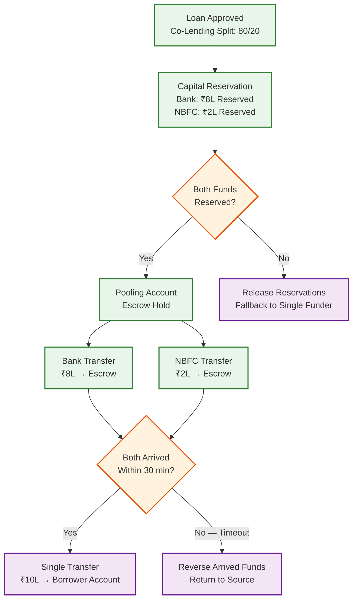

# 14.1 AI-Native MSME Credit Scoring & Lending Platform — Deep Dives & Bottlenecks

## Deep Dive 1: Alternative Data Credit Scoring for Thin-File Borrowers

### The Feature Engineering Challenge

Traditional credit scoring uses ~30 features derived from bureau tradelines (payment history, utilization, age of accounts, enquiry count). The thin-file model must construct equivalent predictive power from alternative data sources that are noisier, less standardized, and domain-specific. The platform extracts 200+ features organized into feature families:

**Cash Flow Features (from bank statements):**
1. **Income stability:** coefficient of variation of monthly credits; ratio of recurring credits (same source, similar amount) to total credits; longest streak of consecutive months with income above median.
2. **Expense discipline:** ratio of discretionary spending (entertainment, dining) to essential spending (rent, utilities, EMI); month-over-month expense growth rate; cash withdrawal frequency (high cash usage correlates with informal economy participation).
3. **Balance management:** minimum monthly balance divided by average monthly debit (cash cushion ratio); frequency of near-zero balance days; overdraft/insufficient-fund incident count.
4. **EMI burden:** total identified EMI payments as a fraction of total income; number of active loan obligations detected from bank statement (more reliable than bureau for informal loans).
5. **Business cash flow cycle:** average days between purchase payments and sales receipts (working capital cycle); invoice-to-payment conversion rate; seasonal revenue pattern (Fourier analysis of 12-month credit history).

**GST Compliance Features:**
6. **Filing regularity:** percentage of filings submitted on time over 12 months; longest consecutive on-time filing streak.
7. **Revenue verification:** ratio of GST-reported revenue (GSTR-1 outward supply) to bank statement credit totals; systematic deviation >20% flags either revenue underreporting (tax evasion) or bank statement manipulation.
8. **Input credit ratio:** ratio of input tax credit claimed to output tax—unusually high ratios suggest invoice trading (claiming fake input credits), which correlates strongly with default risk.
9. **Inter-state vs. intra-state:** fraction of sales to other states indicates business scale and diversification; purely local businesses have higher concentration risk.

**UPI Transaction Graph Features:**
10. **Network diversity:** number of unique counterparties (both paying and receiving); highly concentrated counterparty networks (>50% of revenue from one buyer) indicate revenue concentration risk.
11. **Transaction regularity:** entropy of inter-transaction intervals; regular business transactions have low entropy (customers pay at predictable intervals); irregular patterns suggest ad-hoc/unreliable revenue.
12. **Business vs. personal classification:** fraction of UPI transactions classified as business-purpose (merchant codes, B2B payment identifiers) vs. personal (person-to-person, family transfers); high personal ratio on a business account suggests comingling of funds.

### Model Architecture for Missing Data

The critical challenge is that different borrowers have different subsets of features available. Borrower A has bank statements + GST but no UPI history. Borrower B has UPI + psychometric but no bank statements. A single model trained on the full 200-feature vector would fail on borrowers with missing features.

**Solution: Missingness-Aware Gradient Boosted Trees**

The champion thin-file model is a gradient-boosted tree ensemble (500 trees, max depth 7) trained with two techniques for handling missing features:

1. **Native missing-value handling:** Gradient-boosted trees naturally handle missing values by learning optimal "default directions" at each split node. During training, for each split, the algorithm tries both left and right directions for missing values and chooses the one that minimizes the loss. This means the model learns "if bank_statement_income is missing, this borrower is more likely to be X" directly from the data.

2. **Intentional feature dropout:** During training, random subsets of feature families are masked with probability proportional to real-world missingness rates. If 30% of applications lack GST data, then 30% of training samples have all GST features masked. This forces the model to build prediction paths that do not depend on any single data source.

**Calibration by data completeness:** After scoring, the model's predicted probability is recalibrated based on the number of available features. A borrower scored on 80/200 features receives a wider confidence interval than one scored on 180/200 features. The underwriting decision engine treats confidence interval width as a risk factor: wider intervals → more likely to route to manual review.

### Slowest part of the process: Bank Statement Narration Parsing Accuracy

Bank statement transaction narrations are the single most important data source for thin-file scoring, but their format varies wildly across banks:

- **Bank A:** `NEFT CR 0039281847 RAJESH TRADERS MUMBAI` — structured, parseable
- **Bank B:** `BIL/BPAY/001234/AIRTEL` — utility payment with provider-specific codes
- **Bank C:** `UPI/JANE@OKSBI/PAYMENT FOR GOODS` — UPI with freeform purpose
- **Bank D:** `TRF FROM A/C XXXXX1234` — minimal information, no counterparty name

Misclassification of a ₹50,000 monthly credit as "salary" (stable income) vs. "business revenue" (variable) vs. "loan disbursement" (debt) fundamentally changes the cash flow assessment and credit decision.

**Mitigation:**
- **Bank-specific parsers:** Maintain 50+ bank-specific regular expression libraries for narration formats. Each parser is trained on labeled samples from that bank and versioned independently.
- **Fallback ML classifier:** When rule-based parsing fails, a text classification model (TF-IDF + gradient-boosted tree, not deep learning—interpretability matters) classifies the transaction. Confidence threshold: if the classifier's confidence is <0.8, the transaction is flagged for manual categorization during underwriting review.
- **Consistency enforcement:** Post-classification, a consistency engine validates patterns: if the same counterparty appears 12 times at the same amount on the same day-of-month, it must be categorized consistently (likely EMI or salary). If a large credit is classified as "business revenue" but is preceded by a same-amount debit to the same counterparty 2 days earlier, it is reclassified as "transfer" (round-tripping to inflate revenue).

---

## Deep Dive 2: Fraud Detection in Digital MSME Lending

### The Irrevocable Disbursement Problem

In traditional lending, a 3–5 day processing window between approval and disbursement provides time for secondary verification. In instant digital lending, the window collapses to minutes. A fraudster who passes the automated credit model has 5 minutes to receive irrecoverable funds. This compresses the entire fraud detection pipeline into the real-time path:

**Application-Time Fraud (pre-disbursement, budget: 500 ms):**

1. **Synthetic Identity Detection (100 ms):** Cross-validate PAN, Aadhaar, and application name using fuzzy matching. Synthetic identities often combine a real Aadhaar (stolen or purchased) with a different PAN (fabricated or belonging to another person). The system checks: (a) PAN-Aadhaar name match score, (b) PAN-CKYC match, (c) Aadhaar demographic verification via UIDAI. A mismatch score >0.3 (on a 0–1 scale) triggers enhanced verification.

2. **Velocity Checks (20 ms):** Query a sliding-window counter for: applications from this borrower ID, applications from this device, applications from this IP subnet, applications from this phone number—across 1-hour, 24-hour, 7-day, and 30-day windows. Thresholds: >2 applications from the same person in 7 days, >5 applications from the same device in 7 days, >10 applications from the same IP subnet in 24 hours.

3. **Device Risk Assessment (50 ms):** Collect device fingerprint (screen resolution, installed fonts, OS version, battery state, accelerometer baseline—not just user-agent). Check against known-fraud device database. Flag: rooted/jailbroken devices, emulators, VPN/proxy usage, GPS spoofing (accelerometer shows no movement but GPS shows location change), device age <24 hours in the system.

4. **Income Verification (200 ms):** Cross-validate claimed income against bank statement credits and GST revenue. Income inflation ratio = claimed income / verified income. Ratio >1.5 flags income inflation. More subtle: claimed revenue of ₹10L/month with GST showing ₹3L and bank showing ₹5L suggests the borrower has multiple bank accounts not disclosed (legitimate) or is inflating income (fraud).

5. **Graph Query (200 ms):** Traverse the fraud graph 2 hops from the applicant's device, address, and bank account nodes. Count shared entities with existing borrowers. If the applicant shares a device with a defaulted borrower or shares an address with >3 active borrowers, escalate to manual review.

**Post-Disbursement Fraud Monitoring:**

1. **Loan Stacking Detection:** Digital lending makes it easy for borrowers to take loans from 10+ platforms simultaneously, exploiting the delay between loan disbursement and bureau reporting (1–7 days). The platform refreshes bureau data for all newly disbursed loans at T+3 days and T+7 days. If new tradelines appear that were not present at origination, the borrower is flagged for stacking. Severity: 1–2 new loans = monitoring; 3+ new loans = immediate collection escalation.

2. **Early Payment Default (EPD) Patterns:** Fraudulent borrowers often default on the first EMI. The system tracks first-EMI payment rates by origination cohort, device cluster, geography, and partner channel. A sudden spike in first-EMI defaults from a specific partner or geographic cluster triggers an immediate halt-and-investigate, because it often indicates an organized fraud ring operating through that channel.

3. **Behavioral Anomaly Detection:** Post-disbursement, the system monitors for behavioral changes that indicate fund diversion: immediate large withdrawal or transfer of disbursed amount to a different account (suggestive of fund siphoning); sudden cessation of UPI business transactions (business may have been fabricated); change of SIM or device immediately after disbursement.

### Slowest part of the process: Fraud Ring Detection at Scale

The fraud graph grows continuously (50M nodes, 200M edges). A single graph query traversing 2 hops from an applicant touches an average of 500 nodes (branching factor of ~20 per hop). At 85 applications/sec peak, this is 42,500 graph queries per second, each touching 500 nodes.

**Mitigation:**
- **Pre-computed neighbor index:** Maintain a materialized 2-hop neighbor map for every node in the graph. When a new application arrives, look up the applicant's phone, device, and address in the index to retrieve all connected borrowers in O(1) time. The index is updated asynchronously as new edges are added (new applications create new edges), with a maximum staleness of 5 minutes.
- **Partition by geography:** Fraud rings are typically geographically local (same city or pin code cluster). Partition the fraud graph by geographic region to limit query scope and enable distributed processing. Cross-region edges (rare but important) are replicated to both partitions.
- **Batch ring detection:** Full connected-component analysis for fraud ring identification runs as a daily batch job, not in the real-time path. Newly detected rings are marked in the index, and subsequent real-time queries check ring membership instantly.

---

## Deep Dive 3: Disbursement Orchestration with Irrevocable Payments

### The Disbursement Pipeline

The disbursement pipeline must execute multiple checks in sequence while maintaining sub-5-minute end-to-end latency:

1. **Pre-disbursement validation (100 ms):** Verify loan is in APPROVED state; check loan-level idempotency key (prevent double disbursement on retry); confirm disbursement amount matches approved amount minus processing fee.

2. **Penny-drop verification (5–10 seconds):** Transfer ₹1 to the beneficiary account and verify the account holder name matches the borrower's name. This confirms: (a) account exists, (b) account is active, (c) beneficiary matches (prevents disbursement to wrong account). If name match score <0.7, flag for manual verification. Penny-drop failures (account closed, IFSC invalid) abort the disbursement with a clear error message.

3. **Fraud gate (500 ms):** Re-run fraud scoring with any new signals (e.g., a bureau refresh that completed during underwriting may show new enquiries). If fraud score has increased above threshold since initial scoring, block disbursement and route to fraud review.

4. **Regulatory compliance check (50 ms):** Verify disbursement is to borrower's own account (RBI DLD 2025 requirement—no third-party disbursement); verify KFS (Key Fact Statement) was displayed and acknowledged; verify cooling-off period has not been invoked.

5. **Capital allocation (100 ms):** For co-lending arrangements, determine the capital split (bank vs. NBFC share) and route disbursement instructions to both funding partners. Atomicity: if the bank's disbursement fails, the NBFC's share must not be disbursed—the entire disbursement succeeds or fails as a unit.

6. **Fund transfer execution (30 seconds – 5 minutes):** Execute UPI/IMPS/NEFT transfer. UPI is near-instant (10–30 seconds); IMPS settles within 2 minutes; NEFT has batch processing windows (every 30 minutes). The system defaults to UPI for fastest settlement.

7. **Confirmation and e-mandate registration (parallel):** Upon successful fund transfer, immediately trigger e-mandate registration for automated EMI collection. The mandate registration runs asynchronously—it does not block disbursement confirmation—but if registration fails after 3 retries, the loan is flagged for manual mandate setup.

### The Double-Disbursement Problem

Network failures between the payment gateway and the platform can create a dangerous scenario: the platform sends a disbursement request, the payment processes it, but the acknowledgment is lost. The platform retries, potentially disbursing twice.

**Mitigation:**
- **Idempotency key per disbursement:** Every disbursement request carries a unique idempotency key (loan_id + attempt_number). The payment gateway deduplicates based on this key and returns the original result on retry.
- **Disbursement state machine with pessimistic locking:** The loan record's disbursement state is advanced through states (INITIATED → PENNY_DROP → FRAUD_CHECK → PROCESSING → COMPLETED) using pessimistic row-level locks. No concurrent process can move the state forward simultaneously.
- **Reconciliation daemon:** A background process compares platform disbursement records against payment gateway settlement reports every 15 minutes. Mismatches (platform shows PROCESSING but gateway shows COMPLETED) are auto-reconciled. Unmatched gateway debits trigger immediate investigation.

### Slowest part of the process: Payment Rail Availability and Latency Variability

UPI has 99.5% uptime but experiences degraded performance during peak hours (salary day, month-end). IMPS has higher reliability but lower throughput limits per bank. NEFT has batch windows that add up to 30 minutes of latency.

**Mitigation:**
- **Multi-rail failover:** If UPI fails, automatically fall back to IMPS, then NEFT. Each rail has a circuit breaker that opens after 3 consecutive failures, preventing the system from queuing disbursements on a down rail.
- **Rail health monitoring:** Track success rate and latency percentiles per payment rail per bank in real-time. Route disbursements to the healthiest rail for the destination bank.
- **Staggered peak avoidance:** During known high-traffic periods (salary day—1st and last day of month), prefer IMPS over UPI for better reliability, accepting the small latency increase.

---

## Deep Dive 4: Collection Optimization with ML-Driven Contact Strategy

### The Collection Waterfall Problem

With 10M active loans and a typical 5–8% delinquency rate at any time, the platform must manage 500K–800K delinquent loans across various stages. The collection challenge is resource allocation: with limited call center agents (500) and field collectors (200), which borrowers should be contacted first, through which channel, and at what time?

### ML-Optimized Contact Strategy

The collection optimization model predicts, for each delinquent borrower, the probability of payment given a specific action:

```
P(payment | borrower_features, action_type, contact_time, channel) → [0, 1]
```

**Borrower features:** DPD, loan vintage, credit score at origination, historical bounce count, cash flow trend (from ongoing AA monitoring), previous collection response (contacted → promised → paid vs. contacted → no answer), day of week, day of month (proximity to salary credit), outstanding amount.

**Action optimization:** For each delinquent loan, the model ranks all possible actions (SMS, WhatsApp, IVR, call center, field visit) by expected recovery × probability of success / cost of action. The optimizer then assigns actions to available resources:

- **SMS/WhatsApp/push (unlimited capacity, ₹0.50/contact):** Send to all borrowers DPD >1. Optimized: template selection (soft reminder vs. urgency vs. payment link) and timing (afternoon for salaried borrowers, morning for self-employed).
- **IVR call (10,000 calls/day capacity, ₹5/call):** Target borrowers DPD 7–30 who did not respond to SMS. Priority: sorted by P(payment | IVR) × outstanding amount.
- **Call center agent (500 agents × 20 calls/day = 10,000 calls, ₹50/call):** Target borrowers DPD 15–60 with high outstanding amount and moderate resolution probability. Agent assigned based on language match and borrower persona.
- **Field visit (200 collectors × 5 visits/day = 1,000 visits, ₹500/visit):** Target borrowers DPD 45+ who have not responded to remote contact. Route optimization: cluster visits geographically to minimize travel time.

### The Auto-Debit Retry Problem

e-NACH/e-mandate auto-debits have bank-specific success patterns:
- Bank A processes NACH on business days only, morning batch (6 AM)
- Bank B processes NACH twice daily (8 AM and 2 PM)
- Bank C has higher success rates on salary credit day (1st or 7th of month)

The collection system maintains a bank-specific auto-debit success rate matrix:

```
Bank A: Monday 6AM = 78% success, Tuesday 6AM = 75%, ...
Bank B: 1st of month = 85%, 15th = 72%, ...
```

Failed auto-debits are retried on the day/time combination with the highest historical success rate for that borrower's bank. Maximum 3 retries per billing cycle to avoid bank charges and customer complaints.

### Slowest part of the process: Regulatory Constraints on Collection Practices

RBI guidelines restrict collection practices: no contact before 8 AM or after 7 PM; no abusive language; grievance redressal mechanism for borrower complaints; outsourced collection agents must be registered. The platform must enforce these constraints programmatically:

**Mitigation:**
- **Contact window enforcement:** All outbound communication channels enforce the 8 AM – 7 PM window based on the borrower's registered time zone. IVR calls outside this window are queued for the next valid window.
- **Communication audit trail:** Every collection interaction (call recording, message content, timestamp) is logged immutably. Call recordings are randomly sampled and analyzed for compliance (10% of calls audited by AI-based speech analysis for prohibited language/threats).
- **Grievance integration:** Borrower complaints via any channel (app, email, regulator portal) automatically pause collection actions for that loan for 48 hours while the grievance is triaged. Escalation SLA: 7 days for first response, 15 days for resolution.

---

## Deep Dive 5: Model Governance and Fair Lending Compliance

### The Proxy Discrimination Problem

Alternative data features that predict creditworthiness can inadvertently discriminate against protected classes:

- **Geographic pin code:** Highly predictive (default rates vary 3x across pin codes) but correlates with caste and religious composition of neighborhoods.
- **Device model:** Flagship phone owners default less, but device price correlates with income which correlates with social class.
- **UPI merchant categories:** Frequency of transactions at religious institutions reveals religion; transactions at certain shops may correlate with dietary preferences linked to religion or region.
- **Psychometric language patterns:** Response patterns in financial literacy assessments may correlate with education quality, which varies by socioeconomic background.

### Fair Lending Framework

The platform implements a three-layer fairness framework:

**Layer 1: Feature Prohibition**
Explicitly prohibited features: religion, caste, gender, age (beyond legal limits), marital status, disability status. Also prohibited: direct geographic features below district level (pin code), specific merchant categories linked to religious or cultural identity.

**Layer 2: Adversarial Debiasing During Training**
During model training, an adversarial network attempts to predict protected attributes from the model's internal representations. The credit model is penalized for representations that enable this prediction—forcing the model to learn predictive features that are orthogonal to protected attributes. This reduces disparate impact without explicit feature removal (which is often insufficient because correlated features reconstruct the prohibited signal).

**Layer 3: Continuous Fairness Monitoring in Production**
Post-deployment, the fairness monitoring service computes approval rates, interest rates, and default rates disaggregated by protected attributes (obtained from KYC data with appropriate legal basis). Key metrics:

- **Equalized odds:** True positive rate (approval rate for non-defaulters) and false positive rate (approval rate for defaulters) should be similar across groups.
- **Demographic parity difference:** Approval rate gap between groups should not exceed 5 percentage points.
- **Interest rate disparity:** Average APR difference between groups should not exceed 200 basis points after controlling for risk grade.

When a metric breaches its threshold, the model governance team is alerted with a detailed diagnostic showing which features are driving the disparity. The model may be pulled from production if the disparity cannot be explained by legitimate risk factors.

### Slowest part of the process: Fairness-Accuracy Trade-off

Adversarial debiasing reduces model Gini coefficient by 2–5 points (on a 40–55 Gini scale). This means the debiased model makes more errors (approving borrowers who will default, declining borrowers who would repay) than the unconstrained model. The business must accept this accuracy loss as the cost of fair lending.

**Mitigation:**
- **Fairness-accuracy Pareto frontier:** Train models at multiple fairness constraint levels and present the trade-off curve to stakeholders. The production model is chosen at the "knee" of the curve where further fairness improvement requires disproportionate accuracy loss.
- **Segment-specific fairness:** Apply stricter fairness constraints for segments where proxy discrimination is most likely (e.g., geographically concentrated customer base) and relaxed constraints where the risk of discrimination is lower (e.g., bureau-plus segment where bureau score dominates).
- **Counterfactual explanations for monitoring:** For each declined application in a protected group, the system generates a counterfactual: "Would this application be approved if the borrower were in the majority group with all other features unchanged?" If the answer is yes for >5% of declines, the model has a fairness issue regardless of aggregate metrics.

---

## Deep Dive 6: Co-Lending Capital Orchestration

### The Atomic Disbursement Problem

In co-lending arrangements, a single loan is funded by two entities—typically a bank (80% share) and an NBFC (20% share). The disbursement must be atomic: either both funding shares reach the borrower's account, or neither does. But the two funding partners use different payment rails, have different processing times, and may experience independent failures.

**The race condition:** Bank X approves its 80% share and initiates transfer via IMPS (completes in 2 minutes). NBFC Y approves its 20% share but its NEFT transfer is queued for the next batch window (30 minutes). The borrower sees 80% of the loan amount credited and calls support. Worse: if the NBFC's transfer fails after the bank's succeeds, the borrower has received a partial loan amount that does not match the KFS terms.

### Orchestration Architecture



**Key design choices:**
1. **Escrow pooling:** Both funders transfer to a platform escrow account first. Only when both amounts arrive does a single consolidated transfer go to the borrower. This ensures the borrower sees exactly one credit for the full loan amount (regulatory requirement: borrower should not know about the co-lending split).
2. **Capital reservation with TTL:** Before initiating transfers, the system "reserves" capital from both funders' allocated pools. Reservations have a 30-minute TTL—if both transfers do not complete within 30 minutes, reservations are released and the disbursement is retried or failed.
3. **Fallback routing:** If one funder is unavailable (capital exhausted, system down), the system can route the entire loan to a secondary funder at a different rate. This requires dynamic APR recalculation and a new KFS before proceeding.

### Slowest part of the process: Settlement Reconciliation Across Funders

Each funder maintains its own loan accounting. The platform must reconcile every EMI payment across both funders' books:

```
Monthly reconciliation per co-lent loan:
  EMI received: ₹18,420
  Bank share (80%): ₹14,736 → credited to Bank X's settlement account
  NBFC share (20%): ₹3,684 → credited to NBFC Y's settlement account
  Platform fee: deducted per agreed revenue share

  10M active loans × 30% co-lent = 3M co-lent loans
  3M × daily settlement file generation = 3M line items per day
  Reconciliation mismatches (rounding, partial payments, prepayments): ~0.5%
  15,000 mismatches per day requiring automated resolution or manual investigation
```

---

## Deep Dive 7: Early Warning System — Predicting Default 60–90 Days Ahead

### The Multi-Signal Fusion Problem

Individual early warning signals are noisy—a single missed GST filing might indicate business trouble or simply an accountant's delay. The system must fuse signals across multiple data domains to distinguish genuine distress from noise.

### Signal Taxonomy

```
Signal Category 1: Financial Deterioration (from AA monitoring)
  - Cash flow: 30% decline in net monthly cash flow over 3 months
  - Balance: Minimum daily balance drops below 1-day operating expenses
  - Revenue: Month-over-month revenue decline for 3 consecutive months
  - EMI burden: New EMI obligations detected (stacking indicator)

Signal Category 2: Compliance Decay (from GST/bureau monitoring)
  - GST filing gap: 2+ consecutive months of missed filings
  - Bureau enquiry spike: >5 enquiries in 30 days (seeking credit elsewhere)
  - External delinquency: DPD >30 on any other tradeline
  - Credit utilization surge: utilization crosses 90% on revolving credit

Signal Category 3: Behavioral Shift (from transaction monitoring)
  - UPI volume decline: >50% drop in business transaction frequency
  - Cash withdrawal spike: >3x normal cash withdrawal activity
  - Discretionary spending: sudden increase in non-essential spending
  - Payment pattern: EMI payments shifting from auto-debit to manual (suggests conscious avoidance)

Signal Category 4: External Triggers (macro/sector signals)
  - Sector distress: industry-wide default rate increase
  - Geographic event: natural disaster, regulatory change, or market disruption in borrower's region
  - Supply chain: key supplier/buyer default detected via graph analysis
```

### Fusion Model Architecture

The early warning model uses a two-stage architecture:

**Stage 1: Per-Domain Risk Score (daily batch)**
Each signal domain produces an independent risk score using domain-specific models:
- Financial risk model: time-series features from cash flow → logistic regression
- Compliance risk model: filing gaps + bureau signals → decision tree
- Behavioral risk model: transaction pattern deviations → isolation forest (anomaly detection)
- External risk model: sector/geo indicators → lookup table with manual overrides

**Stage 2: Fusion Model (daily batch)**
A gradient-boosted meta-model combines the four domain scores with loan-level context (DPD history, loan vintage, product type, origination risk grade) to produce a unified EWS score. The fusion model learns interaction effects that individual models miss: a borrower with declining cash flow AND increasing bureau enquiries AND decreasing UPI volume is at far higher risk than the sum of individual signals suggests—the combination indicates active financial distress plus desperate credit-seeking behavior.

### Slowest part of the process: Consent Dependency for Financial Monitoring

Ongoing financial monitoring via AA requires active consent. If a borrower's AA consent expires at month 6 and they do not renew it, the platform loses real-time visibility into cash flow, GST compliance, and UPI patterns—precisely the signals that drive the most predictive early warning features.

**Mitigation:**
- **Consent renewal nudges:** The system sends renewal reminders at consent_expiry - 30 days, - 14 days, and - 3 days. Framed as a benefit: "Renew data sharing to unlock higher credit limits and better rates."
- **Degraded EWS mode:** When AA consent is not available, the EWS model falls back to bureau-only + behavioral signals (auto-debit success/failure patterns, communication responsiveness). Accuracy degrades from AUC 0.82 (full signals) to AUC 0.68 (bureau + behavioral only)—still useful but with higher false positive rates.
- **Incentive alignment:** Borrowers who maintain active AA consent receive 25 bps rate reduction on their next loan—creating a financial incentive for ongoing data sharing that benefits both parties.

---

## Deep Dive 8: Document Forgery Detection Pipeline

### The Adversarial Document Problem

As digital lending scales, document forgery becomes industrialized. Fraud rings use sophisticated tools to create bank statements, GST returns, and KYC documents that pass superficial verification. The platform must detect forgeries across three levels of sophistication:

**Level 1: Naive Forgery (detectable by metadata analysis)**
The forger edits a legitimate PDF using consumer tools (image editors, PDF editors). Detection signals:
- PDF producer field shows editing software (e.g., "Adobe Photoshop" instead of the bank's statement generation system)
- Creation date and modification date mismatch (modified after the statement period ended)
- Font metadata inconsistency: the bank uses proprietary fonts for statements; edited text uses standard system fonts
- Document structure: bank-generated PDFs have specific internal structure markers; edited PDFs lack these

**Level 2: Template Forgery (detectable by content analysis)**
The forger uses a template matching the bank's format and fills in fabricated transactions. Detection signals:
- Transaction narration patterns inconsistent with the bank's actual format (e.g., UPI narrations use a format the bank discontinued 6 months ago)
- Running balance computation errors: legitimate statements compute the running balance correctly to the paisa; fabricated statements occasionally have rounding errors
- Transaction sequence anomalies: legitimate statements show monotonically increasing timestamps within a day; fabricated statements may show irregular ordering
- Cross-validation failure: revenue shown in bank statements does not match GST returns within expected tolerance (±20%)

**Level 3: Sophisticated Forgery (detectable by behavioral analysis)**
The forger creates a complete set of consistent documents (bank statements, GST returns, invoices) that pass individual verification. Detection signals:
- Transaction pattern entropy: real bank statements show natural entropy in transaction amounts and timing; fabricated statements tend toward suspiciously regular patterns
- Counterparty verification: fabricated statements often reference businesses that do not exist in the GST registry or have been flagged as shell entities
- Device-document correlation: the device used to upload documents has no prior history in the system, was activated recently, or has been used to upload documents for multiple unrelated applications
- Network signal: multiple applications sharing similar fabricated document templates (same transaction amounts on same dates across different applicants)

### Detection Pipeline Architecture

```
Document forgery detection pipeline (budget: 2 seconds):

Stage 1: Metadata Analysis (50 ms)
  - PDF producer verification against known bank producers
  - Creation/modification date consistency check
  - Font inventory analysis (expected vs. detected fonts)
  - Verdict: PASS / FAIL / INCONCLUSIVE

Stage 2: Structural Analysis (200 ms)
  - Running balance recomputation and verification
  - Transaction timestamp sequence validation
  - Bank-specific format compliance (header, footer, watermark presence)
  - Verdict: PASS / FAIL / INCONCLUSIVE

Stage 3: Content Cross-Validation (500 ms)
  - Bank statement revenue vs. GST-declared revenue comparison
  - Salary credit amounts vs. employer verification
  - EMI deductions vs. bureau-reported tradelines
  - Verdict: PASS / FAIL / INCONCLUSIVE

Stage 4: Behavioral Analysis (1,000 ms) — triggered only if Stages 1-3 inconclusive
  - Transaction pattern entropy scoring
  - Counterparty existence verification (GST registry lookup)
  - Similarity analysis against known forgery templates
  - Verdict: PASS / FAIL / MANUAL_REVIEW

Overall disposition:
  - Any stage FAIL → AUTO_BLOCK (flag for fraud review)
  - All stages PASS → AUTO_PASS
  - Any INCONCLUSIVE + other PASS → MANUAL_REVIEW (human document reviewer)
  - Stage 4 FAIL → AUTO_BLOCK with fraud ring investigation trigger
```

### Slowest part of the process: Evolving Forgery Techniques

Document forgers adapt rapidly. A forgery technique that the system blocks in January may be modified by February to bypass detection. The detection system must evolve continuously:

**Mitigation:**
- **Adversarial training data:** Deliberately generate synthetic forged documents (using the known forgery techniques) and train detection models on a mix of legitimate and synthetic forgeries. This "red team" approach ensures the model has seen forgery patterns before they appear in production.
- **Forgery pattern sharing:** When a new forgery technique is detected (by human reviewers or through fraud investigation), the pattern is codified as a detection rule and deployed within 24 hours. A "forgery pattern library" maintains a versioned catalog of known techniques.
- **Continuous learning loop:** Documents flagged by human reviewers as forged are fed back into the training pipeline. The model is retrained monthly with an expanding corpus of real-world forgery examples, keeping detection rates ahead of forger adaptation.

---

## Deep Dive 9: Graph Neural Networks for Fraud Ring Detection

### Beyond Connected Components: Learning Fraud Topology

Traditional fraud ring detection uses static graph algorithms (connected component analysis, community detection) to identify clusters of related borrowers. These methods detect obvious fraud rings (10 applications from the same device) but miss sophisticated rings where connections are intentionally sparse (each fraudster uses a unique device but shares a single bank account with one other member, creating a chain rather than a cluster).

### GNN Architecture for Fraud Scoring

The platform uses a heterogeneous graph neural network that learns fraud patterns from the topology itself:

```
Graph construction:
  Node types: Borrower, Device, Address, BankAccount, PhoneNumber, IPAddress
  Edge types: used_device, lives_at, has_account, has_phone, applied_from_ip
  Edge attributes: timestamp, edge_weight (number of interactions)
  Node features: application count, default count, fraud flag history,
                 first_seen timestamp, last_active timestamp

GNN architecture:
  Layer 1: GraphSAGE neighborhood aggregation (2-hop)
    - For each node, aggregate features from 1-hop and 2-hop neighbors
    - Attention mechanism weights neighbor importance
      (a device shared by 2 borrowers is more suspicious than an address
       shared by 2 borrowers in a multi-unit building)
    - Output: 64-dimensional node embedding

  Layer 2: Temporal attention
    - Weight neighbor contributions by temporal proximity
    - Applications submitted within 48 hours of each other get higher
      attention weights than applications 6 months apart
    - This encodes the key insight: temporal coordination distinguishes
      fraud rings from legitimate co-location

  Layer 3: Classification head
    - Binary classification: fraud_ring_member / legitimate
    - Trained on labeled fraud investigations (confirmed rings)
    - Output: per-node fraud probability

Inference pipeline:
  - New application arrives → create borrower node + edges to device, address, etc.
  - Compute 2-hop subgraph around the new node
  - Run GNN inference on the subgraph (5-10ms on GPU, 50-100ms on CPU)
  - If fraud probability > threshold → route to fraud review queue
  - If connected component contains > 3 nodes with elevated probability → ring alert

Training cadence:
  - Full retrain: monthly (on updated graph with confirmed fraud labels)
  - Incremental embedding update: daily (new nodes/edges update embeddings
    using the frozen GNN weights—no full retrain needed)
```

### Performance Comparison

| Method | Precision | Recall | F1 | Latency |
|---|---|---|---|---|
| Rule-based velocity checks | 85% | 30% | 0.44 | 20ms |
| Connected component analysis | 55% | 60% | 0.57 | 200ms |
| GNN (GraphSAGE + temporal) | 78% | 72% | 0.75 | 100ms |
| GNN + rule ensemble | 82% | 70% | 0.76 | 120ms |

The GNN approach achieves 35% higher F1 than static graph analysis, primarily by reducing false positives (legitimate co-located borrowers no longer flagged) while maintaining recall on sophisticated fraud rings that evade rule-based detection.

### Slowest part of the process: GNN Inference Latency on Large Subgraphs

High-degree nodes (a popular co-working address connected to 500+ borrowers) create large 2-hop subgraphs that exceed the 200ms latency budget. The neighborhood sampling strategy (sample 25 1-hop and 10 2-hop neighbors per node) keeps inference tractable but may miss relevant connections.

**Mitigation:**
- **Importance-weighted sampling:** Instead of uniform random neighbor sampling, weight neighbors by suspicion score (prior fraud flags, recent application velocity). This focuses the GNN's attention on the most relevant connections rather than random neighbors.
- **Pre-computed embeddings for high-degree nodes:** For addresses/devices connected to 100+ borrowers, pre-compute and cache the node embedding daily. Real-time inference uses the cached embedding rather than computing from the full neighborhood.

---

## Autonomy Boundary Analysis

### What AI Can Decide Alone
- Document extraction and OCR from financial statements
- Data enrichment from alternative data sources (GST filings, bank statement parsing)
- Pre-qualification scoring for initial eligibility filtering
- Fraud signal detection and flagging
- Auto-categorization of business type and risk segment

### What AI Can Recommend But Not Execute
- Credit score and risk grade assignment
- Loan amount and interest rate recommendations
- Repayment schedule optimization
- Collateral valuation estimates
- Early warning signals for portfolio monitoring

### What Requires Human Approval
- Final credit approval or rejection
- Loan disbursement authorization
- Restructuring or write-off decisions
- Credit limit increases beyond policy thresholds
- Regulatory reporting submissions

### Deterministic Source of Truth
The Loan Management System (LMS) is the system of record. AI writes to a recommendation layer only — credit decisions, disbursements, and regulatory filings require human action through the deterministic lending workflow with full audit trail.

### Rollback Path
Credit officers can override any AI-generated score or recommendation. All overrides are logged with rationale for regulatory audit. AI recommendations and human decisions are tracked separately to enable model performance analysis and bias detection.
