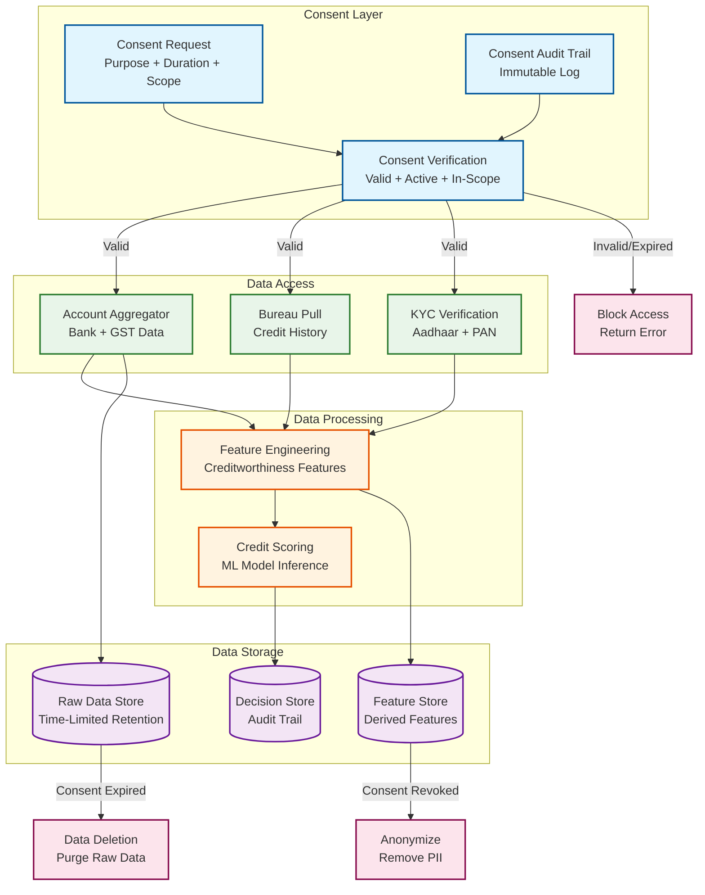

# 14.1 AI-Native MSME Credit Scoring & Lending Platform — Security & Compliance

## Regulatory Landscape

MSME digital lending platforms operate under an evolving regulatory framework that prescribes specific technical requirements for data handling, customer transparency, and lending practices. Unlike traditional banking regulations that focus on capital adequacy and provisioning, digital lending regulations address the technology stack directly—mandating how data flows between parties, what must be disclosed to borrowers, and how automated decisions must be explained.

### RBI Digital Lending Directions 2025

The Reserve Bank of India's consolidated Digital Lending Directions, effective May 2025, replaced earlier circulars to create a unified compliance framework:

| Directive | Requirement | Platform Impact |
|---|---|---|
| Direct disbursement | Loan must be disbursed directly to borrower's bank account; no pass-through via LSP or third-party accounts | Disbursement orchestrator must verify beneficiary account is borrower's own; no pooling account disbursement |
| Fee transparency | All fees (processing, insurance, documentation) must be disclosed upfront; no deduction from disbursement amount | KFS generator must compute total cost including all fees; disbursement amount = approved amount minus fees shown separately |
| Cooling-off period | Borrower can cancel the loan within a specified period (typically 3 days) and return principal without penalty | Loan lifecycle must support CANCELLED state; refund flow within 24 hours of cancellation request |
| Key Fact Statement (KFS) | Standardized document showing APR, total cost, repayment schedule, fees, and penalties before disbursement | KFS generation service with regulatory-compliant template; KFS must be acknowledged by borrower |
| Grievance redressal | Multi-tier grievance mechanism: LSP → regulated entity → RBI Ombudsman; resolution within 15 days | Grievance management service with SLA tracking; escalation automation; auto-pause collection on active grievance |
| DLA registration | Digital Lending Apps must be registered with regulator; unregistered apps cannot originate loans | App store compliance; DLA registration ID in all communications |
| Data minimization | Collect only data necessary for lending purpose; no access to phone gallery, contact list, or call logs (with narrow exceptions) | Permission controls in mobile app; technical enforcement of data minimization; audit trail for all data access |
| Consent-based access | All borrower data access must be through explicit consent with defined purpose, duration, and data scope | AA integration for financial data; separate consent for each data type; consent revocation mechanism |
| LSP oversight | Lending Service Providers (technology/marketing intermediaries) must be governed by the regulated entity | Partner management system with contractual compliance tracking; real-time monitoring of partner activities |

### Fair Lending and Anti-Discrimination

| Framework | Key Requirements |
|---|---|
| Equal access | No discrimination in lending decisions based on religion, caste, gender, disability, or geography |
| Model governance | Documented model development, validation, and monitoring processes; ability to explain decisions |
| Adverse action notices | Specific, actionable reasons for every denial; reasons must reflect actual decision drivers, not generic templates |
| Disparate impact monitoring | Continuous monitoring of approval rates, pricing, and default rates across demographic segments |

---

## Data Privacy Architecture

### Consent Management System



### Data Classification and Retention

| Data Type | Classification | Retention | Access Control | Encryption |
|---|---|---|---|---|
| Aadhaar number | Restricted PII | Duration of relationship + 5 years | Masked display (XXXX-XXXX-1234); full access only for eKYC verification | AES-256; stored in separate vault with per-field encryption |
| PAN number | PII | Duration of relationship + 8 years | Masked in logs; accessible to KYC and underwriting teams | AES-256 |
| Bank statement (raw) | Confidential financial data | 90 days from fetch (consent-bound) | Feature engineering pipeline only; raw data purged after feature extraction | AES-256; transit via TLS 1.3 from AA |
| Derived features | Internal / non-PII (aggregated) | Loan lifecycle + 8 years | Credit scoring and analytics teams | Column-level encryption for sensitive features |
| Credit decision + reasons | Regulatory record | 8 years from decision date | Audit team, borrower (own decisions), regulator | AES-256; tamper-evident chain |
| Phone number / email | PII | Duration of relationship + 2 years | Communication and collection teams | Standard encryption |
| Device fingerprint | Pseudonymous | 1 year (rolling) | Fraud detection service only | Hashed; raw fingerprint never stored |
| Psychometric responses | Sensitive personal data | Duration of assessment purpose | Psychometric scoring engine only | AES-256; access-logged |

### Data Minimization Enforcement

```
Technical enforcement:
  Mobile app:
    - Permissions requested: camera (for document scan), location (one-time for address verification)
    - Permissions NOT requested: contact list, call logs, SMS inbox, photo gallery
    - Permission usage audit: all camera/location accesses logged with timestamp and purpose
    - If app requests prohibited permission, app store listing compliance fails

  API layer:
    - Request body validation: reject API calls that include non-required fields
    - Response filtering: PII fields masked by default; full access requires explicit scope
    - Query logging: all database queries logged with requester identity and purpose

  Data pipeline:
    - Feature engineering pipeline receives only derived features, not raw PII
    - Model training data: PII stripped; borrower_id replaced with anonymized token
    - Analytics warehouse: contains only aggregated, anonymized data
    - PII access: separate "vault" service with per-field access control and audit logging
```

---

## Application Security

### Authentication and Authorization

```
Borrower authentication:
  - Mobile OTP (primary): OTP sent to registered mobile number
  - Aadhaar OTP: for eKYC verification
  - Biometric (optional): fingerprint or face recognition for high-value transactions
  - Session management: 15-minute inactivity timeout; re-authentication for sensitive actions
    (loan agreement signing, disbursement confirmation)

Partner API authentication:
  - OAuth 2.0 with client credentials flow
  - API key rotation: mandatory every 90 days
  - IP whitelisting: partner API calls accepted only from registered IP ranges
  - Rate limiting: per-partner, per-endpoint rate limits (100 applications/minute default)
  - Request signing: all API requests signed with HMAC-SHA256 using partner secret key

Internal service authentication:
  - mTLS between all microservices
  - Service-to-service authorization via policy engine
  - Short-lived tokens (5-minute TTL) for inter-service API calls
  - Service identity managed via certificate authority (auto-rotation every 30 days)
```

### Fraud Prevention Security Controls

```
Document forgery detection:
  - PDF metadata analysis: check creation date, modification date, PDF producer software
    Forged PDFs often have inconsistent metadata (e.g., bank statement PDF created by
    photo editing software instead of bank's statement generation system)
  - Font consistency check: legitimate bank statements use 1-2 fonts consistently;
    tampered statements show font variations at tampered fields
  - Digital signature verification: bank-signed PDFs verified against bank's public certificate
  - Content consistency: numeric values cross-validated (sum of transactions matches
    closing balance; GST amounts match declared rates)

Identity verification:
  - Aadhaar verification: demographic + biometric via UIDAI (when permitted)
  - PAN verification: name + DOB match via income tax database
  - CKYC (Central KYC): single-source identity verification across financial institutions
  - Liveness detection: for video KYC, detect pre-recorded video or deepfake attempts
    using frame analysis (eye blink patterns, micro-expression consistency, background
    continuity)

Anti-money laundering:
  - Transaction monitoring: flag transactions > ₹10L (regulatory threshold)
  - Pattern detection: structuring (multiple transactions just below threshold),
    round-tripping (funds sent and received between same parties), rapid fund movement
    (disbursement immediately transferred to another account)
  - PEP/sanctions screening: check borrower against PEP (Politically Exposed Persons)
    lists and sanctions databases at application time
  - STR (Suspicious Transaction Report): automated filing for threshold breaches;
    manual review for pattern-based suspicions
```

---

## Model Security and Governance

### Model Risk Management

```
Model development lifecycle:
  1. Feature selection: documented rationale for each feature; prohibited feature list
     enforced at feature engineering pipeline level
  2. Training data: bias audit on training data composition (demographic distribution
     should match target population); data quality checks (missing values, outliers)
  3. Model training: fairness constraints applied during training (adversarial debiasing);
     cross-validation on out-of-time sample (not random split—temporal split to simulate
     production deployment)
  4. Validation: independent model validation team reviews model performance,
     fairness metrics, and explainability before approval
  5. Shadow deployment: new model runs in shadow mode (scores all applications but
     does not affect decisions) for 30 days minimum
  6. Champion-challenger promotion: challenger model promoted only after statistical
     test confirms superior performance on 90-day vintage
  7. Production monitoring: continuous drift monitoring (PSI, Gini degradation),
     fairness monitoring, and explainability audits

Model governance documentation (maintained per model):
  - Model card: purpose, training data, performance metrics, known limitations
  - Fairness report: demographic parity, equalized odds, interest rate disparity
  - Feature importance: top 20 features with SHAP values and business interpretation
  - Validation report: out-of-time performance, stress test results
  - Approval record: who approved, when, under what conditions
```

### Adversarial Attack Protection

```
Model evasion attacks:
  - Threat: borrowers learn which features matter and manipulate them
    (e.g., create artificial UPI transaction patterns to inflate business volume score)
  - Defense: feature engineering uses tamper-resistant features
    (transaction counterparty diversity is harder to fake than volume;
    consistency of patterns over 6 months is harder to fabricate than 1-month spike)
  - Defense: ensemble of diverse models—manipulating features to fool one model
    may not fool others that use different feature combinations

Model extraction attacks:
  - Threat: repeated API calls to infer model decision boundary
  - Defense: rate limiting on credit assessment API (5 queries per borrower per day)
  - Defense: SHAP explanations limited to top 5 features (not full feature attribution)
  - Defense: add controlled noise to score (±0.5% of PD) without affecting decision
    (prevents exact boundary mapping)

Training data poisoning:
  - Threat: fraudulent loans deliberately constructed to influence future model training
    (e.g., fraud ring takes and repays small loans to establish "clean" training data,
    then takes large loans and defaults)
  - Defense: training data weighted by loan amount (large defaults get higher weight)
  - Defense: cohort-based anomaly detection in training data
    (unusually clean repayment patterns in high-risk demographics flagged for review)
```

---

## Compliance Automation

### Key Fact Statement (KFS) Generation

```
KFS generation pipeline:
  Triggered: at loan approval, before borrower acceptance
  Content (regulatory-mandated fields):
    - APR (Annual Percentage Rate) computed using IRR method on all cash flows
      including processing fee, insurance premium, and penalties
    - Total amount payable (principal + total interest + all fees)
    - EMI amount and schedule
    - Processing fee (amount and percentage)
    - Penal charges for late payment
    - Cooling-off period (number of days; conditions for cancellation)
    - Grievance redressal mechanism and contact details
    - Lender details (regulated entity, license number)
    - LSP details (lending service provider, if applicable)

  Computation:
    APR = IRR of cash flow series:
      [disbursed_amount, -emi_1, -emi_2, ..., -emi_n]
    where each EMI includes principal, interest, and any amortized fees
    APR must include ALL costs (no hidden charges)

  Delivery:
    - Displayed in-app before loan acceptance
    - Emailed to registered email
    - Available for download from borrower portal for 8 years
    - Stored in audit trail with timestamp of display and borrower acknowledgment
```

### Regulatory Reporting

```
Automated regulatory reports:
  RBI returns:
    - Monthly: disbursement volume, outstanding portfolio, NPA ratios, interest rate distribution
    - Quarterly: sector-wise lending, geographic distribution, digital lending app metrics
    - Annual: model governance report, grievance summary, fair lending analysis
    - Ad-hoc: response to regulatory queries with data extraction from audit trail

  Bureau reporting:
    - Monthly: report all active loans, EMI payment status, delinquency to credit bureaus
    - Reporting lag: ≤ 15 days from month-end (regulatory requirement)
    - Dispute handling: borrower-initiated disputes on bureau records tracked to resolution

  AML reporting:
    - Real-time: CTR (Cash Transaction Report) for transactions > ₹10L
    - As-needed: STR (Suspicious Transaction Report) for flagged patterns
    - Monthly: summary of AML screening results to compliance officer

  Consent reporting:
    - Real-time: AA consent status dashboard (active, expired, revoked)
    - Monthly: data access audit report (which data was fetched, for what purpose, by whom)
```

---

## Deepfake and Advanced Identity Fraud Countermeasures

### Video KYC Deepfake Detection

Video KYC mandated by regulators is increasingly targeted by real-time deepfake technology. Fraudsters use GAN-generated face swaps overlaid on live video feeds, combined with voice cloning for spoken liveness checks. Industry estimates suggest 2–5% of video KYC attempts at some digital lenders showed manipulation artifacts by mid-2025.

```
Deepfake detection pipeline:

Layer 1: Passive Liveness Detection
  - Micro-expression analysis: genuine faces exhibit involuntary micro-expressions
    (pupil dilation, micro-muscle movements) that deepfakes cannot reproduce
  - Skin texture analysis: real skin has pores, moles, and texture variations;
    deepfakes show unnatural smoothness or texture repetition
  - Physiological signal detection: extract pulse signal from facial color changes
    (photoplethysmography); deepfakes lack consistent pulse patterns
  - Reflection analysis: check for consistent light reflection in eyes and skin;
    deepfakes often produce inconsistent or missing specular reflections

Layer 2: Injection Attack Detection
  - Camera sensor fingerprinting: genuine video comes from physical camera sensors
    with unique noise patterns; virtual cameras (used to inject deepfake video)
    lack these sensor-specific noise signatures
  - Video pipeline analysis: detect whether the feed originates from a real camera
    sensor or a software pipeline (OBS, ManyCam, virtual camera drivers)
  - Metadata consistency: frame rate, resolution, and encoding parameters should
    match the declared device hardware; injected feeds show inconsistencies

Layer 3: Challenge-Response Protocol
  - Random physical action requests: "Touch your right ear with your left hand"
    (unpredictable actions that real-time deepfakes struggle to render correctly)
  - Variable head angle requests: rapidly changing angles expose rendering artifacts
    in face-swap deepfakes (especially around ears, jawline, and hairline)
  - Environmental interaction: "Hold your ID card next to your face" — requires
    the deepfake to render both face and document simultaneously, which current
    face-swap technology handles poorly

Layer 4: Multi-Signal Cross-Validation
  - Compare biometric embeddings across 3 independent sources:
    (a) PAN card photo, (b) Aadhaar XML photo, (c) live video KYC capture
  - Each comparison uses a different face recognition model (prevents single-model
    evasion); all three must agree within threshold for KYC to pass
  - Mismatch in any pair triggers manual review by trained video KYC operator
```

### Consortium-Based Loan Stacking Detection

Industry data suggests 8–12% of digital MSME loans in India have some degree of stacking. Consortium-based detection provides a real-time shared intelligence layer:

```
Stacking detection architecture:

Pre-Sanction Check (real-time, < 200ms):
  1. Hash the applicant's PAN, phone number, and device fingerprint
  2. Query the consortium database for recent applications/sanctions
     matching any of these hashed identifiers
  3. Response: count of applications in last 7/30 days, count of sanctions
     in last 7/30 days, timestamp of most recent sanction
  4. Risk escalation:
     - 0-1 recent sanctions → proceed normally
     - 2-3 recent sanctions → flag for manual review + request income verification
     - 4+ recent sanctions → auto-decline with "excessive concurrent borrowing" reason

Consortium Data Sharing Protocol:
  - Participating lenders share: hashed PAN, application timestamp, sanction
    status, loan amount (bucketed, not exact), product type
  - NOT shared: raw PII, interest rate, borrower name, or other sensitive details
  - Update frequency: real-time (event-driven publication on sanction/disbursement)
  - Query latency: < 100ms (distributed key-value store with hashed PAN as key)
  - Consortium operators: credit bureaus or neutral fintech infrastructure providers
```

### FLDG (First Loss Default Guarantee) Compliance

```
First Loss Default Guarantee framework:
  Regulatory requirement (2023+):
    - FLDG by LSP (Lending Service Provider) capped at 5% of loan portfolio
    - FLDG invocation only after 120-day DPD (NPA classification)
    - Remaining loss borne by regulated entity (bank/NBFC)

  Platform implementation:
    - Per-partner FLDG tracking: real-time exposure calculation
    - FLDG utilization dashboard: current utilization vs. 5% cap per partner
    - Automated FLDG invocation: when loan crosses 120 DPD, calculate
      partner's FLDG contribution and initiate recovery from guarantee
    - Cap enforcement: when partner approaches 5% FLDG cap, tighten
      credit policy for that partner's applications (reduce approval rate
      to limit further exposure)
    - Reporting: quarterly FLDG utilization report to regulated entity
      and partner, with vintage-wise breakout
```

### Audit Trail Architecture

```
Audit trail design:
  - Append-only event store (no update, no delete)
  - Cryptographic chaining: each entry includes hash of previous entry
    → tampering with any entry invalidates the chain
  - Per-loan audit stream: all events related to a loan in a single ordered stream
  - Cross-loan index: search by borrower_id, decision_type, date_range

  Events logged:
    - Application received (with source: direct, partner, embedded)
    - Each data source accessed (AA consent, bureau pull, KYC verification)
    - Each model invocation (model_id, version, input features, output score, SHAP values)
    - Underwriting decision (approve/decline/review, reasons, policy rules applied)
    - Fraud assessment (score, signals, disposition)
    - KFS generated and displayed
    - Borrower acceptance/rejection of offer
    - Disbursement initiated, completed, or failed
    - Each collection action (type, channel, timestamp, outcome)
    - Grievance received, assigned, resolved
    - Data access by any human user (purpose, fields accessed, timestamp)

  Storage:
    - Hot tier (0-1 year): indexed, searchable, <100ms query latency
    - Warm tier (1-3 years): compressed, queryable with higher latency (<5s)
    - Cold tier (3-8 years): archived in object storage, batch-queryable
    - Retention: 8 years (regulatory requirement)
    - Estimated size: ~500 bytes per event × 50 events per loan × 10M loans = ~250 GB/year
```
