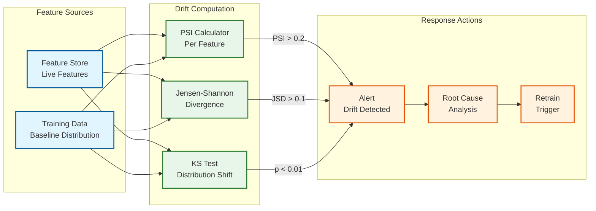

# 14.1 AI-Native MSME Credit Scoring & Lending Platform — Observability

## Observability Philosophy

MSME lending platform observability must span three distinct domains with different monitoring cadences: the **decision pipeline** (application intake through disbursement, requiring second-level visibility to detect latency degradation or service failures that block loan origination), the **model health plane** (credit scoring accuracy, fairness, and drift, requiring daily-to-weekly visibility with 90-day lagging indicators for default prediction), and the **portfolio health plane** (delinquency, early warning signals, and collection effectiveness, requiring daily batch monitoring with trend analysis). Each domain has fundamentally different alert semantics—a scoring latency spike is an operational emergency, a model Gini decline is a strategic concern, and a delinquency rate increase may be a seasonal pattern or a systemic problem requiring investigation.

---

## Decision Pipeline Metrics

### Application Processing

| Metric | Description | Target | Alert Threshold |
|---|---|---|---|
| `pipeline.applications_per_minute` | Inbound application rate | Per forecast | Deviation > 50% from hourly forecast |
| `pipeline.e2e_latency_p99_s` | End-to-end decision latency (auto-approve path) | ≤ 5 s | > 8 s |
| `pipeline.aa_fetch_latency_p95_s` | AA data fetch time per FIP | ≤ 45 s | > 60 s per FIP |
| `pipeline.aa_fetch_success_rate` | % of AA fetches returning data | > 95% | < 90% per FIP |
| `pipeline.parsing_latency_p95_s` | Bank statement parsing time | ≤ 8 s (10-page statement) | > 15 s |
| `pipeline.scoring_latency_p99_ms` | Model inference time | ≤ 200 ms | > 500 ms |
| `pipeline.auto_approve_rate` | % of applications auto-approved | 25–35% | < 20% or > 45% (policy drift) |
| `pipeline.auto_decline_rate` | % of applications auto-declined | 35–45% | < 25% or > 55% |
| `pipeline.manual_review_rate` | % routed to manual review | 20–30% | > 40% (model uncertainty spike) |
| `pipeline.manual_review_queue_depth` | Pending manual review applications | < 500 | > 1,000 (queue backlog) |
| `pipeline.manual_review_sla_breach_pct` | % of reviews exceeding 4-hour SLA | < 5% | > 15% |

### Data Processing Quality

| Metric | Description | Target | Alert Threshold |
|---|---|---|---|
| `parsing.transaction_categorization_accuracy` | % of transactions correctly categorized (sampled) | > 92% | < 88% |
| `parsing.uncategorized_transaction_pct` | % of transactions with "UNKNOWN" category | < 5% | > 10% |
| `parsing.gst_bank_mismatch_rate` | % of applications with GST-bank revenue mismatch > 30% | < 15% | > 25% (data quality or fraud signal) |
| `parsing.ocr_failure_rate` | % of document pages failing OCR extraction | < 2% | > 5% |
| `feature.completeness_avg` | Average feature completeness across applications | > 70% | < 60% (data source degradation) |
| `feature.store_staleness_pct` | % of feature vectors older than 90 days | < 10% | > 20% |

---

## Credit Scoring & Model Health Metrics

### Model Performance (Lagging — 90-Day Vintage)

| Metric | Description | Target | Alert Threshold |
|---|---|---|---|
| `model.gini_coefficient` | Gini coefficient on 90-day vintage | > 0.40 | < 0.35 (model degradation) |
| `model.ks_statistic` | KS statistic (max separation between good/bad distributions) | > 0.30 | < 0.25 |
| `model.auc_roc` | Area under ROC curve | > 0.75 | < 0.70 |
| `model.calibration_brier` | Brier score (calibration quality) | < 0.15 | > 0.20 (miscalibrated) |
| `model.vintage_default_rate` | 90-day default rate for each origination month | Per risk grade target | > 1.5x expected for any grade |

### Model Stability (Leading — Daily)

| Metric | Description | Target | Alert Threshold |
|---|---|---|---|
| `model.psi_score_distribution` | Population Stability Index on score distribution | < 0.10 | > 0.20 (significant drift) |
| `model.psi_feature_{name}` | PSI per top-20 feature | < 0.10 each | > 0.25 (feature distribution shift) |
| `model.approval_rate_7d` | 7-day rolling approval rate | ± 5% of target | Deviation > 10% |
| `model.avg_score_7d` | 7-day rolling average credit score | Stable within ±0.02 | Change > 0.05 |
| `model.challenger_gini_delta` | Challenger Gini minus champion Gini | Monitored | > +0.02 sustained for 30 days (promotion candidate) |

### Model Fairness (Weekly)

| Metric | Description | Target | Alert Threshold |
|---|---|---|---|
| `fairness.approval_rate_gender_gap` | Approval rate difference (male vs. female) | < 5 pp | > 8 pp |
| `fairness.approval_rate_geo_variance` | Variance of approval rates across top-50 pin codes | Low | Any pin code > 2x or < 0.5x overall rate |
| `fairness.interest_rate_gender_gap_bps` | Average APR difference (male vs. female) at same risk grade | < 50 bps | > 200 bps |
| `fairness.equalized_odds_tpr_gap` | True positive rate gap across demographic groups | < 0.05 | > 0.10 |
| `fairness.counterfactual_flip_rate` | % of declines that would be approved with different demographics | < 2% | > 5% |

---

## Fraud Detection Metrics

| Metric | Description | Target | Alert Threshold |
|---|---|---|---|
| `fraud.scoring_latency_p99_ms` | Fraud scoring latency | ≤ 500 ms | > 800 ms |
| `fraud.auto_block_rate` | % of applications auto-blocked by fraud detection | 1–3% | > 5% (fraud spike or false-positive spike) |
| `fraud.manual_review_rate` | % routed to fraud review | 3–5% | > 8% |
| `fraud.stacking_detected_daily` | Loan stacking cases detected per day | Informational | > 2x 30-day average |
| `fraud.ring_detected_weekly` | Fraud rings detected per week | Informational | > 5 rings/week (coordinated attack) |
| `fraud.first_emi_default_rate` | % of loans defaulting on first EMI | < 2% | > 3% (early payment default spike) |
| `fraud.false_positive_rate` | % of manually reviewed fraud flags found to be legitimate | < 30% | > 50% (model precision degradation) |
| `fraud.graph_query_latency_p95_ms` | Fraud graph traversal time | ≤ 200 ms | > 500 ms |
| `fraud.velocity_check_latency_p99_ms` | Velocity check execution time | ≤ 20 ms | > 50 ms |

---

## Disbursement & Collection Metrics

### Disbursement

| Metric | Description | Target | Alert Threshold |
|---|---|---|---|
| `disbursement.e2e_latency_p95_min` | Time from approval to fund credited | ≤ 5 min | > 10 min |
| `disbursement.success_rate` | % of disbursements completed successfully | > 98% | < 95% |
| `disbursement.penny_drop_success_rate` | % of penny-drop verifications successful | > 97% | < 93% |
| `disbursement.rail_success_rate_{rail}` | Success rate per payment rail (UPI/IMPS/NEFT) | > 99% (UPI), > 99.5% (IMPS) | < 95% for any rail |
| `disbursement.mandate_registration_success` | % of e-mandate registrations successful | > 85% | < 75% |
| `disbursement.daily_volume_crore` | Daily disbursement amount | Per forecast | Deviation > 30% from forecast |

### Collection

| Metric | Description | Target | Alert Threshold |
|---|---|---|---|
| `collection.auto_debit_success_rate` | % of NACH deductions successful on first attempt | > 75% | < 65% |
| `collection.contact_rate` | % of delinquent borrowers successfully contacted | > 60% | < 45% |
| `collection.promise_to_pay_conversion` | % of promises that convert to actual payment | > 50% | < 35% |
| `collection.sms_delivery_rate` | % of SMS messages delivered | > 95% | < 90% |
| `collection.whatsapp_read_rate` | % of WhatsApp messages read within 24h | > 70% | < 55% |
| `collection.field_visit_resolution_rate` | % of field visits resulting in payment | > 40% | < 25% |
| `collection.optimal_time_hit_rate` | % of contacts made within ML-recommended window | > 80% | < 60% |

---

## Portfolio Health Metrics

| Metric | Description | Target | Alert Threshold |
|---|---|---|---|
| `portfolio.total_outstanding_crore` | Total portfolio outstanding | Per plan | Deviation > 10% from plan |
| `portfolio.dpd_0_pct` | % of portfolio current (DPD=0) | > 92% | < 88% |
| `portfolio.dpd_1_30_pct` | % of portfolio DPD 1-30 | < 5% | > 7% |
| `portfolio.dpd_31_60_pct` | % of portfolio DPD 31-60 | < 2% | > 3% |
| `portfolio.dpd_61_90_pct` | % of portfolio DPD 61-90 | < 1% | > 1.5% |
| `portfolio.npa_pct` | % of portfolio NPA (DPD > 90) | < 3% | > 4% |
| `portfolio.ews_triggered_pct` | % of active loans with early warning signal | Informational | > 10% (systemic stress) |
| `portfolio.vintage_loss_rate_{month}` | Cumulative loss rate by origination month | Per risk grade | > 1.5x expected |
| `portfolio.concentration_top10_pct` | % of portfolio in top 10 borrowers | < 5% | > 10% (concentration risk) |
| `portfolio.sector_concentration` | Maximum exposure to any single sector | < 20% | > 30% |

---

## Dashboard Structure

### Operations Dashboard (Real-Time)

```
┌────────────────────────────────────────────────────────────────────┐
│ LENDING PLATFORM STATUS: OPERATIONAL      Apps/min: 345  ↑ 12%     │
├────────────────────────────────────────────────────────────────────┤
│                                                                    │
│  ┌─ Pipeline Health ──────────┐  ┌─ Fraud Detection ────────────┐ │
│  │ Decision Latency p99: 3.2s │  │ Auto-Block Rate: 2.1%        │ │
│  │ AA Fetch p95: 28s    ✓     │  │ Manual Review: 4.3%          │ │
│  │ Scoring p99: 145ms   ✓     │  │ Stacking Today: 23 cases     │ │
│  │ Auto-Approve: 31%         │  │ Rings Detected: 1            │ │
│  │ Manual Queue: 234    ✓     │  │ Fraud Score p99: 380ms  ✓    │ │
│  └────────────────────────────┘  └───────────────────────────────┘ │
│                                                                    │
│  ┌─ Disbursement ─────────────┐  ┌─ Collection ─────────────────┐ │
│  │ Today: ₹892 Cr disbursed   │  │ Auto-Debit Success: 76%      │ │
│  │ Success Rate: 98.7%   ✓    │  │ Contact Rate: 63%            │ │
│  │ UPI Rail: 99.2%     ✓     │  │ PTP Conversion: 48%          │ │
│  │ IMPS Rail: 99.5%    ✓     │  │ SMS Delivery: 96%       ✓    │ │
│  │ Pending: 45 disbursements  │  │ WhatsApp Read: 72%      ✓    │ │
│  └────────────────────────────┘  └───────────────────────────────┘ │
│                                                                    │
│  ┌─ Data Source Health ─────────────────────────────────────────┐  │
│  │ AA (Bank A): ✓ 22s   AA (Bank B): ✓ 31s   AA (Bank C): ⚠ 55s│  │
│  │ Bureau: ✓ 2.1s       KYC: ✓ 1.4s          CKYC: ✓ 0.8s    │  │
│  │ UPI Feed: ✓ active   GST Portal: ✓ 18s    e-Mandate: ✓     │  │
│  └──────────────────────────────────────────────────────────────┘  │
│                                                                    │
│  ┌─ Model Health ────────────────────────────────────────────────┐ │
│  │ Champion (bureau-plus): Gini 0.44 ✓   PSI: 0.08 ✓           │ │
│  │ Champion (thin-file):   Gini 0.38 ✓   PSI: 0.12 ⚠           │ │
│  │ Champion (NTC):         Gini 0.31 ✓   PSI: 0.07 ✓           │ │
│  │ Fairness: Gender gap 3.2pp ✓   Geo variance: Normal ✓       │ │
│  └──────────────────────────────────────────────────────────────┘  │
└────────────────────────────────────────────────────────────────────┘
```

---

## Alerting Strategy

### Alert Severity Classification

| Severity | Response Time | Examples | Notification Channel |
|---|---|---|---|
| **CRITICAL** | Immediate (<5 min) | Fraud service down (disbursements blocked), credit scoring engine crash, payment rail total failure, double-disbursement detected | PagerDuty + phone call to on-call engineer |
| **HIGH** | < 30 minutes | Decision latency > 10s sustained, auto-approve rate swing > 15%, first-EMI default spike, fraud ring detected | Slack alert + on-call page |
| **MEDIUM** | < 2 hours | AA FIP degradation, model PSI > 0.2, manual review queue > 1000, auto-debit success rate < 65% | Slack channel + email |
| **LOW** | < 8 hours | Feature staleness > 20%, parsing accuracy below target, collection contact rate drop, challenger model outperformance | Dashboard highlight + daily digest |
| **INFO** | Daily review | Portfolio composition changes, vintage analysis updates, regulatory report generation status | Daily summary email |

### Alert Correlation and Deduplication

```
Correlation rules:
  - AA FIP timeout → suppress individual application timeout alerts for that FIP
  - Payment rail degradation → suppress individual disbursement failure alerts for that rail
  - Model PSI spike → correlate with feature-level PSI spikes to identify root cause feature
  - Delinquency rate increase → correlate with geographic and sector distribution
    to distinguish systemic vs. localized issue

Suppression during known events:
  - Festival season: suppress approval rate alerts (expected increase)
  - Bank holiday: suppress auto-debit failure alerts (expected: banks not processing)
  - Regulatory reporting window: suppress audit trail query latency alerts

Escalation:
  - CRITICAL unacknowledged for 10 minutes → escalate to engineering lead
  - HIGH unacknowledged for 30 minutes → escalate to platform manager
  - Any regulatory compliance alert → immediate compliance officer notification
  - Any double-disbursement or data breach → immediate C-level notification
```

---

## Distributed Tracing for Credit Decisions

Every credit decision generates a trace spanning the full pipeline:

```
Trace: Loan Application LA-2026-0312-789456
  ├─ [0 ms] Application received via partner API (partner: ECOM_PARTNER_A)
  ├─ [50 ms] KYC verification initiated (Aadhaar eKYC + PAN verification)
  ├─ [1,200 ms] KYC verified: Aadhaar ✓, PAN ✓, CKYC match ✓
  ├─ [1,250 ms] AA consent verified; data fetch initiated for 2 FIPs
  ├─ [1,300 ms] Bureau pull initiated
  ├─ [3,500 ms] Bureau response received: score 712, 3 tradelines
  ├─ [22,000 ms] FIP-1 (Bank A): 6 months bank statement received
  ├─ [22,100 ms] Bank statement parsing started (8 pages)
  ├─ [26,300 ms] Parsing complete: 342 transactions categorized
  ├─ [35,000 ms] FIP-2 (GST Network): 12 months GST returns received
  ├─ [35,500 ms] Feature engineering: 186/200 features computed (completeness: 93%)
  ├─ [35,700 ms] Segment: BUREAU_PLUS (bureau available + bank statements)
  ├─ [35,750 ms] Credit scoring: champion model v4.2 invoked
  ├─ [35,890 ms] Score: PD=0.042, risk_grade=B1, confidence=[0.028, 0.056]
  ├─ [35,900 ms] SHAP: top factors: cash_flow_volatility (-0.12),
  │              bureau_score (+0.08), gst_filing_regularity (+0.06)
  ├─ [35,950 ms] Fraud scoring: fast-path rules ✓, graph query (230ms) ✓
  ├─ [36,180 ms] Fraud score: 0.08 (LOW), disposition: AUTO_PASSED
  ├─ [36,200 ms] Underwriting decision: APPROVED (auto-approve path)
  ├─ [36,250 ms] Pricing: APR 18.5%, tenure 12 months, EMI ₹18,420
  ├─ [36,300 ms] KFS generated and displayed to borrower
  ├─ [38,000 ms] Borrower accepted offer
  ├─ [38,100 ms] Penny-drop verification initiated
  ├─ [43,500 ms] Penny-drop ✓: account verified, name match 0.92
  ├─ [43,600 ms] Disbursement initiated via UPI
  ├─ [67,200 ms] Disbursement completed: UTR HDFC2026031278945
  ├─ [67,300 ms] e-Mandate registration initiated
  ├─ [67,400 ms] Loan activated: EMI schedule generated (12 installments)
  └─ [95,000 ms] e-Mandate registered successfully

Total pipeline: 95 seconds (AA fetch dominated: 34 seconds)
Credit decision (scoring + fraud + underwriting): 500 ms
Disbursement: 29 seconds (UPI settlement)

Trace stored in: audit trail (8-year retention)
```

---

## Regulatory Observability

### Consent Lifecycle Dashboard

The consent lifecycle is a regulatory compliance surface that requires dedicated monitoring:

| Metric | Description | Target | Alert Threshold |
|---|---|---|---|
| `consent.active_count` | Number of active AA consents | Informational | Sudden drop > 20% in 24h (consent revocation wave) |
| `consent.expiry_30d_count` | Consents expiring in next 30 days | Informational | > 30% of active consents expiring without renewal pipeline |
| `consent.renewal_success_rate` | % of consent renewal attempts successful | > 60% | < 40% |
| `consent.data_purge_compliance` | % of expired-consent raw data purged within SLA | 100% | < 100% (regulatory violation risk) |
| `consent.fetch_frequency_compliance` | % of data fetches within consent frequency limits | 100% | < 100% |
| `consent.purpose_match_rate` | % of data usage matching consent purpose declaration | 100% | < 100% |

### KFS and Adverse Action Compliance

| Metric | Description | Target | Alert Threshold |
|---|---|---|---|
| `compliance.kfs_generation_rate` | % of approvals with KFS generated | 100% | < 100% (regulatory non-compliance) |
| `compliance.kfs_acknowledgment_rate` | % of KFS displayed and acknowledged by borrower | > 95% | < 90% |
| `compliance.adverse_action_coverage` | % of declines with specific adverse action reasons | 100% | < 100% |
| `compliance.cooling_off_enforcement` | % of cooling-off requests processed within 24h | 100% | < 100% |
| `compliance.grievance_sla_breach_pct` | % of grievances exceeding 15-day resolution SLA | < 5% | > 10% |
| `compliance.direct_disbursement_pct` | % of disbursements to borrower's own account | 100% | < 100% |

---

## Model Observability Deep Dive

### Feature Drift Monitoring Pipeline



### Model A/B Test Monitoring

When a challenger model enters the 90/10 traffic split, the observability system tracks parallel metrics:

```
Champion vs. Challenger Dashboard:
  ┌─ Score Distribution ─────────────────────────────────────────┐
  │ Champion (v4.2): mean=0.08, std=0.12, median=0.04            │
  │ Challenger (v4.3): mean=0.07, std=0.11, median=0.03          │
  │ Score shift: challenger scores slightly lower → more approvals│
  ├─ Decision Distribution ──────────────────────────────────────┤
  │ Champion: approve=31%, decline=42%, review=27%                │
  │ Challenger: approve=34%, decline=40%, review=26%              │
  │ Δ approve: +3 pp → monitor if approval quality holds         │
  ├─ Vintage Tracking (matured cohorts) ─────────────────────────┤
  │ Champion 90-day default: 4.2% (on grade B1 segment)          │
  │ Challenger 90-day default: pending (insufficient maturity)    │
  │ Estimated from 30-day proxy: 3.8% (favorable but preliminary)│
  ├─ Fairness Comparison ────────────────────────────────────────┤
  │ Champion gender gap: 3.2 pp                                   │
  │ Challenger gender gap: 2.8 pp (improved)                      │
  │ Champion geo variance: 0.012                                  │
  │ Challenger geo variance: 0.010 (improved)                     │
  └──────────────────────────────────────────────────────────────┘

  Promotion criteria (all must hold simultaneously):
    ✓ Challenger Gini > Champion Gini by ≥ 2 points (on 90-day vintage)
    ✓ Challenger fairness metrics ≤ Champion (no regression)
    ✓ Minimum sample size: 5,000 matured applications per segment
    ✓ Statistical significance: p < 0.05 on Gini difference
    ✓ Independent validation team sign-off
```

---

## On-Call Playbooks

### Playbook: Credit Scoring Latency Spike

```
Trigger: pipeline.scoring_latency_p99_ms > 500ms for 5 minutes
Severity: HIGH

Step 1: Check model worker health
  → Are all scoring workers responding to health checks?
  → Check CPU/memory on scoring workers (model inference is CPU-bound)

Step 2: Check feature store latency
  → Is feature_store.read_latency_p95 > 50ms?
  → If yes: check shard health, replica lag, connection pool exhaustion

Step 3: Check model artifact
  → Was a model update deployed in the last hour?
  → If yes: check if new model is larger (more trees, deeper depth)
  → Rollback to previous model version if latency is unacceptable

Step 4: Check input volume
  → Is application rate > 2x normal? (scaling lag)
  → If yes: manually trigger scoring worker scale-up

Step 5: Escalate
  → If no root cause found in 15 minutes, page ML engineering lead
```

### Playbook: First-EMI Default Rate Spike

```
Trigger: fraud.first_emi_default_rate > 3% (rolling 7-day)
Severity: CRITICAL (potential fraud attack)

Step 1: Segment the spike
  → Is the spike concentrated in a specific partner? Geographic region? Segment?
  → If partner-specific: pause that partner's applications immediately

Step 2: Analyze origination cohort
  → Pull all loans originated in the spike period
  → Check fraud scores at origination: were they elevated?
  → Check model scores: were they within normal approval bands?

Step 3: Check for organized fraud patterns
  → Run batch fraud ring detection on the spike cohort
  → Check shared devices, addresses, bank accounts
  → If ring detected: block all linked applications

Step 4: Tighten credit policy
  → Temporarily raise auto-approve threshold by 1 risk grade
  → Increase manual review band width
  → Increase fraud detection sensitivity

Step 5: Communicate
  → Notify risk committee within 2 hours
  → Notify co-lending bank partners within 4 hours
  → Document findings and remediation in incident report
```

### Playbook: Model Fairness Breach

```
Trigger: fairness.approval_rate_gender_gap > 8 pp (weekly computation)
Severity: HIGH (regulatory risk)

Step 1: Verify the signal
  → Is the gap driven by a specific segment (bureau-plus, thin-file, NTC)?
  → Is the gap driven by a specific product or partner?
  → Check sample size: is the gap statistically significant (p < 0.05)?

Step 2: Root cause analysis
  → Run SHAP analysis on approved vs. declined by gender
  → Identify which features are driving differential decisions
  → Check if a feature distribution shift is causing the gap
     (e.g., new data source disproportionately available for one group)

Step 3: Counterfactual analysis
  → For each declined applicant in the disadvantaged group, compute:
     "Would this application be approved with the other group's median features?"
  → If counterfactual flip rate > 5%, model has a proxy discrimination issue

Step 4: Remediation
  → If root cause is a proxy feature: add to prohibited feature list
  → If root cause is model drift: trigger adversarial debiasing retrain
  → If root cause is data pipeline change: fix the pipeline, backfill features

Step 5: Documentation and reporting
  → Prepare fairness incident report for model governance committee
  → If breach persists after remediation, prepare regulatory disclosure
  → Update model card with known limitation and mitigation
```

---

## AI Observability Standards

This system's AI components inherit observability patterns from:
- **[3.25 AI Observability & LLMOps](../3.25-ai-observability-llmops-platform/00-index.md)** — distributed tracing, token accounting, prompt-completion linkage
- **[3.26 AI Model Evaluation & Benchmarking](../3.26-ai-model-evaluation-benchmarking-platform/00-index.md)** — eval taxonomy, regression testing, quality metrics

### Required AI Metrics for Regulated Domain
- Model prediction confidence distribution
- Human override rate (track, not minimize — high override rate may indicate model drift)
- AI recommendation acceptance rate by decision type
- Drift detection alerts (data drift + concept drift)
- Explainability score per AI recommendation
- Regulatory audit trail completeness
