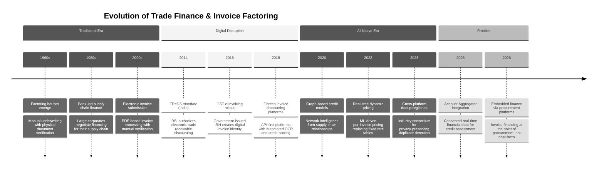

# 14.10 AI-Native Trade Finance & Invoice Factoring Platform

## System Overview

An AI-native trade finance and invoice factoring platform is a vertically integrated financial infrastructure system that replaces the traditional manual, paper-heavy, relationship-driven trade finance ecosystem—where MSMEs wait 60–120 days for buyer payments while banks take 7–14 days to underwrite a single invoice discounting request through physical document verification, credit committee approvals, and manual collateral assessment—with an intelligent, real-time financing marketplace where invoices are uploaded, verified against GST records and buyer payment histories within seconds, priced dynamically by AI-driven risk models that consider 200+ signals (buyer creditworthiness, industry payment cycles, macroeconomic indicators, seasonal demand patterns, invoice concentration risk, and supply chain relationship depth), and funded within hours rather than weeks. Unlike conventional factoring companies that treat each invoice as an isolated credit decision requiring manual underwriting, the AI-native platform treats the entire supply chain as a connected graph where financing one supplier's invoice against a large buyer generates information that refines the risk assessment for every other supplier in that buyer's ecosystem—creating a network intelligence effect where the platform's pricing accuracy and speed of decisioning improve with every transaction processed. The core engineering tension is that the platform must simultaneously maintain financial-grade accuracy in credit decisioning (a 0.1% increase in default rate on a portfolio of 100,000 invoices can translate to crores in losses), achieve real-time pricing that reflects current market conditions (interest rates, liquidity availability, and counterparty risk change daily), enforce regulatory compliance across multiple jurisdictions (RBI guidelines for NBFCs, FEMA regulations for cross-border transactions, GST reconciliation requirements, TReDS platform integration mandates), handle the adversarial nature of trade finance fraud (duplicate invoice financing, fictitious invoices, circular trading schemes where related parties create artificial receivables), and manage the complex multi-party settlement flows where funds move between suppliers, buyers, financiers, insurance providers, and escrow accounts with atomic consistency guarantees—because a partial settlement where the supplier receives funds but the financier's lien is not properly recorded creates an irrecoverable financial loss.

---

## Autonomy Classification

**Tier: B — AI-Augmented**

This is a **deterministic-core system with an AI intelligence layer**. The transactional backbone owns all writes and final decisions. AI accelerates discovery, prediction, recommendation, and explanation — but never writes to the system of record without deterministic validation. AI scores credit risk and validates trade documents; the deterministic finance engine manages all disbursement and settlement decisions.

| Boundary | AI Role | Human/System Authority |
|----------|---------|----------------------|
| **System of Record** | Cannot write directly to transactional stores | Deterministic service pipeline |
| **System of Intelligence** | Predictions, recommendations, classifications, and ranking with evidence | AI intelligence layer |
| **Action Boundary** | Proposes actions; deterministic pipeline validates and executes | Validation gate |
| **Human Override** | Credit officers review AI risk scores; all disbursements require authorized signatory approval | Domain expert |
| **Rollback Path** | AI recommendations can be disregarded or reversed; audit trail preserves full decision history | Audit log + compensation flows |

---

## Related Patterns

| System | Relationship | Why It Matters |
|---|---|---|
| [MSME Credit Scoring & Lending Platform](../14.1-ai-native-msme-credit-scoring-lending-platform/00-index.md) | **Credit model overlap** | Buyer credit scoring in trade finance shares features (GST data, bureau data, financial ratios) with MSME lending models, but optimizes for different objectives: trade finance models predict *payment timing* while lending models predict *repayment probability* |
| [MSME Accounting & Tax Compliance Platform](../14.3-ai-native-msme-accounting-tax-compliance-platform/00-index.md) | **Data source** | Accounting platform provides real-time receivables/payables data that feeds the working capital advisor; GST reconciliation from the accounting platform validates invoice authenticity for the trade finance platform |
| [B2B Supplier Discovery & Procurement Marketplace](../14.5-ai-native-b2b-supplier-discovery-procurement-marketplace/00-index.md) | **Upstream integration** | Procurement marketplace generates purchase orders that become the invoices financed on the trade finance platform; PO-invoice matching from procurement provides the strongest verification signal |
| [Conversational Commerce Platform](../14.2-ai-native-conversational-commerce-platform/00-index.md) | **MSME access channel** | WhatsApp-first interface enables MSMEs to upload invoices, check deal status, and receive disbursement notifications via conversational interface—critical for non-tech-savvy MSME operators |
| [India Stack Integration Platform](../14.17-ai-native-india-stack-integration-platform/00-index.md) | **Infrastructure dependency** | Account Aggregator framework provides consented financial data for credit assessment; DigiLocker integration for document verification; UPI for real-time micro-disbursements |
| [Marketplace Platform](../12.18-marketplace-platform/00-index.md) | **Auction architecture** | The financier bidding engine uses marketplace auction patterns (sealed bids, partial fills, order matching) adapted for financial instruments rather than physical goods |
| [Customer Data Platform](../12.15-customer-data-platform/00-index.md) | **Behavioral intelligence** | CDP-style unified entity profiles (buyer credit graph, supplier behavior profiles) drive personalization of pricing, risk thresholds, and financing recommendations |
| [Change Data Capture System](../16.8-change-data-capture-system/00-index.md) | **Event sourcing backbone** | CDC patterns power the event-sourced ledger, enabling real-time materialized views for portfolio analytics while maintaining the immutable audit trail required by regulators |
| [Distributed Tracing System](../15.2-distributed-tracing-system/00-index.md) | **Observability foundation** | End-to-end trace from invoice upload through disbursement spans 8+ services and external APIs (GSTN, banks); trace IDs correlated with invoice/deal IDs enable rapid debugging of settlement failures |
| [Error Tracking Platform](../15.8-error-tracking-platform/00-index.md) | **Financial error triage** | Settlement saga failures, ledger imbalances, and bank API errors require specialized error grouping that considers the financial impact severity, not just the technical stack trace |

---

## Historical Context and Evolution

| Era | Key Innovation | Impact |
|---|---|---|
| Factoring houses (1960s) | Dedicated financial intermediaries for receivables | Established invoice discounting as an asset class; manual processes limited scale to large corporates |
| TReDS platforms (2014) | RBI-regulated electronic receivable discounting | Created regulatory framework for digital trade finance; enabled MSME access but limited to platform participants |
| GST e-invoicing (2016+) | Government-issued Invoice Reference Number (IRN) | Provided digital identity for invoices; enabled automated cross-verification against government records |
| AI-native platforms (2020+) | Graph-based credit, dynamic pricing, automated settlement | Reduced underwriting from days to seconds; enabled per-invoice pricing reflecting real-time risk; opened market to millions of MSMEs |
| Account Aggregator era (2025+) | Consented real-time financial data access | Eliminated manual document collection; enabled continuous credit monitoring instead of point-in-time assessment |

---

## Key Terminology

| Term | Definition |
|---|---|
| **Invoice Factoring** | A financial arrangement where an MSME sells its accounts receivable (invoices) to a financier at a discount in exchange for immediate cash |
| **Discount Rate** | The annualized interest rate at which the invoice is financed; expressed in basis points (bps), where 100 bps = 1% |
| **Days Past Due (DPD)** | The number of days a payment is overdue beyond the invoice's maturity date; the primary measure of buyer payment behavior |
| **TReDS** | Trade Receivables Discounting System—RBI-authorized electronic platforms (RXIL, M1xchange, Invoicemart) for facilitating MSME invoice financing |
| **GSTIN** | Goods and Services Tax Identification Number—a 15-digit unique identifier assigned to every registered taxpayer in India's GST system |
| **IRN** | Invoice Reference Number—a unique 64-character hash generated by the GST portal for each e-invoice, serving as a government-attested invoice identity |
| **NACH** | National Automated Clearing House—an electronic fund transfer system for automated, periodic, or bulk debits/credits in India |
| **CRAR** | Capital to Risk-weighted Assets Ratio—the regulatory capital adequacy measure for NBFCs mandated by RBI |
| **NPA** | Non-Performing Asset—a financial asset (loan or advance) where interest/principal payments are overdue for more than 90 days |
| **Escrow** | A financial arrangement where a third party holds funds on behalf of transacting parties until predetermined conditions are met |
| **Anchor Program** | A supply chain finance program where a large corporate buyer (the "anchor") onboards its MSME suppliers for preferential financing terms |
| **Lien** | A legal right or interest that a financier has in the invoice/receivable until the financing is repaid |

---

## Key Characteristics

| Characteristic | Description |
|---|---|
| **Architecture Style** | Event-driven microservices with a real-time risk processing pipeline (invoice ingestion → document verification → buyer credit assessment → dynamic pricing → financier matching → settlement orchestration), CQRS for trade ledger operations, and an event-sourced audit trail for regulatory compliance |
| **Core Abstraction** | The *trade financing deal*: a stateful entity that tracks an invoice from upload through verification, pricing, financier bidding, disbursement, and final settlement—maintaining an immutable audit log of every state transition, risk assessment, and participant action for regulatory examination |
| **Risk Pipeline** | Cascaded AI assessment: OCR document extraction → GST cross-verification → buyer credit scoring → invoice authenticity validation → concentration risk check → dynamic discount rate computation → credit insurance pricing—each stage gates the next with confidence thresholds |
| **Multi-Party Settlement** | Atomic settlement orchestration across supplier (receives discounted amount), financier (holds receivable until maturity), buyer (pays on invoice due date), credit insurer (covers default risk), and platform (collects fees)—with escrow-based fund flow ensuring no party bears settlement risk |
| **Regulatory Integration** | Real-time compliance with TReDS mandates, RBI NBFC regulations, GST invoice matching (GSTR-1/2B reconciliation), FEMA guidelines for cross-border trade, and AML/KYC requirements—with automated regulatory reporting and audit trail generation |
| **Network Intelligence** | Every transaction enriches the platform's knowledge graph: buyer payment behavior improves credit models for all suppliers to that buyer; industry payment cycle data refines seasonal risk adjustments; cross-supply-chain patterns detect circular trading fraud |

---

## Quick Navigation

| Document | Focus |
|---|---|
| [01 — Requirements & Estimations](./01-requirements-and-estimations.md) | Functional requirements, capacity math, SLOs |
| [02 — High-Level Design](./02-high-level-design.md) | System architecture, data flows, key design decisions |
| [03 — Low-Level Design](./03-low-level-design.md) | Data models, API contracts, core algorithms |
| [04 — Deep Dives & Bottlenecks](./04-deep-dive-and-bottlenecks.md) | Risk engine, settlement orchestration, fraud detection |
| [05 — Scalability & Reliability](./05-scalability-and-reliability.md) | Scaling strategy, fault tolerance, disaster recovery |
| [06 — Security & Compliance](./06-security-and-compliance.md) | AuthN/AuthZ, data security, threat model, compliance |
| [07 — Observability](./07-observability.md) | Metrics, logging, tracing, alerting |
| [08 — Interview Guide](./08-interview-guide.md) | 45-min pacing, trap questions, trade-offs, common mistakes |
| [09 — Insights](./09-insights.md) | 12 non-obvious architectural insights |

---

## Complexity Rating: **Very High**

| Dimension | Rating | Rationale |
|---|---|---|
| Domain Complexity | Very High | Multi-party financial transactions; adversarial fraud environment; regulatory compliance across RBI, FEMA, GST, AML |
| Data Model | High | Event-sourced double-entry ledger with hash chain; graph-based credit model; CQRS with complex state machines for deals and settlements |
| Integration Complexity | Very High | GSTN API (rate-limited, unreliable), 5+ banking APIs (NEFT, RTGS, NACH, IMPS, SWIFT), credit bureaus, TReDS platforms, insurance providers |
| Consistency Requirements | Very High | Zero tolerance for financial errors; settlement atomicity across external banking systems; cryptographic audit integrity |
| Scaling Challenge | High | 3x quarter-end surge requiring both compute AND capital scaling; GSTN rate limits create hard external throughput ceiling |
| Security Posture | Very High | Adversarial fraud actors; high-value financial data; insider threat from financial data access; real-time regulatory examination readiness |

---

## What Differentiates Naive vs. Production

| Dimension | Naive Approach | Production Reality |
|---|---|---|
| **Invoice Verification** | Accept uploaded invoice PDF at face value; verify only the invoice number and amount against buyer confirmation | Multi-layer verification: OCR extraction with field-level confidence scores → GST invoice cross-match against GSTR-1/2B filings → buyer ERP integration for purchase order matching → historical pattern analysis (sudden spike in invoice volume from a supplier flags potential fraud) → duplicate detection across all platform participants (same invoice submitted to multiple financiers) → digital signature and timestamp verification on e-invoices |
| **Credit Decisioning** | Static credit score lookup for the buyer; apply a fixed discount rate based on buyer rating tier (AAA = 8%, AA = 10%, A = 12%) | Dynamic multi-factor risk model: buyer's real-time credit score + payment history on platform (actual days-past-due distribution, not just average) + industry-specific payment cycle analysis (auto sector pays in 90 days, FMCG in 45) + macroeconomic signals (repo rate changes, sector-specific stress indicators) + invoice-level features (first invoice from this supplier-buyer pair vs. 50th, invoice size relative to buyer's typical payables) + concentration risk (if 40% of a financier's portfolio is against one buyer, new invoices against that buyer must be priced higher) + seasonal adjustments (Q4 liquidity crunch increases rates) |
| **Pricing** | Fixed rate schedule published quarterly; same rate for all invoices against a given buyer | Real-time auction-style pricing where multiple financiers bid competitively; platform's AI suggests a fair price range based on risk assessment; financiers see anonymized risk metrics and compete on rate; final rate reflects current market liquidity, financier's portfolio appetite, and invoice-specific risk—rates can differ by 50–200 bps for two invoices against the same buyer based on invoice characteristics |
| **Settlement** | Manual bank transfer on invoice maturity date; reconciliation via spreadsheet; disputes handled over email | Atomic settlement orchestration: on maturity date, automated debit instruction to buyer's bank → funds received in escrow → platform fee deducted → financier principal + return credited → supplier's advance already disbursed on day 0 via separate escrow release → all movements recorded as double-entry ledger events → automated reconciliation → exception handling for partial payments, delayed payments, and disputes with configurable grace periods and penalty calculations |
| **Fraud Detection** | Rely on buyer confirmation as proof of invoice legitimacy; flag only exact duplicate invoice numbers | Multi-signal fraud detection: duplicate invoices across financiers (same invoice, different platforms) via industry-level dedup registries → circular trading detection using supply chain graph analysis (A invoices B, B invoices C, C invoices A) → velocity anomalies (supplier generating 10x normal invoice volume in a week) → fictitious buyer detection (newly registered company with no GST history receiving large invoices) → collusion pattern detection (groups of related entities creating artificial receivables) → invoice amount manipulation (round-number invoices, amounts just below approval thresholds) |
| **Regulatory Compliance** | Manual regulatory filings; annual audit preparation takes weeks; compliance is retroactive | Real-time compliance enforcement: every transaction checked against RBI NBFC prudential norms (capital adequacy, provisioning requirements) before execution → automated FEMA compliance for cross-border transactions (purpose code validation, EDPMS reporting) → GST reconciliation at invoice level (reject invoices not matching GSTR filings) → continuous AML monitoring with suspicious transaction reporting → event-sourced audit trail that generates regulatory reports on demand without data reconstruction |
| **Cross-Border Finance** | Separate manual process for export invoices; letter of credit handled offline; currency conversion at spot rate on settlement date | Integrated export finance: letter of credit digitization with automated document checking (bill of lading, certificate of origin, insurance certificate) → multi-currency support with forward contract hedging recommendations → customs documentation auto-fill from invoice and shipping data → ECGC (Export Credit Guarantee Corporation) integration for export credit insurance → automated EDPMS (Export Data Processing and Monitoring System) reporting → real-time forex rate feeds with automatic conversion at optimal rates |
| **Observability** | Basic application logging; manual reconciliation spreadsheets checked weekly | End-to-end tracing from invoice upload through disbursement with trace IDs correlated to business entities (invoice ID, deal ID); real-time portfolio risk dashboards with CRAR gauges; automated reconciliation with bank statements triggering P0 alerts on any imbalance; meta-observability on the settlement engine itself (saga step latency histograms, compensation rate monitoring); credit model performance tracked with production AUC and calibration plots |
| **Cost Management** | Finance all eligible invoices regardless of unit economics; hope margins cover defaults | Per-invoice unit economics tracking: OCR cost + GST verification cost + credit model inference cost + settlement processing cost must be covered by the platform fee; automatic rejection of invoices where platform fee is negative (micro-invoices below ₹10,000); dynamic platform fee adjustment based on invoice characteristics; quarterly P&L attribution by buyer tier, industry sector, and invoice size band |

---

## What Makes This System Unique

### The Buyer Credit Graph: Financing One Invoice Improves Pricing for Thousands

Unlike consumer lending where each borrower is an independent risk assessment, trade finance creates a densely connected credit graph where a single large buyer (like a Fortune 500 manufacturer) may have 500+ MSME suppliers, each submitting invoices for discounting. Every invoice that matures (buyer pays on time) or defaults (buyer delays or refuses payment) updates the platform's understanding of that buyer's creditworthiness. This buyer credit signal propagates to every supplier in that buyer's ecosystem: if Buyer X has paid 98% of 10,000 invoices on time across 500 suppliers, a new invoice from Supplier 501 against Buyer X can be priced with high confidence even though Supplier 501 has zero transaction history on the platform. Conversely, if Buyer X starts delaying payments to 3 suppliers simultaneously, the platform must immediately reprice all outstanding invoices against Buyer X—potentially thousands of live deals—within minutes. This "credit signal propagation" is unique to trade finance and creates both an enormous data advantage (more suppliers per buyer = better credit signal) and a systemic risk challenge (buyer default affects hundreds of financiers simultaneously).

### The Double-Spend Problem of Trade Finance: One Invoice, Multiple Financiers

The most critical fraud vector in trade finance is an MSME submitting the same invoice to multiple financiers for discounting—the trade finance equivalent of the double-spend problem in cryptocurrency. Unlike digital currencies where a blockchain provides a global ledger, trade finance has no universal invoice registry. The same invoice PDF can be uploaded to Platform A, Bank B, and NBFC C simultaneously, and each may fund it independently. The platform must participate in or create inter-platform deduplication mechanisms (similar to India's TReDS model but for the broader invoice discounting market), cross-reference invoices against GST filings (where each invoice has a unique IRN—Invoice Reference Number—in the e-invoicing system), and detect behavioral patterns indicative of multi-platform submission (a supplier who normally submits 100% of invoices on one platform suddenly submitting only 60% may be financing the other 40% elsewhere). This deduplication challenge is fundamentally harder than preventing double-spend in cryptocurrencies because invoices are not digital-native assets with cryptographic identity—they are commercial documents that exist across paper, PDF, and multiple electronic formats.

### Settlement Atomicity Across Adversarial Parties

Trade finance settlement involves 4–6 parties (supplier, buyer, financier, insurer, platform, escrow bank) with potentially conflicting incentives. The supplier wants immediate disbursement; the financier wants payment guarantees; the buyer wants to delay payment; the insurer wants to minimize exposure; the platform wants transaction fees. Settlement must be atomic—either all fund movements complete or none do—but the participants are on different banking rails with different settlement cycles (RTGS for large amounts, NEFT for smaller ones, international SWIFT for cross-border). A partial settlement where the supplier receives funds but the financier's lien on the receivable is not properly recorded creates a situation where the supplier can potentially claim payment from the buyer directly while the financier has already paid—an irrecoverable loss. The system must implement a saga-based settlement orchestrator with compensation actions for every step, treating the multi-party fund flow as a distributed transaction across banking systems that were never designed for atomic multi-party settlement.

### The Credit Model Cold-Start Paradox

The platform's most predictive credit signal—invoice-level payment behavior across the supply chain—is unavailable for new buyers with no platform history. External credit data (bureau scores, financial statements) is a poor substitute because it captures facility-level repayment, not the invoice-level granularity that makes platform-native scoring superior. This creates a paradox: the buyers who need the most careful pricing (new, unproven entities) are exactly the ones for whom the platform's key differentiator (graph-based credit intelligence) provides the least signal. The production solution applies a transparent cold-start premium (+50-100 bps) that decays as transaction history builds, combined with an anchor program endorsement mechanism where a buyer's participation in an established supply chain finance program provides an indirect credit signal that partially compensates for the missing platform history.
