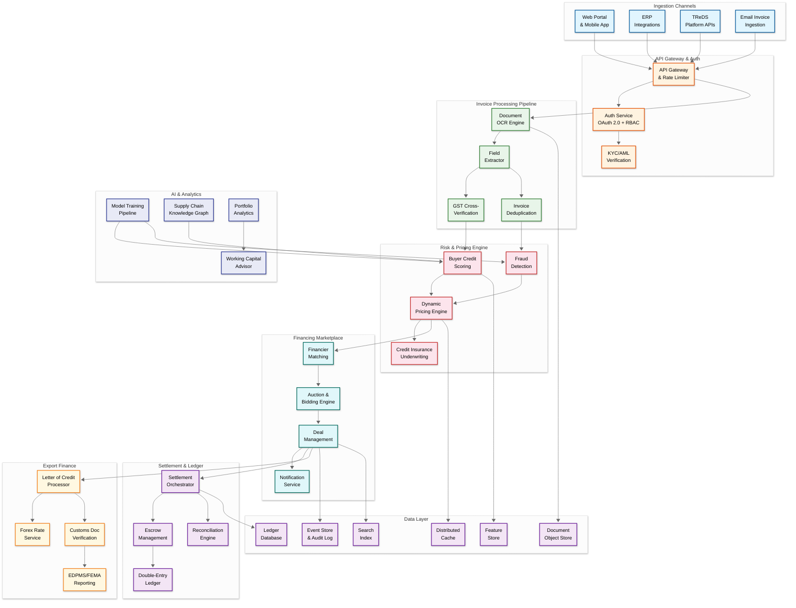
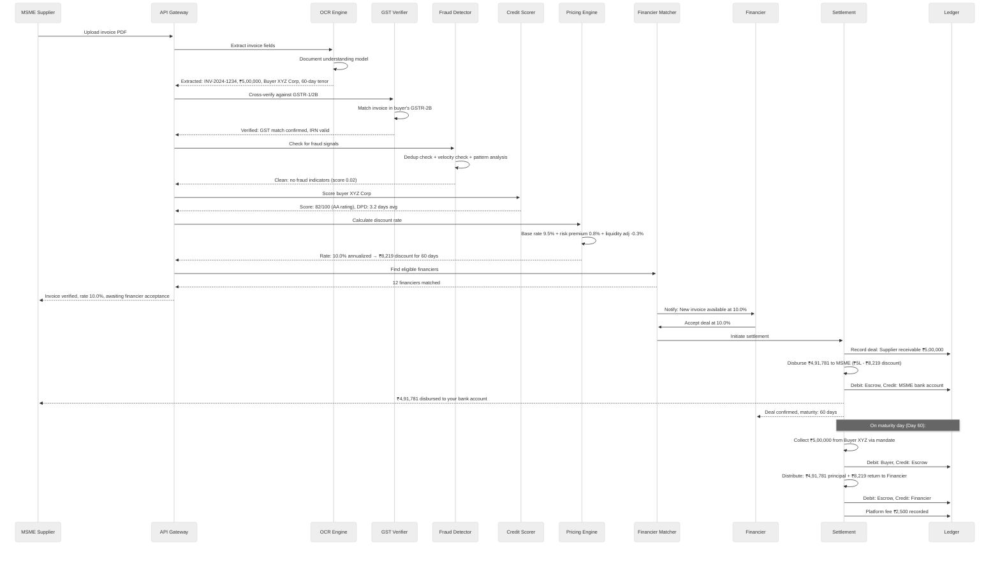
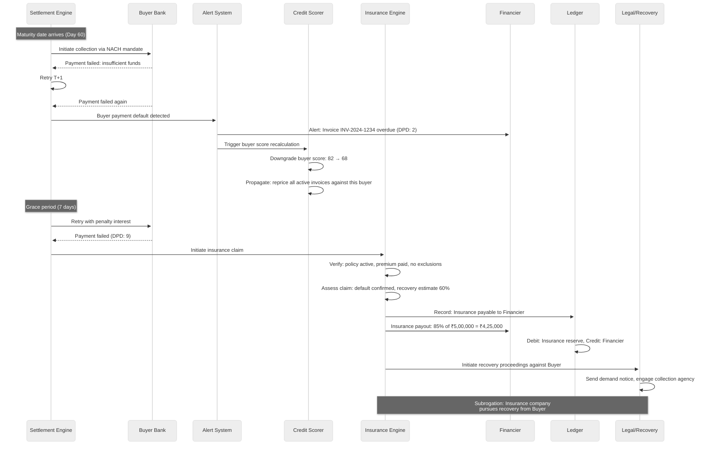
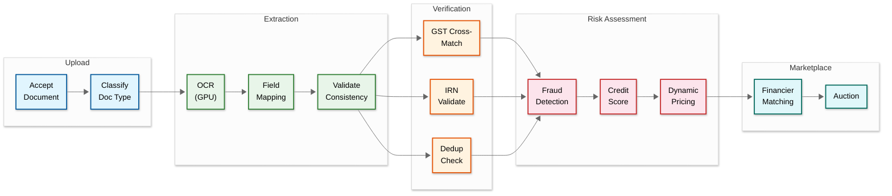

# 14.10 AI-Native Trade Finance & Invoice Factoring Platform — High-Level Design

## Architecture Overview

The platform follows a CQRS event-sourced architecture where the write path (invoice submission, deal creation, settlement execution) flows through a command pipeline with strict consistency guarantees, while the read path (portfolio dashboards, analytics, financier matching) operates on eventually consistent materialized views optimized for query performance. The system is organized into three processing tiers: (1) a **real-time tier** for invoice verification, pricing, and financier matching requiring sub-second latency, (2) a **transactional tier** for settlement orchestration and ledger operations requiring ACID guarantees, and (3) a **batch tier** for credit model retraining, regulatory reporting, and portfolio analytics.



---

## Component Descriptions

### API Gateway & Auth

| Component | Responsibility | Key Details |
|---|---|---|
| **API Gateway** | Routes requests, enforces rate limits, handles versioning; provides unified API surface for web, mobile, ERP integrations, and TReDS platform connectivity | Rate limiting per tenant: 100 RPS for MSMEs, 1,000 RPS for anchor corporates, 5,000 RPS for financier APIs; request/response logging for audit |
| **Auth Service** | OAuth 2.0 + OpenID Connect for authentication; RBAC with attribute-based overlays for authorization; multi-factor authentication for high-value operations | Role hierarchy: MSME_user → MSME_admin → Financier_analyst → Financier_admin → Platform_ops → Platform_admin; maker-checker enforcement for deals > ₹1 crore |
| **KYC/AML Verification** | Automated KYC for onboarding (PAN, GSTIN, bank account verification, director identification); ongoing AML monitoring with sanctions screening | Video KYC integration; PAN-GSTIN cross-validation; bank account penny-drop verification; CKYC registry integration; sanctions screening against OFAC, EU, UN, and domestic lists |

### Invoice Processing Pipeline

| Component | Responsibility | Key Details |
|---|---|---|
| **Document OCR Engine** | Extracts text and structure from invoice documents (PDF, images, scans); identifies document type (invoice, purchase order, delivery challan, credit note) | Transformer-based document understanding model; handles multi-page invoices; table extraction for line items; confidence scores per extracted field; supports 12+ Indian languages on invoices |
| **Field Extractor** | Maps OCR output to structured invoice schema: invoice number, date, GSTIN (seller/buyer), HSN codes, line items with quantities and amounts, tax breakdown (CGST/SGST/IGST), total amount, payment terms | Rule-based extraction with ML fallback; handles diverse invoice formats (no standard template across MSMEs); validates internal consistency (line items sum to total, tax calculations correct) |
| **GST Cross-Verification** | Validates invoice against GSTN filings: matches invoice in seller's GSTR-1 and buyer's GSTR-2B; verifies GSTIN validity and return filing status | GSTN API integration with retry and caching; handles API rate limits; flags invoices not found in GST filings; checks for cancelled/suspended GSTINs; verifies e-invoice IRN for invoices above threshold |
| **Invoice Deduplication** | Detects duplicate invoices: exact match (same invoice number + seller + buyer), near-duplicate (same parties, similar amount and date), and cross-platform deduplication via industry registries | Bloom filter for fast exact-match; LSH (Locality-Sensitive Hashing) for near-duplicate detection; integration with CRILC (Central Repository of Information on Large Credits) and TReDS registries for cross-platform checks |

### Risk & Pricing Engine

| Component | Responsibility | Key Details |
|---|---|---|
| **Buyer Credit Scoring** | Computes real-time creditworthiness scores for invoice buyers using 200+ features: financial ratios, payment history, GST filing patterns, legal cases, industry benchmarks, macroeconomic indicators | Gradient-boosted ensemble model; daily score refresh for active buyers; explainable scoring with SHAP values; separate models for large corporates vs. SME buyers; industry-specific benchmarking |
| **Fraud Detection** | Multi-layer fraud detection: document-level (tampered invoices), entity-level (fictitious buyers/suppliers), relationship-level (circular trading), and behavioral-level (unusual patterns) | Graph neural network for relationship-based fraud; velocity checks (invoice volume spikes); amount pattern analysis (round numbers, threshold-gaming); real-time + batch detection modes |
| **Dynamic Pricing Engine** | Calculates discount rate per invoice considering: buyer risk, invoice tenor, amount, industry, platform liquidity, financier appetite, concentration risk, and market benchmark rates | Multi-factor pricing model; real-time liquidity adjustment; concentration risk premium; seasonal adjustments; pricing bands (floor and ceiling rates) per buyer rating tier; audit trail for every rate computation |
| **Credit Insurance Underwriting** | AI-driven premium computation for trade credit insurance; portfolio-level exposure monitoring; automated claim processing on verified buyer defaults | Expected loss model: PD (probability of default) × LGD (loss given default) × EAD (exposure at default); correlation adjustments for portfolio concentration; reinsurance treaty compliance; claims processing with documentation verification |

### Financing Marketplace

| Component | Responsibility | Key Details |
|---|---|---|
| **Financier Matching** | Matches invoices to eligible financiers based on investment criteria: buyer rating, industry, tenor, ticket size, geographic preference, portfolio capacity | Real-time matching against financier preference matrices; priority routing for anchor program invoices; load balancing across financiers to prevent concentration; SLA-based matching (auto-match within 2 seconds for pre-approved programs) |
| **Auction & Bidding Engine** | Manages competitive bidding for invoice discounting: sealed-bid auctions for individual invoices, bulk auctions for invoice pools, and reverse auctions where financiers compete on rate | Configurable auction types; bid validity windows; minimum bid increments; anti-collusion measures; real-time bid status updates via WebSocket; support for partial bids |
| **Deal Management** | Manages the lifecycle of financing deals: creation, approval, disbursement tracking, maturity monitoring, settlement, and closure; handles deal amendments and early settlements | Deal state machine: Draft → Pending_Approval → Approved → Disbursed → Matured → Settled → Closed; amendment workflows for date extensions and partial prepayments; bulk deal operations for supply chain finance programs |
| **Notification Service** | Multi-channel notifications: email, SMS, push notifications, and webhook callbacks; event-driven alerts for deal status changes, payment reminders, bid updates, and compliance alerts | Configurable notification preferences per user; batched notifications to prevent alert fatigue; priority escalation for urgent events (buyer default, settlement failure); template management for regulatory communications |

### Settlement & Ledger

| Component | Responsibility | Key Details |
|---|---|---|
| **Settlement Orchestrator** | Executes multi-party settlement as a saga: supplier disbursement → escrow management → buyer collection → fee deduction → financier payout; handles compensation actions for failures | Saga-based orchestration with idempotent steps; automated retry with exponential backoff; manual override for stuck settlements; settlement window management (T+0 for disbursement, T+1 for collection reconciliation) |
| **Escrow Management** | Manages escrow accounts for fund flows: holds buyer payments until distribution, manages supplier advance disbursements, handles interest accrual on escrow balances | Virtual escrow accounts per deal; real-time balance tracking; automated sweep from collection account to distribution accounts; interest calculation and allocation; regulatory compliance for escrow operations |
| **Double-Entry Ledger** | Immutable financial ledger recording every monetary event as balanced debit-credit entries; serves as the authoritative source of truth for all financial positions | Append-only ledger with cryptographic chaining; double-entry validation (every debit has a corresponding credit); multi-currency support with conversion rate recording; sub-ledger accounts per participant; real-time balance computation |
| **Reconciliation Engine** | Automated reconciliation between internal ledger and external bank statements; identifies and resolves discrepancies; generates exception reports for manual resolution | Daily automated reconciliation; pattern matching for partial payments; automatic tolerance matching (within ₹1 for rounding); exception queue with SLA tracking; month-end and quarter-end close support |

---

## Data Flows

### Flow 1: Invoice Upload to Financing — Happy Path



### Flow 2: Buyer Default and Credit Insurance Claim



---

## Key Design Decisions

| Decision | Choice | Rationale | Trade-offs |
|---|---|---|---|
| **Ledger architecture** | Event-sourced, append-only double-entry ledger, NOT a mutable balance table | Financial regulations require complete audit trail; event sourcing enables point-in-time reconstruction for audits; append-only prevents accidental or malicious modification of historical records | Higher storage cost (all events retained); balance queries require aggregation or materialized views; eventual consistency for balance reads |
| **Settlement model** | Saga-based orchestration with escrow, NOT distributed transactions across banks | Banks don't support distributed transactions; saga allows compensation actions for partial failures; escrow provides fund isolation between parties | Increased latency (saga steps are sequential); escrow management adds operational complexity; requires careful idempotency design |
| **Pricing model** | Real-time dynamic pricing with AI, NOT fixed rate schedules | Market conditions change daily; dynamic pricing attracts more financiers (competitive rates); per-invoice pricing reflects actual risk more accurately than tier-based flat rates | Pricing volatility can confuse MSMEs; requires sophisticated ML infrastructure; must explain rate changes to regulators |
| **Invoice verification** | Multi-layer verification (OCR + GST + dedup + fraud), NOT trust-based acceptance | Trade finance fraud is adversarial—fraudsters actively try to game the system; multi-layer defense provides defense-in-depth; GST cross-verification leverages government data as ground truth | Higher processing latency per invoice; GSTN API reliability becomes a dependency; false positives delay legitimate invoices |
| **Credit scoring approach** | Graph-based buyer scoring using supply chain network data, NOT isolated per-entity scoring | Buyer's payment behavior across all suppliers is more predictive than any single supplier's experience; graph captures contagion risk (if a buyer defaults on one supplier, others are at risk) | Graph computation is expensive; requires critical mass of data; cold-start problem for new buyers with no platform history |
| **Data model** | CQRS with event sourcing for write path, materialized views for reads | Write path needs strong consistency and audit trail; read path needs fast queries for dashboards and matching; separating concerns allows independent optimization | Increased system complexity; eventual consistency between write and read models; requires careful event schema evolution |
| **Cross-border settlement** | Integrated multi-currency with forward hedging, NOT separate export finance system | MSMEs need a single platform for domestic and export financing; integrated currency management reduces hedging costs; unified risk model across domestic and export invoices | Currency risk management is complex; FEMA compliance adds regulatory burden; requires real-time forex rate feeds |
| **Fraud detection timing** | Pre-pricing fraud check (block before financier sees the invoice), NOT post-funding detection | Detecting fraud after funding means the money is already gone; pre-pricing detection prevents the fraudulent invoice from entering the marketplace entirely | Adds latency to the invoice processing pipeline; false positives delay good invoices; sophisticated fraudsters may circumvent pre-checks |

---

## Case Studies

### Case Study 1: TReDS Platform (India)

**Context:** RBI-authorized Trade Receivables Discounting System platforms (RXIL, M1xchange, Invoicemart) process ₹50,000+ crore annually in MSME invoice discounting.

**Key architectural lessons:**
- **Regulatory-first architecture**: Every design decision must be defensible to the RBI examiner. The platform maintains a complete audit trail of every price quote, bid, and settlement—not as a feature but as a regulatory obligation that shapes the entire data model.
- **Multi-bank settlement orchestration**: TReDS platforms settle through RBI-designated clearing mechanisms. The settlement engine must handle the reality that different banks have different API capabilities, response times, and maintenance windows.
- **Buyer confirmation workflow**: Unlike open-market factoring, TReDS requires the buyer to explicitly confirm the payable before financing can proceed—adding a human-in-the-loop step that creates a Slowest part of the process for high-volume anchor programs.

**Relevance to design:** The mandatory buyer confirmation creates a tension between platform throughput (wants to process invoices in seconds) and regulatory compliance (requires buyer action that may take hours or days). The production solution is to separate "verified invoices" (ready for buyer confirmation) from "confirmed invoices" (ready for financing), with anchor programs pre-approving invoices via ERP integration to bypass the manual confirmation Slowest part of the process.

### Case Study 2: Fintech Invoice Discounting (Global)

**Context:** Global platforms like C2FO, Taulia, and PrimeRevenue process $100B+ in supply chain finance annually, connecting large corporates with capital providers.

**Key architectural lessons:**
- **Reverse auction model**: C2FO pioneered the model where suppliers compete on the discount rate they're willing to accept (rather than financiers competing on the rate they charge). This inverts the marketplace dynamics—suppliers with urgent cash needs accept higher discounts, while patient suppliers wait for better rates.
- **Early payment programs**: The dominant model globally is not third-party factoring but buyer-initiated early payment—the buyer offers to pay suppliers early in exchange for a discount. This eliminates the buyer credit risk entirely (the buyer is paying, not defaulting) but shifts the platform architecture from a three-party model (supplier-financier-buyer) to a two-party model (supplier-buyer).
- **Dynamic discounting vs. factoring**: The choice between dynamic discounting (buyer uses own cash to pay early) and factoring (third-party financier provides the cash) depends on the buyer's cost of capital vs. the factoring rate—a real-time optimization that the platform must support.

### Case Study 3: MSME Invoice Financing in Emerging Markets

**Context:** In markets like India, Indonesia, and Nigeria, 60-80% of MSMEs lack access to formal credit. Invoice financing platforms serve as the primary entry point to formal finance.

**Key architectural lessons:**
- **Vernacular and low-literacy UX**: Invoice upload via WhatsApp photo (no app download required); status updates via SMS in regional language; phone call for first-time users. The platform must handle diverse input quality—blurry photos, handwritten invoices, regional language documents.
- **Identity verification in low-documentation environments**: Many MSMEs have limited formal documentation. The platform must triangulate identity from GST registration, bank account verification (penny-drop), and business activity signals (transaction patterns) rather than relying solely on traditional KYC documents.
- **Cash flow fragility**: A 2-day delay in disbursement may cause an MSME to miss payroll. The platform's SLA for time-to-disbursement is not a performance metric—it's a business-critical commitment that affects MSME survival.

---

## ADR: Settlement Orchestration Pattern

### Decision: Saga-Based Settlement with Explicit Point-of-No-Return

**Status:** Accepted

**Context:** The platform must execute multi-party fund transfers (financier → escrow → MSME, and later buyer → escrow → financier) across banking systems that don't support distributed transactions.

**Alternatives Considered:**

| Alternative | Description | Why Rejected |
|---|---|---|
| Two-Phase Commit (2PC) | Coordinate all banks in a prepare/commit cycle | Banks don't implement the XA protocol; cross-organizational 2PC is architecturally impossible |
| Choreography-based saga | Each service reacts to events and publishes its own events; no central orchestrator | Too complex for financial settlement; debugging partial failures across 6+ services without a central view is operationally unacceptable |
| Manual settlement | Human operators execute each bank transfer manually | Cannot scale to 200K settlements/day; human error rate unacceptable for financial transactions |
| Batch settlement | Accumulate deals and settle in daily/hourly batches | Violates the 4-hour disbursement SLO; MSMEs expect same-day funding |

**Decision:** Orchestrator-based saga with compensation actions, where the disbursement step (bank transfer to MSME) is explicitly marked as the point-of-no-return. All pre-disbursement steps are reversible; all post-disbursement steps must be designed for guaranteed eventual completion.

**Consequences:**
- The settlement engine is a stateful orchestrator that must persist saga state durably before each step
- Idempotency keys are mandatory for all bank API calls
- The "disbursement gate" (a synchronization point before the irreversible transfer) adds 500ms of latency but prevents irrecoverable financial errors
- Post-disbursement step failures require retry-until-success semantics with manual escalation after exhausting retries
- The compensation for a post-disbursement failure requires human intervention (cannot auto-reverse a bank transfer)

---

## Settlement State Machine

```mermaid
---
config:
  theme: neutral
  look: neo
---
stateDiagram-v2
    [*] --> INITIATED : Deal accepted
    INITIATED --> LIMIT_RESERVED : Reserve financier limit
    LIMIT_RESERVED --> ESCROW_ALLOCATED : Create escrow
    ESCROW_ALLOCATED --> LIEN_RECORDED : Record lien on invoice
    LIEN_RECORDED --> DISBURSEMENT_GATE : Pre-disbursement validation

    state DISBURSEMENT_GATE {
        [*] --> VALIDATING
        VALIDATING --> APPROVED : All preconditions met
        VALIDATING --> REJECTED : Precondition failed
    }

    DISBURSEMENT_GATE --> DISBURSING : Approved (POINT OF NO RETURN)
    DISBURSEMENT_GATE --> COMPENSATING : Rejected

    DISBURSING --> DISBURSED : Bank confirms transfer
    DISBURSING --> DISBURSEMENT_UNCERTAIN : Bank timeout

    DISBURSED --> LEDGER_RECORDED : Record ledger entries
    LEDGER_RECORDED --> MANDATE_SETUP : Schedule buyer collection
    MANDATE_SETUP --> ACTIVE : Settlement complete

    DISBURSEMENT_UNCERTAIN --> DISBURSED : Bank confirms (on query)
    DISBURSEMENT_UNCERTAIN --> MANUAL_REVIEW : Bank denies or ambiguous

    ACTIVE --> MATURED : Maturity date reached
    MATURED --> COLLECTING : Trigger buyer collection
    COLLECTING --> COLLECTED : Full payment received
    COLLECTING --> PARTIAL_DEFAULT : Partial payment
    COLLECTING --> DEFAULT : No payment after grace period

    COLLECTED --> SETTLED : Financier paid, deal closed
    PARTIAL_DEFAULT --> RECOVERY : Pursue remaining amount
    DEFAULT --> INSURANCE_CLAIM : Trigger credit insurance

    COMPENSATING --> COMPENSATION_COMPLETE : All steps reversed
    COMPENSATING --> COMPENSATION_FAILED : Manual intervention needed

    classDef safe fill:#e8f5e9,stroke:#2e7d32
    classDef danger fill:#fce4ec,stroke:#c62828
    classDef warning fill:#fff3e0,stroke:#e65100
    classDef active fill:#e1f5fe,stroke:#01579b

    class INITIATED,LIMIT_RESERVED,ESCROW_ALLOCATED,LIEN_RECORDED safe
    class DISBURSING,DISBURSEMENT_UNCERTAIN danger
    class PARTIAL_DEFAULT,DEFAULT,COMPENSATING,COMPENSATION_FAILED warning
    class ACTIVE,COLLECTED,SETTLED active
```

---

## ADR: Fraud Detection Timing — Pre-Pricing vs. Post-Funding

### Decision: Pre-Pricing Fraud Check with Tiered Response

**Status:** Accepted

**Context:** The platform must decide when in the invoice processing pipeline to perform fraud detection: before pricing (blocking potentially fraudulent invoices from entering the marketplace) or after funding (detecting fraud post-disbursement and pursuing recovery).

**Alternatives Considered:**

| Alternative | Description | Why Rejected |
|---|---|---|
| Post-funding detection only | Run fraud checks asynchronously after disbursement | Once funds are disbursed, recovery is uncertain and expensive; the point-of-no-return means post-funding detection is reactive, not preventive |
| Synchronous full fraud check | Run every fraud check (including graph analysis) synchronously before pricing | Graph-based circular trading detection can take 800ms+; adding this to the synchronous path increases invoice processing latency beyond the 30s SLO |
| Manual review for all invoices | Human fraud analyst reviews every invoice | Cannot scale to 500K invoices/day; introduces 24-48 hour delays |

**Decision:** Three-tier fraud detection:
1. **Synchronous lightweight checks** (before pricing, < 200ms): duplicate hash check, velocity check, IRN validation, seller GSTIN status check
2. **Asynchronous deep checks** (parallel with pricing, < 5s): GST cross-verification, behavioral pattern analysis, amount pattern detection
3. **Batch graph analysis** (hourly/daily): circular trading detection, community analysis, network evolution tracking

Invoices pass through tier 1 and 2 before entering the marketplace. Tier 3 runs in the background and can flag already-funded deals for review (with potential deal suspension if fraud probability > 0.8).

**Consequences:**
- Invoice processing pipeline includes fraud detection as a blocking gate (adds ~1s to the synchronous path for tier 1+2)
- False positives in tier 1+2 delay legitimate invoices (2% false positive rate = 10,000 delayed invoices/day)
- Tier 3 may detect fraud after funding—requires a "funded deal suspension" workflow and potential claw-back mechanism
- The fraud detection team must be staffed to handle the manual review queue from tier 2 escalations (~5,000 reviews/day at current false positive rate)

---

## Invoice Processing Pipeline Architecture



| Pipeline Stage | Latency (p95) | Parallelizable | Failure Mode |
|---|---|---|---|
| Document upload + classification | 500 ms | N/A (entry point) | Retry with exponential backoff |
| OCR + field extraction | 4 s | Within document (multi-page parallel) | Return partial extraction with confidence flags |
| GST cross-verification | 5 s | With dedup check and IRN validation | Graceful degradation: continue with GST_PENDING status |
| Dedup check | 50 ms | With GST verification | Bloom filter false positive → full database lookup |
| IRN validation | 100 ms | With GST verification | Skip for invoices below e-invoice threshold |
| Fraud detection (tier 1+2) | 1 s | Partially (velocity check parallel with pattern analysis) | Conservative: flag for manual review on detection failure |
| Credit score lookup | 50 ms (cache hit) | Independent | Return cached score (stale up to 24h) on miss |
| Dynamic pricing | 200 ms | Independent | Return "pricing unavailable" if credit score unavailable |
| Financier matching | 500 ms | Independent | Queue for retry if no financiers available |
