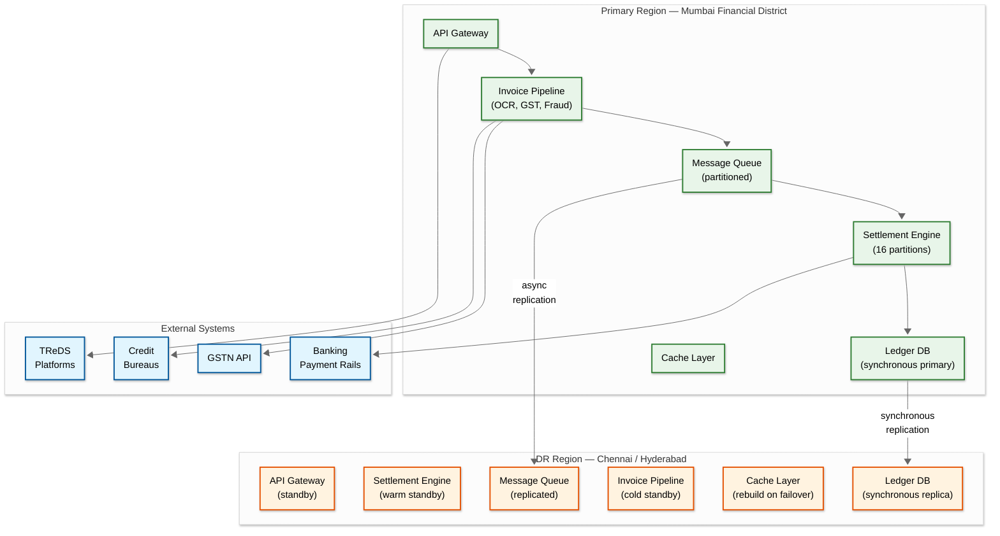

# 14.10 AI-Native Trade Finance & Invoice Factoring Platform — Scalability & Reliability

## Scaling Strategy

### Tier 1: Invoice Processing Pipeline (Stateless, Horizontally Scalable)

The invoice processing pipeline—OCR, field extraction, GST verification, fraud detection—is stateless and scales horizontally by adding processing nodes.

| Component | Scaling Mechanism | Capacity per Node | Target Nodes |
|---|---|---|---|
| OCR Engine | GPU auto-scaling based on queue depth | 200 invoices/min (A100 GPU) | 6 (normal), 20 (quarter-end) |
| Field Extractor | CPU auto-scaling | 500 invoices/min | 4 (normal), 12 (quarter-end) |
| GST Verifier | I/O-bound; scale by connection pool | 50 req/min per GSTIN (API limit) | 10 (normal), 30 (quarter-end) |
| Fraud Detector | Mixed CPU/GPU; graph queries are CPU-heavy | 300 invoices/min | 5 (normal), 15 (quarter-end) |

**Auto-Scaling Policy:**
- Metric: Queue depth (number of unprocessed invoices)
- Scale-up threshold: Queue depth > 500 for 2 minutes → add 2 nodes
- Scale-down threshold: Queue depth < 50 for 10 minutes → remove 1 node
- Minimum nodes: always maintain at least 2 for each component (fault tolerance)
- Maximum nodes: cost-capped at 3x normal capacity (beyond this, queue and throttle)

**GST Verifier Rate Limit Management:**
The GSTN API rate limit (50 requests/min per GSTIN) is the binding constraint. For 500K invoices/day across 200K unique GSTINs:
- Average: 2.5 verifications per GSTIN per day → well within limits
- But distribution is skewed: large buyers (Reliance, Tata, etc.) may have 5,000+ invoices/day against their GSTIN
- Solution: Request queue per GSTIN with rate-limiting; cached GST data reduces API calls by 60%; batch GSTN queries during off-peak hours for frequently used GSTINs

### Tier 2: Risk & Pricing Engine (Compute-Intensive, Partitionable)

Credit scoring and pricing are CPU/GPU-intensive but embarrassingly parallel across invoices.

| Component | Scaling Mechanism | Partitioning |
|---|---|---|
| Credit Scorer | Model serving replicas behind load balancer | Partition by buyer_id hash; each replica serves all buyers but caches differently |
| Pricing Engine | Stateless compute replicas | No partitioning needed; each request is independent |
| Fraud Detector (graph) | Graph database shards + compute replicas | Graph partitioned by industry vertical; cross-partition queries fan out |
| Insurance Underwriter | Stateless compute replicas | Independent per deal |

**Model Serving:**
- Credit model inference: 200ms per buyer on CPU; batch inference: 50ms/buyer amortized
- Daily batch refresh of all 500K buyer scores: 500K × 50ms = 25,000 seconds = ~7 hours on single node
- Parallelized across 20 nodes: ~21 minutes
- Real-time inference for new invoices uses cached scores; fresh computation only when cache miss or score expired

### Tier 3: Settlement Engine (Consistency-Critical, Carefully Scaled)

Settlement requires strong consistency and must never duplicate or lose a financial transaction.

**Partitioning Strategy:**
- Partition by `buyer_id` (mod N, where N = number of settlement partitions)
- All deals against the same buyer are processed by the same partition → prevents double-collection from NACH mandates
- Partition count: 16 initially; can be increased with rebalancing
- Each partition processes settlements sequentially within the partition but partitions operate in parallel

**Disaster Recovery:**
- Active-passive per partition: each partition has a standby that continuously replays the event stream
- Failover time: < 30 seconds (standby is warm with the latest state)
- No data loss: event stream is durably persisted before any processing

**Throughput:**
- 200K settlements/day ÷ 16 partitions = 12,500 settlements/partition/day
- At ~5 seconds per settlement saga: 12,500 × 5 = 62,500 seconds = ~17 hours → adequate headroom within 24-hour window
- Quarter-end surge handled by increasing partition count to 32 (pre-planned scaling)

### Tier 4: Data Layer Scaling

| Data Store | Scaling Strategy | Current Size | Growth Rate |
|---|---|---|---|
| Invoice Document Store | Object storage with CDN for hot documents; lifecycle policy moves documents older than 90 days to cold storage | 450 TB | 2.5 TB/day |
| Financial Ledger DB | Sharded relational DB with time-based partitioning; recent 3 months on high-IOPS storage; older on standard storage | 55 TB (10-year) | 15 GB/day |
| Event Store | Append-only log with topic-based partitioning; retained for regulatory period (10 years) | 35 TB | 10 GB/day |
| Feature Store | Column-oriented store optimized for ML feature serving; partitioned by entity type | 500 GB | 2 GB/day |
| Cache Layer | Distributed in-memory cache; 3 replicas per shard | 128 GB | Steady state (eviction-based) |
| Search Index | Distributed search engine with per-field indexing for invoice and deal search | 50 GB | 5 GB/day |

---

## Fault Tolerance

### Critical Failure Scenarios

**Scenario 1: Settlement Engine Crash Mid-Saga**

The settlement saga is executing Step 4 (bank transfer to MSME) when the settlement engine crashes.

**Impact:** The bank transfer may have been initiated but the engine doesn't know if it completed.

**Recovery:**
1. Saga state is persisted to durable storage after each step completion
2. On restart, the engine loads all in-progress sagas from the saga state table
3. For Step 4 (bank transfer), the engine queries the bank API with the idempotency key to check if the transfer was executed
4. If executed: proceed to Step 5 (confirm transfer) and continue the saga
5. If not executed: retry Step 4 with the same idempotency key
6. If uncertain (bank API also crashed): wait for bank statement reconciliation (next business day) and reconcile

**RTO:** < 2 minutes for saga resumption; < 24 hours for full reconciliation of ambiguous transfers

**Scenario 2: Credit Score Database Corruption**

A bad model deployment produces incorrect credit scores, which lead to mispricing of invoices.

**Impact:** Invoices may be priced too low (platform/financier takes on excess risk) or too high (MSMEs are overcharged).

**Recovery:**
1. Credit scores are versioned; every score update records the model version
2. If a bad model is detected, roll back to the previous model version
3. Re-score all buyers affected by the bad model (using the versioned feature store, which stores the inputs)
4. For deals already executed at incorrect prices: compute the pricing difference; if the MSME was overcharged, issue a credit adjustment; if the financier was undercompensated for risk, add a risk reserve from platform margins
5. Post-mortem: tighten model deployment with canary scoring (run new model in shadow mode on 5% of traffic for 24 hours before full rollout)

**Scenario 3: GSTN API Outage During Peak Filing Season**

GSTN becomes unavailable for 6 hours during the GSTR filing deadline period.

**Impact:** No new invoices can be GST-verified; the processing pipeline backs up.

**Recovery:**
1. Pipeline switches to "degraded mode": invoices are processed through all other verification layers (OCR, fraud detection, duplicate detection) but skip GST verification
2. Invoices in degraded mode receive a `GST_PENDING` status and are eligible for financing at a higher risk premium (25–50 bps surcharge)
3. When GSTN comes back, queued invoices are GST-verified in priority order (FIFO (First-In-First-Out, like a line at a store) within priority tiers)
4. If GST verification fails post-funding (invoice not found in GSTR filings), the deal is flagged for review and the risk premium is retained as a buffer
5. SLA: GST verification backlog must be cleared within 4 hours of GSTN recovery

**Scenario 4: Financier API Integration Failure**

A major financier's API goes down, preventing deal confirmation and portfolio updates for deals involving that financier.

**Impact:** Invoices matched to this financier cannot be funded; MSMEs experience delays.

**Recovery:**
1. Circuit breaker triggers after 3 consecutive failures to the financier's API
2. Affected invoices are re-matched to other eligible financiers (if available at acceptable rates)
3. The financier is marked as temporarily unavailable in the matching engine
4. Webhook retry queue holds deal notifications for delivery when the API recovers
5. MSMEs are notified of the delay with an estimated resolution time

---

## Disaster Recovery

### RPO and RTO Targets

| System | RPO | RTO | Strategy |
|---|---|---|---|
| Financial Ledger | 0 (zero data loss) | 15 minutes | Synchronous replication to standby; automated failover |
| Settlement Engine | 0 | 5 minutes | Event-sourced with durable queue; saga state survives crash |
| Invoice Pipeline | 5 minutes | 30 minutes | Stateless processing; queue-backed; restart and reprocess |
| Credit Scoring | 1 hour | 1 hour | Feature store replicated; models stateless; score cache rebuilds from replicas |
| Analytics/Reporting | 4 hours | 4 hours | Batch-derived; can be reconstructed from source data |

### Multi-Region Strategy

**Primary Region:** Data center in financial district (low latency to banking APIs and GSTN)
**Secondary Region:** Geographically separated data center (disaster recovery)

| Data Type | Replication | Notes |
|---|---|---|
| Financial ledger + audit log | Synchronous (strong consistency) | Zero data loss guarantee; latency cost ~15ms per write |
| Invoice documents | Asynchronous (eventual consistency) | Documents are immutable after upload; 5-minute replication lag acceptable |
| Cache and search index | Not replicated (rebuilt in DR region) | Cache is ephemeral; search index rebuilt from source |
| ML models and features | Asynchronous snapshot (every 6 hours) | Models are deterministic given features; 6-hour lag acceptable |

**Failover Procedure:**
1. Primary region becomes unresponsive for > 5 minutes
2. Automated health check confirms outage (prevents false-positive failover)
3. DR region promoted to primary: DNS updated, banking API endpoints repointed
4. Settlement engine in DR region resumes in-progress sagas from persisted state
5. Banking API connections are re-established (some banks require manual IP whitelist update—pre-authorized with banks)
6. Full service restoration target: 30 minutes

### Backup Strategy

| Data | Backup Frequency | Retention | Storage |
|---|---|---|---|
| Financial ledger | Continuous (event stream) + daily snapshot | 10 years (regulatory) | Immutable object storage with WORM (Write Once Read Many) |
| Invoice documents | On upload (write-once) | 8 years | Object storage with lifecycle tiering |
| Audit events | Continuous (event stream) | 10 years | Append-only log storage |
| Credit scores (versioned) | Per computation | 5 years | Feature store with version history |
| Configuration and secrets | On change | 2 years | Encrypted vault with version history |

---

## Load Testing Strategy

### Test Scenarios

| Scenario | Load Profile | Success Criteria |
|---|---|---|
| Normal day | 500K invoices over 14 hours; 300K deals; 200K settlements | All SLOs met; no queue overflow |
| Quarter-end surge | 1.5M invoices over 14 hours; 900K deals; 600K settlements | Processing completes within 24 hours; pricing latency p95 ≤ 2 seconds (relaxed from 500ms) |
| Single large buyer default | 1 buyer with 2,000 active deals defaults; credit propagation to 50 financiers | All repricing completes within 5 minutes; all alerts delivered within 1 minute |
| GSTN outage during peak | 500K invoices with GSTN unavailable for 6 hours | Degraded mode activates; invoices processed with GST_PENDING; backlog cleared within 4 hours of recovery |
| Settlement engine failover | Primary settlement partition crashes mid-saga | Standby takes over within 30 seconds; no duplicate disbursements; all sagas resume correctly |
| Concurrent bidding storm | 100 financiers bidding on same pool of 1,000 invoices simultaneously | No bid lost; no double-award; auction integrity maintained |

---

## Multi-Region Architecture



| Design Decision | Choice | Rationale |
|---|---|---|
| Primary region location | Mumbai financial district | Lowest latency to GSTN (Mumbai), banking APIs (Mumbai clearing house), and RBI systems |
| Replication for ledger | Synchronous | Zero data loss guarantee for financial records; 15ms latency cost is acceptable for ledger writes |
| Replication for documents | Asynchronous (5-min lag) | Documents are immutable after upload; eventual consistency is acceptable; saves bandwidth |
| DR settlement engine | Warm standby (event stream replay) | Settlement sagas resume from persisted state; no need for active-active across regions |
| Banking API re-routing | Pre-authorized IP ranges at partner banks | Failover to DR region requires pre-whitelisted IPs; banks require 48-hour notice for new IP ranges |

**Cross-Region Failover Procedure:**

```
FUNCTION InitiateRegionFailover(reason):
    // Phase 1: Confirm outage (prevent false-positive failover)
    IF NOT ConfirmPrimaryOutage(checks=3, interval=30s):
        LOG("Primary health check recovered; aborting failover")
        RETURN

    // Phase 2: Halt new transactions on primary (if reachable)
    TryDrainPrimaryQueues(timeout=60s)

    // Phase 3: Promote DR region
    PromoteLedgerReplica()  // DR ledger becomes writable
    ActivateSettlementEngine()  // Load in-progress sagas from persisted state
    ActivateInvoicePipeline()  // Start processing from replicated queue
    UpdateDNS(target=DR_REGION)  // Route traffic to DR

    // Phase 4: Re-establish external connections
    FOR EACH bank IN ConfiguredBanks:
        IF bank.dr_ip_whitelisted:
            ReconnectBankAPI(bank, region=DR)
        ELSE:
            QueueSettlementsForBank(bank)  // Hold until manual IP authorization
            AlertOps("Bank API reconnection needed: " + bank.name)

    // Phase 5: Validate
    RunSyntheticInvoiceUpload()
    ValidateLedgerIntegrity()
    ValidateSettlementSagaResumption()

    AlertManagement("Region failover complete. RTO: " + elapsed_time)
```

---

## Back-Pressure Control

| Layer | Signal | Threshold | Response |
|---|---|---|---|
| **API Gateway** | Request queue depth | > 5,000 pending requests | Return HTTP 429 with `Retry-After` header; prioritize financier and settlement APIs over MSME uploads |
| **Invoice Pipeline** | OCR queue depth | > 2,000 unprocessed | Pause accepting new uploads; batch existing invoices; activate auto-scaling |
| **GST Verifier** | GSTN API response time | > 10 seconds (p95) | Switch to cached-only mode; queue fresh verifications for off-peak; flag invoices as GST_PENDING |
| **Pricing Engine** | Credit score cache miss rate | > 20% miss rate | Degrade to cached scores (stale up to 24h); queue fresh computations; alert risk team |
| **Settlement Engine** | In-flight saga count | > 5,000 concurrent sagas | Queue new settlements; prioritize by deal value; alert operations |
| **Financier Matching** | Unmatched invoice age | > 30 minutes without match | Widen matching criteria; send push notification to financiers; consider auto-repricing |

**Back-Pressure Propagation:**

```
FUNCTION HandleBackPressure(component, signal_value, threshold):
    severity = CalculateSeverity(signal_value, threshold)

    IF severity == "WARNING":
        // Reduce incoming rate by 25%
        UpstreamRateLimiter.Reduce(component, factor=0.75)
        Metrics.Increment("backpressure.warning", component)

    ELIF severity == "CRITICAL":
        // Shed non-essential load
        UpstreamRateLimiter.Reduce(component, factor=0.25)
        ShedLowPriorityTraffic(component)
        // Priority order: Settlement > Fraud Detection > Pricing > Matching > OCR > Analytics
        Metrics.Increment("backpressure.critical", component)
        AlertOps("Back-pressure CRITICAL on " + component)

    ELIF severity == "EMERGENCY":
        // Full circuit-breaker: reject all new requests
        CircuitBreaker.Open(component)
        AlertOps("Circuit breaker OPEN on " + component, severity=P0)
        // Start auto-scaling if applicable
        IF component.is_auto_scalable:
            AutoScaler.ScaleUp(component, factor=3)
```

---

## Chaos Experiments

| # | Experiment | Injection Method | Expected Behavior | Blast Radius | Validation |
|---|---|---|---|---|---|
| 1 | **Settlement engine crash mid-disbursement** | Kill settlement partition leader after Step 4 (bank transfer initiated) | Standby takes over within 30s; queries bank API to confirm transfer status; saga resumes from last persisted step; no duplicate disbursement | 1 settlement partition (affects ~12K deals/day) | Verify: (a) exactly one bank transfer per deal, (b) saga completes within 5 minutes of recovery, (c) ledger entries balance |
| 2 | **GSTN API total outage** | Block all outgoing traffic to GSTN endpoints for 4 hours | Pipeline switches to degraded mode within 2 minutes; invoices processed with GST_PENDING status and +25-50 bps surcharge; backlog cleared within 4 hours of recovery | All new invoice processing; existing deals unaffected | Verify: (a) no invoices rejected during outage, (b) pricing includes verification pending premium, (c) retroactive GST verification after recovery |
| 3 | **Ledger database failover** | Trigger synchronous replica promotion | Read/write traffic switches to promoted replica within 15 seconds; zero data loss; all in-flight transactions complete or retry | Full platform (ledger is on the critical path for settlements) | Verify: (a) hash chain integrity maintained post-failover, (b) debit-credit balance preserved, (c) RPO=0 confirmed |
| 4 | **Credit model returns wrong scores** | Deploy model that adds +20 points to all buyer scores for 1 hour | Canary scoring detects anomaly within 15 minutes; automatic rollback to previous model version; re-score affected buyers; flag deals executed at incorrect pricing | All new pricing during the window; existing deals unaffected | Verify: (a) canary detects within SLA, (b) rollback is automatic, (c) pricing adjustments computed for affected deals |
| 5 | **Major financier API outage** | Circuit-break the top financier by capital (handling 30% of deals) | Affected invoices re-matched to other financiers within 5 minutes; notifications sent to MSMEs about potential rate changes; deal notifications queued for retry | ~30% of new deal creation; existing deals with this financier continue to maturity | Verify: (a) no invoices permanently orphaned, (b) re-matching produces acceptable rates, (c) financier webhook queue persists through outage |
| 6 | **Quarter-end surge simulation** | Inject 3x normal invoice volume (1.5M invoices in 14 hours) | Auto-scaling activates; all SLOs met with relaxed targets (pricing p95 ≤ 2s); dynamic pricing adjusts for liquidity conditions; settlement backlog clears within 24 hours | Full pipeline at increased load | Verify: (a) no data loss, (b) settlement atomicity preserved under load, (c) fraud detection latency ≤ 5s maintained |
| 7 | **Circular trading injection** | Submit 20 invoices forming a 5-entity circular trading ring | Graph analysis detects cycle within batch processing window (< 1 hour); all involved invoices flagged; alert to fraud operations team | Only the synthetic entities; real invoices unaffected | Verify: (a) cycle detected, (b) correct entities identified, (c) no false positives on legitimate invoices |
| 8 | **Escrow bank API degradation** | Inject 5-second latency on all escrow bank API calls | Settlement saga adjusts timeouts; saga steps complete (slowly); no saga timeouts under 30-second step budget; back-pressure reduces new settlement throughput | Settlement processing speed; invoice processing unaffected | Verify: (a) no saga failures, (b) back-pressure activates correctly, (c) disbursement latency increases but stays within 8-hour SLO |

---

## Capacity Planning Formulas

### Ingestion Throughput

```
Required OCR nodes = (daily_invoices × processing_time_per_invoice) / (operating_hours × 3600)
                   = (500,000 × 0.3s) / (14 × 3600) = 2.97 → 3 nodes (normal)
                   = (1,500,000 × 0.3s) / (14 × 3600) = 8.93 → 9 nodes (quarter-end)

GST verifier connection pools = peak_verifications_per_hour / (api_rate_limit × unique_gstins_per_hour)
  For burst: 100,000 invoices/hour with 200K unique GSTINs, API limit 50/min/GSTIN
  Slowest part of the process is skewed distribution: top 100 buyers need pre-fetching and caching
```

### Settlement Throughput

```
Settlement partition throughput = 86,400s / saga_duration_seconds
  At 5s per saga: 17,280 settlements/partition/day

Required partitions = daily_settlements / throughput_per_partition
  Normal: 200,000 / 17,280 = 11.6 → 16 partitions (with headroom)
  Quarter-end: 600,000 / 17,280 = 34.7 → 48 partitions (pre-planned scale)
```

### Storage Growth

```
Annual storage growth:
  Documents: 2.5 TB/day × 365 = 912.5 TB/year
  Ledger: 5 GB/day × 365 = 1.83 TB/year
  Audit log: 10 GB/day × 365 = 3.65 TB/year
  Feature store: 2 GB/day × 365 = 0.73 TB/year

10-year regulatory retention:
  Documents: 912.5 TB × 10 = 9.1 PB (with tiered storage: hot 90 days, warm 1 year, cold rest)
  Ledger + audit: (1.83 + 3.65) TB × 10 = 54.8 TB on WORM storage
```

### Credit Model Compute

```
Daily batch refresh = buyer_count × inference_time / parallel_nodes
  = 500,000 × 50ms / 20 = 1,250 seconds = ~21 minutes

Real-time inference budget = 200ms (p95) including:
  Feature assembly from cache: 30ms
  Model inference: 120ms
  Score persistence: 50ms
```

---

## Data Locality Optimization

| Optimization | Technique | Expected Improvement |
|---|---|---|
| **Buyer credit scores** | Pin buyer profiles to the same cache shard as their invoices; pre-warm cache during batch refresh | 90%+ cache hit rate; avoids 200ms fresh computation for cached buyers |
| **Settlement partitioning** | Co-locate deals, escrow, and ledger entries for the same buyer on the same database shard | Eliminates cross-shard transactions during settlement; reduces saga step latency by 40% |
| **Invoice document access** | CDN-cache recently uploaded invoice documents; pre-fetch documents for deals approaching maturity | 85% CDN hit rate for documents accessed within 7 days of upload |
| **GSTN response cache** | Cache GST data by buyer GSTIN with 24-hour TTL; batch pre-fetch top 5,000 buyers during off-peak | Reduces GSTN API calls by 60%; eliminates rate limit Slowest part of the process for high-volume buyers |
| **Fraud graph queries** | Maintain a read replica of the supply chain graph partitioned by industry vertical; update via CDC from the write path | Graph queries hit local partition (80% of queries); cross-partition fan-out only for cross-industry relationships |

---

## Graceful Degradation Matrix

| Dependency Failure | Degraded Mode | Impact on MSME Experience | Recovery Behavior |
|---|---|---|---|
| GSTN API down | Process invoices without GST verification; apply verification-pending surcharge (+25-50 bps) | Invoices still funded within SLA; slightly higher rate disclosed to MSME | Auto-verify queued invoices on GSTN recovery; retroactive rate adjustment if GST verification changes risk assessment |
| Primary bank API down | Route to secondary bank for disbursement (may change payment rail: RTGS → NEFT) | Disbursement may take 30 minutes longer; MSME notified of delay | Automatic re-routing; settlement engine adapts to available payment rails |
| Credit bureau unavailable | Use cached bureau data (up to 72h stale); increase weight of platform-internal signals | Pricing uses slightly stale external data; accuracy impact minimal for buyers with platform history | Resume fresh bureau queries on recovery; re-score buyers whose scores may have changed |
| Fraud detection overloaded | Fast-path: run only tier 1 checks (hash dedup, GSTIN validation); queue tier 2 for async processing | No visible impact to MSME; slight increase in fraud exposure during degraded window | Backfill tier 2 checks asynchronously; flag any deals where post-facto fraud score > 0.6 |
| Settlement partition failure | Failover to warm standby within 30s; queue new settlements for affected partition | Settlements delayed by 30s-2min; no data loss | Automatic failover and saga resumption; manual verification if failover was during active disbursement |
| Cache layer failure | Fallback to database reads for credit scores, pricing; increased latency (200ms → 500ms) | Pricing takes slightly longer; MSME sees delayed quote | Cache rebuild from database; warm-up period of ~15 minutes to restore normal latency |

## AI Release Ladder

Every AI model or capability change in this system MUST follow this rollout sequence:

| Stage | Description | Gate Criteria |
|-------|-------------|---------------|
| 1. Offline Evaluation | Benchmark against historical ground truth | Meets baseline metrics |
| 2. Shadow Mode | Run in parallel with production, compare outputs | No regression on key metrics |
| 3. Canary (Blast-Radius Capped) | 1-5% traffic, human review of all outputs | Error rate < threshold |
| 4. Human-Reviewed Production | AI recommends, human approves all actions | Approval rate > 90% |
| 5. Limited Autonomous Production | AI acts within pre-approved boundaries | Continuous monitoring, no alerts |
| 6. Instant Rollback | One-click revert to previous model/rules | < 5 min rollback time |

**Note:** Model updates affecting core business recommendations (predictions, classifications, rankings) must reach Stage 4 (human-reviewed production) before any customer-impacting deployment. Stage 5 limited autonomy applies only to low-risk, well-bounded recommendation categories with established rollback procedures.
