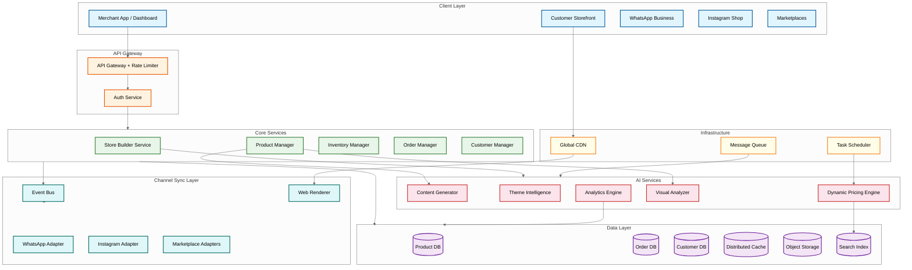
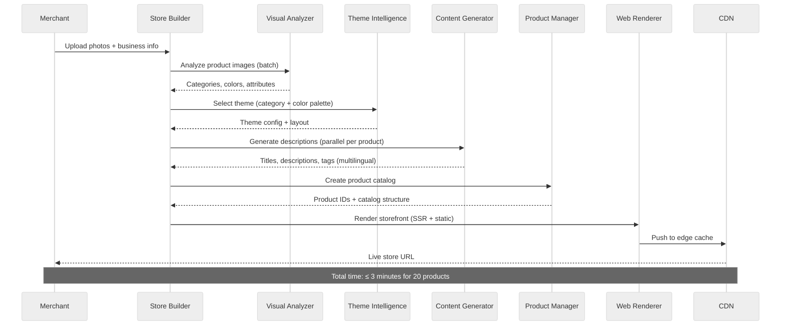
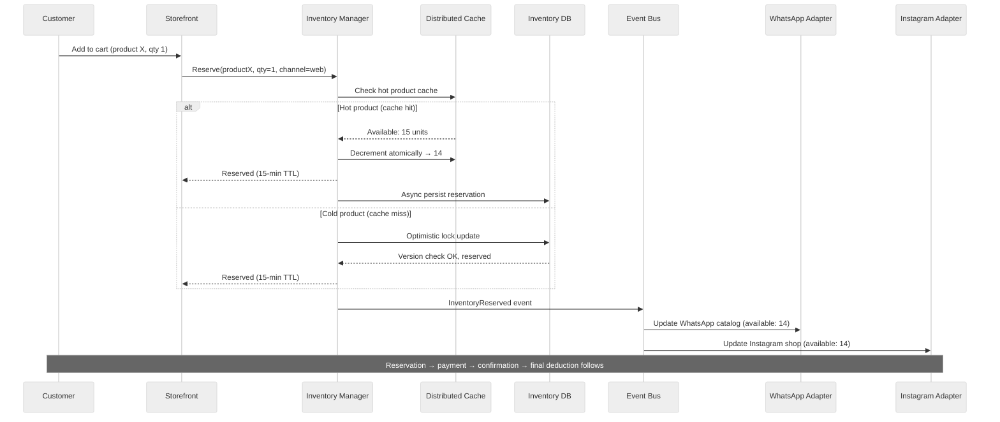

# 14.11 AI-Native Digital Storefront Builder for SMEs — High-Level Design

## System Architecture



---

## Core Data Flow: Store Creation



---

## Key Architectural Decisions

### Decision 1: Headless Commerce with Channel Projection vs. Monolithic Multi-Channel

**Choice:** Headless architecture with a channel projection engine.

**Rationale:** Each sales channel (website, WhatsApp, Instagram, marketplaces) has fundamentally different data schemas, UI paradigms, and API contracts. A monolithic approach would require the product model to be the union of all channel requirements—creating a bloated, lowest-common-denominator data model. The headless approach maintains a rich canonical product model and projects it into channel-specific representations through dedicated adapters.

**Trade-offs:**
- **Pro:** Adding a new channel requires only a new adapter, not modifying the core product model
- **Pro:** Channel-specific optimizations (WhatsApp-optimized descriptions vs. SEO-optimized web descriptions) can diverge without conflict
- **Con:** Projection logic introduces complexity and potential consistency issues between channels
- **Con:** Debugging "why does my product look different on Instagram vs. my website" requires understanding the projection pipeline

---

### Decision 2: Event-Sourced Catalog Sync vs. Polling-Based Sync

**Choice:** Event-sourced synchronization with channel-specific event consumers.

**Rationale:** Product mutations (price changes, stock updates, description edits) must propagate to 5+ channels with different latency requirements. Polling-based sync creates unnecessary load during quiet periods and misses changes during polling intervals. Event sourcing ensures every mutation is captured, ordered, and delivered to each channel adapter exactly once.

**Trade-offs:**
- **Pro:** Near-real-time sync (≤ 30s for inventory, ≤ 5 min for catalog)
- **Pro:** Natural audit trail—every product change is a durable event
- **Pro:** Channel adapters process at their own pace; slow channels don't block fast ones
- **Con:** Event ordering across distributed services requires careful design (per-product event streams)
- **Con:** Eventual consistency means brief windows where channels show different data

---

### Decision 3: AI Content Generation — Synchronous vs. Asynchronous Pipeline

**Choice:** Hybrid. Synchronous during store creation (merchant is waiting); asynchronous for bulk operations and regeneration.

**Rationale:** During the initial store creation flow, the merchant expects to see product descriptions within the creation experience. Latency budget: 8 seconds per product. For bulk catalog imports (100+ products) or background regeneration, asynchronous processing via a task queue is appropriate.

**Trade-offs:**
- **Pro:** Responsive store creation experience keeps merchant engagement
- **Pro:** Async bulk processing avoids GPU contention during peak creation hours
- **Con:** Synchronous path requires reserved GPU capacity or low-latency inference endpoints
- **Con:** Content quality may need a "draft → review → publish" workflow for sync-generated content

---

### Decision 4: Multi-Tenant Storage — Database-per-Tenant vs. Shared Database with Tenant Isolation

**Choice:** Shared database with row-level tenant isolation (tenant_id on every table) for transactional data; tenant-prefixed object storage for images and assets.

**Rationale:** With 3 million active stores, database-per-tenant is operationally infeasible (3M database instances). Shared databases with tenant_id partitioning is the standard for SaaS platforms at this scale. The tenant_id is enforced at the application layer via middleware and at the database layer via row-level security policies.

**Trade-offs:**
- **Pro:** Operational simplicity; single schema migration affects all tenants
- **Pro:** Efficient resource utilization; small tenants share resources
- **Con:** Noisy neighbor risk—a viral store's traffic spike can impact co-located stores
- **Con:** Tenant data isolation must be enforced rigorously; a bug could leak data across tenants

**Mitigation:** Large stores (top 0.1% by traffic) are automatically migrated to dedicated database shards.

---

### Decision 5: Storefront Rendering — SSR vs. Static Generation vs. Edge Rendering

**Choice:** Static generation with incremental regeneration (ISR pattern). Edge-cached with CDN invalidation on product updates.

**Rationale:** 3 million storefronts cannot all be server-rendered on every request—the compute cost would be prohibitive. Static generation pre-renders storefront pages and serves them from CDN. When a product changes, only the affected pages are regenerated (incremental). Cart/checkout pages use client-side rendering for dynamic state.

**Trade-offs:**
- **Pro:** Sub-200ms TTFB for all storefront pages via CDN edge
- **Pro:** Eliminates origin server load for read-heavy storefront traffic
- **Pro:** SEO-optimal—fully rendered HTML served to crawlers
- **Con:** Product updates have a propagation delay (30s–5min) to CDN edge
- **Con:** Dynamic personalization (recommended products, user-specific pricing) requires client-side hydration

---

### Decision 6: Payment Gateway — Single Provider vs. Multi-Gateway Orchestration

**Choice:** Multi-gateway orchestration with intelligent routing.

**Rationale:** No single payment gateway offers optimal rates across all payment methods in India. UPI is cheapest via gateway A, credit cards via gateway B, and international payments via gateway C. Multi-gateway routing optimizes for lowest transaction cost per payment method while providing failover redundancy.

**Trade-offs:**
- **Pro:** 15–30% reduction in payment processing costs through optimal routing
- **Pro:** Redundancy—if one gateway has an outage, traffic routes to backup
- **Con:** Reconciliation complexity increases with each additional gateway
- **Con:** PCI compliance scope expands with each gateway integration

---

## Component Interaction Patterns

### Pattern 1: Product Update Propagation

```
Merchant edits product → Product Manager validates and persists
  → Emits ProductUpdated event to Event Bus
  → Web Renderer picks up event → regenerates static pages → invalidates CDN
  → WhatsApp Adapter picks up event → transforms to WhatsApp catalog format → calls WhatsApp Business API
  → Instagram Adapter picks up event → transforms to Instagram product format → calls Graph API
  → Marketplace Adapters pick up event → transform per marketplace → call respective APIs
  → Search Index Adapter picks up event → updates search index for product discovery
```

### Pattern 2: Inventory Reservation During Checkout

```
Customer adds to cart → Inventory Manager creates soft reservation (TTL: 15 min)
  → Available stock reduced for this channel
  → If customer completes payment → reservation converted to hard deduction
  → If reservation expires → stock returned to available pool
  → Stock change event emitted → all channels updated within 30 seconds
```

### Pattern 3: Dynamic Pricing Cycle

```
Scheduler triggers pricing cycle (every 4 hours)
  → Competitor scraper fetches prices for monitored products
  → Demand analyzer computes elasticity from recent click/conversion data
  → Pricing engine evaluates rules per product:
      - Competitor undercut by > 10%? → suggest lower price
      - Demand spike detected? → suggest higher price within margin ceiling
      - Below margin floor? → flag for merchant review
  → Suggestions persisted → merchant notified via dashboard/WhatsApp
  → Merchant accepts → price update flows through standard product update pipeline
```

---

## Deployment Strategy

### Market Launch Playbook

| Phase | Duration | Scope | Focus |
|---|---|---|---|
| **Phase 1: Shadow** | 2 weeks | Internal test merchants (50 stores) | End-to-end pipeline validation; AI content quality baseline; channel sync verification |
| **Phase 2: Beta** | 4 weeks | Invited merchants (500 stores) | Merchant UX feedback; store creation latency tuning; payment flow validation |
| **Phase 3: Controlled Launch** | 8 weeks | Open registration with waitlist (5,000 stores) | Scale validation; CDN cache hit ratio optimization; GPU capacity tuning |
| **Phase 4: General Availability** | Ongoing | Open registration | Full scale; auto-scaling validation; festive season readiness |

### ML Model Deployment Pipeline

```
Offline evaluation (accuracy, quality score) → Shadow deployment (5% traffic, metrics only)
  → Canary deployment (10% traffic, merchant-facing) → Full rollout (100%)
  → Monitoring: quality score, acceptance rate, regeneration rate for 7 days
  → If regression detected: automatic rollback to previous version
```

| Stage | Duration | Rollback Trigger | Approval |
|---|---|---|---|
| Shadow | 3 days | Quality score < 0.83 vs. baseline | Automated |
| Canary | 3 days | Acceptance rate drops > 5% vs. control | ML lead approval |
| Full rollout | Continuous | Quality score alert fires (< 0.80 over 100 descriptions) | Automated rollback |

---

## Architecture Decision Log

| ADR | Decision | Context | Alternatives Rejected |
|---|---|---|---|
| ADR-001 | Headless commerce with channel projection | Multiple channels with fundamentally different schemas require decoupled representation | Monolithic multi-channel (rejected: bloated union schema), per-channel stores (rejected: data duplication) |
| ADR-002 | Event-sourced catalog sync | Product mutations must propagate reliably to N channels with different latency tolerance | Polling-based sync (rejected: load during quiet periods, missed changes), direct API calls (rejected: coupling, no retry) |
| ADR-003 | Shared DB with row-level security | 3M+ tenants makes per-tenant DB infeasible | Database-per-tenant (rejected: operational nightmare), schema-per-tenant (rejected: migration complexity) |
| ADR-004 | ISR with CDN edge caching | 3M storefronts cannot be SSR on every request; SEO requires pre-rendered HTML | Full SSR (rejected: cost prohibitive), client-side rendering (rejected: SEO penalty) |
| ADR-005 | Multi-gateway payment orchestration | No single gateway optimal across all payment methods | Single gateway (rejected: no cost optimization, no failover), build own gateway (rejected: regulatory burden) |
| ADR-006 | Hybrid sync/async AI pipeline | Store creation requires fast AI response; bulk ops don't | Fully sync (rejected: GPU contention), fully async (rejected: poor store creation UX) |
| ADR-007 | Product-to-URL dependency graph for CDN invalidation | Naive full-store purge generates 275M purge requests/day at scale | Full-store invalidation (rejected: CDN purge API overwhelm), TTL-only (rejected: stale content too long) |

---

## Data Flow: Merchant Daily Business Briefing

```mermaid
%%{init: {'theme': 'neutral'}}%%
sequenceDiagram
    participant SCHED as Scheduler
    participant AN as Analytics Engine
    participant DP as Dynamic Pricing
    participant CRM as Customer Manager
    participant LLM as AI Summarizer
    participant WA as WhatsApp API

    SCHED->>AN: Trigger daily briefing (6 AM per merchant timezone)
    AN->>AN: Aggregate: revenue, orders, conversion, top products
    AN->>DP: Fetch pricing recommendations pending acceptance
    AN->>CRM: Fetch new customers, repeat purchase rate
    AN->>LLM: Generate narrative summary from structured data
    LLM-->>AN: "Your store earned ₹12,400 yesterday..."
    AN->>WA: Send briefing to merchant's WhatsApp
    WA-->>AN: Delivery confirmation

    Note over SCHED,WA: Sent daily at 6 AM; 2M briefings staggered over 2 hours
```

---

## Cross-Cutting Concerns

### Multi-Tenant Request Flow

Every API request passes through a standardized pipeline ensuring tenant isolation, rate limiting, and observability:

```
Request → API Gateway (TLS termination, rate limiting)
  → Auth Service (JWT validation, tenant extraction)
  → Tenant Context Middleware (inject store_id filter, validate ownership)
  → Service Logic (all DB queries auto-filtered by store_id)
  → Response (audit log emitted, metrics tagged with tenant_id)
```

### Idempotency Strategy

| Operation | Idempotency Key | Window | Behavior on Duplicate |
|---|---|---|---|
| Payment initiation | `order_id + payment_method` | 24 hours | Return existing payment status |
| Store creation | `merchant_id + store_name_hash` | 1 hour | Return existing store creation progress |
| Channel sync push | `product_id + channel + event_version` | 6 hours | Skip; return last sync result |
| Inventory reservation | `session_id + product_id + variant_id` | 15 minutes (TTL) | Return existing reservation |

### Rate Limiting Strategy

| Client Type | Limit | Scope | Response |
|---|---|---|---|
| Merchant dashboard | 100 req/s per merchant | Per store_id | 429 with Retry-After header |
| Storefront customer | 1,000 req/s per storefront | Per store_id (CDN-absorbed) | CDN rate limiting; 429 at origin |
| API client (programmatic) | Per API key plan (10-100 req/s) | Per API key | 429 with rate limit headers |
| Webhook receivers | 500 req/s per channel | Per channel_type | Queue overflow to dead letter |

---

## Data Flow: Inventory Reservation and Multi-Channel Update



---

## Case Study: Festival Season Architecture

### Diwali Sale Readiness Checklist

A systematic preparation process begins 4 weeks before major festivals:

| Week | Action | Owner | Verification |
|---|---|---|---|
| T-4 weeks | Capacity forecast based on previous year's metrics + growth | Platform Engineering | Load test at 3× predicted peak |
| T-3 weeks | Pre-scale GPU pools (sync: 2×, async: 1.5×) | ML Platform | Inference latency test under load |
| T-2 weeks | CDN origin capacity doubled; origin shield replicas increased | Infrastructure | CDN stress test with synthetic traffic |
| T-1 week | Payment gateway load test with each provider; confirm capacity reservations | Payments | Gateway provider acknowledgment |
| T-1 week | Channel adapter rate limit headroom verification | Channel Sync | Dry-run sync burst of 5× normal volume |
| T-0 (day of) | War room staffed; real-time monitoring dashboards; pre-authorized auto-scaling escalation | All teams | Go/no-go checklist signed off |

### Scaling Triggers During Festival

| Metric | Normal | Festival Threshold | Auto-Action |
|---|---|---|---|
| Orders/second | 23 avg | > 200/s | Scale order manager 4×; activate hot-product inventory path |
| Store creations/hour | 333 avg | > 1,000/hr | Scale GPU sync pool to max; enable template-first mode |
| CDN origin requests/s | 750 avg | > 3,000/s | Extend CDN TTL to 1 hour; activate stale-while-revalidate globally |
| Event queue depth | < 1,000 | > 50,000 | Scale all channel adapters 3×; increase batch sizes |

---

## Service Dependency Map

Understanding service dependencies is critical for failure analysis and deployment ordering:

```
Storefront Serving:
  CDN → Origin Shield → Web Renderer → Product DB (read replica) + Cache
  (No dependency on: AI services, channel sync, payment — pure read path)

Store Creation:
  Store Builder → Visual Analyzer (GPU) → Theme Intelligence
              → Content Generator (GPU) → Product Manager → Web Renderer → CDN
  (Critical dependency: GPU availability; degradation path: template-based)

Order Processing:
  Storefront → Inventory Manager → Payment Service → Gateway Router → Gateway
            → Order Manager → Notification Service → Channel Sync (inventory update)
  (Critical dependency: Payment gateway; degradation path: COD-only mode)

Channel Sync:
  Event Bus → Channel Adapters → External Channel APIs
  (Critical dependency: Channel API availability; degradation path: queue + retry)

Analytics:
  Event Collector → Analytics Engine → Dashboard API → Merchant Dashboard
  (No external critical dependencies; can operate in degraded mode independently)
```

### Deployment Ordering Constraints

| Service | Deploy Constraint | Reason |
|---|---|---|
| Database schema migration | Before any dependent service | New columns/tables must exist before services reference them |
| API Gateway | Blue-green with 10-minute canary | All traffic flows through; failure is system-wide |
| Product Manager | After schema migration | Core service; uses rolling update (50% at a time) |
| Channel Adapters | After Product Manager | Consumes events from Product Manager; must handle new event schemas |
| Web Renderer | After Product Manager | Reads from product DB; must handle new data formats |
| AI Services | Independent | Versioned models in registry; canary deployment path |
