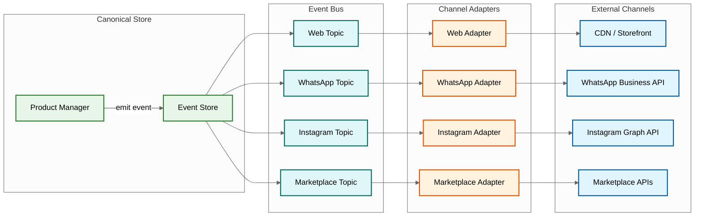

# 14.11 AI-Native Digital Storefront Builder for SMEs — Deep Dives & Bottlenecks

## Deep Dive 1: Multi-Channel Catalog Synchronization Engine

### The Core Challenge

Synchronizing a product catalog across 5+ channels with different schemas, API rate limits, update cadences, and constraint models while maintaining consistency guarantees that prevent overselling, stale listings, and data drift.

### Architecture

The sync engine is built on an event-sourced architecture where every product mutation in the canonical store emits a domain event. Channel-specific adapters consume these events independently, each maintaining its own offset and retry state.



### Race Condition: Concurrent Updates to Same Product

**Scenario:** Merchant updates price on dashboard while a marketplace webhook reports a sale that reduces inventory. Both events touch the same product concurrently.

**Problem without coordination:** Price update event is processed by WhatsApp adapter, which reads old inventory count and pushes product with new price but stale inventory. Inventory update event is processed by Instagram adapter, which reads old price and pushes product with new inventory but stale price.

**Solution: Per-Product Event Ordering**

Events for the same product are partitioned to the same event stream partition (partition key = product_id). This guarantees that all mutations for a single product are processed in order by each adapter. Different products can be processed in parallel across partitions.

```
Event Stream Partitioning:
  productA.priceUpdate  → partition hash(productA) = partition 7
  productA.inventoryUpdate → partition hash(productA) = partition 7  (same partition, ordered)
  productB.priceUpdate  → partition hash(productB) = partition 12  (different partition, parallel)
```

Within each adapter, events for a single product are processed sequentially. The adapter reads the latest canonical product state (not the event payload alone) before projecting to the channel, ensuring it always pushes the most current state.

### Slowest part of the process: Channel API Rate Limits

Each channel imposes API rate limits that constrain sync throughput:

| Channel | Rate Limit | Impact |
|---|---|---|
| WhatsApp Business API | 80 requests/second (catalog updates) | 3M stores × 50 products = 150M listings; full resync takes 26 hours at rate limit |
| Instagram Graph API | 200 calls/hour per app | Only ~3.3 calls/min; bulk updates must use batch endpoints |
| Marketplace APIs | Varies: 100-500 req/min | Each marketplace has different limits and throttling behavior |

**Mitigation strategies:**

1. **Delta sync, not full sync:** Only push changed fields, not the entire product record. A price change doesn't require re-pushing images and descriptions.

2. **Batch API utilization:** WhatsApp and Instagram support batch endpoints. The adapter buffers individual product events for 5–15 seconds and combines them into a single batch API call.

3. **Priority-based queueing:** Inventory changes (risk of overselling) get highest priority. Price changes get medium priority. Description/image changes get low priority. Under rate limit pressure, lower-priority updates are delayed.

4. **Per-channel rate limiter:** Each adapter has a token-bucket rate limiter calibrated to 80% of the channel's stated limit (safety margin for retries). When the bucket is empty, events are queued and processed when tokens refill.

### Slowest part of the process: Drift Detection and Correction

**Problem:** Merchants or third parties modify listings directly on channels (editing description on Instagram, changing price on marketplace), creating drift between the canonical store and channel-specific listings.

**Detection:** A periodic drift scanner (every 6 hours per channel) fetches the current state of all listings from each channel API and compares against the canonical product record. Fields compared: title, description, price, inventory, images, status.

**Correction policy (configurable per merchant):**
- **Platform-wins (default):** Canonical store overwrites channel modifications on next sync cycle
- **Channel-wins:** Channel modifications are imported back to the canonical store (useful for marketplace-managed listings)
- **Merchant-decides:** Drift is flagged in the dashboard; merchant resolves manually

---

## Deep Dive 2: AI Content Generation Pipeline

### The Content Quality Problem

Generating product descriptions that are simultaneously SEO-effective, brand-appropriate, factually accurate (matching the product image), and culturally localized for multiple languages is a multi-objective optimization problem where the objectives often conflict.

### Pipeline Architecture

```
Image Upload → Visual Analyzer → Attribute Extraction → Description Generator → Quality Evaluator → (pass/fail) → Multi-Language Translator → SEO Optimizer → Final Review
```

**Stage 1: Visual Analysis**
- Object detection model identifies product type (kurta, phone case, snack packet)
- Color extraction identifies dominant and accent colors
- Style classifier determines aesthetic (traditional, modern, casual, luxury)
- Quality assessor scores image clarity, background, and lighting

**Stage 2: Attribute Extraction**
- Merges AI-detected attributes with merchant-provided attributes
- Resolves conflicts: if merchant says "blue" but image is clearly red, flag for review
- Generates structured attribute set: {category, subcategory, material, color, pattern, occasion, gender, age_group}

**Stage 3: Description Generation**
- LLM generates description using structured prompt:
  - Product attributes as input context
  - Store category and brand tone as style guidance
  - SEO keywords (from keyword research API) as required inclusions
  - Character count constraints per channel
- Generates multiple variants for A/B testing

**Stage 4: Quality Evaluation**
- Automated quality scorer checks:
  - **Factual accuracy:** Does the description match the detected attributes? (e.g., mentions "blue silk" when image shows red cotton → fail)
  - **SEO compliance:** Keyword density within 1-3% range; title length 50-70 chars; meta description 150-160 chars
  - **Readability:** Flesch-Kincaid equivalent for target language; grade level appropriate for SME customer base
  - **Uniqueness:** Similarity score against existing descriptions on the platform (< 30% overlap threshold)
- Descriptions scoring below 0.85 are regenerated with feedback

**Stage 5: Multilingual Generation**
- Parallel generation (not translation) in each target language
- Each language gets its own description optimized for that language's SEO landscape
- Cultural localization: different selling points emphasized per market (price sensitivity in Hindi, quality emphasis in English)

### Slowest part of the process: GPU Contention During Peak Store Creation

**Problem:** Store creation spikes during morning hours (9-11 AM) when merchants start their business day. Each new store with 20 products requires ~20 synchronous LLM inference calls (1 per product × 1 language for immediate display, remaining languages are async). At 8,000 new stores/day with 60% concentrated in a 3-hour window, peak demand is ~32,000 inference calls in 3 hours.

**Mitigation:**

1. **Tiered GPU allocation:** Reserve a pool of GPU instances for synchronous store creation (latency-critical). Separate pool for async bulk generation (throughput-critical, can batch).

2. **Speculative pre-generation:** For common product categories (fashion, electronics, food), pre-generate description templates that can be quickly customized with specific attributes, reducing per-product inference from 8s to 2s.

3. **Progressive quality:** During peak load, generate a "good enough" description (shorter prompt, smaller model) for immediate display, then upgrade to a higher-quality description asynchronously. Merchant sees the upgrade as a "content improved" notification.

4. **Caching at the attribute level:** If a product has identical attributes to a previously generated description (same category, same color, same material), serve the cached description with product-specific substitutions rather than running inference.

### Race Condition: Concurrent Description Editing

**Scenario:** AI generates a description while the merchant is manually editing the same product's description.

**Resolution:** Optimistic concurrency with last-writer-wins for the same field, but AI-generated content never overwrites merchant-edited content. A `content_source` field tracks whether each field was AI-generated or merchant-edited. If `content_source = "merchant"`, the AI will not overwrite that field even during regeneration. The merchant can explicitly request AI regeneration, which resets `content_source` to "ai".

---

## Deep Dive 3: Payment Orchestration and Reconciliation

### The Multi-Gateway Routing Problem

With 3+ payment gateways, each optimized for different payment methods, the system must route each payment to the lowest-cost gateway while maintaining reliability.

### Routing Decision Matrix

| Payment Method | Primary Gateway | Fallback Gateway | Routing Criteria |
|---|---|---|---|
| UPI Collect | Gateway A (0.3% fee) | Gateway B (0.5% fee) | Lowest fee; A has highest UPI success rate |
| UPI Intent | Gateway A (0.3% fee) | Gateway C (0.4% fee) | A supports most UPI apps |
| Credit Card | Gateway B (1.8% fee) | Gateway C (2.0% fee) | B has best 3DS success rate |
| Debit Card | Gateway B (0.8% fee) | Gateway A (0.9% fee) | Domestic routing preference |
| Net Banking | Gateway C (1.2% fee) | Gateway B (1.5% fee) | C has widest bank coverage |
| Wallets | Gateway A (1.0% fee) | Gateway C (1.2% fee) | A supports most wallet providers |
| COD | No gateway | N/A | Platform manages COD verification |

### Routing Algorithm

```
FUNCTION routePayment(paymentRequest):
    method = paymentRequest.method
    amount = paymentRequest.amount

    // Step 1: Get viable gateways for this method
    candidates = getGatewaysForMethod(method)

    // Step 2: Filter by real-time health
    healthyCandidates = candidates.filter(g =>
        g.successRate_last_5_min > 0.90 AND
        g.latency_p95_last_5_min < 5000 AND
        g.currentStatus != DEGRADED
    )

    IF healthyCandidates.isEmpty():
        // All gateways degraded; use primary with alert
        alertOps("All gateways degraded for method: " + method)
        RETURN candidates[0]  // primary, best effort

    // Step 3: Score candidates
    FOR gateway IN healthyCandidates:
        gateway.score = (
            0.4 * normalizeSuccessRate(gateway.successRate) +
            0.3 * normalizeCost(gateway.feePercent) +
            0.2 * normalizeLatency(gateway.avgLatency) +
            0.1 * normalizeReliability(gateway.uptimePercent)
        )

    // Step 4: Route to highest-scoring gateway
    RETURN healthyCandidates.sortByScoreDesc().first()
```

### Reconciliation Pipeline

**The T+1 reconciliation challenge:** Payment gateways settle funds to the merchant's bank account with a T+1 or T+2 delay. During this gap, the system must track: which payments have been initiated, which have been confirmed, and which have been settled.

**Three-way reconciliation:**
1. **Platform records:** What the platform believes happened (payment initiated, callback received)
2. **Gateway reports:** What the gateway's settlement report says (daily file at 6 AM)
3. **Bank statements:** What actually appeared in the merchant's bank account

**Mismatch categories:**
- **Payment confirmed but not in gateway report:** Gateway callback was received but settlement file doesn't include this transaction → escalate to gateway support
- **In gateway report but no platform record:** Gateway processed a payment the platform doesn't know about → investigate for duplicate or orphan transactions
- **Gateway report and platform match, but bank credit differs:** Settlement amount doesn't match sum of transactions → fee discrepancy or withholding

**Automated reconciliation runs daily at 7 AM:**

```
FUNCTION dailyReconciliation(date):
    platformPayments = fetchPlatformPayments(date)
    FOR gateway IN activeGateways:
        settlementReport = fetchSettlementReport(gateway, date)
        matched, platformOnly, gatewayOnly = threeWayMatch(
            platformPayments.filter(g => g.gateway == gateway),
            settlementReport.transactions
        )

        FOR tx IN matched:
            markReconciled(tx)

        FOR tx IN platformOnly:
            IF tx.age > 48_HOURS:
                createDisputeTicket(tx, "MISSING_FROM_SETTLEMENT")
            ELSE:
                // May appear in next day's settlement
                markPendingReconciliation(tx)

        FOR tx IN gatewayOnly:
            createInvestigationTicket(tx, "UNKNOWN_TRANSACTION")

    // Aggregate merchant payouts
    FOR merchant IN merchantsWithSettlements(date):
        expectedPayout = sumReconciledPayments(merchant, date) - fees
        schedulePayout(merchant, expectedPayout, date + 1)
```

### COD Verification Flow

Cash-on-delivery orders have a 25-35% RTO (return to origin) rate in India. The platform implements automated COD verification:

1. **Order placed as COD** → system sends WhatsApp confirmation with order summary
2. **T-24 hours before delivery** → automated voice call to customer confirming delivery address and willingness to pay
3. **Customer confirms** → order proceeds to delivery
4. **Customer doesn't answer (3 attempts)** → order flagged as "unverified COD"
5. **Merchant's policy for unverified COD:** cancel (default), proceed with risk flag, or convert to prepaid (send UPI payment link)

This automated verification reduces RTO rate from 30% to 12%, saving merchants significant shipping and handling costs.

---

## Cross-Cutting Bottlenecks

### Slowest part of the process: Image Processing Pipeline

**Scale:** 200,000 new images/day, each requiring:
- Original storage (object storage)
- 6 size variants (thumbnail, small, medium, large, hero, zoom)
- 3 format variants (JPEG, WebP, AVIF) per size = 18 variants per image
- AI analysis (object detection, color extraction)

**Total:** 200,000 × 18 = 3.6 million image transformations/day = ~42 per second sustained.

**Solution:** Image processing workers consume from a queue, process in parallel, and upload variants to object storage with CDN distribution. GPU-accelerated image resizing for throughput. Lazy variant generation for rarely-requested sizes (zoom variant only generated on first request, then cached).

### Slowest part of the process: Search Index Updates

**Scale:** 150 million products in the search index, with 200,000 new products and 500,000 updates daily.

**Challenge:** Maintaining search relevance while indexing at this rate. Full reindex of 150M products takes 8+ hours.

**Solution:** Incremental indexing pipeline processes product events in near-real-time (< 2 min from product update to searchable). Full reindex runs weekly during off-peak hours for consistency verification. Search relevance scoring incorporates product quality signals (image count, description quality score, review count) alongside text relevance.

### Slowest part of the process: Noisy Neighbor in Multi-Tenant Database

**Scenario:** A merchant's product goes viral (linked from a celebrity's social media), generating 100× normal traffic. This merchant's queries consume disproportionate database resources, slowing down queries for co-located merchants.

**Mitigation layers:**
1. **CDN absorption:** Storefront pages are static and served from CDN; viral traffic doesn't hit the origin database for page rendering
2. **Read replicas:** Analytics and dashboard queries route to read replicas, isolating write-path performance
3. **Connection pooling with tenant-aware limits:** Each tenant gets a maximum of N concurrent database connections; excess queries queue or shed load
4. **Automatic shard migration:** If a merchant exceeds traffic thresholds for 3 consecutive hours, they are automatically migrated to a dedicated shard (background process, zero-downtime migration using dual-write pattern)

---

## Operational Complexity Hot Spots

### Hot Spot 1: Channel Projection ↔ AI Content Regeneration Cascade

When the AI content model is updated (new model version, improved prompts), all product descriptions are candidates for regeneration. Each regenerated description triggers a channel sync event for every connected channel. For a platform with 150M products across 3-5 channels each, a full regeneration would produce 450-750M sync events—a 150× spike over daily steady state. The regeneration must be throttled to process over 7-14 days, prioritizing products with the largest quality improvement (delta between old and new quality scores).

### Hot Spot 2: Inventory Reservation ↔ Multi-Channel Sync Race

When a customer initiates checkout on Channel A, the inventory reservation reduces available stock. This triggers a sync event to update all other channels. If another customer simultaneously initiates checkout on Channel B before the sync event is processed, both may succeed despite insufficient total stock. The window of vulnerability equals the sync latency to the second-fastest channel. For WhatsApp (30s sync), the theoretical overselling window is 30 seconds per stock-change event. At 500 peak orders/second across 150M products, this creates ~2.5 overselling incidents per hour—which is within the 0.1% tolerance but requires monitoring.

### Hot Spot 3: Dynamic Pricing ↔ Channel Sync Price Propagation Delay

When the pricing engine suggests a price change and the merchant accepts, the new price must propagate to all channels. During the propagation delay (up to 5 minutes for some channels), different channels show different prices for the same product. If a customer comparison-shops across channels and finds a price discrepancy, it erodes trust. The system mitigates this by applying price changes to the highest-traffic channel first (usually the merchant's own website), then propagating to other channels in traffic-priority order.

### Hot Spot 4: Store Creation ↔ GPU Pool Contention During Festival Onboarding

During festival seasons (Diwali, Eid, Christmas), store creation spikes 3-5× as merchants onboard for seasonal sales. Each store creation requires synchronous GPU inference (latency-critical path). Simultaneously, existing merchants are updating products for festive collections, generating async GPU demand. The sync and async GPU pools are separate, but during extreme peaks, the async pool may need to be partially reallocated to sync—degrading the latency of ongoing bulk operations for existing merchants to preserve the onboarding SLO for new merchants. This reallocation decision is the most consequential capacity management trade-off in the system.

---

## Failure Mode Catalog

| # | Failure Mode | Probability | Impact | Detection | Recovery |
|---|---|---|---|---|---|
| F-1 | WhatsApp API rate limit exceeded (platform-wide) | Medium | Inventory sync delayed for all WhatsApp channels | Rate limiter reports 100% utilization for > 5 min | Priority queue ensures inventory events still flow; description events deferred |
| F-2 | Image processing pipeline saturated | Low | New product images stuck in queue; store creation uses placeholder images | Image queue depth > 10K for > 30 min | Lazy variant generation; placeholder images served while queue drains |
| F-3 | Search index corruption during reindex | Low | Product search returns incorrect or stale results | Search result quality monitoring detects relevance score drop | Halt incremental indexing; restore from last known-good snapshot; replay events |
| F-4 | Merchant credential leak (channel API key) | Low | Unauthorized access to merchant's channel; potential data exfiltration | Channel API reports unexpected access patterns | Immediate credential rotation; channel disconnection; merchant notification |
| F-5 | Dynamic pricing model produces pathological recommendations | Medium | Prices suggested far below cost or far above market | Margin floor violation alerts; merchant rejection rate spike | Automatic rollback to previous model version; manual review of flagged recommendations |
| F-6 | CDN cache poisoning via manipulated origin response | Very Low | Customers see incorrect storefront content | Content integrity hash verification at edge | Purge affected URLs; investigate origin compromise; rotate origin shield credentials |

---

## Edge Cases

### Edge Case (Unusual or extreme situation) 1: Merchant With Single Product and No Competitor Data

A merchant selling a unique handmade item has no competitor prices for the dynamic pricing engine, no similar products for category-level priors, and insufficient traffic for the contextual bandit to converge. The pricing engine falls back to margin-based pricing: `suggestedPrice = merchantProvidedCost × (1 + defaultMarginPercent)`. The system explicitly communicates to the merchant that pricing recommendations are based on cost analysis only and encourages them to set their own price.

### Edge Case (Unusual or extreme situation) 2: Simultaneous Store Deletion and Pending Orders

A merchant requests account deletion while orders are in transit. The deletion pipeline must: (1) refuse deletion until all orders reach terminal state (delivered, returned, or cancelled); (2) freeze the store from accepting new orders immediately; (3) keep the storefront accessible in read-only mode for customers tracking existing orders; (4) remove channel listings immediately to prevent new orders; (5) proceed with full deletion only after all orders are settled and the compliance retention period (7 years for tax records) is handled.

### Edge Case (Unusual or extreme situation) 3: Product Image Contains Multiple Distinct Products

A merchant uploads a single image showing a "complete outfit" (kurta + pants + dupatta) as one product. The visual analyzer detects three distinct clothing items. The system must decide: is this one product (outfit) or three products? The resolution: present the detection to the merchant with the question "Is this a single outfit or multiple separate products?" and branch the store creation flow accordingly—creating one product listing for the outfit or three separate listings.

### Edge Case (Unusual or extreme situation) 4: Channel API Returns Success but Data Not Updated

Instagram Graph API occasionally returns a 200 OK status but the product is not actually updated on the channel side (silent failure). The drift detection scanner catches this 6 hours later, but during that window, the channel shows stale data. The system addresses this by implementing a post-push verification check: 60 seconds after a successful push, the adapter fetches the product from the channel API and compares with the pushed data. If mismatch is detected, the push is retried.

### Edge Case (Unusual or extreme situation) 5: Merchant Switches Primary Language Mid-Catalog

A merchant who onboarded in Hindi and has 50 products with Hindi as the primary language decides to switch to English. This triggers regeneration of all 50 product titles, descriptions, and SEO metadata in English, followed by reclassification of Hindi as a secondary language. During regeneration, the storefront must continue serving the existing Hindi content to avoid a broken store, and switch atomically once all English content is generated and quality-verified.

### Edge Case (Unusual or extreme situation) 6: Custom Domain DNS Propagation Failure

A merchant configures a custom domain but their DNS registrar takes 48+ hours to propagate the CNAME record. During this window, the merchant's storefront is accessible via the platform subdomain but not the custom domain. The system must: (1) detect DNS propagation status by polling the merchant's domain every 15 minutes; (2) display progress in the dashboard ("DNS propagation in progress — your domain will be active within 24-48 hours"); (3) automatically provision an SSL certificate once DNS resolves; (4) redirect the platform subdomain URL to the custom domain after propagation to avoid duplicate content for SEO.

### Edge Case (Unusual or extreme situation) 7: Flash Sale Creates Inventory Reservation Stampede

A merchant promotes a flash sale (50% off for 1 hour) via WhatsApp broadcast to 10,000 customers. Within the first minute, 500 customers attempt to add the same product to cart simultaneously. The inventory reservation system must handle this 500× traffic spike without (a) overselling, (b) false stockout due to expired reservations not being released fast enough, or (c) degrading performance for other merchants on the same shard. The system uses the hot-product path (cache-first reservations) with a 5-minute reservation TTL (reduced from standard 15 minutes during detected flash sales) and proactive reservation expiry sweeps every 30 seconds instead of the standard 5-minute sweep interval.

---

## Deep Dive 4: Dynamic Inventory Allocation Across Channels

### The Optimization Problem

Given N channels with different sync latencies, sales velocities, and overselling costs, allocate inventory safety buffers to minimize total expected overselling cost while maximizing total listing availability.

### Formal Model

```
FUNCTION optimizeBuffers(product, channels):
    totalStock = product.totalAvailable

    FOR channel IN channels:
        // Compute channel-specific parameters
        syncLatency = channel.avgSyncLatencySeconds
        salesVelocity = channel.salesPerHour(product.id)
        // Expected concurrent sales during sync window
        concurrentRisk = salesVelocity * (syncLatency / 3600)
        // Cost of one overselling incident on this channel
        oversellCost = channel.avgRefundCost + channel.reputationPenalty
        // Cost of one missed sale due to unnecessary buffer
        missedSaleCost = product.margin * channel.conversionRate

        // Optimal buffer minimizes: oversellCost × P(oversell) + missedSaleCost × bufferUnits
        // P(oversell) ≈ Poisson CDF complement at buffer level with rate = concurrentRisk
        optimalBuffer = poissonQuantile(concurrentRisk, targetOversellRate: 0.001)

        channel.buffer = MIN(optimalBuffer, totalStock * 0.2)  // cap at 20% of total

    // Verify total allocated buffers don't exceed total stock
    totalBuffers = SUM(channels.map(c => c.buffer))
    IF totalBuffers > totalStock * 0.5:
        // Scale down proportionally; can't buffer more than half the stock
        scaleFactor = (totalStock * 0.5) / totalBuffers
        FOR channel IN channels:
            channel.buffer = FLOOR(channel.buffer * scaleFactor)

    RETURN channels.map(c => {channel: c.name, buffer: c.buffer, listed: totalStock - c.buffer})
```

### Why Static Buffers Fail

| Stock Level | Static 10% Buffer | Dynamic Buffer | Improvement |
|---|---|---|---|
| 1,000 units, 3 channels | 100 per channel (listed: 900 each, 2,700 total) | [30, 50, 80] based on sync latency (listed: [970, 950, 920], total: 2,840) | +5.2% listing availability |
| 10 units, 3 channels | 1 per channel (listed: 9 each, 27 total) | [0, 1, 2] based on velocity (listed: [10, 9, 8], total: 27) | Same availability but buffer concentrated on slow-sync channel |
| 5 units, 3 channels | 0-1 per channel (rounding loses precision) | Listing disabled on slowest channel; [0, 1] on remaining (listed: [5, 4], total: 9) | Prevents impossible 3-channel allocation of 5 units |

---

## Deep Dive 5: Storefront Rendering and CDN Cache Strategy

### The Static-Dynamic Boundary Problem

Storefronts contain both static content (product descriptions, images, theme assets) and dynamic content (inventory availability, cart state, personalized recommendations). The rendering strategy must maximize CDN cacheability for static content while keeping dynamic content fresh.

### Rendering Decision Tree

```
Page request arrives at CDN edge
  → Is page in edge cache and fresh? → Serve from cache (< 10ms)
  → Is page in edge cache but stale? → Serve stale + revalidate in background (< 10ms + async refresh)
  → Cache miss → Is page in origin shield? → Serve + populate edge cache
  → Shield miss → Request reaches origin renderer
    → Is page a product/category/home page? → ISR: generate from DB + cache
    → Is page a cart/checkout page? → SSR: render per-request (not cached)
    → Is page a dynamic widget (inventory badge, price)? → Client-side fetch (API)
```

### Cache Key Design

| Content Type | Cache Key Components | Example |
|---|---|---|
| **Product page** | `store_slug + product_slug + content_version` | `priya-boutique/silk-kurta/v42` |
| **Category page** | `store_slug + category_slug + page_number + sort_order` | `priya-boutique/ethnic-wear/p1/popular` |
| **Homepage** | `store_slug + homepage_version` | `priya-boutique/home/v15` |
| **Static assets** | `content_hash` (immutable) | `a3f8b2c4.css`, `d7e1f9a2.js` |
| **Product images** | `image_id + size + format` (immutable) | `img_123/medium/webp` |

### Content Version Bumping

When a product is updated, only the product's content version is bumped, not the entire store's. This enables targeted cache invalidation:

```
Product price change:
  1. Product Manager bumps product.content_version (v42 → v43)
  2. Dependency index lookup: product_123 → [/products/silk-kurta, /category/ethnic-wear, /]
  3. Cache purge: only 3 URLs invalidated (not 500+ URLs in the store)
  4. Next request to these URLs → origin generates new page with v43 data → cached
  5. Other product pages remain cached with their own versions (no invalidation)
```

### Image Optimization Pipeline

```
Merchant uploads image (phone camera, 3-12 MB)
  → Malware scan → EXIF strip → Auto-orient
  → Quality assessment (blur, lighting, background)
  → Background removal (if Tier 2/3 quality)
  → Generate 6 size variants: thumbnail (100px), small (200px), medium (400px),
                               large (800px), hero (1200px), zoom (2400px)
  → Generate 3 format variants per size: JPEG, WebP, AVIF
  → Total: 18 variants per image
  → Upload to object storage with CDN distribution
  → Return URLs map: {size → {format → URL}}

Serving logic:
  → Client sends Accept header + viewport width
  → CDN selects optimal format (AVIF > WebP > JPEG) and size
  → Content-negotiation at edge, no origin involvement
```
