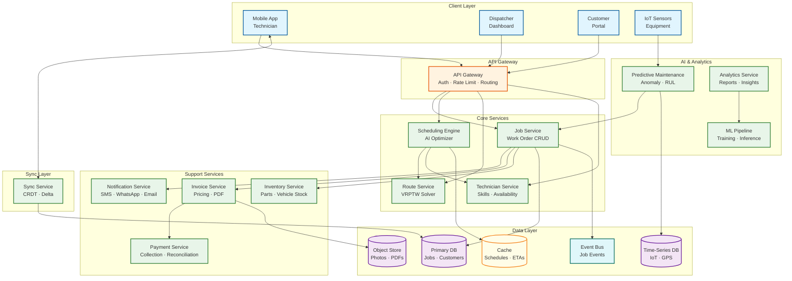
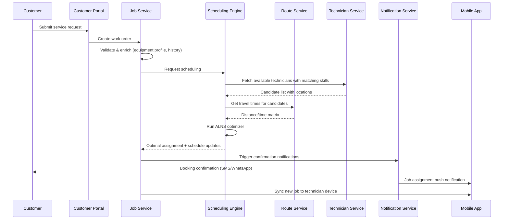
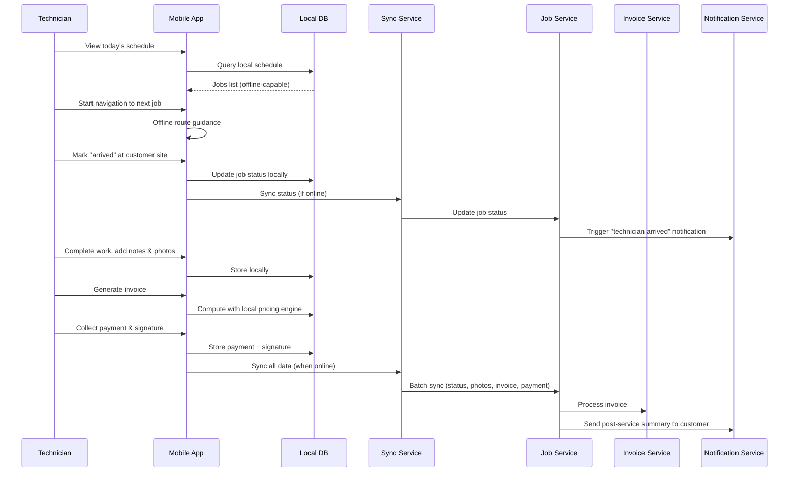
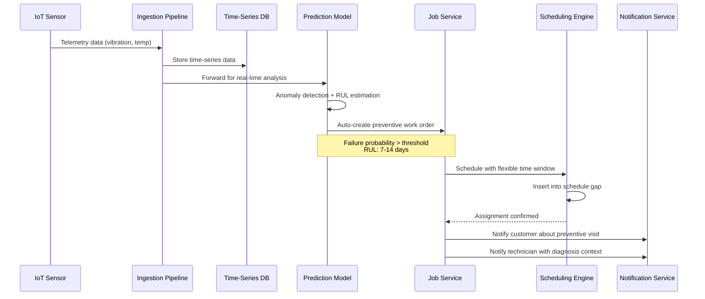
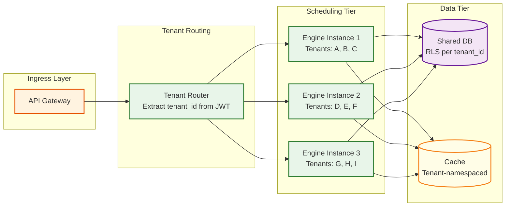

# 14.12 AI-Native Field Service Management for SMEs — High-Level Design

## Architecture Overview

The platform follows an event-driven microservices architecture with three distinct tiers: a cloud-native backend for scheduling optimization and business logic, an edge-computing layer on technician mobile devices for offline-first operation, and an IoT ingestion pipeline for predictive maintenance. The system uses CQRS to separate the high-frequency read path (technician location polling, schedule queries, ETA lookups) from the write path (job mutations, schedule changes, invoice creation).

---

## Core Components

### 1. Scheduling Engine

The heart of the platform. Maintains an in-memory representation of the entire schedule for each tenant (SME) and solves the multi-objective optimization problem when jobs are created, modified, or disrupted.

**Responsibilities:**
- Receive new job requests and compute optimal technician assignment
- Maintain live schedule state with all constraints (time windows, skills, vehicle inventory)
- Perform incremental re-optimization using Adaptive Large Neighborhood Search (ALNS)
- Publish schedule change events for downstream consumers (notifications, route service)
- Provide schedule query API for dispatchers and technicians

**Design choice:** The scheduling engine is a **stateful service** (not stateless) because the optimization algorithm requires the full schedule graph in memory to perform incremental updates efficiently. State is partitioned by tenant ID and replicated for fault tolerance.

### 2. Route Service

Computes optimal travel routes for technicians based on the schedule produced by the Scheduling Engine.

**Responsibilities:**
- Maintain pre-computed distance/time matrices between frequently visited locations
- Solve VRPTW for each technician's daily route
- Integrate real-time traffic data for dynamic re-routing
- Provide ETA calculations for customer-facing notifications
- Support "what-if" route queries for dispatcher planning

### 3. Job Service

Manages the complete lifecycle of work orders from creation to completion and invoicing.

**Responsibilities:**
- CRUD operations for service requests and work orders
- Job state machine management (created → assigned → dispatched → in-progress → completed → invoiced)
- Template management for common job types
- Parent-child job relationships (multi-visit, follow-up)
- Event emission for every state transition

### 4. Sync Service

Manages bidirectional data synchronization between the cloud backend and offline-capable mobile devices.

**Responsibilities:**
- Delta sync protocol: track changes since last sync per device
- CRDT-based conflict resolution for concurrent edits
- Priority-based sync ordering (job assignments first, photos last)
- Bandwidth-adaptive sync (reduce payload on slow connections)
- Sync health monitoring and retry management

### 5. Predictive Maintenance Pipeline

Ingests IoT sensor data, detects anomalies, and generates preventive work orders.

**Responsibilities:**
- Stream processing of sensor telemetry (vibration, temperature, pressure, power)
- Per-equipment-family anomaly detection models
- Remaining Useful Life (RUL) estimation
- Automatic work order generation with configurable thresholds
- Integration with scheduling engine for flexible preventive job scheduling

### 6. Invoice & Payment Services

Handle on-device invoice generation and payment collection with offline capability.

**Responsibilities:**
- Versioned pricing engine (flat rate books, T&M rates, discounts, taxes)
- PDF invoice generation (on-device and server-side)
- Multi-method payment processing (card, UPI, bank transfer, cash)
- Reconciliation with external accounting systems
- Revenue recognition and payout scheduling

---

## Data Flow Descriptions

### Flow 1: New Service Request → Technician Assignment

### Flow 2: Technician Field Workflow (Offline-Capable)

### Flow 3: IoT Predictive Maintenance → Automatic Work Order

---

## Key Design Decisions

### Decision 1: Stateful Scheduling Engine vs. Stateless Optimization Service

| Option | Pros | Cons |
|---|---|---|
| **Stateful engine (chosen)** | Sub-second incremental optimization; no DB roundtrip for schedule reads; real-time constraint evaluation | Complex failover; state replication overhead; memory-intensive |
| Stateless optimization | Simple scaling; no state management; easy deployment | Full schedule load on every request (200-500ms); cannot do incremental optimization; high DB load |

**Rationale:** The scheduling engine must respond in under 5 seconds for real-time re-optimization. Loading the full schedule from database on every request adds 200-500ms latency and prevents incremental ALNS (which requires the previous solution as starting point). The stateful approach uses tenant-partitioned state with warm standby replicas for failover.

### Decision 2: CRDT-Based Sync vs. Last-Write-Wins

| Option | Pros | Cons |
|---|---|---|
| **CRDT-based sync (chosen)** | Mathematically guaranteed convergence; no data loss; supports concurrent offline edits | Higher implementation complexity; larger sync payloads; limited to CRDT-compatible data structures |
| Last-write-wins | Simple implementation; small payloads | Data loss when multiple parties edit the same record offline; requires manual conflict resolution |

**Rationale:** In field service, a dispatcher might reassign a job while the technician (offline) is updating the same job's status. Last-write-wins would discard one update. CRDTs ensure both the reassignment and the status update are preserved. The system uses operation-based CRDTs for job status (state machine CRDT) and register CRDTs for scalar fields with dispatcher-wins tie-breaking.

### Decision 3: Embedded ML on Device vs. Cloud-Only Inference

| Option | Pros | Cons |
|---|---|---|
| **Hybrid: cloud training + lightweight on-device inference** | Works offline; low latency for diagnosis assistance; cloud handles heavy training | Model distribution complexity; device hardware constraints; version management |
| Cloud-only ML | Simpler deployment; access to full model capabilities | Requires connectivity; latency for real-time assistance; no offline AI features |

**Rationale:** Technicians need AI-assisted diagnosis (symptom → likely cause → recommended fix) while on-site, often in connectivity-challenged environments. Lightweight classification models (< 50 MB) are deployed to devices for real-time inference, while complex predictive maintenance models run in the cloud. Models are updated during sync cycles.

### Decision 4: Event Sourcing for Job Lifecycle vs. State-Based Updates

| Option | Pros | Cons |
|---|---|---|
| **Event sourcing (chosen)** | Complete audit trail; supports replay and debugging; enables real-time projections for different consumers | Storage overhead; eventual consistency complexity; projection maintenance |
| State-based CRUD | Simpler implementation; immediate consistency; familiar patterns | No audit trail without separate logging; difficult to reconstruct history; harder to support multiple read models |

**Rationale:** Field service jobs pass through many states with multiple actors (customer, dispatcher, technician, system) making changes. Event sourcing provides a complete, immutable audit trail critical for dispute resolution ("the technician says they arrived at 2 PM, the customer says 3 PM"—the GPS event log resolves it). Events also feed real-time projections for different consumers: the dispatcher dashboard needs schedule view, the customer portal needs status view, and analytics needs aggregate view—all projected from the same event stream.

---

## Architecture Decision Records (ADRs)

### ADR-001: Tenant-Partitioned Stateful Scheduling Engine

**Status:** Accepted

**Context:** The scheduling optimizer requires the full schedule graph in memory for incremental ALNS. The decision is whether to maintain this state per-tenant in a partitioned stateful service or externalize it to a shared database.

**Decision:** Tenant-partitioned stateful service with consistent hashing. Each scheduling engine instance owns a set of tenants determined by consistent hash ring. State is persisted to a write-ahead log for durability and replicated to a warm standby for failover.

**Consequences:**
- (+) Sub-second incremental optimization without database roundtrips
- (+) ALNS warm-start requires persistent in-memory state; cold loads from DB cost 200-500ms
- (+) Per-tenant isolation prevents one SME's optimization from blocking another's
- (-) Operational complexity: instance failures require state migration via WAL replay
- (-) Memory-intensive: ~16 MB per tenant average, requiring careful capacity planning
- (-) Rebalancing during scale-out requires pause-and-migrate for affected tenants (< 10s disruption)

**Alternatives rejected:** Stateless optimization with DB-backed state (too slow for real-time); shared-memory cluster (noisy-neighbor risk; single-tenant failure can corrupt shared state).

### ADR-002: Field-Level CRDT Selection with Actor Priority

**Status:** Accepted

**Context:** Technicians and dispatchers concurrently modify job records while the technician is offline. Standard CRDTs treat all replicas as equal peers, but field service has an asymmetric authority model.

**Decision:** Implement field-level CRDT selection where each field on a job record uses a different CRDT type and merge strategy based on the authority model:
- Scheduling fields (assigned_tech_id, slot_start/end, priority): LWW-Register with dispatcher-wins priority
- Operational fields (status, notes, completion_summary): LWW-Register with technician-wins priority
- Collection fields (photos, note_entries): Add-only set (grow-only CRDT)
- Quantity fields (parts_used): PN-Counter for concurrent increment/decrement

**Consequences:**
- (+) Preserves both actors' intent without data loss
- (+) Dispatcher can reassign even if technician is mid-progress offline
- (+) Technician's on-ground observations always preserved
- (-) Higher implementation complexity than uniform LWW
- (-) Sync payload larger due to per-field CRDT metadata
- (-) Testing matrix grows significantly (each field type × each actor × concurrent scenarios)

### ADR-003: Event Sourcing for Job Lifecycle with Materialized Projections

**Status:** Accepted

**Context:** Jobs pass through many states with multiple actors. The system needs audit trails for dispute resolution, multiple read-model projections (dispatcher view, customer view, analytics), and the ability to reconstruct history.

**Decision:** All job mutations are stored as immutable events in an append-only event store. Current state is derived from materialized projections that consume the event stream. Different consumers maintain different projections optimized for their read patterns.

**Consequences:**
- (+) Complete audit trail: "who changed what, when, and from which device" for every job
- (+) Multiple read models (schedule view, customer portal, analytics) from single event source
- (+) Enables replay for debugging and system reconstruction after failures
- (-) Eventual consistency: projections lag events by milliseconds to seconds
- (-) Event schema evolution requires careful versioning (upcasting older events)
- (-) Storage overhead: events never deleted, only projected; ~2 TB/year additional storage

### ADR-004: Hybrid Cloud/Edge ML Architecture

**Status:** Accepted

**Context:** Technicians need AI-assisted diagnosis while on-site (often offline). Predictive maintenance requires sophisticated models with access to fleet-wide data. These are conflicting deployment requirements.

**Decision:** Two-tier ML architecture:
- **Cloud tier:** Full predictive maintenance pipeline (anomaly detection, RUL estimation, demand shaping) trained on fleet-wide data; runs on GPU-equipped instances
- **Edge tier:** Lightweight classification models (< 50 MB) deployed to mobile devices for symptom→cause→fix recommendations; trained in cloud, compressed via quantization and knowledge distillation

**Consequences:**
- (+) Diagnosis assistance works offline—the most impactful AI feature for technician productivity
- (+) Predictive maintenance models leverage fleet-wide data for accuracy
- (-) Model distribution complexity: version management, OTA updates, device compatibility
- (-) Edge models are less accurate than cloud models (8-12% accuracy gap due to compression)
- (-) Device storage overhead: ~50 MB per model family; typical device carries 3-4 model families

---

## Case Studies

### Case Study 1: ServiceTitan-Style Fleet Optimization at Scale

**Challenge:** Largest SME segment (HVAC, plumbing, electrical) struggles with 15-25% idle time between jobs due to manual scheduling. Average technician completes 3.8 jobs/day vs. theoretical 5.2 based on available hours and typical job duration.

**Architecture Mapping:** The AI scheduling engine with demand shaping transforms this from a pure cost-minimization problem into a revenue-maximization problem:
- **Phase 1:** ALNS solves the fixed-demand VRPTW (reactive and scheduled jobs)
- **Phase 2:** Identifies schedule gaps and fills them from the predictive maintenance queue using knapsack-style selection
- **Measured Impact:** Pilot SMEs increased from 3.8 to 4.5 jobs/technician/day (+18%), with 92% of additional jobs being preventive maintenance that generated recurring revenue

### Case Study 2: Zuper-Style Multi-Industry Platform

**Challenge:** Platform must serve diverse industries (HVAC, pest control, landscaping, appliance repair) with different scheduling constraints, skill matrices, and pricing models. A pest control company has 30-minute jobs with tight routing; an HVAC company has 2-hour jobs with parts dependencies.

**Architecture Mapping:** The configurable constraint model handles this through tenant-level customization:
- Job type templates define default duration distributions, required skills, and typical parts
- Scheduling engine adjusts ALNS parameters per tenant industry (pest control: optimize heavily for route efficiency; HVAC: optimize for parts availability and skill matching)
- Pricing engine supports industry-specific pricing models (per-visit flat rate for pest control; T&M with warranty for HVAC)

### Case Study 3: Offline-First in Low-Connectivity Markets

**Challenge:** SMEs in India and Southeast Asia operate where technicians spend 60-70% of working hours without connectivity. Traditional cloud-first FSM platforms are unusable.

**Architecture Mapping:** CRDT-based offline-first architecture enables full productivity without connectivity:
- Technician downloads full day's work package during morning sync (typically 2-5 MB)
- Complete workflow (arrive, diagnose, work, photo, invoice, payment, signature) operates on local database
- Evening sync reconciles day's work; CRDT merge handles any dispatcher-side changes
- Bandwidth-adaptive delta sync works on 2G connections (critical for rural India)
- **Measured Impact:** Technician productive time increased 40% vs. previous paper-based workflow

### Case Study 4: IoT-Driven Predictive Revenue for HVAC SMEs

**Challenge:** HVAC SMEs rely heavily on seasonal demand (summer cooling, winter heating), creating revenue troughs during shoulder seasons. Emergency repairs are profitable but unpredictable; maintenance contracts provide steady revenue but low margin.

**Architecture Mapping:** IoT predictive maintenance converts seasonal troughs into scheduled revenue:
- Connected thermostats and HVAC controllers provide continuous telemetry (no separate sensor hardware needed)
- Predictive models identify degrading equipment 2-4 weeks before failure
- Demand shaping fills shoulder-season gaps with predicted maintenance jobs
- **Measured Impact:** 22% revenue increase during shoulder seasons from predictive maintenance fills; 50% reduction in summer emergency dispatches (equipment fixed before peak season failures)

---

## Technology Selection Rationale

### Scheduling Engine Technology

| Option | Verdict | Rationale |
|---|---|---|
| Custom ALNS implementation | **Selected** | Domain-specific operator design; warm-start requirement; tight integration with tenant state management |
| Google OR-Tools | Rejected | No warm-start support; treats each solve as independent; cannot maintain state across requests |
| OptaPlanner | Considered | Strong constraint solver but JVM memory overhead problematic for in-memory multi-tenant; no built-in state partitioning |
| Gurobi/CPLEX (MIP) | Rejected | Guarantees optimality but too slow for real-time (minutes for 80-job instances); licensing cost prohibitive for SME economics |

### Mobile Database

| Option | Verdict | Rationale |
|---|---|---|
| SQLite with custom CRDT layer | **Selected** | Universal mobile support; relational queries for complex job filters; custom CRDT merge at sync layer |
| Realm (MongoDB Mobile) | Considered | Built-in sync but limited CRDT control; vendor lock-in; weaker query flexibility |
| CouchDB/PouchDB | Considered | Built-in sync but document-model forces denormalization; conflict resolution too simplistic (rev-tree) for FSM domain |
| Custom embedded store | Rejected | Unacceptable development cost; SQLite is battle-tested with 1T+ deployed instances |

### Event Bus

| Option | Verdict | Rationale |
|---|---|---|
| Managed Kafka-compatible streaming | **Selected** | Durable event sourcing; topic-per-entity partitioning; replay capability for projection rebuild |
| Managed message queue (SQS-style) | Rejected | No replay; no ordering guarantee; insufficient for event sourcing |
| Custom event store | Rejected | Operational overhead; managed streaming provides durability guarantees |

---

## Multi-Tenancy Architecture

### Tenant Isolation Model

**Tenant data isolation layers:**
1. **JWT-enforced tenant context:** Every API request extracts tenant_id from JWT; injected into request context at gateway level; cannot be overridden by application code
2. **ORM-level mandatory filter:** All database queries automatically include `WHERE tenant_id = ?`; compile-time enforcement prevents queries without tenant filter
3. **Database row-level security:** RLS policies as a defense-in-depth layer; even direct SQL access respects tenant boundaries
4. **Cache namespace isolation:** Per-tenant cache prefixes prevent cross-tenant data leakage; cache keys formatted as `tenant:{id}:entity:{type}:{id}`
5. **Queue topic isolation:** IoT telemetry routed through tenant-specific MQTT topics; event bus uses tenant-prefixed partitions

**Noisy-neighbor prevention:**
- Per-tenant API rate limits (configurable by subscription tier)
- Per-tenant scheduling engine CPU quotas (prevent one large SME from starving others)
- Per-tenant sync bandwidth limits (prevent photo-heavy tenants from saturating sync service)
- Per-tenant database connection pool limits (prevent query-heavy tenants from exhausting connections)

---

## Integration Patterns

### External System Integrations

| Integration | Pattern | Protocol | Notes |
|---|---|---|---|
| Accounting systems (QuickBooks, Tally) | Webhook + batch sync | REST API | Journal entries pushed on invoice completion; daily reconciliation batch |
| Maps / traffic data | Request-response with caching | REST API | Distance matrix cached 15 min; geocoding cached permanently |
| Payment gateways | Orchestrator pattern | REST API | Multi-gateway routing; retry with fallback |
| SMS / WhatsApp providers | Async with queue | REST API + webhooks | Delivery status tracking; template management |
| IoT device gateways | Pub/sub streaming | MQTT / AMQP | Bi-directional: telemetry in, configuration commands out |
| Supplier catalogs | Periodic sync | REST API / SFTP | Parts catalog and pricing updates; inventory availability |
| CRM systems | Bi-directional sync | REST API + webhooks | Customer records, service history, equipment profiles |

### Internal Communication Patterns

| Pattern | Use Case | Implementation |
|---|---|---|
| **Event bus** | Job state transitions, schedule changes, IoT alerts | Durable message queue with topic-based routing |
| **Request-response** | Synchronous queries (schedule lookup, ETA calculation) | gRPC for internal services; REST for external APIs |
| **CQRS** | Separate read/write paths for schedule data | Write model in scheduling engine; read projections in cache |
| **Saga** | Multi-step workflows (job completion → invoice → payment → accounting sync) | Orchestrated saga with compensating transactions |
| **Circuit breaker** | External service calls (maps API, payment gateway, notification provider) | Fail-fast with fallback; automatic recovery |
