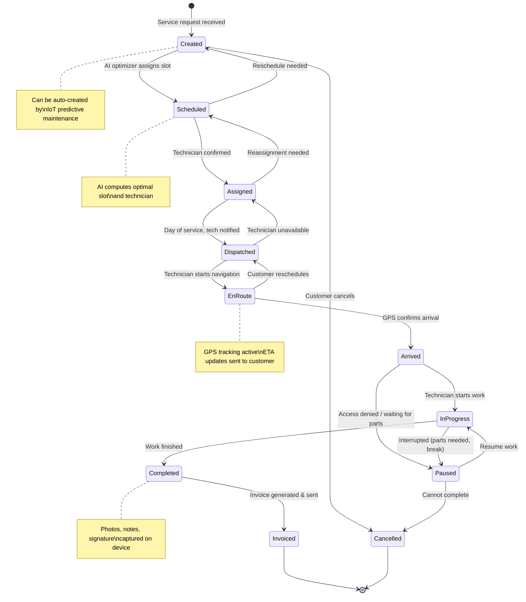
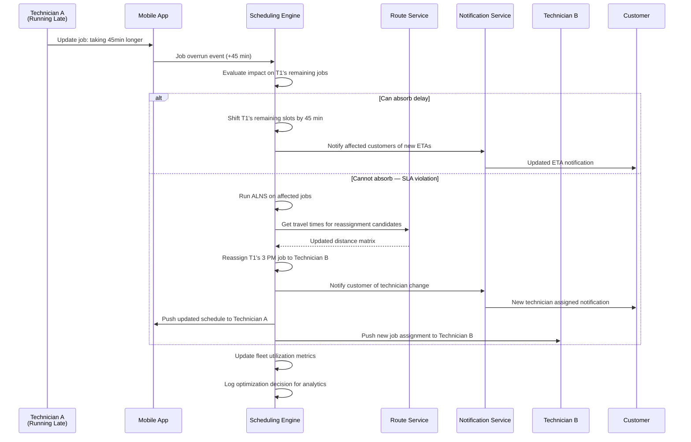

# 14.12 AI-Native Field Service Management for SMEs — Low-Level Design

## Data Models

### Job (Work Order)

```
Table: jobs
─────────────────────────────────────────────────
job_id              UUID            PK
tenant_id           UUID            FK → tenants, partition key
customer_id         UUID            FK → customers
location_id         UUID            FK → locations
assigned_tech_id    UUID            FK → technicians (nullable)
parent_job_id       UUID            FK → jobs (nullable, for follow-ups)
template_id         UUID            FK → job_templates (nullable)

job_type            ENUM            (reactive, preventive, inspection, installation, recurring)
priority            ENUM            (emergency, urgent, standard, low, flexible)
status              ENUM            (created, scheduled, assigned, dispatched, en_route, arrived, in_progress, paused, completed, invoiced, cancelled)

title               VARCHAR(200)
description         TEXT
symptom_codes       JSONB           Array of symptom identifiers
skill_requirements  JSONB           [{skill_id, min_level}]

time_window_start   TIMESTAMP       Customer-requested earliest
time_window_end     TIMESTAMP       Customer-requested latest
estimated_duration  INTERVAL        AI-predicted job duration
actual_start_time   TIMESTAMP
actual_end_time     TIMESTAMP
sla_deadline        TIMESTAMP       Contractual response deadline

equipment_ids       UUID[]          FK → equipment
parts_required      JSONB           [{part_id, quantity, status}]
pricing_version     VARCHAR(50)     Version of pricing rules used

notes               TEXT
completion_summary  TEXT
photos              JSONB           [{url, type, timestamp}]
signature_url       VARCHAR(500)

created_at          TIMESTAMP
updated_at          TIMESTAMP
created_by          UUID
event_version       BIGINT          Optimistic concurrency control

INDEX: (tenant_id, status, time_window_start)
INDEX: (tenant_id, assigned_tech_id, status)
INDEX: (tenant_id, customer_id)
INDEX: (equipment_ids) GIN
```

### Technician

```
Table: technicians
─────────────────────────────────────────────────
technician_id       UUID            PK
tenant_id           UUID            FK → tenants, partition key
user_id             UUID            FK → users

name                VARCHAR(100)
phone               VARCHAR(20)
email               VARCHAR(200)
photo_url           VARCHAR(500)

status              ENUM            (available, on_job, on_break, off_duty, on_leave)
current_lat         DECIMAL(10,7)
current_lng         DECIMAL(10,7)
location_updated_at TIMESTAMP
vehicle_id          UUID            FK → vehicles

skills              JSONB           [{skill_id, level, certified_until}]
certifications      JSONB           [{cert_id, issued_date, expiry_date, authority}]
max_daily_jobs      INT             Configurable capacity limit
max_daily_hours     DECIMAL(4,1)    Labor law compliance
break_preferences   JSONB           {lunch_window, break_duration}

hire_date           DATE
hourly_rate         DECIMAL(10,2)
overtime_rate       DECIMAL(10,2)

rating_avg          DECIMAL(3,2)    Customer rating average
first_fix_rate      DECIMAL(5,2)    Percentage of single-visit completions

INDEX: (tenant_id, status)
INDEX: (tenant_id) INCLUDE (current_lat, current_lng)
```

### Customer & Equipment

```
Table: customers
─────────────────────────────────────────────────
customer_id         UUID            PK
tenant_id           UUID            FK → tenants
name                VARCHAR(200)
phone               VARCHAR(20)
email               VARCHAR(200)
notification_prefs  JSONB           {sms: bool, whatsapp: bool, email: bool}
membership_tier     ENUM            (none, basic, premium, vip)
lifetime_value      DECIMAL(12,2)
notes               TEXT
created_at          TIMESTAMP

INDEX: (tenant_id, phone)
INDEX: (tenant_id, name) — trigram for search

Table: locations
─────────────────────────────────────────────────
location_id         UUID            PK
customer_id         UUID            FK → customers
tenant_id           UUID
address_line1       VARCHAR(300)
address_line2       VARCHAR(300)
city                VARCHAR(100)
state               VARCHAR(100)
postal_code         VARCHAR(20)
lat                 DECIMAL(10,7)
lng                 DECIMAL(10,7)
access_notes        TEXT            Gate codes, parking instructions
service_zone_id     UUID            FK → service_zones

INDEX: (tenant_id, lat, lng) — spatial queries

Table: equipment
─────────────────────────────────────────────────
equipment_id        UUID            PK
location_id         UUID            FK → locations
tenant_id           UUID
parent_equipment_id UUID            FK → equipment (hierarchy)

category            VARCHAR(100)    (hvac, plumbing, electrical, appliance)
make                VARCHAR(100)
model               VARCHAR(100)
serial_number       VARCHAR(100)
install_date        DATE
warranty_expiry     DATE
warranty_provider   VARCHAR(200)

iot_device_id       UUID            FK → iot_devices (nullable)
maintenance_schedule JSONB          [{interval_months, service_type, last_performed}]
qr_code             VARCHAR(200)

service_count       INT
last_service_date   DATE
health_score        DECIMAL(3,1)    AI-computed 0-10 score

INDEX: (tenant_id, location_id)
INDEX: (serial_number)
INDEX: (iot_device_id)
```

### Schedule & Route

```
Table: schedule_entries
─────────────────────────────────────────────────
entry_id            UUID            PK
tenant_id           UUID
technician_id       UUID            FK → technicians
job_id              UUID            FK → jobs
schedule_date       DATE

slot_start          TIMESTAMP
slot_end            TIMESTAMP
travel_time_to      INTERVAL        Estimated travel to this job
travel_distance_m   INT

sequence_order      INT             Position in technician's daily route
is_locked           BOOLEAN         Dispatcher manually locked this slot

optimization_score  DECIMAL(8,4)    Cost function value for this assignment
assigned_by         ENUM            (ai_optimizer, dispatcher_manual, customer_request)

INDEX: (tenant_id, technician_id, schedule_date)
INDEX: (tenant_id, job_id)

Table: route_plans
─────────────────────────────────────────────────
route_id            UUID            PK
tenant_id           UUID
technician_id       UUID
route_date          DATE
waypoints           JSONB           [{lat, lng, job_id, eta, sequence}]
total_distance_m    INT
total_drive_time    INTERVAL
polyline            TEXT            Encoded route polyline
computed_at         TIMESTAMP
traffic_data_age    INTERVAL        Freshness of traffic data used

INDEX: (tenant_id, technician_id, route_date)
```

### Invoice & Payment

```
Table: invoices
─────────────────────────────────────────────────
invoice_id          UUID            PK
tenant_id           UUID
job_id              UUID            FK → jobs
customer_id         UUID            FK → customers

invoice_number      VARCHAR(50)     Tenant-specific sequential number
status              ENUM            (draft, sent, paid, partial, overdue, void)

line_items          JSONB           [{description, type, quantity, unit_price, total}]
subtotal            DECIMAL(12,2)
discount_amount     DECIMAL(12,2)
tax_amount          DECIMAL(12,2)
total_amount        DECIMAL(12,2)

pricing_version     VARCHAR(50)     Pricing rules version used
pricing_match       BOOLEAN         Server-verified price matches device-computed

warranty_applied    BOOLEAN
membership_discount DECIMAL(5,2)    Percentage applied

signature_url       VARCHAR(500)
pdf_url             VARCHAR(500)
generated_on_device BOOLEAN
device_id           VARCHAR(100)

created_at          TIMESTAMP
sent_at             TIMESTAMP
paid_at             TIMESTAMP

INDEX: (tenant_id, status)
INDEX: (tenant_id, customer_id)
INDEX: (tenant_id, job_id)

Table: payments
─────────────────────────────────────────────────
payment_id          UUID            PK
invoice_id          UUID            FK → invoices
tenant_id           UUID

amount              DECIMAL(12,2)
method              ENUM            (card, upi, bank_transfer, cash, check)
status              ENUM            (pending, processing, completed, failed, refunded)
gateway_txn_id      VARCHAR(200)
gateway_provider    VARCHAR(50)

collected_offline   BOOLEAN
synced_at           TIMESTAMP

INDEX: (tenant_id, invoice_id)
INDEX: (gateway_txn_id)
```

### IoT Telemetry

```
Table: iot_telemetry (time-series database)
─────────────────────────────────────────────────
device_id           VARCHAR(100)    Tag
equipment_id        UUID            Tag
tenant_id           UUID            Tag
metric_name         VARCHAR(50)     Tag (vibration, temperature, pressure, power)

timestamp           TIMESTAMP       Time column
value               DOUBLE
unit                VARCHAR(20)

Retention: raw data 90 days, 1-hour aggregates 2 years, daily aggregates 5 years

Table: anomaly_alerts
─────────────────────────────────────────────────
alert_id            UUID            PK
device_id           VARCHAR(100)
equipment_id        UUID
tenant_id           UUID

alert_type          ENUM            (anomaly, threshold, rul_warning, rul_critical)
severity            ENUM            (info, warning, critical)
metric_name         VARCHAR(50)
current_value       DOUBLE
threshold_value     DOUBLE
rul_days_estimated  INT             Remaining useful life in days
confidence          DECIMAL(5,4)

auto_work_order     BOOLEAN         Whether a work order was auto-created
job_id              UUID            FK → jobs (nullable)

detected_at         TIMESTAMP
acknowledged_at     TIMESTAMP
resolved_at         TIMESTAMP

INDEX: (tenant_id, equipment_id, detected_at)
INDEX: (tenant_id, severity, acknowledged_at)
```

---

## Indexing Strategy

### Job Store Indexes

| Index | Columns | Type | Query Pattern | Rationale |
|---|---|---|---|---|
| `idx_jobs_tenant_status_window` | (tenant_id, status, time_window_start) | B-tree composite | "Show me all pending jobs for this week" | Primary dispatcher query; partition-aligned |
| `idx_jobs_tenant_tech_status` | (tenant_id, assigned_tech_id, status) | B-tree composite | "Show Technician A's active jobs" | Schedule view; covers tech-centric queries |
| `idx_jobs_tenant_customer` | (tenant_id, customer_id) | B-tree composite | "Show all jobs for this customer" | Customer service history lookup |
| `idx_jobs_equipment` | (equipment_ids) | GIN | "Find all jobs for this equipment serial" | Equipment service history; IoT alert correlation |
| `idx_jobs_sla_deadline` | (tenant_id, status, sla_deadline) WHERE status NOT IN ('completed','cancelled','invoiced') | B-tree partial | "Which jobs are approaching SLA breach?" | SLA monitoring; only active jobs indexed |
| `idx_jobs_created_at` | (tenant_id, created_at) | B-tree | "Jobs created in date range" | Reporting and audit queries |
| `idx_jobs_fulltext` | (title, description, completion_summary) | GIN tsvector | "Search jobs by keyword" | Full-text search across job content |

### Schedule Store Indexes

| Index | Columns | Type | Query Pattern | Rationale |
|---|---|---|---|---|
| `idx_schedule_tenant_tech_date` | (tenant_id, technician_id, schedule_date) | B-tree composite (unique) | "Technician A's schedule for Tuesday" | Primary schedule lookup; one row per tech-day pair |
| `idx_schedule_tenant_date` | (tenant_id, schedule_date) | B-tree composite | "Full fleet schedule for today" | Dispatcher dashboard; fleet-wide view |
| `idx_schedule_job` | (tenant_id, job_id) | B-tree composite (unique) | "Which slot is this job in?" | Job-to-schedule reverse lookup |

### IoT Telemetry Indexes (Time-Series DB)

| Index | Columns | Type | Query Pattern |
|---|---|---|---|
| Tag index | (tenant_id, device_id, metric_name) | Inverted index | "All temperature readings for device X" |
| Time index | (timestamp) per chunk | B-tree | "Readings in last 24 hours" |
| Composite | (tenant_id, equipment_id, metric_name, timestamp) | Composite | "Vibration trend for equipment Y over 30 days" |

**Chunk strategy:** Hourly chunks for recent data (< 7 days), daily chunks for older data. Chunk size targets 100K-500K rows for optimal compression and query performance. Automatic chunk migration from hot to warm storage at 7-day boundary.

### Customer and Equipment Search Indexes

| Index | Columns | Type | Query Pattern |
|---|---|---|---|
| `idx_customers_name_trigram` | (tenant_id, name) | GIN trigram | Fuzzy name search: "John Sm" → matches "John Smith", "Jon Smyth" |
| `idx_customers_phone` | (tenant_id, phone) | B-tree | Exact phone lookup for incoming call identification |
| `idx_equipment_serial` | (serial_number) | B-tree unique | Equipment lookup by serial (cross-tenant for warranty verification) |
| `idx_equipment_iot` | (iot_device_id) | B-tree | IoT alert → equipment mapping |
| `idx_locations_spatial` | (tenant_id, lat, lng) | R-tree / PostGIS | "Find customers within 5km radius" for service zone assignment |

---

## API Contracts

### Job Management

```
POST /api/v1/jobs
  Request:  { customer_id, location_id, job_type, priority, description,
              symptom_codes[], skill_requirements[], time_window_start,
              time_window_end, equipment_ids[], auto_schedule: bool }
  Response: { job_id, status, assigned_tech_id?, eta?, schedule_slot? }
  Notes:    If auto_schedule=true, returns with assignment; otherwise returns created status

GET /api/v1/jobs/{job_id}
  Response: { job details including full status history, assigned tech, route, equipment }

PATCH /api/v1/jobs/{job_id}/status
  Request:  { status, notes?, photos[]?, location? }
  Response: { job_id, status, updated_at }
  Notes:    Validates state machine transitions; triggers notifications

GET /api/v1/jobs?tenant_id=X&status=Y&date=Z&tech_id=W
  Response: { jobs[], pagination }
  Notes:    Supports filtering by date range, status, technician, customer, priority
```

### Schedule & Dispatch

```
GET /api/v1/schedule?tenant_id=X&date=Y
  Response: { technicians: [{ tech_id, name, jobs: [{ job_id, slot_start, slot_end,
              travel_time, location, status }], utilization_pct, total_drive_time }] }

POST /api/v1/schedule/optimize
  Request:  { tenant_id, date, constraints?: { locked_assignments[], excluded_techs[] } }
  Response: { assignments: [{ job_id, tech_id, slot_start, slot_end, score }],
              metrics: { total_drive_time, avg_utilization, unassigned_jobs[] } }

POST /api/v1/schedule/assign
  Request:  { job_id, tech_id, slot_start?, override_reason? }
  Response: { assignment, cascading_changes: [{ job_id, old_tech, new_tech, reason }] }
  Notes:    Manual assignment triggers re-optimization of affected schedules

GET /api/v1/technicians/{tech_id}/route?date=Y
  Response: { route_id, waypoints[], total_distance, total_time, polyline, eta_updates[] }
```

### Sync Protocol

```
POST /api/v1/sync/pull
  Request:  { device_id, last_sync_version, entity_types[]? }
  Response: { changes: [{ entity_type, entity_id, operation, data, version }],
              new_sync_version, has_more: bool }
  Notes:    Delta sync; returns changes since last_sync_version; paginated

POST /api/v1/sync/push
  Request:  { device_id, changes: [{ entity_type, entity_id, operation, data,
              client_version, crdt_state }] }
  Response: { accepted: [{ entity_id, server_version }],
              conflicts: [{ entity_id, resolution, server_data }] }
  Notes:    CRDT-based merge; conflicts auto-resolved; resolution reported back

POST /api/v1/sync/photos
  Request:  multipart/form-data { job_id, photos[] }
  Response: { uploaded: [{ photo_id, url }] }
  Notes:    Separate endpoint for large binary data; resumable uploads
```

### Invoice & Payment

```
POST /api/v1/invoices
  Request:  { job_id, line_items[], pricing_version, discount_code?,
              generated_on_device: bool, device_computed_total? }
  Response: { invoice_id, invoice_number, total, pricing_match: bool, pdf_url }
  Notes:    Server re-computes total; flags if device total differs

POST /api/v1/payments
  Request:  { invoice_id, amount, method, gateway_preference?,
              collected_offline: bool }
  Response: { payment_id, status, gateway_txn_id? }

GET /api/v1/invoices/{invoice_id}/pdf
  Response: PDF binary
```

### IoT & Predictive Maintenance

```
POST /api/v1/iot/telemetry (bulk ingestion)
  Request:  { readings: [{ device_id, metric_name, value, timestamp }] }
  Response: { accepted: int, rejected: int }
  Notes:    Batch endpoint; up to 1000 readings per request

GET /api/v1/equipment/{equipment_id}/health
  Response: { health_score, rul_estimate_days, active_alerts[],
              telemetry_summary: { metric_name, current, avg_30d, trend } }

GET /api/v1/alerts?tenant_id=X&severity=Y&acknowledged=Z
  Response: { alerts[], pagination }
```

---

## Core Algorithms

### Algorithm 1: Adaptive Large Neighborhood Search (ALNS) for Job Scheduling

The scheduling engine uses ALNS to solve the multi-objective VRPTW problem incrementally.

```
FUNCTION schedule_job(new_job, current_schedule):
    // Phase 1: Find candidate technicians
    candidates ← filter_technicians(
        skills_match(new_job.skill_requirements),
        available_in_window(new_job.time_window),
        has_required_parts(new_job.parts_required),
        within_service_zone(new_job.location)
    )

    IF candidates is empty:
        RETURN unassignable_result(reason)

    // Phase 2: Score each insertion point
    best_insertion ← null
    best_cost ← INFINITY

    FOR EACH tech IN candidates:
        FOR EACH position IN tech.schedule.insertion_points:
            cost ← compute_insertion_cost(
                travel_time_delta,        // Additional drive time
                time_window_violation,     // Penalty for late arrival
                skill_match_quality,       // Overqualified = wasted capacity
                workload_balance_delta,    // Deviation from fleet average
                first_fix_probability,     // Historical success rate for tech + job type
                customer_preference_score  // Preferred/blacklisted technician
            )

            IF cost < best_cost:
                best_cost ← cost
                best_insertion ← (tech, position)

    // Phase 3: Apply and propagate
    apply_insertion(best_insertion, current_schedule)
    propagate_eta_changes(best_insertion.tech)

    // Phase 4: Local re-optimization (ALNS)
    IF best_cost > THRESHOLD:
        neighborhood ← select_affected_jobs(best_insertion, radius=3)
        improved_schedule ← alns_improve(neighborhood, iterations=100)
        apply_improvements(improved_schedule)

    RETURN assignment_result(best_insertion)

FUNCTION alns_improve(neighborhood, iterations):
    current_solution ← neighborhood.current_assignments
    best_solution ← current_solution

    FOR i IN 1..iterations:
        // Destroy: remove 10-20% of assignments
        destroy_operator ← select_weighted_random(
            [random_removal, worst_removal, related_removal, proximity_removal]
        )
        partial_solution ← destroy_operator(current_solution)

        // Repair: re-insert removed jobs
        repair_operator ← select_weighted_random(
            [greedy_insertion, regret_insertion, skill_weighted_insertion]
        )
        new_solution ← repair_operator(partial_solution)

        // Accept or reject (simulated annealing)
        IF accept_criterion(new_solution, current_solution, temperature(i)):
            current_solution ← new_solution
            IF cost(new_solution) < cost(best_solution):
                best_solution ← new_solution

        // Update operator weights based on success
        update_operator_weights(destroy_operator, repair_operator, improved)

    RETURN best_solution
```

### Algorithm 2: Deterministic Offline Pricing Engine

```
FUNCTION compute_invoice(job, line_items, pricing_version):
    price_book ← load_price_book(pricing_version)
    customer ← load_customer(job.customer_id)
    equipment_list ← load_equipment(job.equipment_ids)

    total ← 0
    computed_items ← []

    FOR EACH item IN line_items:
        IF item.type == "flat_rate":
            price ← price_book.flat_rates[item.service_code]
        ELSE IF item.type == "labor":
            hours ← item.quantity
            rate ← price_book.labor_rates[item.skill_level]
            // Overtime calculation
            IF technician.daily_hours + hours > 8:
                regular_hours ← MAX(0, 8 - technician.daily_hours)
                overtime_hours ← hours - regular_hours
                price ← (regular_hours × rate) + (overtime_hours × rate × 1.5)
            ELSE:
                price ← hours × rate
        ELSE IF item.type == "material":
            price ← item.quantity × price_book.parts[item.part_id].price
            // Markup for non-warranty parts
            IF NOT is_warranty_covered(equipment_list, item.part_id):
                price ← price × (1 + price_book.parts_markup_pct)

        computed_items.append({...item, computed_price: price})
        total += price

    // Apply warranty coverage
    warranty_discount ← compute_warranty_coverage(equipment_list, computed_items)
    total -= warranty_discount

    // Apply membership discount
    IF customer.membership_tier != "none":
        membership_discount ← total × price_book.membership_discounts[customer.membership_tier]
        total -= membership_discount

    // Apply promotional discount
    IF job.discount_code:
        promo_discount ← validate_and_apply_promo(job.discount_code, total, price_book)
        total -= promo_discount

    // Compute tax
    tax ← compute_tax(total, job.location, price_book.tax_rules)
    total += tax

    // All arithmetic uses fixed-point (integer cents) to ensure determinism
    RETURN invoice(computed_items, subtotal, discounts, tax, total, pricing_version)
```

### Algorithm 3: IoT Anomaly Detection with Equipment Family Transfer Learning

```
FUNCTION detect_anomaly(device_id, new_reading):
    equipment ← lookup_equipment(device_id)
    family_model ← load_family_model(equipment.category, equipment.make)
    device_baseline ← load_device_baseline(device_id)

    // Step 1: Statistical baseline check
    z_score ← (new_reading.value - device_baseline.mean) / device_baseline.stddev

    IF abs(z_score) > IMMEDIATE_ALERT_THRESHOLD:  // e.g., 5σ
        RETURN critical_anomaly(new_reading, z_score)

    // Step 2: Trend detection (sliding window)
    recent_window ← get_readings(device_id, new_reading.metric, last_hours=24)
    trend ← compute_linear_trend(recent_window)

    IF trend.slope > family_model.max_acceptable_slope[new_reading.metric]:
        RETURN warning_anomaly(new_reading, trend)

    // Step 3: Multi-variate pattern matching (family model)
    feature_vector ← extract_features(device_id, window_hours=168)
    // Features: mean, std, trend, peak_frequency (FFT), cross-correlations
    anomaly_score ← family_model.predict_anomaly(feature_vector)

    IF anomaly_score > family_model.threshold:
        // Step 4: RUL estimation
        rul_days ← family_model.predict_rul(feature_vector)
        confidence ← family_model.rul_confidence(feature_vector)

        IF rul_days < PREVENTIVE_THRESHOLD AND confidence > 0.7:
            auto_create_work_order(equipment, rul_days, anomaly_score)

        RETURN rul_warning(equipment, rul_days, confidence, anomaly_score)

    // Step 5: Update device baseline (online learning)
    update_baseline(device_id, new_reading)
    RETURN normal()
```

### Algorithm 4: CRDT Merge Resolution with Actor Priority

```
FUNCTION crdt_merge(server_state, device_changes, actor):
    merged ← copy(server_state)
    conflicts ← []

    FOR EACH change IN device_changes:
        field ← change.field_name
        crdt_type ← get_crdt_type(field)

        SWITCH crdt_type:
            CASE "lww_dispatcher_wins":
                // Scheduling fields: assigned_tech_id, slot_start, slot_end, priority
                IF actor == DISPATCHER:
                    merged[field] ← change.value
                    merged[field].vector_clock[actor] ← change.clock
                ELSE:
                    // Technician change — only apply if no concurrent dispatcher change
                    IF NOT has_concurrent_dispatcher_change(server_state, field, change.since_version):
                        merged[field] ← change.value
                    ELSE:
                        conflicts.append({
                            field: field,
                            resolution: "dispatcher_wins",
                            server_value: server_state[field],
                            device_value: change.value,
                            preserved_as: "historical_event"
                        })
                        // Record technician's value as historical event for audit
                        emit_event("conflict_resolved", {field, change.value, "technician_value_preserved_in_history"})

            CASE "lww_technician_wins":
                // Operational fields: status, notes, completion_summary
                IF actor == TECHNICIAN:
                    merged[field] ← change.value
                ELSE:
                    IF NOT has_concurrent_technician_change(server_state, field, change.since_version):
                        merged[field] ← change.value
                    ELSE:
                        conflicts.append({
                            field: field,
                            resolution: "technician_wins",
                            server_value: server_state[field],
                            device_value: change.value
                        })

            CASE "grow_only_set":
                // Collection fields: photos, note_entries
                merged[field] ← union(server_state[field], change.value)
                // Both additions always preserved; no conflict possible

            CASE "pn_counter":
                // Quantity fields: parts_used count
                delta ← change.value - change.base_value
                merged[field] ← server_state[field] + delta

            CASE "state_machine":
                // Job status with transition validation
                merged[field] ← resolve_state_machine_conflict(
                    server_state[field], change.value, actor
                )

    RETURN { merged: merged, conflicts: conflicts }

FUNCTION resolve_state_machine_conflict(server_status, device_status, actor):
    // Forward transitions by technician always win (progress updates)
    IF is_forward_transition(device_status) AND actor == TECHNICIAN:
        RETURN device_status

    // Backward transitions by dispatcher always win (cancellation, reassignment)
    IF is_backward_transition(device_status) AND actor == DISPATCHER:
        RETURN device_status

    // Conflicting directions: dispatcher backward + technician forward
    // Dispatcher wins for backward (cancel/reassign), but record technician progress
    IF is_backward_transition(server_status) AND is_forward_transition(device_status):
        emit_event("status_conflict", {server_status, device_status, "dispatcher_backward_wins"})
        RETURN server_status

    // Same direction: take the more advanced state
    RETURN max_state(server_status, device_status)
```

### Algorithm 5: Schedule Demand Shaping (Predictive Maintenance Gap Filling)

```
FUNCTION shape_demand(date, tenant_id, fixed_schedule):
    // Phase 1: Identify gaps in the fixed schedule
    gaps ← []
    FOR EACH technician IN fixed_schedule.technicians:
        tech_gaps ← find_schedule_gaps(technician, date, min_gap_minutes=45)
        FOR EACH gap IN tech_gaps:
            gaps.append({
                technician: technician,
                start: gap.start,
                end: gap.end,
                duration: gap.duration,
                location: gap.preceding_job.location,  // Technician's position at gap start
                skills: technician.skills
            })

    // Phase 2: Fetch candidate preventive jobs from IoT prediction queue
    candidates ← fetch_flexible_maintenance_jobs(
        tenant_id: tenant_id,
        earliest_date: date,
        latest_date: date + 7,  // Jobs that COULD be scheduled today but have flexible window
        statuses: [PREDICTED, DEFERRED]
    )

    // Phase 3: For each gap, find best-fit preventive jobs
    assignments ← []
    FOR EACH gap IN sort_by_value(gaps, descending=True):  // Prioritize largest gaps
        feasible ← []
        FOR EACH candidate IN candidates:
            IF candidate.already_assigned:
                CONTINUE

            // Check skill match
            IF NOT skills_match(gap.technician, candidate.skill_requirements):
                CONTINUE

            // Check parts availability
            IF NOT has_parts(gap.technician.vehicle, candidate.parts_required):
                CONTINUE

            // Check travel feasibility
            travel_to ← get_cached_travel_time(gap.location, candidate.location)
            travel_from ← get_cached_travel_time(candidate.location, gap.next_job_location)
            total_time ← travel_to + candidate.estimated_duration + travel_from

            IF total_time > gap.duration - BUFFER_MINUTES:
                CONTINUE  // Doesn't fit in the gap

            // Compute revenue-adjusted score
            revenue ← candidate.estimated_invoice_amount
            incremental_cost ← travel_to × COST_PER_MINUTE
            urgency_score ← 1.0 / candidate.rul_days_remaining  // More urgent = higher score
            net_value ← (revenue - incremental_cost) × urgency_score

            feasible.append({candidate, net_value, travel_to, total_time})

        // Select highest-value candidate for this gap
        IF feasible is not empty:
            best ← max(feasible, key=net_value)
            assignments.append({
                gap: gap,
                job: best.candidate,
                travel_time: best.travel_to,
                net_value: best.net_value
            })
            best.candidate.already_assigned ← True

    // Phase 4: Validate that insertions don't violate existing schedule constraints
    validated ← validate_insertions(assignments, fixed_schedule)
    RETURN validated
```

---

## State Machine: Job Lifecycle



---

## Sequence Diagram: Real-Time Schedule Re-Optimization on Disruption


