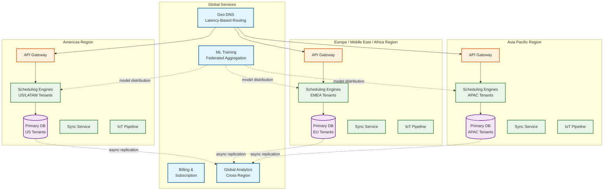

# 14.12 AI-Native Field Service Management for SMEs — Scalability & Reliability

## Scaling Philosophy

The platform's scaling strategy is shaped by a fundamental asymmetry: the scheduling engine is stateful and CPU-intensive (optimization is compute-bound), while all other services are stateless and I/O-bound (database reads, external API calls, message processing). This bifurcation requires two distinct scaling approaches:

1. **Stateful tier (scheduling engine):** Tenant-partitioned, consistent-hashed across instances. Scaling requires tenant migration (pause → rebalance → resume). Scale events are infrequent and carefully orchestrated.
2. **Stateless tier (everything else):** Standard auto-scaling based on request rate, latency, or queue depth. Scale events are routine and fully automated.

The scaling target is to handle 2× current peak load with 60% resource utilization at steady state, providing 40% headroom for traffic spikes before auto-scaling activates.

---

## Horizontal Scaling Strategy

### Scheduling Engine: Tenant-Partitioned Stateful Scaling

The scheduling engine is the most challenging component to scale because it maintains in-memory schedule state for real-time optimization. The scaling strategy is tenant-based partitioning:

**Partition scheme:**
- Each SME tenant's schedule is assigned to exactly one scheduling engine instance
- Consistent hashing maps tenant_id → engine instance
- Each instance handles 200-500 tenants depending on fleet size (small SMEs with 5 techs vs. medium SMEs with 50 techs)
- Total fleet: ~100-250 engine instances for 50,000 tenants

**State management:**
- Schedule state is held in-memory for sub-second query latency
- Every state mutation is written to a write-ahead log (WAL) in a durable queue
- A warm standby instance replays the WAL to maintain a shadow copy (< 5 second lag)
- On instance failure, the standby promotes within 10 seconds; during promotion, incoming requests queue at the API gateway

**Scaling triggers:**
- CPU > 70% sustained for 5 minutes → add instances, rebalance tenants
- Memory > 80% → rebalance largest tenants to new instances
- Optimization latency P95 > 8 seconds → investigate and scale compute

### Stateless Services: Standard Horizontal Scaling

All other services (Job Service, Invoice Service, Notification Service, Route Service) are stateless and scale with standard auto-scaling:

| Service | Scaling Metric | Min Instances | Max Instances | Scale Step |
|---|---|---|---|---|
| API Gateway | Requests/second | 4 | 40 | +2 when RPS > 2000/instance |
| Job Service | Request latency P95 | 6 | 30 | +2 when P95 > 300 ms |
| Sync Service | Concurrent connections | 8 | 60 | +4 when connections > 500/instance |
| Notification Service | Queue depth | 4 | 20 | +2 when queue > 10,000 |
| Invoice Service | Request rate | 3 | 15 | +1 when rate > 100/s/instance |
| IoT Pipeline | Message backlog | 4 | 25 | +2 when lag > 30 seconds |

### Database Scaling

**Primary database (relational):**
- Partitioned by tenant_id (range partitioning)
- Read replicas for analytics and reporting queries (3 replicas, cross-zone)
- Connection pooling with per-tenant connection limits to prevent noisy-neighbor effects
- Hot tenants (>100 concurrent queries) automatically routed to dedicated read replicas

**Time-series database (IoT telemetry):**
- Automatically partitioned by time (hourly buckets for recent data, daily for older)
- Retention policies: raw 90 days → 1-hour aggregates 2 years → daily aggregates 5 years
- Downsampling runs as a background process during off-peak hours

**Cache layer:**
- Distributed cache for schedule reads, ETA lookups, and frequently accessed customer data
- Per-tenant cache namespace to prevent cross-tenant data leakage
- Cache warming on scheduling engine startup from database snapshot
- TTL: schedule data 30 seconds (frequently updated), customer data 5 minutes, price books 1 hour

### Photo and Document Storage

- Object storage with CDN for photo retrieval
- Photos compressed on-device before upload (JPEG quality 80, max dimension 2048px)
- Lifecycle policy: hot storage 30 days → warm storage 1 year → cold storage 5 years
- Thumbnail generation on upload (3 sizes: 150px, 400px, 800px) for fast listing views

---

## Fault Tolerance Patterns

### Scheduling Engine Failover

```
┌─────────────────────┐     ┌─────────────────────┐
│  Primary Instance   │────▶│   Write-Ahead Log    │
│  (Active)           │     │   (Durable Queue)    │
│  Tenants: A,B,C     │     └──────────┬───────────┘
└─────────────────────┘                │
                                       ▼
                         ┌─────────────────────────┐
                         │  Standby Instance        │
                         │  (Shadow, < 5s lag)      │
                         │  Tenants: A,B,C (replay) │
                         └─────────────────────────┘

Failure scenario:
1. Primary instance crashes
2. Health check fails (3 consecutive misses, 15 seconds)
3. Standby promotes to primary
4. API gateway updates routing table
5. Queued requests drain (< 10 second total outage)
6. New standby instance spins up and begins WAL replay
```

### Graceful Degradation Hierarchy

| Failure | Impact | Degradation Strategy |
|---|---|---|
| Scheduling engine down | Cannot auto-assign new jobs | Jobs queued; dispatcher can manually assign from dashboard; queue drains on recovery |
| Maps API unavailable | No real-time traffic data | Fall back to pre-computed distance matrix with time-of-day multipliers; routes less optimal but functional |
| Notification service down | Customers don't receive updates | Notifications queued with TTL; delivered on recovery; critical notifications (arrival) retried via fallback channel |
| IoT pipeline down | No predictive maintenance | Sensor data buffered at device level; batch-processed on recovery; no preventive work orders generated during outage |
| Sync service down | Technician devices can't sync | Devices continue operating offline (core use case); sync queued and resumes automatically |
| Payment gateway down | Cannot process on-site payments | Offline payment queuing; technician records payment intent; processed when gateway recovers |
| Database primary down | Write operations fail | Automatic failover to standby (30-second RTO); read replicas continue serving read traffic |

### Circuit Breaker Configuration

| External Dependency | Failure Threshold | Open Duration | Fallback |
|---|---|---|---|
| Maps / routing API | 5 failures in 30 seconds | 60 seconds | Cached distance matrix |
| Payment gateway (primary) | 3 failures in 10 seconds | 30 seconds | Secondary gateway |
| SMS provider | 10 failures in 60 seconds | 120 seconds | Queue + retry; switch provider |
| WhatsApp Business API | 5 failures in 30 seconds | 60 seconds | Fall back to SMS |
| Accounting system sync | 3 failures in 60 seconds | 300 seconds | Queue journal entries; batch on recovery |
| IoT device gateway | 10 failures in 60 seconds | 120 seconds | Buffer at ingestion layer |

---

## Disaster Recovery

### Recovery Objectives

| Scenario | RTO | RPO | Strategy |
|---|---|---|---|
| Single instance failure | < 30 seconds | 0 (WAL) | Warm standby promotion |
| Availability zone failure | < 5 minutes | < 1 minute | Cross-zone replicas; DNS failover |
| Region failure | < 30 minutes | < 5 minutes | Cross-region standby; data replication |
| Database corruption | < 1 hour | < 1 minute | Point-in-time recovery from continuous backup |
| Scheduling engine state loss | < 2 minutes | < 5 seconds | Rebuild from WAL + database snapshot |

### Cross-Region Architecture

```
Primary Region                          Secondary Region
┌──────────────────────┐               ┌──────────────────────┐
│ Scheduling Engines   │──async WAL──▶ │ Standby Engines      │
│ API Servers          │               │ API Servers (cold)    │
│ Primary Database     │──sync rep──▶  │ Read Replica          │
│ Cache Cluster        │               │ Cache (cold)          │
│ Object Storage       │──async rep──▶ │ Object Storage Mirror │
└──────────────────────┘               └──────────────────────┘
         │                                       │
    ┌────┴────┐                             ┌────┴────┐
    │ CDN PoP │                             │ CDN PoP │
    └─────────┘                             └─────────┘
```

**Failover procedure:**
1. Primary region health check fails for 2 minutes
2. DNS TTL (60 seconds) expires; traffic routes to secondary
3. Secondary scheduling engines load state from replicated WAL
4. Standby database promoted to primary
5. Cold API servers warm up (pre-provisioned but not running compute)
6. Technician mobile apps detect server change via sync endpoint redirect; re-sync delta

### Data Backup Strategy

| Data Type | Backup Frequency | Retention | Method |
|---|---|---|---|
| Job records & customer data | Continuous (WAL streaming) | 90 days point-in-time | Database continuous backup |
| Schedule state | Every 5 minutes (snapshot) | 7 days | Scheduling engine state dump to object storage |
| IoT telemetry | Hourly incremental | 90 days raw, 5 years aggregated | Time-series DB native backup |
| Photos & documents | At upload (replicated) | Lifecycle-managed | Cross-region object storage replication |
| Invoices & payments | Continuous | 7 years (regulatory) | Database + PDF archive in cold storage |
| Configuration & pricing | On change (event log) | Indefinite | Event store with snapshots |

---

## Performance Optimization

### Scheduling Optimization Performance

**Pre-computation:**
- Skill-to-technician index: maintained in-memory, updated on technician profile changes
- Service zone boundaries: pre-computed geofence polygons for fast "which technicians serve this area" queries
- Historical job duration distributions: pre-computed per (job_type, technician_skill_level, equipment_age) tuple; updated nightly

**Caching strategy for optimization:**
- Distance matrix cache: LRU cache of location-pair distances; hit rate > 85% for repeat service areas
- Technician availability cache: bitmap of 15-minute slots per technician per day; O(1) availability check
- Parts availability index: in-memory map of parts per vehicle; updated on every parts transaction

### Mobile App Performance

**Offline database optimization:**
- Selective sync: device only stores data for assigned jobs, relevant customers, and local price book (not entire tenant data)
- Database size target: < 100 MB per device for typical technician's working data set
- Index strategy: composite indexes on (date, status) and (customer_id) for fast local queries
- Photo storage: photos stored separately from database; referenced by URL; compressed on-device

**Sync performance:**
- Delta encoding: only changed fields transmitted, not full records
- Compression: gzip on all sync payloads (60-70% compression for JSON data)
- Priority queuing: status changes first (< 1 KB), then text data, then photos last
- Background sync: non-critical data syncs in background without blocking UI

### API Performance

| Optimization | Technique | Impact |
|---|---|---|
| Connection reuse | HTTP/2 with connection pooling; gRPC for internal services | 40% latency reduction for sequential requests |
| Response compression | gzip for payloads > 1 KB | 60-70% bandwidth reduction |
| Pagination | Cursor-based pagination for job lists | Consistent performance regardless of result set size |
| Field selection | GraphQL-style field selection for mobile API | 50% payload reduction for list views |
| Batch endpoints | Bulk status updates, bulk photo uploads | 80% fewer HTTP round-trips for sync |
| Rate limiting | Per-tenant, per-endpoint rate limits with token bucket | Prevent noisy-neighbor degradation |
| Request coalescing | Multiple ETA requests for same technician coalesced | 70% fewer ETA computations during peak |

---

## Multi-Region Deployment Architecture



**Region assignment:** Each tenant is assigned to a home region based on their primary operating country. Scheduling engines, databases, and sync services are co-located to minimize latency. Cross-region data flows are limited to: (1) ML model aggregation (federated learning, no raw tenant data crosses regions), (2) global analytics (anonymized aggregates only), (3) billing and subscription management.

---

## Back-Pressure Patterns

### Sync Service Back-Pressure (4-Level Graduated Response)

| Level | Trigger | Response | Recovery |
|---|---|---|---|
| **Level 0 (Normal)** | Queue depth < 1,000; latency P95 < 5s | Full-fidelity sync: all data types, no restrictions | — |
| **Level 1 (Elevated)** | Queue depth 1,000-5,000 OR latency P95 5-15s | Defer photo uploads; status + invoice changes only | Auto-recover when queue < 800 for 5 min |
| **Level 2 (High)** | Queue depth 5,000-10,000 OR latency P95 15-30s | Rate-limit per tenant (max 2 concurrent syncs); defer all binary data; compress text payloads aggressively | Auto-recover when queue < 3,000 for 10 min |
| **Level 3 (Critical)** | Queue depth > 10,000 OR latency P95 > 30s | Emergency mode: only accept job status transitions and payment confirmations; all other data queued on device for later | Auto-recover when queue < 5,000 for 15 min; manual override available |

### Scheduling Engine Back-Pressure

| Trigger | Response |
|---|---|
| Optimization queue depth > 50 per instance | Switch from Standard (100 iterations) to Quick (0 iterations, greedy only) for non-emergency jobs |
| CPU > 85% sustained 3 min | Defer flexible preventive maintenance scheduling; process only reactive and time-critical jobs |
| Memory > 90% | Evict stale tenant state (tenants with no activity in last 30 min); reload on demand |
| Combined overload (CPU + queue + memory all elevated) | Activate triage mode: nearest-qualified assignment with no ALNS optimization; log all deferred optimizations for batch processing during off-peak |

### IoT Pipeline Back-Pressure

| Trigger | Response |
|---|---|
| Processing lag > 2 minutes | Double consumer instances (auto-scale) |
| Processing lag > 5 minutes | Skip trend analysis gate; process only statistical anomaly detection (immediate alerts) |
| Processing lag > 10 minutes | Sample incoming telemetry at 50% rate; prioritize devices with active anomaly history |
| Processing lag > 30 minutes | Circuit-break: stop ingesting new telemetry; process backlog to drain; buffer at device level |

---

## Capacity Formulas

### Scheduling Engine Capacity

```
Required instances = ceil(total_tenants / tenants_per_instance)
tenants_per_instance = floor(instance_memory_gb × 1024 / avg_tenant_memory_mb)
avg_tenant_memory_mb = (avg_technicians × 2 MB) + (avg_daily_jobs × 0.5 MB) + overhead_mb

Example:
  32 GB instance, avg 12 techs/tenant, avg 48 jobs/tenant:
  avg_tenant_memory = (12 × 2) + (48 × 0.5) + 50 = 98 MB
  tenants_per_instance = floor(32 × 1024 / 98) = 334
  Required instances = ceil(50,000 / 334) = 150

  With 1.3× headroom for peak + failover: 195 instances
  With standby replicas (1:1): 390 total instances
```

### Sync Service Capacity

```
Required instances = ceil(peak_concurrent_syncs / syncs_per_instance)
peak_concurrent_syncs = total_technicians × concurrent_sync_rate × peak_factor

syncs_per_instance = 500 (empirical, bounded by CRDT merge CPU + DB write throughput)
concurrent_sync_rate = 0.05 (5% of technicians syncing at any given second during peak)
peak_factor = 3.0 (morning schedule download, post-connectivity-restoration bursts)

Example:
  600,000 technicians × 0.05 × 3.0 = 90,000 peak concurrent syncs
  Required instances = ceil(90,000 / 500) = 180
  With headroom: 220 instances (auto-scaled from baseline 15)
```

### ETA Computation Capacity

```
Active ETAs per 5-min cycle = active_jobs × active_eta_fraction
  = 2,400,000 daily jobs × (active_window / 24) × active_eta_fraction
  = 2,400,000 × (8/24) × 0.20 = 160,000 active ETAs

Monte Carlo cost per ETA = 1000 paths × 4 jobs × 10 µs/evaluation = 40 ms
Total computation per 5-min cycle = 160,000 × 40 ms = 6,400 seconds
Required cores = 6,400 / 300 (seconds per 5-min cycle) = ~22 cores
With simplified tier: 22 + 10 (for 100-path near-term) = 32 cores dedicated to ETA
```

---

## Chaos Experiments

### Experiment 1: Scheduling Engine Instance Kill

**Hypothesis:** When a primary scheduling engine instance is killed, the warm standby promotes within 15 seconds. Tenants on the affected instance experience <10 seconds of queued requests, and no schedule data is lost.

**Method:** Kill the primary instance process with SIGKILL during peak optimization load. Measure: (1) time to standby promotion, (2) queued request drain time, (3) schedule state integrity post-failover (compare with pre-kill state).

**Success criteria:** Standby promotes <15s, queued requests drain <10s additional, zero schedule divergence.

### Experiment 2: Sync Service Partition from Database

**Hypothesis:** When the sync service loses database connectivity, in-flight sync operations return graceful errors to clients. Mobile devices detect the error and queue changes for later retry. No data loss occurs.

**Method:** Block network between sync service and database for 60 seconds. Measure: (1) client-side error handling (retry queue grows, no crash), (2) sync resume after partition heals, (3) data integrity verification.

**Success criteria:** Zero data loss, client retry within 30s of partition healing, no duplicate records from retry.

### Experiment 3: Maps API Total Outage

**Hypothesis:** When the maps API is completely unavailable for 30 minutes, the scheduling engine degrades gracefully to cached distance matrix and correction-factor estimates. Schedule quality degrades by <20%, but no jobs are left unassigned.

**Method:** Block all maps API endpoints. Measure: (1) scheduling continues without error, (2) optimization quality degradation, (3) ETA accuracy impact.

**Success criteria:** Zero unassignable jobs due to maps outage; optimization gap <20% vs. normal; ETA accuracy within ±25 min (vs. ±10 min normal).

### Experiment 4: IoT Pipeline Consumer Crash Under Load

**Hypothesis:** When IoT pipeline consumers crash during peak telemetry ingestion, the message broker retains all unprocessed messages. On consumer restart, messages are processed from the last committed offset with no data loss.

**Method:** Kill 50% of IoT pipeline consumers during peak hour. Measure: (1) message retention in broker, (2) processing lag during recovery, (3) anomaly detection accuracy (no missed critical alerts).

**Success criteria:** Zero telemetry data loss; processing lag recovers to <60s within 10 minutes; all critical anomalies (>5σ) detected despite consumer crash.

### Experiment 5: Mobile App Force-Kill During Offline Invoice Generation

**Hypothesis:** When the mobile app is force-killed mid-invoice-generation, the local database maintains transactional integrity. On app restart, the partially-generated invoice is either fully committed or fully rolled back—no partial invoice persisted.

**Method:** Automated test: trigger invoice generation on device, kill app process at random point during computation. Restart app, verify local database state.

**Success criteria:** Zero partial invoices; either full invoice present or no invoice (rolled back); customer data not corrupted.

---

## Load Testing Strategy

### Synthetic Workload Profiles

| Profile | Description | Key Parameters |
|---|---|---|
| **Steady state** | Normal operating load simulating 50K tenants | 2.4M jobs/day; 5,200 peak QPS; 12M syncs/day |
| **Morning ramp** | Simulates 6 AM–9 AM spike when technicians download daily schedules | 3× sync load for 3 hours; 2× scheduling requests as dispatchers finalize assignments |
| **Sync storm** | 500+ devices reconnect simultaneously after simulated outage | Burst of 500 concurrent sync pushes with 1-4 hours of accumulated changes per device |
| **Seasonal surge** | Summer HVAC or winter heating emergency spike | 3× normal job creation rate for 8 hours; emergency priority jobs dominating queue |
| **IoT burst** | Spring/fall HVAC startup creating telemetry spike | 5× normal IoT ingestion rate; high percentage of first-reading-of-season data |

### Load Test Success Criteria

| Metric | Steady State | Surge (3× load) | Storm |
|---|---|---|---|
| API P99 latency | < 500 ms | < 2 seconds | < 5 seconds |
| Scheduling assignment P95 | < 3 seconds | < 8 seconds | N/A (scheduling not surge-affected by sync) |
| Sync success rate | > 99.99% | > 99.95% | > 99.5% |
| Error rate (5xx) | < 0.1% | < 0.5% | < 2% |
| Zero data loss | 100% verified | 100% verified | 100% verified |

---

## Tenant Migration During Scale-Out

When adding new scheduling engine instances, tenants must be migrated from overloaded instances to new ones. The migration protocol minimizes disruption:

1. **Select tenants for migration:** Choose tenants from the most loaded instance that together reduce its load below the target threshold. Prefer small tenants (fewer technicians = smaller state, faster migration).
2. **Pause optimization for migrating tenants:** New optimization requests for these tenants are queued at the API gateway (queue timeout: 15 seconds).
3. **Export state:** Scheduling engine snapshots tenant state to WAL (typically 5-50 MB, takes 1-3 seconds).
4. **Import state on new instance:** New instance loads from WAL snapshot (1-3 seconds).
5. **Update routing:** Consistent hash ring updated; API gateway begins routing to new instance.
6. **Drain queue:** Queued requests for migrating tenants now routed to new instance; processed normally.
7. **Verify integrity:** Background job compares new instance state against database event log; divergence triggers alert.

**Total disruption per tenant:** 5-15 seconds of queued requests (not dropped, not errored). Dispatchers see brief "loading" state. Technician mobile apps are unaffected (offline-first; sync resumes automatically).

## AI Release Ladder

Every AI model or capability change in this system MUST follow this rollout sequence:

| Stage | Description | Gate Criteria |
|-------|-------------|---------------|
| 1. Offline Evaluation | Benchmark against historical ground truth | Meets baseline metrics |
| 2. Shadow Mode | Run in parallel with production, compare outputs | No regression on key metrics |
| 3. Canary (Blast-Radius Capped) | 1-5% traffic, human review of all outputs | Error rate < threshold |
| 4. Human-Reviewed Production | AI recommends, human approves all actions | Approval rate > 90% |
| 5. Limited Autonomous Production | AI acts within pre-approved boundaries | Continuous monitoring, no alerts |
| 6. Instant Rollback | One-click revert to previous model/rules | < 5 min rollback time |

**Note:** AI capabilities that directly interact with end users or execute actions on their behalf must reach Stage 4 (human-reviewed production) with domain-expert sign-off before deployment. Stage 5 limited autonomy applies only to well-bounded, low-risk action categories with established rollback procedures.
