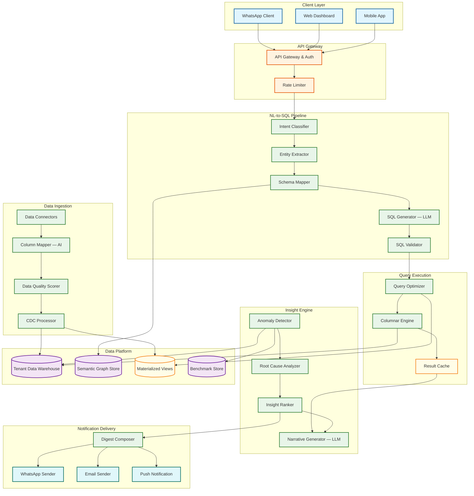
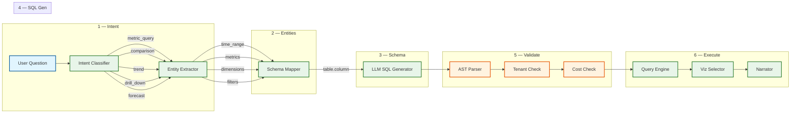
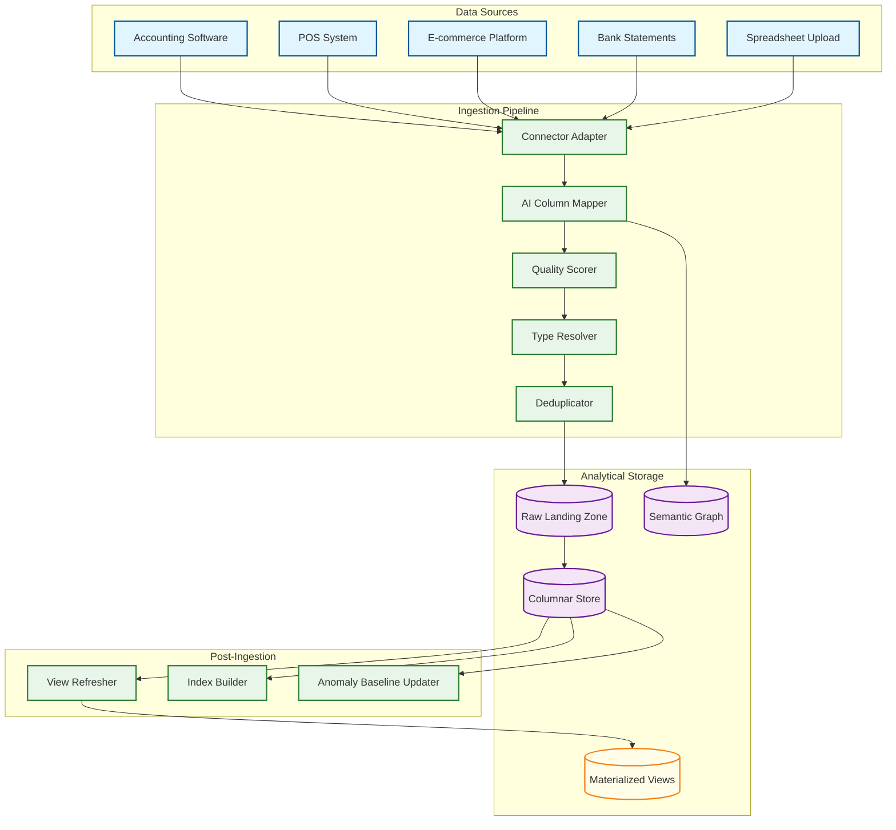
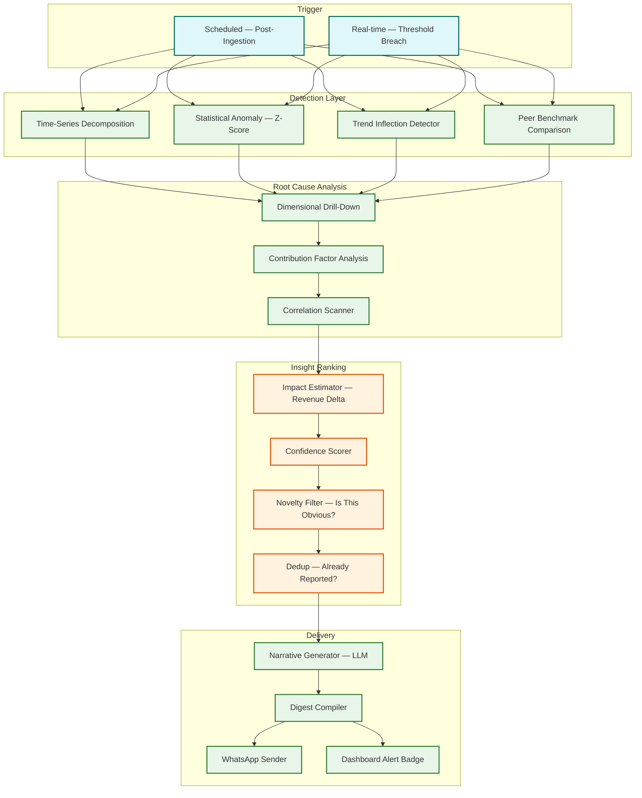

# 14.13 AI-Native MSME Business Intelligence Dashboard — High-Level Design

## System Architecture

---

## Data Flow: End-to-End Lifecycle

Understanding the complete data lifecycle — from source system to merchant's WhatsApp — is essential for identifying bottlenecks and failure points.

### Phase 1: Data Acquisition (Continuous)
1. **Connector sync triggers** every 15 minutes via scheduler
2. **Incremental extraction** pulls new/modified records since last watermark
3. **Schema drift detection** compares source schema against semantic graph
4. **Quality scoring** evaluates completeness, consistency, and freshness
5. **Records land** in raw landing zone (append-only, immutable)

### Phase 2: Data Preparation (Post-Ingestion)
1. **Type coercion** normalizes data types (strings to dates, currencies, categories)
2. **Deduplication** by event_id eliminates at-least-once delivery duplicates
3. **Column mapping** via semantic graph assigns business meaning
4. **Columnar conversion** compresses and partitions data by tenant_id + date
5. **Materialized view refresh** incrementally updates affected MV partitions

### Phase 3: Insight Generation (Scheduled + Real-Time)
1. **Pre-screening** compares latest KPI values against ±3σ bands (sub-second)
2. **Full detection** runs Prophet decomposition on flagged KPIs (5-10s per KPI)
3. **Root cause analysis** drills into dimensions for confirmed anomalies (2-5s)
4. **Ranking** scores by impact × confidence × novelty (sub-second)
5. **Narrative generation** via LLM creates human-readable explanations (500ms)

### Phase 4: NL Query Serving (On-Demand)
1. **Semantic cache check** → if hit, return in < 50ms
2. **Template matching** → if match, fill parameters, execute in < 500ms
3. **Materialized view routing** → if covering view exists, return in < 200ms
4. **Full LLM pipeline** → intent → entities → schema → SQL → validate → execute → narrate (< 3s)

### Phase 5: Insight Delivery (Scheduled)
1. **Digest compilation** selects top 3 insights per tenant (2 hours before delivery)
2. **Narrative compression** fits insights within 1024-char WhatsApp constraint
3. **Chart rendering** generates sparkline images for KPI indicators
4. **Rate-limited delivery** sends via WhatsApp API at 400 msg/s
5. **Fallback** triggers email delivery if WhatsApp fails twice

---

## NL-to-SQL Pipeline Architecture

The natural language query pipeline is the system's most critical path. Every user question flows through six stages, each designed to incrementally transform ambiguous human language into a precise, safe, and efficient SQL query.

### Stage Details

| Stage | Function | Latency Budget | Failure Mode |
|---|---|---|---|
| **Intent Classification** | Categorize query into type (metric lookup, comparison, trend, drill-down, forecast, goal-check) to determine downstream SQL patterns | 50 ms | Default to metric_query; log for retraining |
| **Entity Extraction** | Extract structured entities: time ranges ("last month"), metrics ("revenue"), dimensions ("by city"), filters ("only online orders") | 100 ms | Clarification prompt for ambiguous entities |
| **Schema Mapping** | Map extracted business entities to physical schema via semantic graph (e.g., "revenue" → `orders.total_amount`, "city" → `customers.city`) | 80 ms | Suggest closest matches if exact mapping fails |
| **SQL Generation** | LLM generates SQL using mapped schema, intent-specific templates, and few-shot examples from the tenant's query history | 800 ms | Retry with simplified prompt; escalate to template fallback |
| **Validation** | Parse SQL AST; verify tenant isolation predicate exists; check no DDL/DML; estimate query cost; verify referenced tables/columns are in allowed list | 50 ms | Reject query; log as potential safety issue |
| **Execution + Narration** | Execute validated SQL with timeout; format results; select visualization; generate narrative explanation | 1500 ms | Timeout → suggest query refinement; partial results if row limit hit |

---

## Data Ingestion Architecture

### Cross-Cutting Concerns

| Concern | Design Approach |
|---|---|
| **Authentication** | JWT-based authentication at API Gateway; tenant_id extracted from token claims; token validation cached for 5 minutes |
| **Tenant context propagation** | Every inter-service call carries `X-Tenant-Id` header, set by Gateway from JWT; services MUST validate this header matches the request context |
| **Request tracing** | W3C Trace Context headers propagated through all synchronous calls; async boundaries linked via parent trace IDs |
| **Error handling** | Structured error responses with error codes, human-readable messages, and suggested actions; no internal stack traces exposed to clients |
| **Idempotency** | All mutating operations (connector creation, report scheduling) use client-provided idempotency keys with 24-hour deduplication window |
| **Versioning** | API versioned via URL path (`/api/v1/`); breaking changes require new version; old versions supported for 12 months |

### Connector Design

Each data source connector implements a standard interface:

- **Schema discovery** — introspect the source to enumerate available tables/entities
- **Initial snapshot** — full data extraction for first-time onboarding
- **Incremental sync** — CDC-based or timestamp-watermark-based delta extraction
- **Health check** — periodic validation that credentials are valid and source is reachable
- **Schema drift detection** — compare current source schema against last-known schema; alert on breaking changes

The AI column mapper runs during initial snapshot and on schema drift events. It uses a fine-tuned classification model that maps source column names to a standardized business ontology (500+ business concepts across accounting, retail, services, and manufacturing domains).

### Data Quality Monitoring

Each data source is continuously assessed on four quality dimensions:

| Dimension | Metric | Calculation | Impact When Low |
|---|---|---|---|
| **Completeness** | % of expected columns with non-null values | `non_null_columns / total_expected_columns` | Queries against incomplete data return partial results |
| **Freshness** | Time since last successful sync | `current_time - last_sync_watermark` | Data staleness warning shown on all query results |
| **Consistency** | Cross-source reconciliation score | `1 - abs(source_A_total - source_B_total) / max(source_A_total, source_B_total)` | Discrepancy alerts surface in insight feed |
| **Volume stability** | Row count vs. expected baseline | `abs(current_rows - expected_rows) / expected_rows` | Spike: potential duplicates; Drop: potential data loss |

Quality scores are combined into a composite "Data Health" score per connector (0.0–1.0). Connectors below 0.6 trigger merchant-facing alerts with specific remediation steps.

---

## Auto-Insight Generation Pipeline

---

## Key Design Decisions

### Decision 1: Tenant-Scoped Semantic Graph vs. Global Schema Mapping

**Choice:** Tenant-scoped semantic graphs with a shared base ontology.

**Rationale:** MSMEs use wildly different data schemas even within the same industry. A Tally user's schema looks nothing like a Zoho Books user's schema, and even two Tally users may have different custom fields. A global schema mapping would require constant maintenance and would fail for edge cases. Instead, each tenant gets their own semantic graph initialized from a shared base ontology (the 500+ business concepts) and customized during onboarding. The trade-off is higher storage (50 KB × 2M tenants = 100 GB for semantic graphs) and per-tenant LLM context (each NL-to-SQL call includes the tenant's semantic graph as context), but this delivers dramatically higher query accuracy because the LLM operates on the tenant's actual column names and relationships, not a generic abstraction.

### Decision 2: Pre-Aggregated Materialized Views vs. Raw Query Execution

**Choice:** Hybrid—materialized views for common patterns, raw execution for ad-hoc queries.

**Rationale:** 80% of MSME analytics queries fall into predictable patterns: daily revenue, weekly sales by category, monthly expense trends, top 10 products. Pre-computing these into materialized views (refreshed on data ingestion) reduces query latency from 2-5 seconds (scanning raw data) to 100-200 ms (reading pre-aggregated results). The remaining 20% are ad-hoc queries that cannot be pre-computed ("show me customers who bought product X but not product Y in the last 90 days"). These run against the columnar store with a 10-second timeout. The materialized view refresh is incremental (only recompute affected partitions when new data arrives), costing ~100 MB of additional storage per tenant but saving 80% of compute for the most common queries.

### Decision 3: LLM-per-Query vs. Template-Based SQL Generation

**Choice:** LLM-per-query with template fallback for high-frequency patterns.

**Rationale:** Template-based SQL generation (mapping query patterns to parameterized SQL templates) is faster (10 ms vs. 800 ms) and more predictable but covers only a fixed set of query patterns. When a user asks something outside the template library ("show me the correlation between weather and ice cream sales"), the template system fails completely. The LLM approach handles arbitrary questions but at higher latency and cost. The hybrid uses a template cache for the top 50 query patterns (covering ~60% of queries) with LLM fallback for the remainder. Templates are auto-discovered from query logs: when the same query structure appears >100 times across tenants, it is promoted to a template.

### Decision 4: Per-Tenant Database vs. Shared Multi-Tenant Warehouse

**Choice:** Shared warehouse with tenant partitioning and row-level security.

**Rationale:** Per-tenant databases provide the strongest isolation but are operationally expensive at 2M tenants (2M database instances to manage, patch, back up, and monitor). A shared warehouse with data partitioned by `tenant_id` and enforced via row-level security policies provides comparable isolation at 1/50th the operational cost. The risk—a misconfigured query leaking cross-tenant data—is mitigated by the defense-in-depth approach: the SQL validator injects tenant predicates, the database enforces row-level security independently, and audit logs flag any query that returns data for multiple tenants.

### Decision 5: Differential Privacy for Benchmarks vs. Simple Aggregation

**Choice:** Differential privacy with ε ≤ 1.0 for all benchmark computations.

**Rationale:** Simple aggregation (average revenue of restaurants in Mumbai) risks exposing individual tenant data when cohort sizes are small. If a cohort has only 3 restaurants and one is a clear outlier, the aggregate reveals information about that tenant. Differential privacy adds calibrated noise to all aggregate statistics, providing a mathematical guarantee that no individual tenant's data can be inferred from the benchmark—even by an adversary with access to all other tenants' data. The ε ≤ 1.0 budget ensures strong privacy at the cost of slightly noisier benchmarks (±5-8% for cohorts of 50+, ±15-20% for cohorts near the minimum of 50). This trade-off is acceptable because benchmarks are directional ("you're above average") not precise.

---

## Component Responsibility Matrix

| Component | Primary Responsibility | Inputs | Outputs | Scaling Unit | Failure Impact |
|---|---|---|---|---|---|
| **API Gateway** | Authentication, rate limiting, request routing | Client HTTP requests | Authenticated, rate-limited requests to backend services | Horizontal (stateless) | Total service unavailability |
| **Intent Classifier** | Categorize NL query into type (metric, comparison, trend, drill-down, forecast, ranking) | Raw NL text | Intent label + confidence score | Horizontal (stateless, CPU-bound) | All queries default to metric_query; reduced accuracy |
| **Entity Extractor** | Extract structured entities (time range, metrics, dimensions, filters) from classified query | NL text + intent | Structured entity map | Horizontal (stateless, CPU-bound) | Clarification prompts for all queries |
| **Schema Mapper** | Map business entities to physical database schema via semantic graph | Entity map + tenant's semantic graph | Physical column/table references + join paths | Horizontal (requires graph read access) | NL queries fail; template/cached queries still work |
| **SQL Generator (LLM)** | Generate SQL from mapped entities using LLM inference | Mapped schema, intent, session context | SQL query string | GPU-bound (vertical + horizontal) | Template fallback for 60% of queries; complex queries unavailable |
| **SQL Validator** | Verify generated SQL for safety (tenant isolation, DDL prevention, cost estimation) | SQL string + tenant context | Validated SQL or rejection | Horizontal (CPU-bound, fast) | Security boundary compromised — MUST never fail silently |
| **Query Engine** | Execute validated SQL against columnar warehouse | Validated SQL + tenant partition | Result set (rows + columns) | Horizontal (memory-bound) | All queries fail; cached results still serveable |
| **Visualization Selector** | Choose optimal chart type based on data shape and query intent | Result schema + intent + row count | Chart type + configuration | Horizontal (stateless, fast) | Fallback to table view |
| **Narrative Generator (LLM)** | Generate human-readable explanation of query results | Result set + context | Narrative text | GPU-bound | Results returned without narrative — degraded but functional |
| **Anomaly Detector** | Statistical anomaly detection across tenant KPIs | KPI time series + baselines | Anomaly candidates with z-scores | Horizontal (CPU-bound, batch) | No new insights generated; last-known insights shown |
| **Root Cause Analyzer** | Dimensional drill-down to attribute anomalies to specific segments | Anomaly candidate + dimensional data | Root cause attribution with contribution scores | Horizontal (query-bound) | Insights without root cause — less actionable |
| **Insight Ranker** | Rank insights by impact × confidence × novelty | Root cause attributions + tenant feedback history | Ranked insight list (top 3 for digest) | Horizontal (CPU-bound) | All insights delivered equally — lower signal-to-noise |
| **Digest Composer** | Assemble WhatsApp digest from ranked insights within character constraints | Top 3 insights + KPI summary | Formatted message + chart image | Horizontal (LLM-bound for narrative compression) | Digest not sent; email fallback activated |
| **Data Connector** | Sync data from external sources to warehouse | Source credentials + sync schedule | Raw data batches in landing zone | Per-source-type pools | Data freshness degrades; stale flag shown |
| **Column Mapper (AI)** | Map source column names to business ontology | Source schema + base ontology | Semantic graph mappings with confidence | Horizontal (ML model inference) | Manual mapping required; onboarding delayed |
| **Benchmark Aggregator** | Compute differentially-private peer benchmarks across cohorts | Tenant KPIs grouped by cohort | Noisy percentile benchmarks | Batch (nightly job) | Stale benchmarks shown; no privacy budget consumed |

---

## Architecture Decision Records (ADRs)

### ADR-001: Semantic Graph Per Tenant vs. Shared Global Schema

**Status:** Accepted

**Context:** The NL-to-SQL engine needs a mapping between business terms (what merchants say) and physical schema (what the database has). Two approaches: a shared global schema that normalizes all tenants' data into a common model, or a per-tenant semantic graph that maps each tenant's unique schema.

**Decision:** Per-tenant semantic graph with shared base ontology.

**Consequences:**
- (+) Dramatically higher query accuracy because the LLM operates on tenant-specific column names and relationships
- (+) No schema migration required when a tenant changes data sources
- (+) Each tenant's semantic graph captures domain-specific terminology (a textile merchant's "grey fabric" vs. a paint store's "grey paint")
- (−) 100 GB of semantic graph storage at 2M tenants (50 KB each)
- (−) Each LLM call includes tenant-specific schema context, increasing prompt token count by ~500 tokens
- (−) Operational complexity: 2M independent graphs to maintain, version, and debug

### ADR-002: Columnar Store vs. Row-Oriented Store for Tenant Analytical Data

**Status:** Accepted

**Context:** MSME analytical queries are overwhelmingly columnar in nature (aggregate a few columns across many rows: SUM(revenue), COUNT(orders), AVG(order_value)). Row-oriented stores would read all columns per row, wasting I/O on irrelevant columns.

**Decision:** Columnar analytical store with partition Cutting off unnecessary steps by tenant_id and date range.

**Consequences:**
- (+) 10–50× less I/O for typical analytical queries (reading 2-3 columns instead of 20+)
- (+) 2.5× compression ratio (columnar compression exploits within-column value similarity)
- (+) Partition Cutting off unnecessary steps eliminates 99.97% of I/O for tenant-scoped queries (scanning 1 of 4096 partitions)
- (−) Point lookups (single row by ID) are slower than row-oriented stores — acceptable for an analytics workload
- (−) Write amplification: each incremental sync rewrites column segments, increasing write I/O

### ADR-003: LLM-First vs. Template-First Query Routing

**Status:** Accepted

**Context:** Should the NL query pipeline route to the LLM by default (flexibility) or to templates by default (speed, cost)?

**Decision:** Template-first with LLM fallback. The template matcher runs before the LLM, and queries matching a known pattern bypass the LLM entirely.

**Consequences:**
- (+) 60% of queries handled in 10 ms instead of 800 ms — dramatic latency improvement
- (+) 75% cost reduction for matched queries (no LLM inference cost)
- (+) Template queries are deterministic — same input always produces same output (better for caching)
- (−) Template library must be actively maintained (auto-promoted from query logs, but requires monitoring)
- (−) Edge Case (Unusual or extreme situation): when a template and LLM produce different SQL for the same question, the system must reconcile (resolved by template validation against LLM output during promotion)

### ADR-004: Synchronous vs. Asynchronous Insight Delivery

**Status:** Accepted

**Context:** When the insight engine detects an anomaly, should it push to the merchant immediately (real-time alert) or batch into the next scheduled digest?

**Decision:** Batch into daily digest for most insights; real-time push only for critical threshold breaches (revenue = 0 for 2+ hours, payment failures > 10% rate).

**Consequences:**
- (+) WhatsApp message volume reduced by 90% (3 insights/day vs. 3 per anomaly detection)
- (+) Merchants receive curated, ranked insights rather than a stream of raw alerts
- (+) Lower API cost and simpler delivery infrastructure
- (−) Up to 23-hour delay between anomaly detection and merchant notification
- (−) Critical real-time alerts require a separate delivery path with its own reliability guarantees

### ADR-005: WhatsApp as Primary Delivery Channel vs. Email/App Push

**Status:** Accepted

**Context:** MSME owners in India have significantly higher engagement with WhatsApp (95%+ daily open rate) compared to email (15-20% open rate) or app notifications (30-40% interaction rate).

**Decision:** WhatsApp as the primary insight delivery channel, with email and push as fallbacks.

**Consequences:**
- (+) 67% digest read rate (vs. ~18% for email) — insights actually reach the merchant
- (+) Aligns with MSME workflow — merchants already check WhatsApp throughout the day
- (+) Deep links from WhatsApp messages drive dashboard engagement
- (−) WhatsApp Business API cost: $0.001 per utility message × 600K/day = $18K/month
- (−) 1024-character message body constraint forces aggressive summarization
- (−) Dependency on Meta's API availability and template approval process
- (−) Regulatory risk: WhatsApp policy changes could restrict business messaging

---

## Real-World Architecture Case Studies

### Real-World: Dune Analytics — Multi-Tenant Query Engine at Scale

Dune Analytics provides a community-driven analytics platform where 500K+ analysts query blockchain data. Their architecture handles a key challenge shared with the MSME BI dashboard: multi-tenant query execution with tenant-level resource isolation. Dune processes 2M+ queries per day against a shared data warehouse containing 50+ TB of indexed blockchain data. Key architectural insight: they use a query cost estimation model that pre-computes the estimated resource consumption before execution, rejecting queries that exceed the user's tier limits. Their columnar storage engine achieves 200 ms median query latency for pre-aggregated views and 5-second p95 for ad-hoc scans. Engineering decision: investing in a custom query planner that rewrites user SQL for optimal partition Cutting off unnecessary steps reduced median query latency by 4× compared to passing raw SQL directly to the engine.

### Real-World: Mode Analytics — NL-to-SQL for Business Users

Mode Analytics serves 1,000+ enterprise customers with a natural language analytics interface. Their NL-to-SQL pipeline achieves 87% accuracy on first-attempt queries across diverse enterprise schemas. Key insight: accuracy varies dramatically by schema complexity — 95% for schemas with < 20 tables, dropping to 78% for schemas with 100+ tables and ambiguous column names. Their solution: a "golden query library" where analysts curate validated SQL queries for common questions, and the NL system routes to these golden queries when pattern similarity exceeds 0.85. This approach delivers template-like accuracy with LLM flexibility. Engineering decision: separating the schema understanding phase (offline, when data is connected) from the query generation phase (online, per query) improved latency by 60% because schema analysis (which requires scanning sample data) is amortized across all queries.

### Real-World: WhatsApp Business API at Scale — Razorpay

Razorpay (Indian payment gateway) sends 50M+ WhatsApp notifications per month to merchants and buyers. Their delivery infrastructure handles the same thundering herd challenge as the MSME BI digest: 5M+ merchants expecting payment notifications within seconds of a transaction. Key numbers: 99.2% delivery success rate, 73% read rate within 1 hour, and 42% click-through rate on deep links. Architecture insight: they use a three-tier delivery queue — priority (payment confirmations, < 5s), standard (daily summaries, < 5 min), and batch (marketing, rate-limited to 50 msg/s). Their rate limiter maintains 80% of WhatsApp's API limit to absorb burst traffic without hitting throttling. Engineering decision: pre-rendering message templates with variable substitution (instead of dynamic LLM generation per message) reduces per-message composition time from 200 ms to 2 ms.
