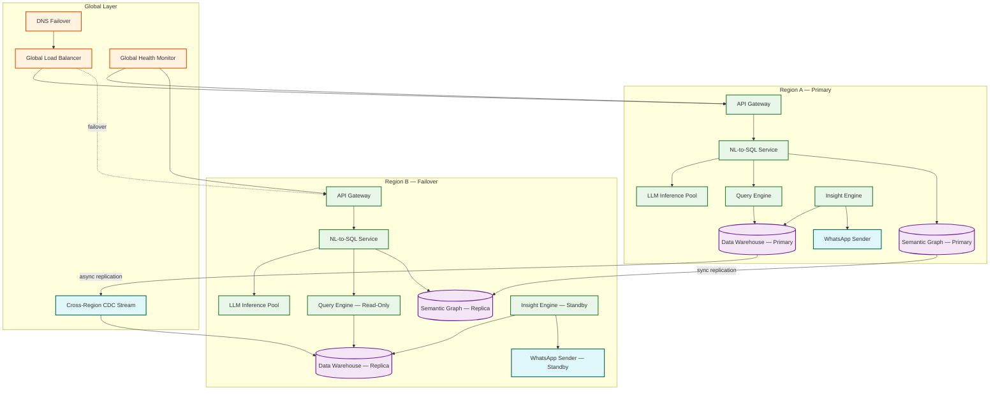

# 14.13 AI-Native MSME Business Intelligence Dashboard — Scalability & Reliability

## Scaling Dimensions

### Tenant Growth Scaling

The system must scale from 200K to 2M+ tenants without re-architecture. The key scaling bottlenecks and strategies:

| Component | Scaling Approach | Trigger |
|---|---|---|
| **Analytical warehouse** | Horizontal shard-split: start with 4096 hash partitions, split into 16K when partition size exceeds 100 GB | Avg partition size > 80 GB |
| **Semantic graph store** | Key-value store with consistent hashing; add nodes to the ring as total graph size grows | Total graphs > 50 GB |
| **NL-to-SQL LLM inference** | Horizontal GPU pool with load-balanced routing; auto-scale based on queue depth | Queue wait > 200 ms |
| **Materialized view compute** | Time-sliced batch processing with elastic compute that scales up during refresh windows and down during quiet hours | Refresh backlog > 30 minutes |
| **WhatsApp delivery** | Geographic sharding of delivery workers; multiple WhatsApp Business API accounts across regions | Delivery rate > 400 msg/s per account |

### Query Volume Scaling

```
Step-by-step plan in plain English: query_routing(query, tenant)
    // Step 1: Check semantic cache
    cache_key = hash(normalize(query.text), tenant.id, data_freshness_marker)
    IF cache.exists(cache_key):
        RETURN cache.get(cache_key)     // < 50 ms

    // Step 2: Check template cache
    template = template_matcher.match(query.text)
    IF template != null:
        sql = template.fill(query.entities, tenant.schema)
        RETURN execute_and_cache(sql)   // < 500 ms

    // Step 3: Check materialized views
    mv = mv_router.find_covering_view(query.entities, tenant.id)
    IF mv != null:
        RETURN query_mv_and_cache(mv)   // < 200 ms

    // Step 4: Full LLM pipeline (most expensive path)
    RETURN full_nl_to_sql_pipeline(query, tenant)  // < 3000 ms
```

This four-tier routing ensures that as query volume grows, the most expensive path (full LLM pipeline) handles a decreasing percentage of queries. At steady state: 25% cache hits, 35% template hits, 20% materialized view hits, 20% full pipeline.

### Data Volume Scaling

| Scenario | Strategy |
|---|---|
| Tenant data grows beyond 1 GB | Tiered storage: hot (last 90 days) in columnar store, warm (90 days - 1 year) in compressed columnar, cold (1-3 years) in object storage with on-demand query |
| Aggregate data exceeds 1 PB | Columnar store federation: split into regional clusters (India-West, India-South, India-North, India-East) with cross-region query routing |
| Materialized view storage exceeds 100 TB | TTL-based eviction: views for tenants inactive >30 days are evicted and recomputed on-demand when they return |

---

## Reliability Patterns

### Circuit Breaker: LLM Service

The NL-to-SQL pipeline depends on an LLM inference service that may experience latency spikes or outages. The circuit breaker prevents cascading failures:

```
Step-by-step plan in plain English: llm_circuit_breaker
    STATE: CLOSED (normal), OPEN (failing), HALF_OPEN (testing)

    ON query:
        IF state == OPEN:
            IF now - last_failure > 30 seconds:
                state = HALF_OPEN  // allow one test query
            ELSE:
                RETURN template_fallback(query)  // degraded but functional

        TRY:
            result = llm_generate_sql(query, timeout=2000ms)
            IF state == HALF_OPEN:
                state = CLOSED
                failure_count = 0
            RETURN result

        CATCH timeout OR error:
            failure_count += 1
            IF failure_count >= 5:
                state = OPEN
                last_failure = now
            RETURN template_fallback(query)
```

When the circuit is open, the system degrades gracefully: template-matched queries still work (covering 60% of use cases), and complex queries return a message: "Advanced analytics are temporarily unavailable. Showing your standard metrics dashboard instead."

### Data Pipeline Reliability

**At-least-once delivery with deduplication:**
Every data ingestion event is assigned a globally unique event_id. The ingestion pipeline guarantees at-least-once processing (retry on failure). The deduplication layer at the warehouse uses event_id to prevent duplicate rows. This is cheaper than exactly-once semantics and equally correct for analytical workloads.

**Checkpoint-based recovery:**
Long-running ingestion jobs (initial snapshots with millions of rows) checkpoint progress every 10,000 rows. On failure, the job resumes from the last checkpoint rather than starting over. Checkpoints are stored in a durable key-value store, separate from the data pipeline itself.

**Dead letter queue:**
Records that fail schema validation, type coercion, or deduplication are routed to a per-tenant dead letter queue. These are not silently dropped—the merchant sees a "data quality" alert in their dashboard showing the count of unprocessable records and the ability to download them for manual review.

### Multi-Region Resilience

| Component | Primary | Failover | RPO | RTO |
|---|---|---|---|---|
| Analytical warehouse | Region A | Region B (async replica, 5-min lag) | 5 minutes | 15 minutes |
| Semantic graph store | Region A | Region B (sync replica) | 0 | 5 minutes |
| LLM inference | Multi-region active-active | Auto-route to healthy region | N/A | < 30 seconds |
| WhatsApp delivery | Region A | Region B | N/A | 2 minutes (re-queue pending messages) |
| Dashboard web app | CDN + multi-region origin | CDN serves cached; re-route origin | N/A | < 60 seconds |

### Graceful Degradation Ladder

When components fail, the system degrades in priority order—preserving the most valuable functionality longest:

| Failure | Degraded Experience | What Still Works |
|---|---|---|
| LLM inference down | No NL queries; template queries only | Dashboards, materialized views, WhatsApp digests |
| Analytical warehouse slow | NL queries from cache/MVs only; no ad-hoc | Cached queries, dashboards with cached data, digests |
| Data ingestion delayed | Stale data (flagged with "last updated X hours ago") | All queries on existing data; no fresh insights |
| WhatsApp API down | Digests queued for retry; email fallback | Dashboard, NL queries, push notifications |
| Insight engine backlogged | Insights delayed; last-known insights shown | Queries, dashboards, manual exploration |
| Complete outage | Static status page | Nothing—incident response activated |

---

## Data Lifecycle Management at Scale

### Hot/Warm/Cold Tiering Strategy

```
Step-by-step plan in plain English: data_tiering_policy(tenant, data_partition)
    age = current_date - data_partition.latest_timestamp

    IF age <= 90 days:
        tier = HOT
        storage = columnar_ssd
        query_latency_sla = "< 1 second"
        // All NL queries, dashboard queries, and MV computations

    ELIF age <= 365 days:
        tier = WARM
        storage = compressed_columnar_hdd
        query_latency_sla = "< 5 seconds"
        // Historical trend queries, year-over-year comparisons

    ELSE:
        tier = COLD
        storage = object_storage
        query_latency_sla = "< 30 seconds (on-demand load)"
        // Compliance queries, rare historical lookups

    // Auto-migrate: nightly job moves partitions between tiers
    // Query routing: query engine checks partition metadata to route
    //   to correct storage tier transparently
```

### Tenant Lifecycle and Data Hygiene

| State | Trigger | Data Treatment | Compute Allocation |
|---|---|---|---|
| **Active** | Logged in within 7 days | Full hot storage; all MVs refreshed | Full tier allocation |
| **Dormant** | No login for 7–30 days | MVs evicted (lazy refresh on return); data stays hot | Reduced to 50% |
| **Inactive** | No login for 30–90 days | Data migrated to warm tier; MVs deleted | Insight detection paused |
| **Churned** | No login for 90+ days or explicit cancellation | Data migrated to cold tier; connectors paused | Zero allocation |
| **Deleted** | Explicit deletion request | Hard delete per data protection policy | Zero; all resources freed |

At steady state with 2M tenants: 200K active (10%), 300K dormant (15%), 800K inactive (40%), 700K churned (35%). This distribution means only 25% of tenants consume significant compute, dramatically reducing the effective per-tenant cost.

---

## Capacity Planning

### Growth Model

```
YEAR 1 (Launch):
    Tenants:        200K registered, 80K MAT
    Queries/day:    200K
    Storage:        100 TB
    LLM GPU-hours:  25/day
    Monthly cost:   ~$80K

YEAR 2:
    Tenants:        800K registered, 320K MAT
    Queries/day:    800K
    Storage:        350 TB
    LLM GPU-hours:  80/day
    Monthly cost:   ~$200K

YEAR 3 (Target scale):
    Tenants:        2M registered, 800K MAT
    Queries/day:    1M
    Storage:        500 TB (with cold tier offloading)
    LLM GPU-hours:  120/day
    Monthly cost:   ~$311K
```

### Auto-Scaling Policies

| Component | Metric | Scale-Up Threshold | Scale-Down Threshold | Min/Max Instances |
|---|---|---|---|---|
| NL query service | p95 latency | > 2.5 s | < 1.5 s (sustained 10 min) | 4 / 40 |
| LLM inference pool | Queue depth | > 50 pending | < 10 pending (sustained 5 min) | 2 / 20 GPU nodes |
| Query engine | CPU utilization | > 70% | < 30% (sustained 15 min) | 8 / 80 |
| Ingestion workers | Backlog size | > 10K pending events | < 1K pending (sustained 10 min) | 4 / 40 |
| WhatsApp sender | Queue depth | > 50K pending | < 5K pending | 2 / 10 |

---

## Real-World Scaling Case Studies

### Real-World: Snowflake's Multi-Tenant Query Isolation

Snowflake serves 10,000+ customers on a shared data platform, facing the same multi-tenant query isolation challenge at a larger scale. Their "virtual warehouse" concept provides compute isolation: each tenant's queries execute on dedicated compute resources that auto-scale based on query volume. Key insight for the MSME BI platform: Snowflake discovered that 90% of the "noisy neighbor" complaints were caused by 0.1% of queries — a single full-table scan from one tenant would monopolize shared I/O bandwidth. Their solution was query cost pre-estimation with automatic throttling: queries estimated to exceed the tenant's resource quota are either optimized (automatic predicate pushdown, partition Cutting off unnecessary steps suggestions) or queued for off-peak execution. This approach reduced noisy-neighbor incidents by 98%.

### Real-World: Databricks' Materialized View Strategy at Scale

Databricks manages materialized views across millions of tables for lakehouse customers. Their key scaling insight: materialized views that are refreshed on every data change (eager refresh) cost 10× more compute than views refreshed on query (lazy refresh). For the MSME BI platform, the optimal strategy is: eager refresh for the top 5 most-queried MV patterns per tenant (covers 80% of queries), lazy refresh for long-tail patterns (refreshed only when queried, with a "data may be up to 15 minutes old" indicator). This hybrid approach reduced Databricks' total MV refresh compute by 70% while maintaining sub-second query latency for the most popular views. Key numbers: average MV refresh time of 2.3 seconds for incremental partition updates, versus 45 seconds for full recomputation.

---

## Disaster Recovery

### Backup Strategy

| Data | Backup Frequency | Retention | Recovery Method |
|---|---|---|---|
| Tenant configurations | Continuous (event-sourced) | Indefinite | Replay event log |
| Semantic graphs | Hourly snapshot | 30 days | Restore from snapshot |
| Analytical data | Daily full + hourly incremental | 7 years (compliance) | Restore from backup + replay CDC |
| Query logs | Daily archive to cold storage | 1 year hot, 3 years cold | Restore from archive |
| Materialized views | Not backed up | N/A | Recomputed from analytical data |

### Runbook: Warehouse Failover

```
Step-by-step plan in plain English: warehouse_failover_procedure
    1. Detection: health check fails 3 consecutive times (90 seconds)
    2. Confirm: verify primary is truly unreachable (not a network partition)
    3. Promote: promote async replica to primary
    4. Reconnect: update connection pool DNS to new primary
    5. Verify: run canary queries across sample of tenants
    6. Notify: alert ops team; log RPO (data loss window)
    7. Rebuild: provision new replica from promoted primary
    8. Post-mortem: analyze root cause within 24 hours
```

---

## Multi-Region Deployment Strategy



### Region Failover Strategy

| Component | Replication Mode | RPO | RTO | Failover Trigger |
|---|---|---|---|---|
| Data Warehouse | Async CDC (5-min lag) | 5 min | 15 min | 3 failed health checks (90s) |
| Semantic Graph Store | Synchronous | 0 | 5 min | Single health check failure |
| LLM Inference | Active-active (both regions serve) | N/A | 0 (already active) | Auto-routing |
| WhatsApp Delivery | Active-passive with queue persistence | 0 (messages queued) | 2 min | Queue transfer |
| Query Cache | Not replicated | N/A | Cache cold-start (30 min to warm) | N/A |
| Materialized Views | Rebuilt from replica warehouse | 5 min | 2 hours (full rebuild) | Post-failover task |

### Cross-Region Data Consistency

The async replication lag between Region A and Region B means failover may lose up to 5 minutes of data. For an MSME BI platform, this is acceptable because:

1. **Analytical queries are backward-looking** — merchants ask about yesterday or last week, not the last 5 minutes
2. **Ingestion is periodic** — data sources sync every 15 minutes, so a 5-minute gap represents at most one partial sync cycle
3. **Insights are batch-computed** — the insight engine runs post-ingestion, so recent insights are regenerated during catch-up

For the semantic graph (which must be consistent because a stale graph means wrong query mappings), synchronous replication is used despite the latency cost (adds ~10 ms per write). Graph writes are infrequent (schema drift events, merchant corrections) so this cost is negligible.

---

## Back-Pressure Mechanisms

### NL Query Pipeline Back-Pressure

```
Step-by-step plan in plain English: nl_query_back_pressure(tenant, query)
    // Layer 1: Per-tenant rate limiting
    tokens = rate_limiter.get_tokens(tenant.id, tier_limits[tenant.plan_tier])
    IF tokens == 0:
        RETURN 429_RESPONSE("Query limit reached. Try again in {cooldown} seconds.")

    // Layer 2: Global queue depth check
    queue_depth = llm_queue.current_depth()
    IF queue_depth > HIGH_WATERMARK:       // 500 pending
        IF tenant.plan_tier == "free":
            RETURN 503_RESPONSE("System is busy. Showing cached dashboard instead.")
        ELSE:
            // Paid tenants get priority queue access
            priority_queue.enqueue(query, priority=tier_priority[tenant.plan_tier])

    // Layer 3: Adaptive timeout
    estimated_wait = queue_depth * avg_processing_time
    IF estimated_wait > 5_seconds:
        // Try template/cache fast path before queuing for LLM
        fast_result = try_fast_path(query, tenant)
        IF fast_result != null:
            RETURN fast_result
        // Queue with reduced timeout
        adjusted_timeout = max(2000, 3000 - estimated_wait)
        RETURN execute_with_timeout(query, adjusted_timeout)

    // Layer 4: Circuit breaker (already described above)
    RETURN llm_circuit_breaker.execute(query)
```

### Ingestion Pipeline Back-Pressure

When the data warehouse cannot keep up with ingestion volume (e.g., during a bulk upload from a large enterprise tenant):

```
Step-by-step plan in plain English: ingestion_back_pressure(batch, tenant)
    // Check warehouse write throughput
    current_throughput = warehouse.write_rate()
    IF current_throughput > 0.85 * MAX_WRITE_THROUGHPUT:
        // Tier 1: Throttle bulk uploads
        IF batch.type == "initial_snapshot":
            batch.rate_limit = current_throughput * 0.1  // cap at 10% of capacity
            LOG("Throttling initial snapshot for tenant {tenant.id}")

        // Tier 2: Defer non-critical syncs
        IF batch.priority == "scheduled":
            requeue_with_delay(batch, delay=5_minutes)
            RETURN

        // Tier 3: Reject new connector registrations temporarily
        IF batch.type == "new_connector":
            RETURN 503_RESPONSE("Data ingestion is temporarily delayed. Your connector will sync within 30 minutes.")

    // Tier 4: Dead letter overflow
    IF dead_letter_queue.depth(tenant.id) > 10000:
        pause_connector(tenant.id, batch.connector_id)
        notify_merchant("Data quality issues detected. Ingestion paused. Please review {count} problematic records.")
```

### WhatsApp Delivery Back-Pressure

```
Step-by-step plan in plain English: whatsapp_back_pressure
    // Token bucket: 400 msg/s (80% of 500 msg/s API limit)
    rate = token_bucket.consume(1)
    IF NOT rate.allowed:
        // Requeue with jittered delay
        delay = base_delay + random(0, jitter_window)
        requeue_message(message, delay)
        RETURN

    // Monitor API response codes
    response = whatsapp_api.send(message)
    IF response.status == 429:  // Rate limited by WhatsApp
        // Reduce sending rate by 25% for 60 seconds
        token_bucket.reduce_rate(0.75, duration=60_seconds)
        requeue_message(message, delay=5_seconds)
    ELIF response.status == 503:  // WhatsApp service unavailable
        // Exponential backoff for all pending messages
        global_backoff.activate(initial=30_seconds, max=15_minutes)
        requeue_all_pending()
```

---

## Chaos Engineering Experiments

### Experiment 1: LLM Inference Latency Injection

**Hypothesis:** When LLM inference latency exceeds 2 seconds, the circuit breaker should open within 30 seconds, and 60% of queries should continue being served via templates.

**Method:** Inject 3-second latency into 100% of LLM inference calls for a test tenant cohort (1000 tenants in a staging environment).

**Expected behavior:**
1. First 5 queries experience timeout (failure_count reaches threshold)
2. Circuit breaker opens at T+30 seconds
3. Subsequent queries route to template fallback (10 ms response)
4. Template coverage: ~60% of queries succeed; ~40% return degraded message
5. Circuit breaker half-opens at T+60 seconds, tests one query
6. If LLM is still slow, circuit stays open for another 30 seconds

**Blast radius control:** Test cohort is isolated in a separate query queue; latency injection is per-tenant-group, not global.

### Experiment 2: Data Warehouse Partition Loss

**Hypothesis:** Losing a single warehouse partition (affecting ~500 tenants in a 4096-partition scheme) should not cause errors for unaffected tenants, and affected tenants should receive a clear error message within 5 seconds.

**Method:** Simulate partition unavailability by blocking I/O to one partition in the staging warehouse.

**Expected behavior:**
1. Queries for affected tenants fail at the query engine level
2. Query engine returns: "Your data is temporarily unavailable. Showing cached results."
3. Materialized view queries for affected tenants still work (MVs in separate storage)
4. Queries for unaffected tenants are completely unimpacted (no cross-partition dependencies)
5. Insight engine detects the partition failure and suspends anomaly detection for affected tenants

### Experiment 3: Semantic Graph Store Total Failure

**Hypothesis:** If the semantic graph store becomes unavailable, template-matched queries (which don't need the graph) should continue working, and LLM-routed queries should degrade gracefully.

**Method:** Block all read/write access to the semantic graph store for 10 minutes.

**Expected behavior:**
1. Template-matched queries: unaffected (templates are pre-compiled with physical column names)
2. Cached queries: unaffected (cache stores results, not graph references)
3. New LLM queries: fail at schema mapping stage → return "Unable to process complex queries temporarily. Your standard dashboards are still available."
4. Semantic graph writes (onboarding, drift detection): queued for retry when store recovers
5. Recovery: no data loss (graph store is durable); queued writes applied within 5 minutes of recovery

### Experiment 4: WhatsApp API Complete Outage (1 Hour)

**Hypothesis:** All pending digests should be queued without loss and delivered within 30 minutes of API recovery. Email fallback should activate for digests delayed more than 30 minutes past scheduled time.

**Method:** Simulate WhatsApp API returning 503 for all requests for 60 minutes during the 8 AM delivery window.

**Expected behavior:**
1. Delivery attempts fail → messages enter retry queue with exponential backoff
2. At T+30 minutes: email fallback triggers for all undelivered digests
3. Email contains the same content as the WhatsApp digest (adapted formatting)
4. At T+60 minutes: WhatsApp API recovers → queued messages drain at rate-limited pace (400 msg/s)
5. Merchants who received email AND WhatsApp see deduplicated content (deep links resolve to same dashboard state)
6. Total message loss: 0. Delayed delivery: 100% of morning digests, recovered within 90 minutes

### Experiment 5: Insight Engine Batch Processing Failure

**Hypothesis:** If the nightly insight detection batch fails mid-processing (at 50% completion), the system should automatically resume from the checkpoint. Tenants processed before the failure should have valid insights; unprocessed tenants should receive their last-known insights in the morning digest with a "based on yesterday's data" qualifier.

**Method:** Kill the insight detection batch worker at 3:00 AM when processing is ~50% complete.

**Expected behavior:**
1. Processed tenants (first 50%): insights available for digest compilation — no impact
2. Unprocessed tenants (remaining 50%): digest compiler detects missing insights, falls back to last-known insights with freshness indicator
3. Restart: batch resumes from checkpoint (tenant_id watermark), processing remaining 50%
4. Late insights: detected within 1 hour of restart; available in dashboard but NOT sent as separate WhatsApp messages (too late for morning digest)
5. Monitoring: alert fires when batch hasn't completed by 6 AM (2 hours before first digest)

### Experiment 6: Connector Credential Rotation Under Load

**Hypothesis:** Rotating OAuth tokens for 50K connectors simultaneously (simulating a mass credential refresh after a security advisory) should complete within 30 minutes without interrupting active syncs.

**Method:** Trigger forced credential rotation for a large tenant cohort while active syncs are in progress.

**Expected behavior:**
1. Active syncs complete with existing credentials (no mid-sync rotation)
2. New syncs pick up rotated credentials from the credential store
3. Rotation throughput: ~30 credentials/second (limited by HSM decryption/encryption)
4. Failed rotations (expired refresh tokens): flagged and queued for merchant re-authorization
5. No sync failures during rotation window; at most 15-minute delay for syncs waiting on new credentials

---

## Capacity Planning Formulas

### LLM Inference Capacity

```
FORMULA: required_gpu_nodes = (
    peak_queries_per_second
    × (1 - template_hit_rate - cache_hit_rate)    // queries requiring LLM
    × avg_inference_time_seconds
    × safety_margin
) / queries_per_gpu_per_second

EXAMPLE:
    peak_qps = 30
    template_hit_rate = 0.35
    cache_hit_rate = 0.25
    llm_fraction = 1 - 0.35 - 0.25 = 0.40
    llm_qps = 30 × 0.40 = 12 queries/second needing LLM
    avg_inference_time = 0.8 seconds
    queries_per_gpu = 4 concurrent / 0.8s = 5 queries/gpu/second
    safety_margin = 1.5
    required_gpus = (12 / 5) × 1.5 = 3.6 → 4 GPU nodes

SCALING TRIGGER: Add GPU node when avg queue depth > 10 for 5 minutes
```

### Warehouse Storage Projection

```
FORMULA: total_storage_year_N = (
    tenants_year_N × avg_data_per_tenant
    × (1 + yoy_data_growth_rate) ^ years
    × replication_factor
    × (1 / compression_ratio)
)

EXAMPLE (Year 3):
    tenants = 2,000,000
    avg_data = 500 MB raw per tenant
    yoy_growth = 0.15 (15% more data per tenant per year)
    replication = 2 (primary + 1 replica)
    compression = 2.5 (columnar compression)

    raw_total = 2M × 500 MB = 1 PB
    with_growth = 1 PB × 1.15^2 = 1.32 PB (accumulated from year 1)
    replicated = 1.32 PB × 2 = 2.64 PB raw
    compressed = 2.64 PB / 2.5 = 1.06 PB actual storage

    with tiered storage (30% hot / 40% warm / 30% cold):
        hot_storage = 1.06 PB × 0.30 = 318 TB (columnar, fast SSD)
        warm_storage = 1.06 PB × 0.40 = 424 TB (compressed, HDD)
        cold_storage = 1.06 PB × 0.30 = 318 TB (object storage)
```

### WhatsApp Delivery Window Calculation

```
FORMULA: delivery_window_minutes = (
    total_digests / sending_rate_per_second / 60
) × safety_overhead

EXAMPLE:
    digests = 600,000
    rate = 400 msg/s (80% of 500 msg/s limit)
    raw_time = 600,000 / 400 / 60 = 25 minutes
    with timezone spread (5 timezone buckets for India):
        per_bucket = 120,000 digests
        per_bucket_time = 120,000 / 400 / 60 = 5 minutes
    safety_overhead = 1.3 (30% buffer for retries)
    delivery_window = 5 × 1.3 = 6.5 minutes per timezone bucket

    Pre-computation start: 5 AM (3 hours before first delivery at 8 AM)
    Digest assembly: ~2 hours for 600K digests (parallel processing)
    Delivery start: 7:55 AM → complete by 8:07 AM (within acceptable window)
```

### Insight Detection Compute Budget

```
FORMULA: daily_compute_hours = (
    (mat × kpis_per_tenant × prescreen_cost)          // pre-screening
    + (mat × kpis_per_tenant × prescreen_pass_rate × full_detection_cost)  // full detection
    + (mat × kpis_per_tenant × anomaly_rate × drill_down_cost)            // root cause
    + (mat × insights_per_tenant × narrative_cost)      // LLM narration
)

EXAMPLE:
    mat = 800,000
    kpis_per_tenant = 30
    prescreen_cost = 0.001 CPU-seconds per KPI
    prescreen_pass_rate = 0.20 (80% eliminated)
    full_detection_cost = 0.05 CPU-seconds per KPI
    anomaly_rate = 0.05 (5% of pre-screened are confirmed anomalies)
    drill_down_cost = 0.5 CPU-seconds per anomaly × 5 dimensions
    narrative_cost = 0.1 GPU-seconds per insight
    insights_per_tenant = 1.1 per day (after grouping)

    pre_screen = 800K × 30 × 0.001 = 24,000 CPU-seconds = 6.7 CPU-hours
    full_detect = 800K × 30 × 0.20 × 0.05 = 240,000 CPU-seconds = 66.7 CPU-hours
    drill_down = 800K × 30 × 0.20 × 0.05 × 2.5 = 600,000 CPU-seconds = 166.7 CPU-hours
    narration = 800K × 1.1 × 0.1 = 88,000 GPU-seconds = 24.4 GPU-hours

    TOTAL: ~240 CPU-hours + 24.4 GPU-hours per day
```

## AI Release Ladder

Every AI model or capability change in this system MUST follow this rollout sequence:

| Stage | Description | Gate Criteria |
|-------|-------------|---------------|
| 1. Offline Evaluation | Benchmark against historical ground truth | Meets baseline metrics |
| 2. Shadow Mode | Run in parallel with production, compare outputs | No regression on key metrics |
| 3. Canary (Blast-Radius Capped) | 1-5% traffic, human review of all outputs | Error rate < threshold |
| 4. Human-Reviewed Production | AI recommends, human approves all actions | Approval rate > 90% |
| 5. Limited Autonomous Production | AI acts within pre-approved boundaries | Continuous monitoring, no alerts |
| 6. Instant Rollback | One-click revert to previous model/rules | < 5 min rollback time |

**Note:** Model updates affecting core business recommendations (predictions, classifications, rankings) must reach Stage 4 (human-reviewed production) before any customer-impacting deployment. Stage 5 limited autonomy applies only to low-risk, well-bounded recommendation categories with established rollback procedures.
