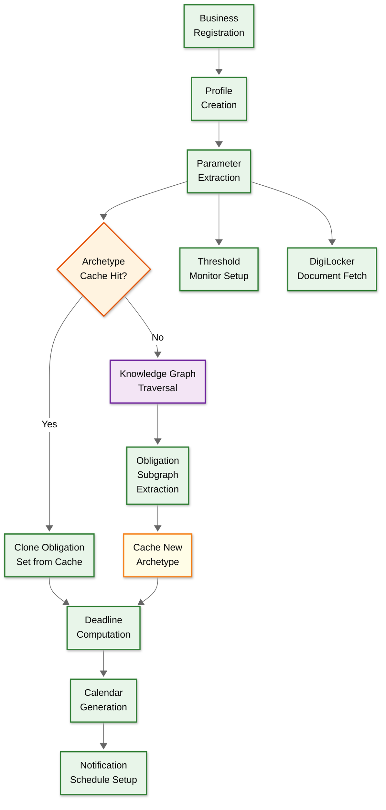
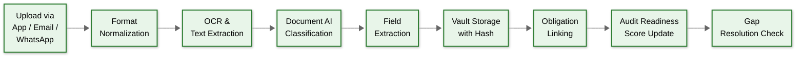
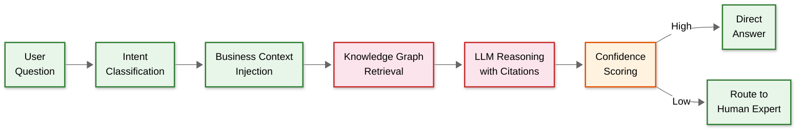
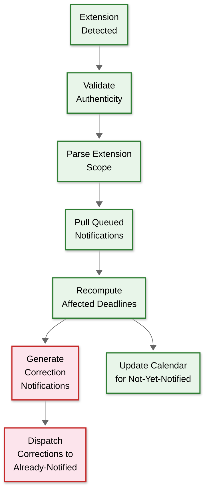
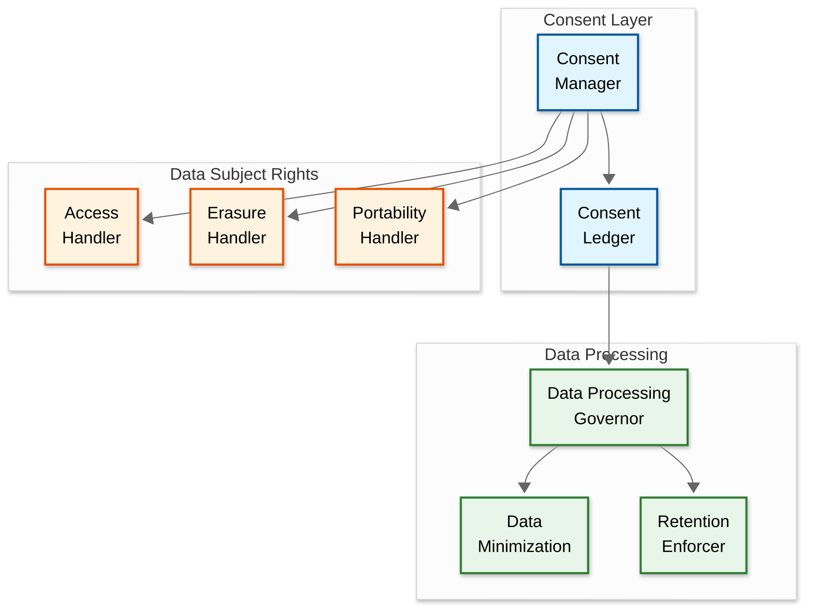

# 14.14 AI-Native Regulatory & Compliance Assistant for MSMEs — High-Level Design

## System Context

The regulatory compliance assistant sits at the intersection of three data flows: (1) regulatory content flowing in from government sources, (2) business data flowing in from MSME users and their integrated systems, and (3) compliance actions flowing out as notifications, pre-filled forms, and audit packs. The AI layer transforms raw regulatory text into personalized, actionable compliance obligations. A fourth flow—DPDP compliance for the platform's own data handling—creates the recursive obligation where the compliance tool must track its own compliance.

---

## High-Level Architecture

```mermaid
---
config:
  theme: neutral
  look: neo
---
flowchart TB
    subgraph Clients["Client Layer"]
        MA[Mobile App]
        WA[Web App]
        WH[WhatsApp Bot]
        EM[Email Ingestion]
        VA[Voice Assistant]
    end

    subgraph Gateway["API Gateway"]
        AG[API Gateway\nRate Limiting\nAuth\nConsent Check]
    end

    subgraph Core["Core Services"]
        BPS[Business Profile\nService]
        OMS[Obligation Mapping\nService]
        DCS[Deadline Computation\nService]
        NTS[Notification\nService]
        DMS[Document Management\nService]
        FAS[Filing Assistance\nService]
        ARS[Audit Readiness\nService]
        DAS[Dashboard &\nAnalytics Service]
        QAS[NL Compliance\nQ&A Service]
    end

    subgraph AI["AI & Intelligence Layer"]
        RIP[Regulatory\nIngestion Pipeline]
        NLP[NLP Extraction\n& Summarization]
        DCL[Document\nClassification]
        TRM[Threshold\nMonitoring]
        LLM[LLM Reasoning\nEngine]
    end

    subgraph Data["Data Layer"]
        RKG[(Regulatory\nKnowledge Graph)]
        BDB[(Business\nDatabase)]
        DVT[(Document\nVault)]
        TSE[(Search\nIndex)]
        NTQ[(Notification\nQueue)]
        CDL[(Compliance\nDeadline Store)]
        ARC[(Archetype\nCache)]
    end

    subgraph External["External Sources"]
        GOV[Government\nGazettes & Portals]
        ACC[Accounting\nSoftware]
        PAY[Payroll\nSystems]
        SMS[SMS Gateway]
        WAP[WhatsApp\nBusiness API]
        DLK[DigiLocker\nAPI]
    end

    MA & WA & WH & EM & VA --> AG
    AG --> BPS & OMS & DCS & NTS & DMS & FAS & ARS & DAS & QAS

    BPS --> BDB
    OMS --> RKG & BDB & ARC
    DCS --> CDL & RKG
    NTS --> NTQ
    DMS --> DVT & TSE
    FAS --> BDB & DVT
    ARS --> DVT & CDL & BDB
    DAS --> BDB & CDL & DVT
    QAS --> LLM & RKG & BDB

    RIP --> GOV
    RIP --> NLP --> RKG
    DCL --> DVT
    TRM --> BDB & OMS

    NTQ --> SMS & WAP & EM
    ACC & PAY & DLK --> AG

    classDef client fill:#e1f5fe,stroke:#01579b,stroke-width:2px
    classDef gateway fill:#fff3e0,stroke:#e65100,stroke-width:2px
    classDef service fill:#e8f5e9,stroke:#2e7d32,stroke-width:2px
    classDef ai fill:#fce4ec,stroke:#c62828,stroke-width:2px
    classDef data fill:#f3e5f5,stroke:#6a1b9a,stroke-width:2px
    classDef external fill:#e0f7fa,stroke:#00695c,stroke-width:2px

    class MA,WA,WH,EM,VA client
    class AG gateway
    class BPS,OMS,DCS,NTS,DMS,FAS,ARS,DAS,QAS service
    class RIP,NLP,DCL,TRM,LLM ai
    class RKG,BDB,DVT,TSE,NTQ,CDL,ARC data
    class GOV,ACC,PAY,SMS,WAP,DLK external
```

---

## Core Data Flows

### Flow 1: Regulatory Change Ingestion

```mermaid
---
config:
  theme: neutral
  look: neo
---
flowchart LR
    A[Government\nSource] --> B[Crawler /\nFeed Reader]
    B --> C[Document\nParser]
    C --> D[Change\nDetector]
    D --> E[NLP Obligation\nExtractor]
    E --> F[Impact\nAnalyzer]
    F --> G[Knowledge\nGraph Update]
    G --> H[Archetype\nCache Invalidation]
    H --> I[Affected\nBusiness Finder]
    I --> J[Notification\nDispatch]

    classDef process fill:#e8f5e9,stroke:#2e7d32,stroke-width:2px
    classDef external fill:#e0f7fa,stroke:#00695c,stroke-width:2px
    classDef data fill:#f3e5f5,stroke:#6a1b9a,stroke-width:2px
    classDef cache fill:#fffde7,stroke:#f57f17,stroke-width:2px

    class A external
    class B,C,D,E,F,I,J process
    class G data
    class H cache
```

**Steps:**
1. **Crawl/Ingest**: Scheduled crawlers fetch new documents from government gazette RSS feeds, ministry portals, and legislative databases. Frequency: every 15 minutes for high-priority sources (CBIC, GST Council, MCA), hourly for state gazettes, daily for municipal bodies.
2. **Parse**: Extract text from PDFs (including scanned documents via OCR), HTML pages, and structured feeds. Normalize into a common document format with metadata (source, date, jurisdiction, category). Handle multi-language sources with language detection and translation.
3. **Detect Changes**: Compare new documents against the existing corpus. For amendments, compute a semantic diff highlighting what changed (new sections, modified thresholds, deleted provisions). Flag structural changes vs. cosmetic reformatting.
4. **Extract Obligations**: NLP pipeline identifies obligation-bearing sentences ("Every registered person shall furnish..."), extracts entities (who, what, when, penalty), and maps to the regulatory knowledge graph's ontology. Confidence scoring determines auto-accept (≥0.85) vs. human review (0.7-0.85) vs. reject (<0.7).
5. **Analyze Impact**: Query the business database to find all businesses whose profiles match the new obligation's applicability criteria (jurisdiction, industry, size, activity). Compute impact severity (how many businesses affected, penalty magnitude).
6. **Invalidate Archetypes**: Identify which compliance archetypes are affected by the change. Mark affected archetype caches for recomputation.
7. **Propagate**: Asynchronous, priority-ordered propagation to affected businesses—nearest-deadline businesses first.
8. **Notify**: Generate plain-language summaries and dispatch to affected businesses via their preferred channels.

### Flow 2: Business Onboarding and Obligation Mapping

**Steps:**
1. **Register**: Business owner provides GST number, PAN, business type, employee count, turnover, locations, and industry. System auto-fetches additional data from MCA/GST portal APIs where available. DigiLocker integration fetches existing government-issued certificates.
2. **Extract Parameters**: Derive compliance-relevant parameters: jurisdiction set (states of operation), size classification (micro/small/medium), industry codes, applicable acts.
3. **Archetype Lookup**: Check if an existing archetype matches the business's parameters. 80% of businesses match an existing archetype → O(1) obligation set clone.
4. **Graph Traversal** (cache miss): Traverse the regulatory knowledge graph with business parameters to identify all applicable regulations and their specific obligations.
5. **Compute Deadlines**: For each obligation, compute the next N deadlines based on business parameters, jurisdiction rules, and calendar adjustments.
6. **Schedule Notifications**: Set up staged reminders for each deadline based on preparation complexity and penalty severity.

### Flow 3: Document Upload and Classification

### Flow 4: NL Compliance Q&A

### Flow 5: Government Deadline Extension Fast Path

---

## Key Design Decisions

### ADR-01: Graph Database for Regulatory Knowledge vs. Relational Database

**Status:** Accepted

**Context:** Regulations are inherently graph-structured: acts contain sections, sections are amended by notifications, obligations derive from sections with applicability criteria that reference business parameters.

**Decision:** Graph database for the regulatory knowledge graph; relational database for business profiles and transactional data.

**Rationale:** Queries like "find all obligations applicable to a manufacturing MSME with 25 employees in Maharashtra" require multi-hop traversal (industry → applicable acts → active sections → current obligations → jurisdiction filter). Graph databases express these queries naturally and perform them in O(traversal) time rather than the O(join) time of relational databases. However, business profiles, notification logs, and filing records are transactional and tabular—relational databases handle these better with ACID guarantees.

**Consequences:** Two database technologies to operate; graph database expertise required on team; obligation mapping queries are natural and fast; transactional data has strong consistency.

**Alternatives Rejected:**
- *All-relational with recursive CTEs*: Works for shallow hierarchies but becomes unwieldy for 5+ hop traversals; poor query expressiveness for graph patterns
- *All-graph*: Graph databases lack strong transaction support for business-critical writes like notification records and filing data

### ADR-02: Event-Driven Obligation Recomputation vs. Batch Recomputation

**Status:** Accepted

**Context:** When business parameters change or regulations are amended, the obligation set for affected businesses must be recomputed.

**Decision:** Event-driven recomputation triggered by business parameter changes and regulatory updates, with nightly batch as a safety net.

**Rationale:** Batch recomputation (nightly recalculation of all obligations for all businesses) is simpler but wasteful—99% of obligations don't change on any given day. Event-driven recomputation triggers only when a relevant event occurs: a business hires a new employee (potential threshold crossing), a regulation is amended (affected obligations change), or a government extends a deadline (calendar adjustment). This reduces compute by 100× while ensuring obligations are always current.

**Consequences:** Eventual consistency: after a regulatory change is ingested, there's a propagation delay (target: ≤ 5 minutes for high-priority, ≤ 2 hours for low-priority) before all affected businesses see updated obligations. Nightly batch catches any missed events.

### ADR-03: Content-Addressed Document Storage vs. Path-Based Storage

**Status:** Accepted

**Context:** Compliance documents have legal significance—a filing receipt must be provably unmodified years after upload.

**Decision:** Content-addressed storage where each document is identified by its cryptographic hash (SHA-256).

**Rationale:** Provides inherent tamper evidence: any modification changes the hash, making tampering detectable without additional infrastructure. Natural deduplication (same challan uploaded twice stored once). Enables integrity verification at any time by recomputing hash.

**Consequences:** Documents are immutable—corrections require uploading a new version rather than editing in place. This is desirable for compliance documents where the audit trail of versions is itself compliance-relevant. Dual-hash strategy (SHA-256 + SHA-3) prepares for future algorithm migration over 7-10 year document retention periods.

### ADR-04: Hierarchical Three-Level Jurisdiction Model

**Status:** Accepted

**Context:** Indian regulations cascade hierarchically: central acts define framework, states adopt with modifications, municipalities add local requirements.

**Decision:** Hierarchical three-level model: Central → State → Municipal with explicit edge types (override, additive, concurrent) in the knowledge graph.

**Rationale:** A flat tag model loses the hierarchical relationship and cannot represent that a state amendment overrides a central provision, or that a municipal requirement applies in addition to state-level requirements. The hierarchical model enables proper obligation resolution with three relationship types:
- **Override**: State amendment replaces central provision (e.g., state-specific working hour limits)
- **Additive**: State obligation exists independently of central (e.g., professional tax is state-only)
- **Concurrent**: Both central and state components apply simultaneously (e.g., CGST + SGST)

**Consequences:** Conflict resolution complexity; requires legal expertise to classify edge types; but enables correct obligation mapping that flat models cannot achieve.

### ADR-05: Compliance Archetype Caching

**Status:** Accepted

**Context:** Computing obligations for 3M businesses individually via graph traversal is O(B × V), which is infeasible.

**Decision:** Group businesses into compliance archetypes (unique combinations of industry, size bracket, jurisdiction set, and activity types) and cache obligation sets per archetype.

**Rationale:** 80% of MSMEs fall into ~200 distinct archetypes. Onboarding becomes O(1) cache lookup instead of O(V+E) graph traversal. Regulatory changes invalidate only affected archetypes, not all businesses.

**Consequences:** Archetype invalidation on popular-archetype regulation changes (e.g., GST affecting all archetypes) creates a thundering herd of recomputation. Mitigated by three-phase propagation: (1) recompute archetype, (2) update cache, (3) rate-limited propagation to businesses prioritized by deadline proximity.

### ADR-06: Multi-Channel Notification with Per-Deadline Priority Classification

**Status:** Accepted

**Context:** Not all deadlines are equal—missing a license renewal (criminal offense) vs. an informational filing (no penalty).

**Decision:** Deadline-severity-based notification strategy with four tiers.

**Rationale:**
| Tier | Criteria | Reminder Schedule | Channels |
|---|---|---|---|
| **Critical** | Criminal penalty or business shutdown risk | 90/60/30/15/7/3/1 day + escalation | WhatsApp + SMS + Email (parallel) |
| **High** | Financial penalty > ₹10,000/month | 60/30/7/1 day | Primary channel + SMS fallback |
| **Medium** | Financial penalty < ₹10,000 | 30/7/1 day | Primary channel only |
| **Low** | Informational, no penalty | 7/1 day | Email or in-app push |

**Consequences:** Prevents notification fatigue by differentiating critical from low-priority. Critical notifications sent on multiple channels simultaneously (higher cost but justified by penalty avoidance). Low-priority uses cheapest channels.

### ADR-07: LLM Integration for Regulatory Q&A

**Status:** Accepted

**Context:** MSMEs need answers to long-tail compliance questions that static FAQs cannot cover.

**Decision:** RAG (Retrieval-Augmented Generation) architecture: retrieve relevant regulation nodes from the knowledge graph, inject into LLM context, generate cited answers.

**Rationale:** Pure LLM hallucination risk is unacceptable for regulatory advice. Knowledge graph retrieval grounds the answer in specific sections and notifications. Confidence scoring routes low-confidence answers to human review.

**Consequences:** LLM inference cost (~$0.01-0.03 per query); latency overhead (2-5 seconds); requires citation validation pipeline; explicit disclaimer that answers are informational, not legal advice.

---

## Component Responsibility Matrix

| Component | Responsibilities | Key Dependencies | Scaling Characteristics |
|---|---|---|---|
| **Business Profile Service** | Business registration, parameter management, threshold tracking, accountant invitation, DPDP consent | Business DB, Obligation Mapping Service | Scales with registration volume; stateless compute |
| **Obligation Mapping Service** | Derive applicable obligations from business parameters, recompute on parameter or regulatory change, archetype caching | Regulatory Knowledge Graph, Business DB, Archetype Cache | Graph traversal on cache miss; cache hit is O(1) |
| **Deadline Computation Service** | Calculate personalized deadlines, handle holiday adjustments, government extensions, dependency ordering | Compliance Deadline Store, Knowledge Graph, Holiday Calendar | CPU-bound temporal computation; embarrassingly parallel per-business |
| **Notification Service** | Multi-channel delivery (WhatsApp, SMS, email, push), staged reminders, escalation, acknowledgment tracking, reconciliation | Notification Queue, SMS Gateway, WhatsApp API | I/O-bound; scales with channel throughput limits |
| **Document Management Service** | Upload ingestion, OCR, classification, vault storage, search indexing, tamper-evidence verification | Document Vault, Search Index, Document AI | GPU-bound for classification; storage-bound for vault |
| **Filing Assistance Service** | Form pre-fill, validation, filing-ready document generation, government portal integration | Business DB, Document Vault, external filing APIs | Stateless; scales with filing volume (spiky at month-end) |
| **Audit Readiness Service** | Gap analysis, readiness scoring, audit pack generation, compliance risk assessment | Document Vault, Deadline Store, Business DB | CPU-bound for gap analysis; I/O for pack assembly |
| **Dashboard & Analytics Service** | Compliance health score, upcoming deadlines, overdue items, regulatory change feed, role-based views | All data stores (read-only CQRS query path) | Read-heavy; cacheable with short TTL |
| **NL Compliance Q&A Service** | Natural-language question understanding, knowledge graph retrieval, LLM reasoning, citation generation | LLM Engine, Knowledge Graph, Business DB | GPU-bound for inference; ~5s latency budget |
| **Regulatory Ingestion Pipeline** | Source crawling, document parsing, change detection, NLP extraction, knowledge graph update | Government sources, NLP models, Knowledge Graph | Batch pipeline; scales with source count |
| **Threshold Monitoring** | Watch business parameters against regulatory thresholds, trigger obligation map updates, hysteresis tracking | Business DB, Obligation Mapping Service | Event-driven; low steady-state, spiky on bulk imports |

---

## Cross-Cutting Concerns

### DPDP Act Compliance (Platform's Own Obligations)

Every API call checks consent status before processing. The consent ledger is append-only and immutable. Data minimization enforces that only necessary data is retained for each processing purpose. The retention enforcer auto-deletes data when the statutory retention period expires and no active consent exists.

### Regulatory Intelligence Pipeline SLA Tiers

| Source Type | Crawl Frequency | Detection SLA | Example Sources |
|---|---|---|---|
| **Tier 1: Critical** | Every 15 min | ≤ 2 hours | CBIC notifications, GST Council decisions, MCA circulars |
| **Tier 2: High** | Hourly | ≤ 12 hours | State gazette notifications, labor department orders |
| **Tier 3: Standard** | Daily | ≤ 24 hours | Municipal body updates, minor regulatory amendments |
| **Tier 4: Archive** | Weekly | ≤ 72 hours | Judicial precedents, tribunal orders, historical amendments |

---

## Case Studies in Architecture Decisions

### Case Study: Extension Propagation Race (GST Filing, November 2024 Pattern)

**Scenario:** CBIC extends GSTR-3B deadline from Nov 20 to Nov 30, announced at 6:15 PM on Nov 19. The notification system has already pre-computed 2.8 million reminders ("File by tomorrow!") scheduled for 9 AM Nov 20.

**Without fast path:** 2.8 million users receive "file by tomorrow" at 9 AM when the deadline is actually Nov 30. Users who file immediately pay no penalty but waste effort. Users who panic and make errors in rushing create support tickets. Platform credibility suffers.

**With fast path (ADR implemented):**
1. 6:15 PM: CBIC publishes extension on gazette portal
2. 6:30 PM: Tier-1 crawler detects new document
3. 6:35 PM: NLP classifies as deadline extension, extracts scope (GSTR-3B, all taxpayers, Nov 30)
4. 6:40 PM: System pulls all 2.8M queued notifications referencing GSTR-3B Nov deadline
5. 6:45 PM: Deadlines recomputed, notifications regenerated with "Nov 30" date
6. 9:00 AM Nov 20: Users receive correct "File GSTR-3B by November 30" reminders

### Case Study: Threshold Crossing During Bulk Hiring

**Scenario:** A textile manufacturer in Gujarat hires 5 employees in a single week, crossing the 20-employee PF threshold and the 10-employee ESI threshold simultaneously.

**System response:**
1. Each employee addition event triggers threshold monitoring
2. At employee #10: ESI threshold crossed → new ESI obligations added → registration deadline computed (15 days from crossing)
3. At employee #20: PF threshold crossed → new PF obligations added → registration deadline computed (within 1 month)
4. Hysteresis tracking marks both as "permanently triggered" (no deactivation on headcount drop)
5. Business owner receives consolidated alert: "Two new compliance requirements triggered this week" with specific registration deadlines and document checklists
6. Calendar automatically adds PF monthly return obligations (15th of each month) and ESI half-yearly returns
