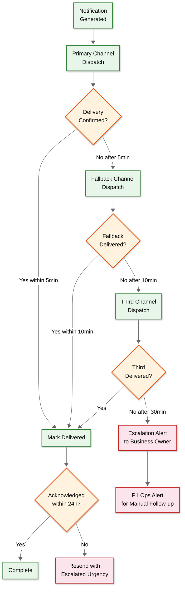

# 14.14 AI-Native Regulatory & Compliance Assistant for MSMEs — Deep Dives & Bottlenecks

## Deep Dive 1: Regulatory Text Parsing and Obligation Extraction

### The Problem

Indian regulatory text is among the most challenging NLP targets: a single GST notification may reference 5 prior notifications by number, amend specific sub-sections with nested proviso clauses, use archaic legal phrasing ("notwithstanding anything contained in..."), contain tables of rates with jurisdiction-specific applicability, and be published as a scanned PDF image of a typed document with government watermarks. The system must transform this unstructured legal text into structured obligation records (who must do what, by when, with what penalty) with ≥90% accuracy.

### Multi-Stage NLP Pipeline

```
Stage 1: Document Ingestion
├── PDF text extraction (native PDF)
├── OCR (scanned PDFs, images)
│   ├── Pre-processing: deskew, denoise, contrast enhancement
│   ├── Layout detection: identify tables, headers, body text
│   └── OCR engine with legal font training data
├── HTML scraping (government portals)
└── RSS/Atom feed parsing (gazette feeds)
         ↓
Stage 2: Document Classification
├── Classify: act | amendment | notification | circular | order | judgment
├── Extract metadata: jurisdiction, department, date, reference numbers
├── Determine priority: affects deadline → high; interpretive → medium; procedural → low
└── Detect deadline extensions (fast-path trigger)
         ↓
Stage 3: Reference Resolution
├── Identify references to other regulations ("Section 39(1) of CGST Act")
├── Resolve to knowledge graph node IDs
├── Build reference chain: this notification → amends → section → under act
├── Handle dangling references (referenced regulation not yet in graph)
└── Flag unresolved references for manual review
         ↓
Stage 4: Obligation Extraction (NER + Relation Extraction)
├── Entity extraction:
│   ├── OBLIGATED_ENTITY: "every registered person", "dealer with turnover > ₹5 crore"
│   ├── OBLIGATION: "shall furnish", "must file", "is required to obtain"
│   ├── DEADLINE: "on or before the 20th of the succeeding month"
│   ├── PENALTY: "₹50 per day", "12% per annum interest"
│   ├── THRESHOLD: "turnover exceeds ₹5 crore", "10 or more employees"
│   ├── JURISDICTION: "within the State of Maharashtra"
│   └── EXCEPTION: "other than a person referred to in section 14"
├── Relation extraction: who → must do what → by when → or else penalty → unless exception
└── Confidence scoring per extraction (reject < 0.7, flag 0.7-0.85, auto-accept ≥ 0.85)
         ↓
Stage 5: Knowledge Graph Integration
├── Create or update regulation nodes
├── Update edges (amends, supersedes, derives_from)
├── Validate graph consistency (no orphans, no circular amendments)
├── Recompute affected obligation instances
└── Trigger impact analysis pipeline
```

### Slowest part of the process: Ambiguous Applicability Clauses

Legal text frequently uses nested conditions with exceptions: "Every registered person, other than a person referred to in section 14 of the Integrated Goods and Services Tax Act, whose aggregate turnover in the preceding financial year exceeds five crore rupees, shall furnish..." Parsing this requires understanding: (1) the base entity ("every registered person"), (2) the exception ("other than a person referred to in section 14"), (3) the qualifying condition ("aggregate turnover exceeds five crore"), and (4) the time reference ("preceding financial year"). The NLP model must handle the compositionality of these clauses—the exception itself may have sub-conditions.

**Mitigation:** The system uses a two-pass approach. First pass: a fine-tuned language model extracts candidate obligations with broad applicability (over-inclusive). Second pass: a rule-based constraint parser narrows applicability by resolving references (section 14 → specific exemption criteria) and validating threshold conditions against the known regulatory schema. Human reviewers validate the final extraction for new regulation types; validated extractions become training data for model improvement.

### Slowest part of the process: Multi-Language Regulatory Sources

State governments publish regulations in regional languages (Hindi, Marathi, Tamil, etc.). The NLP pipeline must handle: (1) language detection, (2) translation to English for knowledge graph integration (the canonical graph uses English as the internal language), (3) preservation of original-language text for plain-language summaries to merchants in their preferred language.

**Mitigation:** Language-specific NER models for the 5 most common regulatory languages (Hindi, Marathi, Tamil, Bengali, Telugu); translation via fine-tuned models trained on legal text pairs. The knowledge graph stores both original-language text and English translation, with a flag indicating machine-translated vs. human-verified content. Translation errors in legal text carry higher risk than general translation—the system routes all translated obligations through human review before activation.

---

## Deep Dive 2: Deadline Computation Engine

### The Problem

Compliance deadlines are not simple fixed dates. They are computed from a combination of: the obligation's base rule (e.g., "20th of the succeeding month"), the business's parameters (e.g., quarterly filer vs. monthly filer), jurisdiction-specific variations (e.g., some states have different professional tax due dates), government-issued extensions (e.g., "due date extended to 30th for October 2025"), calendar adjustments (e.g., if the 20th falls on a Sunday, the deadline shifts to Monday), and dependency constraints (e.g., annual return cannot be filed before completing all monthly returns).

### Deadline Rule Schema

```
DeadlineRule {
    type: Enum [
        "fixed_day_of_month",       // e.g., GST: 20th of succeeding month
        "days_after_period_end",    // e.g., annual return: 60 days after FY end
        "fixed_annual_date",        // e.g., income tax: July 31 (or Sept 30 for audit)
        "event_relative",           // e.g., PF registration: within 30 days of hiring 20th employee
        "conditional"               // e.g., different dates based on turnover bracket
    ]

    day: Integer
    offset_months: Integer
    days: Integer
    event_type: String
    conditions: [...]

    // Calendar adjustment
    holiday_shift: "next_working_day" | "previous_working_day" | "none"
    administering_body: String     // determines which holiday calendar applies

    // Extension tracking
    extension_source: "government_notification"
    extension_field: "extended_due_date"
}
```

### Holiday Calendar Management

```
Holiday Calendar Layers:
├── National holidays (Republic Day, Independence Day, Gandhi Jayanti)
├── Bank holidays (RBI-declared, affects financial deadlines)
├── State-specific holidays (varies by state, affects state compliance)
├── Government office closures (affects registration and inspection deadlines)
├── Restricted holidays (some offices close, others don't — jurisdiction-specific)
└── Dynamic closures (COVID lockdowns, natural disasters, elections)
```

**Complexity:** A deadline that falls on a state holiday but not a national holiday: does it shift? The answer depends on whether the obligation is central (no shift) or state-administered (shifts). The system tags each obligation with its administering authority to determine which holiday calendar applies.

### Slowest part of the process: Government Extension Propagation

When the government extends a deadline (common before major filings), the extension notification must be: (1) detected within hours of publication, (2) parsed to identify which deadline is extended and by how long, (3) applied to all affected obligation instances across millions of businesses, and (4) notifications already sent ("file by Nov 20") must be followed up with correction ("deadline extended to Nov 30").

**Mitigation:** Extension detection runs on a high-priority fast path separate from the regular regulatory ingestion pipeline. Known extension patterns (specific text patterns in CBIC notifications) trigger automated processing. The deadline store supports an `extended_due_date` field that overrides the computed `due_date`. Correction notifications are auto-generated for any business that received a reminder referencing the original date. The fast path checks Tier-1 sources every 15 minutes (vs. hourly for regular ingestion).

### Slowest part of the process: Dependency Chain Computation

Some obligations form chains: monthly GST returns (12/year) → annual GST return (depends on all monthly returns being filed) → GST audit (depends on annual return). If a business hasn't filed their September GSTR-3B, the system must reflect this dependency: the annual return deadline is technically December 31, but the practical deadline is "whenever September filing is completed + processing time."

**Mitigation:** The deadline computation engine maintains a dependency DAG per business. When computing the "effective deadline" for an obligation, it checks all upstream dependencies. If any upstream obligation is incomplete, the downstream obligation's status shows as "blocked" with the reason ("Waiting for GSTR-3B September 2025"). The priority algorithm promotes blocked obligations' upstream dependencies to urgent status.

---

## Deep Dive 3: Multi-Jurisdiction Conflict Resolution

### The Problem

India's regulatory framework creates jurisdictional overlaps: central labor laws (Factories Act, PF Act) coexist with state-specific amendments and rules; environmental regulations have central standards (CPCB) and state enforcement (SPCB) with sometimes conflicting thresholds; professional tax is entirely state-administered with different rates, slabs, and due dates across 28 states. A business operating in 5 states must comply with up to 5 different professional tax regimes, 5 different shop establishment acts, and 5 different labor welfare fund requirements—while also complying with central regulations that may overlap or conflict.

### Three Relationship Types

| Type | Behavior | Example | Resolution |
|---|---|---|---|
| **Override** | State replaces central provision | Factories Act: central says 48hr/week, state amends to 45hr/week | Use state provision; mark central as overridden in this jurisdiction |
| **Additive** | State adds independently of central | Professional tax: entirely state-administered, no central equivalent | Create separate obligation instance per state |
| **Concurrent** | Both apply simultaneously | CGST + SGST on every transaction | Create linked obligation pair; both must be filed together |

### Jurisdiction Resolution Algorithm

```
function resolveJurisdictionConflicts(obligations):
    familyGroups = groupBy(obligations, o -> o.regulation_family)

    resolved = []
    for family, group in familyGroups:
        if group.hasSingleJurisdiction():
            resolved.addAll(group)
            continue

        centralObligations = group.filter(o -> o.jurisdiction_level == "central")
        stateObligations = group.filter(o -> o.jurisdiction_level == "state")

        for stateObl in stateObligations:
            supersedesEdge = knowledgeGraph.getEdge(
                stateObl.node_id, type="supersedes"
            )
            if supersedesEdge:
                centralObligations.remove(supersedesEdge.target_node_id)
                resolved.add(stateObl)
            else:
                resolved.add(stateObl)

        resolved.addAll(centralObligations)

        // Detect and resolve conflicts
        conflicts = detectConflicts(resolved)
        for conflict in conflicts:
            edgeType = knowledgeGraph.getJurisdictionRelType(
                conflict.central_node, conflict.state_node
            )
            if edgeType == "override":
                resolved.replace(conflict.central_node, conflict.state_node)
            elif edgeType == "additive":
                // Both remain; no conflict to resolve
                pass
            elif edgeType == "concurrent":
                resolved.linkPair(conflict.central_node, conflict.state_node)
            else:
                // Unknown relationship — apply most restrictive, flag for review
                mostRestrictive = pickMostRestrictive(conflict.obligations)
                resolved.replaceAll(conflict.obligations, mostRestrictive)
                conflictLog.add(conflict)

    return resolved
```

### Slowest part of the process: New State Expansion

When a business registers in a new state, the system must: (1) add all state-specific obligations, (2) re-evaluate central obligations that have state-specific implementations, (3) check for conflicts between the new state's rules and existing obligations, and (4) compute all new deadlines. For a medium enterprise with complex operations, expanding to a new state can add 30-50 new obligations.

**Mitigation:** State expansion is treated as a compound event that invalidates the business's archetype and triggers a full obligation recomputation. The system pre-computes a "state delta" for each archetype—the incremental obligations that would be added if that archetype expanded to each state—reducing the computation to a cache lookup plus delta application.

---

## Deep Dive 4: Notification Reliability for Penalty-Bearing Deadlines

### The Problem

A missed notification for a penalty-bearing deadline directly causes financial harm to the user. The system promises near-zero false negatives: if a business has a deadline, the responsible person must receive a reminder. This requires reliability guarantees that go beyond typical notification systems.

### Guaranteed Delivery Protocol for Critical Deadlines



### Slowest part of the process: Morning Notification Thundering Herd

80% of business users prefer morning delivery (9-11 AM IST). With 8M daily notifications and 80% concentrated in 2 hours, the system must dispatch 3.2M notifications in 7,200 seconds = ~444 notifications/second sustained. During deadline-heavy periods (month-end GST filings), this peaks at 2,000+/sec.

**Mitigation:** Pre-computation with staged dispatch. Notifications for the next 24 hours are pre-computed at 2 AM (off-peak). The dispatch queue is organized into time slots (9:00, 9:15, 9:30...) with load-balanced distribution to prevent exact-time spikes. WhatsApp Business API rate limits are respected via per-number throttling. SMS gateway connections are pre-warmed before the morning rush.

### Slowest part of the process: Channel-Specific Failure Modes

WhatsApp has a 24-hour messaging window—if the user hasn't interacted with the bot in 24 hours, the system must use a template message (pre-approved by WhatsApp). SMS delivery varies by carrier and region. Email has spam filter risks.

**Mitigation:** Per-channel health scores updated every 5 minutes. If WhatsApp delivery rate drops below 90%, the router shifts traffic to SMS. Template messages pre-approved for all notification types. Email deliverability maintained through DKIM/SPF/DMARC and reputation monitoring.

---

## Failure Modes

### Failure Mode 1: Knowledge Graph Corruption from Bad NLP Extraction

**Trigger:** NLP pipeline extracts incorrect obligation from an ambiguous notification—e.g., misidentifies "turnover exceeding ₹5 crore" as "₹5 lakh" due to OCR error in the scanned gazette.

**Impact:** Thousands of businesses receive incorrect obligation assignments. Businesses with ₹5-50 lakh turnover get monthly filing obligations they don't actually have. Businesses with ₹5+ crore turnover might miss their actual obligations.

**Detection:** Anomaly detection on obligation distribution shifts—if the number of businesses in a particular obligation category changes by >20% after a graph update, alert. Human review sampling catches systemic extraction errors.

**Recovery:** Versioned graph with rollback capability. The graph update protocol creates a snapshot before each batch of changes. On detection of corruption: (1) rollback to previous version, (2) recompute all obligations from the clean version, (3) send correction notifications to affected businesses, (4) quarantine the faulty notification for manual re-extraction.

**Prevention:** Dual-pass extraction (ML + rule-based validation). Threshold changes trigger mandatory human review. Canary rollout: apply new extractions to 1% of businesses first, monitor for anomalies, then propagate to all.

### Failure Mode 2: Notification Reconciliation Gap (Silent Failure)

**Trigger:** A bug in the notification generator's time-zone handling causes it to skip all obligations with deadlines on the 1st of the month (it computes the deadline as the previous month's last day).

**Impact:** No notifications generated for ~8% of all obligations (those with 1st-of-month deadlines). No error in logs because the code runs successfully—it simply doesn't find any matching obligations. Delivery rate stays at 100%. Every metric looks healthy.

**Detection:** The reconciliation engine (independent from the notification generator) runs hourly. It independently computes which notifications should exist by querying obligation instances directly, then compares against notification history. The mismatch between "obligations with upcoming deadlines" and "notifications in the queue" triggers a P1 alert.

**Recovery:** Auto-remediation: the reconciler generates and dispatches the missing notifications immediately with elevated urgency. Post-incident: fix the generator bug, validate all notifications for the affected period.

**Prevention:** The reconciler is architecturally independent—separate codebase, separate data path—specifically to catch bugs in the primary notification path. Monthly fire drill: intentionally suppress 0.01% of notifications to verify the reconciler catches them.

### Failure Mode 3: Archetype Cache Stampede on Major Regulatory Change

**Trigger:** A GST rate change notification affects all GST-registered businesses. All ~180 archetypes (out of 200) are invalidated simultaneously. Each archetype recomputation triggers obligation updates for hundreds of thousands of businesses.

**Impact:** Database write amplification as 2.5M+ obligation instances need updating. Deadline computation service overwhelmed. Dashboard queries slow due to write contention. New business registrations time out because archetype cache is empty.

**Detection:** Archetype invalidation count metric spikes. Database write latency p95 exceeds threshold. Queue depth for obligation recomputation grows unboundedly.

**Recovery:** Three-phase propagation limits blast radius: (1) recompute all archetypes (200 graph traversals, ~20 seconds total), (2) update cache immediately so new registrations work, (3) rate-limited async propagation to existing businesses (1,000/second, completing in ~42 minutes for 2.5M businesses).

**Prevention:** Pre-warm strategy: when a major regulatory change is detected (affects >50% of archetypes), the system pre-allocates write capacity and extends the propagation timeline. Dashboard queries serve stale-but-safe data during propagation (showing previous obligations, which are still valid until the effective date).

### Failure Mode 4: Government Source Format Change

**Trigger:** A state government revamps its gazette portal, changing URLs, HTML structure, and document naming conventions. The crawler fails silently—returns 200 OK but the page content is a "portal under maintenance" splash page.

**Impact:** No regulatory updates from that state for days/weeks. State-specific amendments, deadline extensions, and new obligations are missed. Businesses in that state operate on stale compliance data.

**Detection:** Source heartbeat monitoring: each government source has an expected update frequency. If no new documents are ingested from a source in 2× the expected frequency, alert fires. Content validation: the crawler checks that fetched content matches expected patterns (legal text structure, gazette formatting) and rejects splash pages.

**Recovery:** (1) Alert operations team for manual monitoring. (2) Cross-reference with third-party legal news aggregators to identify any missed regulations. (3) Once the portal stabilizes, run a catch-up crawl for the downtime period. (4) Manual data entry for any missed regulations identified through cross-referencing.

**Prevention:** Multiple source redundancy: monitor the same state's regulations from gazette, department portal, legal databases, and news aggregators. At least 2 independent sources per jurisdiction.

### Failure Mode 5: DPDP Consent Withdrawal Cascade

**Trigger:** A business owner withdraws consent for data processing. The platform must stop processing their data while retaining documents required by statutory retention rules (7+ years for tax documents).

**Impact:** Conflicting requirements: DPDP says delete, Income Tax Act says retain. The retention enforcer must selectively retain documents covered by statutory exceptions while deleting all other personal data.

**Detection:** Consent withdrawal triggers a cascade analysis that maps each data item to its retention justification (statutory vs. consent-based).

**Recovery:** The system maintains a "retention map" per document that tracks whether its retention is justified by consent, statutory requirement, or both. On consent withdrawal: (1) identify documents with only consent-based retention → schedule deletion, (2) identify documents with statutory retention → retain but restrict access, (3) delete all non-document personal data (preferences, analytics, derived data), (4) log the entire process for the platform's own audit trail.

---

## Race Conditions

### Race Condition 1: Concurrent Parameter Update and Regulatory Change

**Scenario:** A business updates their employee count from 9 to 10 (triggering ESI) at the exact moment a regulatory change modifies the ESI threshold from 10 to 15 employees.

**Problem:** If the parameter update's obligation recomputation runs before the regulatory change is applied, the business gets ESI obligations that should no longer apply (threshold is now 15, not 10). If the regulatory change applies first, the parameter update correctly skips ESI.

**Resolution:** Both events write to an event log with timestamps. The obligation recomputation service processes events in strict timestamp order per business. The recomputation acquires a per-business lock (distributed lock with 5-second TTL) ensuring only one recomputation runs at a time. After processing, it checks if newer events arrived during processing and re-runs if needed. The graph version is checked at computation start and re-checked at commit—if the version changed, the computation is retried.

### Race Condition 2: Extension Detection During Notification Dispatch Window

**Scenario:** The 2 AM pre-computation batch generates 2.8M notifications for Nov 20 GSTR-3B deadline. At 6:30 PM (Nov 19), an extension is detected. At 9 AM (Nov 20), the dispatch begins.

**Problem:** If the extension fast-path doesn't complete before 9 AM dispatch starts, some users receive the old "file by Nov 20" message while others receive the correct "file by Nov 30" message.

**Resolution:** The notification dispatch queue has a "gate" mechanism. Before dispatching any notification batch, the dispatcher checks a "pending corrections" flag for each obligation type. If a correction is in progress (extension detected but not yet fully propagated), the dispatcher holds the affected notifications for up to 2 hours. If the correction completes within the hold window, corrected notifications are dispatched. If not, a P1 alert fires and the operations team makes a manual call (dispatch original or wait longer).

### Race Condition 3: Document Upload During Audit Pack Generation

**Scenario:** A business owner uploads a missing GSTR-3B receipt while the audit readiness service is generating an audit pack for the same regulation and period.

**Problem:** The audit pack might be generated without the newly uploaded document. The readiness score might be computed as stale (gap still showing) even though the document was uploaded milliseconds ago.

**Resolution:** The audit pack generation takes a snapshot of the document set at the start of generation (optimistic concurrency with version check). If a new document is uploaded during generation, the generation is not interrupted—it completes with the snapshot. However, the readiness score is immediately recomputed asynchronously after the upload. If the audit pack was generated within the last 60 seconds and a new document was added, a "pack refresh recommended" flag is set. The next time the user views the audit pack, they see a prompt to regenerate with the latest documents.

### Race Condition 4: Archetype Cache Hit During Invalidation

**Scenario:** A regulatory change invalidates archetype A at time T1. A new business matching archetype A registers at time T2 (T2 > T1 but T2 < archetype recomputation completion at T3).

**Problem:** The new business might get the stale (pre-change) obligation set from the cache, missing the new regulation.

**Resolution:** The archetype cache entry has an `invalidated` boolean flag. On cache lookup, if `invalidated == true`, the system falls back to full graph traversal (cache miss path) rather than returning stale data. The business gets correct obligations from graph traversal. Once archetype recomputation completes at T3, subsequent registrations for that archetype hit the refreshed cache.

---

## Slowest part of the process Summary

| Slowest part of the process | Severity | Mitigation | Residual Risk |
|---|---|---|---|
| Regulatory text ambiguity | High | Two-pass extraction (ML + rule-based), human review for new patterns, canary rollout | ~10% of novel regulation structures need manual review |
| Government extension propagation delay | High | 15-minute fast-path crawl, notification dispatch gate, correction notifications | Edge cases with unusual notification formats may have 2-4 hour delay |
| Multi-language regulatory parsing | Medium | Language-specific NER models, translation pipeline, mandatory human review for translations | Less common languages (Assamese, Odia) have lower accuracy (~70% vs. 90%+) |
| Notification morning thundering herd | Medium | Pre-computation, staged dispatch, time-slot load balancing, channel pre-warming | Extreme peak (3 deadlines same day) may cause 5-10 minute delay |
| Dependency chain recomputation | Medium | Incremental DAG update, event-driven propagation, per-business lock | Deep chains (>5 levels) may take 10+ seconds to propagate |
| Knowledge graph consistency during updates | Medium | Versioned graph with snapshot isolation, canary rollout, validation pipeline | Eventual consistency window of 1-5 seconds during bulk regulatory updates |
| Archetype cache stampede | Medium | Three-phase propagation, pre-allocated write capacity, stale-but-safe reads | Full propagation can take 45+ minutes for universal regulatory changes |
| Government source format changes | Low | Multi-source redundancy, content validation, cross-reference with legal databases | New sources require manual integration; ~1-2 week lag for new portals |
| Document classification accuracy for non-standard formats | Low | Multi-model ensemble, human review routing for low confidence | Handwritten documents and unusual certificate formats: ~75% accuracy |

---

## Case Study: The November 2024 GST Filing Extension

**Context:** The CBIC extended the GSTR-3B filing deadline for October 2025 from November 20 to November 30, announced at 6:15 PM on November 19 via a gazette notification.

**System behavior with fast path:**
- 6:15 PM: Gazette published
- 6:30 PM: Tier-1 crawler picks up new document
- 6:32 PM: NLP classifies as deadline extension (confidence: 0.98)
- 6:33 PM: Extension scope parsed: GSTR-3B, all registered taxpayers, November 30
- 6:34 PM: 2.4M queued notifications for Nov 20 deadline pulled from dispatch queue
- 6:38 PM: Deadlines recomputed for all 2.4M affected obligation instances
- 6:45 PM: New notifications generated with corrected date
- 6:50 PM: 180K businesses that already received a "file by Nov 20" reminder → correction notification queued
- 9:00 AM Nov 20: Remaining businesses receive correct "file by November 30" reminder

**Key metrics:**
- Extension detection latency: 15 minutes (within 2-hour SLO)
- Correction notification coverage: 100% of previously-notified businesses
- Zero businesses received outdated deadline information on the morning of dispatch
