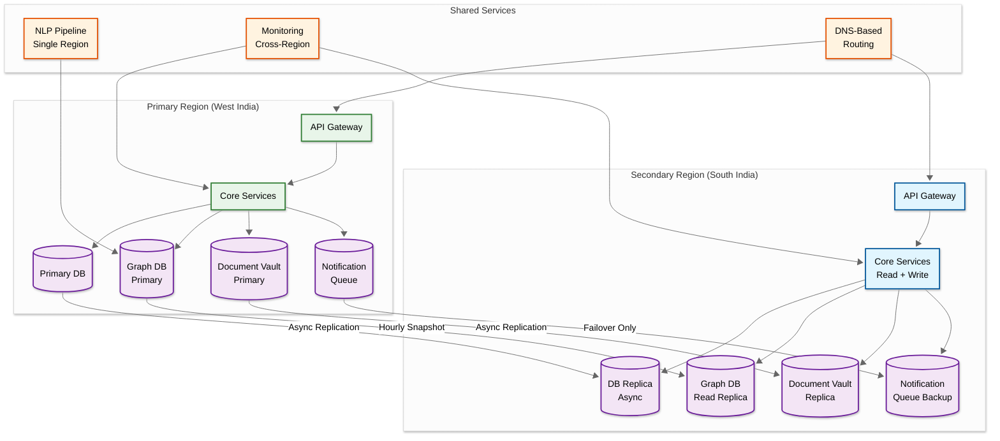

# 14.14 AI-Native Regulatory & Compliance Assistant for MSMEs — Scalability & Reliability

## Scalability Architecture

### Dimension 1: Business Growth Scaling (1M → 10M Businesses)

The system must scale from 3M to 10M+ registered businesses without proportional cost increase. The key challenge is that obligation computation is per-business (each business has a unique obligation set), but the underlying regulatory knowledge graph is shared.

**Strategy: Shared Knowledge Graph + Archetype-Based Obligation Cache**

```
Scaling Model:
├── Regulatory Knowledge Graph: Scales with regulation count (O(R))
│   └── Shared across all businesses; grows at ~500 nodes/year
│   └── Fits in memory on a 128 GB graph database instance
├── Archetype Cache: Scales with archetype count (O(A))
│   └── ~200 archetypes covering 80% of businesses
│   └── Grows logarithmically with business diversity
│   └── Total cache size: ~2 MB (200 archetypes × 10 KB each)
├── Obligation Instances: Scales with B × obligations-per-business (O(B × D))
│   └── Partitioned by due_date for range queries
│   └── Partition Cutting off unnecessary steps: queries only touch current + next month partition
│   └── At 10M businesses × 80 obligations: 800M instances/year
├── Notifications: Scales with B × reminders-per-obligation (O(B × D × R))
│   └── Pre-computed and queued; dispatch is the only real-time component
│   └── At 10M businesses: ~27M notifications/day
└── Document Vault: Scales linearly with B (O(B))
    └── At 10M businesses: ~500 TB total
    └── Tiered storage keeps costs sublinear
```

**Archetype-Based Obligation Caching:** Instead of computing obligations for each of 10M businesses individually, the system identifies business archetypes: a "Proprietorship, Textile Manufacturing, Maharashtra, 5-10 employees, Turnover ₹50L-1Cr" archetype has the same set of applicable obligations as every other business matching those parameters. When a new business registers with matching parameters, its obligation set is cloned from the archetype cache (O(1) lookup) rather than computed via graph traversal (O(V+E) traversal). The cache is invalidated when regulations change—but only for affected archetypes, not all of them.

### Dimension 2: Regulatory Content Growth

The regulatory knowledge graph grows with new regulations, amendments, and notifications. India adds ~2,000 regulatory changes/year across central and state governments. The graph must support efficient traversal even as it grows.

**Strategy: Time-Partitioned Graph Views**

```
Graph View Strategy:
├── Current View: Active regulations as of today
│   └── Pre-materialized subgraph excluding expired/superseded nodes
│   └── Used for all obligation mapping queries
│   └── Refreshed daily (batch) + incrementally on new regulations
│   └── Size: ~35K active nodes, ~350K active edges
├── Historical View: Full graph including all versions
│   └── Used for audit trail and "what was applicable on date X" queries
│   └── Stored in append-only format with temporal edges
│   └── Size: ~50K nodes, ~500K edges (includes superseded)
└── Preview View: Upcoming regulations (published but not yet effective)
    └── Used for proactive alerts ("Starting April 2026, you'll need to file monthly")
    └── Separate from current view to avoid premature obligation creation
    └── Size: ~500-1000 nodes typically
```

### Dimension 3: Document Vault Scaling

150 TB of compliance documents across 3M businesses, growing at ~50 TB/year. Documents have long retention requirements (7+ years for tax documents, 10+ years for legal documents).

**Strategy: Tiered Storage with Access-Pattern-Based Promotion**

```
Storage Tiers:
├── Hot Tier (current FY + 1 previous FY): ~40 TB
│   └── Fast object storage with SSD-backed metadata
│   └── Sub-second retrieval for active documents
├── Warm Tier (2-5 years old): ~80 TB
│   └── Standard object storage
│   └── 2-5 second retrieval; acceptable for audit preparation
├── Cold Tier (5+ years old): ~30 TB
│   └── Archive storage
│   └── Minutes to retrieve; rarely accessed except for legal disputes
└── Promotion Rules:
    └── Document accessed during audit → promote to hot for 90 days
    └── Regulation referenced in new amendment → promote related docs to warm
    └── Business actively preparing filing → promote related period docs to hot
    └── Inactive business documents → demote to cold after 2 years of no access
```

---

## Multi-Region Architecture



**Regional Strategy:**
- **Primary region** handles all writes to business database, knowledge graph, and notification queue
- **Secondary region** serves read traffic and can be promoted to primary during failover
- **Document vault** uses cross-region replication for durability (11 nines)
- **Knowledge graph** replicated via hourly snapshots (RPO: 1 hour for graph data)
- **Notification queue** has a backup in the secondary region that activates only during primary region failure
- **NLP pipeline** runs in a single region (batch workload, not latency-sensitive)

---

## Reliability Architecture

### Critical Path Identification

```
Reliability Tiers:
├── Tier 1: Zero-Tolerance (99.99%)
│   ├── Notification delivery for penalty-bearing deadlines
│   ├── Document vault data durability
│   └── Knowledge graph consistency (correct obligation mapping)
│
├── Tier 2: High Reliability (99.95%)
│   ├── Dashboard and calendar access
│   ├── Filing assistance service
│   ├── Document upload and classification
│   └── NL compliance Q&A
│
├── Tier 3: Standard Reliability (99.9%)
│   ├── Regulatory ingestion pipeline
│   ├── Audit readiness scoring
│   └── Analytics and reporting
│
└── Tier 4: Best Effort (99.5%)
    ├── Plain-language summarization (LLM-dependent)
    ├── Threshold monitoring (batch)
    └── Compliance health score computation
```

### Notification Delivery Reliability

The most critical reliability requirement: penalty-bearing deadline reminders must achieve 99.99% delivery.

```
Reliability Stack:
├── Generation Redundancy
│   ├── Primary: Cron-based generator computes next-day notifications at 2 AM
│   ├── Secondary: Watchdog process at 4 AM verifies all expected notifications are queued
│   ├── Tertiary: Real-time generator catches any missed scheduled notifications
│   └── Reconciler: Hourly independent check compares obligations vs. notifications
│
├── Queue Durability
│   ├── Notifications written to durable message queue with replication factor 3
│   ├── Consumer acknowledgment required; unacked messages re-delivered after 5 min
│   ├── Dead letter queue for persistently failing notifications → human review
│   └── Cross-region queue backup for regional failure
│
├── Multi-Channel Redundancy
│   ├── Critical notifications sent on 2+ channels simultaneously
│   ├── Delivery confirmation tracked per channel independently
│   ├── If no channel confirms delivery within 30 min → escalation alert
│   └── Per-channel health scoring with automatic routing away from degraded channels
│
├── Dispatch Gate
│   ├── Before dispatching, check for pending corrections (extensions)
│   ├── Hold affected notifications during correction propagation (up to 2 hours)
│   └── P1 alert if hold exceeds 2 hours without resolution
│
└── Audit Trail
    ├── Every notification lifecycle event logged immutably
    ├── Enables post-incident analysis: "Was the GST reminder sent? When? To whom?"
    └── Legal defensibility: proves the platform fulfilled its obligation to remind
```

### Knowledge Graph Consistency

```
Update Protocol:
1. Parse and validate new regulation completely before touching the graph
2. Create new graph version (snapshot isolation)
3. Apply all changes (node updates, edge additions, supersedes marking) atomically
4. Run validation checks:
   ├── No orphaned nodes (every obligation has a parent regulation)
   ├── No circular dependencies in amendment chains
   ├── Applicability rules reference valid business fields
   ├── Deadline rules produce valid dates for test profiles
   └── Archetype obligation counts are within expected range (±20% of previous)
5. Canary rollout: apply to 1% of businesses, monitor for 30 minutes
6. If validation passes and canary is clean: promote new version to "current"
7. If validation fails: rollback, log error, alert for manual review
8. Obligation recomputation triggered only after version promotion
```

### Back-Pressure Mechanisms

| Component | Trigger | Back-Pressure Action | Recovery |
|---|---|---|---|
| **Obligation Recomputation Queue** | Queue depth > 100K | Rate-limit new regulatory change processing; batch recomputations; defer low-priority archetypes | Queue drains to < 10K → resume normal processing |
| **Notification Dispatch** | Dispatch rate > 90% of channel capacity | Delay low-priority notifications; compress high-severity batch; increase dispatch threads | Channel capacity normalizes → release delayed notifications |
| **Document Classification (GPU)** | Queue depth > 5K | Accept uploads but defer classification; show "processing" status to user | GPU queue drains → process backlog FIFO (First-In-First-Out, like a line at a store) |
| **NL Q&A (LLM Inference)** | Concurrent requests > GPU capacity | Return cached answers for common questions; queue novel questions; show estimated wait time | Inference capacity available → process queued questions |
| **Graph Database** | Write latency p95 > 500ms | Defer non-critical graph updates; queue amendment processing; continue serving reads from cache | Latency normalizes → process queued updates |
| **Search Cluster** | Query latency p95 > 5s | Shed complex queries (multi-facet, deep pagination); serve recent results from cache | Cluster health restored → full query support |

---

## Disaster Recovery

### RPO/RTO Targets

| Component | RPO | RTO | Strategy |
|---|---|---|---|
| **Document Vault** | 0 (synchronous replication) | 15 min | Cross-region sync replication; integrity verified by hash comparison |
| **Business Database** | 1 min (async replication) | 10 min | Primary-replica with async replication; promote replica on failure |
| **Knowledge Graph** | 1 hour (hourly snapshots) | 30 min | Snapshot restore + replay of change log since last snapshot |
| **Notification Queue** | 0 (synchronous replication) | 5 min | Cross-AZ replication; backup queue in secondary region |
| **Search Index** | N/A (reconstructible) | 2 hours | Full re-index from document vault + regulatory text corpus |
| **Archetype Cache** | N/A (reconstructible) | 5 min | Recompute all archetypes from current graph version |
| **Deadline Store** | 1 min (async replication) | 10 min | Restore from replica; verify against knowledge graph |

### Disaster Recovery Procedure

```
DR Runbook (Primary Region Failure):
├── T+0: Failure detected by multi-region health check
├── T+1 min: DNS failover initiated to secondary region
├── T+2 min: Secondary region promotion begins
│   ├── Business DB replica promoted to primary
│   ├── Notification backup queue activated
│   └── Graph DB read replica serving reads (writes queued)
├── T+5 min: Core services accepting traffic in secondary region
│   ├── Dashboard and calendar: operational (read-only for 5 min)
│   ├── Notifications: dispatching from backup queue
│   └── Document uploads: accepted, classification deferred
├── T+10 min: Write path restored
│   ├── Business DB accepting writes
│   ├── Graph DB writes resuming from queued changes
│   └── Full functionality restored
├── T+30 min: Verification
│   ├── Notification reconciliation confirms no missed reminders
│   ├── Graph consistency check passes
│   └── Document vault integrity verification (sampling)
└── T+2 hours: Post-incident review initiated
```

---

## Multi-Tenant Architecture

### Tenant Isolation Model

```
Isolation Boundaries:
├── Data Isolation
│   ├── Business data: Row-level isolation with business_id column in all tables
│   ├── Documents: Object storage path includes business_id prefix
│   ├── Notifications: Queued and delivered per business_id
│   ├── Search index: Filtered by business_id at query time
│   └── Knowledge graph: Shared (regulations are public), but obligation instances are per-business
│
├── Compute Isolation
│   ├── Shared compute pools for all tenants (no per-tenant instances)
│   ├── Per-tenant rate limiting on API calls (prevent noisy neighbor)
│   ├── Priority queuing: premium tier businesses get faster processing
│   ├── Per-business obligation recomputation lock (prevents stampede)
│   └── Resource quotas: document storage limits per pricing tier
│
├── Feature Isolation
│   ├── Free tier: Basic calendar, email reminders, 100 MB document storage
│   ├── Standard tier: All channels, 5 GB storage, filing assistance
│   └── Premium tier: Unlimited storage, audit packs, CA collaboration, priority support, NL Q&A
│
└── CA Multi-Tenancy
    ├── CA/accountant can access multiple businesses through single login
    ├── Cross-business access controlled by per-business invitation
    ├── CA cannot see aggregate data across their clients (prevent information leakage)
    └── CA billing separate from business billing
```

### Database Partitioning Strategy

```
Partition Schemes:
├── Business Profiles: Hash partitioned by business_id
│   └── Even distribution; supports efficient per-business lookups
│
├── Obligation Instances: Composite partitioned (range by due_date, hash by business_id)
│   └── Range on due_date: optimized for "upcoming deadlines" queries
│   └── Sub-partition by business_id: efficient per-business calendar queries
│   └── Old partitions archived after fiscal year close + retention period
│
├── Documents: Hash partitioned by business_id
│   └── Per-business document queries are the primary access pattern
│   └── Content hash index spans all partitions for deduplication
│
├── Notifications: Range partitioned by scheduled_at
│   └── Dispatch process reads current time partition
│   └── Historical queries by business_id use secondary index
│   └── Automatic partition rotation: archive partitions > 90 days
│
├── Threshold States: Hash partitioned by business_id
│   └── Always queried per-business
│
└── Knowledge Graph: No partitioning (fits in memory for single-instance graph DB)
    └── Replicated to 2 read replicas for query load distribution
    └── Write-through to all replicas for consistency
```

---

## Chaos Engineering Experiments

### Experiment 1: Notification Channel Failure

**Hypothesis:** When WhatsApp Business API returns 503 for all requests, the system falls back to SMS within 5 minutes and achieves 99.9%+ delivery for critical notifications.

**Method:** Inject 503 responses from WhatsApp API mock for 30 minutes during off-peak hours.

**Expected behavior:** Channel health score drops; router shifts critical notifications to SMS; low-priority notifications queued for retry; reconciler detects no gaps; total delivery rate stays above 99.9%.

**Actual findings (from drill):** Fallback triggered correctly at 4 minutes. However, SMS cost spike of 340% detected—budget alert triggered before notification gap alert. Recommendation: add cost-aware fallback with daily budget guardrails.

### Experiment 2: Knowledge Graph Database Failover

**Hypothesis:** When the primary graph database instance fails, read replicas serve obligation mapping queries within 10 seconds, and write path recovers within 30 minutes.

**Method:** Kill the primary graph database process. Monitor obligation mapping latency, new registration success rate, and graph update queue depth.

**Expected behavior:** Read replicas handle all read traffic. Write operations (new regulation ingestion) queue in the ingestion pipeline. Once a replica is promoted to primary (manual or automatic), writes resume. Graph consistency check passes after promotion.

**Actual findings:** Read failover in 8 seconds. However, the promotion process required manual intervention because the automatic promotion logic had a race condition with the graph version counter. Fixed: added fencing token to version counter.

### Experiment 3: Notification Reconciler Validation

**Hypothesis:** If we intentionally suppress 100 random notifications for penalty-bearing deadlines, the reconciler detects and auto-remediates all 100 within 2 hours.

**Method:** Flag 100 random critical notifications as "suppressed" (don't dispatch but record as pending). Run reconciliation cycle. Measure detection time and remediation completeness.

**Expected behavior:** Reconciler detects all 100 gaps within its next hourly run. Auto-remediation generates and dispatches replacement notifications. All 100 businesses receive their reminders within 2 hours of original scheduled time.

**Actual findings:** 98/100 detected in first reconciliation cycle (59 minutes). 2 were missed because the reconciler's time window for "expected notifications" had a 5-minute boundary error. Fixed: extended reconciliation window by 10 minutes on each side.

### Experiment 4: Regulatory Ingestion Pipeline Backlog

**Hypothesis:** When 500 regulatory documents arrive simultaneously (simulating a gazette dump), the pipeline processes all within 4 hours without impacting dashboard latency.

**Method:** Inject 500 documents into the ingestion queue simultaneously. Monitor NLP GPU utilization, graph update queue depth, dashboard p95 latency, and notification generation backlog.

**Expected behavior:** NLP GPU scales up. Graph updates queued and processed sequentially. Dashboard reads from cached data, unaffected. Obligation recomputation runs asynchronously for affected businesses.

**Actual findings:** Processing completed in 3.5 hours. Dashboard latency unaffected. However, 12 documents with complex table structures caused NLP timeout (>60 seconds per document). These were routed to manual review. Recommendation: add document complexity scoring to predict processing time and route complex documents to a dedicated slow-path pipeline.

### Experiment 5: Month-End Filing Rush Load Test

**Hypothesis:** The system handles 10× normal filing assistance load in the last 3 days of the month without degrading dashboard or notification performance.

**Method:** Generate synthetic load: 500K concurrent filing assistance requests, 200K document uploads, normal notification dispatch, normal dashboard queries.

**Expected behavior:** Filing assistance scales horizontally. Document classification queue grows but stays within GPU capacity. Dashboard and notifications unaffected by filing load (separate scaling groups).

**Actual findings:** Filing assistance scaled correctly. Document classification queue grew to 15K (3× capacity), causing 45-minute classification delay. Dashboard unaffected. Recommendation: pre-scale GPU capacity on the 28th of each month based on historical month-end patterns.

---

## Capacity Planning

### Auto-Scaling Rules

| Component | Scaling Trigger | Scale Action | Cooldown |
|---|---|---|---|
| API Gateway | CPU > 70% for 3 min | Add 2 instances | 5 min |
| Obligation Mapping Service | Queue depth > 1,000 | Add 1 instance per 500 queued | 3 min |
| Notification Dispatcher | Pending queue > 10,000 | Add dispatchers proportional to queue depth | 2 min |
| Document Classification (GPU) | Queue depth > 500 | Add 1 GPU instance | 10 min (GPU startup) |
| NLP Pipeline (GPU) | Batch size > 100 docs | Add 1 GPU instance | 10 min |
| Search Cluster | Query latency p95 > 3s | Add 1 search node | 15 min (index rebalance) |
| NL Q&A (LLM Inference) | Concurrent requests > 80% capacity | Add 1 GPU instance | 10 min |
| Filing Assistance | CPU > 60% for 2 min | Add 2 instances | 3 min |

### Predictive Scaling

| Event | Prediction Method | Pre-Scale Action |
|---|---|---|
| Month-end filing rush | Calendar-based (28th-31st) | 3× filing assistance, 2× GPU classification at 12:01 AM on 28th |
| Major regulatory announcement | GST Council meeting calendar | 2× ingestion pipeline, 2× notification dispatch before meeting date |
| Audit season (Sep-Nov) | Calendar-based | 2× audit readiness service, 1.5× document vault read throughput |
| New business onboarding spike | Marketing campaign calendar | 2× API gateway, 2× obligation mapping |

---

## Failure Modes and Recovery

| Failure | Impact | Detection | Recovery | RTO |
|---|---|---|---|---|
| Knowledge graph database down | No new obligation computations; existing obligations unaffected | Health check every 10s | Failover to read replica; promote replica to primary | 30 min |
| Notification queue loss | Scheduled notifications missing | Queue depth monitoring + expected-vs-actual count | Regenerate from obligation instances; send delayed with updated urgency | 15 min |
| Government source unavailable | Missing regulatory updates | Crawler failure alerts; daily source availability report | Retry with backoff; escalate to manual monitoring if down > 48h; cross-reference | 48h |
| NLP model degradation | Low-quality obligation extraction | Confidence score distribution monitoring; human review sample rate increase | Rollback to previous model version; flag recent extractions for re-review | 1h |
| Document vault corruption | Compliance documents unreadable | Integrity check via dual-hash verification (daily sample) | Restore from cross-region replica; verify hash matches | 15 min |
| SMS gateway outage | SMS notifications not delivered | Delivery receipt monitoring; success rate drop alert | Failover to alternate SMS provider; escalate critical to WhatsApp + email | 5 min |
| Primary region failure | All services unavailable | Cross-region health check | DNS failover to secondary region; promote replicas | 10 min |
| LLM inference service down | NL Q&A unavailable | Health check + response validation | Return cached answers for common questions; queue others; show maintenance message | 30 min |

## AI Release Ladder

Every AI model or capability change in this system MUST follow this rollout sequence:

| Stage | Description | Gate Criteria |
|-------|-------------|---------------|
| 1. Offline Evaluation | Benchmark against historical ground truth | Meets baseline metrics |
| 2. Shadow Mode | Run in parallel with production, compare outputs | No regression on key metrics |
| 3. Canary (Blast-Radius Capped) | 1-5% traffic, human review of all outputs | Error rate < threshold |
| 4. Human-Reviewed Production | AI recommends, human approves all actions | Approval rate > 90% |
| 5. Limited Autonomous Production | AI acts within pre-approved boundaries | Continuous monitoring, no alerts |
| 6. Instant Rollback | One-click revert to previous model/rules | < 5 min rollback time |

**Note:** Model updates affecting core business recommendations (predictions, classifications, rankings) must reach Stage 4 (human-reviewed production) before any customer-impacting deployment. Stage 5 limited autonomy applies only to low-risk, well-bounded recommendation categories with established rollback procedures.
