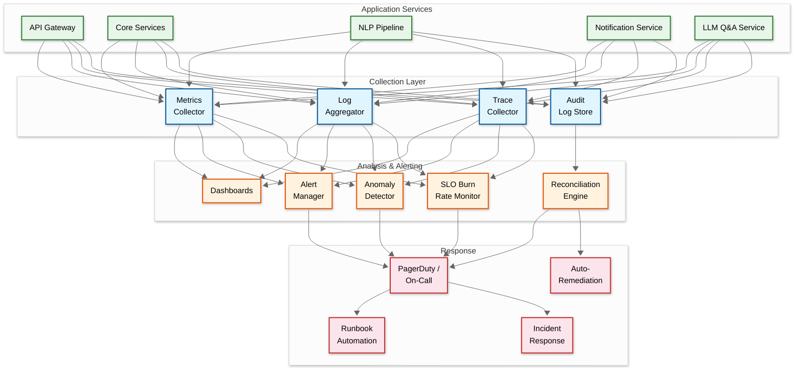

# 14.14 AI-Native Regulatory & Compliance Assistant for MSMEs — Observability

## Observability Philosophy

The regulatory compliance assistant has a unique observability requirement: the system's failures are not immediately visible to users (a missed notification doesn't show an error—it simply doesn't appear), but the consequences are severe (financial penalties). Traditional observability focuses on detecting system failures; this system must also detect *absence of expected behavior*—the notification that should have been sent but wasn't, the regulation that was published but not ingested, the deadline that was computed incorrectly. The platform must observe not just "is it working?" but "is it working correctly for every single business?"

---

## Key Metrics Framework

### Business-Critical Metrics (Golden Signals)

| Metric | Type | Description | Alert Threshold |
|---|---|---|---|
| `notification.delivery_rate` | Ratio | Notifications successfully delivered / total scheduled | < 99.9% over 1 hour → P1 |
| `notification.false_negative_rate` | Ratio | Penalty-bearing deadlines with no reminder sent / total penalty deadlines | > 0 in 24 hours → P1 |
| `notification.correction_coverage` | Ratio | Extension corrections sent / businesses that received original incorrect notification | < 100% within 4 hours of extension → P1 |
| `obligation.mapping_accuracy` | Ratio | Obligations confirmed correct / total obligations (sampled) | < 95% weekly sample → P2 |
| `regulatory.ingestion_lag` | Gauge | Time since last successful ingestion from each government source | > 48 hours for any Tier-1 source → P2 |
| `regulatory.extension_detection_lag` | Gauge | Time from extension publication to system detection | > 2 hours for Tier-1 sources → P1 |
| `deadline.computation_correctness` | Ratio | Deadlines matching manual verification / total verified (sampled) | < 98% weekly sample → P2 |
| `document.classification_accuracy` | Ratio | Correctly classified documents / total classified (human-verified sample) | < 90% weekly → P3 |
| `audit_readiness.score_accuracy` | Ratio | Score matches manual assessment / total assessed (sampled) | < 85% monthly sample → P3 |
| `archetype.cache_hit_rate` | Ratio | Obligation lookups served from archetype cache / total lookups | < 70% → P3 (indicates archetype drift) |
| `qa.citation_accuracy` | Ratio | Q&A answers with verified citations / total answers | < 90% → P2 |

### System Health Metrics

| Metric | Type | Description | Alert Threshold |
|---|---|---|---|
| `api.latency_p95` | Histogram | API response time | > 2s for dashboard; > 5s for filing |
| `api.error_rate` | Ratio | 5xx responses / total requests | > 1% over 5 minutes → P2 |
| `graph.query_latency_p95` | Histogram | Knowledge graph traversal time | > 500ms → P3 |
| `graph.version` | Counter | Current knowledge graph version | No increment in 48 hours → P3 |
| `document.upload_success_rate` | Ratio | Successful uploads / attempted | < 99% over 1 hour → P2 |
| `queue.notification_depth` | Gauge | Pending notifications in dispatch queue | > 50,000 → P2 (indicates dispatch lag) |
| `nlp.extraction_confidence_avg` | Gauge | Average confidence score of NLP extractions | < 0.75 over 24 hours → P3 |
| `vault.integrity_check_failures` | Counter | Documents failing dual-hash verification | > 0 → P1 |
| `archetype.invalidation_count` | Gauge | Number of archetypes currently invalidated | > 100 → P2 (mass invalidation event) |
| `threshold.state_transitions` | Counter | Threshold crossings detected per hour | Spike > 10× baseline → P3 (bulk import or data error) |
| `llm.inference_latency_p95` | Histogram | Q&A response generation time | > 8s → P3 |
| `llm.hallucination_rate` | Ratio | Responses failing citation verification / total responses | > 5% → P2 |

---

## Observability Architecture



---

## Absence Detection: Monitoring for What Didn't Happen

### Expected Notification Reconciliation

The most critical observability challenge: detecting that a notification that should have been sent was not sent. This cannot be detected by monitoring error rates.

```
Reconciliation Process (runs hourly):
├── Step 1: Query all obligation instances with due_date within reminder window
│   └── e.g., due_date between now+6 days and now+8 days → should have 7-day reminder
│
├── Step 2: For each obligation, check notification history
│   └── Expected: notification_record exists with matching obligation_id and stage
│
├── Step 3: Identify gaps (obligations with expected reminder but no notification)
│   └── Gap = obligation that should have a reminder but doesn't
│
├── Step 4: Classify gaps
│   ├── Expected gap: obligation status = completed (no reminder needed)
│   ├── Expected gap: obligation status = not_applicable (waived)
│   ├── Expected gap: obligation status = blocked (upstream dependency)
│   ├── Expected gap: extension pending (notifications held at dispatch gate)
│   └── Unexpected gap: obligation is active and upcoming but no reminder → ALERT
│
├── Step 5: For unexpected gaps
│   ├── Severity = critical if penalty_amount > ₹10,000
│   ├── Severity = high if penalty_amount > ₹1,000
│   └── Auto-remediation: generate and send the missing notification immediately
│
└── Step 6: Log reconciliation results
    └── Metric: notification.reconciliation_gap_count (should be 0)
    └── Gap detected → P1 alert + auto-remediation + incident ticket
```

### Regulatory Ingestion Completeness

Detecting that a government source published a new regulation but the system didn't ingest it:

```
Completeness Monitoring:
├── Source Heartbeat: Each monitored government source has an expected update frequency
│   ├── Tier-1 (CBIC, MCA): At least 1 update per week
│   ├── State gazettes: At least 1 update per 2 weeks
│   └── If no update detected in 2× expected frequency → alert for manual check
│
├── Cross-Reference: Compare ingested documents against third-party legal databases
│   ├── Weekly reconciliation against legal news aggregators
│   ├── Monthly reconciliation against professional legal services
│   └── Any regulation present in cross-reference but missing from system → P2 alert
│
├── Community Signal: If 10+ businesses report the same "missing regulation" → P2 alert
│
└── Extension-Specific Monitoring
    ├── GST Council meeting dates tracked in advance
    ├── Post-meeting: expect notifications within 24-48 hours
    └── If meeting occurred but no notifications ingested in 72 hours → P2 alert
```

---

## Distributed Tracing

### Trace Spans for Key Workflows

**Regulatory Change Ingestion Trace:**
```
trace: regulatory_change_ingestion
├── span: source_crawl           [source_id, document_count, crawl_tier]
├── span: document_parse         [format, page_count, ocr_required, language]
├── span: change_detect          [change_type, diff_size, is_extension]
├── span: nlp_extraction         [obligation_count, avg_confidence, rejected_count]
├── span: graph_update           [nodes_added, edges_added, version, validation_result]
├── span: archetype_invalidation [archetypes_invalidated, businesses_affected]
├── span: impact_analysis        [businesses_affected, priority_distribution]
├── span: canary_rollout         [canary_size, anomalies_detected]
└── span: notification_dispatch  [notification_count, channels, correction_count]
```

**Obligation Mapping Trace:**
```
trace: obligation_mapping
├── span: profile_load           [business_id, parameter_version]
├── span: archetype_check        [archetype_hash, cache_hit, cache_age]
├── span: graph_traversal        [nodes_visited, obligations_found] (cache miss only)
├── span: conflict_resolution    [conflicts_found, conflicts_resolved, edge_types]
├── span: deadline_computation   [deadlines_computed, adjustments_applied, extensions_checked]
├── span: threshold_evaluation   [thresholds_checked, crossings_detected]
└── span: calendar_update        [events_created, events_updated, events_blocked]
```

**Notification Delivery Trace:**
```
trace: notification_delivery
├── span: generation             [notification_type, severity, obligation_id]
├── span: dispatch_gate_check    [held, hold_reason] (conditional)
├── span: channel_selection      [selected_channel, preference_source, health_score]
├── span: dispatch               [channel, provider, message_id, template_id]
├── span: delivery_confirmation  [delivered, latency_ms, delivery_status]
├── span: acknowledgment         [acknowledged, time_to_ack_ms]
├── span: fallback               [triggered, fallback_channel, retry_count] (conditional)
└── span: reconciliation_check   [reconciled, gap_detected] (hourly)
```

---

## Dashboard Design

### Operational Dashboard: Regulatory Pipeline Health

```
┌─────────────────────────────────────────────────────────────────┐
│  REGULATORY PIPELINE HEALTH                     [Last 24 hours] │
├─────────────────────┬───────────────────────────────────────────┤
│  Sources Monitored  │  Sources Healthy: 487/502 (97%)           │
│                     │  Last Ingestion: 23 min ago               │
│                     │  Stale Sources (>48h): 3 ⚠                │
│                     │  Extension Fast-Path: Active ✓            │
├─────────────────────┼───────────────────────────────────────────┤
│  Documents Ingested │  Today: 347  │  Parsed: 341  │  Failed: 6│
│                     │  Avg Parse Time: 4.2s  │  OCR: 89 (26%)  │
│                     │  Extensions Detected: 1 (propagated in 18m)│
├─────────────────────┼───────────────────────────────────────────┤
│  NLP Extraction     │  Obligations Extracted: 42                │
│                     │  Avg Confidence: 0.87                     │
│                     │  Auto-accepted: 35 │ Human Review: 5      │
│                     │  Rejected: 2                              │
├─────────────────────┼───────────────────────────────────────────┤
│  Impact Analysis    │  Businesses Affected: 145,000             │
│                     │  Archetype Invalidations: 12              │
│                     │  Propagation: 98% complete                │
│                     │  Notifications Triggered: 290,000         │
├─────────────────────┼───────────────────────────────────────────┤
│  Knowledge Graph    │  Version: 4,847                           │
│                     │  Nodes: 51,234  │  Edges: 523,891        │
│                     │  Last Update: 2 hours ago                 │
│                     │  Canary Status: Clean ✓                   │
└─────────────────────┴───────────────────────────────────────────┘
```

### Notification Reliability Dashboard

```
┌─────────────────────────────────────────────────────────────────┐
│  NOTIFICATION RELIABILITY                       [Last 24 hours] │
├─────────────────────┬───────────────────────────────────────────┤
│  Delivery Rate      │  Overall: 99.97%  │  Critical: 99.99%    │
│                     │  SLO: 99.99% │ Budget: 72% remaining     │
├─────────────────────┼───────────────────────────────────────────┤
│  Reconciliation     │  Last Run: 14 min ago                     │
│                     │  Gaps Found: 0 ✓                          │
│                     │  Auto-Remediated: 0 │ Manual: 0           │
├─────────────────────┼───────────────────────────────────────────┤
│  Channel Health     │  WhatsApp: 99.8% ✓                       │
│                     │  SMS: 99.5% ✓                             │
│                     │  Email: 99.9% ✓                           │
│                     │  Push: 98.2% ✓                            │
├─────────────────────┼───────────────────────────────────────────┤
│  Dispatch Queue     │  Pending: 1,234  │  Processing: 890/s    │
│                     │  Held (extension gate): 0                 │
│                     │  Dead Letter: 3 (under review)            │
├─────────────────────┼───────────────────────────────────────────┤
│  Corrections        │  Extensions Today: 0                      │
│                     │  Corrections Sent: 0                      │
│                     │  Correction Coverage: N/A                 │
└─────────────────────┴───────────────────────────────────────────┘
```

### Business-Facing Dashboard: Compliance Health

```
┌─────────────────────────────────────────────────────────────────┐
│  COMPLIANCE HEALTH                     Sharma Textiles Pvt Ltd  │
├─────────────────────┬───────────────────────────────────────────┤
│  Overall Score      │  ████████░░ 78/100  (risk-weighted)       │
│                     │  ▲ +3 from last week                      │
├─────────────────────┼───────────────────────────────────────────┤
│  This Week Priority │  1. GSTR-3B filing (₹50/day penalty)     │
│                     │  2. PF challan (₹5K late fee)             │
│                     │  3. Trade license renewal (start prep)     │
├─────────────────────┼───────────────────────────────────────────┤
│  Upcoming (7 days)  │  3 filings  │  1 renewal  │  0 overdue   │
│                     │  Highest risk: GSTR-3B (due in 5 days)    │
├─────────────────────┼───────────────────────────────────────────┤
│  Audit Readiness    │  GST: 78%  │  PF: 92%  │  ESI: 85%      │
│                     │  Gap: Missing GSTR-3B receipt (Mar 2025)  │
├─────────────────────┼───────────────────────────────────────────┤
│  Threshold Watch    │  Employees: 45/no threshold risk          │
│                     │  Turnover: ₹85L (GST audit at ₹1Cr)      │
├─────────────────────┼───────────────────────────────────────────┤
│  Recent Changes     │  1 regulatory change affects you          │
│                     │  GST filing frequency change (effective    │
│                     │  Apr 2026) — tap to view details          │
└─────────────────────┴───────────────────────────────────────────┘
```

---

## Alerting Strategy

### Alert Severity and Escalation

| Severity | Response Time | Examples | Escalation Path |
|---|---|---|---|
| **P1 - Critical** | 5 min acknowledge, 30 min mitigate | Notification delivery failure; document vault integrity issue; zero notifications dispatched for > 30 min; reconciliation gap for critical deadline; extension not propagated within 2 hours | On-call engineer → Engineering lead → CTO |
| **P2 - High** | 15 min acknowledge, 2 hour mitigate | API error rate > 1%; regulatory source stale > 48h; obligation mapping queue backlog > 1 hour; archetype mass invalidation; LLM hallucination rate > 5% | On-call engineer → Team lead |
| **P3 - Medium** | 1 hour acknowledge, 24 hour resolve | NLP confidence degradation; document classification accuracy drop; search latency degradation; archetype cache hit rate below 70% | Logged for next business day; auto-ticket created |
| **P4 - Low** | Next business day | Single source crawl failure; minor UI latency spike; non-critical batch job delay | Dashboard notification only |

### Alert Deduplication and Suppression

```
Deduplication Rules:
├── Same alert from same source within 5 min → suppress duplicate
├── Related alerts (graph update failed → obligation recomputation failed → notification missing)
│   → group as single incident with root cause identified
├── Known maintenance window → suppress non-critical alerts
├── Government portal scheduled downtime → suppress source availability alerts
├── Archetype mass invalidation → consolidate into single "mass regulatory change" alert
└── Month-end filing rush → raise thresholds for latency alerts (expected load)
```

---

## Incident Playbooks

### Playbook 1: Notification Reconciliation Gap Detected

**Trigger:** `notification.reconciliation_gap_count > 0` for penalty-bearing deadlines

```
Incident Response:
├── Step 1 (Immediate): Auto-remediation dispatches missing notification
│   └── Critical deadline → send on all channels simultaneously
│   └── Log: "Auto-remediated gap for obligation {id}, business {id}"
│
├── Step 2 (5 min): On-call engineer investigates root cause
│   └── Check notification generator logs for the obligation
│   └── Check if obligation was in "blocked" or "waived" status (false gap)
│   └── Check if business consent was withdrawn (legitimate gap)
│
├── Step 3 (30 min): Determine blast radius
│   └── Query: how many other obligations from the same time window are affected?
│   └── Run ad-hoc reconciliation for last 24 hours
│   └── If systemic: trigger full reconciliation cycle immediately
│
├── Step 4 (2 hours): Root cause fix
│   └── Identify the bug (time-zone issue? query parameter? concurrency race?)
│   └── Deploy fix with rollback plan
│   └── Run verification: manually check 10 random obligations
│
└── Step 5 (24 hours): Post-incident review
    └── Document root cause, blast radius, detection time, remediation time
    └── Update reconciler if it missed any gaps
    └── Add regression test for this specific failure mode
```

### Playbook 2: Knowledge Graph Corruption Detected

**Trigger:** Graph validation failure after regulatory update, OR anomaly in obligation distribution (>20% shift in any category)

```
Incident Response:
├── Step 1 (Immediate): Halt graph version promotion
│   └── Current version remains active (no corrupt data served)
│   └── New regulatory updates queued, not applied
│
├── Step 2 (15 min): Assess corruption scope
│   └── Diff new version against current: which nodes changed?
│   └── How many archetypes affected?
│   └── How many businesses would receive incorrect obligations?
│
├── Step 3 (30 min): Decision point
│   └── If corruption is isolated (1-2 nodes): manual fix + re-validate
│   └── If corruption is systemic: rollback to previous version
│   └── If rollback: revert all obligation changes from the corrupted version
│
├── Step 4 (2 hours): Fix and re-apply
│   └── Manually review the source regulatory document
│   └── Correct the NLP extraction or graph update
│   └── Re-run validation pipeline
│   └── Canary rollout to 1% before full deployment
│
└── Step 5 (24 hours): Post-incident
    └── Add this document pattern to NLP test suite
    └── Review canary rollout thresholds
    └── Consider adding this failure mode to chaos engineering suite
```

### Playbook 3: Government Extension Missed

**Trigger:** Business reports they received incorrect deadline notification, AND extension exists on government portal that system didn't detect

```
Incident Response:
├── Step 1 (Immediate): Manual verification of extension
│   └── Check government portal directly
│   └── Confirm extension scope (which obligation, which taxpayers, new date)
│
├── Step 2 (15 min): Emergency extension injection
│   └── Manually create extension record in deadline store
│   └── Trigger extension fast-path processing
│   └── Pull all queued notifications referencing the original deadline
│
├── Step 3 (1 hour): Correction notifications
│   └── Identify all businesses that received incorrect notification
│   └── Dispatch correction notification on all channels
│   └── Dashboard updated with correct deadline
│
├── Step 4 (4 hours): Investigate detection failure
│   └── Why didn't the crawler pick up the extension?
│   └── Source format change? New URL? Portal downtime?
│   └── Fix crawler and verify with test crawl
│
└── Step 5 (24 hours): Add source redundancy
    └── Add backup source for this jurisdiction's extensions
    └── Cross-reference with legal news feeds
    └── Consider social media monitoring (CBIC Twitter) for early detection
```

---

## SLO Monitoring and Error Budgets

### SLO Burn Rate Alerts

| SLO | Target | Fast Burn Alert (1h) | Slow Burn Alert (24h) |
|---|---|---|---|
| Notification delivery | 99.99% | > 1% failure in 1 hour | > 0.05% failure in 24 hours |
| Dashboard availability | 99.9% | > 5% error in 1 hour | > 0.5% error in 24 hours |
| Obligation accuracy | 98% | N/A (weekly sample) | > 5% error in weekly sample |
| Document vault durability | 11 nines | Any integrity failure | Monthly integrity audit |
| Extension detection | ≤ 2 hours | Any Tier-1 extension > 2h | N/A |
| Q&A citation accuracy | 90% | N/A (batch evaluation) | > 15% error in daily sample |

### Error Budget Policy

```
Error Budget Actions:
├── Budget > 50% remaining: Normal development velocity
├── Budget 25-50% remaining: Increased testing for deployments; no risky changes
├── Budget 10-25% remaining: Deployment freeze for non-critical changes; focus on reliability
├── Budget < 10% remaining: All engineering on reliability; incident review for every error
└── Budget exhausted: Feature freeze until budget replenished; post-mortem required
```

---

## Logging Strategy

### Log Categories and Retention

| Category | Content | Retention | Storage |
|---|---|---|---|
| **Security audit logs** | Authentication events, data access, permission changes, consent actions | 3 years | Immutable append-only store |
| **Compliance action logs** | Notifications sent, filings assisted, documents classified, Q&A interactions | 7 years | Time-series database with archival |
| **System operation logs** | API requests, service errors, performance data | 90 days | Log aggregation platform |
| **NLP pipeline logs** | Extraction results, confidence scores, model versions, human review outcomes | 1 year | Searchable log store |
| **LLM interaction logs** | Questions, context, answers, citations, confidence | 30 days | Per-business isolated store (DPDP) |
| **Reconciliation logs** | Gap detection results, auto-remediation actions, verification outcomes | 1 year | Append-only with alerting integration |
| **Debug logs** | Detailed function-level traces | 7 days | Local + sampling to central |

### Structured Log Format

```
{
    "timestamp": "2025-11-18T09:15:23.456Z",
    "service": "notification-service",
    "level": "INFO",
    "trace_id": "abc123",
    "span_id": "def456",
    "business_id": "uuid",
    "event": "notification.dispatched",
    "attributes": {
        "obligation_id": "uuid",
        "channel": "whatsapp",
        "severity": "critical",
        "reminder_stage": 3,
        "due_date": "2025-11-25",
        "template_id": "gst_reminder_7day",
        "archetype_id": "uuid",
        "extension_checked": true,
        "gate_held": false
    }
}
```

---

## AI Observability Standards

This system's AI components MUST implement the observability patterns defined in:
- **[3.25 AI Observability & LLMOps](../3.25-ai-observability-llmops-platform/00-index.md)** — trace model, token accounting, prompt-completion linkage
- **[3.26 AI Model Evaluation & Benchmarking](../3.26-ai-model-evaluation-benchmarking-platform/00-index.md)** — eval taxonomy, regression testing, human review sampling

### Required AI-Specific Metrics
- Model prediction confidence distribution
- Human override rate (target: track, not minimize)
- AI recommendation acceptance rate by decision type
- Drift detection alerts (data drift + concept drift)
- Cost per AI-assisted decision
