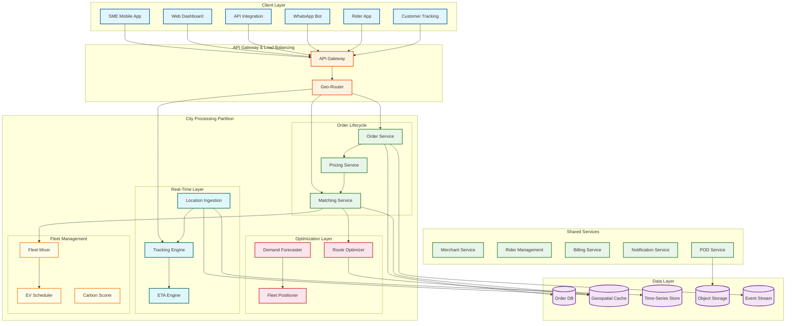
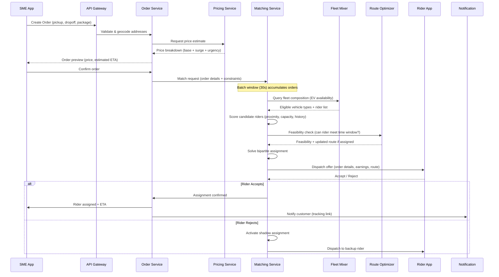
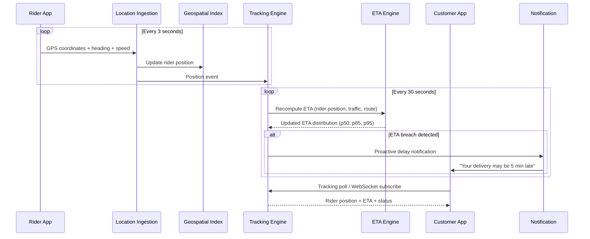
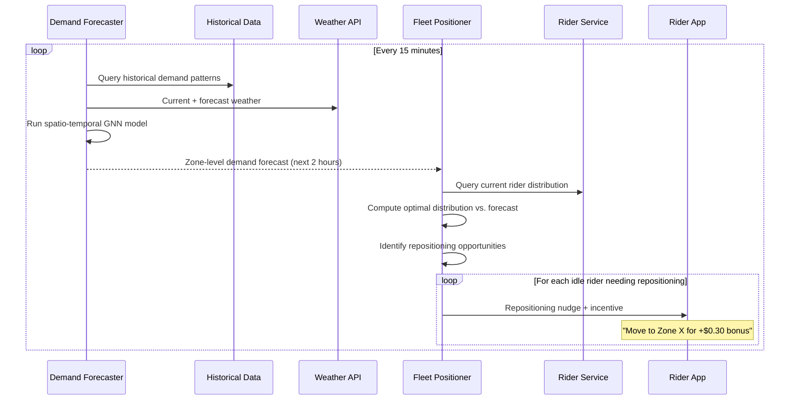

# 14.15 AI-Native Hyperlocal Logistics & Delivery Platform for SMEs — High-Level Design

## Architecture Overview

The platform follows an event-driven, geo-partitioned microservices architecture where each city operates as an independent processing unit with its own matching engine, route optimizer, and demand forecaster. Cross-city concerns (merchant accounts, billing, analytics aggregation) run on shared services. The design principle is "optimize locally, aggregate globally"—latency-critical operations (matching, tracking, routing) execute within a city partition, while business intelligence and platform analytics span all cities.

---

## Core Data Flows

### Flow 1: Order Creation → Rider Assignment

### Flow 2: Real-Time Tracking and ETA Updates

### Flow 3: Demand Forecasting → Fleet Pre-Positioning

### Flow 4: Batch Route Re-Optimization on Order Insertion

```mermaid
sequenceDiagram
    participant MS as Matching Service
    participant RO as Route Optimizer
    participant EE as ETA Engine
    participant RA as Rider App
    participant NS as Notification

    MS->>RO: Insert Order C into Rider's active route (A, B)
    RO->>RO: Enumerate insertion positions (O(n²))
    RO->>RO: Check time windows for all orders
    RO->>RO: Compute best insertion cost

    alt Insertion feasible
        RO->>RO: Run ALNS improvement (2s budget)
        RO-->>MS: New route: A-pickup → C-pickup → A-drop → C-drop → B-pickup → B-drop
        MS->>EE: Recompute ETAs for orders A, B, C
        EE-->>MS: Updated ETAs (A: +3min, B: no change, C: 25min)
        MS->>RA: Updated route + navigation
        MS->>NS: Notify A's customer of ETA update (if > 5 min change)
    else Insertion infeasible
        RO-->>MS: INFEASIBLE — assign Order C to new rider
        MS->>MS: Route C to fresh matching cycle
    end
```

---

## Key Design Decisions

### ADR-01: Geo-Partitioned Processing (City as Unit of Deployment)

**Choice**: Each city runs its own matching engine, route optimizer, and demand forecaster as independent processing units. Cross-city state is not shared for real-time operations.

**Rationale**: Hyperlocal delivery is inherently bounded by geography—a rider in Mumbai is never relevant to an order in Delhi. Geo-partitioning eliminates cross-city coordination overhead, allows independent scaling (larger cities get more compute), enables city-specific model tuning (traffic patterns in Bangalore differ fundamentally from Hyderabad), and provides blast radius isolation (a failure in one city's matching engine does not affect other cities).

**Trade-off**: Platform-level analytics (total orders across all cities, fleet utilization comparison) requires asynchronous aggregation from city partitions, adding 5-15 minute lag to platform-wide dashboards.

**Alternatives considered**: (1) Single global cluster with zone-based routing — rejected due to cross-zone coordination latency and single point of failure. (2) Region-based partitioning (North, South, East, West) — rejected as too coarse; cities within the same region have no interaction for real-time operations.

### ADR-02: Batch Matching with 30-Second Windows (Not Greedy Dispatch)

**Choice**: Orders are accumulated over 30-second windows and assigned to riders via global bipartite optimization, rather than immediately dispatching each order to the nearest available rider.

**Rationale**: Greedy dispatch (assign each order to nearest rider as it arrives) produces locally optimal but globally suboptimal assignments. Consider: Order A arrives at time T, and Rider 1 (1 km away) is assigned. Order B arrives at T+5s, and the only available rider is Rider 2 (4 km away). If the system had waited 5 seconds, it could have assigned Rider 1 to Order B (which was closer to Rider 1's eventual position) and Rider 2 to Order A, reducing total dead miles by 40%. Batch matching consistently reduces total fleet dead miles by 15-25% vs. greedy dispatch.

**Trade-off**: 30-second batch window adds latency to rider assignment. For express orders, the window is reduced to 10 seconds with a smaller candidate pool.

**Alternatives considered**: (1) Greedy dispatch with periodic rebalancing — produces 15-25% worse total dead miles. (2) 60-second batch window — better optimization but unacceptable SME wait time. (3) Continuous optimization (solve on every arrival) — computationally expensive and gains diminish rapidly after 20-second accumulation.

### ADR-03: CQRS for Order Lifecycle

**Choice**: Separate write path (order creation, state transitions, assignments) from read path (tracking queries, status checks, analytics).

**Rationale**: Write operations are bursty and require strong consistency (an order cannot be assigned to two riders). Read operations are 100× more frequent (thousands of tracking polls per minute per city) and can tolerate 1-3 second staleness. CQRS allows the write path to use a transactional database optimized for consistency, while the read path uses a geospatially-indexed cache optimized for low-latency location queries.

**Alternatives considered**: (1) Single read-write database — tracking poll load would overwhelm write transaction throughput. (2) Separate databases per query type — CQRS is exactly this pattern, formalized.

### ADR-04: Event-Sourced Order Log as Source of Truth

**Choice**: Every order state change is recorded as an immutable event in an append-only log. The current order state is a materialized view derived from replaying events.

**Rationale**: Delivery orders pass through 10+ state transitions (created → priced → confirmed → matching → assigned → pickup_en_route → at_pickup → picked_up → in_transit → near_dropoff → delivered/failed). Each transition carries metadata (timestamps, rider location, decision context). Event sourcing provides: complete audit trail for dispute resolution, ability to replay events for analytics and model training, natural integration with stream processing for real-time tracking, and crash recovery by replaying from the last checkpoint.

**Trade-off**: Increased storage (event log + materialized views), slightly higher write latency (event must be persisted before acknowledgment), and eventual consistency for read views.

### ADR-05: Probabilistic ETAs (Distribution, Not Point Estimate)

**Choice**: The ETA engine produces a probability distribution (p50, p85, p95) rather than a single time estimate. Customer-facing ETA uses p85; rider-facing target uses p50; SLO monitoring uses p95.

**Rationale**: Point-estimate ETAs create a false sense of precision. A delivery predicted at "32 minutes" could realistically take 28-40 minutes due to traffic variance, building access time, and rider speed differences. By maintaining the full distribution, the system can make calibrated promises (p85 for customers), set realistic targets (p50 for riders), and detect systemic issues (when p95 - p50 spread widens, something is degrading route predictability).

### ADR-06: Contraction Hierarchy with Real-Time Speed Overlay

**Choice**: Use pre-computed contraction hierarchies for road-network shortest-path queries, with a lightweight real-time speed overlay updated every 5 minutes.

**Rationale**: The matching engine requires 10,000+ road-network distance queries per batch window. Standard Dijkstra takes 5-50ms per query (too slow). Contraction hierarchies answer queries in < 1ms but encode static edge weights. The two-level design separates the structural graph (which changes rarely—road network topology) from the speed layer (which changes continuously—traffic conditions). The CH provides structure; the speed overlay provides recency. This achieves both sub-millisecond query latency and near-real-time traffic accuracy.

**Trade-off**: CH rebuild takes 2-5 minutes during which queries use the previous version (up to 1 hour stale on structural changes). Accepted because road topology changes are rare (road closures, construction).

### ADR-07: Mixed Fleet with EV-First Assignment Policy

**Choice**: When multiple vehicle types are feasible for an order, prefer EV riders for deliveries under 5 km, weighted by remaining battery range and proximity to charging infrastructure.

**Rationale**: EV-first policy serves three purposes: (1) sustainability targets and carbon reporting for enterprise SME customers, (2) lower operating cost per km for EV riders (no fuel), which translates to lower delivery fees, (3) regulatory incentives in cities with clean-vehicle zones. The assignment constraint is that the EV's remaining range must cover the order round-trip plus a 20% safety margin to reach the nearest charging station.

**Trade-off**: EV-first may increase dead miles slightly (nearest ICE rider skipped in favor of farther EV rider), but the 5-km cap limits this to < 500m additional distance on average.

---

## Component Responsibilities

| Component | Responsibility | Key Interfaces |
|---|---|---|
| **Order Service** | Order lifecycle management, state machine, validation | Receives from API Gateway; emits events to Event Stream; calls Pricing and Matching |
| **Pricing Service** | Dynamic price computation per zone per urgency tier | Reads supply-demand state from Geospatial Cache; returns price breakdown to Order Service |
| **Matching Service** | Batch rider-order assignment, shadow assignment computation | Reads rider positions from Geospatial Index; calls Route Optimizer for feasibility; sends dispatch offers to Rider App |
| **Route Optimizer** | CVRPTW solver for multi-stop routes, insertion feasibility | Reads road network graph from Geospatial Cache; returns optimized visit sequence and estimated times |
| **Demand Forecaster** | Spatio-temporal demand prediction per micro-zone | Reads from Historical Data and Weather API; outputs zone-level forecasts to Fleet Positioner |
| **Fleet Positioner** | Optimal rider distribution computation, repositioning nudges | Reads forecasts from Demand Forecaster, current positions from Geospatial Index; sends nudges via Rider App |
| **Location Ingestion** | High-throughput GPS stream processing, geofencing | Receives from Rider App; writes to Time-Series Store and Geospatial Index; emits geofence events |
| **Tracking Engine** | Real-time delivery tracking state, WebSocket management | Reads from Geospatial Index; serves tracking clients; triggers ETA recomputation |
| **ETA Engine** | Probabilistic ETA computation using ensemble model | Reads rider position, route, traffic state; outputs ETA distributions |
| **Fleet Mixer** | Vehicle-type selection, EV preference scoring, range validation | Called by Matching Service; returns eligible vehicle types and fleet-specific constraints |
| **EV Scheduler** | Charging schedule optimization, range monitoring, station routing | Monitors EV battery levels; inserts charging waypoints; manages charging station reservations |
| **Carbon Scorer** | Per-delivery emission computation and aggregation | Reads vehicle type, distance, load; writes to analytics for SME sustainability dashboards |
| **POD Service** | Proof of delivery capture, validation, storage | Receives photos and OTP confirmations from Rider App; validates via AI; stores in Object Storage |
| **Notification Service** | Multi-channel notifications (push, SMS, WhatsApp) | Triggered by order state changes; rate-limited per recipient |
| **Billing Service** | Delivery fee calculation, rider payouts, merchant billing | Processes completed delivery events; handles settlement cycles |

---

## Technology Mapping

| Concern | Technology Choice | Rationale |
|---|---|---|
| **Geospatial Index** | In-memory geohash-partitioned index with R-tree per partition | Sub-millisecond spatial queries for rider proximity; custom-built for update frequency |
| **Order Database** | Relational database with event-sourcing overlay | ACID transactions for order state; event log for audit and replay |
| **Time-Series Store** | Column-oriented time-series database | Optimized for GPS trail storage and temporal range queries; high write throughput |
| **Event Stream** | Distributed log with topic-per-city partitioning | Decouples services; enables replay; city-level partitioning for locality |
| **Cache Layer** | In-memory key-value store with geospatial commands | Sub-millisecond reads for tracking queries; built-in geo-radius search |
| **Object Storage** | Distributed object store | POD photos, route snapshots; cost-effective for large binary data |
| **Road Network Graph** | Pre-processed contraction hierarchy graph in shared memory | Fast shortest-path queries (< 1ms for city-scale); updated hourly from traffic feeds |
| **ML Model Serving** | Containerized model servers with GPU for batch inference | Demand forecasting GNN and ETA ensemble models; separate from latency-critical path |
| **Stream Processing** | Distributed stream processing framework with exactly-once semantics | Location pipeline, geofence evaluation, event fan-out |
| **WebSocket Gateway** | Dedicated WebSocket server with sticky sessions | Tracking push to 50K+ concurrent connections; connection draining during deploys |

---

## Case Studies

### Case Study 1: Festival Demand Surge (Diwali Week)

**Scenario**: During Diwali festival week, order volumes spike 3-5× across all zones simultaneously. Unlike weather-induced surges (localized, short-duration), festival surges are city-wide and sustained for days.

**System Response**: (1) Demand forecaster detects the festival from calendar features and predicts elevated demand 7 days in advance. (2) Fleet positioner issues pre-surge rider recruitment campaigns via the Rider Management service (incentivize inactive riders to come online). (3) Dynamic pricing applies a festival multiplier that is lower than the supply-demand formula would suggest—festival pricing is politically sensitive and capped at 1.5× via a manual override. (4) Matching engine expands batch windows from 30s to 45s during sustained surges to improve batching efficiency. (5) Route optimizer biases toward higher batch sizes (3-4 orders per trip vs. typical 2) to handle volume with existing fleet. **Result**: On-time rate drops from 91% to 84% during peak days (acceptable given the extreme volume), but revenue per delivery increases 40% from batching gains.

### Case Study 2: Sudden Rainstorm Disruption

**Scenario**: Unexpected rainstorm hits at 2:00 PM. Rider supply drops 30% within 15 minutes (riders seek shelter), while demand spikes 20% (urgency for indoor delivery increases).

**System Response**: (1) Weather API triggers rain alert → demand forecaster re-runs with rain features → predicts 2× demand in next 30 minutes. (2) Dynamic pricing activates rain surge (1.3× immediate, predicted to rise to 1.8× in 15 minutes as supply thins). (3) ETA engine applies rain speed reduction factor (20% slower across all segments) → customer-facing ETAs immediately extend by 5-8 minutes. (4) Pre-positioning algorithm pauses repositioning nudges (riders will not reposition in rain). (5) Matching engine reduces candidate radius from 3 km to 5 km (accept longer dead miles to find available riders). (6) Proactive notifications sent to SMEs with in-transit orders: "Delivery may be delayed due to weather." **Result**: On-time rate drops to 78% for 30 minutes, recovers to 87% within 1 hour as rain subsides and pricing attracts shelter-adjacent riders back.

### Case Study 3: New Zone Cold Start

**Scenario**: Platform expands to a new neighborhood (HSR Layout). 200 registered merchants, 50 onboarded riders, zero historical data.

**Challenges**: (1) Demand forecaster has no training data → defaults to city-average forecast scaled by merchant density proxy. (2) ETA model has no zone-specific speed profiles → uses city-average speeds (15% error rate vs. 5% in mature zones). (3) Rider acceptance model has no zone-specific features → high rejection rate (35% vs. 20% in mature zones). (4) Merchants have no delivery history → cannot offer batch optimization or time-window suggestions.

**System Response**: (1) Transfer learning: initialize zone models from nearest similar zone (similar road density, merchant type mix). (2) Guaranteed earnings: offer riders $5/hour minimum for first 2 weeks in the zone (subsidized exploration). (3) Conservative ETAs: inflate by 20% beyond model prediction to absorb cold-start error. (4) Accelerated data collection: reduce demand forecast interval from 15 min to 5 min during the first 2 weeks to accumulate training data faster. **Result**: Zone reaches model maturity (within 10% of city average on all metrics) in 3 weeks with 5,000 completed deliveries as training data.

### Case Study 4: Rider GPS Manipulation Incident

**Scenario**: Fraud analytics detects a cluster of 15 riders in a single zone completing deliveries 40% faster than the road-network minimum travel time—indicating GPS spoofing to claim deliveries without performing them.

**System Response**: (1) Automated flag: GPS consistency checker detects accelerometer-GPS mismatch (riders "moving" at 25 km/h with zero accelerometer activity). (2) POD photo validation: AI model flags that POD photos for these riders show inconsistent backgrounds (same indoor location across different delivery addresses). (3) Cell tower triangulation: approximate rider positions from cell tower data differ by > 2 km from reported GPS. (4) Immediate action: flagged riders shifted to "verification required" mode—every delivery requires OTP + photo + cell tower proximity match. (5) Investigation: 12 of 15 riders confirmed as spoofing; accounts suspended, earnings clawed back for verified fraudulent deliveries. **Result**: GPS spoofing detection model retrained with the 12 confirmed cases; false positive rate maintained at < 0.1% (no honest riders inconvenienced).

---

## Cross-Cutting Concerns

### Idempotency Strategy

All state-changing operations must be idempotent to handle network retries:

| Operation | Idempotency Mechanism | Key |
|---|---|---|
| **Order creation** | Client-generated idempotency key in request header | `X-Idempotency-Key` (UUID, valid 24h) |
| **Order confirmation** | Order state check (only PRICED → CONFIRMED transition allowed) | `order_id` |
| **Rider assignment** | Optimistic concurrency on rider version counter | `rider_id + version` |
| **Location update** | Deduplicated by rider_id + timestamp composite | `rider_id + timestamp` |
| **POD submission** | Order state check (only NEAR_DROPOFF → DELIVERED allowed) | `order_id` |
| **Payment capture** | Unique transaction_id per delivery | `transaction_id` |

### Event Schema Evolution

The event-sourced architecture must handle schema changes without breaking replay:

- **Forward compatibility**: New fields added with defaults; old consumers ignore unknown fields
- **Backward compatibility**: No field removal; deprecated fields populated with sentinel values
- **Version tag**: Every event carries a schema_version; consumers route to version-specific deserializers
- **Migration**: Lazy migration—old events are converted to current schema on read, not in-place updated

### Internationalization Considerations

The platform operates across Indian cities with different languages, so:

- **Rider app**: Voice-guided navigation in local language; minimal text UI
- **SME dashboard**: Available in Hindi, English, Tamil, Telugu, Kannada, Bengali, Marathi
- **Customer tracking**: Language auto-detected from phone locale; tracking page renders in local language
- **Address geocoding**: Must handle multilingual address formats (mix of English and local script)
- **Notifications**: SMS templates maintained in 7 languages; language selected per recipient preference

---

## Graceful Degradation Hierarchy

When system components fail or become overloaded, the platform degrades functionality in a prioritized order that preserves the most critical operations:

| Level | Trigger | Degraded Capability | Preserved Capability |
|---|---|---|---|
| **L0 — Normal** | All systems healthy | None | Full functionality |
| **L1 — Optimization Degraded** | Solver latency > 3 seconds or demand forecaster offline | Batch matching falls back to greedy dispatch (nearest-rider); pre-positioning disabled; batch window reduced to 10s | Order creation, tracking, ETA, POD, payments all operational; deliveries proceed with slightly worse efficiency |
| **L2 — Intelligence Degraded** | ETA engine or pricing service offline | ETAs show "estimated" rather than live countdown; pricing uses static per-km rates from last-known-good cache | Order flow continues; matching uses distance-only scoring; riders still dispatched and tracked |
| **L3 — Real-Time Degraded** | Location pipeline or tracking engine failure | Tracking shows "last known position" with timestamp; geofence triggers replaced by rider manual status updates | Orders still created and assigned; riders use offline navigation; POD confirms delivery |
| **L4 — Core Degraded** | Matching engine fully unavailable | New orders queued with "awaiting rider" status; SMEs shown queue position; existing in-transit orders continue | Active deliveries tracked and completed; new orders accepted but not assigned until recovery |
| **L5 — Emergency** | Multiple critical services down | Order creation disabled; platform shows maintenance notice | Active deliveries self-manage via rider app cached routes; no new intake |

### Degradation Decision Matrix

Each degradation level activates automatically based on health check signals. The system never skips levels—L3 cannot activate before L1 and L2 are already in effect. Recovery follows the reverse path: as services return, the system re-enables capabilities from L5 → L0, with each level requiring 60 seconds of stable operation before progressing.

---

## Deployment Strategy

### City Launch Playbook

| Phase | Duration | Activity | Success Criteria |
|---|---|---|---|
| **Shadow** | 2 weeks | Deploy all services; mirror production traffic from existing city; no real orders | All services healthy; latency within 20% of source city |
| **Pilot** | 2 weeks | 50 merchants, 20 riders; manual rider recruitment; guaranteed earnings | 100+ deliveries/day; on-time rate > 80%; no critical incidents |
| **Ramp** | 4 weeks | Open merchant registration; incentivize rider acquisition; conservative ETAs (p90) | 1,000+ deliveries/day; on-time rate > 85%; ETA model training data sufficient |
| **Stable** | Ongoing | Full operations; demand forecasting active; normal ETA calibration | 5,000+ deliveries/day; all SLOs met; models at city-specific accuracy |

### Canary Deployment for ML Models

ML model updates (ETA, demand, matching scorer) follow a staged rollout:

1. **Shadow scoring**: New model scores all requests alongside the production model; results logged but not used for decisions
2. **Comparison**: After 24 hours of shadow scoring, automated comparison evaluates prediction accuracy, bias, and calibration
3. **Canary**: If comparison passes, 5% of traffic routed to new model; A/B metrics monitored for 4 hours
4. **Ramp**: Gradually increase to 25%, 50%, 100% over 24 hours; automatic rollback if any SLO metric degrades
5. **Bake**: New model runs at 100% for 48 hours; if stable, it becomes the production model; old model retained as rollback target

---

## Multi-Tenant API Design for SME Integrations

Larger SME customers (D2C brands, franchise chains, pharmacy networks) integrate directly via API rather than the mobile app. The API design must support:

| Concern | Design Decision | Rationale |
|---|---|---|
| **Tenant isolation** | API keys scoped to merchant account; rate limits per key | Prevents one merchant's traffic from affecting others |
| **Webhook callbacks** | SME registers webhook URLs for order state changes | Eliminates need for polling; reduces API load by 10× compared to status polling |
| **Bulk order creation** | Batch endpoint accepts up to 50 orders in a single request | Scheduled delivery use case: a bakery submitting 20 morning deliveries at once |
| **Idempotency** | Client-generated idempotency keys required on all write endpoints | Network retries must not create duplicate orders |
| **Versioning** | URL-path versioning (`/v1/orders`, `/v2/orders`) | API evolution without breaking existing integrations; minimum 12-month deprecation notice |
| **Rate limiting** | Per-key limits: 100 read/sec, 50 write/sec | Prevents API abuse; higher limits available on enterprise plans |
| **Error contract** | Structured error responses with machine-readable codes and human-readable messages | Enables automated retry logic in SME integrations |
