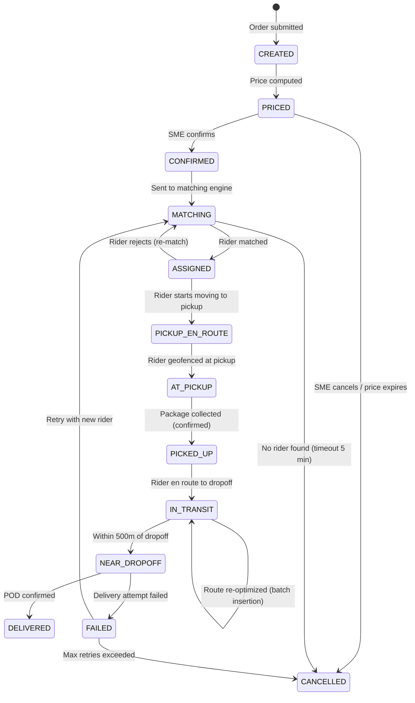

# 14.15 AI-Native Hyperlocal Logistics & Delivery Platform for SMEs — Low-Level Design

## Core Data Models

### Order Model

```
Order {
  order_id:          UUID (partition key)
  city_id:           string (geo-partition key)
  merchant_id:       UUID
  status:            enum [CREATED, PRICED, CONFIRMED, MATCHING, ASSIGNED,
                           PICKUP_EN_ROUTE, AT_PICKUP, PICKED_UP, IN_TRANSIT,
                           NEAR_DROPOFF, DELIVERED, FAILED, CANCELLED]
  pickup: {
    address:         string
    lat:             float64
    lng:             float64
    geohash:         string (precision 7)
    contact_name:    string
    contact_phone:   string (encrypted)
    instructions:    string
  }
  dropoff: {
    address:         string
    lat:             float64
    lng:             float64
    geohash:         string (precision 7)
    contact_name:    string
    contact_phone:   string (encrypted)
    instructions:    string
  }
  package: {
    category:        enum [DOCUMENT, SMALL_PARCEL, MEDIUM_BOX, LARGE_FRAGILE]
    weight_bracket:  enum [W_0_1KG, W_1_5KG, W_5_15KG, W_15_30KG]
    dimensions:      { length_cm, width_cm, height_cm }  // optional
    special_handling: string[]
  }
  urgency:           enum [EXPRESS, STANDARD, ECONOMY, SCHEDULED]
  batch_tolerance:   enum [NO_BATCH, BATCH_2, BATCH_3_PLUS]
  scheduled_window:  { start: timestamp, end: timestamp }  // for SCHEDULED
  pricing: {
    base_fee:        decimal
    distance_fee:    decimal
    surge_multiplier: decimal
    urgency_premium: decimal
    ev_discount:     decimal  // discount for EV delivery
    total_fee:       decimal
    currency:        string
  }
  assignment: {
    rider_id:        UUID
    assigned_at:     timestamp
    vehicle_type:    string
    is_ev:           boolean
    batch_id:        UUID  // null if single-order delivery
    route_position:  int   // position in multi-stop route
  }
  eta: {
    customer_facing: timestamp  // p85 estimate
    rider_target:    timestamp  // p50 estimate
    confidence_band: int        // minutes between p50 and p95
    last_updated:    timestamp
  }
  pod: {
    photo_url:       string
    photo_validated: boolean
    otp_verified:    boolean
    gps_at_delivery: { lat, lng }
    delivered_at:    timestamp
    signature_url:   string  // for B2B
  }
  carbon: {
    vehicle_type:    string
    distance_km:     float
    estimated_co2_g: float   // grams of CO2
  }
  timestamps: {
    created_at:      timestamp
    confirmed_at:    timestamp
    picked_up_at:    timestamp
    delivered_at:    timestamp
  }
  version:           int (optimistic concurrency)
}
```

### Rider Model

```
Rider {
  rider_id:          UUID
  city_id:           string
  status:            enum [OFFLINE, IDLE, EN_ROUTE, AT_PICKUP, DELIVERING]
  vehicle: {
    type:            enum [BICYCLE, MOTORCYCLE, THREE_WHEELER, MINI_TRUCK]
    is_ev:           boolean
    capacity_kg:     float
    capacity_volume: float  // cubic cm
    registration:    string (encrypted)
    battery: {               // EV only
      current_soc:   float   // state of charge 0.0-1.0
      range_km:      float   // estimated remaining range
      last_charged:  timestamp
    }
  }
  current_position: {
    lat:             float64
    lng:             float64
    geohash:         string (precision 8)
    heading:         float  // degrees
    speed:           float  // km/h
    accuracy:        float  // GPS accuracy in meters
    updated_at:      timestamp
  }
  active_orders:     UUID[]  // currently carrying (max 4)
  active_route: {
    waypoints:       [{ order_id, type: PICKUP|DROPOFF, lat, lng, eta }]
    total_distance:  float  // km remaining
    total_time:      int    // seconds remaining
  }
  shift: {
    started_at:      timestamp
    hours_active:    float
    deliveries_today: int
    earnings_today:  decimal
    fatigue_score:   float  // 0.0 to 1.0
    break_due_at:    timestamp  // mandatory break after 4h
  }
  performance: {
    acceptance_rate_7d:    float
    on_time_rate_7d:       float
    avg_rating_30d:        float
    cancellation_rate_30d: float
    avg_speed_factor:      float  // 1.0 = average, 1.15 = 15% faster
  }
  preferences: {
    preferred_zones:       string[]  // geohash prefixes
    max_distance_km:       float
    available_hours:       { start, end }
    ev_charging_preferred: string[]  // preferred charging station IDs
  }
}
```

### Delivery Zone Model

```
DeliveryZone {
  zone_id:           string (geohash prefix, precision 5)
  city_id:           string
  polygon:           GeoJSON
  current_state: {
    active_orders:   int
    available_riders: int
    ev_riders:       int
    supply_demand_ratio: float  // riders / orders
    avg_pickup_time: float  // minutes, rolling 30 min
    avg_delivery_time: float
  }
  pricing: {
    current_multiplier: float  // 1.0 = no surge
    last_updated:    timestamp
    trend:           enum [RISING, STABLE, FALLING]
  }
  forecast: {
    next_15min:      int  // predicted orders
    next_30min:      int
    next_60min:      int
    confidence:      float
    latent_demand:   int  // estimated suppressed demand
  }
  repositioning: {
    riders_needed:   int  // additional riders to meet forecast
    incentive_rate:  decimal  // per repositioning movement
    exploration_flag: boolean  // true if zone in exploration mode
  }
  carbon: {
    ev_delivery_pct: float  // % of deliveries by EV in rolling 24h
    avg_co2_per_delivery: float  // grams
  }
}
```

### Batch Route Model

```
BatchRoute {
  batch_id:          UUID
  rider_id:          UUID
  city_id:           string
  status:            enum [PLANNING, ACTIVE, COMPLETED, DISRUPTED]
  orders:            UUID[]
  waypoints: [
    {
      sequence:      int
      order_id:      UUID
      type:          enum [PICKUP, DROPOFF, CHARGING]
      lat:           float64
      lng:           float64
      eta:           timestamp
      actual_arrival: timestamp  // null until visited
      dwell_time:    int  // seconds spent at waypoint
      time_window_slack: int  // seconds remaining before deadline
    }
  ]
  route_geometry:    encoded_polyline
  total_distance_km: float
  total_time_min:    float
  optimization_score: float  // quality metric from solver
  dependency_graph: {          // pre-computed failure recovery
    removal_impact: {
      [order_id]: {
        new_route:   waypoint[]
        eta_changes: { [order_id]: int }  // seconds of ETA change
        feasible:    boolean
      }
    }
  }
  created_at:        timestamp
  last_optimized:    timestamp
}
```

### Order Event Model

```
OrderEvent {
  event_id:          UUID
  order_id:          UUID
  city_id:           string
  event_type:        enum [CREATED, PRICED, CONFIRMED, MATCH_STARTED,
                           ASSIGNED, REASSIGNED, PICKUP_EN_ROUTE,
                           AT_PICKUP, PICKED_UP, IN_TRANSIT,
                           ROUTE_REOPTIMIZED, NEAR_DROPOFF,
                           DELIVERED, FAILED, CANCELLED,
                           ETA_UPDATED, BATCH_JOINED, BATCH_LEFT]
  timestamp:         timestamp
  actor:             { type: enum [SYSTEM, RIDER, MERCHANT, CUSTOMER], id: UUID }
  metadata: {
    rider_position:  { lat, lng }  // rider location at event time
    decision_context: object       // matching scores, pricing state, etc.
    previous_state:  string
    new_state:       string
  }
  sequence_number:   int  // monotonically increasing per order
}
```

### Charging Station Model (EV Fleet)

```
ChargingStation {
  station_id:        UUID
  city_id:           string
  location: {
    lat:             float64
    lng:             float64
    geohash:         string (precision 7)
    address:         string
  }
  capacity: {
    total_slots:     int
    available_slots: int
    slot_type:       enum [FAST_30MIN, STANDARD_60MIN, SLOW_120MIN]
  }
  reservations: [
    {
      rider_id:      UUID
      slot_id:       int
      start_time:    timestamp
      end_time:      timestamp
      status:        enum [RESERVED, ACTIVE, COMPLETED, NO_SHOW]
    }
  ]
  operating_hours:   { open: time, close: time }
  pricing_per_kwh:   decimal
}
```

---

## API Contracts

### Order Creation API

```
POST /v1/orders
Headers: Authorization: Bearer <merchant_token>
         X-City-Id: <city_id>

Request:
{
  "pickup": {
    "address": "123 MG Road, Bangalore",
    "lat": 12.9716,
    "lng": 77.5946,
    "contact_name": "Store Manager",
    "contact_phone": "+91XXXXXXXXXX"
  },
  "dropoff": {
    "address": "456 Indiranagar, Bangalore",
    "lat": 12.9784,
    "lng": 77.6408,
    "contact_name": "Ravi Kumar",
    "contact_phone": "+91XXXXXXXXXX"
  },
  "package": {
    "category": "SMALL_PARCEL",
    "weight_bracket": "W_1_5KG"
  },
  "urgency": "STANDARD",
  "batch_tolerance": "BATCH_2",
  "prefer_ev": true
}

Response (200):
{
  "order_id": "ord_abc123",
  "status": "PRICED",
  "pricing": {
    "base_fee": 25.00,
    "distance_fee": 18.50,
    "surge_multiplier": 1.2,
    "urgency_premium": 0.00,
    "ev_discount": -2.50,
    "total_fee": 49.70,
    "currency": "INR"
  },
  "estimated_eta_minutes": 42,
  "estimated_co2_grams": 45,
  "tracking_url": "https://track.platform.io/ord_abc123",
  "expires_at": "2026-03-10T14:35:00Z"
}
```

### Order Confirmation API

```
POST /v1/orders/{order_id}/confirm

Response (200):
{
  "order_id": "ord_abc123",
  "status": "MATCHING",
  "message": "Finding the best rider for your delivery"
}
```

### Real-Time Tracking API

```
GET /v1/orders/{order_id}/tracking

Response (200):
{
  "order_id": "ord_abc123",
  "status": "IN_TRANSIT",
  "rider": {
    "name": "Suresh K.",
    "phone_masked": "+91XXXXX5678",
    "vehicle": "MOTORCYCLE",
    "is_ev": true,
    "rating": 4.7
  },
  "position": {
    "lat": 12.9750,
    "lng": 77.6200,
    "heading": 45,
    "updated_at": "2026-03-10T14:22:03Z"
  },
  "eta": {
    "estimated_arrival": "2026-03-10T14:38:00Z",
    "minutes_remaining": 16,
    "confidence": "high",
    "confidence_band_minutes": 4
  },
  "route": {
    "remaining_polyline": "encoded_polyline_string",
    "remaining_distance_km": 2.8,
    "remaining_stops": 1
  },
  "carbon": {
    "estimated_co2_grams": 45,
    "vehicle_type": "EV_MOTORCYCLE"
  }
}
```

### WebSocket Tracking Stream

```
WS /v1/orders/{order_id}/tracking/stream

Server pushes every 3-5 seconds:
{
  "type": "position_update",
  "lat": 12.9752,
  "lng": 77.6210,
  "heading": 48,
  "speed_kmh": 22,
  "eta_minutes": 15,
  "timestamp": "2026-03-10T14:22:06Z"
}

State transition events:
{
  "type": "status_change",
  "from": "IN_TRANSIT",
  "to": "NEAR_DROPOFF",
  "timestamp": "2026-03-10T14:36:00Z"
}

ETA update events:
{
  "type": "eta_update",
  "previous_eta": "2026-03-10T14:38:00Z",
  "new_eta": "2026-03-10T14:41:00Z",
  "reason": "traffic_delay",
  "timestamp": "2026-03-10T14:28:00Z"
}
```

### Rider Location Update API

```
POST /v1/riders/location (batch endpoint)

Request:
{
  "rider_id": "rdr_xyz789",
  "positions": [
    { "lat": 12.9750, "lng": 77.6200, "heading": 45, "speed": 22.5,
      "accuracy": 8.0, "battery_soc": 0.72,
      "timestamp": "2026-03-10T14:22:00Z" },
    { "lat": 12.9751, "lng": 77.6203, "heading": 46, "speed": 23.0,
      "accuracy": 6.0, "battery_soc": 0.72,
      "timestamp": "2026-03-10T14:22:03Z" }
  ]
}

Response (200):
{
  "accepted": 2,
  "next_report_interval_ms": 3000,
  "commands": []  // optional: repositioning nudge, charging alert
}
```

### Demand Forecast API (Internal)

```
GET /v1/internal/forecast?city_id=BLR&horizon=120min

Response:
{
  "city_id": "BLR",
  "generated_at": "2026-03-10T14:15:00Z",
  "horizon_minutes": 120,
  "zones": [
    {
      "zone_id": "tdr4s",
      "intervals": [
        { "start": "14:15", "end": "14:30", "predicted_orders": 12,
          "confidence": 0.82, "latent_demand": 3 },
        { "start": "14:30", "end": "14:45", "predicted_orders": 18,
          "confidence": 0.75, "latent_demand": 4 }
      ]
    }
  ]
}
```

### Merchant Analytics API

```
GET /v1/merchants/{merchant_id}/analytics?period=7d

Response:
{
  "merchant_id": "mer_abc123",
  "period": "2026-03-03 to 2026-03-10",
  "summary": {
    "total_deliveries": 142,
    "on_time_rate": 0.92,
    "avg_delivery_time_min": 38,
    "avg_cost_per_delivery": 48.50,
    "total_cost": 6887.00,
    "batch_rate": 0.45,
    "ev_delivery_rate": 0.28,
    "total_co2_kg": 4.2
  },
  "optimization_suggestions": [
    {
      "type": "batch_window",
      "message": "Scheduling pickups between 2-4 PM would increase batch rate to 60%, saving ~15% per delivery",
      "estimated_savings_pct": 15
    },
    {
      "type": "recurring_schedule",
      "message": "You place similar orders Mon-Fri at 10 AM. Set up recurring delivery for automatic scheduling at lower rates",
      "estimated_savings_pct": 10
    }
  ],
  "delivery_heatmap": {
    "zones": [
      { "geohash": "tdr4su", "delivery_count": 45, "avg_time_min": 32 },
      { "geohash": "tdr4sv", "delivery_count": 38, "avg_time_min": 41 }
    ]
  }
}
```

### EV Charging Schedule API (Internal)

```
POST /v1/internal/ev/charging-plan

Request:
{
  "rider_id": "rdr_ev001",
  "current_soc": 0.25,
  "current_position": { "lat": 12.975, "lng": 77.620 },
  "remaining_shift_hours": 4,
  "active_orders": ["ord_abc"]
}

Response:
{
  "charging_needed": true,
  "recommended_station": {
    "station_id": "cs_hsr_01",
    "distance_km": 1.2,
    "available_slots": 2,
    "charge_type": "FAST_30MIN",
    "estimated_charge_to": 0.85
  },
  "insert_after_order": "ord_abc",
  "estimated_downtime_min": 35
}
```

---

## Core Algorithms

### Algorithm 1: Batch Bipartite Matching

The matching engine accumulates orders over a 30-second window and solves a weighted bipartite assignment problem.

```
FUNCTION batch_match(pending_orders[], available_riders[]):
    // Build cost matrix
    cost_matrix = MATRIX(len(orders), len(riders))

    FOR each order O in pending_orders:
        FOR each rider R in available_riders:
            // Skip infeasible assignments
            IF NOT vehicle_compatible(R.vehicle, O.package): CONTINUE
            IF R.fatigue_score > 0.9: CONTINUE
            IF R.vehicle.is_ev AND R.vehicle.battery.range_km < estimated_round_trip(O) * 1.2:
                CONTINUE  // EV range insufficient

            // Compute multi-objective score
            road_dist = road_network_distance(R.position, O.pickup)
            time_to_pickup = estimate_travel_time(R.position, O.pickup)
            time_to_deliver = estimate_travel_time(O.pickup, O.dropoff)

            IF time_to_pickup + time_to_deliver > O.time_window: CONTINUE

            proximity_score = 1.0 - (road_dist / MAX_DEAD_MILES)
            capacity_score = capacity_fit(R, O.package)
            acceptance_prob = predict_acceptance(R, O)
            fairness_score = earnings_fairness(R)
            ev_bonus = 0.05 IF R.vehicle.is_ev AND O.prefer_ev ELSE 0.0

            cost_matrix[O][R] = weighted_sum(
                proximity_score * 0.30,
                capacity_score * 0.15,
                acceptance_prob * 0.25,
                fairness_score * 0.15,
                time_feasibility_score * 0.10,
                ev_bonus * 0.05
            )

    // Solve assignment (Hungarian algorithm or auction-based)
    assignments = hungarian_algorithm(cost_matrix)

    // Compute shadow assignments (backup for rejections)
    FOR each (order, rider) in assignments:
        shadow = second_best_rider(cost_matrix, order, excluding=rider)
        store_shadow_assignment(order, shadow)

    RETURN assignments
```

### Algorithm 2: Route Optimization with Order Insertion

```
FUNCTION optimize_route_with_insertion(current_route, new_order):
    // current_route: ordered list of waypoints rider must visit
    // new_order: new order to insert (pickup + dropoff waypoints)

    best_cost = INFINITY
    best_insertion = NULL

    // Try every feasible insertion position for pickup
    FOR pickup_pos FROM 0 TO len(current_route):
        // Pickup must come before dropoff
        FOR dropoff_pos FROM pickup_pos + 1 TO len(current_route) + 1:
            candidate = insert_waypoints(current_route, new_order.pickup,
                                         pickup_pos, new_order.dropoff, dropoff_pos)

            // Check time window feasibility for ALL orders in route
            IF NOT all_time_windows_satisfied(candidate): CONTINUE

            // Check capacity at every segment
            IF NOT capacity_feasible(candidate): CONTINUE

            // Check EV range if applicable
            IF rider.vehicle.is_ev:
                IF NOT range_feasible(candidate, rider.vehicle.battery): CONTINUE

            // Compute cost (total route time increase)
            detour_cost = route_time(candidate) - route_time(current_route)
            delay_cost = sum_of_delay_increases(candidate, current_route)

            total_cost = detour_cost + DELAY_PENALTY * delay_cost

            IF total_cost < best_cost:
                best_cost = total_cost
                best_insertion = candidate

    IF best_insertion IS NULL:
        RETURN INFEASIBLE  // Cannot insert without violating constraints

    // Apply ALNS improvement (2-second budget)
    improved = adaptive_large_neighborhood_search(best_insertion, time_budget=2000ms)

    // Pre-compute failure recovery for the new route
    dependency_graph = compute_removal_impacts(improved)

    RETURN { route: improved, dependencies: dependency_graph }
```

### Algorithm 3: ETA Ensemble Prediction

```
FUNCTION predict_eta(rider, waypoints_remaining):
    // Component 1: Graph-based traversal time
    graph_time = 0
    FOR each segment IN waypoints_to_road_segments(waypoints_remaining):
        base_time = road_graph.traversal_time(segment)
        speed_overlay = real_time_speed_overlay.get(segment.id)
        segment_time = base_time * (base_time / speed_overlay)  // adjust for current traffic
        graph_time += segment_time

    // Component 2: Rider-specific speed adjustment
    rider_profile = get_rider_speed_profile(rider.id)
    rider_factor = rider_profile.speed_factor(
        time_of_day = NOW,
        weather = current_weather,
        hours_active = rider.shift.hours_active,
        vehicle_type = rider.vehicle.type,
        battery_soc = rider.vehicle.battery.current_soc  // EVs slow at low charge
    )

    // Component 3: Intersection and signal delays
    intersections = count_intersections(waypoints_remaining)
    signal_delay = intersections * intersection_delay_model.predict(
        time_of_day = NOW,
        zone = rider.current_zone
    )

    // Component 4: Dwell times at waypoints
    dwell_time = 0
    FOR each wp IN waypoints_remaining:
        IF wp.type == PICKUP:
            dwell_time += pickup_time_model.predict(wp.merchant_id)
        ELSE IF wp.type == DROPOFF:
            dwell_time += dropoff_time_model.predict(wp.address_type)
        ELSE IF wp.type == CHARGING:
            dwell_time += charging_time_estimate(rider.vehicle.battery, wp.target_soc)

    // Combine components
    base_eta = (graph_time / rider_factor) + signal_delay + dwell_time

    // Compute distribution (log-normal model)
    variance = eta_variance_model.predict(
        distance = total_remaining_distance,
        time_of_day = NOW,
        weather = current_weather,
        batch_size = len(waypoints_remaining) / 2
    )

    RETURN {
        p50: base_eta,
        p85: base_eta * (1 + 0.67 * sqrt(variance)),
        p95: base_eta * (1 + 1.28 * sqrt(variance)),
        confidence_band: base_eta * 1.28 * sqrt(variance) - base_eta  // p95 - p50
    }
```

### Algorithm 4: Dynamic Zone Pricing

```
FUNCTION compute_zone_price(zone, order):
    // Supply-demand ratio
    supply = zone.current_state.available_riders
    incoming_supply = count_riders_en_route_to_zone(zone, window=15min)
    demand = zone.current_state.active_orders + zone.forecast.next_15min
    sd_ratio = (supply + incoming_supply * 0.7) / max(demand, 1)

    // Base multiplier from supply-demand curve
    IF sd_ratio >= 1.5:
        surge = 1.0  // Oversupply, no surge
    ELSE IF sd_ratio >= 1.0:
        surge = 1.0 + 0.3 * (1.5 - sd_ratio)  // Mild surge
    ELSE IF sd_ratio >= 0.5:
        surge = 1.15 + 0.7 * (1.0 - sd_ratio)  // Moderate surge
    ELSE:
        surge = 1.5 + 2.0 * (0.5 - sd_ratio)  // Heavy surge

    // Weather adjustment
    IF current_weather.is_raining:
        surge = surge * 1.15  // Rain reduces rider supply

    // Time-of-day adjustment
    hour_factor = time_demand_curve[current_hour]  // Learned curve
    surge = surge * hour_factor

    // Apply caps
    surge = min(surge, MAX_SURGE_MULTIPLIER)  // Cap at 2.5x
    surge = max(surge, MIN_SURGE_MULTIPLIER)  // Floor at 0.8x for off-peak discount

    // Smooth with moving average (avoid price flicker)
    smoothed_surge = 0.7 * surge + 0.3 * zone.pricing.previous_multiplier

    // Compute final price
    base_price = BASE_FEE + (order.distance_km * PER_KM_RATE)
    urgency_premium = urgency_multiplier[order.urgency]

    total = base_price * smoothed_surge * urgency_premium

    // EV discount
    IF order.prefer_ev AND zone.current_state.ev_riders > 0:
        total = total * 0.95  // 5% EV discount

    // Enforce rider earnings floor
    min_rider_pay = MIN_RIDER_EARNINGS_PER_DELIVERY
    IF total * RIDER_COMMISSION_RATE < min_rider_pay:
        total = min_rider_pay / RIDER_COMMISSION_RATE

    RETURN {
        base_fee: BASE_FEE,
        distance_fee: order.distance_km * PER_KM_RATE,
        surge_multiplier: smoothed_surge,
        urgency_premium: urgency_premium,
        ev_discount: ev_discount_amount,
        total: round(total, 2)
    }
```

### Algorithm 5: Batch Dependency Graph Pre-Computation

```
FUNCTION compute_removal_impacts(batch_route):
    // For each order in the batch, pre-compute the impact of removing it
    impacts = {}

    FOR each order O in batch_route.orders:
        // Create route without O's waypoints
        reduced_waypoints = remove_waypoints(batch_route.waypoints, O.order_id)

        // Re-optimize the reduced route
        new_route = optimize_sequence(reduced_waypoints, time_budget=500ms)

        // Compute ETA changes for remaining orders
        eta_changes = {}
        FOR each remaining_order R in batch_route.orders WHERE R != O:
            old_eta = find_dropoff_eta(batch_route.waypoints, R.order_id)
            new_eta = find_dropoff_eta(new_route, R.order_id)
            eta_changes[R.order_id] = new_eta - old_eta  // seconds, negative = earlier

        // Check feasibility of reduced route
        feasible = all_time_windows_satisfied(new_route)

        impacts[O.order_id] = {
            new_route: new_route,
            eta_changes: eta_changes,
            feasible: feasible
        }

    RETURN impacts
```

### Algorithm 6: Carbon Emission Estimation

```
FUNCTION estimate_carbon(vehicle_type, distance_km, load_kg, traffic_factor):
    // Emission factors per vehicle type (grams CO2 per km)
    base_emission = {
        BICYCLE: 0,            // zero emission
        EV_MOTORCYCLE: 5,      // grid electricity equivalent
        EV_THREE_WHEELER: 8,
        MOTORCYCLE: 40,        // ICE motorcycle
        THREE_WHEELER: 65,     // ICE auto-rickshaw
        MINI_TRUCK: 120        // diesel mini-truck
    }

    // Load adjustment: heavier loads increase fuel consumption
    load_factor = 1.0 + (load_kg / vehicle_max_load[vehicle_type]) * 0.15

    // Traffic adjustment: stop-and-go traffic increases emissions
    traffic_emission_factor = 1.0 + (traffic_factor - 1.0) * 0.3

    total_co2_grams = base_emission[vehicle_type] * distance_km
                      * load_factor * traffic_emission_factor

    RETURN round(total_co2_grams, 1)
```

---

## State Machine: Order Lifecycle



---

## Database Schema Design

### Partitioning Strategy

| Table | Partition Key | Sort Key | Rationale |
|---|---|---|---|
| **orders** | city_id + date | order_id | City-local queries; date for TTL and archival |
| **order_events** | order_id | sequence_number | Event replay per order; monotonic sequence |
| **rider_positions** | rider_id | timestamp | Time-series per rider; latest position via max(timestamp) |
| **location_trail** | rider_id + date | timestamp | GPS breadcrumbs; date partition for retention policy |
| **zone_state** | city_id | zone_id | All zones for a city queried together for matching |
| **batch_routes** | city_id + date | batch_id | Route plans are city-local and date-bounded |
| **pod_records** | city_id + date | order_id | POD lookup by order; date for retention |
| **charging_stations** | city_id | station_id | Station queries are city-local |

### Index Strategy

| Index | Purpose |
|---|---|
| **orders(merchant_id, created_at)** | Merchant dashboard queries |
| **orders(city_id, status)** | Active order monitoring |
| **orders(rider_id, status)** | Rider's active delivery list |
| **orders(city_id, status, urgency)** | Priority matching for express orders |
| **rider_positions(geohash)** | Spatial proximity queries for matching |
| **rider_positions(city_id, status, vehicle_type)** | Fleet composition queries |
| **zone_state(city_id, supply_demand_ratio)** | Surge pricing hot-zone detection |
| **order_events(city_id, event_type, timestamp)** | Operational analytics and replay |
| **pod_records(order_id)** | Dispute resolution lookup |

### Data Retention Policy

| Data | Hot (SSD) | Warm (HDD) | Cold (Archive) | Deletion |
|---|---|---|---|---|
| **Active orders** | Duration of delivery | 90 days | 2 years | After 2 years |
| **Order events** | 30 days | 90 days | 1 year | After 1 year |
| **Location trail (raw)** | 7 days | 90 days | — | After 90 days |
| **Location trail (anonymized)** | — | — | 1 year | After 1 year (training data) |
| **POD photos** | 30 days | 180 days | — | After 180 days |
| **Zone state snapshots** | 24 hours | 30 days | — | After 30 days |
| **Matching decisions** | 7 days | 30 days | 90 days | After 90 days |
| **Rider performance** | Rolling 30 days | — | — | Continuously updated |
