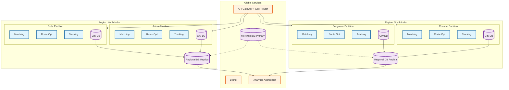

# 14.15 AI-Native Hyperlocal Logistics & Delivery Platform for SMEs — Scalability & Reliability

## Multi-Region Architecture

The platform deploys across geographic regions for latency optimization and disaster recovery. Each region hosts multiple city partitions. Cross-region concerns (merchant accounts, billing, analytics) use asynchronous replication.



**Multi-region properties**:
- City partitions are self-contained—no cross-city real-time dependencies
- Regional DB replicas enable analytics aggregation without cross-region queries
- Merchant DB primary in one region with async replication to others (merchant data changes infrequently)
- API Gateway routes requests to the nearest region based on city_id
- Regional failure is isolated: if North India region fails, South India cities continue operating

---

## Scaling Strategy

### Geo-Partitioned Architecture

The platform scales by treating each city as an independent processing partition. This is the natural scaling boundary because hyperlocal delivery is geographically bounded—no cross-city state is needed for real-time operations.

**Scaling characteristics**:
- Adding a new city is a deployment operation, not an architecture change
- Each city partition scales independently based on its order volume
- City-level failures are isolated—Mumbai outage does not affect Bangalore
- Platform-wide analytics aggregates asynchronously (5-15 min lag acceptable)

### Within-City Scaling

For large metros (Mumbai, Delhi) where single-partition processing hits limits, the system supports sub-city partitioning by zone clusters:

| Component | Scaling Mechanism | Trigger |
|---|---|---|
| **Location Ingestion** | Horizontal partitioning by rider_id hash | > 10,000 updates/sec per ingestion instance |
| **Matching Engine** | Zone-cluster partitioning (group of adjacent zones) | > 100 orders/sec in a single batch window |
| **Route Optimizer** | Worker pool with task queue; each optimization is independent | > 500 solver invocations/min |
| **Tracking Engine** | WebSocket connection sharding by order_id hash | > 50,000 concurrent tracking sessions |
| **Demand Forecaster** | Single instance per city (lightweight computation) | Not a Slowest part of the process—runs every 15 min |
| **Geospatial Index** | Geohash-partitioned shards with read replicas | > 100,000 spatial queries/sec |

### Location Ingestion Scaling

The location pipeline is the highest-throughput component. Scaling strategy:

```
Tier 1: Ingestion Gateway (stateless, auto-scaled)
  - Receives GPS from rider apps
  - Validates, deduplicates, batches
  - Routes to correct city partition
  - Scale: 1 instance per 5,000 riders

Tier 2: Stream Processor (partitioned by rider_id)
  - Kalman filtering, map matching
  - Geofence evaluation
  - Writes to geospatial index and time-series store
  - Scale: 1 partition per 1,000 riders

Tier 3: Geospatial Index (in-memory, replicated)
  - Primary: receives writes from stream processor
  - Replicas: serve reads for matching and tracking
  - Scale: 1 replica per 20,000 concurrent read queries/sec
```

---

## Back-Pressure Mechanisms

### Location Pipeline Back-Pressure

When the stream processor cannot keep up with location ingestion (e.g., sudden spike from all riders reporting simultaneously after a network recovery):

```
BACK-PRESSURE STRATEGY:
  Stage 1: Buffer (< 5 seconds lag)
    - Ingestion gateway buffers up to 10,000 updates in memory ring buffer
    - No visible degradation

  Stage 2: Throttle (5-15 seconds lag)
    - Ingestion gateway sends adaptive report interval to riders
    - Increase rider GPS interval from 3s to 5s via next_report_interval_ms response
    - Reduces ingestion rate by 40%

  Stage 3: Sample (15-30 seconds lag)
    - Stream processor samples: process every 2nd update (keep latest per rider)
    - Geospatial index stays fresh (latest position) but historical trail has gaps
    - Acceptable: stale by 6s instead of 3s

  Stage 4: Shed (> 30 seconds lag)
    - Drop oldest buffered updates (they are stale anyway)
    - Focus on most recent position per rider only
    - Alert: P1 location pipeline stress
```

### Matching Engine Back-Pressure

When order volume exceeds matching capacity (batch windows accumulating faster than solver can process):

```
BACK-PRESSURE STRATEGY:
  Stage 1: Reduce Solver Quality (queue depth > 50 orders)
    - Cut ALNS time budget from 2s to 500ms
    - Solution quality degrades ~5% but throughput 4× higher

  Stage 2: Expand Batch Window (queue depth > 100 orders)
    - Expand window from 30s to 45s
    - Fewer solve cycles per minute; each cycle processes more orders

  Stage 3: Reduce Candidate Pool (queue depth > 200 orders)
    - Shrink candidate riders per order from 50 to 20
    - Cost matrix is 60% smaller; solve time drops proportionally

  Stage 4: Greedy Fallback (queue depth > 500 orders)
    - Abandon batch matching entirely
    - Switch to greedy nearest-rider dispatch
    - Assignment quality drops 15-25% but clears backlog immediately
```

### Order Intake Back-Pressure

When downstream services are overwhelmed:

```
BACK-PRESSURE STRATEGY:
  Stage 1: Priority Queuing
    - Express orders processed first; economy orders queued
    - Existing customers prioritized over new merchants

  Stage 2: Rate Limiting
    - Per-merchant rate limit: 50 orders/hour
    - Platform-wide rate limit: 50 orders/second per city

  Stage 3: Price-Based Demand Shaping
    - Increase surge multiplier beyond supply-demand formula
    - Higher prices naturally reduce order volume

  Stage 4: Circuit Breaker
    - Temporarily stop accepting new economy orders
    - Express and standard only during extreme overload
    - "High demand in your area — try again in 15 minutes"
```

---

## Reliability Patterns

### Matching Engine Resilience

The matching engine is the single most critical component—if it fails, no new orders can be assigned. Reliability strategy:

**Active-passive redundancy**: Two matching engine instances per city. The active instance processes batch windows. The passive instance receives the same input stream and maintains shadow state. If the active fails, the passive promotes within 5 seconds (1 missed batch window).

**Degraded matching mode**: If both matching instances fail, the system falls back to greedy nearest-rider dispatch (no batching, no optimization). This produces 20% worse assignments but maintains service availability. Orders placed during degraded mode are flagged for potential rebate if delivery is significantly delayed.

**Matching timeout circuit breaker**: If a batch window's solver takes > 45 seconds (solver hung or thrashing), the circuit breaker triggers, returns the best solution found so far (construction Practical rule of thumb without improvement phase), and alerts operations.

### Order Durability

Every confirmed order must be persisted before acknowledgment. The system uses a write-ahead pattern:

```
1. SME confirms order
2. Order Service writes to event log (synchronous, durable)
3. Event log acknowledged → confirmation returned to SME
4. Asynchronous: event consumed by matching engine, tracking engine, etc.
```

If the Order Service crashes after step 2 but before step 3, the event is in the log but the SME did not receive confirmation. On restart, the service replays uncommitted events, detects the unacknowledged order, and sends the confirmation. The SME may see a brief delay but the order is never lost.

### Location Pipeline Resilience

Location data is critical but inherently ephemeral—a 3-second-old GPS reading has no value for real-time matching. Reliability strategy:

**At-most-once delivery for real-time path**: The geospatial index receives location updates with at-most-once semantics. A missed update means the rider's position is 6 seconds stale instead of 3—acceptable for matching and tracking. No retry logic, no exactly-once overhead.

**At-least-once delivery for historical path**: The time-series store receives updates with at-least-once delivery via the stream processor. Duplicates are deduplicated by (rider_id, timestamp) composite key. Historical data must be complete for model training accuracy.

### Tracking Engine Availability

Tracking is the most user-visible system—customers watch the map constantly. Outages generate immediate support escalation. Strategy:

**Multi-tier fallback**:
1. Primary: WebSocket push from tracking engine (real-time, 3-second updates)
2. Fallback 1: Client polling via REST API every 5 seconds (if WebSocket connection drops)
3. Fallback 2: Cached last-known-position with interpolation (if tracking engine is down, serve from CDN-cached position with client-side dead-reckoning using last known speed and heading)

**Connection draining**: During deployments, new connections go to new instances while existing connections drain gracefully over 60 seconds. No tracking disruption during rolling updates.

---

## Disaster Recovery

### RPO / RTO Targets

| Component | RPO (data loss tolerance) | RTO (time to recover) | Recovery Method |
|---|---|---|---|
| **Order Database** | 0 (zero data loss) | < 60 seconds | Synchronous replication; automatic failover to standby |
| **Event Stream** | 0 (zero data loss) | < 30 seconds | Multi-replica distributed log; partition leader election |
| **Matching Engine** | N/A (stateless; recovers from event stream) | < 10 seconds | Active-passive failover |
| **Geospatial Index** | 3 seconds (latest GPS update) | < 30 seconds | Rebuild from stream replay |
| **Time-Series Store** | 5 seconds (buffered writes) | < 5 minutes | Replay from ingestion buffer |
| **Route Optimizer** | N/A (stateless solver) | Immediate | Auto-scaled worker pool |
| **POD Object Storage** | 0 (cross-region replication) | < 15 minutes | Read from secondary region |
| **ML Models** | N/A (versioned in registry) | < 5 minutes | Rollback to previous version |

### Failure Modes and Recovery

| Failure | Impact | Detection | Recovery | RTO |
|---|---|---|---|---|
| **Matching engine crash** | New orders queue up | Health check miss (5s) | Passive instance promotes | < 10 seconds |
| **Route optimizer overload** | Routes not re-optimized | Solver latency > 5s | Shed load, return best Practical rule of thumb solution | Immediate |
| **Geospatial index corruption** | Stale rider positions | Position freshness alert | Rebuild from stream replay (last 60s) | < 30 seconds |
| **Order DB failure** | Cannot create/update orders | Connection error rate spike | Failover to read replica, promote to primary | < 60 seconds |
| **Time-series store failure** | No historical GPS data | Write error rate spike | Buffer in ingestion gateway (5 min ring buffer); replay on recovery | < 5 minutes |
| **City partition network split** | City completely offline | Cross-partition heartbeat miss | Rider apps cache last route; resume on reconnection | Depends on split duration |
| **Event stream failure** | No async processing | Consumer lag spike | Order Service falls back to synchronous calls to matching engine | Immediate (degraded) |
| **Region-wide outage** | All cities in region offline | Cross-region health check | DNS failover to secondary region (merchant data only); city services wait for region recovery | 5-15 minutes |

### Data Backup Strategy

| Data | Backup Frequency | Retention | Recovery Method |
|---|---|---|---|
| **Order database** | Continuous replication + hourly snapshots | 90 days (active), 2 years (archived) | Point-in-time recovery from replica |
| **Event log** | Continuous replication | 30 days (hot), 1 year (cold) | Replay from checkpoint |
| **GPS trail** | Daily export to cold storage | 90 days (hot), 1 year (cold for training) | Restore from cold storage |
| **POD artifacts** | Cross-region replication | 180 days | Restore from secondary region |
| **ML models** | Versioned in model registry | All versions retained | Roll back to previous model version |
| **Road network graph** | Hourly snapshot | 7 days | Rebuild from latest snapshot |
| **Zone state** | Hourly snapshot | 7 days | Rebuild from event replay |

---

## Load Management

### Traffic Shaping

| Mechanism | Trigger | Action |
|---|---|---|
| **Order rate limiting** | > 50 orders/sec from single merchant | Queue excess, process at capped rate |
| **Tracking poll throttling** | > 2 polls/sec from single client | Increase poll interval to 10s |
| **Location update throttling** | Network congestion detected | Increase rider report interval to 5s |
| **Solver time budget reduction** | Queue depth > 100 pending optimizations | Reduce ALNS time budget from 2s to 500ms |
| **Batch window expansion** | Matching latency > 40s at p95 | Expand batch window from 30s to 45s |
| **POD validation deferral** | ML inference queue > 100 | Accept POD optimistically; validate asynchronously |

### Graceful Degradation Hierarchy

```
LEVEL 0: Full Operation
  All AI models active, full optimization, real-time tracking

LEVEL 1: Optimization Degradation
  Route optimizer: Practical rule of thumb only (no ALNS improvement phase)
  Demand forecaster: use yesterday's pattern instead of real-time model
  Matching: reduce candidate pool from 50 to 20 riders
  EV preference: disabled (any vehicle assigned)

LEVEL 2: Matching Degradation
  Switch from batch matching to greedy dispatch
  Disable batching (single-order assignments only)
  Fixed pricing (disable surge computation)

LEVEL 3: Core-Only Mode
  Order creation and rider assignment only
  Tracking: last-known position (no real-time updates)
  No route optimization (rider uses own navigation)
  SMS-only notifications (disable push and WebSocket)
```

---

## Chaos Engineering Experiments

### Experiment 1: Matching Engine Kill

**Hypothesis**: System recovers to full matching capability within 10 seconds with < 1 batch window missed.

**Procedure**: (1) Kill the active matching engine process. (2) Observe: passive instance promotion time, orders in the stranded batch, recovery path.

**Success criteria**: Passive promotes in < 5 seconds. Stranded orders re-matched in next batch window. No orders lost. On-time rate impact < 1% for the affected batch.

**Schedule**: Weekly, during off-peak hours.

### Experiment 2: Location Pipeline Lag Injection

**Hypothesis**: 30-second location pipeline lag does not cause matching failures; tracking degrades gracefully.

**Procedure**: (1) Inject artificial 30-second delay in the stream processor. (2) Observe: matching quality (dead miles), tracking staleness, geofence trigger accuracy.

**Success criteria**: Matching uses cached positions (30s stale); dead miles increase < 5%. Tracking shows "last known position" with staleness indicator. Geofence triggers delayed but not missed.

**Schedule**: Bi-weekly.

### Experiment 3: Order DB Failover

**Hypothesis**: Database failover completes within 60 seconds with zero data loss.

**Procedure**: (1) Simulate primary database failure (network partition). (2) Observe: automatic failover, write availability gap, order state consistency after failover.

**Success criteria**: Failover completes in < 60 seconds. No committed orders lost. Write availability gap < 10 seconds. Read replicas serve stale data during gap (acceptable).

**Schedule**: Monthly.

### Experiment 4: Demand Spike Simulation

**Hypothesis**: System handles 3× normal peak load without order loss, with graceful degradation.

**Procedure**: (1) Inject synthetic orders at 3× peak rate (84 orders/sec instead of 28). (2) Observe: matching queue depth, back-pressure activation, degradation level, order completion rate.

**Success criteria**: Back-pressure activates at Level 1 within 2 minutes. No orders lost. Assignment latency increases to < 90 seconds (from 45s baseline). Degradation does not exceed Level 2.

**Schedule**: Monthly, coordinated with capacity planning review.

### Experiment 5: GPS Blackout Zone

**Hypothesis**: System handles a zone where all rider GPS goes silent (simulating urban canyon or tunnel).

**Procedure**: (1) Block GPS updates from all riders in a specific zone for 3 minutes. (2) Observe: tracking behavior, geofence triggers, matching in the affected zone.

**Success criteria**: Tracking shows "last known position" for affected riders. Matching in the zone pauses (no new assignments to riders with stale positions > 60 seconds). Orders in the zone queue until GPS recovers or are routed to riders outside the blackout zone.

**Schedule**: Quarterly.

---

## Capacity Planning

### Growth Model

| Metric | Year 1 | Year 2 | Year 3 |
|---|---|---|---|
| Cities | 5 | 15 | 30 |
| Daily orders (total) | 500K | 3M | 10M |
| Peak orders/second | 50 | 300 | 1,000 |
| Active riders (peak) | 15K | 80K | 250K |
| Location updates/sec | 5K | 27K | 83K |
| Tracking sessions (concurrent) | 25K | 150K | 500K |
| Storage (monthly) | 5 TB | 30 TB | 100 TB |
| EV fleet percentage | 15% | 35% | 60% |

### Scaling Triggers

| Component | Current Capacity | Scale Trigger | Scale Action |
|---|---|---|---|
| **Ingestion Gateway** | 10K updates/sec | CPU > 60% sustained | Add instance (auto-scale) |
| **Matching Engine** | 200 orders/batch | Batch solve time > 20s | Partition city into zone clusters |
| **Geospatial Index** | 50K queries/sec | Read latency p99 > 5ms | Add read replica |
| **Order Database** | 100 writes/sec | Write latency p99 > 50ms | Vertical scale, then horizontal shard by date |
| **Tracking WebSockets** | 25K connections/instance | Memory > 70% | Add instance, rebalance connections |
| **Route Optimizer Pool** | 500 solves/min | Queue depth > 50 sustained | Add worker instances |
| **Event Stream** | 10K events/sec per partition | Consumer lag > 10s | Add partitions, rebalance consumers |

---

## Load Shedding Strategy

When the system approaches capacity limits, load shedding preserves core functionality by selectively dropping lower-priority work:

### Shedding Priority (Lowest Priority Shed First)

| Priority | Component | Shed Action | Impact |
|---|---|---|---|
| **P4 (Analytics)** | Demand forecaster, analytics pipeline | Pause non-critical batch jobs; forecast runs on last-known-good | Forecast accuracy degrades to 6-hour-old data; pre-positioning becomes less optimal |
| **P3 (Optimization)** | Route optimizer ALNS improvement phase | Skip local search improvement; use construction Practical rule of thumb only | Routes are 5-10% suboptimal (more dead miles) but computed 10× faster |
| **P2 (Enrichment)** | ETA recomputation frequency, POD AI validation | Reduce ETA updates from every 30s to every 2 min; defer POD validation to async queue | Tracking less fresh; POD validated post-delivery instead of real-time |
| **P1 (Matching quality)** | Batch matching optimizer | Fall back from global bipartite to per-zone greedy matching | 15-25% worse total dead miles; assignment latency drops from 30s to 5s |
| **P0 (Core flow)** | Order intake, rider dispatch, tracking state | Never shed — this is the minimum viable operation | If P0 is threatened, trigger L4/L5 degradation from the graceful degradation hierarchy |

### Load Shedding Triggers

Each shedding level activates when the system detects:
- **P4 shed**: Matching engine CPU > 75% sustained for 3 minutes
- **P3 shed**: Solver queue depth > 100 pending optimizations
- **P2 shed**: Location pipeline consumer lag > 15 seconds
- **P1 shed**: Order intake queue depth > 500 unmatched orders for > 60 seconds

Recovery follows reverse order with 2-minute stabilization periods between re-enabling each level.

---

## Data Replication and Consistency Model

| Data Store | Replication | Consistency Model | Partition Strategy |
|---|---|---|---|
| **Order DB** | Synchronous replication (primary + 1 sync replica + 1 async replica) | Strong consistency for writes; eventual consistency for read replicas (< 1s lag) | Single-partition per city; shard by date for archive |
| **Geospatial Index** | In-memory with peer replication (primary writes, replicas rebuilt every 30s from stream) | Best-effort consistency; queries may see 1-3 second old data | Geohash-partitioned within city |
| **Event Stream** | 3-way replicated partitions with ISR (in-sync replicas) | At-least-once delivery with consumer-side deduplication | Topic-per-city; partition by order_id hash |
| **Time-Series Store** | Async replication to cold storage; single-zone hot storage | Eventual consistency (writes are fire-and-forget with local WAL) | Time-bucketed partitions per city |
| **Geospatial Cache** | Primary + 2 read replicas with sub-second async replication | Eventual consistency; stale reads acceptable for tracking | Key-space sharded by geohash prefix |

## AI Release Ladder

Every AI model or capability change in this system MUST follow this rollout sequence:

| Stage | Description | Gate Criteria |
|-------|-------------|---------------|
| 1. Offline Evaluation | Benchmark against historical ground truth | Meets baseline metrics |
| 2. Shadow Mode | Run in parallel with production, compare outputs | No regression on key metrics |
| 3. Canary (Blast-Radius Capped) | 1-5% traffic, human review of all outputs | Error rate < threshold |
| 4. Human-Reviewed Production | AI recommends, human approves all actions | Approval rate > 90% |
| 5. Limited Autonomous Production | AI acts within pre-approved boundaries | Continuous monitoring, no alerts |
| 6. Instant Rollback | One-click revert to previous model/rules | < 5 min rollback time |

**Note:** AI capabilities that directly interact with end users or execute actions on their behalf must reach Stage 4 (human-reviewed production) with domain-expert sign-off before deployment. Stage 5 limited autonomy applies only to well-bounded, low-risk action categories with established rollback procedures.
