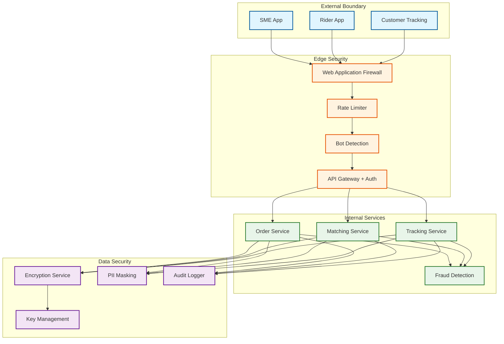

# 14.15 AI-Native Hyperlocal Logistics & Delivery Platform for SMEs — Security & Compliance

## Domain Threat Model

### Attack Surface Analysis

| Surface | Threats | Impact | Likelihood |
|---|---|---|---|
| **Rider App** | GPS spoofing (fake location to claim deliveries), account takeover, fake proof-of-delivery, battery drain attacks (force high-frequency GPS reporting) | Fraudulent deliveries, lost packages, inflated earnings | High |
| **SME App / API** | Order injection (fake orders to manipulate pricing), credential stuffing, scraping rider fleet data, API abuse for competitive intelligence | Pricing manipulation, data theft, competitive intelligence | Medium |
| **Customer Tracking** | Tracking link enumeration (guessing order IDs to stalk riders), session hijacking, real-time rider location surveillance | Rider safety, privacy violation | Medium |
| **Location Pipeline** | Man-in-the-middle on GPS stream, replay attacks (resubmitting old locations), location data interception | Stale tracking, incorrect matching, fraudulent route claims | Low |
| **Payment Flow** | Fare manipulation (exploiting surge pricing transitions), refund fraud, rider payout manipulation, merchant billing disputes | Financial loss, trust erosion | Medium |
| **Internal Systems** | Insider threat (support agents accessing rider/customer data), model poisoning (injecting training data to bias matching), configuration tampering | Privacy breach, biased algorithms | Low |
| **ML Models** | Adversarial inputs to demand forecaster (fake weather data), matching model manipulation via coordinated rider behavior | Economic losses from mispriced demand, unfair rider assignment | Low |

### Threat Trees

```
GPS Spoofing Attack:
├── Motivation: Claim delivery earnings without performing delivery
├── Attack Vector 1: Mock location app on rooted device
│   ├── Detection: Root/jailbreak detection in rider app
│   └── Bypass: Virtual device emulators
├── Attack Vector 2: External GPS signal generator
│   ├── Detection: Accelerometer-GPS consistency check
│   └── Bypass: Simultaneous accelerometer spoofing (harder)
├── Attack Vector 3: Replay GPS coordinates from previous delivery
│   ├── Detection: Trajectory freshness (timestamps must be monotonic)
│   └── Bypass: Time-shifted replay (harder to detect)
└── Final Defense: POD photo with EXIF GPS from separate sensor path
    └── Bypass: Photo GPS spoofing (very difficult on modern devices)
```

---

## Authentication and Authorization

### Multi-Tier Access Control

```
TIER 1: Public (no auth)
  - Service area check (is this address serviceable?)
  - Price estimate (non-binding, no user context)

TIER 2: Authenticated SME
  - Order creation, confirmation, cancellation
  - Own order tracking and history
  - Analytics dashboard (own data only)
  - API key management for integrations

TIER 3: Authenticated Rider
  - Dispatch acceptance/rejection
  - Location reporting
  - POD submission
  - Earnings and payout history

TIER 4: Authenticated Customer (via tracking link)
  - Track specific order (token-scoped to single order)
  - Rate delivery
  - No PII exposure (rider first name + masked phone only)

TIER 5: Internal Operations
  - Cross-merchant order visibility
  - Rider performance dashboards
  - Manual dispatch override
  - Pricing rule configuration
  - Audit-logged, role-based, time-bounded access

TIER 6: Platform Admin
  - City configuration, zone management
  - ML model deployment
  - Financial reconciliation
  - Full audit log access
```

### Tracking Link Security

Customer tracking links must balance convenience (no login required) with security (cannot enumerate orders or stalk riders).

**Design**: Tracking URLs contain a cryptographically random token (128-bit), not the order ID. The token is generated at order creation, sent to the customer via SMS/WhatsApp, and maps to the order in a lookup table. Token properties:
- Non-guessable: 128 bits of entropy; brute-force enumeration infeasible
- Time-scoped: token expires 2 hours after delivery completion
- Rate-limited: > 10 requests/minute from same IP triggers CAPTCHA
- Information-limited: returns rider first name (no last name), masked phone (last 4 digits), approximate position (snapped to nearest 100m grid, not exact GPS)
- One-way mapping: token → order lookup exists; order → token enumeration is not possible without the token

### API Key Rotation and Scoping

SMEs integrating via API receive scoped API keys:
- **Read-only key**: Can query order status, tracking, and analytics; cannot create orders
- **Write key**: Can create and confirm orders; cannot access analytics or other merchants' data
- **Admin key**: Full access for the merchant's account; required for billing changes and key management
- Automatic rotation: keys expire every 90 days with 30-day overlap window
- Per-key rate limits: prevents a compromised key from overwhelming the system

---

## Data Privacy

### PII Classification and Handling

| Data Element | Classification | Storage | Access | Retention |
|---|---|---|---|---|
| **Customer phone number** | Sensitive PII | Encrypted at rest (AES-256) | Masked in UI; full number only for active delivery SMS/call | Deleted 30 days after delivery |
| **Customer address** | Sensitive PII | Encrypted at rest | Full address to assigned rider only during active delivery; geocoded coordinates (not address text) for analytics | Address text: 90 days; geocodes: 1 year |
| **Rider GPS trail** | Sensitive PII | Encrypted at rest | Real-time: matching and tracking engines; Historical: anonymized for model training after 7 days | Raw: 90 days; anonymized: 1 year |
| **Rider photo and ID** | Sensitive PII | Encrypted, separate storage | Onboarding verification only; not accessible to merchants or customers | Duration of rider account + 1 year |
| **SME business address** | Business data | Standard encryption | Public (used in tracking UI as pickup location) | Account lifetime |
| **Order contents description** | Business data | Standard encryption | Rider (during delivery), SME (always) | 1 year |
| **POD photos** | Evidence | Encrypted, immutable storage | SME, support agents (for disputes); auto-deleted after retention | 180 days |
| **Rider earnings data** | Financial PII | Encrypted at rest | Rider (own data), billing team (aggregate) | 7 years (tax compliance) |

### Phone Number Masking

Riders and customers communicate during active deliveries without exposing phone numbers:

```
WHEN rider needs to contact customer:
  1. Rider taps "Call Customer" in app
  2. App calls platform's virtual number service
  3. Service routes call to customer's actual number
  4. Caller ID shows platform's number, not rider's
  5. Call recording stored for dispute resolution (30 days)
  6. Virtual number recycled after delivery completes

WHEN customer needs to contact rider:
  Same flow via tracking page "Call Rider" button
```

### Location Data Anonymization for Model Training

Rider GPS trails are valuable for training ETA and speed profile models but contain sensitive movement patterns. Anonymization pipeline:

1. **Temporal aggregation**: Individual GPS points aggregated into road-segment-level speed observations (segment_id, speed, time_of_day). Individual rider identity removed.
2. **K-anonymity**: Speed observations only retained for road segments with ≥ 5 distinct riders in the time window. Segments with fewer riders (rural roads, late night) are excluded to prevent re-identification.
3. **Differential privacy**: Gaussian noise (calibrated to privacy budget ε = 1.0) added to speed aggregates before model training. Ensures no individual rider's specific route can be reconstructed from the trained model.
4. **Purpose limitation**: Anonymized data used only for ETA model training and traffic speed estimation. Not shared with third parties. Not used for rider performance evaluation.

---

## Rider Safety

### Real-Time Safety Monitoring

```
SAFETY SIGNALS MONITORED:
  1. Prolonged stop in unusual location
     - Rider stationary > 10 min outside pickup/dropoff geofence
     - Action: Send "Are you OK?" push notification
     - Escalation: If no response in 5 min, alert operations

  2. Route deviation
     - Rider deviates > 500m from planned route for > 3 minutes
     - Action: Log deviation, check for known road closures
     - Escalation: If no known cause, trigger safety check

  3. Speed anomaly
     - Rider speed > 80 km/h (bikes) or sudden deceleration pattern
     - Action: Alert operations, potential accident detection
     - Escalation: Contact rider, then emergency services if unresponsive

  4. Late-night deliveries
     - Deliveries between 10 PM and 6 AM
     - Action: Auto-share rider trip with emergency contact
     - Continuous monitoring with lower anomaly thresholds

  5. SOS trigger
     - Rider activates panic button in app
     - Action: Immediately share live location with emergency contacts
       and platform safety team; record audio for 5 minutes

  6. Impact detection
     - Phone accelerometer detects high-g impact event
     - Action: Automatic safety check prompt; if no response in 2 min,
       alert operations with last known location
```

### Rider Identity Verification

- **At onboarding**: Government ID verification, photo match, background check, vehicle registration verification
- **Daily login**: Face match against onboarding photo (anti-account-sharing measure)
- **Random spot checks**: Periodic re-verification during active shifts (face match prompt at random intervals)
- **Device binding**: Rider account bound to specific device; device change requires re-verification
- **EV riders**: Additional charging station proximity verification (rider must be at a registered station to claim charging time)

---

## Fraud Prevention

### GPS Spoofing Detection

Riders may spoof GPS to claim deliveries without actually performing them. Detection layers:

1. **Consistency checks**: GPS speed vs. accelerometer data from phone. A rider "moving" at 30 km/h but with zero accelerometer activity is likely spoofing.
2. **Cell tower triangulation**: Compare GPS coordinates with approximate position from cell tower data. Significant discrepancy flags spoofing.
3. **Photo geolocation**: POD photos contain EXIF GPS data (from a separate sensor path than navigation GPS). Mismatch between POD photo GPS and reported rider GPS indicates spoofing.
4. **Pattern analysis**: Riders completing deliveries significantly faster than the road-network minimum travel time, or completing deliveries during hours their phone's battery sensor shows the device as stationary.
5. **Behavioral anomaly**: Rider completes 20 deliveries/hour when the zone average is 4/hour — statistical impossibility without spoofing.

### Order Injection and Price Manipulation

Attackers might create fake orders during low-demand periods, then cancel them as real orders arrive during induced-surge pricing. Detection:

- Order creation rate limits per merchant (50/hour)
- Cancellation pattern monitoring: merchants with > 30% cancellation rate flagged for review
- Surge pricing computation ignores orders from accounts with high cancellation history
- Price lock: once an order receives a price estimate, the price is locked for 5 minutes regardless of surge changes
- Bot detection: CAPTCHA on rapid successive order creations from same device/IP

### Rider Collusion Detection

Groups of riders may coordinate to reject orders, artificially deflating supply to trigger surge pricing that benefits them when they accept.

- Temporal correlation: if > 5 riders in the same zone reject within 30 seconds, flag as potential coordination
- Social graph analysis: riders who frequently reject simultaneously and then accept at higher surge are flagged
- Countermeasure: rejection-correlated riders are excluded from the same batch window's shadow assignments

---

## Gig Worker Regulatory Compliance

### Earnings Transparency

- Riders see per-delivery earnings breakdown before accepting: base pay, distance bonus, surge bonus, batch bonus, tip
- Weekly earnings summary with comparison to minimum wage equivalent
- No algorithmic penalties for order rejection (rejection affects matching priority slightly but does not reduce base pay)
- Algorithmic transparency: rider can see why they were assigned a specific order (proximity score, compatibility score)

### Working Hours Monitoring

- Platform tracks cumulative active hours per day and per week
- Mandatory 30-minute break nudge after 4 continuous hours
- Hard cap: rider app disables dispatch after 12 hours in a 24-hour period
- Weekly hour visibility for riders and regulatory reporting
- Break compliance logged for regulatory audits

### Insurance and Benefits

- Per-delivery accident insurance automatically active during delivery window (from pickup acceptance to delivery completion)
- Coverage includes medical expenses, vehicle damage, and third-party liability
- Insurance activation and deactivation triggered automatically by order lifecycle events (no rider action needed)
- EV-specific coverage: battery damage, charging station incidents
- Weather-related incident coverage during active shifts

### Right to Disconnect

- Riders can set "do not disturb" hours in the app; no notifications during those hours
- No negative algorithmic consequence for being offline during peak hours
- Minimum advance notice (24 hours) for any change to incentive programs or pricing rules

---

## Compliance Matrix

| Regulation | Applicability | Implementation |
|---|---|---|
| **Data Protection Laws** | Customer and rider PII | Encryption at rest and in transit; purpose limitation; data minimization; deletion schedules; consent management |
| **Gig Worker Laws** | Rider classification, earnings, hours | Earnings transparency; hour tracking; no hidden penalties; insurance; benefits information |
| **Geolocation Privacy** | Rider GPS tracking | Clear consent at onboarding; location collected only during active shifts; anonymization for analytics; rider can see their own data |
| **Consumer Protection** | SME delivery promises | Clear pricing before confirmation; ETA accuracy monitoring; refund policy for failures; complaint resolution SLA |
| **Vehicle and Road Safety** | Rider vehicles, speed | Vehicle registration verification; speed monitoring; accident detection; mandatory safety training |
| **Financial Compliance** | Rider payouts, merchant billing | KYC for merchant onboarding; rider identity verification; transaction audit trail; tax reporting support |
| **Accessibility** | App and tracking UI | Screen reader support; high-contrast mode; voice-guided navigation for riders; multilingual support |
| **Environmental Reporting** | Carbon emissions per delivery | Per-delivery CO2 tracking; fleet emission reports; EV adoption metrics; sustainability disclosures |
| **EV Regulations** | Battery disposal, charging safety | Battery health monitoring; certified charging stations only; disposal tracking for retired EV batteries |

---

## Security Architecture



### Security Monitoring

| Signal | Source | Action |
|---|---|---|
| **Credential stuffing** | Auth service login failure rate | Lock account after 5 failures; CAPTCHA after 3 |
| **API key abuse** | Rate limiter | Revoke key; notify merchant |
| **GPS spoofing cluster** | Fraud detection service | Quarantine riders; escalate to investigations |
| **Data exfiltration** | Audit logger (bulk data access) | Alert security team; block access pending review |
| **Insider access anomaly** | SIEM (support agent querying unrelated orders) | Alert compliance team; audit trail review |
| **Model tampering** | ML pipeline integrity checker | Halt model deployment; rollback to previous version |

---

## Supply Chain Trust and Third-Party Risk

### Charging Station Provider Trust

EV charging integration introduces a new trust boundary: the platform relies on third-party charging station APIs for availability, slot reservation, and charging status. Risks and mitigations:

- **Availability data staleness**: Station reports 4 available slots but 3 are occupied. Mitigation: cross-validate with platform's own EV rider check-in data at stations; discount availability by station-specific reliability score
- **Reservation honoring**: Station accepts reservation but fails to hold the slot. Mitigation: if a rider arrives at a reserved station and cannot charge, the station provider is flagged; after 3 incidents, the station is deprioritized in routing
- **Pricing manipulation**: Station charges higher rates than agreed. Mitigation: pre-negotiated rate contracts; real-time billing reconciliation; automated dispute creation on discrepancies
- **Data leakage**: Station API receives rider ID and schedule data. Mitigation: use platform-generated anonymous session IDs for reservations; no rider PII shared with station providers

### Map and Traffic Data Provider Trust

Road-network data and real-time traffic feeds come from third-party providers. The platform's routing accuracy depends on this data being correct and current.

- **Stale map data**: New roads not reflected; closed roads still appear. Mitigation: rider trajectory data serves as a secondary map validation source—if multiple riders routinely travel a path not on the map, flag for map update
- **Traffic data manipulation**: If an attacker could inject false traffic data, they could redirect riders away from or toward specific areas. Mitigation: cross-validate third-party traffic data against the platform's own rider speed observations (5,000 riders generating speed data across the city); reject third-party speed values that deviate > 50% from platform observations without corroborating signal
- **Service disruption**: Traffic feed goes offline. Mitigation: fall back to historical time-of-day speed profiles (updated daily from rider data); contraction hierarchy remains usable with last-known-good speed overlay

---

## Incident Response Playbook

### Security Incident Classification

| Severity | Definition | Response Time | Example |
|---|---|---|---|
| **SEV-1 (Critical)** | Active data breach or system compromise affecting customer PII | < 15 minutes | Database exfiltration, API key leak exposing all merchant data |
| **SEV-2 (High)** | Fraud ring detected or significant financial loss in progress | < 1 hour | Coordinated GPS spoofing ring, mass fake order injection |
| **SEV-3 (Medium)** | Single account compromise or isolated security control failure | < 4 hours | Single rider account takeover, WAF rule bypass on non-critical endpoint |
| **SEV-4 (Low)** | Security misconfiguration or policy violation with no active exploitation | < 24 hours | Expired API key still active, audit log gap for non-sensitive service |

### Data Breach Notification Protocol

| Step | Action | Timeline | Responsible |
|---|---|---|---|
| **1. Contain** | Isolate affected systems; revoke compromised credentials | Within response time for SEV level | On-call engineer |
| **2. Assess** | Determine scope: which data, how many records, which users affected | Within 4 hours | Security team + legal |
| **3. Notify internally** | Brief executive team and legal counsel | Within 8 hours | CISO |
| **4. Notify affected users** | Personalized notification to affected merchants and riders | Within 72 hours (regulatory requirement) | Legal + communications |
| **5. Notify regulators** | File formal breach notification per jurisdiction | Within 72 hours | Legal team |
| **6. Remediate** | Fix root cause; implement additional controls | Within 2 weeks | Engineering team |
| **7. Post-mortem** | Formal review with timeline, root cause, and prevention plan | Within 30 days | Security team |

---

## Algorithmic Fairness and Transparency

### Matching Algorithm Auditing

The matching engine's decisions affect rider earnings and merchant service quality. The platform maintains algorithmic accountability through:

- **Matching decision logging**: Every match records the full candidate set, scores, and why the selected rider was chosen over alternatives (stored 90 days)
- **Bias detection**: Monthly automated analysis checks for statistically significant disparities in order assignment quality by rider demographics (age bracket, gender, vehicle type, zone)
- **Rider explainability**: Riders can query "Why did I get this order?" and receive a simplified explanation ("You were the nearest rider with a compatible vehicle and available capacity")
- **Merchant explainability**: Merchants can query "Why did my delivery take longer than estimated?" with a component breakdown (rider travel time, traffic delay, pickup dwell time)
- **Independent audit**: Annual third-party audit of matching algorithm for systematic bias in earnings distribution, order assignment patterns, and surge pricing exposure across rider segments
