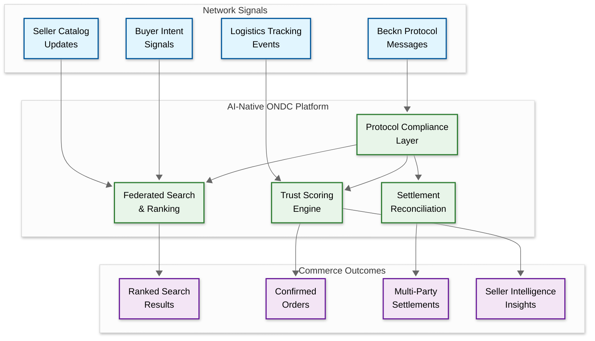

# 14.16 AI-Native ONDC Commerce Platform

## System Overview

An AI-native ONDC (Open Network for Digital Commerce) commerce platform is a system built on top of India's decentralized open commerce protocol—the Beckn protocol—that replaces the traditional centralized marketplace model (where a single platform like Amazon or Flipkart controls buyer discovery, seller onboarding, payment settlement, logistics, and data) with a federated network architecture where independent buyer apps, seller apps, logistics providers, and payment gateways interoperate through a standardized open protocol, and AI enhances every layer of this decentralized transaction lifecycle: intelligent catalog normalization across heterogeneous sellers who have wildly different data formats and quality levels, cross-network search ranking that must produce relevant results from catalogs hosted on dozens of independent seller network participants (SNPs) without a centralized product database, automated seller onboarding that reduces the 3-4 week manual process to under 48 hours by using AI to validate GST compliance, auto-generate catalog entries from product photos, and map seller categories to the ONDC taxonomy, fraud detection across a trustless network where no single entity has complete transaction visibility, and demand-supply matching that routes buyer intent signals to the most relevant sellers across the entire network rather than within a single platform's inventory. The core engineering tension is that the platform must deliver centralized-marketplace-quality user experiences (sub-second search, accurate delivery estimates, seamless payment, reliable grievance redressal) while operating on a fundamentally decentralized architecture where the buyer app cannot trust the seller app, the seller app cannot trust the logistics provider, neither trusts the gateway, and the protocol must ensure non-repudiation, data integrity, and settlement accuracy across all these trust boundaries—all while maintaining the Beckn protocol's asynchronous request-callback communication model where a search request broadcasts to the entire network and aggregates responses from dozens of independent providers with varying latencies, data formats, and reliability levels. With ONDC processing over 16 million monthly orders, 600,000+ sellers across 600+ cities, and targeting $48 billion GMV by 2030, the AI layer must operate at national scale while respecting the protocol's core principle: no single entity should have monopolistic control over buyer-seller relationships.

---

## Autonomy Classification

**Tier: C — AI-Gated Action**

This is an **AI-gated action system** where AI interprets, generates, classifies, and executes within pre-approved policy boundaries. Actions outside those boundaries are escalated to human agents. All AI-initiated actions are logged, auditable, and reversible. AI manages catalog discovery and order routing within ONDC protocol boundaries, with merchants confirming order acceptances.

| Boundary | AI Role | Human/System Authority |
|----------|---------|----------------------|
| **System of Record** | Platform state managed by transactional services; AI writes through validated APIs only | Transactional service layer |
| **System of Intelligence** | Interpretation, generation, classification, and decision-making within policy guardrails | AI engine with policy constraints |
| **Action Boundary** | Executes autonomously within pre-approved boundaries; escalates outside them | Policy engine + escalation rules |
| **Human Override** | Merchants confirm all order acceptances; ONDC protocol rules constrain AI routing decisions | Domain expert |
| **Rollback Path** | All AI-initiated actions logged with full context; compensation transactions defined for every write path | Audit trail + compensation flows |

---

## Key Characteristics

| Characteristic | Description |
|---|---|
| **Architecture Style** | Federated protocol-based network with Beckn protocol as the interoperability layer; event-driven asynchronous communication between network participants (NPs); each NP maintains independent infrastructure; the ONDC gateway acts as a registry and message router, not a data store; AI services operate as protocol-aware middleware between the buyer/seller app and the Beckn API layer |
| **Core Abstraction** | The *Beckn transaction lifecycle*: a standardized sequence of asynchronous API calls (search → on_search → select → on_select → init → on_init → confirm → on_confirm → status → on_status → track → on_track) that models the complete buyer-seller interaction from discovery through fulfillment and post-fulfillment, with each step producing a signed, non-repudiable message that forms the audit trail for settlement and dispute resolution |
| **AI Catalog Intelligence** | Multi-modal catalog enrichment pipeline: seller uploads raw product photos and basic metadata → AI extracts product attributes (category, material, color, size, brand) → generates standardized descriptions conforming to ONDC taxonomy → maps to the correct product category across 5,000+ ONDC category nodes → validates completeness against domain-specific schema requirements; auto-corrects common seller errors (wrong HSN codes, missing weight, inconsistent pricing) |
| **Cross-Network Search** | Federated search aggregation where the buyer app broadcasts a search intent to the ONDC gateway, which fans out to all qualifying seller NPs; AI ranks and merges heterogeneous on_search responses (varying schema compliance, image quality, description detail) into a unified, relevance-scored result set—solving a distributed information retrieval problem without a centralized index |
| **Trust Scoring Engine** | Decentralized reputation system where no single entity holds the complete trust picture; AI computes composite trust scores from order fulfillment rates, delivery SLA adherence, return rates, grievance resolution speed, payment settlement history, and protocol compliance metrics—all derived from signed transaction logs without requiring centralized data aggregation |
| **India Stack Integration** | Deep integration with India's Digital Public Infrastructure: Aadhaar-based e-KYC for instant seller verification, UPI for real-time payment settlement with automated reconciliation, DigiLocker for GST certificate and FSSAI license verification, Account Aggregator for seller creditworthiness signals; WhatsApp Business API as a buyer-side conversational commerce interface |

---

## Quick Navigation

| Document | Focus |
|---|---|
| [01 — Requirements & Estimations](./01-requirements-and-estimations.md) | Functional requirements, capacity math, SLOs |
| [02 — High-Level Design](./02-high-level-design.md) | System architecture, Beckn protocol flows, network topology |
| [03 — Low-Level Design](./03-low-level-design.md) | Data models, Beckn API schemas, order state machine, settlement algorithms |
| [04 — Deep Dives & Bottlenecks](./04-deep-dive-and-bottlenecks.md) | Catalog discovery, trust scoring, settlement reconciliation, protocol compliance |
| [05 — Scalability & Reliability](./05-scalability-and-reliability.md) | Gateway scaling, protocol message routing, federated fault tolerance |
| [06 — Security & Compliance](./06-security-and-compliance.md) | Digital signatures, non-repudiation, data protection in federated model |
| [07 — Observability](./07-observability.md) | Cross-network transaction tracing, protocol compliance monitoring |
| [08 — Interview Guide](./08-interview-guide.md) | 45-min pacing, trap questions, centralized vs. decentralized rubric |
| [09 — Insights](./09-insights.md) | 8+ non-obvious architectural insights |

---

## What Differentiates Naive vs. Production

| Dimension | Naive Approach | Production Reality |
|---|---|---|
| **Catalog Discovery** | Forward buyer's search query to all seller NPs, collect responses, sort by price, and display as a flat list | AI-powered federated search: pre-index seller catalog snapshots for approximate matching, broadcast only to relevant NPs based on category and geography, merge heterogeneous responses with schema normalization, rank by composite relevance score (price, seller trust, delivery speed, catalog completeness), and apply personalization from buyer history—all within a 2-second response budget |
| **Seller Onboarding** | Manual document verification, spreadsheet-based catalog upload, 3-4 week turnaround with back-and-forth for data corrections | AI-driven onboarding pipeline: Aadhaar e-KYC for identity (minutes, not days), DigiLocker pull for GST/FSSAI certificates (automatic validation), product photo upload with AI-generated catalog entries (descriptions, categories, HSN codes), schema compliance checker that auto-corrects 80% of common errors, and sandbox transaction testing before going live—48-hour onboarding target |
| **Trust & Fraud** | Binary trust model: seller is either "verified" (has valid GST) or "unverified"; no runtime fraud detection; disputes resolved manually through email threads | Continuous multi-dimensional trust scoring: fulfillment reliability (delivery SLA adherence over trailing 30 days), catalog accuracy (return rate due to "item not as described"), pricing integrity (detecting bait-and-switch patterns), protocol compliance (response latency, schema adherence), and buyer feedback aggregation; anomaly detection flags suspicious patterns (sudden catalog expansion, price manipulation, fake order inflation) in real-time |
| **Protocol Compliance** | Implement Beckn APIs as a passthrough: forward messages without validation, hope the other NP sends compliant responses | Protocol compliance middleware that validates every inbound and outbound Beckn message against the current schema version (v1.2.5+), detects and handles protocol violations gracefully (missing required fields, invalid enum values, signature verification failures), generates compliance scores per NP, and auto-adapts to minor schema differences between NPs running different protocol versions |
| **Settlement** | Daily batch settlement: sum all transactions, compute net payable per seller, transfer funds next business day | Real-time settlement orchestration: per-order settlement tracking through the multi-party chain (buyer → buyer NP → ONDC → seller NP → seller → logistics NP), withholding and escrow management for COD orders, automatic TDS/TCS deduction, split settlement for marketplace commission, GST invoice reconciliation, and exception handling for partial deliveries, returns, and disputes |
| **Logistics Integration** | Single logistics partner hardcoded; same delivery promise for all orders regardless of origin-destination | Multi-LSP orchestration via ONDC logistics protocol: broadcast logistics search to 25+ logistics service providers, rank by serviceability-cost-speed, support hyperlocal (<3 km, 30-min), slotted (same-day/next-day), and intercity delivery modes, real-time tracking via protocol status updates, and automatic LSP failover if SLA breach is predicted |
| **WhatsApp Commerce** | WhatsApp as a notification channel: send order confirmation and tracking links via template messages | WhatsApp as a full commerce interface: conversational product discovery (buyer describes need in natural language, AI maps to ONDC catalog search), interactive catalog browsing with carousel cards, in-chat ordering via Beckn protocol flow, UPI payment collection within WhatsApp, and post-purchase support—all operating as a Beckn buyer app behind the scenes |
| **Multi-Language Support** | English-only interface; seller catalogs in whatever language the seller uses; no standardization | AI-powered multilingual normalization: seller catalog in any of 22 Indian languages is translated and normalized to a standard schema; buyer interface in their preferred language; search queries in one language match catalog entries in another via cross-lingual embedding; WhatsApp conversations in the buyer's language regardless of seller's language |

---

## What Makes This System Unique

### Protocol-First Architecture: The Network Is the Platform

Unlike traditional e-commerce platforms where the platform owns the infrastructure and provides APIs for third-party sellers to plug into, ONDC inverts this relationship: the protocol is the platform, and every participant (buyer app, seller app, logistics provider, payment gateway) is an independent entity that speaks the Beckn protocol. This means there is no centralized product database to query, no unified order management system, no single payment gateway to route through, and no platform-level customer data store. Every piece of functionality that a centralized platform provides through internal service calls must instead be accomplished through asynchronous protocol messages between independent, potentially competing entities. The AI layer operates in this "protocol-first" paradigm: instead of querying a centralized database for search results, it must aggregate and rank asynchronous responses from dozens of independent seller NPs; instead of accessing a unified customer profile for personalization, it must build user models from transaction logs within the buyer app's local data; instead of enforcing quality standards through platform policies, it must infer quality signals from protocol-level metadata (response latency, schema compliance, fulfillment tracking consistency). This fundamentally changes the system design constraints: every AI model must be designed to work with incomplete, heterogeneous, and potentially adversarial data from entities it does not control.

### Trust Without Centralization: The Digital Signature Chain

In a centralized marketplace, trust is simple: the platform verifies sellers, holds funds in escrow, and arbitrates disputes using its complete view of all transactions. In ONDC, no single entity has this complete view. Trust is established through cryptographic guarantees: every Beckn message is digitally signed by the sender, verified by the receiver, and the signature chain forms a non-repudiable audit trail. If a seller claims they shipped an order but the buyer says they didn't receive it, the dispute resolution system can examine the signed `on_confirm` (seller acknowledged the order), `on_status` (seller claimed shipment), and logistics `on_track` (delivery partner's tracking data) messages—each signed by different entities—to establish the chain of events without requiring any centralized truth store. The AI-powered trust scoring system operates on top of this signature chain, computing reliability scores from the gap between what each NP promised (in signed protocol messages) and what actually happened (as evidenced by subsequent messages from other NPs in the chain).

### The Catalog Normalization Problem: N Sellers × M Schemas × K Languages

The defining data engineering challenge of ONDC is catalog normalization. In a centralized marketplace, the platform defines the product schema, and sellers must conform to it. In ONDC, each seller NP can implement the Beckn catalog schema differently (within the constraints of the protocol specification), resulting in wildly inconsistent product data: one seller describes a cotton shirt as "Pure Cotton Formal Shirt, Blue, Size L" while another lists the same type of product as "Gents shirt cotton blue L size best quality assured." Both are valid catalog entries, but search, comparison, and recommendation systems need to understand they represent comparable products. The AI catalog normalization engine must parse heterogeneous catalog entries, extract structured attributes, map to a canonical taxonomy, generate standardized descriptions, and compute product similarity—all while respecting that each seller NP owns their catalog data and the ONDC platform has no authority to modify it. This is fundamentally different from a centralized platform's catalog management: the AI must normalize at query time (or via periodic snapshot indexing), not at ingestion time.

---

## Related Patterns

| Pattern / Topic | Connection |
|---|---|
| [7.5 Maps & Navigation Service](../7.5-maps-navigation-service/00-index.md) | Serviceability polygon computation and hyperlocal delivery ETA estimation share the same geo-spatial indexing and routing techniques |
| [8.13 Payment Settlement Platform](../8.13-payment-settlement-platform/00-index.md) | Multi-party settlement reconciliation, escrow management, and TCS/TDS computation directly parallel the ONDC settlement engine's challenges |
| [12.14 A/B Testing Platform](../12.14-ab-testing-platform/00-index.md) | Search ranking algorithm experiments (relevance weights, trust score boosting) require feature flagging and statistical significance testing |
| [14.10 Trade Finance & Invoice Factoring](../14.10-ai-native-trade-finance-invoice-factoring-platform/00-index.md) | Seller creditworthiness signals via Account Aggregator and invoice-backed financing for ONDC sellers share data pipelines |
| [14.11 Digital Storefront Builder](../14.11-ai-native-digital-storefront-builder-smes/00-index.md) | Seller NP catalog management overlaps with storefront product catalog generation for SME sellers joining ONDC |
| [14.15 Hyperlocal Logistics & Delivery](../14.15-ai-native-hyperlocal-logistics-delivery-platform-smes/00-index.md) | Multi-LSP orchestration, delivery ETA prediction, and last-mile logistics selection via ONDC logistics protocol |
| [14.18 Digital Document Vault](../14.18-digital-document-vault-platform/00-index.md) | DigiLocker integration for GST/FSSAI certificate verification mirrors document vault architecture patterns |
| [16.3 Text Search Engine](../16.3-text-search-engine/00-index.md) | Cross-lingual federated search with multilingual embeddings, hybrid keyword+vector retrieval, and reciprocal rank fusion |

---

## Technology Evolution Timeline

| Era | Commerce Paradigm | Key Innovation |
|---|---|---|
| **2000–2010** | Centralized web marketplaces | Single-platform catalog, payment, and fulfillment (FlipKart, eBay India) |
| **2010–2018** | Platform dominance with API ecosystems | Marketplace APIs for third-party sellers; centralized search and recommendation; proprietary logistics networks |
| **2018–2021** | Open commerce protocols emerge | Beckn protocol specification published (2019); ONDC incorporated (2021); initial pilot with 5 NPs in 5 cities |
| **2022–2024** | Network bootstrapping | ONDC reaches 16M+ monthly orders, 600K+ sellers, 600+ cities; buyer apps like Paytm, Magicpin, Mystore join; grocery and food-delivery dominate early volume |
| **2024–2026** | AI-native network participants | AI catalog normalization, cross-lingual federated search, trust scoring from protocol signals, WhatsApp conversational commerce as a Beckn buyer app, LLM-powered seller intelligence dashboards |
| **2026+** | Agentic commerce | AI agents negotiating on behalf of buyers (autonomous price comparison, seller selection, order placement via Beckn protocol); predictive inventory pre-positioning across the network; network-level demand forecasting that no single NP could compute alone |

---

## Core Architecture

---

## The Decentralization Tax: Why ONDC Is Architecturally Harder Than Centralized E-Commerce

Every feature that a centralized marketplace implements as an internal service call must be implemented as a multi-party protocol exchange in ONDC. This "decentralization tax" manifests as:

1. **Latency tax** — A single database query (1-5ms) becomes a network fan-out to 50+ NPs (500-2000ms). Every user-facing operation pays this tax.
2. **Trust tax** — Instead of trusting your own services, every data point arrives from a potentially adversarial source and must be verified against signed protocol messages.
3. **Consistency tax** — No single source of truth exists. Order state is reconstructed from messages authored by 3-4 independent NPs who may disagree.
4. **Intelligence tax** — AI models cannot be trained on a unified dataset because no single NP has complete transaction data. Each NP sees its own slice.

The engineering challenge is to deliver centralized-marketplace-quality UX while paying this decentralization tax at every layer—and using AI to amortize the cost where possible (pre-indexing amortizes the latency tax, trust scoring amortizes the trust tax, event-sourcing amortizes the consistency tax).

---

## The Agentic Commerce Horizon

As LLMs become capable of autonomous tool use, the Beckn protocol's API-first design makes it uniquely suited for AI agent-mediated commerce:

- **Buyer agents** can autonomously execute the search → select → init → confirm flow on behalf of users, comparing options across the entire ONDC network in seconds
- **Seller agents** can dynamically adjust pricing, inventory allocation, and fulfillment promises based on real-time network demand signals
- **Network-level intelligence** emerges when multiple NPs share anonymized demand signals, enabling predictive inventory positioning that no single participant could achieve alone

The protocol's machine-readable, signed message format means AI agents can participate in commerce with the same non-repudiation guarantees as human-operated NPs—a property that centralized platforms with web UIs don't inherently provide.
