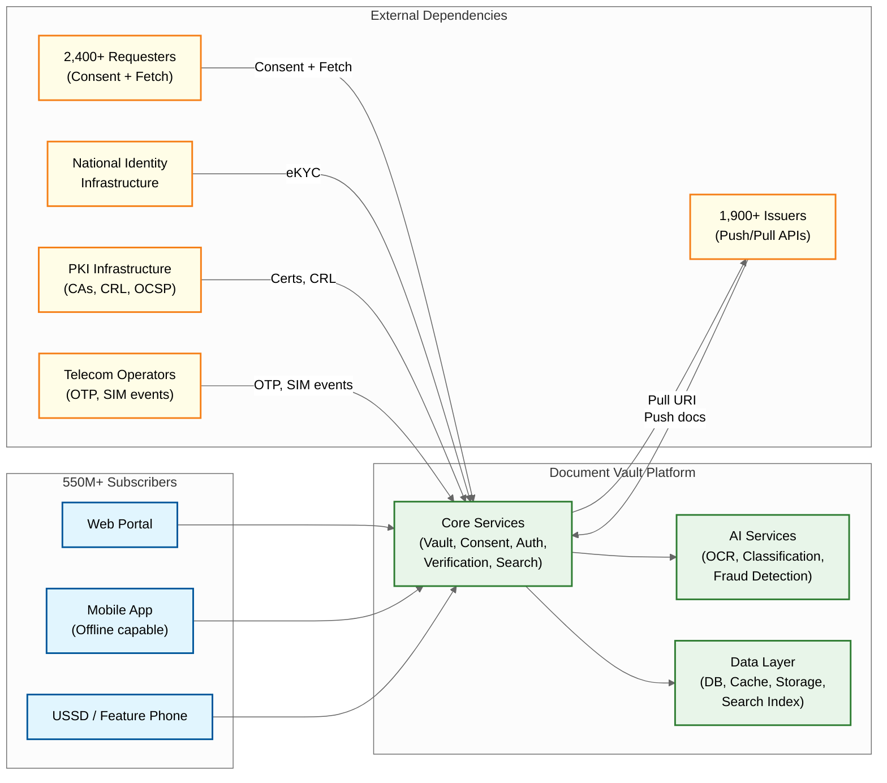

# Requirements & Estimations — Digital Document Vault Platform

## Functional Requirements

| ID | Requirement | Details |
|---|---|---|
| FR-01 | **Subscriber Registration & Identity Linking** | Citizens register using national identity (e.g., Aadhaar-based eKYC); account linked to verified mobile number; multi-factor authentication (mobile OTP + optional biometric); device registration for trusted devices; support for 550M+ registered accounts |
| FR-02 | **Document Issuance via Push API** | Issuers push digitally signed documents to subscribers' vaults via standardized REST API; documents carry PKI signatures with certificate chain; each document gets a persistent URI; batch issuance support for bulk operations (e.g., university issuing 50,000 degrees simultaneously) |
| FR-03 | **Document Retrieval via Pull URI** | Vault resolves document URIs by querying issuer repositories in real-time; Pull URI endpoints follow standardized request-response schema; supports document search by identifier (national ID, registration number, etc.); returns signed XML or PDF with verification metadata |
| FR-04 | **Self-Uploaded Document Management** | Citizens upload personal documents (scanned copies, photos) to a "Drive" area; supported formats: PDF, JPEG, PNG; 1 GB storage per user; AI auto-classification and metadata extraction via OCR; fraud detection for tampered uploads |
| FR-05 | **Consent-Based Document Sharing** | Subscribers grant fine-grained, time-bound, revocable consent for requesters to access specific documents; OAuth 2.0 authorization code flow; consent records are immutable; purpose limitation enforced; field-level access control where supported |
| FR-06 | **Document Verification** | Any party with a document URI or QR code can verify authenticity; verification checks digital signature, certificate chain validity, CRL status, and document integrity hash; returns verification result with timestamp and issuer details |
| FR-07 | **Requester Integration** | Organizations register as authorized requesters; OAuth 2.0 client credentials for API access; can initiate consent requests to subscribers; receive documents via secure API with access tokens; rate-limited by subscription tier |
| FR-08 | **Cross-Platform Access** | Web portal, Android app, iOS app, and USSD-based access for feature phones; offline mode for mobile apps (pre-cached critical documents with local signature verification); responsive design for varying screen sizes and connectivity conditions |
| FR-09 | **Document Search & Discovery** | Semantic search across subscriber's document portfolio; natural language queries; category-based browsing; timeline view of all issued documents; predictive suggestions based on context (e.g., "documents needed for passport application") |
| FR-10 | **Notification & Activity Log** | Push notifications for new document issuance, consent requests, document access events; comprehensive activity log showing all actions on the subscriber's vault; export capability for audit purposes |
| FR-11 | **Issuer Onboarding & Management** | Self-service portal for issuer registration; API key management; document schema definition; test sandbox environment; compliance verification; dashboard with issuance analytics |
| FR-12 | **AI-Powered Document Intelligence** | OCR for text extraction from scanned documents; automatic document type classification; data field extraction (name, date, ID numbers); fraud detection for uploaded documents; smart grouping and tagging |
| FR-13 | **Health Record Integration (ABHA)** | Integration with the Ayushman Bharat Health Account system; health records (lab reports, prescriptions, discharge summaries) accessible through the vault with healthcare-specific consent flows; HIPAA-equivalent privacy controls |
| FR-14 | **Academic Bank of Credits** | Integration with the Academic Bank of Credits system for storing and sharing academic transcripts; credit transfer verification across institutions; longitudinal academic record management |
| FR-15 | **Document Expiry Management** | Proactive notifications for expiring documents (driving license, insurance, passport); renewal reminders with deep-links to issuer renewal portals; automated archival of expired documents with grace period for renewal |
| FR-16 | **Verifiable Credentials Support** | Future-ready support for W3C Verifiable Credentials format; selective disclosure for field-level consent; interoperability with eIDAS 2.0 digital identity wallets |

---

## Out of Scope

| Item | Rationale |
|---|---|
| **Document Creation/Editing** | The vault stores and shares documents; it does not provide authoring tools. Issuers create documents in their own systems |
| **Payment Processing** | No payment transactions within the vault; premium storage or API access fees handled by external billing systems |
| **Inter-Vault Document Transfer** | Documents cannot be transferred between subscribers' vaults; sharing is always through consent-based access, not ownership transfer |
| **Physical Document Courier** | No integration with physical document delivery services; the platform is digital-only |
| **Issuer-Side Document Management** | The vault does not manage issuers' internal document workflows; it only consumes their push/pull APIs |
| **Dispute Resolution** | Document authenticity disputes between issuers and subscribers are handled by issuer grievance systems, not the vault platform |

---

## Key Constraints

| Constraint | Source | Impact |
|---|---|---|
| **Legal Equivalence (IT Act §9)** | National legislation, 2017 amendment | Documents accessed through the platform must carry the same legal standing as physical originals; outage directly blocks citizens from exercising legal rights |
| **DPDP Act Compliance** | Digital Personal Data Protection Act, 2023; Rules notified November 2025 | Fine-grained consent management, purpose limitation, data minimization, right to erasure, breach notification within 72 hours, Consent Manager registration |
| **Data Sovereignty** | MeitY guidelines | All subscriber data must remain within national borders; no cross-border document content transfer |
| **PKI Standards** | Government PKI hierarchy | RSA-2048 minimum for document signing; certificate chain validation to trusted root CAs; CRL/OCSP for revocation checking |
| **Accessibility** | Government accessibility mandate | WCAG 2.1 AA compliance; USSD access for feature phones; support for 22 official languages; functional on 2G networks |
| **Issuer Diversity** | Federated issuer model (1,900+ issuers) | Must handle issuers with wildly varying API reliability—from professional central government IT to single-server state agencies |
| **Security Audit** | CERT-In requirements | Annual security audit by CERT-In empaneled auditor; quarterly penetration testing; incident notification within 6 hours |

---

## Non-Functional Requirements

### Performance SLOs

| Metric | Target | Rationale |
|---|---|---|
| **Document Retrieval Latency (cached)** | P50: 200ms, P99: 800ms | Subscribers expect instant access to their own documents; cached URI-resolved documents should feel like local files |
| **Document Retrieval Latency (uncached, Pull URI)** | P50: 1.5s, P99: 4s | Depends on issuer API latency; platform adds caching and timeout management; 4s is the upper bound before fallback to cached version |
| **Consent Flow Completion** | P50: 3s, P99: 8s | End-to-end from requester initiation to access token issuance; includes subscriber notification, authentication, and consent grant |
| **Document Verification** | P50: 300ms, P99: 1s | Signature verification, CRL check, and certificate chain validation; must be fast enough for real-time verification at service counters |
| **Search Results** | P50: 500ms, P99: 2s | Semantic search across subscriber's document portfolio (typically 10-50 documents per user) |
| **Push API Ingestion** | P50: 500ms, P99: 2s | Time for vault to accept, validate signature, store URI reference, and send notification to subscriber |
| **OCR Processing** | P50: 5s, P99: 15s | Asynchronous; subscriber sees "processing" state; AI classification adds 2-3s on top of raw OCR |
| **Offline Bundle Generation** | P50: 1s, P99: 3s | Pre-caching critical documents to device; includes document content + PKI verification bundle + QR code generation |
| **Batch Push Ingestion** | 50,000 documents in < 30 min | University exam results bulk push; 1,667 documents/min sustained with signature validation |

### Reliability & Availability

| Metric | Target | Rationale |
|---|---|---|
| **Overall Availability** | 99.95% (26 min downtime/month) | Legal equivalence mandate: system unavailability directly blocks citizens from legal, financial, and educational transactions |
| **Document Retrieval Success Rate** | 99.9% | Including fallback to cached versions when issuer APIs are temporarily unavailable |
| **Data Durability** | 99.999999999% (11 nines) | Self-uploaded documents must never be lost; URI references are metadata and can be reconstructed from issuer systems |
| **Consent Record Integrity** | 100% | Consent records have legal standing; no consent record can ever be lost, modified, or fabricated |
| **RPO (Recovery Point Objective)** | 0 for consent records, < 1 min for documents | Consent records use synchronous replication; document metadata uses near-synchronous |
| **RTO (Recovery Time Objective)** | < 15 min for full service restoration | Active-passive failover to secondary region; critical paths (document retrieval, verification) fail over in < 5 min |

---

## Capacity Estimations

### System Boundary Diagram

### Baseline Assumptions

| Parameter | Value | Source/Rationale |
|---|---|---|
| Registered Users | 550 million | Growth from 434M (early 2025) to 515M (March 2025); projected 550M+ by mid-2026 |
| Total Documents Issued (URIs) | 9.4 billion | 943 crore as of March 2025; growing at ~150M/month |
| Active Issuers | 1,936 | Government departments, universities, licensing authorities |
| Active Requesters | 2,407 | Banks, employers, government services |
| Daily Active Users (DAU) | 15 million | ~2.7% of registered users; spikes during exam seasons, tax filing, admission periods |
| Documents per User (average) | 17 | 9.4B documents / 550M users; ranges from 3 (new users) to 100+ (professionals) |
| Self-Uploaded Documents | ~5% of total | Most documents are issuer-pushed URI references, not stored files |
| Average Document Size | 150 KB (PDF), 500 KB (image) | Issuer documents typically 50-200 KB; self-uploaded scans 200 KB-2 MB |

### Throughput Calculations

| Operation | Daily Volume | Peak QPS | Calculation |
|---|---|---|---|
| **Document Retrievals** | 45 million | 1,500 | 15M DAU × 3 retrievals/day avg; peak 3× average during business hours |
| **Document Verifications** | 8 million | 300 | Requesters verifying documents for KYC, admissions, employment; concentrated in business hours |
| **Push API Ingestions** | 5 million | 200 | Bulk issuance by government departments; highly bursty (exam results, tax assessments) |
| **Pull URI Resolutions** | 20 million | 700 | Subset of retrievals where cached version is stale or missing; fans out to issuer APIs |
| **Consent Operations** | 3 million | 100 | Consent creation, approval, revocation; growing as requester ecosystem expands |
| **Self-Upload + OCR** | 2 million | 80 | New uploads requiring storage, OCR processing, and fraud detection |
| **Search Queries** | 10 million | 350 | In-vault search; most users search before retrieving specific documents |
| **Authentication Events** | 20 million | 700 | Login, step-up auth for consent, session refresh; each DAU authenticates 1-2× |

### Storage Estimations

| Component | Calculation | Total |
|---|---|---|
| **URI Reference Metadata** | 9.4B documents × 500 bytes (URI, issuer ID, doc type, timestamps, signature hash) | ~4.7 TB |
| **Self-Uploaded Documents** | 470M documents (5% of 9.4B) × 300 KB average | ~141 TB |
| **Consent Records** | 3M/day × 365 days × 2 KB per record × 5 years retention | ~11 TB |
| **Activity/Audit Logs** | 100M events/day × 500 bytes × 365 days × 3 years | ~55 TB |
| **User Profiles** | 550M users × 2 KB (profile, preferences, device info) | ~1.1 TB |
| **OCR Index Data** | 470M documents × 5 KB extracted text per document | ~2.4 TB |
| **Document Cache** | 20% of URI documents cached × avg 150 KB | ~282 TB |
| **Total Active Storage** | Sum of above | ~497 TB |

### Bandwidth Estimations

| Direction | Calculation | Bandwidth |
|---|---|---|
| **Inbound (Push API)** | 5M documents/day × 150 KB avg | ~8.7 GB/day (~0.8 Mbps avg) |
| **Inbound (Self-Upload)** | 2M uploads/day × 500 KB avg | ~1 TB/day (~92 Mbps avg) |
| **Outbound (Document Retrieval)** | 45M retrievals/day × 150 KB avg | ~6.75 TB/day (~625 Mbps avg) |
| **Outbound (Verification Responses)** | 8M verifications/day × 2 KB response | ~16 GB/day (~1.5 Mbps avg) |
| **Issuer Fan-Out (Pull URI)** | 20M pulls/day × 150 KB avg | ~3 TB/day (~278 Mbps avg, distributed across 1,900+ issuers) |
| **Peak Outbound** | 3× average during 10AM-6PM business window | ~1.9 Gbps peak |
| **CDN Offload Target** | Static assets, cached document thumbnails | 40% of outbound traffic |

### Growth Projections (2026-2028)

| Parameter | 2026 (Current) | 2027 (Projected) | 2028 (Projected) | Growth Driver |
|---|---|---|---|---|
| **Registered Users** | 550M | 680M | 800M | Government mandates for digital-first document access in banking, education, employment |
| **Total Documents** | 9.4B | 13B | 18B | ABHA health records integration (est. 2B health docs), Academic Bank of Credits expansion |
| **Daily Active Users** | 15M | 22M | 30M | Increased requester ecosystem (insurance, telecom, real estate onboarding) |
| **Active Issuers** | 1,936 | 2,800 | 4,000 | State-level department onboarding, private institution integration |
| **Active Requesters** | 2,407 | 4,000 | 6,500 | DPDP Act-driven adoption for digital KYC, insurance claim automation |
| **Peak QPS (Document Retrieval)** | 1,500 | 2,500 | 4,000 | Growing requester API usage + exam result day spikes |

### Surge Event Capacity Planning

| Event | Expected Peak | Duration | Pre-Scaling Multiplier |
|---|---|---|---|
| **National Board Exam Results** | 22× baseline on target issuer | 2-4 hours | 5× URI Resolver, 3× Vault Service |
| **Income Tax Filing Deadline** | 8× baseline on tax documents | 48 hours leading up | 3× across all services |
| **University Admission Seasons** | 10× baseline on education docs | 2-3 weeks (rolling) | 4× with regional affinity |
| **Government Job Application Deadlines** | 5× baseline on identity + education | 24-48 hours per deadline | 2× pre-scaled based on deadline calendar |
| **DPDP Act Compliance Audits** | 3× baseline on consent + audit APIs | Quarterly audit windows | 2× Consent Engine + Audit Service |
| **New Issuer Bulk Onboarding** | 100× normal push rate for that issuer | 1-4 hours (batch) | Dedicated ingestion queue with backpressure |

### Cost Estimation (Annual)

| Component | Specification | Annual Cost Estimate |
|---|---|---|
| **Compute (Core Services)** | 200-400 instances across services, auto-scaled | Government data centre allocation; equivalent to ~$2.5M cloud compute |
| **Object Storage** | ~500 TB active + cross-region replication | ~$180K equivalent (tiered: hot/warm/cold) |
| **Distributed Cache** | 500 GB distributed cache + 2 GB per-node L1 | ~$120K equivalent (in-memory instances) |
| **Database (Relational)** | 256 shards across 3 regions, synchronous replication for consent | ~$400K equivalent |
| **GPU Compute (AI Pipeline)** | 4-30 GPU instances for OCR, classification, fraud detection | ~$350K equivalent |
| **Bandwidth** | ~2 Gbps peak outbound, CDN for static assets | ~$200K equivalent |
| **PKI Infrastructure** | HSMs, certificate management, CRL distribution | ~$150K equivalent |
| **Total Estimated** | | ~$3.9M/year equivalent |

### Issuer API Dependency Analysis

| Issuer Category | Count | Avg Availability | Avg P99 Latency | Impact of Downtime |
|---|---|---|---|---|
| **Central Government (Identity)** | 5 | 99.5% | 500ms | Critical — blocks KYC, travel, legal proceedings |
| **Central Government (Tax)** | 3 | 98.5% | 1.2s | High — blocks loan applications, tax filing verification |
| **State Government (Transport)** | 35 | 97% | 1.5s | Medium — blocks driving license verification |
| **Universities** | 800+ | 95% | 2.5s | High during admission season; low otherwise |
| **Exam Boards** | 15 | 93% (spiky) | 3s | Critical during result season; dormant otherwise |
| **Regulatory Bodies** | 50 | 98% | 800ms | Medium — blocks professional license verification |
| **PSUs & Banks** | 200+ | 99% | 600ms | Medium — blocks insurance, banking document access |
| **Others** | 800+ | 92-99% | 1-5s | Low individually; collectively significant |

**Aggregate Issuer Availability**: With 1,900+ independent issuers each at ~97% average availability, the probability that at least one issuer is down at any moment is essentially 100%. The platform must be designed for permanent partial degradation.

### SLO Error Budget Allocation

| SLO | Monthly Budget | Allocation Strategy |
|---|---|---|
| **Availability (99.95%)** | 21.6 minutes downtime | 10 min for planned maintenance windows, 11.6 min for unplanned incidents |
| **Document Retrieval < 1s (99.0%)** | 7.2 hours of slow requests | 4 hours for issuer-induced latency (Pull URI), 3.2 hours for platform-side issues |
| **Consent Flow < 10s (95.0%)** | 36 hours | 30 hours for subscriber response time (expected), 6 hours for platform overhead |
| **Verification < 1s (99.5%)** | 3.6 hours | 2 hours for CRL/OCSP delays, 1.6 hours for PKI infrastructure issues |

### Network Topology Requirements

| Path | Requirement | Latency Budget |
|---|---|---|
| **Subscriber → API Gateway** | CDN-accelerated; edge PoPs in major metros | < 50ms (urban), < 200ms (rural 3G/4G) |
| **API Gateway → Core Services** | Same-region, same-availability-zone | < 5ms |
| **Core Services → Database** | Same-region, cross-AZ for HA | < 10ms |
| **URI Resolver → Issuer APIs** | Public internet; varies by issuer | 100ms-4s (issuer-dependent, 4s hard timeout) |
| **Region 1 → Region 2 (sync repl)** | Dedicated inter-region link | < 20ms for consent records |
| **Platform → Telecom API** | API-based integration for SIM events | < 60s event delivery |
| **Platform → PKI Infrastructure** | Government network | < 100ms OCSP; CRL pre-fetched |

### Document Type Distribution

| Document Category | % of Total Documents | Access Frequency | Cache Strategy |
|---|---|---|---|
| **Identity Documents** (National ID, PAN) | 25% | Very High (accessed in every KYC flow) | Long TTL (24hr); pre-warm in L2 cache |
| **Education Certificates** | 20% | Seasonal (admissions, employment) | Medium TTL (12hr); surge pre-warm before admissions |
| **Transport Documents** (License, RC) | 15% | Medium (spot checks, insurance claims) | Long TTL (24hr) |
| **Tax Documents** (ITR, Form 16) | 12% | Seasonal (tax filing, loan applications) | Short TTL (6hr); frequently updated |
| **Employment Documents** | 10% | Medium (job changes, background checks) | Medium TTL (12hr) |
| **Health Records** (ABHA) | 8% | Growing (insurance claims, hospital admissions) | Short TTL (6hr); privacy-sensitive |
| **Property Documents** | 5% | Low (transactions, disputes) | Long TTL (24hr); rarely updated |
| **Self-Uploaded** | 5% | Low (personal use, specific sharing) | N/A (stored in object storage) |
