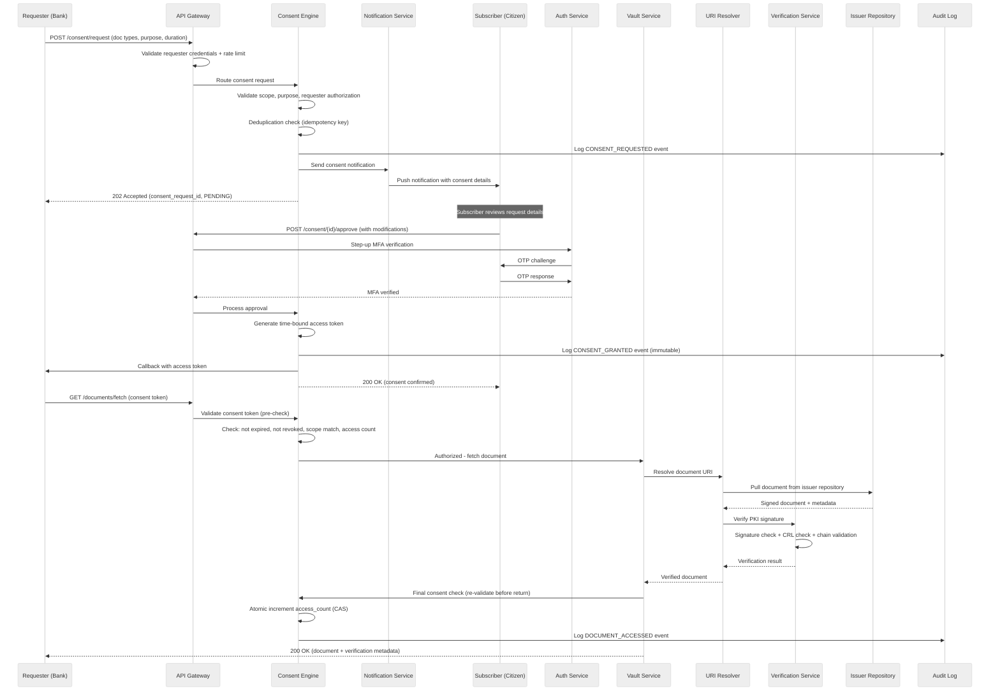
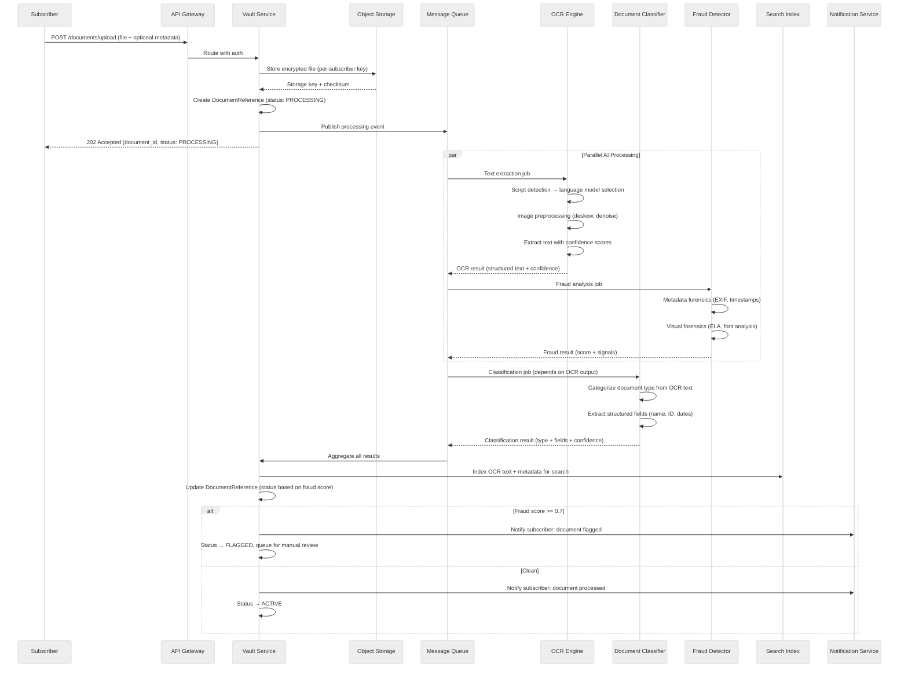
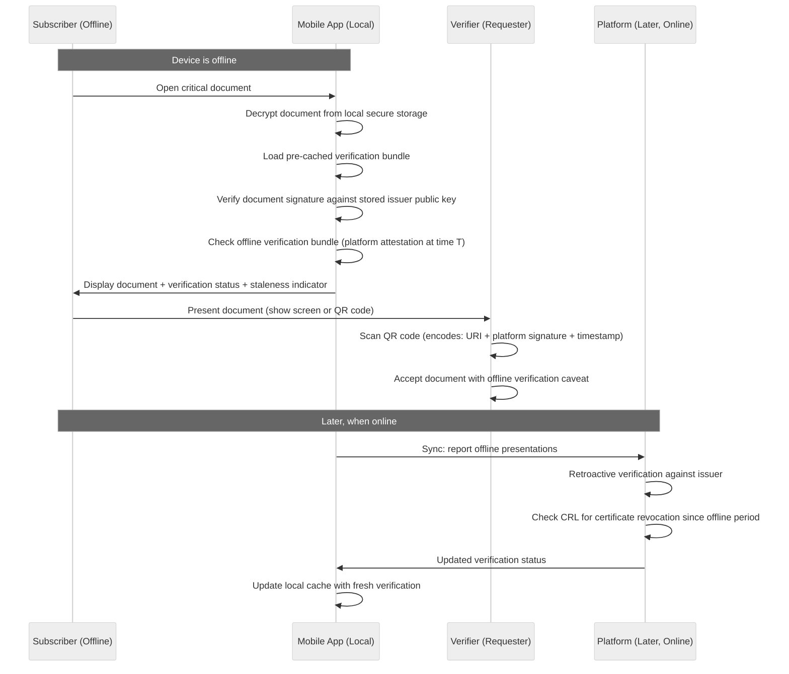

# High-Level Design — Digital Document Vault Platform

## System Context

The Digital Document Vault Platform sits at the intersection of three ecosystems: government institutions that issue official documents (1,900+ issuers), citizens who need to store, manage, and share these documents (550M+ subscribers), and organizations that need to verify documents for regulatory, commercial, or administrative purposes (2,400+ requesters). The platform acts as a trust broker—it does not create or own documents but provides the infrastructure for cryptographically verified document exchange with citizen-controlled consent. The system integrates with national identity infrastructure for authentication, certificate authorities for PKI-based document signing, and the API Setu gateway for standardized issuer/requester integration.

---

## Architecture Diagram

```mermaid
%%{init: {'theme': 'neutral'}}%%
flowchart TB
    subgraph Subscribers["Subscriber Layer"]
        WebApp["Web Portal"]
        MobileApp["Mobile App"]
        USSD["USSD Interface"]
    end

    subgraph Gateway["API Gateway Layer"]
        APIGateway["API Gateway\n(Rate Limiting, Auth, Routing)"]
        APISetu["API Setu\n(Standardized Integration Hub)"]
    end

    subgraph CoreServices["Core Platform Services"]
        AuthService["Auth Service\n(MFA, Session Mgmt)"]
        VaultService["Vault Service\n(Document Management)"]
        URIResolver["URI Resolver\n(Document Fetching)"]
        ConsentEngine["Consent Engine\n(Grant, Revoke, Audit)"]
        VerifyService["Verification Service\n(PKI, Signature Check)"]
        SearchService["Search Service\n(Semantic + Metadata)"]
        NotifService["Notification Service"]
    end

    subgraph AIServices["AI Services"]
        OCREngine["OCR Engine\n(Text Extraction)"]
        DocClassifier["Document Classifier\n(Auto-Categorization)"]
        FraudDetector["Fraud Detector\n(Tamper Detection)"]
        SmartSearch["Smart Search\n(NLP Query Understanding)"]
    end

    subgraph DataLayer["Data Layer"]
        UserDB[("User DB\n(Profiles, Devices)")]
        MetadataDB[("Metadata DB\n(URI References, Tags)")]
        ConsentDB[("Consent DB\n(Immutable Records)")]
        AuditLog[("Audit Log\n(All Events)")]
        ObjectStore[("Object Storage\n(Self-Uploaded Docs)")]
        CacheLayer[("Distributed Cache\n(Document + Session)")]
        SearchIndex[("Search Index\n(Full-Text + Semantic)")]
    end

    subgraph ExternalSystems["External Systems"]
        Issuers["Issuers\n(1,900+ Government Depts)"]
        Requesters["Requesters\n(2,400+ Organizations)"]
        IdentityProvider["National Identity\nInfrastructure"]
        PKIInfra["PKI Infrastructure\n(CAs, CRL, OCSP)"]
        MessageQueue["Message Queue\n(Async Processing)"]
    end

    WebApp & MobileApp & USSD --> APIGateway
    APIGateway --> AuthService
    APIGateway --> VaultService
    APIGateway --> ConsentEngine
    APIGateway --> SearchService

    APISetu --> URIResolver
    APISetu --> VerifyService
    APISetu --> ConsentEngine

    Issuers -->|"Push API"| APISetu
    Requesters -->|"Consent + Fetch"| APISetu

    AuthService --> IdentityProvider
    AuthService --> UserDB
    AuthService --> CacheLayer

    VaultService --> MetadataDB
    VaultService --> ObjectStore
    VaultService --> URIResolver
    VaultService --> CacheLayer

    URIResolver --> Issuers
    URIResolver --> CacheLayer

    ConsentEngine --> ConsentDB
    ConsentEngine --> AuditLog
    ConsentEngine --> NotifService

    VerifyService --> PKIInfra
    VerifyService --> CacheLayer

    VaultService --> MessageQueue
    MessageQueue --> OCREngine
    MessageQueue --> DocClassifier
    MessageQueue --> FraudDetector

    SearchService --> SearchIndex
    SearchService --> SmartSearch

    NotifService --> WebApp
    NotifService --> MobileApp

    classDef client fill:#e1f5fe,stroke:#01579b,stroke-width:2px
    classDef gateway fill:#fff3e0,stroke:#e65100,stroke-width:2px
    classDef service fill:#e8f5e9,stroke:#2e7d32,stroke-width:2px
    classDef ai fill:#e0f7fa,stroke:#00695c,stroke-width:2px
    classDef data fill:#f3e5f5,stroke:#6a1b9a,stroke-width:2px
    classDef external fill:#fffde7,stroke:#f57f17,stroke-width:2px

    class WebApp,MobileApp,USSD client
    class APIGateway,APISetu gateway
    class AuthService,VaultService,URIResolver,ConsentEngine,VerifyService,SearchService,NotifService service
    class OCREngine,DocClassifier,FraudDetector,SmartSearch ai
    class UserDB,MetadataDB,ConsentDB,AuditLog,ObjectStore,CacheLayer,SearchIndex data
    class Issuers,Requesters,IdentityProvider,PKIInfra,MessageQueue external
```



---

## Component Descriptions

### 1. API Gateway Layer

**Purpose:** Single entry point for all subscriber, issuer, and requester traffic.

**Key Responsibilities:**
- **Rate limiting** per client (subscribers get generous limits; requesters get tiered limits based on subscription)
- **Authentication** token validation and session verification
- **Request routing** to appropriate backend services based on path and client type
- **TLS termination** with 2048-bit RSA or equivalent
- **API versioning** to support backward-compatible evolution of issuer/requester APIs
- **DDoS protection** with adaptive throttling during surge periods (exam result days, tax filing deadlines)

### 2. Auth Service

**Purpose:** Multi-factor authentication and session management for all user types.

**Key Responsibilities:**
- **Subscriber authentication** via mobile OTP (primary), biometric (fallback), and device-based trusted sessions
- **Issuer/Requester authentication** via OAuth 2.0 client credentials with API key rotation
- **Session management** with configurable TTLs: 30 min for web, 24 hours for mobile, step-up re-auth for consent operations
- **Device registry** tracking trusted devices per subscriber; alerts on new device logins
- **Identity federation** with national identity infrastructure for eKYC-based verification during registration

### 3. Vault Service

**Purpose:** Core document management—the central nervous system of the platform.

**Key Responsibilities:**
- **URI reference management** for issuer-pushed documents (store URI, issuer metadata, signature hash, issuance timestamp)
- **Self-uploaded document management** with storage in object storage, metadata indexing, and triggering AI pipeline
- **Document lifecycle** tracking: issued → active → shared → archived; version management for updated documents
- **Subscriber vault operations** CRUD for personal document collections, folders, tags, favorites
- **Batch operations** for bulk issuance (receive 50,000 document URIs from a university in one API call)

### 4. URI Resolver

**Purpose:** Resolves document URIs to actual documents by querying issuer repositories.

**Key Responsibilities:**
- **URI parsing** to extract issuer ID, document type, and document ID
- **Issuer endpoint lookup** from registry to determine the correct Pull URI endpoint
- **Document fetching** via standardized Pull API with timeout management (4s hard timeout)
- **Response caching** with issuer-configurable TTLs (some documents change rarely, some frequently)
- **Fallback strategy** when issuer is unavailable: serve cached version with "verification pending" flag
- **Circuit breaker** per issuer to prevent cascade failures when an issuer's API is down

### 5. Consent Engine

**Purpose:** Manages the full lifecycle of consent—creation, approval, enforcement, revocation, and audit.

**Key Responsibilities:**
- **Consent request processing** from requesters: validate requester authorization, document scope, stated purpose
- **Subscriber notification** routing consent requests to subscriber's device for approval
- **Access token generation** upon consent approval: time-bound, scope-limited tokens that requesters use to fetch documents
- **Consent enforcement** on every document access: verify the access token is valid, not expired, not revoked, and matches the requested document
- **Revocation** instant consent withdrawal by subscriber; invalidates all associated access tokens
- **Immutable audit trail** every consent event (request, approve, deny, revoke, access) written to append-only log

### 6. Verification Service

**Purpose:** Cryptographic verification of document authenticity.

**Key Responsibilities:**
- **Digital signature verification** using the issuer's public key from their PKI certificate
- **Certificate chain validation** from the document's signing certificate up to the trusted root CA
- **CRL/OCSP checking** to verify the signing certificate has not been revoked
- **Document integrity** hash comparison to detect any modification after signing
- **QR code verification** for physical-to-digital verification flow (scan QR on printed document → verify online)
- **Verification result caching** to avoid redundant PKI operations for recently verified documents

### 7. AI Services

**Purpose:** Intelligent document processing for self-uploaded documents and search enhancement.

**Key Responsibilities:**
- **OCR Engine**: Extract text from scanned documents and images; supports multiple scripts (Devanagari, Tamil, Telugu, etc.) and mixed-language documents; outputs structured text with confidence scores
- **Document Classifier**: Categorize uploaded documents into standard types (identity proof, address proof, education certificate, income proof, etc.); suggest correct metadata tags
- **Fraud Detector**: Analyze uploaded documents for tampering indicators—metadata inconsistencies, visual artifacts, font anomalies, copy-paste detection; flag suspicious documents for manual review
- **Smart Search**: Natural language query understanding, synonym expansion, cross-language search (query in Hindi, match English document names), and contextual suggestions

---

## Data Flow

### Flow 1: Document Issuance (Issuer Push)

```
1. Issuer digitally signs a document using their PKI certificate
2. Issuer calls Push API via API Setu with document metadata + signature
3. API Setu validates issuer credentials and routes to Vault Service
4. Vault Service validates the digital signature using Verification Service
5. Vault Service stores the document URI reference in Metadata DB
6. Vault Service generates a persistent URI for the document
7. Notification Service sends push notification to subscriber
8. Subscriber sees new document in their vault on next access
9. Audit Log records the issuance event with issuer, subscriber, timestamp
```

### Flow 2: Consent-Based Document Sharing (Requester Access)

```
1. Requester initiates consent request via API Setu (specifies document type, purpose, duration)
2. Consent Engine validates requester authorization and request parameters
3. Consent Engine sends consent request notification to subscriber's device
4. Subscriber reviews request details (which docs, which org, what purpose, how long)
5. Subscriber authenticates (step-up MFA) and approves/denies
6. If approved: Consent Engine generates time-bound access token and records consent
7. Requester receives access token via callback URL
8. Requester calls document fetch API with access token
9. Vault Service verifies token against Consent Engine, resolves document URI
10. URI Resolver fetches document from issuer, Verification Service confirms authenticity
11. Document returned to requester with verification metadata
12. Audit Log records: consent grant, document access, requester identity, timestamp
13. When consent expires: access token invalidated, no further access possible
```

### Flow 3: Self-Upload with AI Processing

```
1. Subscriber uploads a scanned document via mobile app or web portal
2. API Gateway routes to Vault Service with subscriber authentication
3. Vault Service stores original file in Object Storage with encryption at rest
4. Vault Service publishes processing event to Message Queue
5. OCR Engine picks up event: extracts text, identifies language, outputs structured text
6. Document Classifier picks up OCR output: categorizes document type, suggests tags
7. Fraud Detector analyzes original image: checks metadata, visual artifacts, consistency
8. Results aggregated: OCR text indexed in Search Index, classification metadata in Metadata DB
9. If fraud detected: document flagged, subscriber notified, document marked "unverified"
10. If clean: document marked "self-uploaded, verified by AI" with confidence score
11. Subscriber sees classified, searchable document in their vault
```

---

## Key Design Decisions

| Decision | Choice | Trade-off |
|---|---|---|
| **URI reference vs. document copy** | Store URIs pointing to issuer repositories, not document copies | Pro: eliminates storage duplication, documents always current, vault is not a high-value data target. Con: depends on issuer availability; requires robust caching and fallback |
| **Consent as immutable log** | Append-only consent records, never modified or deleted | Pro: legal-grade audit trail, non-repudiation. Con: storage grows indefinitely; requires efficient querying over immutable log for active consent lookup |
| **PKI verification on every access** | Verify digital signature on each document retrieval, not just first access | Pro: detects certificate revocation, ensures ongoing authenticity. Con: adds 50-100ms per retrieval; mitigated by verification result caching with short TTL |
| **Asynchronous AI pipeline** | OCR, classification, and fraud detection run asynchronously after upload | Pro: upload latency not affected by AI processing time; can retry failed AI jobs. Con: subscriber sees "processing" state for 5-15 seconds; must handle race condition where subscriber searches before OCR completes |
| **Multi-factor auth tied to national identity** | Authentication via national identity-linked mobile OTP, not username/password | Pro: stronger identity guarantee, no password management. Con: SIM swap attacks as demonstrated in past incidents; requires device binding and anomaly detection |
| **Federated issuer model (no document copies)** | Issuers maintain their own document repositories; vault resolves on demand | Pro: data sovereignty (issuers control their data), corrections propagate automatically. Con: 1,900+ issuers with varying API reliability; requires issuer health monitoring and SLA enforcement |
| **Offline-capable mobile app** | Pre-cache critical documents on device with local signature verification | Pro: documents available even during platform outage or no connectivity. Con: cached documents may be stale; offline verification cannot check CRL; device theft exposes cached documents |

---

## Sequence Diagrams

### Consent-Based Document Sharing (Detailed)



### Self-Upload with AI Processing Pipeline



### Offline Document Presentation Flow



---

## Cross-Cutting Concerns

### Multi-Language and Accessibility

The platform serves 550M+ users across 28 states with 22 official languages and vastly different digital literacy levels:

- **UI Localization**: All user-facing interfaces available in 22 languages; document metadata localized where issuers provide translations
- **USSD Interface**: Text-based document access for feature phones on 2G networks; menu-driven navigation for subscribers without smartphones
- **Screen Reader Support**: WCAG 2.1 AA compliance for web portal; document metadata exposed as accessible text
- **Low-Bandwidth Mode**: Progressive document loading—metadata first (2 KB), then thumbnail (20 KB), then full document on demand (150 KB); critical for rural 2G users

### Versioning and Backward Compatibility

With 1,900+ issuers and 2,400+ requesters integrated via API, backward compatibility is critical:

- **API Versioning**: Semantic versioning with mandatory 12-month deprecation window; v1 and v2 APIs served simultaneously during migration
- **Document Schema Evolution**: Issuers may update document schemas (adding fields, changing formats); the vault stores schema version with each document reference and handles schema migration at query time
- **Consent Token Format Evolution**: Consent tokens are JWT with versioned claims; new consent dimensions (e.g., field-level access added in v2) are backward-compatible—v1 tokens still work but grant full-document access

### Rate Limiting Strategy

| Client Type | Rate Limit | Burst Allowance | Overage Behavior |
|---|---|---|---|
| **Subscriber (authenticated)** | 100 requests/min | 200 requests/min for 30s | Soft throttle: degrade to cached-only |
| **Requester (Tier 1 — banks)** | 1,000 requests/min | 2,000/min for 60s | Queue excess; 429 after queue full |
| **Requester (Tier 2 — employers)** | 200 requests/min | 400/min for 30s | 429 with Retry-After header |
| **Requester (Tier 3 — others)** | 50 requests/min | 100/min for 15s | 429 immediate |
| **Issuer (Push API)** | 500 documents/min | 5,000/min during bulk events | Backpressure with queue-based ingestion |
| **Public Verification** | 30 requests/min per IP | 60/min for 10s | CAPTCHA challenge after limit |

### Error Handling Philosophy

| Error Type | Platform Response | Subscriber Experience |
|---|---|---|
| **Issuer temporarily unavailable** | Serve cached document with "verification pending" | See document with staleness indicator; retry verification in background |
| **Consent token expired** | Return 403 with clear error code | Requester re-initiates consent flow; subscriber notified |
| **PKI verification failure** | Log security event; do not serve document | "Document verification failed—contact issuer" message |
| **OCR processing failure** | Retry 3× with exponential backoff; fallback to manual classification | "Processing your document..." with longer estimated time |
| **Rate limit exceeded** | 429 with Retry-After header | Graceful degradation message with estimated wait time |
| **Network partition between regions** | Fail-closed for consent access; fail-open for revocations | "Temporarily unavailable—try again in a few minutes" |
