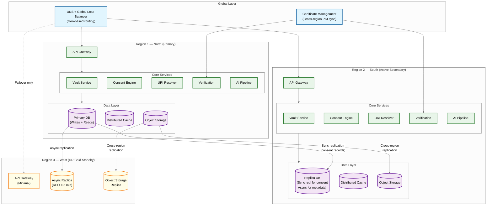

# Scalability & Reliability — Digital Document Vault Platform

## Scaling Strategy

### Horizontal Scaling by Service

Each microservice scales independently based on its load profile:

| Service | Scaling Trigger | Min Instances | Max Instances | Scaling Metric |
|---|---|---|---|---|
| **API Gateway** | Request rate | 8 | 50 | QPS per instance > 2,000 |
| **Auth Service** | Authentication rate | 6 | 30 | Auth requests/sec > 500/instance |
| **Vault Service** | Document operations | 10 | 60 | QPS per instance > 300 |
| **URI Resolver** | Pull URI fan-out | 8 | 40 | Pending resolution queue > 500 |
| **Consent Engine** | Consent operations | 4 | 20 | Active consent sessions > 200/instance |
| **Verification Service** | PKI operations | 6 | 30 | Crypto operations/sec > 400/instance |
| **Search Service** | Query rate | 4 | 20 | Search QPS > 200/instance |
| **OCR Engine** | Upload queue depth | 4 | 30 | Queue depth > 1,000 |
| **Notification Service** | Notification fan-out | 4 | 20 | Pending notifications > 5,000 |

### Data Partitioning Strategy

**User Data (Metadata DB, Consent DB)**: Hash-partitioned by `subscriber_id`. With 550M+ users, partition into 256 shards. Each shard handles ~2.1M subscribers. This ensures that all operations for a single subscriber (document listing, consent management, activity log) hit a single shard—no cross-shard joins.

**Document References**: Co-located with the subscriber's shard (partitioned by `subscriber_id`). A subscriber's documents are always on the same shard as their profile.

**Audit Events**: Time-partitioned (monthly partitions) with a secondary index on `subscriber_id`. Recent months are hot (frequent reads for activity log), older months are cold (archived to cheaper storage, accessed only for compliance audits).

**Self-Uploaded Documents (Object Storage)**: Content-addressed storage with consistent hashing. The object key includes the subscriber_id prefix for locality, enabling efficient per-subscriber operations (e.g., "delete all documents for this subscriber" for DPDP Act right-to-erasure).

**Search Index**: Partitioned by document type and subscriber region. This aligns with common search patterns (a subscriber typically searches their own documents, and document types cluster queries efficiently).

### Read-Heavy Optimization

The platform is extremely read-heavy: documents are written once (Push API or upload) but read hundreds or thousands of times (every time the subscriber accesses them, every time a requester verifies them). The read:write ratio is approximately 50:1.

**Multi-Layer Caching Architecture:**

```
Request → CDN (static assets, document thumbnails)
        → API Gateway Cache (auth token validation, rate limit counters)
          → L1 In-Memory Cache (per-node, 2GB, 5-min TTL)
            → L2 Distributed Cache (shared, 500GB, 1-24hr TTL)
              → L3 Persistent Cache (object storage, 7-day TTL)
                → Origin (Metadata DB for URI refs, Object Storage for uploads)
                  → Issuer API (Pull URI resolution, only for cache misses)
```

**Cache Hit Rate Targets:**
- L1: 40% of all reads (hot documents like national ID, PAN card accessed repeatedly)
- L2: 35% of L1 misses
- L3: 20% of L2 misses
- Aggregate: 85%+ of reads served from cache, only 15% hit origin or issuer APIs

---

## Fault Tolerance Patterns

### Circuit Breaker for Issuer APIs

Each issuer's API is wrapped in a circuit breaker with three states:

```
CLOSED (normal operation):
    - All requests flow through to issuer
    - Track failure rate over sliding 1-minute window
    - IF failure rate > 50% over 20+ requests: transition to OPEN

OPEN (issuer is down):
    - Immediately return cached version or error (no requests to issuer)
    - After 30 seconds: transition to HALF_OPEN

HALF_OPEN (testing recovery):
    - Allow 1 probe request through to issuer
    - IF success: transition to CLOSED
    - IF failure: transition back to OPEN with increased timeout (exponential backoff)
```

**Per-Issuer Configuration**: Critical issuers (tax department, identity authority) have tighter thresholds (20% failure rate triggers OPEN) and shorter recovery timeouts (15 seconds). Less critical issuers use default thresholds.

### Bulkhead Isolation

Issuer API calls are isolated into separate thread pools per issuer category:

```
Pool 1: Identity Issuers (national ID, PAN) — 100 threads
Pool 2: Education Issuers (universities, exam boards) — 50 threads
Pool 3: Transport Issuers (driving license, vehicle registration) — 30 threads
Pool 4: Financial Issuers (tax, insurance) — 50 threads
Pool 5: All Other Issuers — 30 threads
```

If education issuers are slow during exam season, they can't exhaust the thread pool used for identity document resolution. This prevents cross-issuer cascade failures.

### Retry Strategy

```
FUNCTION retry_with_backoff(operation, max_retries=3):
    FOR attempt IN 1..max_retries:
        TRY:
            result = operation.execute()
            RETURN result
        CATCH RetryableException:
            IF attempt == max_retries:
                THROW
            delay = min(100ms * 2^attempt + random(0, 50ms), 2000ms)
            sleep(delay)
        CATCH NonRetryableException:
            THROW  // Don't retry authentication failures, invalid requests, etc.
```

Retryable: network timeouts, 503 Service Unavailable, connection reset.
Non-retryable: 400 Bad Request, 401 Unauthorized, 403 Forbidden, signature verification failure.

---

## Disaster Recovery

### Multi-Region Architecture

```
Region 1 (Primary - North):
    ├── Full service deployment
    ├── Primary database (synchronous replication to Region 2)
    ├── Object storage (cross-region replication)
    └── All AI services

Region 2 (Secondary - South):
    ├── Full service deployment (warm standby, handles 30% of read traffic)
    ├── Database replica (read replica, promotes to primary on failover)
    ├── Object storage (cross-region replica)
    └── All AI services (active for regional traffic)

Region 3 (DR - West):
    ├── Cold standby (can be activated in 30 minutes)
    ├── Asynchronous database replica (RPO: < 5 minutes)
    ├── Object storage replica
    └── Minimal service deployment (scales up on activation)
```

### Failover Procedure

1. **Detection** (0-2 minutes): Health check failures from Region 1 detected by global load balancer; automated alerts triggered.

2. **Decision** (2-5 minutes): Automated failover for predefined scenarios (data center power failure, network partition). Manual approval required for ambiguous scenarios.

3. **Traffic Shift** (5-10 minutes): Global load balancer redirects all traffic to Region 2. DNS TTL is 60 seconds, so full traffic shift takes ~2 minutes after DNS update.

4. **Database Promotion** (5-15 minutes): Region 2 read replica promotes to primary. Any synchronous replication lag is zero (synchronous mode). Asynchronous replication to Region 3 resumes from new primary.

5. **Validation** (10-15 minutes): Smoke tests verify all critical paths (document retrieval, consent flow, verification) are operational from Region 2.

**Lessons from December 2024 Outage**: The historical outage was caused by a single data center power failure that took two days to resolve. The multi-region architecture ensures no single data center failure can cause platform-wide downtime. The 15-minute RTO target is based on the principle that citizens should never wait more than 15 minutes for document access to be restored.

### Data Backup Strategy

| Data Type | Backup Frequency | Retention | Backup Method |
|---|---|---|---|
| **User Profiles** | Continuous (CDC) | 90 days point-in-time | Streaming replication + daily snapshots |
| **Document Metadata** | Continuous (CDC) | 90 days point-in-time | Streaming replication + daily snapshots |
| **Consent Records** | Continuous (CDC) | 7 years (legal requirement) | Streaming replication + monthly archival to cold storage |
| **Audit Logs** | Continuous (CDC) | 7 years (legal requirement) | Append-only, monthly archival to immutable storage |
| **Self-Uploaded Documents** | Cross-region replication | Indefinite (until subscriber deletes) | Object storage replication + quarterly integrity checks |
| **Search Index** | Rebuilable from source | Not backed up (can be rebuilt from Metadata DB in 4-6 hours) | N/A |
| **Cache** | Not backed up | Ephemeral | N/A |

---

## Capacity Planning and Auto-Scaling

### Predictable Surge Planning

The platform has known traffic spikes tied to the national calendar:

| Event | Timing | Impact | Pre-Scaling Action |
|---|---|---|---|
| **Board Exam Results** | May-June, July | 10-20× spike on specific issuers | Pre-push results; 5× URI Resolver capacity; issuer-specific cache warming |
| **Tax Filing Deadline** | July 31 | 5× spike on tax document access | Pre-warm tax document cache; 3× Vault Service capacity |
| **University Admissions** | August-September | 8× spike on education documents | Coordinate with universities for pre-push; 4× capacity |
| **Year-End/New Year** | December-January | 3× general spike | General 2× capacity increase |
| **Government Job Applications** | Throughout year (deadline-driven) | 5× spike on identity + education documents | Monitor application deadlines; scale 48 hours before |

### Auto-Scaling Rules

```
RULE: Scale URI Resolver
    WHEN: pending_resolution_queue_depth > 500 FOR 2 minutes
    ACTION: Add 2 instances (max 40)
    COOLDOWN: 3 minutes

RULE: Scale Vault Service for Exam Days
    WHEN: calendar.is_exam_result_day() AND current_hour BETWEEN 8 AND 20
    ACTION: Set min_instances = 40 (4× normal)
    REVERT: At 22:00 on the same day

RULE: Scale OCR Pipeline
    WHEN: ocr_queue_depth > 5000 FOR 5 minutes
    ACTION: Add 4 GPU instances (max 30)
    COOLDOWN: 10 minutes

RULE: Emergency Scale-Out
    WHEN: error_rate > 5% FOR 3 minutes
    ACTION: Double all service instance counts
    ALERT: Page on-call SRE
    COOLDOWN: 5 minutes
```

---

## Multi-Region Considerations

### Data Sovereignty

All subscriber data must remain within national borders. The multi-region architecture operates across geographically distributed data centers within the country. Cross-border data transfer is prohibited except for verification responses to foreign requesters (e.g., a foreign university verifying an Indian citizen's degree)—and even then, only the verification result is shared, not the document content.

### Regional Affinity Routing

Subscribers are assigned to a primary region based on their registration location:
- **North Region**: Subscribers from northern states → Primary: Region 1
- **South Region**: Subscribers from southern states → Primary: Region 2
- **All regions**: Can be served from any region in case of failover

This routing reduces cross-region latency for the common case (subscriber accessing their own vault from their home region) while maintaining the ability to serve any subscriber from any region.

### Consistency Model

- **Consent Records**: Strong consistency (synchronous replication). A consent grant or revocation must be immediately visible across all regions to prevent unauthorized access or wrongful denial.
- **Document Metadata**: Eventual consistency with short lag (< 1 second). New document issuance might not be visible in the secondary region for up to 1 second—acceptable since the subscriber receives a push notification with a deep link regardless.
- **Audit Logs**: Eventual consistency (< 5 seconds). Audit logs are append-only and ordering within a subscriber's log is maintained by the primary region.
- **Cache**: Per-region, independently managed. A cache hit in Region 1 doesn't imply a cache hit in Region 2, which is fine because cache warming is driven by local access patterns.

### Split-Brain Prevention

During a network partition between regions, the system uses a consensus-based leader election for the primary database. Only the region that maintains quorum can accept writes. The partitioned region continues serving reads from its local replica but redirects write operations (consent grants, document uploads) to the quorum-holding region via an alternative network path. If no alternative path exists, write operations are queued locally with a conflict resolution strategy (last-writer-wins for profile updates; reject-and-retry for consent operations to prevent inconsistent consent state).

---

## Multi-Region Architecture Diagram



---

## Back-Pressure Mechanisms

### Issuer-Level Back-Pressure

When an issuer's API is slow or overloaded, the platform must prevent URI resolution requests from accumulating unboundedly:

```
FUNCTION apply_issuer_backpressure(issuer_id, request):
    issuer_state = load_tracker.get(issuer_id)

    // Level 1: Soft back-pressure (latency degrading)
    IF issuer_state.p99_latency > 2 * issuer_state.sla_latency:
        // Reduce concurrency to give issuer breathing room
        issuer_state.max_concurrent = issuer_state.max_concurrent * 0.5
        // Increase cache TTL to reduce fetch frequency
        issuer_state.cache_ttl_multiplier = 2.0

    // Level 2: Hard back-pressure (errors increasing)
    IF issuer_state.error_rate > 30%:
        // Shed new requests; serve only from cache
        IF cache.has(request.document_uri):
            RETURN serve_from_cache(request, "BACKPRESSURE_CACHED")
        ELSE:
            RETURN queue_for_later(request, max_wait=30s)

    // Level 3: Circuit breaker (issuer down)
    IF issuer_state.error_rate > 50%:
        circuit_breaker.open(issuer_id)
        RETURN serve_from_cache_or_error(request)

    // Normal: proceed with configured concurrency
    RETURN resolve_with_concurrency_limit(issuer_id, request, issuer_state.max_concurrent)
```

### Platform-Level Load Shedding

During extreme load (exam result days), the platform applies progressive load shedding:

| Load Level | Trigger | Action |
|---|---|---|
| **Normal** | QPS < 80% capacity | All features active |
| **Elevated** | QPS 80-100% capacity | Disable non-critical features (search suggestions, AI classification for uploads) |
| **High** | QPS 100-130% capacity | Serve all document retrievals from cache only (skip issuer fetch); queue uploads |
| **Critical** | QPS > 130% capacity | Rate-limit new sessions; priority queue for consent operations and verifications |
| **Emergency** | Error rate > 10% | Activate all standby capacity; alert incident commander; disable self-upload processing |

---

## Chaos Engineering Experiments

### Experiment 1: Issuer Unavailability Blast Radius

**Hypothesis**: If the top-5 most-accessed issuers (identity, tax, education, transport, insurance) all become unavailable simultaneously, the platform should maintain > 99% document retrieval success rate using cached data.

```
Experiment Design:
    1. Identify top-5 issuers by daily query volume
    2. Inject network partition between platform and all 5 issuer endpoints
    3. Measure:
        - Document retrieval success rate (target: > 99% from cache)
        - Percentage of requests returning "CACHED_PENDING_VERIFICATION"
        - Cache hit rate for these issuers specifically
        - Time to detect and open circuit breakers
    4. Duration: 1 hour during business hours
    5. Rollback: Remove network partition

Expected Result: 85%+ cache hit rate covers most requests;
    remaining 15% get degraded response with cached version.
    Zero 5xx errors.
```

### Experiment 2: Consent Database Failover

**Hypothesis**: If the primary consent database becomes unavailable, the system should promote the secondary within 30 seconds and resume consent operations without data loss (RPO = 0 for consent).

```
Experiment Design:
    1. During active consent operations (100+ concurrent sessions)
    2. Kill the primary consent database instance
    3. Measure:
        - Time to detect failure
        - Time to promote secondary to primary
        - Number of consent operations that fail during failover
        - Consent record integrity after failover (compare checksums)
        - Any consent operations that were "lost" (committed on old primary, not replicated)
    4. Verify: Zero consent records lost (synchronous replication guarantee)
```

### Experiment 3: SIM Swap Detection Under Load

**Hypothesis**: The SIM swap detection pipeline can process telecom SIM-change events within 60 seconds and block affected accounts before an attacker can complete OTP authentication.

```
Experiment Design:
    1. Simulate 1,000 concurrent SIM change events from telecom partner API
    2. Simultaneously attempt OTP authentication for the same 1,000 accounts
    3. Measure:
        - Time from SIM change event to account lockdown
        - Number of authentication attempts that succeed before lockdown
        - False positive rate (legitimate SIM replacements blocked)
    4. Target: 0 successful authentications for SIM-swapped accounts
```

### Experiment 4: Region-Level Failover

**Hypothesis**: Complete Region 1 failure triggers automatic failover to Region 2 within 15 minutes with zero consent data loss.

```
Experiment Design:
    1. Simulate Region 1 failure (all services, DB, cache)
    2. Measure:
        - DNS failover detection time
        - Traffic shift completion time
        - Database promotion time in Region 2
        - Consent record consistency check (Region 2 vs pre-failure Region 1)
        - End-to-end latency for subscribers during and after failover
        - Offline mode activation rate on mobile apps
    3. Target: < 15 min total RTO; 0 consent records lost
```

---

## Capacity Headroom and Pre-Scaling Calendar

```
FUNCTION precompute_scaling_calendar():
    // Known national events with predictable impact
    scaling_events = [
        Event("CBSE_Results",     month=5,  day=estimated, multiplier=5.0, services=["uri_resolver", "vault"]),
        Event("ICSE_Results",     month=5,  day=estimated, multiplier=3.0, services=["uri_resolver"]),
        Event("State_Board",      month=6,  day=varies,    multiplier=4.0, services=["uri_resolver"]),
        Event("Tax_Deadline",     month=7,  day=31,        multiplier=3.0, services=["vault", "consent"]),
        Event("JEE_Results",      month=7,  day=estimated, multiplier=4.0, services=["uri_resolver"]),
        Event("Univ_Admissions",  month=8,  day=1,         multiplier=3.0, services=["uri_resolver", "consent"]),
        Event("DPDP_Audit_Q3",    month=9,  day=1,         multiplier=2.0, services=["consent", "audit"]),
    ]

    FOR event IN scaling_events:
        // Pre-scale 24 hours before expected event
        schedule_prescale(event.date - 24_hours, event.services, event.multiplier)
        // Post-scale: maintain for 48 hours, then gradual step-down
        schedule_stepdown(event.date + 48_hours, event.services, step=0.25, interval=6_hours)
```

## AI Release Ladder

Every AI model or capability change in this system MUST follow this rollout sequence:

| Stage | Description | Gate Criteria |
|-------|-------------|---------------|
| 1. Offline Evaluation | Benchmark against historical ground truth | Meets baseline metrics |
| 2. Shadow Mode | Run in parallel with production, compare outputs | No regression on key metrics |
| 3. Canary (Blast-Radius Capped) | 1-5% traffic, human review of all outputs | Error rate < threshold |
| 4. Human-Reviewed Production | AI recommends, human approves all actions | Approval rate > 90% |
| 5. Limited Autonomous Production | AI acts within pre-approved boundaries | Continuous monitoring, no alerts |
| 6. Instant Rollback | One-click revert to previous model/rules | < 5 min rollback time |

**Note:** AI capabilities that directly interact with end users or execute actions on their behalf must reach Stage 4 (human-reviewed production) with domain-expert sign-off before deployment. Stage 5 limited autonomy applies only to well-bounded, low-risk action categories with established rollback procedures.
