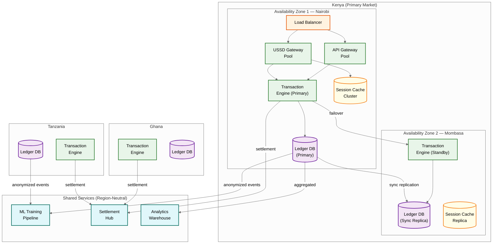

# Scalability & Reliability — AI-Native Mobile Money Super App Platform

## Scaling Strategy: From 1,000 to 12,000 TPS

### Current Scale and Growth Trajectory

M-Pesa's infrastructure evolved from ~1,000 TPS (2020) to 4,000 TPS (2024) to a target of 8,000–12,000 TPS (2026) as the platform transitioned to cloud-native architecture. The scaling challenge is not just raw throughput—it's maintaining sub-second latency, exactly-once financial semantics, and 99.995% availability while scaling 12× in 5 years.

### Ledger Scaling — The Core Slowest part of the process

The double-entry ledger is the serialization point for all financial transactions. Every P2P transfer, cash-in, cash-out, bill payment, and loan disbursement must write to this ledger with ACID guarantees. Scaling strategies:

**1. Wallet-Level Sharding:** Partition wallets across database shards using consistent hashing on `wallet_id`. A P2P transfer between two wallets on different shards requires a distributed transaction (two-phase commit). To minimize cross-shard transactions:
- Route wallet pairs that frequently transact together to the same shard (affinity-based sharding using transaction graph analysis)
- For cross-shard transactions, use a saga pattern with compensation: debit sender (shard A) → credit receiver (shard B); if credit fails, compensate by crediting sender back

**2. Country-Level Isolation:** Each country's ledger operates independently—no cross-country ledger transactions exist (cross-border remittance uses corridor-specific settlement). This provides natural isolation: Kenya's peak hours (8 AM–8 PM EAT) partially overlap with but don't fully coincide with Ghana's (8 AM–8 PM GMT), distributing load temporally.

**3. Read Replicas for Non-Transactional Queries:** Balance checks, transaction history, and analytics queries route to read replicas with <100ms replication lag. Only balance-modifying operations hit the primary.

**4. Hot Wallet Partitioning:** Super-agent wallets, merchant wallets, and system fee wallets receive thousands of concurrent transactions. These hot wallets use balance bucketing: the wallet's balance is split across 10–50 partitions, each updated independently. Total balance = sum of partitions. This reduces contention by the partition factor.

### USSD Session Scaling — Millions of Concurrent Sessions

At peak, the platform handles ~1,700 USSD sessions per second, with an average session duration of 35 seconds. This means ~60,000 concurrent sessions. Scaling considerations:

**Session Store:** In-memory distributed cache with hash-based sharding on `session_id`. Each session consumes ~500 bytes. At 60,000 concurrent sessions: 30 MB total—trivially fits in memory. The Slowest part of the process isn't storage; it's the per-MNO connection pool to USSD gateways.

**MNO Gateway Connections:** Each MNO USSD gateway limits concurrent connections (typically 50–500 per application). With 3–5 MNOs per country and 7 countries, the platform maintains 100+ gateway connections. Connection pooling with backpressure prevents overwhelming any single gateway.

**Geographic Routing:** USSD sessions are routed to the nearest data center based on the originating MNO's gateway location. This minimizes network latency (critical for the 500ms-per-screen budget) and keeps session state local to one data center (no cross-DC session replication needed given the ephemeral nature of USSD sessions).

### Fraud Detection Scaling

The fraud detection engine must evaluate every transaction inline (<200ms). At 12,000 TPS peak, this means 12,000 ML inference calls per second:

**Feature Store:** Pre-computed features (user behavioral profile, transaction velocity counters, device history) are cached in a low-latency key-value store. Feature retrieval: <5ms.

**Model Serving:** The ML model ensemble runs on dedicated inference nodes with GPU acceleration for the neural network component and CPU for the gradient boosted tree component. Horizontal scaling: add inference nodes behind a load balancer. Each node handles ~1,000 inferences/second.

**Rule Engine:** The fast rule engine (SIM swap check, velocity check, blacklist) runs on the transaction processing nodes themselves (no network hop). Rules are synced from a central configuration store with eventual consistency (1-minute propagation).

---

## Fault Tolerance in Infrastructure-Constrained Environments

### MNO USSD Gateway Failure

MNO gateways are the single point of failure the platform cannot fully control. When a gateway becomes unresponsive:

1. **Detection:** Health checks every 5 seconds; declare unhealthy after 3 consecutive failures (15 seconds).
2. **Failover:** If the MNO provides a secondary gateway, route traffic there. If not, USSD service for that MNO is unavailable—no platform-side workaround exists.
3. **Mitigation:** Push notification to app users on that MNO suggesting they use the app instead of USSD. SMS broadcast to frequent USSD users: "USSD temporarily unavailable. Dial *334# to retry in 10 minutes."
4. **Queue-and-replay:** For pending USSD sessions that were interrupted, mark as orphaned and send SMS fallback if transactions were in-flight.

### Power and Connectivity Outages

Entire regions may lose connectivity due to power outages affecting cell towers (common in rural Africa and during storm seasons):

1. **Regional failover:** If a data center loses connectivity to the MNO gateways serving a region, transactions from that region simply stop arriving—no platform action needed for active transactions.
2. **Agent offline mode:** Agents in the affected area switch to offline mode on their POS devices. Transactions are recorded locally with cryptographic tokens and synced when connectivity returns.
3. **Flood control on recovery:** When connectivity returns, the platform receives a burst of store-and-forward transactions from all agents and devices in the affected region simultaneously. The ingestion pipeline uses rate limiting and priority queuing (critical transactions first, balance checks last) to absorb the burst without overloading the ledger.

### Database Failover

**Primary-secondary replication** with synchronous writes to the primary and one synchronous replica (zero data loss). Asynchronous replication to 1-2 additional replicas for read scaling.

**Failover procedure:**
1. Primary failure detected (heartbeat timeout: 5 seconds)
2. Synchronous replica promoted to primary (automatic, <30 seconds)
3. All writes routed to new primary
4. Old primary, when recovered, joins as a new replica
5. RTO: <60 seconds. RPO: 0 (zero data loss for committed transactions)

**Split-brain prevention:** Fencing mechanism ensures only one primary can accept writes at any time. The old primary, if it recovers while the new primary is active, is prevented from accepting writes until it acknowledges the new primary's leadership.

---

## Disaster Recovery

### Multi-Region Architecture

The platform operates in an active-passive configuration across two geographic regions per country:

- **Active region:** Handles all traffic. Located near the primary MNO infrastructure in-country (e.g., Nairobi for Kenya operations).
- **Passive region:** Receives synchronous ledger replication and asynchronous replication for all other data. Located in a different city or neighboring country.
- **DR failover:** If the active region is completely lost, the passive region is promoted. RTO: <5 minutes. RPO: 0 for ledger data, <1 minute for other data.

### Ledger Integrity Verification

Continuous background process verifies ledger integrity:

1. **Balance reconciliation:** Sum of all wallet balances must equal the total held in partner bank trust accounts. Run hourly.
2. **Double-entry verification:** For every journal entry, total debits must equal total credits. Run continuously on the event stream.
3. **Cross-region comparison:** Compare ledger checksums between active and passive regions. Any divergence triggers an alert and investigation before failover is permitted.

---

## Offline and Store-and-Forward Transaction Handling

### Smartphone App Offline Mode

The smartphone app supports limited offline functionality:

1. **Balance display:** Shows the last-known balance with a "last updated" timestamp and a visual warning that the balance may not be current.
2. **Transaction queuing:** Users can initiate P2P transfers offline. The app validates the request locally (amount ≤ last-known balance, recipient format is valid) and queues it.
3. **Sync on reconnect:** When connectivity returns, queued transactions are submitted in chronological order. Each transaction goes through the full pipeline (idempotency check, fraud check, ledger write). If a transaction fails (e.g., insufficient balance because another transaction was processed from another channel), the user is notified.
4. **Conflict resolution:** If the same wallet was modified from both the app (queued offline) and USSD (online) simultaneously, the ledger's optimistic concurrency control resolves: whichever transaction commits first wins; the second transaction retries with the updated balance.

### Agent POS Offline Mode

Agent POS devices support a more robust offline mode because they handle cash transactions where the customer is physically present:

1. **Offline transaction limit:** Agents can process up to 20 offline transactions or KES 100,000 total (whichever comes first) before they must sync.
2. **Cryptographic tokens:** Each offline transaction is signed with the device's private key (hardware-backed on modern POS devices). The token includes: agent ID, customer MSISDN, amount, timestamp, and a monotonically increasing sequence number (prevents replay).
3. **Batch sync:** When connectivity returns, all offline transactions are submitted as a batch. The platform validates each token, checks cumulative float availability, and commits valid transactions.
4. **Float over-commitment risk:** If an agent processes 20 cash-in transactions offline (each debiting their e-float), but their actual e-float only covers 15, the platform commits the first 15 and rejects the last 5. The agent is responsible for resolving the rejected transactions with the affected customers. This risk is mitigated by conservative offline float limits (the offline limit is set well below the agent's actual float balance).

---

## Multi-Country Deployment Architecture

### Regulatory-Driven Data Isolation

Financial regulators in most African countries require that customer financial data resides within the country's borders (data sovereignty). The platform enforces this through:

1. **Country-specific database clusters:** Each country's ledger, wallet, and customer data runs on dedicated database clusters within that country's designated data center. No cross-country data replication for customer financial data.
2. **Shared platform services:** Non-financial services (ML model training infrastructure, developer API gateway, analytics pipeline) run in a centralized location, processing only anonymized/aggregated data.
3. **Country configuration layer:** Regulatory rules (transaction limits, KYC requirements, reporting thresholds, fee structures) are parameterized per country. A new country deployment involves: infrastructure provisioning, regulatory configuration, MNO integration, and agent network onboarding—the core transaction engine code is shared.

### Cross-Border Remittance

Transferring money between countries (e.g., Kenya → Tanzania) uses a corridor-based settlement model:

1. **Sender initiates:** Debits sender's wallet in KES.
2. **FX conversion:** Platform applies the corridor-specific exchange rate (sourced from a rate provider, refreshed every 15 minutes).
3. **Settlement:** The sender-country platform sends a settlement instruction to the receiver-country platform via a secure API.
4. **Receiver credit:** Receiver's wallet is credited in TZS.
5. **Netting:** Actual fund movement between the two country platforms' trust accounts is netted daily or hourly (depending on corridor volume), reducing the number of cross-border bank transfers.

For pan-African interoperability, the platform integrates with PAPSS (Pan-African Payment and Settlement System), which enables cross-border instant payments across 18+ African countries with settlement in local currencies.

### Per-Country Scaling

Transaction volume varies dramatically by country: Kenya (M-Pesa's home market) processes 10× the volume of a smaller market like Mozambique. The multi-country architecture handles this through:

- **Independently scaled infrastructure:** Each country's infrastructure is sized for its own peak load, not the global peak.
- **Shared ML models with country-specific fine-tuning:** The fraud detection base model is trained on global data, then fine-tuned per country to capture local fraud patterns. Credit scoring models are fully country-specific (transaction patterns differ significantly across economies).
- **Staggered rollouts:** New features deploy to smaller markets first (lower risk), then roll out to high-volume markets after validation.

---

## Multi-Region Deployment Architecture



### Regional Failover Procedure

**Active-passive within country:**

1. **Steady state:** AZ1 handles all traffic. AZ2 receives synchronous ledger replication and maintains warm standby instances of all services.
2. **AZ1 failure detected:** Heartbeat monitor declares AZ1 unhealthy after 3 missed beats (15 seconds).
3. **DNS failover:** Traffic routed to AZ2 within 30 seconds. USSD gateway connections at MNO side re-establish to AZ2 endpoints.
4. **AZ2 promotion:** Standby transaction engine activates. Synchronous replica becomes primary. New writes accepted within 60 seconds of failure detection.
5. **Verification:** Automated reconciliation verifies ledger continuity between last AZ1 commit and first AZ2 commit. Any gap triggers investigation.
6. **Recovery:** When AZ1 recovers, it joins as the new replica. No automatic failback—manual decision after 24-hour stability period.

**RTO: < 90 seconds. RPO: 0 (zero committed transaction loss).**

---

## Back-Pressure Mechanisms

### USSD Gateway Back-Pressure

When the transaction engine is overloaded, the USSD gateway must shed load gracefully rather than queueing requests (USSD sessions have hard timeouts).

```
FUNCTION handle_ussd_request(session, input):
  // Check system load before processing
  current_tps = metrics.get("txn.current_tps")
  capacity = metrics.get("txn.provisioned_capacity")
  load_ratio = current_tps / capacity

  IF load_ratio > 0.95:
    // Critical: reject new sessions, allow in-flight sessions to complete
    IF session.state == "INIT":
      RETURN ussd_response("Service busy. Please try again in 2 minutes.", END)
    ELSE:
      // In-flight session: allow to continue but skip non-critical steps
      skip_personalization = TRUE

  IF load_ratio > 0.85:
    // High load: degrade gracefully
    // Skip pre-computation of recipient name lookup (show number instead)
    skip_name_lookup = TRUE
    // Use cached fraud score instead of real-time computation
    use_cached_fraud_score = TRUE

  IF load_ratio > 0.70:
    // Moderate load: reduce async fanout
    defer_analytics_events = TRUE
    reduce_notification_priority = TRUE

  // Process request with degradation flags
  RETURN process_with_flags(session, input, {
    skip_personalization,
    skip_name_lookup,
    use_cached_fraud_score,
    defer_analytics_events
  })
```

### Agent Sync Flood Control

When connectivity returns after a regional outage, thousands of agent devices attempt to sync simultaneously:

```
FUNCTION handle_agent_batch_sync(agent_id, offline_transactions[]):
  // Rate-limit sync ingestion
  sync_token = rate_limiter.acquire("agent_sync", tokens=1, timeout=30s)
  IF NOT sync_token:
    RETURN retry_after(jitter(30, 120))  // Random backoff 30-120 seconds

  // Priority ordering within the batch
  SORT offline_transactions BY:
    1. transaction_type (CASH_IN > CASH_OUT > BALANCE_CHECK)  // Revenue-generating first
    2. amount DESC                                              // Large amounts first
    3. timestamp ASC                                            // Chronological within priority

  // Process in priority order with cumulative float tracking
  cumulative_float_used = 0
  FOR txn IN offline_transactions:
    IF cumulative_float_used + txn.amount > agent.available_float:
      REJECT remaining transactions
      BREAK
    result = process_offline_transaction(txn)
    IF result == SUCCESS:
      cumulative_float_used += txn.amount

  RETURN {processed: count_success, rejected: count_rejected}
```

### SMS Notification Queue Back-Pressure

At 6,250 SMS/second peak, SMS gateway saturation is a real risk:

- **Priority lanes:** Transaction confirmations (P0) > fraud alerts (P1) > marketing (P3). Under load, P3 messages are deferred for up to 2 hours.
- **Aggregation:** If a wallet receives 5+ transactions within 30 seconds (common for merchants), consolidate into a single SMS: "5 payments received. Total: KES 12,300. Balance: KES 45,200."
- **MNO-aware routing:** Distribute SMS across multiple MNO gateways and SMSC connections, routing based on recipient MNO to minimize inter-network delays.

---

## Disaster Recovery Strategy

### RPO/RTO Matrix

| Component | RPO | RTO | Strategy |
|---|---|---|---|
| **Ledger database** | 0 (zero loss) | < 90 seconds | Synchronous replication within country; automated failover |
| **USSD session state** | N/A (ephemeral) | < 30 seconds | Users re-dial; no session recovery needed |
| **Fraud model state** | < 5 minutes | < 10 minutes | Feature store replicated; model weights stored in object storage with versioning |
| **Agent float positions** | < 1 minute | < 5 minutes | Derived from ledger (event-sourced); recalculated on recovery |
| **Credit scores** | < 24 hours | < 30 minutes | Pre-computed and cached; stale scores acceptable for loan decisions with reduced limits |
| **Audit trail** | 0 (zero loss) | < 5 minutes | Append-only event store with synchronous replication; separate from ledger |
| **Analytics warehouse** | < 1 hour | < 4 hours | Asynchronously populated; rebuild from event store if needed |

### Chaos Engineering Experiments

| Experiment | Method | Expected Outcome | Actual Observations |
|---|---|---|---|
| **Kill primary ledger node** | Terminate primary DB instance | Automatic failover to sync replica; <90s RTO; 0 transactions lost | First run: failover took 4 minutes due to stale heartbeat config. Fixed: reduced heartbeat interval from 10s to 5s. |
| **Saturate USSD gateway connections** | Inject 2× peak session volume | Back-pressure kicks in; new sessions rejected gracefully; in-flight sessions complete normally | 3% of in-flight sessions timed out due to downstream latency increase. Fixed: added dedicated connection pool for in-flight vs. new sessions. |
| **Partition MNO gateway** | Block network between platform and one MNO's USSD gateway | Sessions for that MNO stop; other MNOs unaffected; SMS fallback activates for in-flight orphaned sessions | SMS fallback had 8-second delay (acceptable). Alert fired in 15 seconds (meets SLA). |
| **Corrupt agent float cache** | Inject incorrect float values into time-series store | Float alerts fire for healthy agents (false positives); ledger-derived float remains correct | False positive alerts overwhelmed the dealer notification system. Fixed: added confirmation step that re-derives float from ledger before sending alert. |
| **Simulate regional power outage** | Disable all agent connectivity in one region for 2 hours | Agents switch to offline mode; transactions queue; sync flood absorbed on recovery | 12,000 offline transactions synced in burst; ingestion pipeline handled it in 4 minutes with rate limiting. |
| **Fail fraud detection service** | Kill all fraud inference nodes | Transactions processed with degraded fraud checking (rule engine only, no ML); post-commit deep analysis catches missed fraud | Rule-engine-only mode caught 78% of fraud (vs. 96% with ML). Acceptable for <10 minute ML outage. |

---

## Capacity Planning Formulas

### Transaction Engine Sizing

```
Required TPS capacity = Peak TPS × 1.5 (headroom)
Peak TPS = Average TPS × Peak-to-Average ratio
Average TPS = Daily transactions / 86,400

Example for Kenya:
  Daily transactions = 45 million
  Average TPS = 45M / 86,400 = 521 TPS
  Peak TPS = 521 × 3.0 = 1,563 TPS
  Design capacity = 1,563 × 1.5 = 2,344 TPS
  With payday burst (2.5×): 3,906 TPS
  Provisioned capacity: 4,000 TPS per country

Ledger DB sizing:
  Write IOPS = TPS × 3 (debit + credit + fee entries per txn)
  At 4,000 TPS: 12,000 write IOPS
  With sync replication overhead: 12,000 × 1.3 = 15,600 IOPS
  Storage per year: 45M txns/day × 1KB × 365 = 16.4 TB/year
```

### Agent Float Reserve Calculation

```
Per-agent daily float requirement:
  Base float = AVG(daily_cash_in_volume, 30_days)
  Variability buffer = 2 × STDDEV(daily_cash_in_volume, 30_days)
  Seasonal factor = seasonal_multiplier(month, region)

  Required float = (Base float + Variability buffer) × Seasonal factor

  Example (urban Nairobi agent):
    Base: KES 150,000/day
    Variability: KES 40,000
    Seasonal (December): 1.4×
    Required: (150,000 + 40,000) × 1.4 = KES 266,000

  Example (rural tea-region agent):
    Base: KES 30,000/day
    Variability: KES 25,000 (high variance from harvest cycles)
    Seasonal (harvest): 2.0×
    Required: (30,000 + 25,000) × 2.0 = KES 110,000
```

### USSD Session Capacity

```
Concurrent sessions = Session arrival rate × Average session duration
Session arrival rate (peak) = Peak TPS × USSD share × Sessions per transaction
  = 4,000 × 0.55 × 1 = 2,200 sessions/second
Average session duration = 35 seconds

Concurrent sessions = 2,200 × 35 = 77,000

Session memory = 77,000 × 500 bytes = 38.5 MB (trivial)
MNO gateway connections = 77,000 / connections_per_gateway
  With 500 connections/gateway: 154 gateway connections needed
  With 5 MNOs: ~31 connections per MNO (within typical limits)
```

---

## Data Tiering and Lifecycle

| Data Tier | Description | Storage | Retention | Access Pattern |
|---|---|---|---|---|
| **Hot** | Active wallet balances, current USSD sessions, real-time fraud features | In-memory cache + SSD-backed DB | Always current | <5ms reads, <100ms writes |
| **Warm** | Transaction ledger (last 90 days), recent credit scores, agent float history | SSD-backed relational DB | 90 days | <50ms reads |
| **Cool** | Transaction history (90 days – 2 years), fraud investigation data | High-density HDD storage | 2 years | <500ms reads |
| **Cold** | Regulatory archive (2-7 years), KYC documents, audit trail | Object storage with lifecycle policies | 7+ years | Seconds to minutes (retrieval on demand) |
| **Frozen** | Legal hold data, active investigation evidence | Write-once storage with legal hold locks | Indefinite | Retrieval by compliance team only |

**Annual storage growth:** ~130 TB/year of warm data, with automated tiering moving 90-day-old data to cool tier. Cold tier accumulates ~460 TB over the 7-year regulatory retention period. Total 5-year storage projection: ~2.5 PB across all tiers.

---

## Five-Level Admission Control

The platform must degrade gracefully under load rather than failing catastrophically:

```
FUNCTION admission_control(system_health):

  LEVEL 1 — ADMIT_ALL (Normal):
    IF all_services_healthy() AND tps < 0.7 * design_capacity:
      RETURN ADMIT_ALL
      // All transaction types processed normally

  LEVEL 2 — THROTTLE_LOW_PRIORITY:
    IF ussd_gateway.queue_depth > HIGH_WATERMARK OR ledger.p99 > 2 * BASELINE:
      throttle_balance_check_queries(factor = 0.5)
      throttle_mini_statement_requests(factor = 0.3)
      defer_credit_score_refresh()
      RETURN THROTTLE_LOW_PRIORITY
      // Financial transactions unaffected; read-heavy queries throttled

  LEVEL 3 — SHED_NON_FINANCIAL:
    IF tps > 0.85 * design_capacity OR fraud_engine.p95 > 400ms:
      block_mini_app_api_calls()
      defer_insurance_premium_collection()
      defer_loan_disbursement(queue_for_retry)
      batch_sms_notifications(every_30s)
      RETURN SHED_NON_FINANCIAL
      // Only P2P, cash-in, cash-out, merchant payments

  LEVEL 4 — SURVIVAL_MODE:
    IF ledger.write_error_rate > 5% OR db_replication_lag > 500ms:
      block_all_new_ussd_sessions()
      process_only_in_flight_transactions()
      pause_agent_float_forecasting()
      RETURN SURVIVAL_MODE
      // Complete active transactions, reject new ones

  LEVEL 5 — EMERGENCY_STOP:
    IF ledger.unavailable OR trust_account_reconciliation_failed:
      halt_all_financial_operations()
      display_ussd_message("Service temporarily unavailable.")
      trigger_p0_incident()
      RETURN EMERGENCY_STOP
      // Platform in read-only mode
```

---

## Chaos Engineering for Financial Infrastructure

| Experiment | Steady-State Hypothesis | Failure Injection | Result |
|---|---|---|---|
| **Ledger primary failover** | Zero uncommitted transactions lost; zero double-credits | Kill primary DB node | First run: 4-min failover (fixed: reduced heartbeat to 5s). Post-fix: 45s failover, 0 data loss |
| **USSD gateway disconnect** | Orphaned post-commit sessions trigger SMS fallback within 10s | Sever one MNO gateway connection | SMS fallback activated in 8s. 15s alert fire time. |
| **Fraud engine latency spike** | Transactions proceed with rule-engine-only (skip ML) | Inject 5s latency into ML service | Rule-engine-only caught 78% of fraud (vs. 96% with ML). Acceptable for <10 min outage |
| **Agent offline burst** | Store-and-forward transactions sync correctly; float reconciliation accurate | Block 100 agents for 2 hours | 12,000 offline txns synced in 4 min with rate limiting |
| **Cross-shard saga failure** | Compensation reverses partial debit; no money created or lost | Fail credit leg after debit succeeds | Saga compensation completed in 200ms; balance Rule that never changes maintained |
| **SMS gateway saturation** | Transactions complete; SMS delivery delayed but queued | Throttle SMS to 10% capacity | Financial transactions unaffected; SMS queued with 45s avg delay |
| **Trust account drift** | P0 alert fires within 60s of any discrepancy | Inject 1-cent synthetic discrepancy | Alert fired in 38 seconds. Investigation workflow activated correctly |

### Financial Chaos Principles

1. **Never inject faults that could create or destroy money in production.** All ledger experiments use synthetic wallets isolated from real customer funds.
2. **Verify the Rule that never changes, not just availability.** A system that stays "up" but double-credits during failover has failed—even if availability looks healthy.
3. **Run trust account reconciliation after every experiment.** The `sum(wallets) == trust_account` check is the definitive verification.

---

## Performance Benchmarks

### Transaction Latency (P2P via USSD)

| Component | P50 | P95 | P99 | Budget |
|---|---|---|---|---|
| USSD session lookup | 1ms | 3ms | 8ms | 10ms |
| Idempotency check | 2ms | 5ms | 12ms | 15ms |
| Fraud rule engine | 5ms | 8ms | 15ms | 20ms |
| Fraud ML inference | 80ms | 150ms | 280ms | 200ms (soft) |
| Balance check | 3ms | 8ms | 20ms | 15ms |
| Ledger journal write | 25ms | 45ms | 90ms | 50ms |
| Synchronous replication | 12ms | 20ms | 35ms | 25ms |
| SMS dispatch (async) | 15ms | 40ms | 120ms | Off critical path |
| USSD render | 1ms | 2ms | 5ms | 5ms |
| **Total critical path** | **129ms** | **241ms** | **465ms** | **340ms** |

### Throughput Benchmarks

| Scenario | TPS Achieved | P99 Latency | Success Rate |
|---|---|---|---|
| P2P transfers only | 14,200 | 380ms | 99.97% |
| Mixed production workload | 11,800 | 520ms | 99.94% |
| Agent cash-in/out heavy (payday) | 10,500 | 610ms | 99.91% |
| High cross-shard ratio | 6,200 | 890ms | 99.85% |
| Post-outage offline sync burst | 3,500 (sync) + 8,000 (online) | 750ms | 99.88% |

---

## Operational Runbooks

### Runbook 1: Ledger Balance Discrepancy (P0)

```
TRIGGER: trust_account_reconciliation returns non-zero discrepancy

IMMEDIATE (0-5 min):
  1. Page on-call SRE + finance + compliance
  2. Record discrepancy amount and direction:
     - wallets > trust_account → money created (bug or fraud)
     - wallets < trust_account → money destroyed (bug or failed reversal)
  3. Do NOT freeze platform unless discrepancy is growing

INVESTIGATION (5-30 min):
  4. Identify last reconciliation with zero discrepancy
  5. Query event store for all journal entries in suspect window
  6. Verify double-entry Rule that never changes per journal:
     FOR each journal_id:
       IF sum(debits) != sum(credits): FOUND imbalanced entry
  7. If no imbalanced entries: check for direct balance modifications
     or orphaned hot wallet partitions

RESOLUTION:
  8. Create corrective journal entry (debit/credit adjustment wallet)
  9. File regulatory incident report if customer balances affected
  10. Root cause analysis within 24h; deploy fix within 72h
```

### Runbook 2: Payday Surge Management

```
TRIGGER: Calendar date 25th–1st of month

PRE-SURGE (24h before):
  1. Verify system health baselines
  2. Pre-scale fraud inference nodes by 2×
  3. Pre-allocate additional MNO gateway connections
  4. Alert dealer network: "Prepare extra float"
  5. Disable non-critical batch jobs

DURING SURGE:
  6. Monitor TPS vs. capacity every 5 minutes
  7. If TPS > 80%: activate Level 2 admission control
  8. If agent float alerts > 10%: trigger emergency dealer dispatch
  9. Monitor per-MNO gateway utilization

POST-SURGE (within 24h):
  10. Full trust account reconciliation
  11. Review fraud metrics (payday = higher social engineering risk)
  12. Downscale temporary capacity
  13. Generate surge report
```

## AI Release Ladder

Every AI model or capability change in this system MUST follow this rollout sequence:

| Stage | Description | Gate Criteria |
|-------|-------------|---------------|
| 1. Offline Evaluation | Benchmark against historical ground truth | Meets baseline metrics |
| 2. Shadow Mode | Run in parallel with production, compare outputs | No regression on key metrics |
| 3. Canary (Blast-Radius Capped) | 1-5% traffic, human review of all outputs | Error rate < threshold |
| 4. Human-Reviewed Production | AI recommends, human approves all actions | Approval rate > 90% |
| 5. Limited Autonomous Production | AI acts within pre-approved boundaries | Continuous monitoring, no alerts |
| 6. Instant Rollback | One-click revert to previous model/rules | < 5 min rollback time |

**Note:** AI capabilities that directly interact with end users or execute actions on their behalf must reach Stage 4 (human-reviewed production) with domain-expert sign-off before deployment. Stage 5 limited autonomy applies only to well-bounded, low-risk action categories with established rollback procedures.
