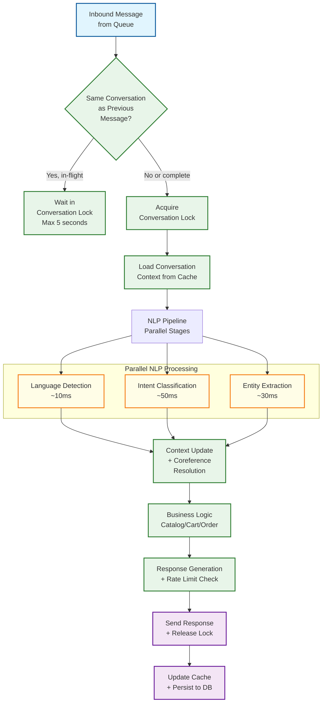

# 14.2 AI-Native Conversational Commerce Platform (WhatsApp-First) — Scalability & Reliability

## Horizontal Scaling Strategy

### Tier-Based Scaling Architecture

The platform's components have fundamentally different scaling characteristics based on their statefulness, latency requirements, and resource consumption patterns:

**Tier 1: Stateless, Latency-Critical (scale by adding instances)**

| Component | Scaling Unit | Scaling Trigger | Scale Metric |
|---|---|---|---|
| Webhook Receiver | HTTP server instance | Request queue depth > 100 | Requests/sec per instance |
| Outbound Gateway | API client instance | Outbound queue depth > 1000 | Messages/sec per instance |
| Intent Classifier | Model inference pod | Classification latency p99 > 400ms | Inferences/sec per GPU |
| Template Renderer | Compute instance | Render queue depth > 500 | Renders/sec per instance |

These components are fully stateless—any instance can handle any request. Scaling is achieved by adding instances behind a load balancer. The webhook receiver is the most critical to scale quickly: a sudden traffic spike (e.g., a broadcast reply storm) must be absorbed within seconds, not minutes. Auto-scaling is configured with aggressive scale-up (add 50% capacity when CPU > 60% for 30 seconds) and conservative scale-down (remove instances only when CPU < 30% for 10 minutes).

**Tier 2: Partitioned Stateful (scale by adding partitions)**

| Component | Partition Key | State Location | Scaling Approach |
|---|---|---|---|
| Message Processing Workers | tenant_id:conversation_id | Message queue partition | Add partitions + consumers |
| Conversation Context Manager | conversation_id | Distributed cache | Add cache shards |
| Cart Manager | customer_id | Distributed cache + DB | Shard by customer_id hash |
| Broadcast Engine | campaign_id | Campaign DB + queue | Parallel campaign execution |

These components maintain state that must be accessed consistently, but the state is naturally partitioned. Scaling is achieved by adding partitions (and corresponding consumers) to distribute the load. The partition key determines which instance handles which data, ensuring that all messages in a conversation are processed by the same worker (preserving conversation ordering).

**Tier 3: Centralized Stateful (scale by vertical scaling + read replicas)**

| Component | State Type | Scaling Approach |
|---|---|---|
| Catalog Database | Product metadata + inventory | Read replicas for search; primary for writes |
| Order Database | Event-sourced order records | Sharded by tenant_id + read replicas |
| Customer Profile Database | CRM data + engagement metrics | Sharded by tenant_id + cache layer |
| Analytics Warehouse | Aggregated metrics + reports | Columnar store with materialized views |

These components cannot be trivially partitioned because queries may span partitions (e.g., "all orders for merchant X in the last 30 days"). Scaling uses a combination of sharding (by tenant_id for most databases), read replicas (for query-heavy workloads like analytics), and aggressive caching (for frequently accessed data like product catalogs and customer profiles).

### Auto-Scaling Policies

```
Webhook Receiver Auto-Scaling:
  Scale-up trigger:   CPU > 60% for 30s OR queue depth > 100 for 15s
  Scale-up action:    Add 50% instances (min 2, max 50)
  Scale-down trigger: CPU < 30% for 10min AND queue depth < 10
  Scale-down action:  Remove 25% instances (min 3 always running)
  Cool-down:          2 minutes between scale actions

Message Processing Workers Auto-Scaling:
  Scale-up trigger:   Consumer lag > 1000 messages for 60s
  Scale-up action:    Add consumers (max = partition count)
  Scale-down trigger: Consumer lag = 0 for 5 minutes
  Scale-down action:  Remove 1 consumer per partition with 0 lag
  Cool-down:          5 minutes between scale actions

NLP Inference Auto-Scaling:
  Scale-up trigger:   p99 latency > 400ms for 2 minutes
  Scale-up action:    Add GPU inference pod (max 20)
  Scale-down trigger: p99 latency < 200ms for 15 minutes AND utilization < 40%
  Scale-down action:  Remove 1 inference pod (min 2 always running)
  Cool-down:          10 minutes (GPU pod startup takes 3-5 minutes)
```

---

## Message Processing at Scale

### Peak Traffic Patterns

The platform experiences three distinct traffic patterns that require different scaling strategies:

**Pattern 1: Diurnal cycle (predictable)**

Message volume follows a daily cycle with peak at 10 AM - 2 PM and 6 PM - 10 PM (local time across India's single timezone). The platform pre-scales infrastructure 30 minutes before predicted peak using historical traffic models. Baseline capacity handles the trough (late night), and auto-scaling handles the peak without cold-start delays.

**Pattern 2: Broadcast reply storms (semi-predictable)**

When a merchant sends a broadcast to 100K contacts, 5-15% may reply within 30 minutes. This creates a burst of 5,000-15,000 inbound messages for a single merchant's phone number. The reply storm is predictable in timing (aligned with campaign execution) but unpredictable in magnitude (depends on template engagement). The platform pre-scales webhook receivers and message processing workers when a large broadcast is scheduled.

**Pattern 3: Festival/sale spikes (predictable date, unpredictable magnitude)**

During Diwali, Navratri, and end-of-season sales, message volume can spike 3-5x for specific merchants. The platform maintains a "festival mode" that merchants can activate, which pre-allocates dedicated processing capacity and increases rate limits.

### Conversation Processing Pipeline — Parallelism Strategy



Within a single message's processing pipeline, language detection, intent classification, and entity extraction run in parallel (they don't depend on each other's outputs). This reduces the NLP pipeline from sequential 90ms (10+50+30) to parallel 50ms (limited by the slowest stage). The context update and coreference resolution step depends on all three NLP outputs and runs sequentially after them.

Across conversations, messages are fully parallel (different conversations process independently). Within a conversation, messages are strictly sequential (enforced by a per-conversation distributed lock). If two messages arrive for the same conversation within 100ms, the second waits for the first to complete processing before starting. This ensures conversational context consistency—the second message's intent classification has access to the updated context from the first message.

---

## Multi-Region Deployment

### Architecture

The platform operates in two regions with active-passive architecture for write operations and active-active for read operations:

| Component | Region 1 (Primary) | Region 2 (Secondary) |
|---|---|---|
| Webhook Receiver | Active (primary webhook URL) | Active (backup webhook URL, auto-failover via global LB) |
| Message Queue | Active (primary write) | Standby (async replication from primary) |
| Message Workers | Active (processing from primary queue) | Warm standby (can attach to replicated queue within 60s) |
| NLP Inference | Active | Active (serves both regions for load distribution) |
| Databases | Primary (writes) | Read replica (reads + promote-on-failover) |
| Cache | Active (write-through) | Active (eventual consistency, 1-2s lag) |
| Outbound Gateway | Active | Active (both can send to WhatsApp API) |
| Merchant Dashboard | Active | Active (reads from local replica) |

### Failover Strategy

**Webhook endpoint failover (critical path):**

The webhook URL registered with Meta is a global load balancer endpoint that routes to both regions. Health checks probe the webhook endpoint every 10 seconds. If Region 1 fails 3 consecutive health checks (30 seconds), traffic is routed to Region 2. During failover:

1. Region 2 webhook receivers start receiving traffic immediately
2. Messages are enqueued to Region 2's queue
3. Region 2 workers start processing from the local queue
4. Database reads go to the local read replica (possibly 1-2s stale)
5. Database writes are queued and applied when primary recovers (or replica is promoted)

**Message processing failover recovery:**

When Region 1 recovers, it resumes as primary. Any messages processed by Region 2 during the outage are replicated back to Region 1's database. The deduplication layer (shared across regions via replicated Redis) prevents duplicate processing of messages that were in-flight during failover.

**Data consistency during failover:**

The primary concern during failover is conversation state consistency. If Region 2 processes a message that updates a cart, but Region 1 has a stale cart state from before the failover, resuming on Region 1 would lose the cart update. The solution: conversation context is cached with a version number. After failover recovery, workers invalidate local cache entries for conversations that were active during the failover window, forcing a fresh load from the database.

---

## Fault Tolerance and Disaster Recovery

### Failure Mode Analysis

| Failure Mode | Detection | Impact | Recovery |
|---|---|---|---|
| **Webhook receiver crash** | Health check fails | Messages buffered at Meta (up to 7 days) | Auto-restart by orchestrator; LB routes to other instances within 10s |
| **Message queue failure** | Producer/consumer errors | Messages lost in-flight; new messages queue at webhook receiver | Failover to secondary queue cluster; webhook receiver buffers briefly in memory |
| **NLP service outage** | Inference timeout | All messages get "I didn't understand" response | Fallback to keyword-based intent matching (degraded accuracy); escalate to human agents |
| **Database primary failure** | Replication lag spike + connection failures | No writes possible; stale reads from replica | Promote replica to primary (30-60s); redirect write traffic |
| **Cache cluster failure** | Connection timeout | Conversation context lost; increased DB load | Rebuild cache from DB on demand; accept slower first response per conversation |
| **Payment gateway outage** | Webhook delivery failures | Cannot confirm payments; orders stuck in PAYMENT_PENDING | Queue payment confirmation checks; retry at increasing intervals; inform customer of delay |
| **Meta WhatsApp API outage** | Send API returns 5xx | Cannot send outbound messages; responses queued internally | Buffer outbound messages; batch send when API recovers; inform merchants of delay |
| **Broadcast engine failure** | Campaign progress stall | Campaign partially sent; some contacts didn't receive message | Resume from last checkpoint (batch-level tracking); no duplicate sends due to per-contact dedup |

### Circuit Breaker Patterns

**NLP Service Circuit Breaker:**

```
States: CLOSED → OPEN → HALF_OPEN

CLOSED (normal operation):
  Forward all classification requests to NLP service
  Track failure rate (timeout or error) over sliding 1-minute window
  IF failure rate > 30%: transition to OPEN

OPEN (NLP service degraded):
  Route all messages through keyword-based fallback classifier
  Log degraded-mode entry for monitoring
  After 30 seconds: transition to HALF_OPEN

HALF_OPEN (probing):
  Send 10% of requests to NLP service, 90% to fallback
  IF 10 consecutive NLP requests succeed: transition to CLOSED
  IF any NLP request fails: transition to OPEN
```

**Outbound Gateway Circuit Breaker (per phone number):**

```
Track WhatsApp API error rate per business phone number
IF error rate > 20% for a phone number:
  Pause outbound for that number for 60 seconds
  Continue sending for other phone numbers
  After 60 seconds, send 1 test message
  IF success: resume normal sending
  IF fail: extend pause to 5 minutes, alert merchant
```

### Graceful Degradation Ladder

When the system is under extreme load or experiencing partial failures, it degrades gracefully through predefined levels:

```
Level 0 (Normal): Full functionality — AI classification, catalog search,
                   payment processing, broadcast campaigns

Level 1 (AI Degraded): NLP service overloaded
  → Switch to keyword-based intent matching (lower accuracy, faster)
  → Disable LLM-based responses (deterministic flows only)
  → Increase agent escalation threshold (accept more uncertainty)

Level 2 (Commerce Degraded): Database or cache under pressure
  → Disable catalog search (only show pre-cached popular products)
  → Cart operations use in-memory state only (no persistence)
  → Broadcast campaigns paused

Level 3 (Minimal): Severe infrastructure issues
  → All messages get automated response: "We're experiencing high demand.
    An agent will respond shortly."
  → Queue all messages for human agent processing
  → Disable all outbound except order status updates

Level 4 (Maintenance): Planned or unplanned full outage
  → Webhook receiver returns 200 but logs messages to durable file storage
  → Messages processed in batch when service recovers
  → WhatsApp shows "sent" (single checkmark) but no response
```

---

## Capacity Planning

### Growth Projections and Infrastructure Planning

| Metric | Current (Month 1) | Month 6 | Month 12 | Month 24 |
|---|---|---|---|---|
| Active merchants | 10,000 | 30,000 | 100,000 | 250,000 |
| Daily messages (total) | 13M | 40M | 130M | 350M |
| Peak messages/sec | 2,250 | 7,000 | 22,500 | 60,000 |
| Concurrent conversations | 50,000 | 150,000 | 500,000 | 1,250,000 |
| Daily orders | 200K | 600K | 2M | 5M |
| Catalog products | 2M | 6M | 20M | 50M |
| Customer profiles | 20M | 60M | 200M | 500M |
| Storage (total) | 3 TB | 8 TB | 25 TB | 70 TB |

### Infrastructure Sizing

```
Webhook Receivers:
  Month 1:  10 instances (2 vCPU, 4 GB each)
  Month 12: 50 instances (2 vCPU, 4 GB each)
  Month 24: 120 instances (auto-scaled)

Message Queue:
  Month 1:  3-node cluster, 1000 partitions
  Month 12: 5-node cluster, 10,000 partitions
  Month 24: 10-node cluster, 25,000 partitions

NLP Inference:
  Month 1:  4 GPU instances (intent classification + entity extraction)
  Month 12: 16 GPU instances
  Month 24: 40 GPU instances (with model optimization for efficiency)

Database:
  Month 1:  1 primary + 2 read replicas (8 vCPU, 32 GB, 1 TB SSD)
  Month 12: 4 shards × (1 primary + 2 read replicas) (16 vCPU, 64 GB, 5 TB SSD)
  Month 24: 10 shards × (1 primary + 3 read replicas)

Cache (distributed):
  Month 1:  3-node cluster, 96 GB total
  Month 12: 6-node cluster, 384 GB total
  Month 24: 12-node cluster, 768 GB total

Object Storage (catalog images):
  Month 1:  1 TB
  Month 12: 10 TB
  Month 24: 30 TB
```

### Cost-Efficient Scaling Strategies

1. **Spot/preemptible instances for broadcast workers:** Broadcast processing is fault-tolerant (can resume from checkpoints) and latency-insensitive (campaigns span hours). Using spot instances for broadcast workers reduces compute cost by 60-70%.

2. **Model quantization for NLP inference:** Quantizing the intent classification model from FP32 to INT8 reduces GPU memory by 4x and increases throughput by 2-3x, with <1% accuracy loss. This delays the need for additional GPU instances.

3. **Tiered storage for conversation history:** Recent conversations (last 30 days) are kept in hot storage (SSD-backed database). Older conversations are migrated to warm storage (HDD-backed) and further to cold storage (object storage with columnar format) for archival. 90% of reads hit the last-30-day data.

4. **Multi-tenant resource sharing:** Small merchants (90% of tenants, 20% of traffic) share compute pools. Large merchants (10% of tenants, 80% of traffic) get dedicated compute with guaranteed minimum capacity. This prevents small merchants from over-provisioning while ensuring large merchants don't experience noisy-neighbor effects.

5. **Intelligent cache warming:** Instead of caching all catalog data, the cache only stores products that were accessed in the last 7 days (covering 85% of catalog searches). This reduces cache size by 60% without meaningful cache miss rate increase.

---

## Data Durability and Recovery Patterns

### Message Durability Guarantees

The platform distinguishes between three durability tiers based on message criticality:

| Tier | Examples | Durability Guarantee | Recovery Mechanism |
|---|---|---|---|
| **Tier 1: Financial** | Payment confirmations, order state transitions, refund initiations | Synchronous write to replicated database before acknowledgment | Event-sourced replay from order event log |
| **Tier 2: Conversational** | Customer messages, AI responses, cart mutations | Durable queue with at-least-once delivery; async DB persistence | Replay from message queue (7-day retention) |
| **Tier 3: Ephemeral** | Typing indicators, delivery receipts, read receipts | Best-effort processing; no persistence required | No recovery — acceptable loss |

Financial-tier messages use a write-ahead pattern: the order state transition is persisted to the event store before the outbound confirmation message is sent. If the outbound send fails, a recovery job replays unsent confirmations from the event store. This ensures that a customer whose payment succeeded always receives a confirmation, even if the outbound gateway was temporarily unavailable.

### Conversation State Recovery After Failure

When a message processing worker crashes mid-processing, the conversation may be left in an inconsistent state (e.g., cart updated but response not sent). The recovery procedure:

```
Worker crash recovery:
  1. Message remains in queue (unacknowledged due to crash)
  2. Queue redelivers message to a new worker after visibility timeout (30s)
  3. New worker loads conversation context from cache (or DB if cache miss)
  4. Worker checks idempotency key for each side effect:
     - Cart: check if request_id already applied → skip if yes
     - Response: check if outbound message already sent → skip if yes
  5. Worker completes remaining side effects and acknowledges message
  6. Total customer-visible delay: 30-45 seconds (visibility timeout + reprocessing)
```

For catastrophic failures (entire worker pool down for >5 minutes), the platform activates the degradation ladder (Level 3): all incoming messages are acknowledged and queued, and customers receive an automated "We're experiencing delays" response. When workers recover, the queue backlog is processed in FIFO (First-In-First-Out, like a line at a store) order with priority boost for messages from customers who have been waiting longest.

### Point-in-Time Order State Recovery

The event-sourced order model enables reconstruction of any order's state at any point in time by replaying events up to the target timestamp. This is critical for:

- **Dispute resolution:** When a customer claims "I paid but never received confirmation," the platform replays the order events to determine the exact state at the claimed payment time
- **Reconciliation failures:** When the daily reconciliation pipeline finds a discrepancy, it replays both the order events and payment events to locate the divergence point
- **Audit compliance:** Regulatory inquiries about a specific transaction can be answered by reconstructing the complete order lifecycle from the event log

```
Reconstruct order state at timestamp T:
  events = order_event_store.get_events(order_id, up_to=T)
  state = OrderState.INITIAL
  FOR EACH event IN events:
    state = apply_transition(state, event)
  RETURN state
```

---

## Broadcast Storm Absorption

### Reply Storm Modeling and Pre-Scaling

When a merchant with 200K contacts sends a broadcast campaign, the expected reply pattern follows a predictable curve:

```
Reply storm timeline (empirical model):
  T+0 to T+5min:   30% of total replies (immediate engagement)
  T+5 to T+30min:  45% of total replies (delayed reading)
  T+30min to T+2h: 20% of total replies (late readers)
  T+2h to T+24h:   5% of total replies (slow responders)

For 10% reply rate on 200K contacts = 20K expected replies:
  Peak burst: 6,000 replies in 5 minutes = 20 replies/sec
  Sustained: 9,000 replies in 25 minutes = 6 replies/sec
```

The broadcast engine communicates the expected reply storm profile to the auto-scaler before campaign execution. The auto-scaler pre-provisions webhook receivers and message processing workers based on the projected peak, avoiding cold-start delays during the burst. Pre-scaling is calculated per merchant's historical reply rate (merchants with highly engaged audiences see 15-20% reply rates; merchants with less engaged lists see 3-5%).

### Tenant-Isolated Burst Handling

A large merchant's broadcast storm must not degrade other merchants' conversational experience. The platform implements per-tenant resource isolation during broadcast periods:

| Resource | Isolation Mechanism | Burst Handling |
|---|---|---|
| Message queue | Dedicated partitions for merchants running broadcasts | Storm replies processed from dedicated partitions; other merchants unaffected |
| Processing workers | Elastic worker pool tagged by tenant tier | Large merchants get dedicated burst workers; shared pool serves other merchants |
| Outbound rate limit | Per-number rate limit naturally isolates | Merchant's broadcast replies consume only their own rate budget |
| NLP inference | Request queuing with tenant-fair scheduling | Round-robin across tenants prevents one merchant from monopolizing GPU |
| Database connections | Per-tenant connection pool limits | Burst queries from one merchant cannot exhaust the connection pool |

The key insight is that broadcast storms are predictable (aligned with campaign execution) and self-limiting (reply rate decays exponentially). Unlike unpredictable traffic spikes from viral events, broadcast storms can be modeled and pre-mitigated, making them an engineering scheduling problem rather than a capacity emergency.

## AI Release Ladder

Every AI model or capability change in this system MUST follow this rollout sequence:

| Stage | Description | Gate Criteria |
|-------|-------------|---------------|
| 1. Offline Evaluation | Benchmark against historical ground truth | Meets baseline metrics |
| 2. Shadow Mode | Run in parallel with production, compare outputs | No regression on key metrics |
| 3. Canary (Blast-Radius Capped) | 1-5% traffic, human review of all outputs | Error rate < threshold |
| 4. Human-Reviewed Production | AI recommends, human approves all actions | Approval rate > 90% |
| 5. Limited Autonomous Production | AI acts within pre-approved boundaries | Continuous monitoring, no alerts |
| 6. Instant Rollback | One-click revert to previous model/rules | < 5 min rollback time |

**Note:** AI capabilities that directly interact with end users or execute actions on their behalf must reach Stage 4 (human-reviewed production) with domain-expert sign-off before deployment. Stage 5 limited autonomy applies only to well-bounded, low-risk action categories with established rollback procedures.
