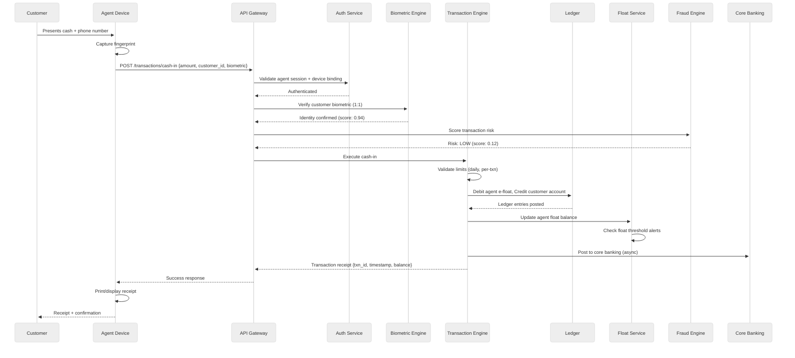
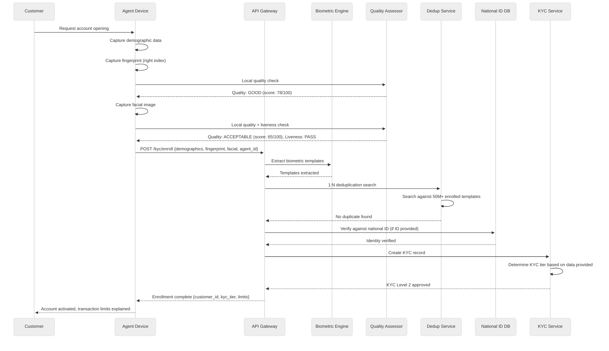
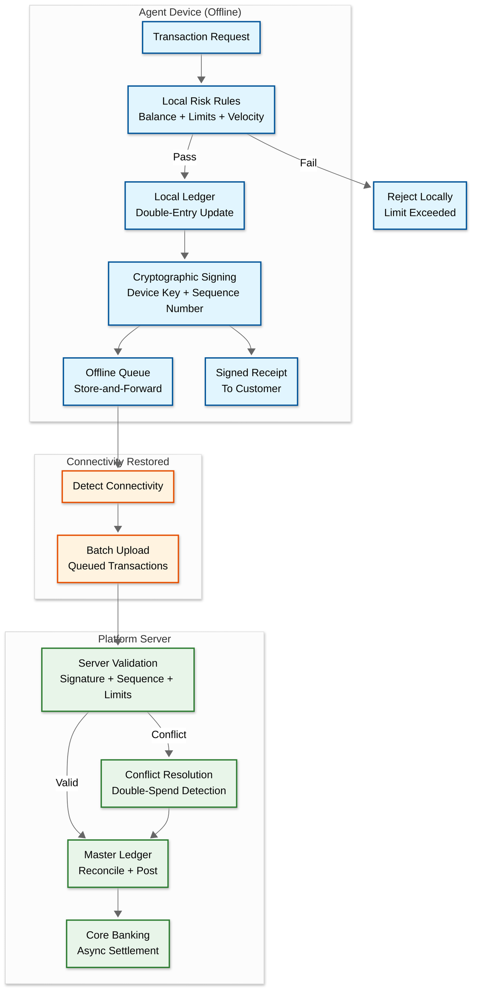
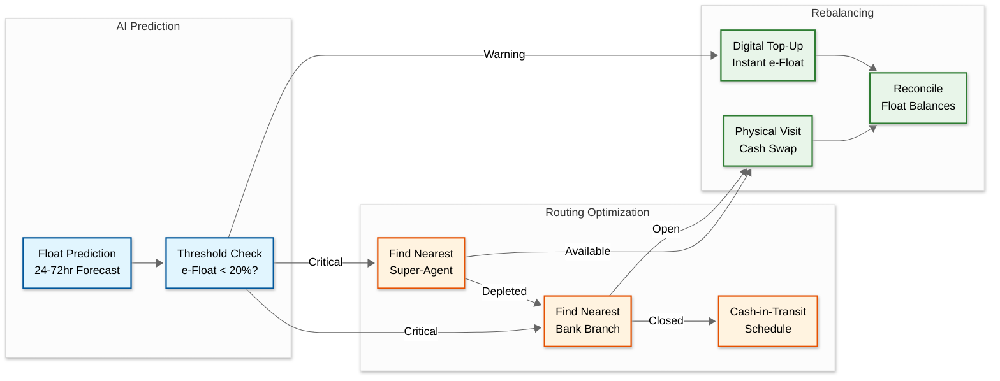

# High-Level Design — AI-Native Agent Banking Platform for Africa

## System Context

The agent banking platform sits at the intersection of multiple systems:

- **Agent Devices** (POS terminals, smartphones, feature phones) — the edge nodes where transactions originate, often in low-connectivity environments
- **Core Banking Systems** — the ledger of record for customer accounts and settlement
- **National Identity Databases** — biometric and demographic identity registries (e.g., NIMC in Nigeria, NIDA in Tanzania)
- **Telecom Networks** — USSD channels, SMS gateways, and mobile money interoperability
- **Regulatory Systems** — real-time reporting interfaces to central banks and financial intelligence units
- **Payment Networks** — interbank switches, card networks, mobile money networks for interoperability
- **Super-Agent Networks** — hierarchical distribution networks for float management and agent support

---

## Architecture

```mermaid
---
config:
  theme: neutral
  look: neo
---
flowchart TB
    subgraph Edge["Agent Edge Layer"]
        POS[POS Terminal]
        APP[Agent Mobile App]
        USSD[USSD Channel]
        SMS[SMS Gateway]
    end

    subgraph Gateway["API Gateway & Channel Orchestration"]
        GW[API Gateway]
        CHA[Channel Adapter]
        RL[Rate Limiter]
        AUTH[Auth Service]
    end

    subgraph Core["Core Transaction Services"]
        TXN[Transaction Engine]
        LEDGER[Double-Entry Ledger]
        FLOAT[Float Management Service]
        SETTLE[Settlement Engine]
    end

    subgraph Identity["Identity & KYC Services"]
        BIO[Biometric Engine]
        KYC[KYC Service]
        DEDUP[Deduplication Service]
        IDFED[Identity Federation]
    end

    subgraph Agent["Agent Management"]
        ONBOARD[Agent Onboarding]
        PERF[Performance Scoring]
        TIER[Tier Management]
        GEO[Geo-Fencing Service]
    end

    subgraph AI["AI & Analytics Layer"]
        FRAUD[Fraud Detection Engine]
        FPRED[Float Prediction Service]
        PLACE[Placement Optimizer]
        RISK[Risk Scoring Engine]
    end

    subgraph Offline["Offline & Sync Layer"]
        SYNC[Sync Service]
        CONFLICT[Conflict Resolution]
        QUEUE[Transaction Queue]
    end

    subgraph Data["Data Layer"]
        TXDB[(Transaction DB)]
        AGDB[(Agent DB)]
        BIODB[(Biometric Store)]
        CACHE[(Distributed Cache)]
        EVENTS[(Event Stream)]
        LAKE[(Analytics Data Lake)]
    end

    subgraph External["External Integrations"]
        CBANK[Core Banking]
        NATID[National ID Systems]
        TELCO[Telecom Partners]
        REG[Regulatory Reporting]
        BILLER[Biller Network]
    end

    POS & APP & USSD & SMS --> GW
    GW --> CHA --> RL --> AUTH
    AUTH --> TXN & FLOAT & BIO

    TXN --> LEDGER --> TXDB
    TXN --> SETTLE
    FLOAT --> FPRED
    FLOAT --> CACHE

    BIO --> KYC --> DEDUP
    BIO --> BIODB
    KYC --> IDFED --> NATID

    TXN --> FRAUD --> RISK
    FRAUD --> EVENTS
    FPRED --> LAKE

    ONBOARD --> AGDB
    PERF --> AGDB
    GEO --> AGDB

    SYNC --> CONFLICT --> QUEUE --> TXN

    SETTLE --> CBANK
    TXN --> TELCO
    TXN --> BILLER
    FRAUD --> REG

    PLACE --> LAKE

    classDef edge fill:#e1f5fe,stroke:#01579b,stroke-width:2px
    classDef gateway fill:#fff3e0,stroke:#e65100,stroke-width:2px
    classDef service fill:#e8f5e9,stroke:#2e7d32,stroke-width:2px
    classDef identity fill:#fce4ec,stroke:#c62828,stroke-width:2px
    classDef ai fill:#f3e5f5,stroke:#6a1b9a,stroke-width:2px
    classDef data fill:#f3e5f5,stroke:#6a1b9a,stroke-width:2px
    classDef external fill:#e0f7fa,stroke:#00695c,stroke-width:2px
    classDef cache fill:#fffde7,stroke:#f57f17,stroke-width:2px

    class POS,APP,USSD,SMS edge
    class GW,CHA,RL,AUTH gateway
    class TXN,LEDGER,FLOAT,SETTLE,SYNC,CONFLICT,QUEUE service
    class BIO,KYC,DEDUP,IDFED,ONBOARD,PERF,TIER,GEO identity
    class FRAUD,FPRED,PLACE,RISK ai
    class TXDB,AGDB,BIODB,EVENTS,LAKE data
    class CACHE cache
    class CBANK,NATID,TELCO,REG,BILLER external
```



---

## Component Descriptions

### Agent Edge Layer

| Component | Responsibility |
|---|---|
| **POS Terminal** | Dedicated hardware device with card reader, receipt printer, fingerprint scanner; runs embedded agent application; stores offline transaction queue; communicates via cellular data or Wi-Fi |
| **Agent Mobile App** | Android application for smartphone-based agents; supports camera-based facial KYC, NFC-based card reading; maintains local encrypted database for offline operations |
| **USSD Channel** | Session-based text interface for feature phone agents and customers; supports basic transactions through menu-driven flows; 182-character message limit per screen drives terse but complete interaction design |
| **SMS Gateway** | Asynchronous notification channel for transaction receipts, float alerts, and compliance notifications; fallback channel when USSD sessions time out |

### API Gateway & Channel Orchestration

| Component | Responsibility |
|---|---|
| **API Gateway** | Entry point for all agent requests; TLS termination, request routing, protocol translation (USSD text → structured API calls); payload compression for bandwidth optimization |
| **Channel Adapter** | Normalizes requests from heterogeneous channels (POS proprietary protocols, REST from mobile app, USSD session data, SMS commands) into a unified internal message format |
| **Rate Limiter** | Per-agent and per-device rate limiting; prevents abuse and protects backend from runaway devices; adaptive limits based on agent tier and historical patterns |
| **Auth Service** | Multi-factor authentication: device binding (IMEI/serial), agent PIN, and optional biometric; session management with configurable timeouts; device attestation to detect rooted/tampered devices |

### Core Transaction Services

| Component | Responsibility |
|---|---|
| **Transaction Engine** | Orchestrates the complete transaction lifecycle: request validation, compliance rule evaluation, balance checks, ledger posting, receipt generation; supports idempotent retry for network instability |
| **Double-Entry Ledger** | Immutable append-only ledger implementing double-entry bookkeeping; every transaction creates exactly two entries (debit and credit); ensures mathematical consistency; partitioned by account ID for horizontal scaling |
| **Float Management Service** | Tracks real-time cash and e-float balances for every agent; processes rebalancing requests; enforces float limits by agent tier; interfaces with AI float prediction for proactive alerts |
| **Settlement Engine** | Computes net settlement positions between agents, super-agents, and banking partners; generates settlement files for core banking; handles multi-currency settlement for cross-border corridors |

### Identity & KYC Services

| Component | Responsibility |
|---|---|
| **Biometric Engine** | Processes fingerprint and facial biometric captures; quality scoring and rejection of sub-threshold captures; template extraction using standard algorithms (minutiae-based for fingerprint, embedding-based for facial); 1:1 verification and 1:N identification |
| **KYC Service** | Manages tiered KYC levels (basic, standard, full); orchestrates document verification, biometric capture, and identity database queries; tracks KYC status and expiry |
| **Deduplication Service** | Performs 1:N biometric search against the enrolled population to detect duplicate identities; uses approximate nearest neighbor search with locality-sensitive hashing for sub-linear search time; critical for preventing identity fraud |
| **Identity Federation** | Integrates with national identity databases (NIMC, NIDA, IPRS) for identity verification; handles varying API formats, availability patterns, and response times across jurisdictions |

### AI & Analytics Layer

| Component | Responsibility |
|---|---|
| **Fraud Detection Engine** | Real-time transaction scoring using ensemble of rule-based and ML models; detects phantom transactions, collusion, float diversion; generates alerts and auto-blocks high-risk transactions; maintains per-agent risk profiles |
| **Float Prediction Service** | Time-series forecasting of per-agent cash and e-float needs; incorporates seasonality (day-of-week, market days, salary cycles), weather, and local event data; generates rebalancing recommendations |
| **Placement Optimizer** | Analyzes geographic demand patterns, population density, economic indicators, and competitive landscape to recommend optimal agent locations; identifies underserved areas for recruitment targeting |
| **Risk Scoring Engine** | Computes composite risk scores for agents, customers, and transactions; inputs include transaction patterns, biometric quality trends, device health indicators, and compliance history; outputs risk tiers that drive dynamic limit adjustment |

---

## Data Flow: Cash-In (Deposit) Transaction



### Key Points in Cash-In Flow

1. **Biometric verification happens before transaction processing** — prevents unauthorized deposits and builds audit trail
2. **Fraud scoring runs in parallel with biometric check** — if either fails, transaction is rejected before any ledger mutation
3. **Agent e-float is debited** — the agent "sells" e-value to the customer in exchange for physical cash; this is the fundamental CICO economic model
4. **Core banking posting is asynchronous** — the platform maintains its own real-time ledger; core banking is updated with eventual consistency (typically < 30 seconds)
5. **Float threshold check is a side-effect** — after every transaction, the system checks whether the agent's remaining e-float is below the warning threshold (20% of allocated float) and triggers proactive rebalancing if needed

---

## Data Flow: Biometric KYC Enrollment



### Key Points in KYC Flow

1. **Local quality assessment** — rejects poor captures immediately, avoiding wasted bandwidth uploading unusable biometrics
2. **Liveness detection** — prevents spoofing with printed photos or screen replay attacks
3. **1:N deduplication is critical** — prevents one person from opening multiple accounts with slight biometric variations; this is the most computationally expensive step
4. **National ID verification is optional** — many customers lack government-issued ID; tiered KYC allows basic accounts with biometrics-only at lower transaction limits
5. **KYC tier determines transaction limits** — Level 1 (phone number only): ₦50K daily; Level 2 (biometrics): ₦200K daily; Level 3 (government ID + biometrics): ₦500K daily

---

## Key Design Decisions

| Decision | Choice | Rationale |
|---|---|---|
| **Offline-first architecture** | Device maintains local ledger and processes transactions offline with store-and-forward | 30-40% of agent locations experience daily connectivity drops; financial services cannot be unavailable when network is down |
| **Double-entry ledger as source of truth** | Platform maintains its own ledger separate from core banking | Core banking systems have high latency (500ms+) and limited throughput; platform ledger enables sub-second transactions with async core banking sync |
| **On-device biometric matching** | Biometric templates cached on device for offline 1:1 verification | Cannot depend on server connectivity for customer authentication; on-device matching enables full offline transaction capability |
| **Event-sourced transaction log** | Every state change captured as an immutable event | Enables complete audit trail, offline conflict resolution by replaying events, and streaming to analytics pipeline |
| **Multi-channel single backend** | POS, mobile app, USSD, and SMS all route to the same transaction engine | Avoids channel-specific business logic divergence; ensures consistent behavior regardless of agent's device type |
| **Regional processing nodes** | Deploy processing nodes in regional data centers close to agent concentrations | Reduces latency for 80% of transactions; provides regional resilience when inter-region connectivity fails |
| **Hierarchical float management** | Super-agent → Agent hierarchy mirrors physical cash distribution | Aligns digital float structure with physical cash logistics; super-agents serve as both digital and physical rebalancing points |
| **Configurable compliance engine** | Rule-based policy engine with per-jurisdiction rule sets | Regulatory requirements vary by country and change frequently; hardcoding rules would require code deployment for every regulatory update |

---

## Data Flow: Offline Transaction — Store, Sign, and Sync



### Conflict Resolution Rules

```
Conflict types and resolution:

Type 1: Double-spend (two offline withdrawals exceed balance)
  Detection: server computes running balance from synced transactions;
             if balance goes negative, double-spend occurred
  Resolution: both transactions accepted (physical cash already dispensed);
              create compensating debit entry on the overdrawn account;
              the offline agent who processed the later transaction bears liability
              (incentivizes maintaining connectivity)

Type 2: Sequence gap (missing transaction in sequence)
  Detection: server receives sequence numbers 47, 48, 50 — gap at 49
  Resolution: request retransmission of missing transaction;
              if device reports no transaction 49, investigate possible deletion
              (potential fraud indicator: agent deleted a transaction)

Type 3: Timestamp anomaly (transaction timestamp doesn't match device clock)
  Detection: device clock drift detected (server time vs. device-reported time
             differs by > 5 minutes)
  Resolution: adjust timestamps using linear interpolation between last-sync
              and current-sync server timestamps; flag agent for clock-drift alert

Type 4: Concurrent offline operations (two devices for same agent)
  Detection: two sync batches from different devices claim to be the same agent
  Resolution: this should be impossible (device binding); if detected, immediately
              suspend the cloned device and investigate
```

---

## Data Flow: Float Rebalancing Lifecycle



---

## Cross-Cutting Concerns

### Multi-Currency Ledger Architecture

For multi-country deployment, the ledger must handle multiple currencies natively:

```
Currency handling:
  - Each account denominated in a single currency (NGN, KES, GHS, TZS)
  - Cross-border transfers require FX conversion at point of transaction
  - FX rates updated every 15 minutes from central bank reference rates
  - Platform maintains a per-corridor position ledger:
      Nigeria → Ghana: net NGN 45M owed to Ghana platform
      Nigeria → Ghana: settlement every 4 hours via international wire
  - FX spread (platform margin): 0.5-1.5% depending on corridor
  - Customer sees: "Send ₦50,000 → Recipient gets GH₵ 235.50 (rate: 4.71)"
  - Two separate ledger entries: debit NGN 50,000, credit GHS 235.50
    with FX rate and corridor recorded for reconciliation
```

### Device Management Fleet

```
Device fleet management (600,000+ devices):
  - OTA (over-the-air) app updates: staged rollout by region (5% → 25% → 100%)
  - Biometric model updates: separate from app updates (smaller, more frequent)
  - Remote wipe capability: for stolen or decommissioned devices
  - Device health telemetry: battery, storage, sensor quality, app crashes
  - Automatic device replacement trigger:
      - Fingerprint sensor failure rate > 40% → schedule replacement
      - Receipt printer failure > 3x/day → schedule replacement
      - Battery holds < 4 hours charge → schedule replacement
  - Device binding: each device cryptographically bound to one agent
    Unbinding requires physical visit to a branch (prevents unauthorized device transfer)
```

---

## Architecture Decision Records

### ADR 1: Offline-First vs. Online-First Architecture

**Context:** 15-25% of daily transactions occur without connectivity. The design must choose between treating offline as a degraded mode (online-first with offline fallback) or treating offline as the default operating mode (offline-first).

**Decision:** Offline-first architecture where the device has full transaction processing capability locally.

**Rationale:**
- Online-first with fallback creates two code paths (online and offline) that must be kept in sync—a maintenance burden that leads to divergent behavior
- Offline-first means every transaction follows the same path: local processing → queue → sync. Online transactions are simply "offline transactions that sync immediately"
- The agent device must carry a local ledger, risk rules, biometric templates, and compliance checks regardless—designing for offline first ensures these components are robust
- The 15-25% offline rate is an average; in rural regions it reaches 40%. Designing for the average would fail the most underserved areas

**Trade-off accepted:** Higher device-side complexity; more sophisticated sync and conflict resolution; agents must have devices with sufficient storage and processing power.

### ADR 2: Event-Sourced Transaction Log vs. Mutable State

**Context:** The transaction processing system must choose between a mutable-state database (update balances directly) and an event-sourced log (append transaction events, derive balances from event replay).

**Decision:** Event-sourced transaction log with CQRS (Command Query Responsibility Segregation).

**Rationale:**
- Offline transactions arrive out of order; event sourcing allows inserting events at their correct position in the log and re-deriving state
- Regulatory audit requirements demand complete transaction history with no gaps—event sourcing provides this by construction
- Conflict resolution requires replaying transactions to determine which sequence produces a valid state—only possible with a full event log
- Fraud investigation requires historical state reconstruction ("what did the agent's balance look like at 14:32 when this suspicious transaction occurred?")

**Trade-off accepted:** Higher storage costs (every event stored permanently); read queries require materializing current state from events (solved by CQRS read models); more complex development model.

### ADR 3: Per-Agent ML Models vs. Single Global Model for Float Prediction

**Context:** Float prediction can use either a single model trained on all agents' data or individual lightweight models trained per-agent.

**Decision:** Hybrid approach—per-agent lightweight models (gradient-boosted trees) that share structural features learned from a global model.

**Rationale:**
- A global model cannot capture agent-specific patterns: Agent A near a market has Monday deposit spikes; Agent B near a school has Friday withdrawal spikes. A global model would predict the average, which is wrong for both.
- Pure per-agent models lack data for new agents (cold-start problem). The hybrid approach uses the global model for agents with < 2 weeks of history, then gradually transitions to per-agent models as data accumulates.
- Gradient-boosted trees (not deep learning) chosen because: (a) interpretable—agents can see why a rebalancing recommendation was made, (b) fast inference—< 10ms per prediction, suitable for real-time alerts, (c) small model size—< 1MB per agent, feasible to deploy on-device for offline prediction.

**Trade-off accepted:** 600,000 individual models require distributed model training infrastructure; model versioning and deployment is complex; periodic model retraining (weekly) adds compute cost.
