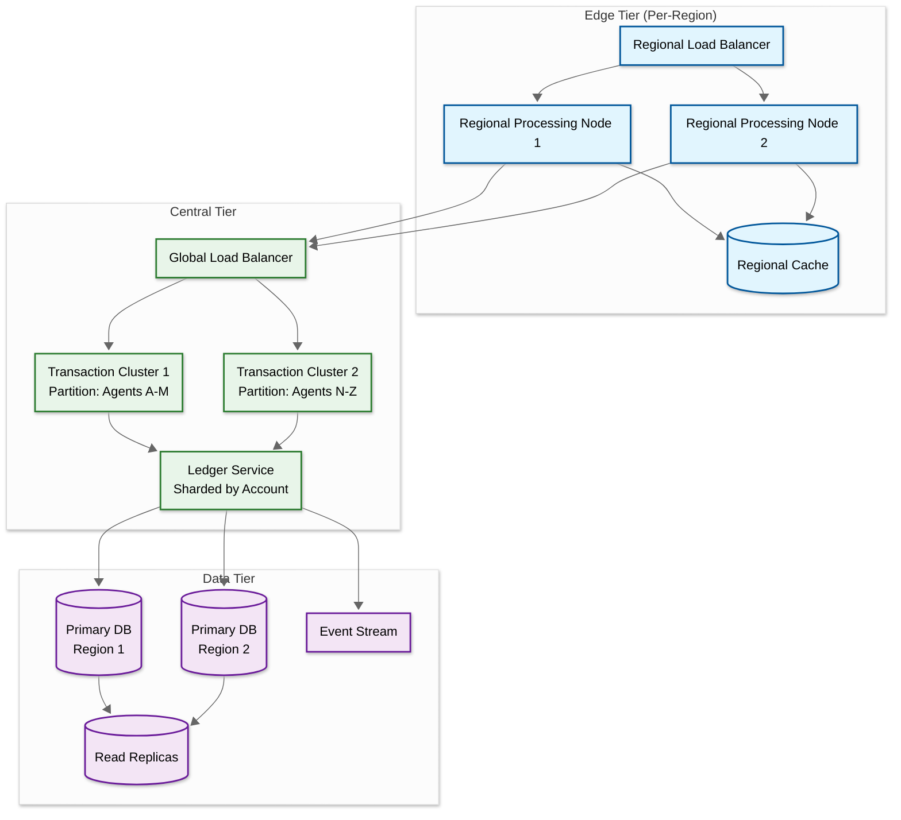

# Scalability & Reliability — AI-Native Agent Banking Platform for Africa

## Scaling for 600,000+ Agents with Varying Connectivity

### Challenge Dimensions

| Dimension | Scale | Constraint |
|---|---|---|
| Concurrent agents | 420,000 active at peak | Each maintains persistent session or polls frequently |
| Transaction throughput | 3,000 TPS sustained, 5,000+ burst | Financial atomicity required on every transaction |
| Biometric verifications | 28 million/day | CPU-intensive template matching |
| Float balance queries | 2 million/hour | Sub-200ms latency requirement |
| Offline sync bursts | 15,000 agents syncing simultaneously | Morning sync wave 07:00-09:00 |
| Geographic distribution | 15+ countries, 200+ regions | Latency-sensitive across unreliable networks |

### Horizontal Scaling Strategy



### Partitioning Strategy

| Data Type | Partition Key | Rationale |
|---|---|---|
| **Transactions** | agent_id (hash) | Co-locates agent's transactions for float calculation; avoids hot spots from high-volume agents via consistent hashing |
| **Ledger entries** | account_id (hash) | Ensures all entries for an account are on the same partition for balance consistency |
| **Agent profiles** | region_code + agent_id | Regional locality for regulatory compliance and regional processing node affinity |
| **Biometric templates** | customer_id (hash) | 1:1 verification needs fast lookup by customer; 1:N dedup uses separate LSH index |
| **Float predictions** | agent_id (hash) | Same partition as agent profile for co-located reads |

### Auto-Scaling Triggers

| Metric | Scale-Up Trigger | Scale-Down Trigger | Component |
|---|---|---|---|
| Transaction queue depth | > 500 pending | < 50 pending for 10 min | Transaction processing pods |
| Sync batch queue depth | > 2,000 pending batches | < 100 pending for 15 min | Sync processing pods |
| Biometric match latency | p99 > 3s | p99 < 1s for 15 min | Biometric matching pods |
| CPU utilization | > 70% for 3 min | < 30% for 10 min | All compute pods |
| Fraud scoring latency | p99 > 500ms | p99 < 100ms for 10 min | Fraud engine pods |

---

## Offline-First Architecture

### Design Philosophy

The system is designed assuming connectivity is unreliable, not assuming it is present and handling the exception. This inverts the typical architecture:

| Traditional Approach | Offline-First Approach |
|---|---|
| Online is default; offline is error state | Offline is expected; online is enhancement |
| Transaction requires server round-trip | Transaction completes locally; server sync is background |
| Balance is authoritative from server | Balance is locally authoritative with periodic reconciliation |
| Failure mode: "Network error, try again" | Failure mode: "Transaction queued, will sync when online" |

### Local State Management

Each agent device maintains:

```
DeviceLocalState {
    agent_e_float:          Decimal         // Last known + local adjustments
    customer_balances:      Map<ID, Decimal> // Cached balances for frequent customers
    transaction_queue:      List<SignedTxn>  // Pending sync
    sequence_counter:       AtomicInteger    // Monotonic for ordering
    biometric_cache:        Map<ID, Template>// Frequently verified customers
    offline_risk_rules:     RuleSet          // Downloaded rule configuration
    last_sync_timestamp:    Timestamp
    device_keys:            KeyPair          // For signing offline transactions
    sync_state:             ENUM             // SYNCED | PARTIAL | STALE
}
```

### Sync Protocol

```
PROTOCOL DeviceSync
    // Phase 1: Handshake
    Device → Server: {device_id, last_sync_seq, pending_count, device_time}
    Server → Device: {server_time, clock_drift, ack}

    // Phase 2: Upload offline transactions (device → server)
    Device → Server: {signed_batch: [txn_1, txn_2, ..., txn_n]}
    Server: Validate signatures, check sequence continuity
    Server: Process each transaction against current server state
    Server → Device: {
        accepted: [txn_1, txn_3, txn_5],
        rejected: [
            {txn_2, reason: "INSUFFICIENT_BALANCE", compensation: {...}},
            {txn_4, reason: "CUSTOMER_BLOCKED"}
        ]
    }

    // Phase 3: Download server updates (server → device)
    Server → Device: {
        updated_balances: {agent_float: X, customers: [...]},
        updated_rules: {new_limits: [...], new_rules: [...]},
        updated_biometric_cache: [new_templates, revoked_templates],
        messages: [compliance_alerts, system_notices]
    }

    // Phase 4: Confirmation
    Device → Server: {sync_complete, new_last_sync_seq}
```

### Conflict Resolution Hierarchy

1. **Server-authoritative for balances**: If a balance conflict exists, the server's state wins because it has visibility into transactions from all channels (other agents, mobile banking, ATM)
2. **Device-authoritative for transaction records**: If the device claims a transaction happened (with valid signature and sequence number), the server trusts that it happened—it may need to generate compensating entries if the balance doesn't support it
3. **Time-based for ordering**: Server uses device timestamps (adjusted for measured clock drift) to establish transaction ordering
4. **Economic-loss assignment**: When an offline transaction causes a loss (e.g., insufficient balance), the loss is assigned to the agent, not the customer—this incentivizes agents to stay online when possible and apply conservative offline limits

---

## Disaster Recovery

### Failure Scenarios and Recovery

| Scenario | Impact | RTO | Recovery Strategy |
|---|---|---|---|
| **Single AZ failure** | 50% capacity in affected region | < 5 min | Automatic failover to surviving AZ; agent devices retry to alternate endpoint |
| **Full region failure** | All agents in region lose online capability | < 15 min | DNS-based failover to secondary region; agents continue in offline mode during transition |
| **Database primary failure** | No write capability | < 2 min | Synchronous replica promotion; zero data loss due to synchronous replication |
| **Ledger corruption** | Incorrect balances | < 4 hours | Event replay from transaction log to reconstruct ledger from last verified checkpoint |
| **Biometric database failure** | No identity verification | < 30 min | Read replica promotion; enrollment paused until primary restored; existing cached templates on devices continue to work |
| **Complete platform outage** | All online services down | < 30 min | All agents automatically switch to offline mode; can process transactions for up to 72 hours; sync backlog processed when platform recovers |

### Multi-Region Deployment

```
                    ┌──────────────────────┐
                    │   Global DNS +       │
                    │   Traffic Manager    │
                    └──────────┬───────────┘
                               │
                ┌──────────────┼──────────────┐
                ▼              ▼              ▼
        ┌───────────┐  ┌───────────┐  ┌───────────┐
        │ Region:   │  │ Region:   │  │ Region:   │
        │ West      │  │ East      │  │ South     │
        │ Africa    │  │ Africa    │  │ Africa    │
        │           │  │           │  │           │
        │ Primary DB│  │ Primary DB│  │ Primary DB│
        │ for NG,GH │  │ for KE,TZ │  │ for ZA,MZ │
        │           │  │           │  │           │
        │ Read rep  │  │ Read rep  │  │ Read rep  │
        │ of all    │  │ of all    │  │ of all    │
        └───────────┘  └───────────┘  └───────────┘
              │                │              │
              └────────────────┼──────────────┘
                               │
                    ┌──────────┴───────────┐
                    │ Cross-Region Async   │
                    │ Replication (< 500ms)│
                    └──────────────────────┘
```

**Data sovereignty constraint**: Each country's transaction data must be primarily stored within a data center in that country or region (regulatory requirement in Nigeria, Kenya, and South Africa). Cross-region replication is for disaster recovery only—read replicas in other regions serve only failover scenarios, not normal traffic.

---

## Multi-Country Deployment Architecture

### Federated Platform Model

```mermaid
---
config:
  theme: neutral
  look: neo
---
flowchart TB
    subgraph Shared["Shared Platform Layer"]
        CORE[Core Transaction Engine]
        FRAUD[Fraud Detection Engine]
        FLOAT[Float Prediction Models]
        BIOM[Biometric Engine]
    end

    subgraph NG["Nigeria Instance"]
        NG_COMP[CBN Compliance Module]
        NG_KYC[NIN/BVN Integration]
        NG_PAY[NIP Integration]
        NG_RULES[₦ Limits + NGN Ledger]
    end

    subgraph KE["Kenya Instance"]
        KE_COMP[CBK Compliance Module]
        KE_KYC[Huduma Namba Integration]
        KE_PAY[PesaLink Integration]
        KE_RULES[KES Limits + KES Ledger]
    end

    subgraph TZ["Tanzania Instance"]
        TZ_COMP[BOT Compliance Module]
        TZ_KYC[NIDA Integration]
        TZ_PAY[TIPS Integration]
        TZ_RULES[TZS Limits + TZS Ledger]
    end

    CORE --> NG_COMP & KE_COMP & TZ_COMP
    FRAUD --> NG_COMP & KE_COMP & TZ_COMP
    FLOAT --> NG_RULES & KE_RULES & TZ_RULES
    BIOM --> NG_KYC & KE_KYC & TZ_KYC

    classDef shared fill:#e8f5e9,stroke:#2e7d32,stroke-width:2px
    classDef country fill:#fff3e0,stroke:#e65100,stroke-width:2px

    class CORE,FRAUD,FLOAT,BIOM shared
    class NG_COMP,NG_KYC,NG_PAY,NG_RULES,KE_COMP,KE_KYC,KE_PAY,KE_RULES,TZ_COMP,TZ_KYC,TZ_PAY,TZ_RULES country
```



### Country-Specific Configuration

| Parameter | Nigeria | Kenya | Tanzania |
|---|---|---|---|
| Currency | NGN | KES | TZS |
| Agent exclusivity | Yes (from Apr 2026) | No | No |
| Geo-fencing required | Yes (CBN mandate) | Optional | No |
| Customer daily limit | ₦100,000 | KES 300,000 | TZS 3,000,000 |
| Agent daily cash-out limit | ₦1,200,000 | KES 5,000,000 | TZS 10,000,000 |
| KYC tiers | 3 tiers (BVN/NIN based) | 2 tiers (Huduma based) | 2 tiers (NIDA based) |
| Primary identity system | NIN (National ID Number) | Huduma Namba | NIDA |
| Inter-bank switch | NIP (NIBSS) | PesaLink | TIPS (Tanzania) |
| STR reporting | NFIU (real-time) | FRC | FIU Tanzania |
| Data residency | In-country required | In-country required | Regional (East Africa) |

### Cross-Border Transaction Handling

For corridor markets (e.g., Nigeria-Ghana, Kenya-Tanzania), the platform supports cross-border agent-to-agent transfers:

1. Sender agent in Country A initiates transfer
2. Platform converts amount using real-time exchange rate
3. Compliance check against both countries' regulations
4. AML screening against both countries' sanctions lists
5. Float deducted from sender agent in Currency A
6. Float credited to recipient agent in Currency B
7. Settlement processed through correspondent banking network

**Key constraint**: Cross-border transfers are limited to pre-approved corridors with bilateral agreements. The system cannot enable arbitrary cross-border transfers without regulatory approval per corridor.

---

## Capacity Planning for Growth

### Growth Projections

| Metric | Current (2026) | +1 Year | +3 Years |
|---|---|---|---|
| Active agents | 600,000 | 1,000,000 | 2,500,000 |
| Countries | 5 | 8 | 15 |
| Daily transactions | 35M | 70M | 200M |
| Peak TPS | 3,000 | 6,000 | 15,000 |
| Biometric templates | 50M | 120M | 400M |
| Storage (annual) | 55 TB | 120 TB | 400 TB |

### Scaling Bottlenecks and Mitigations

| Slowest part of the process | Trigger Point | Mitigation |
|---|---|---|
| **Ledger write throughput** | > 10,000 TPS | Shard ledger by account hash; each shard handles ~2,000 TPS independently |
| **Biometric dedup (1:N)** | > 200M templates | Hierarchical LSH with regional sharding; new enrollments search regional shard first (90% hit), global only if regional is clear |
| **Float prediction batch** | > 1M agents | Distributed prediction across regional nodes; each region runs prediction for its agents locally |
| **Sync processing** | > 50,000 concurrent syncs | Dedicated sync processing cluster with priority queuing; long-offline agents get priority |
| **Event stream throughput** | > 100K events/sec | Partition event stream by region; each region has independent stream with cross-region aggregation for global analytics |

---

## Handling Peak Events

### Scenario: Salary Day — 5-7x Volume Spike

Government and corporate salary payments cluster on the 25th-1st of each month. Agents in salary-concentrated areas (government office districts, industrial zones) experience massive cash-out demand.

```
Salary day preparation timeline:

T-3 days: Float prediction identifies agents in salary-heavy zones
  → Push extra e-float to affected agents and super-agents
  → Pre-position cash-in-transit vans near high-demand clusters
  → Alert agents via SMS: "High demand expected. Ensure sufficient cash."

T-0: Salary day begins
  → Transaction volume: 5-7x normal (from 400 TPS to 2,000-2,800 TPS)
  → Auto-scale transaction processing pods: 2x normal capacity
  → Float depletion rate: agents exhaust cash 3x faster than normal
  → Real-time float monitoring: trigger emergency rebalancing when
     agent cash drops below 2-hour runway

T+1: Recovery
  → Agents accumulated e-float (from all the cash-outs), depleted cash
  → Reverse rebalancing: agents need to convert e-float back to cash
  → Branch visit coordination: stagger agent visits to avoid branch overload
```

### Scenario: Morning Sync Wave — Geographic Thundering Herd

```
Morning sync wave management:

Prediction (overnight batch):
  - Identify regions expected to have high offline backlog
  - Estimate sync volume: offline_agents × avg_txns × avg_offline_hours
  - Pre-scale sync processing for each region

Device-side jitter:
  - On detecting connectivity, each device waits random(0, 30 minutes)
    before initiating sync
  - Jitter window is configurable per region (wider for high-offline regions)
  - Priority override: agents with >100 pending transactions sync immediately

Server-side management:
  - Priority queue: agents with longest offline duration sync first
  - Rate limiting: max 5,000 concurrent sync sessions per regional node
  - Overflow routing: if regional node saturated, route to adjacent region
  - Conflict detection runs in parallel with ledger posting (not sequential)

Capacity math:
  - 50,000 agents come online between 07:00-08:00
  - Average 50 offline transactions per agent
  - Total: 2.5M transactions in 60 minutes = ~41,700 TPS sync processing
  - With 30-minute jitter: ~20,850 TPS (distributed)
  - Pre-scaled capacity: 25,000 TPS sync processing (handles jittered wave)
```

---

## Disaster Recovery

### RPO/RTO Matrix

| System | RPO | RTO | Recovery Strategy |
|---|---|---|---|
| Transaction ledger | 0 (sync replication) | < 1 min | Active-active across 2 regions per country |
| Agent float balances | < 30 s | < 2 min | Replicated cache with persistent backing |
| Biometric template store | < 5 min | < 15 min | Cross-region replication; on-device cache covers gap |
| Agent profiles | < 1 min | < 5 min | Replicated database with read replicas |
| Fraud detection models | 0 (model registry) | < 5 min | Load from registry to new instance |
| Offline transaction queue | N/A (on-device) | N/A | Devices hold transactions locally until server recovers |
| Core banking sync | < 1 min | < 30 min | Replay from event log after core banking recovery |

### Unique DR Advantage: Offline-First Resilience

Unlike online-only systems where a data center failure means total outage, the offline-first architecture provides inherent disaster resilience. If the entire server infrastructure fails:

```
Server outage impact:
  - Online agents: automatically switch to offline mode
  - Offline agents: unaffected (already processing locally)
  - Effective impact: reduced to degraded functionality:
      ✓ Cash-in/cash-out continues (locally processed)
      ✓ Biometric verification continues (on-device templates)
      ✗ Cross-network transfers fail (require server routing)
      ✗ Bill payments fail (require biller API)
      ✗ New customer enrollment degraded (no dedup check)
      ✗ Float rebalancing alerts pause

  Recovery:
  - When servers recover, all agents sync their offline backlog
  - Morning-sync-wave management activates (same protocol)
  - Net effect: no transaction data loss; customer inconvenience limited
    to transfer and bill payment failures during outage
```

---

## Capacity Planning by Year

### Compute Scaling Trajectory

| Resource | Year 1 | Year 2 | Year 3 |
|---|---|---|---|
| **Transaction processing cores** | 60 | 140 | 300 |
| **Biometric matching (server)** | 40 cores + 4 GPUs | 80 cores + 8 GPUs | 160 cores + 16 GPUs |
| **Fraud ML inference** | 30 cores | 70 cores | 150 cores |
| **Float prediction (batch)** | 20 cores | 50 cores | 100 cores |
| **Offline sync processing** | 25 cores (burst) | 60 cores (burst) | 120 cores (burst) |
| **Total sustained compute** | 175 cores | 400 cores | 830 cores |
| **Peak compute (salary day)** | 525 cores (3x) | 1,200 cores | 2,500 cores |

### Storage Growth Trajectory

| Data Type | Year 1 | Year 2 | Year 3 |
|---|---|---|---|
| **Transaction event log** | 25 TB | 75 TB | 180 TB |
| **Biometric template store** | 50 GB | 120 GB | 250 GB |
| **Fraud feature store** | 12 TB | 35 TB | 80 TB |
| **Audit logs** | 12 TB | 35 TB | 80 TB |
| **Total hot storage** | 50 TB | 145 TB | 340 TB |
| **Total (hot + cold)** | 55 TB | 180 TB | 450 TB |

### Cost Optimization Milestones

| Milestone | Trigger | Optimization |
|---|---|---|
| **Cold storage migration** | Transaction archive > 20 TB | Move records > 90 days to cold tier; 10x cost reduction on archived data |
| **Biometric index partitioning** | Template count > 150M | Geographic partitioning of LSH index; search only the relevant country partition |
| **Multi-tier compute** | Peak/sustained ratio > 4x | Reserved instances for baseline; spot/preemptible for burst capacity (salary days) |
| **Edge processing nodes** | Agent count > 1M per country | Deploy regional processing nodes to reduce cross-continent latency |
| **Model compression** | Per-agent models > 500K | Quantize gradient-boosted trees from float32 to int8; 4x storage reduction with < 2% accuracy loss |

---

## Chaos Engineering Scenarios

### Quarterly Resilience Tests

| Scenario | What It Tests | Expected Outcome |
|---|---|---|
| **Regional connectivity blackout** | Simulate 4-hour connectivity loss for 50K agents in a region | All agents continue processing offline; sync wave completes within 45 minutes of restoration |
| **Core banking API failure** | Block all core banking integration for 2 hours | Transactions processed normally against platform ledger; settlement queue builds; auto-settlement on recovery |
| **Biometric dedup service outage** | Disable deduplication service for 1 hour | New enrollments queued for dedup (not blocked); existing verifications continue normally from cached templates |
| **Super-agent float exhaustion** | Artificially deplete 20% of super-agents in a territory | Float prediction reroutes agents to remaining super-agents or bank branches; average rebalancing distance increases but no agents run out of float |
| **Morning sync surge (2x normal)** | Inject double the normal sync backlog into the system | Auto-scaling provisions additional sync processors; all backlogs cleared within 60 minutes; no transaction loss |
| **Device attestation service latency** | Add 5-second latency to all attestation checks | Devices fall back to cached attestation (valid for 4 hours); transactions continue with reduced trust score but not blocked |

## AI Release Ladder

Every AI model or capability change in this system MUST follow this rollout sequence:

| Stage | Description | Gate Criteria |
|-------|-------------|---------------|
| 1. Offline Evaluation | Benchmark against historical ground truth | Meets baseline metrics |
| 2. Shadow Mode | Run in parallel with production, compare outputs | No regression on key metrics |
| 3. Canary (Blast-Radius Capped) | 1-5% traffic, human review of all outputs | Error rate < threshold |
| 4. Human-Reviewed Production | AI recommends, human approves all actions | Approval rate > 90% |
| 5. Limited Autonomous Production | AI acts within pre-approved boundaries | Continuous monitoring, no alerts |
| 6. Instant Rollback | One-click revert to previous model/rules | < 5 min rollback time |

**Note:** AI capabilities that directly interact with end users or execute actions on their behalf must reach Stage 4 (human-reviewed production) with domain-expert sign-off before deployment. Stage 5 limited autonomy applies only to well-bounded, low-risk action categories with established rollback procedures.
