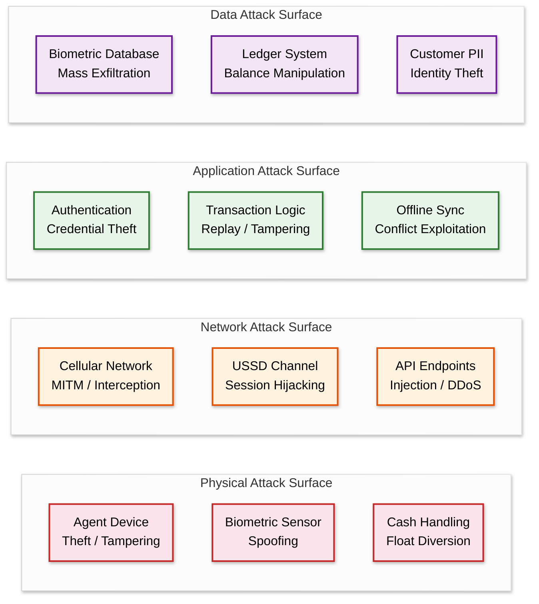
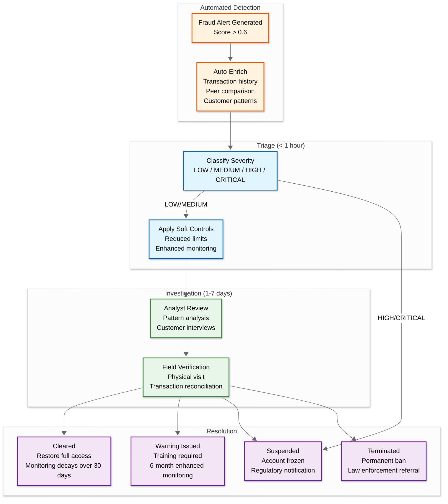

# Security & Compliance — AI-Native Agent Banking Platform for Africa

## Threat Model

### Threat Actors and Motivations

| Actor | Motivation | Capability | Primary Attacks |
|---|---|---|---|
| **Rogue Agent** | Commission fraud, float theft | Physical access to device, knowledge of system flows | Phantom transactions, float diversion, unauthorized fees, split transactions |
| **Organized Crime Ring** | Money laundering, large-scale fraud | Multiple compromised agents, synthetic identities, technical sophistication | Collusion rings, identity fraud, structuring (smurfing), cash-out attacks |
| **Device Thief** | Access to agent's float and customer data | Physical possession of stolen device | Unauthorized transactions using stolen device, data extraction |
| **Biometric Spoofer** | Impersonate customers for unauthorized withdrawals | Printed photos, fake fingerprints, deepfake videos | Spoofing attacks on biometric verification (87% of failed biometric verifications in Southern Africa are AI-spoofing related) |
| **Network Attacker** | Intercept or modify transactions in transit | Network access, MITM capability | Transaction tampering, replay attacks, session hijacking |
| **Insider (Platform Staff)** | Data theft, unauthorized access | Platform credentials, database access | Customer data exfiltration, balance manipulation, audit log tampering |
| **State-Sponsored** | Surveillance, sanctions evasion | Advanced persistent threat capability | Biometric database compromise, transaction surveillance, identity linking |

### Attack Surface Map



---

## Authentication and Access Control

### Multi-Layer Agent Authentication

```
Authentication Stack (Bottom to Top):

Layer 4: Transaction Authorization
         Per-transaction biometric or PIN for high-value transactions
         ↑
Layer 3: Session Authentication
         Agent PIN + device attestation at session start
         Session timeout: 15 min idle, 8 hours absolute
         ↑
Layer 2: Device Binding
         IMEI/serial locked to agent profile
         Device attestation checks for rooting/tampering
         Geo-fence validation against registered location
         ↑
Layer 1: Device Provisioning
         One-time secure provisioning with platform-signed certificate
         Hardware-backed key storage where available
         Remote wipe capability registered
```

### Customer Authentication Tiers

| Transaction Risk | Auth Required | Example Transactions |
|---|---|---|
| **Low** (< ₦5,000) | Phone number + Agent confirmation | Airtime purchase, low-value bill payment |
| **Medium** (₦5,000 - ₦50,000) | Biometric (single factor) OR PIN | Standard deposit/withdrawal |
| **High** (₦50,000 - ₦100,000) | Biometric + PIN (dual factor) | Large withdrawal, account-to-account transfer |
| **Very High** (> ₦100,000 or first-time) | Biometric + PIN + OTP | First-time large transaction, new payee |

### Device Security

| Control | Implementation | Purpose |
|---|---|---|
| **Device attestation** | Platform checks device integrity at each session start; detects rooted, jailbroken, or emulated devices | Prevents transaction processing on compromised devices |
| **Geo-fencing** | GPS + cell tower triangulation validates device is within registered radius (200m default per CBN mandate) | Prevents agent from operating outside approved location |
| **Remote wipe** | Platform can remotely erase all cached data (biometric templates, transaction queue, encryption keys) | Mitigates device theft risk |
| **Encrypted storage** | All local data encrypted with device-bound key stored in hardware security module (where available) or software keystore | Protects data at rest on device |
| **Screen overlay detection** | Detects malicious overlay apps that could capture PINs or biometric data | Prevents credential harvesting malware |
| **Certificate pinning** | Agent app validates server certificate against pinned certificate hash | Prevents MITM attacks via rogue certificates |

---

## Biometric Security

### Anti-Spoofing Measures

| Attack Vector | Detection Method | Response |
|---|---|---|
| **Printed photo** | Liveness detection: blink detection, head movement request, depth estimation via structured light | Reject match; flag agent for review if >3 spoofing attempts |
| **Screen replay (video)** | Moiré pattern detection, screen reflection analysis, challenge-response (random pose request) | Reject match; temporary device lockout |
| **Fake fingerprint (silicone)** | Pulse detection (capacitive sensors), sweat pore analysis, temperature sensing (on supported hardware) | Reject match; escalate to fraud team |
| **Deepfake video** | AI-generated artifact detection, temporal consistency checks, device camera metadata validation | Reject match; account freeze pending investigation |
| **3D mask** | IR-based depth analysis (where hardware supports), skin texture analysis under varying lighting | Reject match; high-severity alert |

### Biometric Template Protection

Biometric templates (the mathematical representations extracted from raw biometric captures) are sensitive data that cannot be changed if compromised (unlike passwords). Protection strategy:

1. **Cancelable biometrics**: Apply a one-way transformation to raw biometric templates before storage; if templates are compromised, generate new templates using a different transformation function
2. **Template encryption**: Encrypt templates at rest using key hierarchy (master key → per-country key → per-region key)
3. **Secure enclaves**: Biometric matching on server runs in trusted execution environments where the decrypted template is never exposed to the host operating system
4. **Access logging**: Every template access (read, match, update) logged with accessor identity, purpose, and timestamp; anomalous access patterns (bulk reads, off-hours access) trigger alerts
5. **Retention limits**: Raw biometric images (photos, fingerprint scans) deleted after template extraction; only mathematical templates retained

### Biometric Database Breach Containment

If a biometric database partition is compromised:

1. **Immediate**: Revoke all templates in affected partition; switch affected customers to PIN-only authentication
2. **24 hours**: Re-enroll affected customers with new cancelable biometric transformation
3. **Ongoing**: Forensic analysis to determine breach scope and attack vector
4. **Notification**: Regulatory notification within 72 hours per data protection requirements

---

## Multi-Jurisdiction Compliance

### Regulatory Framework Matrix

| Requirement | Nigeria (CBN) | Kenya (CBK) | Tanzania (BOT) | Ghana (BOG) |
|---|---|---|---|---|
| **Agent licensing** | Super-agent license required; ₦10M min fine for unlicensed operation | Agent banking guidelines 2010; banks designate agents | Agent banking regulations 2013; BOT approval required | Agent guidelines under Payment Systems Act |
| **Agent exclusivity** | Yes (from April 2026) | No | No | No |
| **Geo-fencing** | Mandatory for all agent devices | Not required | Not required | Not required |
| **KYC tiers** | 3 tiers (Tier 1: ₦50K daily; Tier 2: ₦200K; Tier 3: ₦500K) | 2 tiers (simplified, full) | 2 tiers based on transaction value | 3 tiers aligned with AML guidelines |
| **Transaction limits** | Customer: ₦100K daily, ₦500K weekly; Agent: ₦1.2M daily cash-out | Varies by tier | TZS 3M daily | GHS 5,000 daily |
| **STR reporting** | Real-time to NFIU | Within 24 hours to FRC | Within 3 days to FIU | Within 72 hours to FIC |
| **Data residency** | In-country (NDPA 2023) | In-country (Data Protection Act 2019) | Regional (East Africa) | In-country (Data Protection Act 2012) |
| **Agent records** | Must keep all transaction data; accurate records; report irregularities | 5-year retention | 7-year retention | 5-year retention |
| **Identity system** | NIN (National Identification Number) | Huduma Namba | NIDA | Ghana Card (GhanaPostGPS) |

### Compliance Engine Architecture

```
ALGORITHM EvaluateTransactionCompliance(transaction, agent, customer)
    country ← agent.country_code
    rules ← ComplianceRuleStore.GetRules(country, transaction.type)

    results ← []

    FOR each rule in rules:
        SWITCH rule.type:
            CASE "TRANSACTION_LIMIT":
                daily_total ← GetDailyTotal(customer.id, country)
                IF daily_total + transaction.amount > rule.daily_limit:
                    results.Add(VIOLATION(rule, "DAILY_LIMIT_EXCEEDED"))

            CASE "AGENT_LIMIT":
                agent_daily ← GetAgentDailyTotal(agent.id)
                IF agent_daily + transaction.amount > rule.agent_daily_limit:
                    results.Add(VIOLATION(rule, "AGENT_DAILY_LIMIT"))

            CASE "KYC_TIER_CHECK":
                IF customer.kyc_tier < rule.minimum_tier:
                    results.Add(VIOLATION(rule, "KYC_TIER_INSUFFICIENT"))

            CASE "GEO_FENCE":
                IF rule.geo_fence_required:
                    distance ← DistanceFromRegistered(transaction.location, agent)
                    IF distance > agent.geo_fence_radius:
                        results.Add(VIOLATION(rule, "GEO_FENCE_BREACH"))

            CASE "OPERATING_HOURS":
                IF transaction.time NOT IN rule.allowed_hours:
                    results.Add(WARNING(rule, "OUTSIDE_OPERATING_HOURS"))

            CASE "STR_THRESHOLD":
                IF transaction.amount >= rule.str_threshold:
                    QueueSTR(transaction, agent, customer)
                    results.Add(INFO(rule, "STR_FILED"))

    // Evaluate results
    violations ← results.Filter(type == VIOLATION)
    IF violations.Any():
        RETURN ComplianceResult(BLOCKED, violations)

    warnings ← results.Filter(type == WARNING)
    IF warnings.Any():
        RETURN ComplianceResult(ALLOWED_WITH_FLAGS, warnings)

    RETURN ComplianceResult(ALLOWED, [])
```

### AML/CFT Controls

| Control | Implementation | Regulatory Basis |
|---|---|---|
| **Transaction monitoring** | Real-time rule engine evaluates every transaction against typology patterns (structuring, rapid movement, unusual geographic patterns) | FATF Recommendation 20; country-specific AML laws |
| **Suspicious Transaction Reports (STR)** | Automated STR generation for transactions matching predefined criteria; manual STR capability for compliance officers | NFIU Act (Nigeria); Proceeds of Crime Act (Kenya) |
| **Sanctions screening** | Every customer and agent screened against consolidated sanctions lists (UN, AU, country-specific) at onboarding and periodically | UNSC Resolutions; country-specific sanctions regulations |
| **PEP screening** | Politically exposed person screening at account opening and periodic re-screening | FATF Recommendation 12 |
| **Enhanced Due Diligence (EDD)** | Triggered for high-risk customers (PEP matches, high-value transactions, cross-border activity); requires additional documentation and senior approval | Risk-based approach per FATF |
| **Record retention** | All transaction records, KYC documents, and STRs retained for 5-7 years (varies by jurisdiction); tamper-evident storage with audit trail | Country-specific record retention laws |

---

## Data Protection

### Personal Data Classification

| Category | Examples | Protection Level | Retention |
|---|---|---|---|
| **Biometric data** | Fingerprint templates, facial embeddings, raw images | Highest — encrypted at rest and in transit; access-controlled; cancelable templates | Templates: account lifetime + 1 year; Raw images: deleted after template extraction |
| **Financial data** | Transaction records, balances, float history | High — encrypted at rest; access logging; regulatory retention requirements | 5-7 years per jurisdiction |
| **Identity data** | Name, national ID number, date of birth, address | High — encrypted at rest; minimized collection; consent-based | Account lifetime + regulatory retention |
| **Device data** | IMEI, GPS coordinates, device fingerprint | Medium — encrypted; pseudonymized for analytics | 1 year after device decommissioning |
| **Behavioral data** | Transaction patterns, login times, feature usage | Medium — anonymized for ML training; consent-based for profiling | 2 years; anonymized after |

### Privacy-by-Design Principles

1. **Data minimization**: Collect only what is necessary for the specific function; biometric raw images deleted after template extraction; GPS precision reduced for analytics (grid-level, not exact location)
2. **Purpose limitation**: Data collected for KYC cannot be used for marketing without explicit consent; fraud detection uses transaction patterns, not personal demographics
3. **Consent management**: Explicit consent captured at enrollment for biometric collection, data processing, and cross-border data transfer; consent records maintained with tamper-evident logging
4. **Right to deletion**: Customer can request account closure and data deletion; biometric templates deleted; transaction records retained for regulatory minimum period in anonymized form
5. **Data portability**: Customer can export their transaction history in machine-readable format (regulatory requirement in some jurisdictions)

---

## Incident Response

### Security Incident Severity Levels

| Level | Definition | Example | Response Time | Escalation |
|---|---|---|---|---|
| **P1 — Critical** | Active exploitation affecting financial integrity or mass data breach | Ledger manipulation; biometric DB exfiltration; active fraud campaign | < 15 min response | CISO + CEO + Regulators |
| **P2 — High** | Potential financial loss or data exposure | Compromised agent credentials; unauthorized API access; single-agent fraud ring | < 1 hour response | CISO + Engineering Lead |
| **P3 — Medium** | Security control failure without immediate exploitation | Failed device attestation spike; unusual bulk API calls; geo-fence bypass | < 4 hours response | Security Team Lead |
| **P4 — Low** | Security anomaly requiring investigation | Unusual login patterns; minor compliance deviation; failed spoofing attempt | Next business day | Security Analyst |

### Agent Device Compromise Protocol

When a device is reported stolen or suspected compromised:

1. **Immediate (< 5 minutes)**: Remote wipe command sent to device; agent session invalidated; agent account suspended; all pending offline transactions from that device flagged for review
2. **Within 1 hour**: Analyze all transactions from the device in the last 24 hours for anomalies; freeze customer accounts that transacted on the device if anomalies detected; notify affected customers
3. **Within 24 hours**: Complete forensic analysis; file regulatory notifications; coordinate with law enforcement if financial loss confirmed
4. **Recovery**: Issue new device; re-provision with fresh credentials; re-activate agent with enhanced monitoring for 30 days

---

## Device Attestation Architecture

### Continuous Trust Evaluation

Device attestation is not a one-time check at login—it is a continuous trust evaluation that gates every transaction. The trust score decays over time and must be refreshed periodically.

```
ALGORITHM EvaluateDeviceTrust(device_id, transaction_context)
    trust_score ← 0.0

    // Layer 1: Hardware attestation (checked at boot, cached for session)
    hw_attestation ← GetCachedAttestation(device_id)
    IF hw_attestation.imei_matches AND hw_attestation.no_root_detected:
        trust_score ← trust_score + 0.30
    ELSE:
        RETURN DeviceTrust(score: 0.0, action: "BLOCK", reason: "HW_ATTESTATION_FAILED")

    // Layer 2: Software integrity (verified every 4 hours)
    sw_integrity ← VerifySoftwareSignature(device_id)
    IF sw_integrity.app_genuine AND sw_integrity.no_tampering:
        trust_score ← trust_score + 0.25
    ELSE:
        RETURN DeviceTrust(score: 0.0, action: "BLOCK", reason: "SW_INTEGRITY_FAILED")

    // Layer 3: Behavioral consistency
    behavior ← AnalyzeDeviceBehavior(device_id, window=24_hours)
    IF behavior.txn_velocity_normal AND behavior.location_consistent:
        trust_score ← trust_score + 0.25
    ELSE IF behavior.txn_velocity_elevated:
        trust_score ← trust_score + 0.10
        // Allow but flag

    // Layer 4: Temporal freshness
    hours_since_server_contact ← HoursSince(device.last_server_sync)
    IF hours_since_server_contact < 4:
        trust_score ← trust_score + 0.20
    ELSE IF hours_since_server_contact < 24:
        trust_score ← trust_score + 0.10
    ELSE:
        trust_score ← trust_score + 0.05
        // Long offline — reduce limits

    // Decision
    IF trust_score >= 0.80:
        RETURN DeviceTrust(score: trust_score, action: "ALLOW", limits: "STANDARD")
    ELSE IF trust_score >= 0.60:
        RETURN DeviceTrust(score: trust_score, action: "ALLOW", limits: "REDUCED")
    ELSE:
        RETURN DeviceTrust(score: trust_score, action: "BLOCK", reason: "LOW_TRUST")
```

### Device Fleet Security Metrics

| Metric | Threshold | Response |
|---|---|---|
| **Root detection rate** | > 0.1% of active devices | Investigate device batch; update detection signatures |
| **Attestation failure spike** | > 5x baseline in a region | Possible coordinated attack; escalate to security team |
| **Clone device detection** | Any duplicate IMEI | Immediately block both devices; investigate |
| **App tampering rate** | > 0.05% | Emergency app update push; revoke compromised signing keys if needed |
| **Geo-fence violation rate** | > 2% of online transactions | Investigate GPS spoofing tools in the market |

---

## USSD Channel Security

USSD (Unstructured Supplementary Service Data) is the channel for feature phones without app capability. It presents unique security challenges because USSD sessions are unencrypted on the air interface and pass through telecom infrastructure.

### USSD-Specific Threats

| Threat | Attack Vector | Mitigation |
|---|---|---|
| **Session hijacking** | Attacker intercepts USSD session via SS7 vulnerability | Session-bound OTP for sensitive operations; short session timeout (120s) |
| **SIM swap fraud** | Attacker ports victim's number to new SIM; intercepts USSD | SIM change detection via IMSI monitoring; mandatory cooling period (24h) after SIM swap before high-value transactions |
| **USSD phishing** | Fake USSD prompts trick agents into revealing PINs | Unique agent-specific security word displayed in USSD menu; agent training on phishing recognition |
| **Telecom insider** | Rogue employee at telecom reads USSD session data | End-to-end encryption at application layer within USSD payload; session token rotation every 3 messages |
| **Replay attack** | Captured USSD messages replayed to re-execute transaction | Transaction-bound nonce in every USSD request; server rejects duplicate nonces |

### USSD Security Architecture

```
Security layers for USSD channel:

Layer 3: Application Security
         Transaction-bound nonces, session OTPs
         ↑
Layer 2: Session Security
         120-second timeout, 3 consecutive failures → lockout
         PIN encrypted within USSD payload
         ↑
Layer 1: Identity Binding
         Phone number + SIM fingerprint (IMSI) + agent registration
         SIM-swap detection via carrier API integration
```

---

## NIN-SIM Linking Security

Nigeria's NIN-SIM linkage policy (mandatory since 2024) creates both opportunities and challenges for agent banking security.

### Security Benefits

1. **Stronger identity binding**: Every phone number is linked to a National Identification Number (NIN), providing a government-verified identity anchor for all phone-based transactions
2. **SIM swap protection**: NIN verification adds a layer of identity confirmation during SIM replacement, reducing SIM swap fraud
3. **Cross-referencing capability**: Transaction patterns can be correlated across phone numbers linked to the same NIN, detecting structured fraud across multiple SIM cards

### Integration Challenges

| Challenge | Impact | Mitigation |
|---|---|---|
| **NIMC API reliability** | National ID database has <95% uptime; verification timeouts during peak hours | Cache verified NIN-SIM mappings locally; graceful degradation to biometric-only verification when NIMC is unreachable |
| **Data quality issues** | ~15% of NIN records have mismatched demographic data | Fuzzy matching on name and date of birth; flag mismatches for manual review rather than auto-rejection |
| **Multiple SIMs per NIN** | Legitimate users have 2-4 SIM cards linked to one NIN | Track all SIMs per NIN; aggregate transaction limits across all linked SIMs |
| **NIN sharing/fraud** | Individuals use another person's NIN for SIM registration | Biometric verification at the agent location cross-references against NIN biometric records (where available) |

---

## Agent Fraud Investigation Workflow

When the fraud detection system flags an agent, the investigation follows a structured workflow that balances speed (limiting fraud exposure) with fairness (avoiding unnecessary business disruption).



### Investigation SLAs by Severity

| Severity | Triage | Soft Controls | Investigation Complete | Resolution |
|---|---|---|---|---|
| **LOW** | 4 hours | Monitoring only | 7 business days | Warning or clearance |
| **MEDIUM** | 1 hour | Reduced transaction limits | 5 business days | Training, warning, or clearance |
| **HIGH** | 15 minutes | Reduced limits + manual approval for high-value txns | 3 business days | Suspension pending outcome |
| **CRITICAL** | Immediate | Account frozen | 24 hours initial assessment | Suspension + regulatory notification |

### False Positive Recovery

When an investigation clears an agent:
1. Full transaction limits restored within 1 hour of clearance decision
2. Agent receives notification explaining the review and its resolution
3. Any commission lost during soft-limit period is retroactively calculated and credited
4. Agent's fraud risk score receives a negative adjustment (reduced risk) to prevent re-flagging on the same pattern
5. Investigation pattern added to false-positive training set to improve model precision

---

## Multi-Jurisdiction Data Residency

### Data Residency Architecture

Each country's data protection law specifies where personal data must be stored. The platform implements a federated data architecture where each country's data resides in-country, but cross-border analytics use anonymized aggregates.

```
Data Residency Model:

Nigeria Instance (Lagos DC):
  ├── Nigerian customer PII, biometric templates, transactions
  ├── Nigerian agent records
  └── Full ledger for Nigerian transactions

Ghana Instance (Accra DC):
  ├── Ghanaian customer PII, biometric templates, transactions
  ├── Ghanaian agent records
  └── Full ledger for Ghanaian transactions

Central Analytics (Regional DC):
  ├── Anonymized transaction aggregates (no PII)
  ├── Model training data (de-identified features)
  ├── Cross-border corridor settlement ledger
  └── Platform-wide fraud pattern database (anonymized)
```

### Cross-Border Data Rules

| Data Type | Can Cross Borders? | Condition |
|---|---|---|
| **Customer PII** | No | Stays in originating country's instance |
| **Biometric templates** | No | Country-specific encryption keys; cannot be decrypted outside jurisdiction |
| **Transaction records** | Settlement data only | Cross-border transactions share settlement amounts, not customer details |
| **Fraud patterns** | Yes (anonymized) | Feature vectors without customer identifiers shared for global model training |
| **Agent performance scores** | Yes | Non-PII operational metrics shared across platform |
| **Regulatory reports** | No | Generated and stored within each jurisdiction |

### Data Sovereignty Enforcement

1. **Network-level isolation**: Each country instance runs in a logically isolated network; cross-instance traffic passes through a data gateway that strips PII
2. **Encryption key management**: Each country has independent key management; templates encrypted with country-specific keys cannot be used outside that jurisdiction
3. **Audit trail**: Every cross-border data access logged with purpose, accessor, and data classification; quarterly audit reports generated for each regulator
4. **Breach notification**: Country-specific breach notification timelines enforced (Nigeria NDPA: 72 hours; Kenya DPA: 72 hours; Tanzania: "reasonable time")
