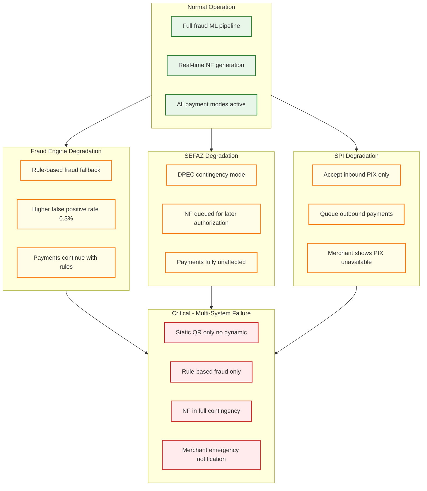

# Scalability & Reliability — AI-Native PIX Commerce Platform

## Scalability Architecture

### Traffic Patterns and Scale Targets

PIX commerce traffic exhibits distinct patterns that drive scaling decisions:

| Pattern | Characteristics | Scale Impact |
|---|---|---|
| **Lunch rush** (11:00-13:00) | 3× average TPS; concentrated in restaurant/food merchants | QR generation and fraud scoring must handle sustained peaks |
| **Month-end billing** (25th-5th) | 2.5× average; salary payments trigger consumer spending | PIX Automático billing scheduler processes bulk mandates |
| **Black Friday / seasonal** | 5-8× average; concentrated in e-commerce | All components must handle burst; SEFAZ may become Slowest part of the process |
| **PIX Automático batch windows** | Bulk mandate submissions 2-10 days before billing dates | Predictable load; can be scheduled during off-peak hours |
| **Night/weekend baseline** | 0.4× average; PIX operates 24/7 but commerce drops overnight | Opportunity for maintenance, batch reconciliation, model retraining |

### Scaling Strategy by Component

#### Transaction Orchestrator

**Approach:** Horizontal scaling with stateless processing nodes behind a load balancer.

Each orchestrator node processes transactions independently. State is externalized:
- Transaction records in the distributed database (write path)
- In-flight transaction state in a distributed coordination service (for saga management)
- Settlement confirmations via the event stream (consumed by any node)

**Scaling trigger:** CPU utilization > 60% or p99 latency > 500ms → add nodes. Auto-scaling group maintains 3× headroom for burst absorption.

**Partition strategy:** Transactions are not partitioned; any node handles any transaction. This simplifies scaling but requires distributed locking for idempotency enforcement (endToEndId deduplication). The lock is lightweight (check-and-set on endToEndId in a distributed cache, TTL = 24 hours).

#### DICT Cache Cluster

**Approach:** Sharded in-memory store with consistent hashing.

800M keys across N shards, with each shard holding ~50/N GB. Scaling adds shards and rebalances via virtual node migration (no full resync needed).

**Read scaling:** Read replicas per shard for lookup-heavy workloads. Cache lookup is embarrassingly parallel—no cross-shard coordination needed.

**Write scaling:** DICT sync is a single-writer pattern per shard (updates from BCB's incremental feed). Write throughput isn't a Slowest part of the process (500K updates/day is trivial); the challenge is consistency propagation to read replicas.

**Failure mode:** If a shard fails, its keys are served from the warm replica (promoted in <5 seconds). If both fail, lookups for that shard's keys fall back to direct DICT query (higher latency but no data loss).

#### AI Fraud Engine

**Approach:** Feature store + model inference separated; each scales independently.

The feature store is a real-time aggregation layer:
- Velocity counters maintained in a distributed counter service (increment on every transaction, windowed TTL)
- Transaction graph stored in a graph database, updated async after settlement
- Device fingerprint store in a key-value cache

Model inference scales horizontally on dedicated compute nodes with ML accelerators. Models are loaded once and serve concurrent requests. A model version router allows canary deployment (10% traffic to new model, 90% to stable).

**Scaling trigger:** Inference p99 > 100ms → add nodes. Feature store counter throughput > 80% capacity → add counter shards.

#### Nota Fiscal Pipeline

**Approach:** Worker pool with per-state rate limiting.

SEFAZ web services have per-PSP rate limits (varies by state, typically 500-2000 requests/minute). The NF pipeline uses a token bucket rate limiter per state, with a worker pool sized to saturate all state limits simultaneously.

**Scaling strategy:**
- Worker pool scales to match transaction volume (1 worker per ~50 NF/minute, accounting for SEFAZ latency)
- During SEFAZ outages (specific state), workers for that state enter contingency mode (DPEC) and don't consume rate limit tokens
- XML generation (CPU-intensive) scales independently from SEFAZ API calls (I/O-bound)

#### PIX Automático Billing Scheduler

**Approach:** Partitioned scheduler with exclusive mandate ownership.

Mandates are partitioned by hash(mandate_id) % N_schedulers. Each scheduler partition owns a non-overlapping set of mandates. Scaling adds partitions and rebalances mandate ownership.

**Leader election:** Each partition has a primary scheduler with a lease-based leader election. If the primary fails, the secondary claims the lease within 60 seconds. The maximum missed-billing risk window is 60 seconds (acceptable given the 2-10 day submission window).

---

## Reliability Architecture

### Failure Modes and Mitigations

#### SPI Connectivity Loss

**Impact:** Cannot settle PIX transactions. Incoming payments from other PSPs queue at BCB; outgoing payments cannot be initiated.

**Detection:** SPI heartbeat monitoring every 5 seconds. Alert on 3 consecutive missed heartbeats.

**Mitigation:**
- Dual RSFN connections (primary and backup) with automatic failover
- If both connections fail, enter "receive-only" mode: accept incoming SPI messages from the backup queue when connectivity restores; suspend outgoing payment initiation
- Merchant notification: change payment status to "temporarily unavailable" via webhook; merchants can display alternative payment methods
- BCB mandates PSPs maintain <5 minutes of downtime per month for SPI connectivity

**Recovery:** On SPI reconnection, drain the SPI outbound queue (payments initiated during the outage) in FIFO (First-In-First-Out, like a line at a store) order. Replay any SPI messages received during the disconnection from BCB's message store.

#### Database Node Failure

**Impact:** Potential write failures for transaction records.

**Architecture:** 6-node distributed SQL cluster with synchronous replication (write to 3 nodes minimum before acknowledgment). Read replicas for query workloads.

**Failure scenarios:**
- 1 node failure: no impact (writes still reach 3+ nodes)
- 2 node failures: writes degraded (2 of 4 remaining nodes, switch to reduced quorum temporarily)
- 3+ node failures: write path unavailable → reject new transactions, continue serving reads from surviving replicas

**Recovery:** Failed nodes rejoin cluster and catch up via log replay. No data loss with synchronous replication.

#### Fraud Engine Degradation

**Impact:** If ML inference is slow or unavailable, transactions are delayed or use fallback scoring.

**Cascade prevention:**
- Circuit breaker on fraud engine: if p99 > 200ms or error rate > 5%, trip the breaker
- When tripped, fall back to rule-based scoring (precomputed rules that approximate ML model decisions at a coarser granularity)
- Rule-based fallback has higher false positive rate (~0.3% vs. 0.05% for ML) but maintains fraud protection
- Automatic recovery: when fraud engine health restores, gradually ramp traffic back (10% → 50% → 100% over 5 minutes)

#### SEFAZ Outage (Specific State)

**Impact:** Cannot authorize Nota Fiscal for merchants in the affected state.

**Mitigation:**
- Contingency mode (DPEC): NF-e issued with contingency authorization; legally valid for 24 hours
- When SEFAZ restores, batch-submit all contingency NF-e for retroactive authorization
- Per-state SEFAZ health dashboard; known maintenance windows pre-scheduled in the system calendar
- SEFAZ outages do not affect payment processing (async pipeline)

#### Event Stream Failure

**Impact:** Downstream consumers (reconciliation, analytics, merchant webhooks) stop receiving events.

**Architecture:** Multi-node event stream cluster with replication factor 3. Partitioned by merchant_id for ordered delivery.

**Failure scenarios:**
- Broker node failure: partition leadership moves to replica; consumer lag increases temporarily but no data loss
- Cluster-wide failure: transaction processing continues (events buffer in the orchestrator's outbound queue); events replayed when the cluster recovers
- Consumer lag > threshold: alert; add consumer instances; if lag is unrecoverable, consumer replays from the earliest unacknowledged offset

### Disaster Recovery

| Scenario | RPO | RTO | Strategy |
|---|---|---|---|
| **Single node failure** | 0 (sync replication) | <30 seconds | Automatic failover, no manual intervention |
| **Availability zone failure** | 0 | <2 minutes | Cross-AZ replicas; automatic traffic reroute |
| **Region failure** | <1 minute | <15 minutes | Active-passive cross-region; async replication for non-critical data; SPI reconnection at DR site |
| **SPI connectivity loss** | 0 | <5 minutes | Dual RSFN links; BCB message store replay on reconnection |
| **Ransomware/corruption** | 0 (immutable backups) | <1 hour | Immutable backup restore; event replay to rebuild state |

### Data Durability

| Data | Durability Strategy | Retention |
|---|---|---|
| **Transaction records** | Synchronous 3-way replication + daily snapshots to object storage | 10 years (BCB requirement) |
| **Nota Fiscal XML** | Object storage with versioning and cross-region replication | 5 years (legal requirement) + 5 years (archival) |
| **Fraud scoring logs** | Append-only event log with async replication | 5 years (audit trail) |
| **DICT cache** | Reconstructible from BCB DICT (no backup needed) | N/A (ephemeral cache) |
| **Mandate records** | Synchronous replication matching transaction records | Duration of mandate + 5 years |
| **Settlement reconciliation** | Event-sourced (reconstructible from transaction + SPI events) | 10 years |

---

## Load Testing Strategy

### Synthetic Load Profiles

| Profile | TPS | Duration | Purpose |
|---|---|---|---|
| **Steady state** | 60 TPS | 4 hours | Verify baseline performance and resource utilization |
| **Lunch peak** | 190 TPS | 2 hours | Validate peak handling for daily commerce rush |
| **Black Friday** | 500 TPS | 8 hours | Stress test for annual peak events |
| **Burst** | 1000 TPS | 15 minutes | Test auto-scaling responsiveness and queue depth behavior |
| **Mandate batch** | 50K mandates in 1 hour | 1 hour | Validate billing scheduler throughput at scale |

### Chaos Engineering

| Experiment | Target | Expected Behavior |
|---|---|---|
| Kill fraud engine node | Fraud scoring service | Remaining nodes absorb load; if all fail, rule-based fallback activates |
| Partition DICT cache shard | DICT cache | Lookups for affected keys fall back to direct DICT query |
| Delay SPI responses by 5s | SPI gateway | Transactions queue but don't timeout (10s SPI SLO); merchant notification delayed |
| SEFAZ state outage | Nota Fiscal pipeline | Contingency mode activates for affected state; payments unaffected |
| Database leader failover | Transaction store | Writes pause for <5 seconds during leader election; no data loss |
| Event stream partition loss | Event stream | Consumer rebalance within 30 seconds; temporary increase in webhook delivery latency |

---

## Capacity Planning

### Growth Projections

PIX P2B transaction volume has been growing at ~40% year-over-year. Platform market share growth target is 0.5% per year.

| Year | Daily PIX P2B (Brazil) | Platform Market Share | Platform Daily TPS (avg) | Platform Daily TPS (peak) |
|---|---|---|---|---|
| Year 1 | 120M | 2% | 28 | 84 |
| Year 2 | 170M | 3% | 59 | 177 |
| Year 3 | 240M | 4% | 111 | 333 |
| Year 4 | 330M | 5% | 191 | 573 |

### Infrastructure Scaling Milestones

| Milestone | Trigger | Actions |
|---|---|---|
| **50 TPS** | Initial launch | 8-node payment cluster, 4-node DICT cache, 4-node fraud engine |
| **200 TPS** | Year 2 growth | Add 8 payment nodes, 2 DICT cache shards, 4 fraud engine nodes; second RSFN link |
| **500 TPS** | Year 3 + seasonal peaks | Database cluster expansion (6→9 nodes), dedicated NF pipeline cluster, cross-region DR active |
| **1000 TPS** | Year 4 + Black Friday | Full multi-region active-active deployment; DICT cache fully sharded across 8 nodes |

---

## Settlement Account Liquidity Management

### The Pre-Funding Challenge

PSPs must pre-fund their SPI settlement accounts at BCB with sufficient reserves to cover outbound PIX transactions. Unlike card networks where merchants receive settlement days later, PIX settles in real-time—meaning the PSP must have the funds available in central bank money at the exact moment of settlement.

```
LIQUIDITY MANAGEMENT STRATEGY:

INTRADAY MONITORING (every 5 minutes):
    balance = query_spi_settlement_balance()
    projected_4h_outflow = ml_predict_outflow(time_of_day, day_of_week, queue_depth)
    projected_4h_inflow = ml_predict_inflow(time_of_day, pending_merchants)

    headroom = balance + projected_4h_inflow - projected_4h_outflow

    IF headroom < minimum_buffer:
        REQUEST treasury_injection(deficit)
        ALERT("Settlement account needs funding within 4 hours")

    IF headroom < 0:
        ACTIVATE payment_triage_mode():
            - Process inbound PIX normally (adds to balance)
            - Queue outbound PIX by priority (VIP merchants first)
            - Suspend low-priority outbound (refunds, platform payouts)
        ALERT_P0("Settlement account critically low")

DAILY RECONCILIATION:
    internal_ledger_balance = SUM(all_settled_credits) - SUM(all_settled_debits)
    spi_reported_balance = bcb_api.get_balance()
    IF ABS(internal_ledger_balance - spi_reported_balance) > THRESHOLD:
        FREEZE outbound payments
        INITIATE forensic reconciliation
```

---

## Graceful Degradation Matrix



---

## Chaos Engineering

### Failure Injection Experiments

| Experiment | Target | Method | Expected Behavior | Blast Radius |
|-----------|--------|--------|-------------------|--------------|
| **Kill fraud engine node** | Fraud scoring cluster | Process kill | Remaining nodes absorb; if all fail, rule-based fallback activates in <1s | Slightly higher false positive rate |
| **Partition DICT cache shard** | DICT cache shard 2 | Network partition | Lookups for affected keys fall back to direct DICT query (30-50ms vs 2ms) | Latency increase for 1/N of keys |
| **Delay SPI responses by 5s** | SPI gateway | Network delay injection | Transactions queue but complete within 10s SLO; merchant notifications delayed | All transactions slower |
| **SEFAZ state outage** | São Paulo SEFAZ | Block SEFAZ endpoint | DPEC contingency activates for SP merchants; payments unaffected | NF for SP delayed |
| **Database leader failover** | Transaction store leader | Process kill | Writes pause <5s during leader election; no data loss; auto-resume | Brief write unavailability |
| **Event stream partition loss** | Event stream broker | Kill broker node | Consumer rebalance in 30s; webhook delivery lag increases | Merchant webhook delay |
| **Settlement account zero balance** | SPI settlement account | Simulate zero balance | Outbound payments queued; inbound continue; triage mode activated | Outbound PIX blocked |

### Game Day Scenarios

| Scenario | Duration | Objective |
|----------|----------|-----------|
| **Black Friday simulation** | 4 hours at 5× TPS | Validate auto-scaling, SEFAZ rate limiting, fraud engine performance under load |
| **RSFN connectivity loss** | 1 hour | Verify dual-link failover, message store replay on reconnection, merchant notification flow |
| **Mass mandate billing** | 2 hours | Process 100K mandates in billing window; verify scheduler partition rebalancing |
| **Region failover** | 6 hours | Full DR exercise: failover to standby region, verify SPI reconnection, measure RTO |

---

## Multi-Region Architecture

```
ACTIVE-PASSIVE with Hot Standby:

PRIMARY REGION (São Paulo):
    - All payment processing services (active)
    - SPI connection via primary RSFN link
    - DICT cache (full replica)
    - Database primaries with synchronous replication
    - Fraud engine (active)
    - SEFAZ connectivity (all 27 states)

STANDBY REGION (Rio de Janeiro):
    - Database replicas (async, <1s lag for non-critical, sync for transactions)
    - Pre-provisioned compute (cold standby, warm-up in <5 min)
    - Secondary RSFN link (inactive but tested monthly)
    - DICT cache (partial, rebuilt from BCB on activation)
    - SEFAZ connectivity (pre-configured, tested quarterly)

WHY NOT ACTIVE-ACTIVE:
    - SPI connection is per-PSP, single-point-of-entry (BCB constraint)
    - Transaction deduplication across regions risks double-settlement
    - Settlement account is singular (one account at BCB per PSP)
    - Active-passive with <5 min RTO meets BCB requirements

FAILOVER PROCESS:
    1. Detection: primary region health check fails for 60s
    2. Decision: automated for stateless services, MANUAL for SPI cutover
    3. SPI cutover: activate secondary RSFN link (requires BCB notification)
    4. Database: promote replicas to primaries
    5. DICT: rebuild cache from BCB incremental sync (warm-up period)
    6. Verification: process test transactions before accepting merchant traffic
```

---

## Performance Optimization Strategies

### QR Code Generation Optimization

```
QR Generation Latency Budget (target: p99 < 200ms):

    COB/COBV creation:      20ms  (database write + charge ID generation)
    JWT payload encoding:    5ms   (signing with merchant key)
    BR Code assembly:        2ms   (EMVCo TLV construction)
    QR image rendering:      10ms  (PNG generation, 300×300 px)
    API response:            3ms   (serialization + network)
    ────────────────────────────
    Total budget:            40ms  (4× headroom below 200ms target)

OPTIMIZATION:
    - Pre-generate QR image templates per merchant (cache base layout)
    - Batch COB creation for merchants with predictable transaction patterns
    - Async charge endpoint hosting (deferred payload until payer scans)
    - Connection pooling for database writes (avoid connection overhead)
```

### Fraud Engine Optimization

```
Fraud Scoring Latency Budget (target: p99 < 200ms):

    Feature extraction:      30ms  (velocity counters + device lookup)
    DICT metadata fetch:     5ms   (from local cache, parallel with features)
    Rule evaluation:         10ms  (fast-path: obvious approve/decline)
    ML inference:            80ms  (gradient boosting ensemble)
    GNN inference:           50ms  (transaction graph, if rule score is ambiguous)
    Decision logic:          5ms   (combine scores, apply thresholds)
    ────────────────────────────
    Total budget:            180ms (20ms headroom)

OPTIMIZATION:
    - Cascading evaluation: rules first (10ms), ML only if rules are uncertain
    - 70% of transactions approved by rules alone (never hit ML)
    - Feature store pre-computed (velocity counters updated on every transaction)
    - Model distillation: production model is compressed student of larger teacher
    - GNN inference only for transactions scoring 0.3-0.7 (ambiguous zone)
```

---

## Capacity Planning Formulas

| Component | Formula | Example (5% share, peak) |
|-----------|---------|--------------------------|
| **Transaction processing nodes** | peak_TPS × avg_processing_ms ÷ 1000 ÷ utilization_target | 190 × 50ms ÷ 1000 ÷ 0.6 = 16 nodes |
| **Fraud engine nodes** | peak_TPS × model_inference_ms ÷ 1000 ÷ cores_per_node ÷ utilization | 190 × 100ms ÷ 1000 ÷ 8 ÷ 0.7 = 3.4 → 4 nodes |
| **DICT cache nodes** | total_cache_size ÷ usable_memory_per_node | 50 GB ÷ 48 GB = 1.04 → 4 nodes (replication + HA) |
| **NF pipeline nodes** | daily_NF ÷ NF_per_node_per_day | 5.5M ÷ 500K = 11 → 12 nodes |
| **Event stream partitions** | peak_TPS × retention_seconds ÷ partition_capacity | 190 × 86400 ÷ 1M = 16.4 → 24 partitions |
| **Database IOPS** | peak_TPS × writes_per_txn | 190 × 5 = 950 IOPS sustained |

### Scale Trigger Thresholds

| Metric | Scale-Up Trigger | Scale-Down Trigger | Min Instances |
|--------|-----------------|-------------------|---------------|
| Transaction processing CPU | > 60% for 5 minutes | < 30% for 15 minutes | 6 |
| Fraud engine queue depth | > 50 pending requests | < 10 for 10 minutes | 4 |
| NF pipeline backlog | > 10,000 pending NF-e | < 1,000 for 15 minutes | 4 |
| API gateway connections | > 70% connection limit | < 30% for 10 minutes | 3 |

---

## Hot Partition Detection and Mitigation

### Detection Metrics

- **Event stream:** Per-partition lag (consumer offset − producer offset); alert if any partition lag exceeds 10 seconds
- **Database:** Per-shard query latency; alert if any shard p99 exceeds 2× cluster average
- **DICT cache:** Per-shard hit rate divergence; alert if any shard miss rate exceeds 5× average

### Response Ladder

1. **Level 1 (automated):** Redistribute traffic within existing partitions; rebalance cache shard assignments
2. **Level 2 (semi-automated):** Add partitions/shards; requires operator approval for event stream (rebalancing pauses consumers briefly)
3. **Level 3 (manual):** Investigate root cause—hot partition often indicates a single large merchant dominating traffic; consider per-merchant partitioning or dedicated tenant isolation

## AI Release Ladder

Every AI model or capability change in this system MUST follow this rollout sequence:

| Stage | Description | Gate Criteria |
|-------|-------------|---------------|
| 1. Offline Evaluation | Benchmark against historical ground truth | Meets baseline metrics |
| 2. Shadow Mode | Run in parallel with production, compare outputs | No regression on key metrics |
| 3. Canary (Blast-Radius Capped) | 1-5% traffic, human review of all outputs | Error rate < threshold |
| 4. Human-Reviewed Production | AI recommends, human approves all actions | Approval rate > 90% |
| 5. Limited Autonomous Production | AI acts within pre-approved boundaries | Continuous monitoring, no alerts |
| 6. Instant Rollback | One-click revert to previous model/rules | < 5 min rollback time |

**Note:** AI capabilities that directly interact with end users or execute actions on their behalf must reach Stage 4 (human-reviewed production) with domain-expert sign-off before deployment. Stage 5 limited autonomy applies only to well-bounded, low-risk action categories with established rollback procedures.
