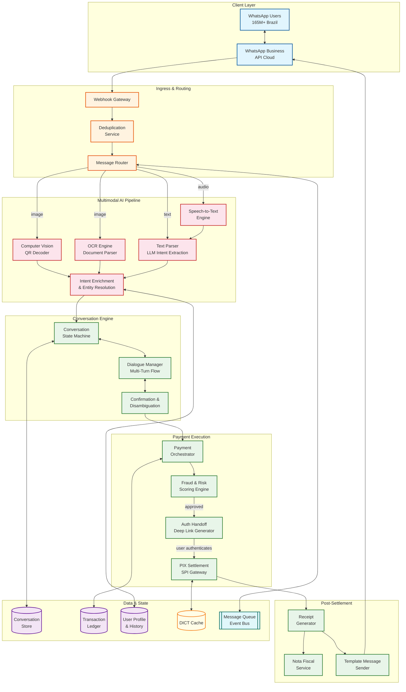
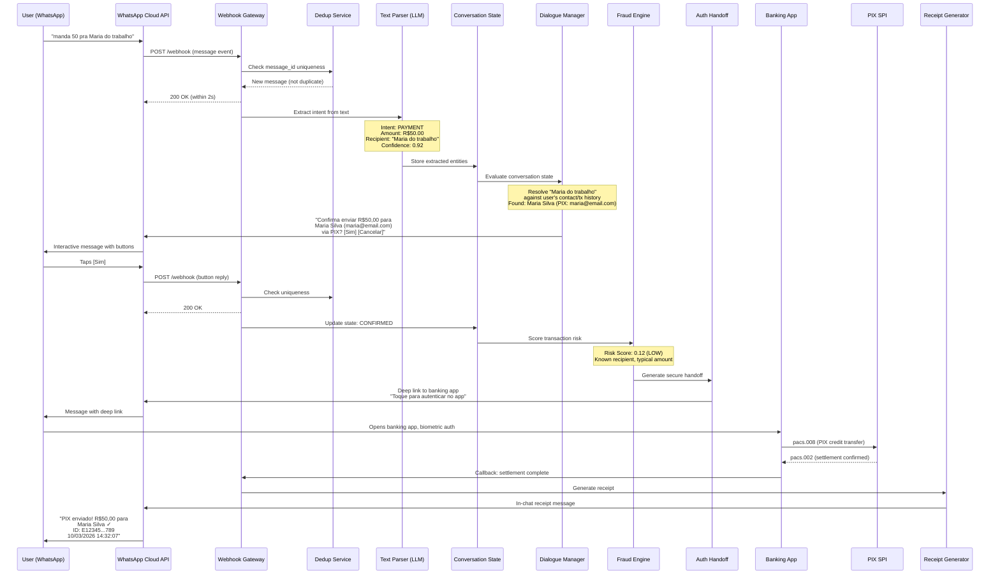
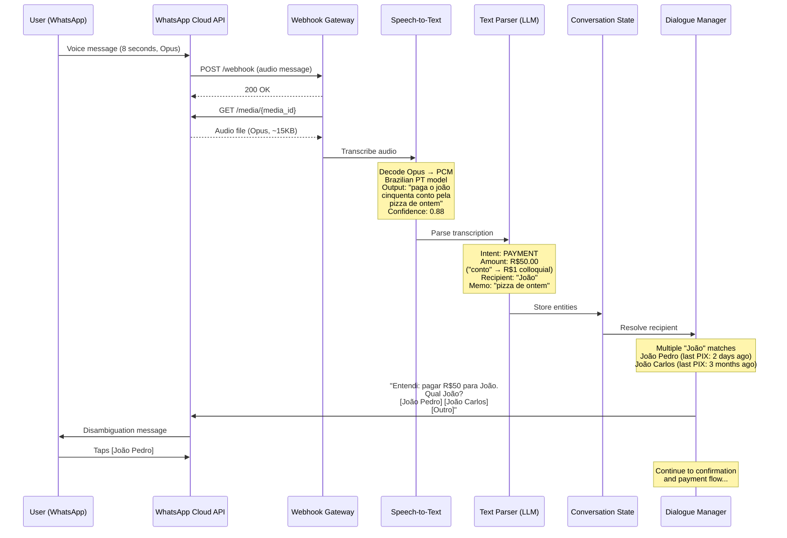
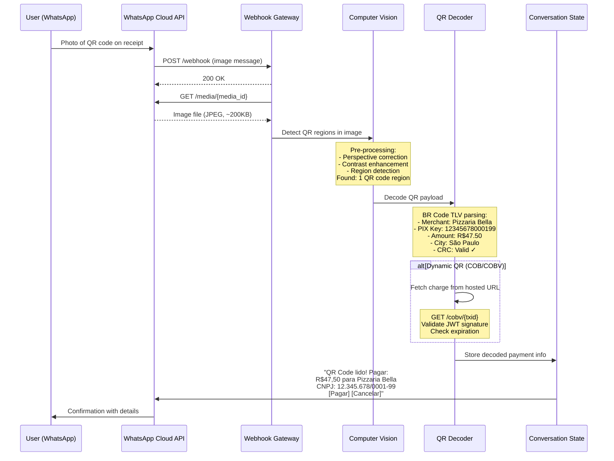
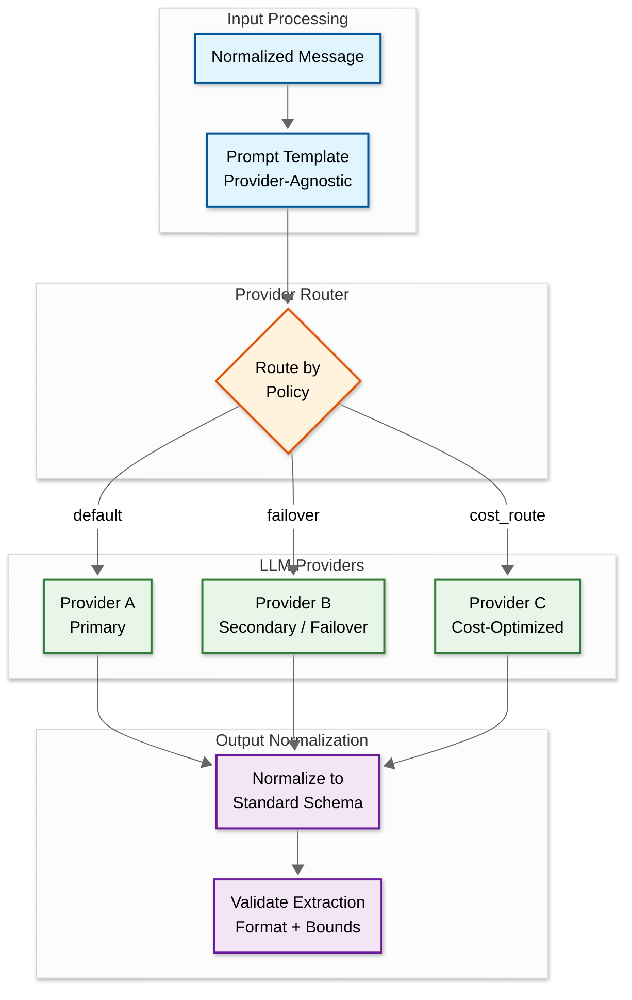

# High-Level Design — AI-Native WhatsApp+PIX Commerce Assistant

## System Architecture



---

## Data Flow: Payment via Text Message



---

## Data Flow: Payment via Voice Message



---

## Data Flow: Payment via QR Code Photo



---

## Key Architectural Decisions

### 1. Sync vs. Async Communication

| Component | Model | Justification |
|---|---|---|
| Webhook ingestion | **Async** | Must acknowledge within 20s (WhatsApp timeout); actual processing happens asynchronously via message queue |
| AI pipeline (STT, CV, LLM) | **Async with streaming** | AI inference takes 1-4 seconds; queue-based with priority (text fastest, voice/image slower) |
| Payment settlement (SPI) | **Sync** | PIX settlement is inherently synchronous; the payer's PSP submits to SPI and waits for pacs.002 confirmation |
| Receipt delivery | **Async** | Decoupled from settlement; receipt generation and WhatsApp message sending happen after settlement callback |

### 2. Event-Driven vs. Request-Response

**Decision: Event-driven core with request-response at boundaries.**

The system's internal architecture is event-driven: each message ingestion produces an event that flows through the AI pipeline, conversation engine, and payment orchestrator. This enables:
- Decoupling between AI processing stages (STT can scale independently of CV)
- Retry and dead-letter handling for failed AI inferences
- Audit trail via event log (every state transition recorded)

Request-response is used only at system boundaries:
- WhatsApp Cloud API (webhooks in, API calls out)
- PIX SPI integration (pacs.008 request, pacs.002 response)
- DICT lookups (key-to-account resolution)

### 3. Database Choices (Polyglot Persistence)

| Data | Store Type | Rationale |
|---|---|---|
| **Conversation state** | Document store (e.g., MongoDB) | Flexible schema for multi-turn dialogue; per-user partition; TTL for 24-hour window expiry |
| **Transaction ledger** | Relational DB (e.g., PostgreSQL) | ACID guarantees for financial records; strong consistency; audit requirements |
| **User profiles & history** | Document store | Semi-structured user preferences, contact mappings, transaction history |
| **DICT cache** | In-memory store (e.g., Redis) | Sub-millisecond key-to-account lookups; TTL-based refresh from BCB |
| **Message deduplication** | In-memory store (e.g., Redis) | WhatsApp message ID dedup with 24-hour TTL |
| **Event bus** | Distributed log (e.g., Kafka) | Ordered event processing per conversation; replay capability; exactly-once semantics |
| **AI model registry** | Object storage + metadata DB | Model versioning, A/B testing, rollback capability |
| **Audit logs** | Append-only store | Immutable, hash-chained for regulatory compliance |

### 4. Caching Strategy

| Cache Layer | Data | TTL | Strategy |
|---|---|---|---|
| **L1 (in-process)** | Active conversation state | 5 min | LRU; ~10K concurrent conversations per node |
| **L2 (distributed)** | Conversation state, user profiles | 24 hours | Write-through for state, read-through for profiles |
| **DICT cache** | PIX key → account mappings | 15 min | Background refresh; fallback to direct DICT query on miss |
| **Template cache** | Pre-approved WhatsApp message templates | 1 hour | Refresh on template approval webhook |
| **AI model cache** | Loaded model weights | Until new version | Blue-green swap on model deployment |

### 5. Message Queue Usage

| Queue/Topic | Purpose | Ordering | Delivery |
|---|---|---|---|
| `inbound-messages` | Raw webhook events | Per-conversation (partition by user phone hash) | At-least-once with dedup |
| `ai-pipeline` | AI processing tasks | Per-conversation | At-least-once; priority sub-queues by modality |
| `payment-commands` | Confirmed payment intents | Per-user | Exactly-once (idempotency key) |
| `settlement-events` | SPI settlement callbacks | Per-transaction | At-least-once with dedup by endToEndId |
| `outbound-messages` | WhatsApp API messages to send | Per-conversation | At-least-once with rate limiting (80-1000 msg/s) |
| `audit-events` | All state transitions | Global ordering | At-least-once; append-only consumer |

---

## Architecture Pattern Checklist

- [x] **Sync vs Async**: Async ingestion + processing; sync at payment settlement boundary
- [x] **Event-driven vs Request-response**: Event-driven core; request-response at WhatsApp and PIX boundaries
- [x] **Push vs Pull**: Push-based (WhatsApp pushes webhooks to us; we push messages back via API)
- [x] **Stateless vs Stateful**: Stateless services with externalized state (conversation store, ledger); AI models loaded in memory (stateful at node level, but horizontally scalable)
- [x] **Read-heavy vs Write-heavy**: Write-heavy for ingestion (35M messages/day); read-heavy for conversation state retrieval during multi-turn flows
- [x] **Real-time vs Batch**: Real-time for all transaction paths; batch for analytics, model retraining, and compliance reporting
- [x] **Edge vs Origin**: Origin processing for AI inference (GPU requirements); edge CDN not applicable (no static content)

---

## Component Interaction Summary

### Happy Path (Text Payment)

1. **Ingress** (50ms): Webhook received → deduplicated → queued
2. **AI Extraction** (500ms-1.5s): LLM parses text → extracts intent, amount, recipient
3. **Entity Resolution** (200ms): Recipient name → PIX key via user history + DICT
4. **Conversation Turn** (100ms): State machine transitions → generates confirmation message
5. **User Confirmation** (human time): User taps "Confirm" button
6. **Fraud Scoring** (100ms): Risk assessment on extracted transaction parameters
7. **Auth Handoff** (200ms): Generate deep link with encrypted, short-lived token
8. **User Authentication** (human time): Biometric/PIN in banking app
9. **PIX Settlement** (3-10s): SPI processes pacs.008 → returns pacs.002
10. **Receipt** (500ms): Generate receipt → send via WhatsApp template message

**Total system time (excluding human interaction):** ~2-13 seconds
**Total user-perceived time (including authentication):** ~15-30 seconds

### Degraded Mode

| Failure | Degraded Behavior |
|---|---|
| LLM unavailable | Fall back to rule-based regex extraction for simple patterns; queue complex messages for retry |
| STT unavailable | Respond with "Voice messages temporarily unavailable, please type your request" |
| CV unavailable | Respond with "Photo processing unavailable, please enter PIX key manually" |
| DICT cache miss | Direct DICT query (30-50ms instead of 2ms); still within latency budget |
| SPI unavailable | Queue payment for retry; notify user of delay; this is extremely rare (PIX operates 24/7) |
| WhatsApp API rate limited | Queue outbound messages; prioritize payment confirmations and receipts over informational messages |

---

## Architecture Decision Records

### ADR 1: Asynchronous Webhook Processing

**Context:** WhatsApp Cloud API enforces a 20-second timeout on webhook responses. AI processing (LLM, STT, CV) takes 1-4 seconds normally but can spike to 10+ seconds under load.

**Decision:** Immediately acknowledge all webhooks (200 OK within 2 seconds), then process asynchronously via message queue.

**Rationale:**
- Synchronous processing risks 20-second timeout violations, causing WhatsApp to retry (creating duplicate events)
- Async decouples ingestion rate from processing rate, enabling independent scaling
- Message queue provides natural buffering for load spikes
- Dead-letter queues handle persistent processing failures

**Trade-off accepted:** The user sees a slight delay between sending a message and receiving a response (vs. immediate response in sync processing). Mitigated by WhatsApp's "typing indicator" during processing.

### ADR 2: Three-Layer Deduplication

**Context:** WhatsApp delivers webhooks at-least-once. PIX settlements are irrevocable. A single missed dedup = permanent financial loss.

**Decision:** Implement three independent deduplication layers, each capable of preventing duplicates if the other layers fail.

**Rationale:**
- Layer 1 (Redis): Fast, handles 99.9% of duplicates with SET NX on message ID
- Layer 2 (Conversation lock): Prevents concurrent state transitions on the same conversation
- Layer 3 (DB unique constraint): Prevents duplicate payment records even if Redis and locks fail
- Triple redundancy because the cost of failure (irrevocable financial loss) is asymmetrically high compared to the cost of implementation (modest)

**Trade-off accepted:** Added latency (2ms for Redis + potential lock wait); added operational complexity (3 dedup systems to monitor); over-engineering for non-financial systems.

### ADR 3: Mandatory User Confirmation for All Payments

**Context:** AI extraction accuracy is 87-95% depending on modality. Some teams propose skipping confirmation for high-confidence repeat transactions.

**Decision:** Require explicit user confirmation for every payment, regardless of confidence score.

**Rationale:**
- PIX is irrevocable: a wrong payment cannot be undone via chargeback
- At 3M daily payments and 5% error rate, "smart skip" would produce 150K incorrect payments per day
- The confirmation adds one message round-trip (~5 seconds) but eliminates AI-caused financial errors entirely
- User confirmation also serves as the last fraud defense: even if the AI is manipulated via prompt injection, the user sees and approves the actual parameters

**Trade-off accepted:** Slower UX (one extra message per payment); lower conversion rate vs. frictionless payment; future opportunity to introduce smart-skip for repeat transactions after extensive A/B testing.

---

## Cross-Cutting Concerns

### Idempotency Design

| Operation | Idempotency Key | Scope |
|---|---|---|
| **Webhook processing** | WhatsApp message ID (`wamid`) | 24-hour TTL in Redis |
| **Payment intent creation** | Conversation ID + state version | DB unique constraint per conversation |
| **SPI payment submission** | Intent ID + idempotency token | PIX end-to-end ID (BCB-mandated uniqueness) |
| **Receipt delivery** | Transaction ID + receipt type | Redis SET NX with 1-hour TTL |
| **DICT lookup** | PIX key + timestamp bucket (15-min) | Cache with TTL-based refresh |

### Rate Limiting Strategy

| Level | Limit | Purpose |
|---|---|---|
| **Global webhook intake** | 10,000 req/s | Protect infrastructure from DDoS |
| **Per-IP webhook** | 50 req/s | Detect and throttle anomalous sources |
| **Per-user messages** | 50 messages/hour | Prevent bot abuse or misbehaving clients |
| **Per-user payments** | 5 payments/hour | BCB-aligned transaction velocity limit |
| **Per-merchant QR scans** | 1,000 scans/hour | Prevent viral QR overload |
| **Outbound messages** | 80-1,000/s (WhatsApp tier) | Platform-imposed; managed via priority queue |

### Circuit Breaker Configuration

| Service | Failure Threshold | Open Duration | Fallback |
|---|---|---|---|
| **LLM inference** | 5 failures / 10s | 30s | Regex extraction for simple patterns |
| **STT engine** | 3 failures / 10s | 30s | "Please type your request" response |
| **CV engine** | 3 failures / 10s | 30s | "Please enter PIX key manually" response |
| **DICT query** | 5 failures / 10s | 60s | Stale cache (acceptable for 15 min) |
| **SPI gateway** | 2 failures / 30s | 120s | Queue payments with user notification |
| **WhatsApp send API** | 10 failures / 5s | 15s | Retry queue with exponential backoff |

---

## Multi-LLM Abstraction Layer (CADE Compliance)



**Provider Qualification Protocol:**
1. Run golden dataset (10,000+ annotated Brazilian Portuguese payment messages) against candidate provider
2. Require >93% accuracy on amount extraction and >90% on recipient extraction
3. Verify no systematic biases (e.g., model always interprets "conto" as R$1,000 when training data skews São Paulo)
4. Load test at 500 QPS to verify latency meets SLA (<1.5s p95)
5. Verify structured output format compliance (no hallucinated fields)

---

## WhatsApp Template Message Strategy

WhatsApp requires pre-approved message templates for proactive notifications (messages sent outside the 24-hour conversation window). Template management is a first-class architectural concern because:
- Templates must be submitted to Meta for review days before use
- Template variables have strict formatting rules
- Template rejection can block critical user communications
- Each template version has its own approval status

### Template Library

| Template ID | Purpose | Variables | Approval Status |
|---|---|---|---|
| `payment_receipt_v3` | Post-settlement receipt | `{{amount}}`, `{{recipient}}`, `{{e2e_id}}`, `{{timestamp}}` | Active |
| `payment_confirmation_v3` | Pre-settlement confirmation | `{{amount}}`, `{{recipient_masked}}`, `{{pix_key_type}}` | Active |
| `subscription_activated` | Pix Automático setup confirmation | `{{merchant}}`, `{{amount}}`, `{{frequency}}`, `{{next_date}}` | Active |
| `subscription_executed` | Monthly Pix Automático notification | `{{merchant}}`, `{{amount}}`, `{{date}}` | Active |
| `fraud_alert_v2` | Pre-transaction scam warning | `{{amount}}`, `{{risk_reason}}` | Active |
| `med_claim_update` | MED status notification | `{{claim_status}}`, `{{amount}}`, `{{expected_date}}` | Active |
| `service_degraded` | System issue notification | `{{affected_feature}}`, `{{estimated_recovery}}` | Active |
| `balance_insufficient` | Auto-debit failure alert | `{{merchant}}`, `{{amount}}`, `{{retry_time}}` | Active |

### Graceful Degradation Hierarchy

The system degrades in a prioritized order, protecting payment execution above all other capabilities:

```
Degradation Levels (from least to most severe):

Level 0: NORMAL — All capabilities operational
  └── Full multimodal support, rich messages, real-time balances

Level 1: AI_DEGRADED — LLM/STT/CV partially unavailable
  ├── Text: fall back to regex extraction (handles ~40% of messages)
  ├── Voice: "Please type your request" response
  ├── Image: "Please enter PIX key manually" response
  └── Payments still fully functional for successfully extracted intents

Level 2: OUTBOUND_CONSTRAINED — WhatsApp rate limited
  ├── Priority queue activated: receipts > confirmations > info
  ├── Rich interactive messages → simple text messages
  ├── Balance queries → delayed response with timestamp
  └── Marketing/broadcast messages paused entirely

Level 3: PAYMENT_DEGRADED — SPI or auth service issues
  ├── New payment intents queued with user notification
  ├── Existing in-flight payments continue (SPI retry)
  ├── Balance queries still operational
  └── Conversation engine fully operational (can extract, confirm)

Level 4: CHANNEL_DOWN — WhatsApp API unavailable
  ├── In-flight payments with auth tokens continue in banking app
  ├── Receipts queued for delivery when channel recovers
  ├── Push notification via banking app: "Use app directly"
  └── No new payment conversations possible
```

### Regional Deployment Topology

```
Brazil Region Configuration:

Primary: São Paulo (sa-east-1 equivalent)
├── Full compute: webhook gateways, AI pipeline, payment orchestrator
├── GPU pool: LLM inference, STT, CV (majority of compute)
├── Primary databases: transaction ledger, conversation store
├── Redis cluster: dedup cache, DICT cache, conversation state
└── SPI/DICT connectivity: direct RSFN network attachment

Secondary: Rio de Janeiro (disaster recovery)
├── Hot standby: webhook gateways (active-passive)
├── Database replicas: synchronous for transaction ledger, async for conversation
├── GPU pool: 30% of primary capacity (scale-up on failover)
└── SPI connectivity: independent RSFN attachment (BCB requirement for DR)

Failover criteria:
├── Automatic: primary health check fails for 60 seconds
├── Manual: BCB RSFN maintenance window (scheduled)
└── RTO: < 5 minutes for payment processing; < 15 minutes for AI pipeline
```

### Template Versioning Protocol

1. New template versions submitted 7 business days before planned deployment
2. If Meta rejects template: use previous version; iterate on rejected template
3. Template variable changes require new template version (Meta treats as new template)
4. Templates rotated quarterly to comply with Meta's anti-spam policies
