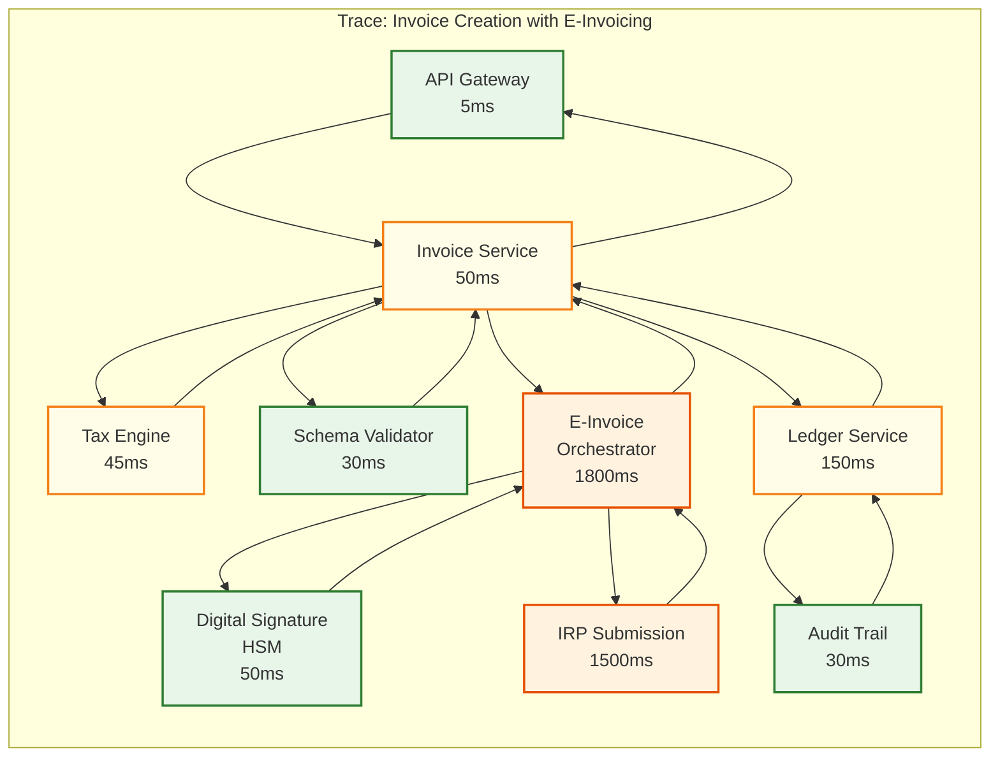

# 14.3 AI-Native MSME Accounting & Tax Compliance Platform — Observability

## Key Metrics

### Business Metrics (Product Health)

| Metric | Description | Target | Alert Threshold |
|---|---|---|---|
| **Auto-categorization accuracy** | Percentage of ML-categorized transactions that are not corrected by users within 7 days | ≥ 95% (new businesses), ≥ 99% (established) | < 90% for any cohort |
| **Auto-match rate** | Percentage of bank transactions automatically reconciled without user intervention | ≥ 85% | < 75% |
| **OCR extraction accuracy** | Percentage of extracted invoice fields that are correct (measured by user corrections) | ≥ 95% for printed invoices | < 90% |
| **Filing success rate** | Percentage of returns successfully filed on first attempt | ≥ 90% | < 80% |
| **E-invoice success rate** | Percentage of e-invoice submissions that receive IRN on first attempt | ≥ 95% | < 90% |
| **Ledger balance accuracy** | Zero tolerance: total debits must equal total credits for every business at all times | 100% | Any imbalance triggers P0 incident |
| **ITC reconciliation match rate** | Percentage of purchase invoices matched with GSTR-2B entries | ≥ 90% | < 80% |
| **User correction rate** | Percentage of transactions where user changes the auto-categorization | ≤ 5% | > 10% (indicates model degradation) |

### Technical Metrics (System Health)

| Metric | Description | Target | Alert Threshold |
|---|---|---|---|
| **Journal entry write latency (p99)** | Time to write a balanced journal entry to the ledger | ≤ 200 ms | > 500 ms |
| **Categorization latency (p99)** | Time to categorize a single bank transaction | ≤ 500 ms | > 1 s |
| **Reconciliation duration (p95)** | Time to complete reconciliation for 500 transactions | ≤ 30 s | > 60 s |
| **E-invoice round-trip (p95)** | Time from invoice creation to IRN receipt | ≤ 3 s | > 5 s |
| **Tax computation (p99)** | Time to compute tax for a single line item | ≤ 50 ms | > 100 ms |
| **OCR extraction time (p95)** | Time to extract data from a single invoice page | ≤ 5 s | > 10 s |
| **Report generation (p95)** | Time to generate a full financial statement | ≤ 30 s | > 60 s |
| **Filing queue depth** | Number of returns waiting to be filed | ≤ 1,000 (normal), ≤ 50,000 (deadline) | > 100,000 |

### Infrastructure Metrics

| Metric | Description | Target | Alert Threshold |
|---|---|---|---|
| **Database write throughput** | Journal entries written per second across all shards | Capacity for 15,000/sec peak | > 80% capacity utilization |
| **Database read latency (p99)** | Single-shard query latency | ≤ 50 ms | > 100 ms |
| **Event queue lag** | Consumer lag in the transaction ingestion pipeline | ≤ 30 s | > 5 min |
| **OCR GPU utilization** | Average GPU utilization across OCR cluster | 60-80% | > 90% (scale up), < 30% (scale down) |
| **Categorization model memory** | Memory usage of ML model instances | ≤ 2 GB per instance | > 3 GB |
| **Audit log write rate** | Audit entries written per second | Capacity for 50,000/sec | > 80% capacity |
| **Government portal health** | Success rate of API calls to IRP and GST portal | Informational (external dependency) | < 80% success rate → trigger adaptive rate limiting |

---

## Logging Strategy

### Log Structure

All logs follow a structured JSON format with mandatory fields:

```
{
  "timestamp": "2026-01-15T10:30:00.000Z",
  "level": "INFO",
  "service": "ledger-service",
  "instance_id": "ledger-shard-042-i3",
  "trace_id": "abc123def456",
  "span_id": "789ghi",
  "business_id": "biz_001",        // ALWAYS present for business-scoped operations
  "user_id": "usr_001",            // present for user-initiated actions
  "operation": "create_journal_entry",
  "status": "SUCCESS",
  "duration_ms": 145,
  "metadata": {
    "journal_entry_id": "je_001",
    "entry_type": "STANDARD",
    "line_count": 4,
    "total_debit": 59000.00,      // financial amounts are logged for operational debugging
    "balanced": true
  }
}
```

### Log Levels by Domain

| Domain | INFO | WARN | ERROR |
|---|---|---|---|
| **Ledger** | Journal entry created, reversed, approved | Slow write (>200ms), high shard utilization | Balance violation detected, write failure, shard unavailable |
| **Categorization** | Transaction categorized (with confidence), user correction received | Low confidence (<0.7), model version mismatch | Model loading failure, categorization timeout |
| **Reconciliation** | Reconciliation completed (with match rate), match confirmed/rejected | Low match rate (<70%), aggregate match with low confidence | Reconciliation failure, data inconsistency detected |
| **E-Invoicing** | IRN received, e-invoice cancelled | IRP response slow (>3s), validation warning | IRP submission failed, invalid IRN received, schema validation error |
| **Filing** | Return filed, acknowledgment received | Portal congestion (>5 retries), approaching deadline | Filing rejected, portal authentication failure, data validation failure |
| **OCR** | Invoice extracted (with confidence), template learned | Low confidence extraction (<0.8), unsupported format | OCR model failure, GPU out of memory, corrupt document |
| **Tax** | Tax computed, rule applied | Ambiguous rule match (multiple rules with same priority), rate change pending | Rule evaluation error, missing HSN code, invalid jurisdiction |
| **Audit** | Audit entry written, hash chain verified | Hash verification slow | Hash chain break detected (P0), audit log write failure |

### Sensitive Data Redaction

Financial logs must balance operational debuggability with data privacy:

| Field | Log Treatment | Rationale |
|---|---|---|
| `business_id` | Logged as-is | Required for debugging and tracing |
| `bank_account_number` | Redacted: `****4567` (last 4 digits) | PII, not needed for debugging |
| `pan_number` | Redacted: `ABCDE****F` | PII, strictly regulated |
| `gstin` | Logged as-is | Not PII; publicly available registration number |
| `financial_amounts` | Logged as-is in operational logs | Required for debugging balance issues and tax computations |
| `invoice_number` | Logged as-is | Required for tracing e-invoicing issues |
| `narration_text` | Logged as-is in categorization logs; redacted in external-facing logs | Required for debugging categorization; may contain PII |
| `government_credentials` | Never logged | Highest sensitivity; logged as "[REDACTED]" |
| `digital_signature` | Never logged | Security-critical; logged as "[REDACTED]" |

---

## Distributed Tracing

### Trace Architecture

Every user-initiated operation generates a trace that spans all services involved:



### Key Trace Spans

| Operation | Root Span | Key Child Spans | Typical Duration |
|---|---|---|---|
| **Transaction ingestion** | `ingest_bank_transaction` | `normalize`, `deduplicate`, `categorize`, `generate_journal`, `write_ledger` | 500-800 ms |
| **Invoice creation** | `create_invoice` | `compute_tax`, `validate_schema`, `submit_irp`, `embed_irn`, `write_journal`, `generate_pdf` | 2-4 s |
| **Bank reconciliation** | `run_reconciliation` | `load_bank_txns`, `load_ledger_entries`, `exact_match`, `reference_match`, `aggregate_match`, `ml_suggestions` | 1-30 s |
| **Return filing** | `file_gst_return` | `prepare_data`, `validate_schema`, `authenticate_portal`, `upload_return`, `verify_acknowledgment` | 5-60 s |
| **OCR extraction** | `extract_invoice` | `preprocess_image`, `detect_layout`, `ocr_text`, `extract_entities`, `validate_extraction`, `update_template` | 3-8 s |
| **Report generation** | `generate_report` | `compute_trial_balance`, `apply_adjustments`, `format_statements`, `render_pdf` | 5-30 s |

### Span Attributes for Financial Operations

Every span in a financial operation includes:

```
span.attributes:
  business_id: "biz_001"
  fiscal_year: "2025-26"
  fiscal_period: 10        // January (10th month of April-March fiscal year)
  operation_type: "JOURNAL_ENTRY_CREATE"
  entry_type: "STANDARD"
  total_amount: 59000.00   // for amount-based operations
  currency: "INR"
  shard_id: "shard-042"    // which database shard was accessed
  cache_hit: true/false    // whether cached data was used
  external_api: "IRP"      // if an external service was called
  retry_count: 0           // number of retries for this span
```

---

## Alerting Rules

### P0 (Immediate Response Required)

| Alert | Condition | Impact | Runbook Action |
|---|---|---|---|
| **Ledger imbalance detected** | Any business's total debits ≠ total credits | Financial data integrity compromised | Halt writes for affected business; identify violating entry; restore from last known-good state; root cause analysis |
| **Audit trail hash chain break** | Hash verification fails for any audit entry | Audit trail integrity compromised; potential tampering | Isolate affected shard; compare with backup; notify compliance team |
| **Filing deadline breach** | Return not filed within 1 hour of deadline with no successful attempts in progress | Late filing penalty for business | Escalate to senior ops; manual filing via portal if needed; notify business |
| **Data breach indicator** | Unusual bulk data export, privilege escalation, or cross-business data access | Potential data breach | Terminate suspicious sessions; lock affected accounts; invoke incident response |

### P1 (Response Within 1 Hour)

| Alert | Condition | Impact | Runbook Action |
|---|---|---|---|
| **Categorization accuracy drop** | Auto-categorization accuracy drops below 90% for any industry cohort for 24 hours | Increased user corrections; potential financial misstatement | Investigate model performance; check for bank narration format changes; consider model retraining |
| **IRP integration failure** | E-invoice submission success rate drops below 80% for 30 minutes | Invoice creation delayed; business operations impacted | Check IRP health; switch to secondary endpoint; enable async fallback |
| **Shard write latency spike** | Any shard's p99 write latency exceeds 1 second for 15 minutes | Journal entry creation slowdown | Investigate hot shard; check for long-running queries; consider shard split |
| **Filing queue backup** | Filing queue depth exceeds 100K with queue depth increasing | Returns not being processed fast enough | Scale filing workers; check government portal health; adjust retry intervals |
| **OCR GPU exhaustion** | GPU utilization above 95% for 30 minutes with growing processing queue | Invoice extraction delayed | Scale GPU instances; enable CPU fallback for lower priority jobs |

### P2 (Response Within 4 Hours)

| Alert | Condition | Impact | Runbook Action |
|---|---|---|---|
| **Reconciliation match rate drop** | Auto-match rate drops below 75% for a business cohort | Increased manual reconciliation effort | Investigate data quality; check for bank feed format changes; retrain matching model |
| **Bank feed ingestion delay** | Any bank feed has not updated for >6 hours during business hours | Stale transaction data | Check bank API health; retry connection; alert affected businesses |
| **Tax rule version mismatch** | Tax engine running with rules older than 24 hours | Potential incorrect tax computation | Force tax rule refresh; investigate configuration propagation |
| **Storage approaching limit** | Any shard approaching 80% storage capacity | Risk of write failures | Plan shard split or data archival |

### P3 (Next Business Day)

| Alert | Condition | Impact | Runbook Action |
|---|---|---|---|
| **Model drift detected** | Categorization model's feature distribution shifted significantly (PSI > 0.2) | Gradual accuracy degradation | Schedule model retraining with recent data |
| **Slow counterparty resolution** | Entity resolution latency p99 exceeds 500ms | Slower categorization pipeline | Rebuild counterparty index; investigate index bloat |
| **Backup verification failure** | Monthly backup restore test fails | DR capability compromised | Investigate backup integrity; run manual restore test |

---

## Dashboard Design

### Operations Dashboard

```
┌─────────────────────────────────────────────────────────────┐
│  MSME Accounting Platform — Operations Dashboard            │
├─────────────────────┬───────────────────────────────────────┤
│  Active Businesses  │  Transaction Ingestion                │
│  ┌─────────────┐    │  ┌───────────────────────────────┐   │
│  │  4,892,341  │    │  │ Rate: 2,847/sec (▲ 12%)       │   │
│  │  ▲ 0.3% WoW │    │  │ [█████████░] 78% capacity    │   │
│  └─────────────┘    │  │ Queue depth: 1,247 (healthy)  │   │
│                     │  └───────────────────────────────┘   │
├─────────────────────┼───────────────────────────────────────┤
│  Categorization     │  Reconciliation                      │
│  ┌─────────────┐    │  ┌───────────────────────────────┐   │
│  │ Accuracy     │    │  │ Auto-match rate: 87.3%        │   │
│  │ Global: 96.2%│    │  │ Runs today: 42,847            │   │
│  │ New biz: 91% │    │  │ Avg duration: 4.2s            │   │
│  │ User corr: 4%│    │  │ Unmatched rate: 8.1%          │   │
│  └─────────────┘    │  └───────────────────────────────┘   │
├─────────────────────┼───────────────────────────────────────┤
│  E-Invoicing        │  Filing Status                       │
│  ┌─────────────┐    │  ┌───────────────────────────────┐   │
│  │ Success: 97% │    │  │ GSTR-1 due in: 3 days         │   │
│  │ Avg latency:  │    │  │ Filed: 2.1M / 5M (42%)       │   │
│  │ 1.8s (IRP)   │    │  │ Queue: 12,847 pending         │   │
│  │ Queued: 234   │    │  │ Portal health: ██████░ 85%    │   │
│  └─────────────┘    │  └───────────────────────────────┘   │
├─────────────────────┴───────────────────────────────────────┤
│  Ledger Health      │  Audit Trail                          │
│  ┌─────────────┐    │  ┌───────────────────────────────┐   │
│  │ Imbalances: 0│    │  │ Last verification: 10 min ago │   │
│  │ Write lat p99│    │  │ Chain integrity: ✓ Verified   │   │
│  │ 142ms       │    │  │ Entries today: 8.4M           │   │
│  │ Shards: 256  │    │  │ Storage: 2.1 TB (34% used)   │   │
│  └─────────────┘    │  └───────────────────────────────┘   │
└─────────────────────┴───────────────────────────────────────┘
```

### Filing Deadline Dashboard

```
┌─────────────────────────────────────────────────────────────┐
│  GST Filing Dashboard — GSTR-3B January 2026                │
│  Deadline: Feb 20, 2026 23:59 IST | Time remaining: 2d 4h  │
├─────────────────────────────────────────────────────────────┤
│                                                             │
│  Filing Progress                                            │
│  ┌─────────────────────────────────────────────────────┐   │
│  │ ████████████████████████░░░░░░░░░░░░░░░░  58%       │   │
│  │ Filed: 2,891,000 | Pending: 1,234,000 | Not started:│   │
│  │ 875,000                                              │   │
│  └─────────────────────────────────────────────────────┘   │
│                                                             │
│  Government Portal Status                                   │
│  ┌────────────────────────────────────────────────────┐    │
│  │ Health: ████████░░ 80% | Latency: 4.2s (elevated)  │    │
│  │ Error rate: 12% (HTTP 503) | Retry success: 87%     │    │
│  │ Recommended strategy: Standard (3 min retry interval)│    │
│  └────────────────────────────────────────────────────┘    │
│                                                             │
│  Filing Queue Breakdown                                     │
│  ┌────────────────────────────────────────────────────┐    │
│  │ P0 (due <6h):     0 (all filed or ahead of schedule)│    │
│  │ P1 (due <24h):    47,234 (normal for T-2 days)      │    │
│  │ P2 (due <48h):    1,186,766                         │    │
│  │ Workers active:   180 / 200 max                      │    │
│  │ Filing rate:      47 filings/sec                     │    │
│  │ Est. completion:  Feb 20 18:00 IST (6h before DL)   │    │
│  └────────────────────────────────────────────────────┘    │
│                                                             │
│  Filing Errors (last 1 hour)                               │
│  ┌────────────────────────────────────────────────────┐    │
│  │ Portal timeout:          1,847 (retry queued)       │    │
│  │ Data validation error:   23 (needs business review)  │    │
│  │ Auth failure:            5 (credential refresh)      │    │
│  │ Unknown error:           2 (escalated to ops)        │    │
│  └────────────────────────────────────────────────────┘    │
└─────────────────────────────────────────────────────────────┘
```

### ML Model Health Dashboard

```
┌─────────────────────────────────────────────────────────────┐
│  ML Model Health — Transaction Categorization               │
├─────────────────────────────────────────────────────────────┤
│                                                             │
│  Global Model (v3.2.1, deployed 2026-01-02)                │
│  ┌────────────────────────────────────────────────────┐    │
│  │ Accuracy (7-day rolling): 96.2% (target: ≥95%)     │    │
│  │ User correction rate: 3.8% (target: ≤5%)           │    │
│  │ Confidence distribution:                            │    │
│  │   ≥0.95: 72% | 0.85-0.95: 18% | <0.85: 10% (review)│   │
│  │ Feature drift (PSI):                                │    │
│  │   narration_tokens: 0.08 (ok)                       │    │
│  │   amount_pattern: 0.04 (ok)                         │    │
│  │   temporal_features: 0.12 (watch)                   │    │
│  └────────────────────────────────────────────────────┘    │
│                                                             │
│  Per-Industry Accuracy                                     │
│  ┌────────────────────────────────────────────────────┐    │
│  │ Retail:          97.1% ████████████████████         │    │
│  │ Manufacturing:   95.8% ███████████████████░         │    │
│  │ Services:        96.5% ████████████████████         │    │
│  │ Trading:         94.2% ██████████████████░░ (watch) │    │
│  │ Restaurants:     97.8% ████████████████████         │    │
│  │ Healthcare:      93.1% █████████████████░░░ (alert) │    │
│  └────────────────────────────────────────────────────┘    │
│                                                             │
│  Per-Business Model Adaptation                             │
│  ┌────────────────────────────────────────────────────┐    │
│  │ Businesses with adapted model: 3,247,000 (66%)      │    │
│  │ Avg accuracy lift from adaptation: +3.2%            │    │
│  │ Avg samples per adapted model: 847                  │    │
│  │ Businesses needing more samples: 1,645,341          │    │
│  └────────────────────────────────────────────────────┘    │
│                                                             │
│  Reconciliation Matching Model                             │
│  ┌────────────────────────────────────────────────────┐    │
│  │ Auto-match rate (7-day): 87.3%                      │    │
│  │ Stage 1 (exact): 52.1% | Stage 2 (ref): 12.4%      │    │
│  │ Stage 3 (aggregate): 14.8% | Stage 4 (ML): 8.0%    │    │
│  │ Bank-only (auto-cat): 9.2% | Unmatched: 3.5%       │    │
│  └────────────────────────────────────────────────────┘    │
└─────────────────────────────────────────────────────────────┘
```

---

## Anomaly Detection for Financial Data

Beyond system observability, the platform monitors for financial anomalies that may indicate errors, fraud, or compliance risks:

| Anomaly Type | Detection Method | Example | Alert Recipient |
|---|---|---|---|
| **Duplicate payment** | Hash-based dedup + fuzzy matching (same counterparty, same amount, within 3 days) | Two payments of ₹45,000 to the same vendor 2 days apart | Business owner |
| **Revenue suppression** | Bank credits significantly exceed invoiced revenue (>20% deviation sustained for 30 days) | ₹10L in bank credits but only ₹7L in sales invoices | CA / Accountant |
| **Expense spike** | Expense category exceeds 3σ of historical monthly average | Office supplies expense 5x normal | Business owner |
| **ITC mismatch** | Input tax credit claimed exceeds corresponding purchase invoice tax by >₹1,000 | Claimed ₹18,000 CGST but purchase invoice shows ₹9,000 | CA / Accountant |
| **Round-tripping** | Fund outflow followed by same-amount inflow within 5 days to/from same counterparty | ₹5L paid to vendor, ₹5L received from same vendor 3 days later | Business owner + CA |
| **Unusual journal entry** | Manual journal entry that changes revenue, tax liability, or retained earnings by >10% of monthly average | Manual entry crediting ₹50L to revenue with no supporting document | Auditor (flagged for attention) |
| **Tax computation anomaly** | Effective tax rate significantly different from expected rate for the HSN code | 5% effective rate on item with 18% HSN code | CA / Accountant |

---

## AI Observability Standards

This system's AI components MUST implement the observability patterns defined in:
- **[3.25 AI Observability & LLMOps](../3.25-ai-observability-llmops-platform/00-index.md)** — trace model, token accounting, prompt-completion linkage
- **[3.26 AI Model Evaluation & Benchmarking](../3.26-ai-model-evaluation-benchmarking-platform/00-index.md)** — eval taxonomy, regression testing, human review sampling

### Required AI-Specific Metrics
- Model prediction confidence distribution
- Human override rate (target: track, not minimize)
- AI recommendation acceptance rate by decision type
- Drift detection alerts (data drift + concept drift)
- Cost per AI-assisted decision
