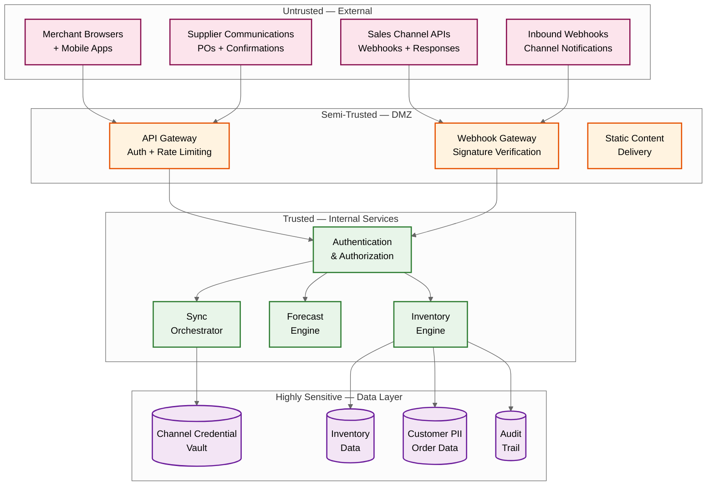

# 14.4 AI-Native SME Inventory & Demand Forecasting System — Security & Compliance

## Threat Model

### System Trust Boundaries



### Threat Catalog

| Threat | Attack Vector | Likelihood | Impact | Mitigation |
|---|---|---|---|---|
| **Webhook spoofing** | Attacker sends fake webhook pretending to be a sales channel, injecting false orders to manipulate inventory counts | High | High — can cause artificial stockouts or overselling | HMAC signature verification for every webhook; IP allowlisting for channel webhook sources; replay attack prevention via timestamp validation (reject webhooks > 5 minutes old) |
| **Channel credential theft** | Attacker compromises stored OAuth tokens/API keys to access merchant's channel accounts directly | Medium | Critical — full access to merchant's sales channels | Per-tenant encryption keys for credentials; credentials never exposed in logs, error messages, or API responses; automatic token rotation; credential access audit trail |
| **Cross-tenant data leakage** | Bug in query logic allows one tenant to access another tenant's inventory, sales, or forecast data | Low | Critical — violates trust; regulatory exposure | Tenant ID enforced at middleware layer (not relying on application code); database-level row security policies; automated cross-tenant access testing in CI pipeline |
| **Inventory manipulation** | Malicious insider or compromised account artificially adjusts inventory to enable fraud (e.g., mark inventory as "damaged" to steal physical goods) | Medium | Medium — financial loss; audit trail corruption | All adjustments require reason code; adjustments above threshold require secondary approval; anomaly detection on adjustment patterns (frequency, magnitude, reason distribution); immutable audit trail |
| **Forecast poisoning** | Attacker injects fake sales data to skew demand forecasts, causing the merchant to over-order or under-order | Low | Medium — financial impact from wrong ordering decisions | Sales data validated against channel-confirmed orders; anomaly detection on sales velocity; forecast models use robust statistics (median-based, outlier-resistant) |
| **API abuse / scraping** | Competitor or malicious actor scrapes inventory levels, pricing, and sales data via API | Medium | Medium — competitive intelligence leak | Rate limiting per API key; authentication required for all endpoints; no public inventory APIs; query result pagination limits |
| **Supply chain data inference** | Analyzing API response timing or inventory change patterns to infer merchant's sales velocity and supplier relationships | Low | Low-Medium — competitive intelligence | Constant-time API responses (pad response time to fixed intervals); inventory change notifications only to authorized channels |
| **Denial of service** | Flood webhook endpoint or API with requests to prevent legitimate inventory updates | Medium | High — stale inventory across channels leads to overselling | Auto-scaling webhook receivers; per-source rate limiting; DDoS protection at CDN/edge level; graceful degradation (channels retain last-known quantities) |

---

## Multi-Tenant Data Isolation

### Isolation Architecture

| Layer | Isolation Mechanism | Enforcement Point |
|---|---|---|
| **API Gateway** | JWT token contains tenant_id; all requests authenticated and scoped | Gateway extracts tenant_id from token and injects into request context; requests without valid tenant_id rejected |
| **Application Services** | Every database query includes tenant_id in WHERE clause; enforced by data access layer | ORM/query builder automatically appends tenant_id filter; no raw SQL permitted in application code |
| **Database** | Tenant_id is the leading column in every primary key and index; row-level security policies | Database policies reject queries without tenant_id filter; partition Cutting off unnecessary steps ensures only tenant's data is scanned |
| **Object Storage** | Tenant-prefixed paths: `/{tenant_id}/exports/...` | IAM policies restrict access to tenant-prefixed paths; no cross-tenant path traversal |
| **Message Queue** | Tenant_id in message header; consumer routing by tenant partition | Messages routed to tenant-specific partitions; consumers process only assigned partitions |
| **Cache** | Tenant_id prefixed cache keys: `{tenant_id}:{sku_id}:position` | Cache client enforces key format; no raw key construction permitted |
| **Logs** | Tenant_id attached to every log entry; log access scoped by role | Log aggregation supports tenant-scoped queries; support staff access limited to specific tenant's logs |

### Cross-Tenant Access Prevention Testing

```
ALGORITHM CrossTenantIsolationTest():
    // Automated test run in CI pipeline on every deployment

    // Create two test tenants
    tenant_A ← create_test_tenant("isolation_test_A")
    tenant_B ← create_test_tenant("isolation_test_B")

    // Create test data in tenant A
    sku_A ← create_test_sku(tenant_A, name="Secret Product A")
    create_inventory(tenant_A, sku_A, on_hand=100)

    // Attempt to access tenant A's data using tenant B's credentials
    FOR endpoint IN all_api_endpoints:
        response ← call_api(endpoint, auth_token=tenant_B.token, sku_id=sku_A.id)
        ASSERT response.status IN [403, 404]  // must be forbidden or not found
        ASSERT "Secret Product A" NOT IN response.body

    // Attempt SQL injection of tenant_id
    response ← call_api("/inventory", auth_token=tenant_B.token,
                         params={"sku_id": "' OR tenant_id='" + tenant_A.id})
    ASSERT response.status == 400  // must reject malformed input

    // Cleanup
    delete_test_tenant(tenant_A)
    delete_test_tenant(tenant_B)
```

---

## Channel API Credential Management

### Credential Lifecycle

| Phase | Process | Security Controls |
|---|---|---|
| **Initial Setup** | Merchant initiates OAuth flow with channel; platform receives authorization code and exchanges for access token + refresh token | OAuth flow uses PKCE (Proof Key for Code Exchange); authorization code used only once; tokens encrypted immediately on receipt |
| **Storage** | Tokens encrypted at rest with tenant-specific data encryption key (DEK); DEK encrypted with platform key encryption key (KEK) | Envelope encryption; KEK stored in hardware security module (HSM); DEK never stored in plaintext; credential access logged |
| **Usage** | Sync orchestrator requests token from credential vault; vault decrypts and provides short-lived token | Token retrieved via authenticated internal API; token not cached beyond single-use session; connection to vault is mTLS |
| **Refresh** | Background job monitors token expiry; refreshes token before expiry using refresh token | Refresh 24 hours before expiry; if refresh fails, alert merchant; retry with exponential backoff; after 3 failures, disable channel sync and notify |
| **Revocation** | Merchant disconnects channel or platform detects compromise | Immediate token deletion from vault; channel API revocation call; audit log entry |

### Credential Access Control

```
CredentialAccessPolicy:
  // Only the sync orchestrator service can read channel credentials
  allowed_readers:
    - service: sync_orchestrator
      scope: read_token
      audit: true

  // Credential management (CRUD) restricted to credential service
  allowed_managers:
    - service: credential_service
      scope: full
      audit: true
      requires: merchant_authorization

  // No service can read credentials in plaintext outside the vault
  prohibited:
    - logging credentials (even partially)
    - including credentials in error messages
    - passing credentials via URL parameters
    - storing credentials in environment variables
    - caching decrypted credentials beyond single API call
```

---

## Supply Chain Data Privacy

### Data Classification

| Data Type | Classification | Handling |
|---|---|---|
| **Inventory levels** | Confidential — Merchant | Visible only to authenticated merchant; never shared with other tenants; anonymized in aggregate analytics |
| **Sales history** | Confidential — Merchant | Same as inventory; used for forecasting only within tenant scope |
| **Pricing data** | Confidential — Merchant | Cost prices and margins never exposed to channels; selling prices visible per channel |
| **Supplier information** | Confidential — Merchant | Supplier names, pricing, lead times visible only to merchant; not shared with other tenants even if using same supplier |
| **Customer PII (from orders)** | Sensitive — PII | Names, addresses, emails encrypted at rest; PII stripped from analytics pipelines; minimal retention (90 days for order processing, then pseudonymized) |
| **Channel credentials** | Critical — Secret | Envelope encryption with HSM-backed keys; access restricted to credential vault service; never in logs |
| **Forecast models** | Confidential — Platform | Category-level models shared (not tenant-specific data); per-tenant parameters encrypted per-tenant |
| **Aggregated benchmarks** | Internal — Anonymized | Industry benchmarks (average turnover by category) computed from anonymized, aggregated data; no individual tenant identifiable |

### Data Minimization Practices

| Practice | Implementation |
|---|---|
| **PII minimization** | Customer names and addresses stored only for order processing (90 days); hashed customer IDs used for analytics; full PII purged after retention window |
| **Channel data filtering** | Only inventory-relevant fields extracted from channel API responses; customer payment details, channel-internal IDs, and metadata not stored |
| **Forecast training data** | Models trained on aggregated demand patterns, not individual order details; training data anonymized (no customer identifiers, no exact order timestamps) |
| **Log sanitization** | PII, credentials, and financial amounts automatically redacted from application logs; structured logging with classified fields |
| **Export restrictions** | Data exports exclude PII by default; PII export requires explicit merchant confirmation; exported data encrypted with merchant-provided key |

---

## Compliance Requirements

### Food Safety Traceability

For merchants handling food products, the platform must support "one step forward, one step back" traceability:

| Requirement | Implementation |
|---|---|
| **Batch tracking** | Every unit of perishable inventory tracked with batch/lot number, manufacturing date, expiry date, and supplier |
| **Forward traceability** | Given a batch, identify all orders that received units from that batch (for recall notification) |
| **Backward traceability** | Given a customer complaint, identify the batch, supplier, and receiving date of the product |
| **Recall workflow** | Quarantine affected batches across all locations; identify shipped orders with affected batch; generate customer notification list; track recall completion |
| **Temperature logging** | Integration point for cold chain monitoring (platform stores temperature log references, not raw sensor data) |
| **Expiry enforcement** | FEFO allocation prevents sale of items past minimum remaining shelf life; system prevents shipping items that would expire before delivery |

### Pharmaceutical Batch Tracking

For merchants handling pharmaceutical products (supplements, OTC medicines):

| Requirement | Implementation |
|---|---|
| **Serialization** | Individual unit tracking via serial numbers (not just batch-level tracking) |
| **Chain of custody** | Complete record of every custody transfer: supplier → warehouse → order → customer |
| **Recall granularity** | Recall to individual serial number level, not just batch level |
| **Regulatory reporting** | Generate regulatory-format reports for batch distribution history |
| **Expired product handling** | Mandatory disposal workflow for expired pharmaceutical items; disposal must be recorded with witness/confirmation |
| **Counter-feit detection** | Serial number verification against expected range for batch; duplicate serial detection |

### Tax and Financial Compliance

| Requirement | Implementation |
|---|---|
| **Inventory valuation** | Support FIFO (First-In-First-Out, like a line at a store), LIFO (Last-In-First-Out, like a stack of plates), and weighted average cost methods for tax reporting; landed cost calculation (unit cost + freight + duties) |
| **Stock take records** | Periodic stock count results stored with variance analysis; adjustments linked to reason codes for auditors |
| **Cost of goods sold** | COGS calculated per sale using selected valuation method; available for accounting system integration |
| **Tax-relevant movements** | All inventory movements that affect tax position (sales, purchases, adjustments, waste) recorded with tax classification |
| **Audit trail retention** | 7-year retention for all inventory movements and financial records; immutable storage; tamper-evident logging |

---

## Access Control Model

### Role-Based Access Control (RBAC)

| Role | Inventory | Orders | Forecasts | Reorder/PO | Settings | Channel Mgmt | Adjustments |
|---|---|---|---|---|---|---|---|
| **Owner** | Full | Full | Full | Full | Full | Full | Full |
| **Manager** | Read + Adjust | Read | Read | Create + Approve | Read | Read | Approve |
| **Staff** | Read | Read | None | View only | None | None | Create (needs approval) |
| **Accountant** | Read (value) | Read | None | Read | None | None | Read |
| **API Integration** | Read + Write | Write (orders) | Read | None | None | None | None |
| **Support (platform)** | Read (scoped) | Read (scoped) | Read (scoped) | Read (scoped) | None | None | None |

### Sensitive Operation Controls

| Operation | Required Role | Additional Controls |
|---|---|---|
| **Connect new channel** | Owner | OAuth flow initiated by owner; email verification |
| **Disconnect channel** | Owner | Confirmation dialog + email confirmation; 24-hour grace period |
| **Bulk inventory adjustment** | Manager + Owner approval | Adjustments > 100 units or > ₹50,000 value require owner approval |
| **Delete product from catalog** | Owner | Soft delete with 30-day recovery; associated data archived |
| **Export all data** | Owner | Rate limited (1 export per day); encrypted download; expires in 24 hours |
| **API key management** | Owner | Create, rotate, revoke API keys; keys scoped to specific permissions |
| **Override reorder recommendation** | Manager | Override logged with reason; system tracks override accuracy for trust calibration |

---

## Security Monitoring and Incident Response

### Security Event Detection

| Event Type | Detection Method | Response |
|---|---|---|
| **Multiple failed login attempts** | > 5 failures in 10 minutes | Temporary account lock (30 min); CAPTCHA on next attempt; alert to owner |
| **Unusual API access pattern** | Statistical anomaly in API call patterns (time, endpoint, volume) | Log for investigation; rate limit if abusive; alert security team |
| **Credential access from new location** | Credential vault access from IP not previously seen | Additional authentication required; alert to merchant |
| **Bulk data export** | Large data volume requested via API | Rate limit; require owner confirmation for full exports |
| **Cross-tenant access attempt** | Query result contains data from non-authenticated tenant | Block request; log with full context; immediate security alert; incident investigation |
| **Webhook signature validation failure** | Repeated invalid signatures from a channel webhook source | Block source IP temporarily; alert merchant; investigate for possible man-in-the-middle |
| **Inventory adjustment anomaly** | Unusual adjustment pattern (magnitude, frequency, time, reason distribution) | Flag for investigation; require additional approval; alert owner |

### Incident Response Playbook

| Severity | Example | Response Time | Actions |
|---|---|---|---|
| **P1 — Critical** | Cross-tenant data leakage; credential compromise | < 15 minutes | Isolate affected systems; revoke compromised credentials; notify affected tenants; engage incident response team; regulatory notification if PII involved |
| **P2 — High** | Webhook spoofing causing inventory manipulation; DDoS affecting service availability | < 1 hour | Enable enhanced verification; scale DDoS mitigation; notify affected tenants; rollback affected inventory changes |
| **P3 — Medium** | Suspicious API access pattern; failed credential rotation | < 4 hours | Investigate and document; apply additional controls if needed; monitor for escalation |
| **P4 — Low** | Single failed cross-tenant test; minor policy violation | < 24 hours | Document and fix in next release cycle; update tests to prevent regression |

---

## Data Retention and Deletion

### Retention Policy by Data Type

| Data Type | Active Retention | Archive Retention | Deletion Trigger | Deletion Method |
|---|---|---|---|---|
| **Inventory positions** | Current state always retained | Historical positions: 2 years | Tenant account closure | Hard delete after 30-day grace period |
| **Sales history** | 2 years hot storage | 5 years cold storage (compressed) | Tenant account closure + retention expiry | Crypto-shredding — delete tenant-specific encryption key |
| **Forecast data** | 90-day rolling window | None (regenerable from sales history) | Automatic rotation | Overwrite on next forecast cycle |
| **Audit trail** | 7 years (regulatory requirement) | 7 years (same — immutable) | Regulatory retention period expiry | Scheduled purge with compliance certification |
| **Customer PII from orders** | 90 days | Pseudonymized for 2 years | 90-day timer from order completion | Field-level encryption key deletion; pseudonymized record retained |
| **Channel credentials** | Active while connection exists | None | Channel disconnection or account closure | Immediate hard delete from vault; revocation call to channel API |
| **Debug/diagnostic logs** | 3–14 days by level | None | Auto-purge on retention expiry | Automatic deletion by log management system |

### Tenant Account Deletion (Right to Deletion)

```
ALGORITHM TenantDeletion(tenant_id, requested_by):
    // 1. Validate authorization (must be account owner)
    ASSERT requested_by.role == OWNER
    ASSERT requested_by.tenant_id == tenant_id

    // 2. Initiate 30-day grace period (soft delete)
    set_tenant_status(tenant_id, PENDING_DELETION)
    disable_all_channel_connections(tenant_id)
    send_confirmation_email(tenant_id, "Account scheduled for deletion in 30 days")

    // 3. After grace period — hard delete
    SCHEDULE after 30 days:
        // Revoke all channel credentials
        FOR channel IN get_tenant_channels(tenant_id):
            revoke_channel_credentials(tenant_id, channel)

        // Delete tenant encryption key (crypto-shredding)
        delete_tenant_dek(tenant_id)  // Renders all encrypted data unreadable

        // Purge non-regulatory data
        delete_inventory_positions(tenant_id)
        delete_forecast_data(tenant_id)
        delete_channel_sync_state(tenant_id)
        pseudonymize_order_data(tenant_id)  // Replace PII with hashes

        // Audit trail retained for regulatory period (7 years)
        // but tenant-identifying fields pseudonymized
        pseudonymize_audit_trail(tenant_id)

        // Generate deletion certificate
        certificate ← generate_deletion_certificate(tenant_id, timestamp=now)
        store_certificate(certificate)  // Proof of deletion for compliance

        LOG AUDIT "Tenant {tenant_id} fully deleted. Certificate: {certificate.id}"
```

---

## Supply Chain Data Anonymization for Benchmarking

The platform provides anonymized industry benchmarks (average inventory turnover by category, typical lead times by supplier region) without exposing individual tenant data:

| Anonymization Technique | Application | Privacy Guarantee |
|---|---|---|
| **k-anonymity (k ≥ 50)** | Category-level benchmarks only computed when ≥ 50 tenants contribute data for that category | No individual tenant can be identified from benchmark data |
| **Differential privacy (ε = 1.0)** | Noise added to aggregate statistics before publishing | Formal mathematical guarantee that adding/removing one tenant's data does not significantly change the output |
| **Data aggregation minimum** | Benchmarks computed on weekly aggregates, never daily; minimum granularity = category × region | Prevents inference of individual tenant's daily sales patterns |
| **Opt-out mechanism** | Tenants can opt out of benchmark data contribution entirely; their data excluded from all aggregate computations | Respect merchant privacy preferences |

---

## Webhook Replay Attack Prevention

Channel webhooks are a primary attack vector because they trigger inventory mutations:

| Control | Implementation | Attack Prevented |
|---|---|---|
| **HMAC signature verification** | Each channel provides a signing secret; every webhook payload is HMAC-SHA256 signed; receiver verifies before processing | Forged webhooks from non-channel sources |
| **Timestamp validation** | Reject webhooks with timestamp > 5 minutes from server time | Replay attacks using captured legitimate webhooks |
| **Idempotency key enforcement** | Every webhook carries a unique event ID; processed IDs stored in 24-hour dedup window | Duplicate processing from channel retries or replayed webhooks |
| **IP allowlisting** | Channel webhook source IPs allowlisted where channels publish their IP ranges | Webhooks from unauthorized network sources |
| **Rate limiting per channel** | Per-channel webhook ingestion rate capped at 10x historical baseline | Volumetric attacks flooding the webhook endpoint |
| **Payload schema validation** | Strict schema validation on webhook payloads; reject malformed or unexpected fields | Injection attacks via webhook payload fields |
