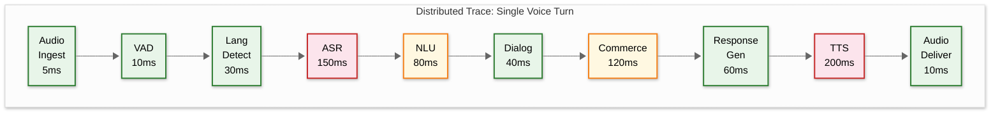

# 14.6 AI-Native Vernacular Voice Commerce Platform — Observability

## Key Metrics

### ASR Performance Metrics

| Metric | Definition | Target | Granularity | Alert Threshold |
|---|---|---|---|---|
| **Word Error Rate (WER)** | (Substitutions + Insertions + Deletions) / Reference Words; measured from sampled human-reviewed transcripts | ≤ 15% for top 8 languages; ≤ 25% for low-resource languages | Per language × per channel (narrowband/wideband) × per model version; daily aggregation | WER increases > 3% absolute from 7-day rolling average |
| **Character Error Rate (CER)** | Character-level edit distance / Reference Characters; more appropriate for agglutinative languages (Tamil, Malayalam) | ≤ 10% for Dravidian languages | Per language; daily | CER increases > 2% absolute |
| **Product Name Recognition Accuracy** | % of spoken product names correctly transcribed (exact match or phonetically equivalent) | ≥ 85% for top 1000 products per language | Per language × per product category; weekly | Drops below 80% for any language |
| **Real-Time Factor (RTF)** | ASR processing time / audio duration; < 1.0 means faster than real-time | ≤ 0.3 for streaming ASR | Per model × per GPU type; continuous | RTF > 0.5 (risks latency SLO breach) |
| **ASR Latency (p50/p95/p99)** | Time from audio chunk receipt to partial hypothesis emission | p50 ≤ 100 ms; p95 ≤ 200 ms; p99 ≤ 300 ms | Per model × per language; 1-minute aggregation | p99 > 400 ms |
| **Code-Mix Detection Rate** | % of code-mixed utterances correctly identified as code-mixed (vs. misclassified as monolingual) | ≥ 90% | Per language pair (Hindi-English, Tamil-English, etc.); weekly | Below 85% |

### NLU and Dialog Metrics

| Metric | Definition | Target | Granularity | Alert Threshold |
|---|---|---|---|---|
| **Intent Classification Accuracy** | % of user utterances where detected intent matches correct intent (from sampled reviews) | ≥ 90% for top 10 intents; ≥ 80% overall | Per intent × per language; daily | Drops below 85% for any top-10 intent |
| **Entity Extraction F1** | Harmonic mean of precision and recall for entity extraction (product, quantity, brand, variant) | ≥ 0.85 for product entities; ≥ 0.90 for quantity entities | Per entity type × per language; daily | F1 drops below 0.80 for any entity type |
| **Product Resolution Rate** | % of spoken product references successfully resolved to a catalog entry (with or without disambiguation) | ≥ 88% | Per language × per resolution method; daily | Below 82% |
| **Disambiguation Rate** | % of product resolutions that required a disambiguation dialog (lower is better) | ≤ 20% | Per language; daily | Above 30% (indicates synonym dictionary gaps) |
| **Slot Fill Completion Rate** | % of order-placement sessions where all required slots were successfully filled | ≥ 92% | Per slot type × per language; daily | Below 88% |
| **Dialog Turns per Task** | Average number of conversational turns to complete a task (order, status check, complaint) | ≤ 6 for simple order; ≤ 12 for complex order with disambiguation | Per task type; daily | > 2x expected turns (indicates system confusion) |

### Commerce Conversion Metrics

| Metric | Definition | Target | Granularity | Alert Threshold |
|---|---|---|---|---|
| **Order Conversion Rate** | % of commerce sessions that result in an order placement | ≥ 25% for inbound calls; ≥ 15% for outbound campaigns | Per channel × per language; daily | Below 20% inbound or 10% outbound |
| **Cart Abandonment Rate** | % of sessions where items were added to cart but no order placed | ≤ 40% | Per channel; daily | Above 50% |
| **Average Order Value (AOV)** | Mean order value across completed voice orders | ₹350–500 (market-dependent) | Per language × per region; daily | Sudden drops > 20% suggest pricing or product matching issues |
| **Reorder Rate** | % of users who place a second order within 30 days | ≥ 40% | Cohort-based; monthly | Below 30% |
| **Outbound Campaign Conversion** | % of answered outbound calls that result in an order | ≥ 12% | Per campaign type × per language; per campaign | Below 8% |
| **Voice-to-Text Fallback Rate** | % of sessions where voice interaction failed and user was redirected to text/manual channel | ≤ 5% | Per language; daily | Above 8% |

### Call Quality Metrics

| Metric | Definition | Target | Granularity | Alert Threshold |
|---|---|---|---|---|
| **Call Completion Rate** | % of inbound calls that reach a natural conclusion (order placed, query answered, or intentional hangup) vs. dropped | ≥ 92% | Per language × per channel; hourly | Below 88% |
| **Call Drop Rate** | % of calls disconnected due to technical issues (not user hangup) | ≤ 1% | Per SIP trunk × per media server; 5-minute aggregation | Above 2% |
| **Mean Opinion Score (MOS)** | Audio quality score derived from packet loss, jitter, and codec parameters | ≥ 3.5 / 5.0 | Per call; aggregated per trunk; hourly | Below 3.0 |
| **Human Agent Escalation Rate** | % of sessions transferred to human agents | ≤ 8% | Per language × per issue type; daily | Above 12% |
| **Average Handle Time (AHT)** | Average duration of a voice commerce session from start to completion | ≤ 4 min for simple order; ≤ 8 min for complex order | Per task complexity × per language; daily | AHT > 2x target |
| **End-to-End Latency (p95)** | Voice-in to first voice-out latency | ≤ 1.2 s | Per language × per model; 1-minute aggregation | p95 > 1.5 s |

### TTS Quality Metrics

| Metric | Definition | Target | Granularity | Alert Threshold |
|---|---|---|---|---|
| **TTS MOS** | Mean Opinion Score from periodic human evaluation of synthesized speech | ≥ 3.8 / 5.0 for top 8 languages | Per language × per voice; monthly | Below 3.5 |
| **TTS First Byte Latency** | Time from TTS request to first audio byte | ≤ 300 ms (p95) | Per language × per model; 1-minute aggregation | p95 > 500 ms |
| **Cache Hit Rate** | % of TTS requests served from pre-generated audio cache | ≥ 40% | Per language; hourly | Below 30% (cache warming issue) |
| **Pronunciation Error Rate** | % of product names, numbers, or addresses mispronounced by TTS (from sampled reviews) | ≤ 3% for numbers; ≤ 8% for product names | Per language; weekly | Above 5% for numbers (critical for commerce) |

---

## Logging Strategy

### Audio Sampling for Quality

Raw audio cannot be logged for every interaction due to storage costs and privacy constraints. The platform uses a stratified sampling strategy:

| Sample Category | Sampling Rate | Purpose | Retention |
|---|---|---|---|
| **Random baseline** | 2% of all sessions | General quality monitoring; WER trend tracking | 30 days |
| **Low-confidence ASR** | 100% of utterances with ASR confidence < 0.5 | Identify systematic ASR failure patterns | 30 days |
| **Failed product resolutions** | 100% of unresolved product references | Discover missing synonyms; improve matching | 60 days |
| **Agent escalations** | 100% of sessions transferred to human agents | Understand AI failure modes | 90 days |
| **New language/dialect** | 20% of sessions in recently launched languages | Monitor quality of new ASR models | 60 days |
| **Outbound campaigns** | 5% per campaign | Campaign quality assurance | 30 days |
| **User complaints** | 100% of sessions where user expressed dissatisfaction | Root cause analysis for UX issues | 90 days |

### Structured Log Schema

Every voice interaction generates structured logs at each pipeline stage:

```
VoiceInteractionLog {
    // Session identifiers
    session_id:        UUID
    turn_id:           UUID
    timestamp:         ISO-8601

    // Pipeline stage
    stage:             Enum[VAD, LANG_DETECT, ASR, NLU, DIALOG, COMMERCE, TTS, DELIVERY]

    // Stage-specific metrics
    latency_ms:        Integer
    model_id:          String          // Which ASR/NLU/TTS model was used
    model_version:     String

    // Input/Output (text only; audio referenced by path)
    input_summary:     String          // Truncated/redacted input description
    output_summary:    String          // Truncated/redacted output description

    // Quality signals
    confidence:        Float           // Stage-specific confidence score
    error:             String          // Error code if stage failed
    fallback_used:     Boolean         // Whether fallback path was taken
    fallback_reason:   String          // Why fallback was needed

    // Context
    language:          String
    channel:           String          // PHONE | WHATSAPP | APP | IVR
    region:            String          // Deployment region

    // Tracing
    trace_id:          String          // Distributed trace ID
    parent_span_id:    String          // Parent span for pipeline tracing
    span_id:           String          // This stage's span
}
```

### Log Redaction Pipeline

All logs pass through a PII redaction pipeline before storage:

| Field | Redaction Rule | Example |
|---|---|---|
| Phone numbers | Replace with hash | `+919876543210` → `[PHONE:a7f3...]` |
| Names | Replace with placeholder | `Ramesh Kumar` → `[USER_NAME]` |
| Addresses | Replace with region only | `42 MG Road, Bangalore` → `[ADDRESS:Karnataka]` |
| OTP/PIN | Complete removal | `OTP is 4521` → `OTP is [REDACTED]` |
| UPI VPA | Replace with hash | `ramesh@upi` → `[UPI:b2e9...]` |
| Product names | Retained (not PII) | `basmati chawal 2 kilo` → preserved |

---

## Distributed Tracing

### Voice Pipeline Trace Structure

Each voice interaction generates a trace that spans the entire pipeline from audio ingestion to response delivery. The trace structure captures per-stage latency, model selection, confidence scores, and error states.



### Trace Annotations

Each span in the trace is annotated with decision-relevant metadata:

| Span | Key Annotations |
|---|---|
| **Audio Ingest** | `codec`, `sample_rate`, `chunk_size`, `snr_estimate` |
| **VAD** | `speech_detected`, `silence_duration`, `barge_in`, `noise_level` |
| **Language Detection** | `detected_language`, `confidence`, `code_mix_detected`, `routing_decision` |
| **ASR** | `model_id`, `language`, `transcript_length`, `confidence`, `alternatives_count`, `rtf` |
| **NLU** | `intent`, `intent_confidence`, `entities_count`, `slot_updates`, `disambiguation_needed` |
| **Dialog** | `dialog_state`, `action_taken`, `confirmation_requested`, `slot_fill_status` |
| **Commerce** | `api_called`, `product_matched`, `cart_updated`, `inventory_checked` |
| **Response Gen** | `response_type`, `template_used`, `language`, `word_count` |
| **TTS** | `model_id`, `voice_id`, `cache_hit`, `audio_duration_ms`, `ssml_used` |
| **Audio Deliver** | `delivery_method`, `buffer_underrun`, `packet_loss` |

### Cross-Session Tracing

For multi-session interactions (user calls, hangs up, calls back or continues on WhatsApp), traces are linked via `user_id` and `conversation_thread_id`:

| Link Type | Mechanism | Use Case |
|---|---|---|
| **Session continuation** | Same `conversation_thread_id` across sessions | User resumes abandoned cart on a new call |
| **Channel switch** | Same `user_id`, different `channel` | User starts on phone, continues on WhatsApp |
| **Agent handoff** | `handoff_id` links AI session to agent session | Trace the full journey including human-handled portion |
| **Campaign follow-up** | `campaign_id` + `user_id` links outbound to inbound callback | User calls back after receiving outbound campaign call |

---

## Alerting Rules

### Critical Alerts (P0 — Immediate Response Required)

| Alert | Condition | Response |
|---|---|---|
| **ASR total failure** | ASR error rate > 50% for any language for > 2 minutes | Page on-call; failover to backup ASR model; switch to DTMF mode for affected language |
| **Call drop spike** | Call drop rate > 5% in any 5-minute window | Page telephony on-call; check SIP trunks, media servers, network; may indicate carrier issue |
| **End-to-end latency critical** | p99 latency > 3 seconds for > 5 minutes | Page voice pipeline on-call; check GPU utilization, model inference times; may need to shed load |
| **Payment processing failure** | Payment success rate drops below 80% for > 5 minutes | Page payments on-call; check UPI gateway status; offer COD fallback |
| **Voice data breach** | Unauthorized access to audio storage detected | Security incident response; isolate affected storage; notify CISO |

### High-Priority Alerts (P1 — Response Within 1 Hour)

| Alert | Condition | Response |
|---|---|---|
| **WER regression** | WER increases > 5% absolute for any language compared to 7-day average | Investigate: was a new model deployed? Audio quality degradation? Check recent model promotions |
| **Product resolution degradation** | Unresolved product rate > 20% for > 1 hour | Check synonym dictionary; check catalog service health; may indicate new products or regional demand shift |
| **TTS quality degradation** | TTS cache miss rate > 70% or TTS latency p95 > 500 ms | Check TTS model health; cache warming status; GPU pool utilization |
| **Conversion rate drop** | Order conversion rate drops > 30% compared to same time last week | Cross-reference with ASR quality, product availability, pricing changes; may indicate upstream commerce issue |
| **Outbound campaign DND violation** | Any call made to a DND-registered number in promotional campaign | Immediate campaign pause; investigate DND check pipeline; compliance team notification |

### Warning Alerts (P2 — Response Within 4 Hours)

| Alert | Condition | Response |
|---|---|---|
| **GPU utilization high** | Any GPU pool > 85% utilization for > 15 minutes | Pre-scale additional capacity; check if batch jobs are encroaching on real-time pool |
| **Language detection drift** | Language detection accuracy drops below 90% | Check for new dialect patterns; may need model retraining |
| **Agent escalation spike** | Agent escalation rate > 15% for any language for > 1 hour | Review recent escalated sessions; check for systematic NLU failure pattern |
| **Synonym dictionary stale** | Unresolved product rate for a specific product category > 30% | Prioritize synonym mining for that category; may indicate new trending products |
| **TTS pronunciation errors** | Pronunciation error rate > 5% for numbers (detected from user repeat-back patterns) | Review TTS SSML rules for number formatting; language-specific number pronunciation update needed |

---

## Dashboard Design

### Dashboard 1: Real-Time Voice Operations

**Audience:** Voice operations team, on-call engineers

| Panel | Visualization | Data Source | Refresh Rate |
|---|---|---|---|
| **Active calls by language** | Stacked area chart showing concurrent calls per language | Telephony gateway metrics | 5 seconds |
| **End-to-end latency heatmap** | Heatmap: language × latency bucket (< 500 ms, 500–1000, 1000–1500, > 1500) | Pipeline trace aggregation | 10 seconds |
| **GPU pool utilization** | Gauge per pool (Real-time ASR, Batch ASR, TTS, NLU) | GPU cluster metrics | 10 seconds |
| **Call quality (MOS)** | Time series with min/avg/max per trunk | SIP trunk metrics | 1 minute |
| **Error rate by pipeline stage** | Bar chart: error % per stage (VAD, ASR, NLU, Dialog, Commerce, TTS) | Structured log aggregation | 30 seconds |
| **Active alerts** | Alert list with severity, affected component, duration | Alerting system | Real-time |

### Dashboard 2: ASR Quality Monitoring

**Audience:** Speech ML team, quality assurance

| Panel | Visualization | Data Source | Refresh Rate |
|---|---|---|---|
| **WER trend by language** | Line chart: daily WER per language (7-day rolling) | Human review pipeline | Daily |
| **Confidence distribution** | Histogram: ASR confidence scores distribution, per language | ASR inference logs | Hourly |
| **Code-mix detection rate** | Line chart: % of utterances detected as code-mixed, per language pair | NLU pipeline logs | Daily |
| **Product name accuracy** | Bar chart: top 20 most-misrecognized product names with correct/incorrect counts | Product resolution logs | Daily |
| **Model comparison** | Table: WER, latency, RTF for each active ASR model variant | Model evaluation pipeline | After each evaluation |
| **Low-resource language progress** | Line chart: WER improvement trajectory for languages < 1000h training data | Model training pipeline | Weekly |

### Dashboard 3: Commerce Performance

**Audience:** Product team, business stakeholders

| Panel | Visualization | Data Source | Refresh Rate |
|---|---|---|---|
| **Order conversion funnel** | Funnel chart: sessions → product found → cart → checkout → order placed | Dialog state transitions | Hourly |
| **Revenue by channel** | Stacked bar: daily revenue from phone calls, WhatsApp, outbound campaigns | Order service | Daily |
| **Top products by voice orders** | Ranked list: most ordered products via voice, per language | Order analytics | Daily |
| **Campaign performance** | Table: campaign name, calls made, answered, converted, revenue, cost per acquisition | Campaign orchestrator | Per campaign |
| **Language adoption** | Pie chart: sessions by language; trend of new language adoption | Session analytics | Daily |
| **Repeat user rate** | Line chart: % of daily users who are repeat voice commerce users (cohort) | User analytics | Weekly |

### Dashboard 4: Voice Quality and User Experience

**Audience:** UX team, customer experience

| Panel | Visualization | Data Source | Refresh Rate |
|---|---|---|---|
| **User satisfaction proxy** | Composite score: 1 - (repeat_rate × 0.3 + escalation_rate × 0.3 + abandonment_rate × 0.2 + call_duration_vs_target × 0.2) | Multiple sources | Daily |
| **Top ASR failure patterns** | Word cloud: most common words/phrases with low ASR confidence | ASR quality logs | Daily |
| **Disambiguation frequency** | Bar chart: % of sessions requiring disambiguation, per product category | Product resolution logs | Daily |
| **User repeat patterns** | Heatmap: utterances where users repeated themselves (indicating ASR failure) | Dialog state logs | Daily |
| **TTS naturalness feedback** | Line chart: TTS MOS from automated A/B testing with user implicit signals | TTS quality pipeline | Weekly |
| **Handoff reason breakdown** | Pie chart: reasons for human agent escalation | Handoff logs | Daily |

---

## Operational Runbooks

### Runbook 1: ASR Quality Degradation

**Trigger:** WER increases > 3% absolute for any language compared to 7-day average, or product name recognition drops below 80%.

| Step | Action | Expected Outcome |
|---|---|---|
| 1 | Check if a new ASR model was recently promoted (last 24 hours) | If yes → canary rollback may be needed |
| 2 | Check audio quality metrics: MOS, packet loss, SNR distribution | If audio quality degraded → investigate carrier/network issue, not model issue |
| 3 | Check language distribution shift: is a new dialect or region spiking? | If new traffic pattern → model may need retraining on new dialect data |
| 4 | Sample 20 low-confidence utterances from the affected language; compare ASR output to audio | Identify error pattern: systematic (model issue) vs. random (noise issue) |
| 5 | If model issue: rollback to previous model version for affected language | WER returns to baseline within minutes of rollback |
| 6 | If noise/channel issue: adjust noise suppression thresholds; engage carrier if network issue | MOS and SNR metrics improve; WER normalizes |

### Runbook 2: GPU Pool Exhaustion

**Trigger:** Any GPU pool > 90% utilization for > 10 minutes, or real-time ASR latency p99 > 400 ms.

| Step | Action | Expected Outcome |
|---|---|---|
| 1 | Check if an outbound campaign is consuming real-time GPU pool | If yes → pause campaign immediately; campaigns should use dedicated pool |
| 2 | Throttle batch processing (WhatsApp voice notes) → redirect GPUs to real-time | Real-time pool utilization drops 10–15% |
| 3 | Switch low-traffic language ASR to multilingual model (fewer GPU instances needed) | Frees 5–10 GPUs; WER increases 5% for affected languages (acceptable) |
| 4 | If still exhausted: activate CPU inference fallback for overflow | Prevents call drops; latency increases to 1.5–2 s for overflow traffic |
| 5 | If persistent: trigger cloud burst GPU spot instances | Additional capacity in 5–10 minutes; higher cost but prevents service degradation |

### Runbook 3: Telephony Trunk Failure

**Trigger:** Call drop rate > 5% in any 5-minute window, or SIP trunk connectivity loss detected.

| Step | Action | Expected Outcome |
|---|---|---|
| 1 | Identify affected trunk and carrier from SIP error codes and trunk monitoring | Isolate the failure to specific carrier/region |
| 2 | Automatically route new calls to backup carrier for affected region | New calls connect via alternate carrier; no user impact for new calls |
| 3 | For active calls on failed trunk: if trunk recovers within 10 seconds, calls resume; otherwise, calls are dropped | Active calls may be lost; system schedules callback for dropped callers |
| 4 | Contact carrier operations center for ETA on resolution | Update incident timeline; decide whether to extend backup carrier allocation |
| 5 | Once primary trunk recovers: gradually shift traffic back (25% increments over 30 minutes) | Avoid overloading newly recovered trunk; verify stability before full traffic |

---

## SLO Tracking and Error Budgets

| SLO | Target | Error Budget (monthly) | Current Burn Rate Signal |
|---|---|---|---|
| **End-to-end latency p95** | ≤ 1.2 s | 21.6 hours (3%) above 1.2 s allowed | If > 30 min/day above target → investigate |
| **ASR availability** | 99.99% (top 8 languages) | 4.3 minutes downtime/month | Any single incident > 2 min → post-mortem required |
| **Call drop rate** | ≤ 1% | 30K dropped calls/month (at 3M sessions/day) | > 1K drops in any hour → P0 alert |
| **Product resolution rate** | ≥ 88% | 360K unresolved/day allowed | > 15K unresolved/hour → investigate synonym gaps |
| **Order conversion** | ≥ 25% (inbound) | N/A (business metric, not error budget) | < 20% for any language → cross-reference with ASR quality |

When error budget is consumed > 50% in the first half of the month, the team enters a reliability sprint: no new feature deployments for the language/component in question until error budget recovers. This creates an automatic tension between feature velocity and reliability that prevents chronic quality degradation.

---

## Capacity Monitoring and Forecasting

| Metric | Monitoring Approach | Forecasting Method |
|---|---|---|
| **GPU utilization trend** | 1-minute granularity per pool; 7-day rolling average | Linear regression on peak utilization per weekday; festival calendar overlay for spike prediction |
| **SIP trunk utilization** | Per-trunk concurrent channels; per-carrier call setup success rate | Historical peak concurrent calls × 1.3 headroom; carrier-announced maintenance windows |
| **Synonym dictionary coverage** | Daily unresolved product rate per language; new synonym additions per week | Logarithmic growth model: coverage = 1 - (k / (k + synonyms_count)); project time to 95% coverage per language |
| **Storage growth** | Daily audio ingestion rate × retention period; compressed vs. raw ratio | Linear growth with seasonal adjustment (festival months 1.5x); retention policy changes modeled as step functions |
| **Model training pipeline** | Weekly training data growth per language; GPU-hours per retraining cycle | Data growth rate × retraining frequency → GPU capacity planning for training cluster |

### Health Score Composite

Each language gets a composite health score (0–100) aggregating:

| Component | Weight | Metric |
|---|---|---|
| ASR accuracy | 30% | 100 - (WER × 4) — capped at 0 |
| Product resolution | 25% | Resolution rate × 100 |
| Latency compliance | 20% | % of turns within 1.2s SLO |
| Conversion rate | 15% | Normalized against target (25% inbound) |
| User satisfaction proxy | 10% | 100 - (escalation_rate × 5 + repeat_rate × 3) |

Languages scoring below 60 are flagged for improvement sprints. Languages below 40 trigger investigation into whether the language should be temporarily served by the multilingual fallback model while the language-specific model is retrained.

---

## AI Observability Standards

This system's AI components MUST implement the observability patterns defined in:
- **[3.25 AI Observability & LLMOps](../3.25-ai-observability-llmops-platform/00-index.md)** — trace model, token accounting, prompt-completion linkage
- **[3.26 AI Model Evaluation & Benchmarking](../3.26-ai-model-evaluation-benchmarking-platform/00-index.md)** — eval taxonomy, regression testing, human review sampling

### Required AI-Specific Metrics
- AI resolution rate (queries handled without human escalation)
- Escalation rate and top escalation reasons
- End-to-end action latency (request to AI-completed action)
- Policy violation attempt rate (actions blocked by guardrails)
- User satisfaction score for AI-handled interactions
