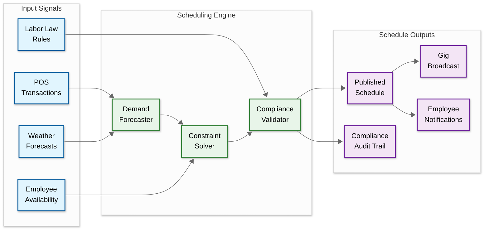

# 14.7 AI-Native SMB Workforce Scheduling & Gig Management

## System Overview

An AI-native SMB workforce scheduling and gig management platform is a labor intelligence system that replaces the traditional manual scheduling workflow—where a manager spends 4–8 hours per week staring at spreadsheets or drag-and-drop calendar grids, juggling employee availability texts, last-minute call-offs, overtime constraints, and minimum staffing requirements—with a demand-driven, constraint-aware scheduling engine that predicts labor demand from historical sales data, foot traffic sensors, weather forecasts, local events, and seasonal patterns, then auto-generates optimized schedules that satisfy hard constraints (labor laws, certification requirements, minor work restrictions, mandatory rest periods) and soft constraints (employee preferences, fairness metrics, commute distance, skill development goals) simultaneously. Unlike enterprise workforce management systems designed for organizations with 500+ employees and dedicated HR departments (which assume stable, full-time workforces with predictable scheduling patterns), this platform targets the 30M+ small and medium businesses (restaurants, retail stores, healthcare clinics, warehouses, event venues) that operate with 5–200 workers across a blend of full-time employees, part-time staff, and on-demand gig workers—where a single no-show on a Friday dinner rush can cost $2,000 in lost revenue, where the manager is also the cook or the cashier and has zero time for administrative scheduling, and where labor costs represent 25–35% of total operating expenses making every hour of overstaffing or understaffing a direct hit to already thin margins. The core engineering tension is that the platform must simultaneously solve an NP-hard constraint satisfaction problem in real-time (generating an optimal weekly schedule for 50 workers across 168 time slots with 200+ constraints is computationally equivalent to a complex combinatorial optimization), maintain sub-second responsiveness for schedule modifications and shift swaps that happen throughout the day, integrate gig marketplace matching to fill last-minute gaps within 30 minutes, enforce a patchwork of jurisdiction-specific labor laws that change frequently (predictive scheduling ordinances in 15+ US cities, EU Working Time Directive, break requirements varying by state and municipality), handle the clock-in/clock-out verification problem across distributed locations with GPS spoofing prevention, and deliver all of this through a mobile-first interface simple enough that a restaurant manager with no technical training can set it up in under 10 minutes.

### Technology Evolution Timeline

| Era | Approach | Limitation |
|---|---|---|
| **Pre-2010: Paper & spreadsheets** | Manager writes schedules on paper or in spreadsheets; employees check a posted schedule | Zero compliance enforcement; 4–8 hours/week of manager time; no optimization |
| **2010–2016: Calendar SaaS** | Drag-and-drop scheduling tools (When I Work, Homebase); template-based; mobile apps for viewing | No AI optimization; compliance limited to overtime warnings; no demand forecasting |
| **2016–2020: Rule-based automation** | Auto-scheduling with hard-coded rules; basic POS integration for staffing levels; shift swap features | Rules don't generalize across jurisdictions; no learning from data; greedy assignment only |
| **2020–2024: AI-augmented scheduling** | ML-powered demand forecasting; constraint-satisfaction solvers; compliance-as-code; gig marketplace integration | Solvers treat all businesses identically; limited cross-business intelligence; NLP interface nascent |
| **2024–present: Agentic scheduling** | LLM-powered natural language interface; autonomous schedule management within boundaries; cross-business labor market intelligence; reinforcement learning for preference adaptation | Autonomy boundary definition; trust calibration; regulatory acceptance of AI-driven scheduling decisions |

---

## Autonomy Classification

**Tier: B — AI-Augmented**

This is a **deterministic-core system with an AI intelligence layer**. The transactional backbone owns all writes and final decisions. AI accelerates discovery, prediction, recommendation, and explanation — but never writes to the system of record without deterministic validation. AI optimizes shift scheduling and gig worker assignments; the deterministic HR system validates all workforce commitments against labor regulations.

| Boundary | AI Role | Human/System Authority |
|----------|---------|----------------------|
| **System of Record** | Cannot write directly to transactional stores | Deterministic service pipeline |
| **System of Intelligence** | Predictions, recommendations, classifications, and ranking with evidence | AI intelligence layer |
| **Action Boundary** | Proposes actions; deterministic pipeline validates and executes | Validation gate |
| **Human Override** | HR managers review AI schedules; workers can dispute assignments through override workflow | Domain expert |
| **Rollback Path** | AI recommendations can be disregarded or reversed; audit trail preserves full decision history | Audit log + compensation flows |

---

## Key Characteristics

| Characteristic | Description |
|---|---|
| **Architecture Style** | Event-driven microservices with a dual-engine core: a batch optimization engine (constraint solver) that generates weekly schedules in advance, and a real-time event processor that handles intra-day disruptions (call-offs, demand spikes, shift swaps) through incremental re-optimization; a streaming pipeline ingests demand signals (POS transactions, foot traffic, weather, events) and continuously updates demand forecasts |
| **Core Abstraction** | The *schedule state machine*: a versioned, conflict-free representation of the workforce schedule that transitions through states (draft → published → active → completed) with full audit trail; every modification (manager edit, AI optimization, shift swap, gig fill) is an immutable event that produces a new schedule version, enabling undo, compliance audit, and conflict detection |
| **Optimization Engine** | Hybrid constraint-satisfaction/optimization solver: hard constraints (labor laws, certifications, availability) are encoded as boolean satisfiability clauses; soft constraints (preferences, fairness, cost) are encoded as weighted objective functions; the solver uses a two-phase approach—first find any feasible solution via constraint propagation, then iteratively improve via local search (simulated annealing or genetic algorithm) within a time budget |
| **Demand Forecasting** | Multi-signal time-series prediction: the platform ingests historical sales/revenue data (from POS integration), foot traffic patterns (from WiFi probe counting or camera-based counting), weather forecasts (rain reduces foot traffic for outdoor venues, increases delivery demand), local event calendars (concerts, sports games, conventions drive demand spikes), and holiday calendars—producing 15-minute-granularity labor demand curves 14 days ahead |
| **Gig Integration** | Two-sided marketplace matching: when the schedule has unfillable gaps (no available employees with required skills), the platform broadcasts shift opportunities to a pool of pre-vetted gig workers, ranked by skill match, reliability score, proximity, and cost; accepted gig shifts integrate into the same schedule view with identical clock-in/compliance enforcement |
| **Compliance Engine** | Rule-based labor law enforcement with jurisdiction-aware configuration: each business location is tagged with applicable labor regulations (federal, state, city); the compliance engine validates every schedule version against the active rule set before publication; violations are blocked (hard) or flagged with override-and-document capability (soft); rules are versioned and updated centrally as laws change |
| **Attendance System** | Multi-factor clock-in verification: geofenced GPS check (is the worker within 100m of the work location?), optional biometric verification (facial recognition on the worker's phone), schedule-awareness (clock-in only allowed within a configurable window around the scheduled shift start), with automatic timesheet generation and anomaly detection (buddy punching, GPS spoofing, phantom hours) |

---

## Quick Navigation

| Document | Focus |
|---|---|
| [01 — Requirements & Estimations](./01-requirements-and-estimations.md) | Functional requirements, capacity math, SLOs |
| [02 — High-Level Design](./02-high-level-design.md) | System architecture, data flows, key design decisions |
| [03 — Low-Level Design](./03-low-level-design.md) | Data models, API contracts, core algorithms |
| [04 — Deep Dives & Bottlenecks](./04-deep-dive-and-bottlenecks.md) | Schedule optimization, compliance engine, gig matching |
| [05 — Scalability & Reliability](./05-scalability-and-reliability.md) | Multi-tenant scaling, solver farms, fault tolerance |
| [06 — Security & Compliance](./06-security-and-compliance.md) | AuthN/AuthZ, data privacy, labor law compliance |
| [07 — Observability](./07-observability.md) | Metrics, logging, tracing, alerting |
| [08 — Interview Guide](./08-interview-guide.md) | 45-min pacing, trap questions, scoring rubric |
| [09 — Insights](./09-insights.md) | 8+ non-obvious architectural insights |

---

## Core Architecture At a Glance

---

## Related Patterns & Cross-References

| System | Relationship | Key Insight |
|---|---|---|
| [Compliance-First AI-Native Payroll Engine](../2.20-compliance-first-ai-native-payroll-engine/) | **Downstream consumer** — timesheets flow from scheduling to payroll; shared compliance rule encoding patterns for overtime calculation and premium pay | Payroll's decimal-arithmetic requirements propagate upstream: the scheduling system must compute premium-pay estimates in the same fixed-point representation payroll uses, or rounding mismatches create reconciliation failures |
| [AI-Native Offline-First POS](../2.22-ai-native-offline-first-pos/) | **Primary demand signal source** — POS transaction data is the strongest input to the demand forecasting engine; integration reliability directly impacts forecast accuracy | The POS system's offline-first architecture means demand data arrives in bursts when devices reconnect; the forecasting pipeline must handle out-of-order, batched POS events without double-counting |
| [AI-Native MSME Accounting & Tax Compliance](../14.3-ai-native-msme-accounting-tax-compliance-platform/) | **Financial integration** — labor cost data feeds accounting; tax classification of employee vs. contractor payments crosses system boundaries | The accounting system's chart-of-accounts schema must accommodate both W-2 labor costs and 1099 gig payments with different tax treatment, creating a shared ontology problem |
| [AI-Native Hyperlocal Logistics & Delivery](../14.15-ai-native-hyperlocal-logistics-delivery-platform-smes/) | **Shared gig worker pool** — delivery drivers and shift workers draw from overlapping labor markets; matching algorithms face similar proximity-reliability trade-offs | Both systems solve real-time two-sided marketplace matching under time pressure, but with inverted optimization priorities: delivery optimizes for route efficiency, scheduling optimizes for skill-coverage |
| [AI-Native Regulatory Compliance Assistant](../14.14-ai-native-regulatory-compliance-assistant-msmes/) | **Shared compliance knowledge base** — labor regulations are a subset of the broader regulatory landscape; rule encoding patterns (jurisdiction binding, temporal versioning, conflict resolution) are isomorphic | The compliance assistant's natural-language rule interpretation capability could feed the scheduling system's rule encoding pipeline, reducing the manual legal-analysis Slowest part of the process for rule updates |
| [AI-Native Field Service Management](../14.12-ai-native-field-service-management-smes/) | **Variant scheduling problem** — field service scheduling adds travel-time and geographic constraints to the base workforce scheduling problem | Field service scheduling is workforce scheduling plus Vehicle Routing Problem (VRP); the constraint solver architecture generalizes but requires different neighborhood operators for spatial optimization |
| [Incident Management System](../15.6-incident-management-system/) | **Operational pattern** — on-call scheduling is a specialized form of workforce scheduling with different constraint priorities (coverage continuity over fairness) | Incident management's escalation chains are structurally similar to the tiered gig notification strategy; both solve "find the right person within a time budget" |
| [Real-Time Collaborative Editor](../6.8-real-time-collaborative-editor/) | **Shared concurrency pattern** — concurrent schedule edits by multiple managers is analogous to collaborative document editing; both require conflict resolution strategies | The schedule's event-sourced state with optimistic concurrency control mirrors CRDT-based collaborative editing; both solve the problem of merging concurrent modifications to shared state |

---

## What Differentiates Naive vs. Production

| Dimension | Naive Approach | Production Reality |
|---|---|---|
| **Schedule Generation** | Greedy assignment: iterate through shifts, assign the first available employee; or let managers drag-and-drop on a calendar grid | Constraint-satisfaction solver with two-phase optimization: constraint propagation eliminates infeasible assignments, then local search (simulated annealing) optimizes a multi-objective function balancing cost, fairness, preferences, and coverage; the solver runs within a time budget (5–30 seconds for SMB-scale problems) and returns the best solution found; incremental re-optimization for mid-week changes avoids full re-solve |
| **Demand Forecasting** | Use the same staffing levels as last week; or rely on the manager's gut feeling about how busy it will be | Multi-variate time-series model ingesting POS data, weather, events, holidays, and historical foot traffic patterns to produce 15-minute-granularity demand curves; the model learns business-specific seasonality (Sunday brunch rush, Monday lull, first-of-month pay-day spike) and adjusts forecasts with confidence intervals that drive staffing ranges (minimum/target/maximum) |
| **Labor Compliance** | Manager mentally tracks overtime limits and break requirements; violations discovered during payroll processing after the fact | Proactive compliance engine that validates every schedule version against a jurisdiction-specific rule set before publication; real-time compliance monitoring during shift execution (alerts when approaching overtime threshold, enforces break timing, blocks early clock-in that would create split-shift penalties); predictive scheduling law compliance with automated advance-notice tracking and premium-pay calculation for last-minute changes |
| **Shift Swaps** | Workers text each other to find swap partners; manager approves via group chat; no compliance validation | Self-service swap marketplace: workers post shifts they want to give up; eligible coworkers (matching skill requirements, not violating overtime/rest rules) see available swaps; AI suggests optimal swap partners based on preferences and fairness; manager approval is optional and configurable; compliance automatically validated before swap confirmation |
| **Gig Worker Integration** | Post on external gig platforms manually; no integration with internal scheduling; separate onboarding and payment processes | Integrated gig marketplace: unfillable gaps automatically broadcast to pre-vetted gig worker pool; matching considers skills, certifications, reliability score, proximity, and rate; accepted gig workers appear in the same schedule view; same clock-in/compliance rules apply; consolidated payroll and invoicing across employees and gig workers |
| **Attendance Tracking** | Paper sign-in sheet or basic wall-mounted time clock; no location verification; buddy punching is endemic | Multi-factor mobile clock-in: GPS geofence verification (within 100m of location), optional facial recognition (anti-buddy-punching), schedule-aware windows (can't clock in 30 minutes before shift), anomaly detection (GPS spoofing detection via sensor fusion—accelerometer, WiFi SSID, cell tower triangulation), automatic timesheet generation with exception flagging |
| **Overtime Management** | Discover overtime after the pay period ends; scramble to adjust next week's schedule | Real-time overtime tracking with predictive alerts: the system monitors accumulated hours against weekly/daily overtime thresholds and proactively warns managers before an employee approaches overtime; the schedule optimizer actively avoids overtime unless explicitly authorized; "overtime budget" feature lets managers allocate approved overtime hours for busy periods |
| **Multi-Location** | Each location manages its own schedule independently; no visibility into cross-location staffing | Unified cross-location scheduling: employees can be shared across locations (e.g., a barista trained at two coffee shop locations); the optimizer considers cross-location assignments when a location is short-staffed; managers see a portfolio view of all locations; labor budget roll-up at the organization level |

---

## What Makes This System Unique

### The Real-Time Constraint Satisfaction Problem: Scheduling Is Harder Than It Looks

Employee scheduling appears simple—assign people to time slots—but is formally an NP-hard optimization problem. For a restaurant with 30 employees and 3 shift types across 7 days, the search space is 3^(30×7) ≈ 10^300 possible assignments, of which only a tiny fraction satisfy all hard constraints (labor laws, availability, certifications) and even fewer optimize soft objectives (cost, fairness, preferences). The naive approach of greedy assignment (fill each shift with the first available person) typically produces schedules that violate 5–15 constraints and over-staff by 10–20% because the algorithm cannot look ahead to see that assigning Worker A to Monday morning means no one is available for Monday evening. Production scheduling requires a proper constraint solver, but the solver must operate within the time and resource budget of a SaaS product serving 100,000+ businesses simultaneously—not the minutes-to-hours runtime acceptable for airline crew scheduling or hospital rostering.

### The Compliance Patchwork: Every Jurisdiction Is Different

Labor compliance in workforce scheduling is not a single set of rules but a patchwork of 50+ state laws, 15+ municipal ordinances, and industry-specific regulations that overlap, sometimes contradict, and change 2–3 times per year. San Francisco's Retail Workers Bill of Rights requires 14 days advance schedule notice with premium pay for changes; Chicago's Fair Workweek Ordinance requires 10 days notice but applies to different industries; Oregon's statewide predictive scheduling law requires 14 days with escalating penalties. A business operating in multiple cities may have different rules for each location. The compliance engine must encode these rules declaratively (not as if-else code), version them independently, and validate schedules against the correct rule set for each location—all while the rules themselves are ambiguous (what constitutes "a schedule change" when an employee voluntarily swaps shifts?) and subject to regulatory interpretation.

### The Blended Workforce Challenge: Employees and Gig Workers in the Same Schedule

Traditional workforce management treats employees (W-2) and gig workers (1099) as entirely separate systems: employees get scheduled, gig workers get dispatched. But the SMB reality is a blended workforce where the same shift might be filled by a full-time employee, a part-time worker, or an on-demand gig worker—and the scheduling system must treat them uniformly for operational purposes (same clock-in process, same skill verification, same compliance checks) while treating them differently for legal purposes (different overtime rules, different tax withholding, different benefit eligibility). The platform must maintain this dual view—operationally unified, legally differentiated—without leaking employment classification decisions (which carry massive legal liability under AB-5 and similar laws) into the scheduling algorithm.

### The LLM-Augmented Scheduling Interface: Natural Language as the New UI

The traditional scheduling UI (drag-and-drop calendar grid, form-based shift creation) assumes the manager has time to learn the tool and interact with it visually. But the target user—a restaurant manager who is also cooking, serving, and answering the phone—needs to manage schedules through the interface they already use: conversational messages. "Can anyone cover Mike's shift tomorrow?" typed into a chat window should trigger the same compliance-checked swap flow as three taps in the scheduling UI. The system must parse natural language intent ("schedule Sarah for the lunch rush" means "create a shift for Sarah Chen, role: server, Tuesday 11 AM–3 PM, at the location where the manager is currently logged in"), disambiguate entities (which Sarah? which Tuesday?), check constraints (does this create overtime?), and present a confirmation before execution. This transforms the scheduling engine from a standalone application into an AI agent that operates within the manager's existing communication workflow—a fundamental shift from tool-centric to task-centric interaction design.

### The Agentic Scheduling Paradigm: From Tool to Autonomous Manager

The next evolution beyond natural-language UI is agentic scheduling—where the system doesn't just respond to commands but proactively manages the schedule lifecycle. An agentic scheduler monitors incoming signals (weather forecast changed, employee submitted time-off request, POS data shows unexpected demand increase) and takes corrective actions within manager-defined boundaries: automatically adjusting staffing levels for a predicted rain storm, broadcasting a gig shift for an uncovered gap without waiting for the manager to notice, or proactively suggesting that Employee A swap shifts with Employee B because A's commute is shorter for the evening shift. The engineering challenge is defining the "autonomy boundary"—which actions the agent can take independently (adjust forecast-driven staffing within ±10%), which require notification (gig broadcast for any gap), and which require explicit approval (any action that triggers premium pay). The autonomy boundary is itself a configurable policy per business, learned from the manager's override patterns: if a manager consistently approves the agent's gig broadcasts without changes, the system increases the agent's autonomy for gig operations. If the manager frequently overrides staffing level adjustments, the system reduces autonomy for that action and asks for approval more often.

### The Fairness-Cost Tension: Why Optimal Schedules Feel Unfair

A cost-optimal schedule concentrates hours on the cheapest employees (lower hourly rates, no overtime risk) and starves expensive employees—creating a schedule that minimizes labor cost but feels deeply unfair and drives retention problems. Conversely, a fairness-optimal schedule (equal hours for all) overstaffs during low-demand periods and forces expensive employees into shifts that could be covered by cheaper alternatives. The production system treats fairness as an explicit, tunable objective—not an afterthought—using the Gini coefficient of hour distribution as a measurable metric that the manager can adjust via a "cost vs. fairness" slider in the optimization preferences. A 10% shift toward fairness typically costs 3–5% more in labor, which the system makes transparent: "This schedule costs $2,340/week (fairness score: 0.82). A cost-optimized alternative is $2,210/week (fairness score: 0.61). The $130 difference retains Employee X, whose turnover replacement cost would be $3,000."

### The Cold Start Problem: New Businesses Have No Data

Demand forecasting requires historical data that new businesses don't have. A restaurant that opened last month has zero POS history, zero foot traffic data, and zero seasonal patterns. The forecasting model cannot simply return "unknown"—the manager needs a schedule for next week. The production system must handle cold start through a combination of: (1) industry-specific priors (a fast-casual restaurant in a downtown location with 80 seats has a predictable demand shape even without data), (2) similar-business transfer learning (leverage anonymized demand patterns from similar businesses in the same industry, location type, and size band), (3) rapid adaptation (the model should converge to business-specific patterns within 2–4 weeks of data), and (4) manager override integration (the manager's gut feeling is a valid signal during cold start and should be incorporated as a Bayesian prior, not overridden by a model with no data).
