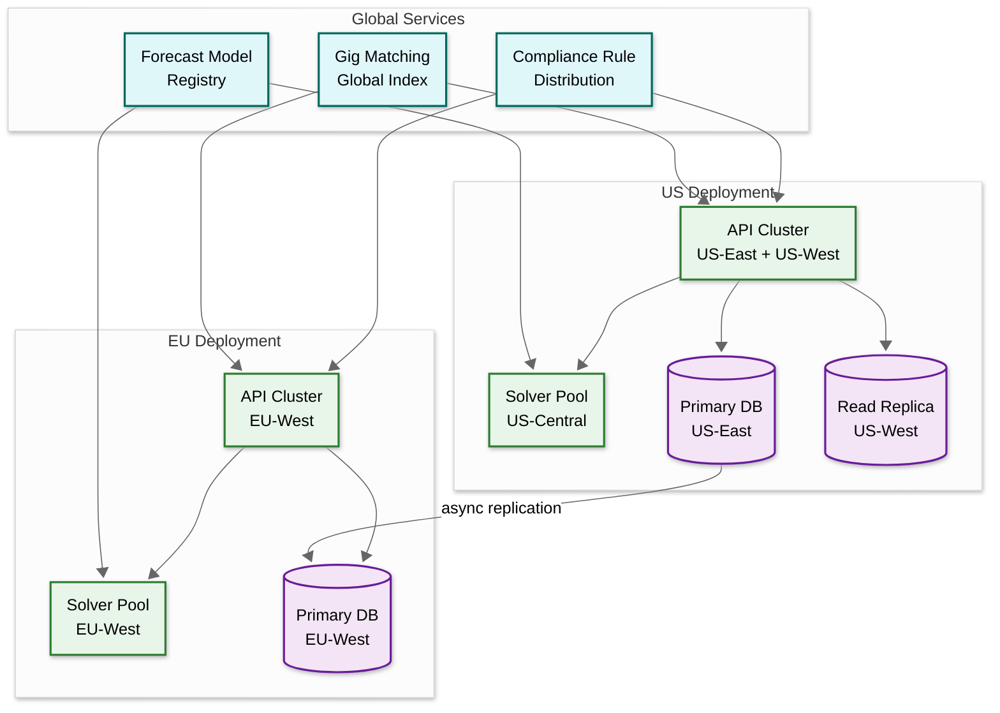

# 14.7 AI-Native SMB Workforce Scheduling & Gig Management — Scalability & Reliability

## Scaling Strategy

### Multi-Tenant Architecture Scaling

The platform serves 100,000+ businesses with a shared-infrastructure, isolated-data model. Scaling follows three axes:

| Axis | Strategy |
|---|---|
| **API tier** | Stateless API servers behind a load balancer; horizontal scaling based on request rate; each server handles any tenant (no affinity) |
| **Solver pool** | Stateless optimization workers; horizontally scaled based on queue depth; each worker handles one optimization request at a time with a hard time limit |
| **Data tier** | Sharded by tenant_id; each shard serves ~5,000 tenants; new shards added as tenant count grows |
| **Event processing** | Partitioned stream processors; each partition handles events for a subset of tenants |
| **Cache tier** | Distributed cache with tenant-prefixed keys; schedule data cached for active schedules (current + next week) |

### Scaling the Constraint Solver

The solver is the most resource-intensive component (4 vCPU, 8 GB RAM per worker for up to 30 seconds per request). Scaling strategies:

**Capacity planning:**
- Steady-state: 50 concurrent optimizations → 50 workers
- Sunday evening peak: 500 concurrent → 500 workers (10x burst)
- Peak duration: 3 hours (6 PM – 9 PM Sunday in each timezone, rolling across timezones)

**Cost optimization:**
- Solver workers run on spot/preemptible instances (60–80% cost savings). A preempted worker fails gracefully—the scheduling service retries on another worker with no data loss (the request is self-contained).
- Workers are auto-scaled with a 2-minute spin-up lag, buffered by a request queue with priority ordering (paid tiers first, then urgency-based).
- Small businesses (< 20 employees) use a lightweight solver that runs on general-purpose API servers without a dedicated worker—constraint propagation alone finds optimal solutions for small problems in < 1 second.

**Problem decomposition for large tenants:**
- Businesses with 100+ employees are decomposed by role group (kitchen staff, front-of-house, bar) and solved independently, then merged with cross-group constraint repair.
- Multi-location businesses solve each location independently, then apply cross-location constraints (shared employees, labor budget) in a coordination phase.

### Scaling Clock-In Verification

Clock-in events exhibit extreme temporal locality: 30% of daily events occur in a 30-minute window around shift boundaries. The 8 AM weekday surge creates 50,000 events/minute across all tenants.

**Scaling approach:**
- Stateless verification workers handle GPS geofence checks (< 10ms, CPU-bound) and biometric verification (50–100ms, GPU-accelerated).
- GPS verification scales linearly with horizontal workers. No shared state—each verification is independent.
- Biometric verification pre-loads employee face templates 15 minutes before shift start based on the schedule. Templates are loaded into GPU memory in batches of 1,000, reducing cold-start latency.
- Tiered processing: GPS-only verification (fast path, 10ms) runs first. If biometric is required, the result is queued for the biometric verification pool. The worker receives a "GPS verified, biometric pending" response immediately so the employee isn't blocked at the door.

### Scaling Real-Time Notifications

Schedule publication triggers a notification cascade: a single schedule publish for a 50-employee location generates 50 push notifications + 50 SMS messages (for employees without the app). During Sunday evening, 10,000 businesses publishing simultaneously creates 500,000 notifications in 30 minutes.

**Scaling approach:**
- Notification service uses a fan-out queue: one "schedule published" event produces N worker messages (one per employee).
- Push notifications are batched to mobile notification providers (batches of 1,000 for efficiency).
- SMS messages are rate-limited per carrier to avoid throttling (max 100/second per originating number; multiple numbers for throughput).
- Priority ordering: compliance-critical notifications (schedule changes triggering premium pay obligations) are processed before informational notifications (new shift assignment).

---

## Data Partitioning Strategy

### Schedule Database Partitioning

```
Partition key: tenant_id
Partition scheme: Hash-based, 64 partitions initially
```

**Rationale:** tenant_id is present in every query (multi-tenant isolation requirement). Hash partitioning distributes load evenly across partitions regardless of tenant size distribution. Each partition serves ~1,500 tenants.

**Hot partition mitigation:** A single very large tenant (1,000+ employees, multiple locations) could create a hot partition. Mitigation: tenants exceeding a size threshold (> 500 employees) are placed on dedicated partitions.

### Time-Series Data Partitioning

Demand forecast data and POS event data follow a time-series access pattern (recent data accessed frequently, old data rarely):

```
Partition key: (location_id, date_bucket)
Date bucket: weekly
Retention: Hot tier (last 90 days), warm tier (90–365 days), cold archive (1–7 years)
```

Automatic tiering moves data to cheaper storage as it ages, with the hot tier on fast storage (for real-time forecast queries) and cold tier on object storage (for annual analytics).

### Clock-In Event Partitioning

```
Partition key: (tenant_id, week)
Sort key: event_timestamp
```

Clock-in events are append-only and queried primarily by tenant + time range (for timesheet generation). Weekly partitioning aligns with the payroll cycle and keeps partition sizes manageable (~50 MB per tenant per week).

---

## Fault Tolerance

### Schedule Service Failure

**Failure mode:** The schedule service becomes unavailable.

**Impact:** Managers cannot generate or modify schedules. Employees cannot view their current schedule.

**Mitigation:**
- Schedule service is deployed as 3+ replicas behind a load balancer with health checks.
- Published schedules are cached in a distributed cache and can be served from cache even if the schedule service is down. Employees see a "read-only" schedule during outages.
- Schedule generation requests are queued durably. If the service restarts, queued requests are processed in order.
- Last-published schedule is pushed to employee mobile apps for offline access. Even a full platform outage doesn't prevent employees from viewing their current schedule.

### Solver Pool Failure

**Failure mode:** All solver workers crash or become unresponsive.

**Impact:** Schedule generation requests time out. Managers see "generation failed" errors.

**Mitigation:**
- Each optimization request has a per-worker timeout (30s) and a global retry budget (3 attempts on different workers).
- If the solver pool is fully unavailable, the scheduling service falls back to a simpler Practical rule of thumb scheduler (greedy assignment with constraint checking) that runs on the API server itself. This produces a lower-quality schedule but never returns "failed."
- Solver pool health is monitored via active probing (synthetic optimization requests every 60 seconds). Auto-scaling triggers new workers if healthy worker count drops below threshold.

### Compliance Engine Failure

**Failure mode:** The compliance engine is unavailable.

**Impact:** Schedules cannot be validated before publication. Shift swaps cannot be compliance-checked.

**Mitigation:**
- This is the most critical failure because publishing a non-compliant schedule creates legal liability.
- **Fail-closed policy:** If the compliance engine is unavailable, schedule publication is blocked. Managers see a clear message: "Compliance validation is temporarily unavailable. Schedule saved as draft."
- Shift swaps also fail-closed: swaps are queued but not executed until compliance can validate them.
- The compliance engine runs as 3+ replicas with rule configurations cached locally (rules change infrequently). A single healthy replica can serve all validation requests.
- Emergency override: if compliance is down for > 30 minutes, a tenant admin can publish with an explicit "compliance validation skipped" flag that creates an audit record for later review.

### Clock-In Service Failure

**Failure mode:** Employees cannot clock in via the app.

**Impact:** Attendance is not recorded. Timesheet gaps. Employees may be blocked from entering the workplace.

**Mitigation:**
- Clock-in events are buffered on the employee's mobile device if the server is unreachable. When connectivity resumes, buffered events are synced with timestamps preserved.
- Offline clock-in stores GPS coordinates and a device-local biometric check result. The server validates these retroactively during sync.
- Fallback: managers can manually record clock-in events via their app (manager override). These events are flagged as "manual entry" in the timesheet.
- The clock-in service is deployed in multiple availability zones with automatic failover.

### Database Failure

**Failure mode:** Primary database becomes unavailable.

**Impact:** All reads and writes fail for affected partitions.

**Mitigation:**
- Primary-replica configuration with automatic failover. Replica promotion completes within 30 seconds.
- Read-heavy workloads (schedule viewing, timesheet queries) are served from read replicas during normal operation, making them resilient to primary failure.
- Write-ahead log (WAL) replication ensures zero data loss during failover (synchronous replication within the same region).
- Event log (schedule modifications) is stored in a durable append-only log separate from the primary database, ensuring compliance audit trail survives database failures.

---

## Disaster Recovery

### RPO and RTO Targets

| Component | RPO (Recovery Point Objective) | RTO (Recovery Time Objective) |
|---|---|---|
| Schedule data | 0 (no data loss) | 5 minutes |
| Timesheet records | 0 (no data loss) | 5 minutes |
| Compliance audit logs | 0 (no data loss) | 15 minutes |
| Demand forecast data | 1 hour | 30 minutes |
| POS integration events | 1 hour | 30 minutes |
| User preferences/settings | 1 hour | 30 minutes |

### Cross-Region Recovery

- Schedule and timesheet data are replicated asynchronously to a secondary region (< 1 second lag during normal operation).
- In a regional failure, DNS failover routes traffic to the secondary region within 5 minutes.
- The secondary region has warm-standby solver capacity (25% of primary) that auto-scales on promotion.
- POS and weather integrations are region-independent and reconnect automatically.

### Backup Strategy

| Data Type | Frequency | Retention | Method |
|---|---|---|---|
| Schedule database | Continuous (WAL streaming) + daily full snapshot | 30 days snapshots, 7 years compliance archive | Database-native replication + object storage snapshots |
| Timesheet records | Continuous replication | 7 years (labor law retention requirement) | Append-only log with periodic snapshot to cold storage |
| Compliance rule configurations | Every change (version-controlled) | Indefinite | Version control system with object storage backup |
| Demand forecast models | After each retraining | 90 days (model versions) | Model registry with object storage |
| Biometric templates | Daily encrypted backup | Until employee termination + 90 days | Encrypted object storage with separate key management |

---

## Capacity Growth Plan

### Year 1 → Year 3 Scaling Path

| Metric | Year 1 | Year 2 | Year 3 |
|---|---|---|---|
| Businesses | 10,000 | 50,000 | 150,000 |
| Workers managed | 500,000 | 2,500,000 | 7,500,000 |
| Solver pool (peak) | 50 workers | 250 workers | 750 workers |
| Database partitions | 16 | 32 | 128 |
| Clock-in events/day | 500,000 | 2,500,000 | 7,500,000 |
| Storage growth/year | 500 GB | 2.5 TB | 7.5 TB |

### Scaling Triggers

| Trigger | Action |
|---|---|
| API p99 latency > 500ms for 5 min | Auto-scale API servers +25% |
| Solver queue depth > 50 for 2 min | Auto-scale solver pool +50% |
| Clock-in verification p99 > 3s for 1 min | Auto-scale verification workers +50% |
| Database CPU > 80% sustained 10 min | Add read replica or increase shard count |
| Cache hit rate drops below 90% | Increase cache cluster size |
| Notification queue depth > 10,000 for 5 min | Auto-scale notification workers +100% |

---

## Multi-Region Architecture

### Geographic Deployment Model

The platform serves businesses across multiple countries and timezones, requiring a multi-region architecture that balances latency, data sovereignty, and cost:



### Data Sovereignty Constraints

| Region | Requirement | Implementation |
|---|---|---|
| **EU (GDPR)** | Employee PII must reside in EU; biometric data has additional restrictions under Article 9 | EU-deployed database with EU-only encryption keys; cross-region replication excludes PII columns |
| **US (state-level)** | Illinois BIPA requires biometric data stored with explicit consent records; California CCPA requires data deletion capability | Per-state consent tracking; biometric templates in isolated store with state-tagged retention policies |
| **Cross-border businesses** | A UK-based restaurant chain with US locations has employees in both jurisdictions | Employee data follows the work-location's data residency rules; cross-region API calls use anonymized employee IDs for scheduling coordination |

### Active-Active vs. Active-Passive Trade-off

The platform uses **active-passive per region** rather than active-active:

- **Why not active-active:** A single business's schedule must have a single authoritative source. If two managers edit the same schedule in different regions simultaneously, active-active would require CRDT-based conflict resolution for schedule state—but schedule modifications have compliance implications (predictive scheduling premium pay) that make "merge and reconcile" unacceptable. A conflict-resolved schedule might contain compliance violations that neither manager intended.
- **Active-passive approach:** Each business is homed to a single region. All writes go to that region's primary. Reads can be served from any region's replica with eventual consistency (acceptable for schedule viewing, not for schedule editing). If the primary region fails, the business fails over to the secondary region with < 5 minute RTO.

---

## Performance Optimization Strategies

### Schedule Generation Hot Path Optimization

The schedule generation flow is the most latency-sensitive path. Optimization strategies:

**1. Pre-computation pipeline:**

```
Saturday 6 PM: Pre-compute demand forecasts for all active businesses
Saturday 8 PM: Pre-fetch employee availability for next week
Saturday 10 PM: Pre-validate compliance rulesets and cache jurisdiction bindings
Sunday: When manager clicks "generate," all inputs are pre-fetched;
        solver starts immediately without I/O wait
```

This reduces schedule generation latency from 12–15 seconds (with I/O) to 8–10 seconds (solver-only), a 25–30% improvement.

**2. Incremental re-optimization:**

When a manager modifies a published schedule (moving one shift, swapping two employees), the system does not re-solve the entire week. Instead:

- **Delta detection:** Identify which constraints are affected by the change
- **Local repair:** Run the solver only on the affected region of the schedule (the modified shift + adjacent shifts that share constraints with it)
- **Validation:** Validate the repaired schedule against the full constraint set

Local repair takes 0.5–2 seconds vs. 8–10 seconds for full re-optimization, providing near-instant feedback for manual adjustments.

**3. Solution caching for similar problems:**

Many businesses have stable week-over-week schedules (same employees, same demand patterns). The system caches the previous week's solution as a warm start for the next week's optimization:

- **Cache hit:** If > 80% of constraints are unchanged from last week, start the local search from last week's solution instead of from scratch. This typically finds a better solution in 30% less time.
- **Cache invalidation:** Any change in employee availability, demand forecast shift > 20%, or compliance rule update invalidates the cache.

### Clock-In Hot Path Optimization

The 50,000 events/minute peak requires aggressive optimization of the clock-in verification path:

**Pre-loading strategy:**
```
For each location, 15 minutes before the next shift boundary:
  1. Load scheduled employees' profiles into verification worker memory
  2. Load facial recognition templates to GPU memory (batch of 20-50)
  3. Pre-compute geofence boundaries (handle timezone transitions)
  4. Cache the employee's recent clock-in history (for anomaly detection)

Result: First clock-in at shift boundary hits warm caches;
        verification completes in < 500ms vs. 2s cold start
```

**Tiered verification with async enrichment:**
```
Synchronous path (< 500ms):
  1. GPS geofence check (< 10ms)
  2. Schedule window check (< 5ms)
  3. Return "accepted" to the employee immediately

Asynchronous path (< 30s):
  4. Biometric verification (if enabled)
  5. Spoofing detection (multi-signal analysis)
  6. Anomaly detection (pattern analysis)
  7. If async checks fail, flag the clock-in event for manager review
     (do NOT retroactively reject — the employee is already working)
```

This decoupled approach ensures employees are never blocked at the door by slow biometric processing, while still detecting fraud within minutes.

---

## Tenant Isolation Under Load

### Noisy Neighbor Protection

A single large tenant generating multiple complex schedules simultaneously can consume disproportionate solver resources. The platform implements multi-level isolation:

**Level 1: Request-level limits**
- Maximum concurrent solver requests per tenant: 5 (standard tier), 20 (enterprise tier)
- Excess requests queued with per-tenant FIFO (First-In-First-Out, like a line at a store) ordering

**Level 2: Compute-time budgets**
- Each tenant has a rolling 1-hour compute budget (measured in solver-seconds)
- Standard tier: 300 solver-seconds/hour (equivalent to 30 full-complexity optimizations)
- Enterprise tier: 1,500 solver-seconds/hour
- Budget exhaustion triggers throttling to 1 concurrent request with reduced time budget

**Level 3: Database query governors**
- Per-tenant query concurrency limit: 50 concurrent queries
- Per-tenant query timeout: 5 seconds for read, 10 seconds for write
- Slow-query detection: queries exceeding 1 second are logged and analyzed

**Level 4: Cache eviction fairness**
- Cache space is allocated proportionally: each tenant's cache allocation scales with their worker count (a 200-employee business gets 4x the cache of a 50-employee business)
- Under memory pressure, LRU eviction operates within tenant partitions—evicting one tenant's old data doesn't preferentially evict another tenant's active data

### Cost Attribution and Chargeback

For usage-based pricing, the platform tracks resource consumption per tenant:

| Resource | Measurement | Pricing Signal |
|---|---|---|
| Solver compute | Solver-seconds consumed per month | Per-solve charges for complex optimizations |
| API calls | Requests per month by endpoint category | Tiered API limits |
| Storage | Schedule versions + timesheets + compliance records | Per-GB storage after included quota |
| Notifications | Push + SMS messages sent | Per-message for SMS, included for push |
| Gig marketplace | Broadcast count + successful fills | Per-fill commission |
| Biometric verification | Verification events per month | Included in premium tier only |

---

## Gig Marketplace Liquidity Scaling

The gig marketplace exhibits classic two-sided marketplace dynamics where the platform's value depends on having sufficient supply (available gig workers) in each geographic and skill cell:

| Liquidity Metric | Minimum Viable | Healthy | Surplus |
|---|---|---|---|
| Gig workers per metro area per skill | 10 | 50+ | 200+ |
| Average response time (minutes) | 30 | 10 | 3 |
| Fill rate (within 60 min) | 50% | 80% | 95% |
| Worker utilization rate | 80%+ (overworked) | 40–60% (balanced) | < 20% (churn risk) |

**Cold-start for new metro areas:** When expanding to a new city, the gig pool is empty. Bootstrapping strategies:

1. **Partner onboarding:** Import pre-vetted workers from staffing agency partners (instant supply, but higher commission)
2. **Employee-as-gig:** Allow employees of platform businesses to register as gig workers at other businesses (fills pool with known-quality workers)
3. **Guaranteed earnings:** Offer new gig workers guaranteed minimum earnings for their first 10 shifts to attract supply before demand exists
4. **Demand-side throttling:** Don't enable gig broadcasting in a metro until supply reaches minimum viable levels; display "coming soon" rather than delivering a poor fill rate that erodes trust

---

## Degradation Hierarchy

When the platform is under stress, services degrade in a specific priority order to protect the most critical functions:

| Priority | Service | Degradation Strategy |
|---|---|---|
| **P0 (never degrade)** | Clock-in/clock-out | Always functional; offline fallback ensures zero missed clock events |
| **P0 (never degrade)** | Published schedule viewing | Cached at CDN and on mobile devices; survives full backend outage |
| **P1 (degrade last)** | Compliance validation | Fail-closed: block publications if unavailable; never skip compliance |
| **P2 (degrade if needed)** | Schedule generation | Fall back to Practical rule of thumb scheduler if solver pool overloaded; lower quality but always returns a result |
| **P3 (degrade early)** | Demand forecasting | Fall back to historical averages; reduced accuracy but functional |
| **P3 (degrade early)** | Gig marketplace | Temporarily disable gig broadcasting; managers use manual coverage methods |
| **P4 (shed first)** | Analytics dashboards | Return cached data; disable real-time refresh |
| **P4 (shed first)** | Reporting exports | Queue for later processing; CSV exports delayed until load subsides |

---

## Database Migration Strategy

### Zero-Downtime Schema Evolution

The multi-tenant database serves 100,000+ businesses continuously. Schema changes must be non-breaking and deployed without downtime:

**Strategy: Expand-Migrate-Contract**

```
Phase 1: Expand (deploy new schema alongside old)
  - Add new columns/tables with nullable defaults
  - Application reads from old columns, writes to both old and new
  - No data loss if rollback needed

Phase 2: Migrate (backfill data)
  - Background job migrates existing data to new schema
  - Throttled to avoid impacting production queries
  - For 100K tenants × 200 schedule versions: ~20M rows; ~4 hours at 1,500 rows/sec

Phase 3: Contract (remove old schema)
  - Application reads from new columns only
  - After verification period (7 days), drop old columns
  - Old columns retained in backup for 30 days
```

**Tenant-specific migration:** Large tenants (> 500 employees) are migrated in dedicated batches with monitoring to detect performance regressions specific to their data volume.

### Shard Rebalancing

When adding new database shards (scaling from 64 to 128 partitions), the system must redistribute tenants without service interruption:

1. **New tenants** are immediately routed to new shards (reduces load on existing shards)
2. **Existing tenants** are migrated during off-peak hours (2–6 AM local time for each tenant's timezone)
3. **Migration process** per tenant: create shadow copy on new shard → enable dual-write → verify consistency → switch reads to new shard → disable old shard writes → cleanup
4. **Rollback:** Each tenant migration is independently reversible for 48 hours

---

## Capacity Planning for Seasonal Events

### Predictable Demand Surges

| Event | Impact | Preparation |
|---|---|---|
| **Holiday season (Nov–Dec)** | 3–5x schedule generation volume (retail); 2x gig demand (restaurants) | Pre-scale solver pool 3x starting November 1; pre-onboard seasonal gig workers by October 15 |
| **Back-to-school (Aug–Sep)** | Availability changes for student workers; demand pattern shifts for retail | Trigger availability re-collection for all workers flagged as "student"; refresh demand models |
| **Super Bowl / Major sporting events** | Localized 5–10x demand spike for restaurants/bars in host city | Geo-targeted gig pool expansion; demand forecast override for event proximity |
| **Tax season (Jan–Apr)** | Increased demand for accounting/tax preparation businesses | Industry-specific model tuning; extended operating hours as soft constraints |
| **New Year scheduling surge** | 50% of businesses regenerate Q1 schedules in the first week of January | Pre-compute Q1 demand forecasts in late December; reserve 4x solver capacity for January 2–5 |

---

## Testing at Scale

### Load Testing Strategy

| Test Scenario | Method | Success Criteria |
|---|---|---|
| **Sunday evening surge simulation** | Replay 10x production traffic pattern against staging; 500 concurrent solver requests | p95 schedule generation < 15s; zero solver OOM; zero cross-tenant data leakage |
| **Clock-in rush hour** | Generate 50K synthetic clock-in events per minute for 30 minutes | p99 verification latency < 3s; zero lost events; timesheet entries match clock events 100% |
| **Compliance rule cascade** | Simulate rule update affecting 10K businesses; trigger async re-validation | All re-validations complete within 4 hours; zero incorrect validation results; zero production impact |
| **Gig marketplace flood** | Broadcast 5,000 concurrent shifts; simulate 50K gig worker pool | Fill rate > 75% within 60 minutes; zero double-assignments; notification delivery < 5s |
| **Shard migration under load** | Migrate 1,000 tenants to new shard while serving production traffic | Zero data loss; zero request failures during migration; p95 latency increase < 20% |
| **Database failover** | Kill primary database; measure automatic failover time and data loss | Failover < 30 seconds; zero data loss (synchronous replication within region); read traffic unaffected (served from replicas) |

### Chaos Engineering Experiments

| Experiment | Blast Radius | Expected Behavior |
|---|---|---|
| Kill 50% of solver workers during Sunday peak | Solver pool | Queue depth increases; latency degrades gracefully; no failures; auto-scaling triggers |
| Inject 500ms latency to compliance engine | Compliance validation | Schedule generation latency increases by ~500ms; no timeouts; no compliance bypass |
| Disconnect one POS integration for 4 hours | Demand forecasting | Forecasts degrade to historical averages; confidence score drops; manager alerted |
| Simulate GPS service outage | Clock-in verification | Fall back to schedule-window-only verification; flag all clock-ins for review |
| Corrupt one tenant's cache | Cache layer | Cache miss triggers database read; self-healing within one cache TTL cycle |

## AI Release Ladder

Every AI model or capability change in this system MUST follow this rollout sequence:

| Stage | Description | Gate Criteria |
|-------|-------------|---------------|
| 1. Offline Evaluation | Benchmark against historical ground truth | Meets baseline metrics |
| 2. Shadow Mode | Run in parallel with production, compare outputs | No regression on key metrics |
| 3. Canary (Blast-Radius Capped) | 1-5% traffic, human review of all outputs | Error rate < threshold |
| 4. Human-Reviewed Production | AI recommends, human approves all actions | Approval rate > 90% |
| 5. Limited Autonomous Production | AI acts within pre-approved boundaries | Continuous monitoring, no alerts |
| 6. Instant Rollback | One-click revert to previous model/rules | < 5 min rollback time |

**Note:** Model updates affecting core business recommendations (predictions, classifications, rankings) must reach Stage 4 (human-reviewed production) before any customer-impacting deployment. Stage 5 limited autonomy applies only to low-risk, well-bounded recommendation categories with established rollback procedures.
