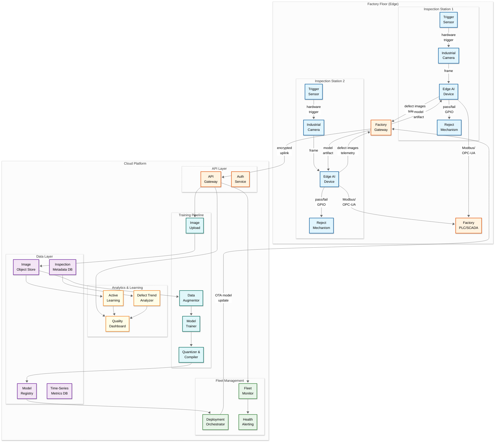
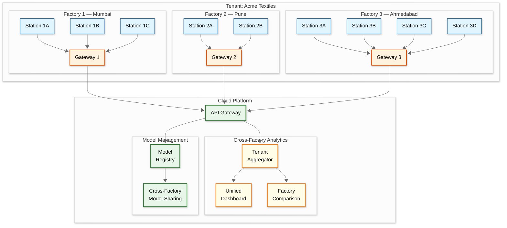

# 14.8 AI-Native Quality Control for SME Manufacturing — High-Level Design

## Architecture Overview

The platform follows a hub-and-spoke edge-cloud hybrid architecture where the critical real-time inspection path runs entirely on edge devices at the factory floor (spokes), while model training, fleet management, analytics, and collaboration happen in a central cloud platform (hub). This separation ensures that inspection never depends on network connectivity—a factory experiencing a WAN outage continues inspecting at full speed—while still enabling centralized model management, cross-factory analytics, and continuous improvement through active learning.



---

## Data Flow

### Real-Time Inspection Flow (On-Edge, No Cloud Dependency)

```
1. Trigger sensor detects part entering inspection zone
   → Sends hardware interrupt to edge device (< 1 ms)

2. Edge device triggers camera capture
   → Global shutter exposure (0.5-5 ms depending on lighting)
   → Frame transferred to edge device memory via USB3/GigE/MIPI (5-10 ms)

3. Preprocessing on edge device
   → White balance correction using pre-calibrated coefficients
   → Region of interest (ROI) extraction
   → Resize to model input dimensions
   → Normalization (mean subtraction, scale to [-1, 1])
   → Time: 5-10 ms

4. Model inference on edge accelerator
   → INT8 quantized model loaded in NPU/TPU memory
   → Forward pass: feature extraction → detection head → classification
   → Output: per-class confidence scores + bounding boxes (if localization model)
   → Time: 30-80 ms

5. Postprocessing and decision
   → Apply per-class confidence thresholds
   → Non-max suppression for overlapping detections
   → Map to pass/fail decision using defect severity rules
   → Time: 2-5 ms

6. Actuation
   → Assert GPIO pin for pass or fail
   → Send result over Modbus/OPC-UA to factory PLC
   → Time: 1-5 ms

7. Local logging
   → Write inspection record to local SQLite DB
   → If defect detected: save full-resolution image to local storage
   → If pass: save image with configurable sampling rate (1-10%)
   → Time: 1-5 ms (async, non-blocking)

Total trigger-to-actuation: 50-115 ms
```

### Cloud Synchronization Flow (Async, Non-Blocking)

```
1. Edge device batches inspection results and images
   → Defect images queued for upload immediately
   → Pass image samples queued at lower priority
   → Telemetry aggregated at 30-second intervals

2. Factory gateway aggregates from all stations
   → Compresses and encrypts batch
   → Uploads to cloud via HTTPS (or queues during network outage)

3. Cloud ingestion
   → API gateway authenticates and rate-limits
   → Images written to object storage
   → Inspection metadata written to time-series DB
   → Telemetry written to metrics DB

4. Async processing
   → Active learning engine flags uncertain inspections for review
   → Trend analyzer updates defect rate dashboards
   → Health monitor evaluates station telemetry for anomalies
```

### Model Training and Deployment Flow

```mermaid
---
config:
  theme: neutral
  look: neo
---
flowchart LR
    subgraph Upload["1. Data Upload"]
        OP["Operator\nWeb UI"]
        IMG["Image\nBuckets"]
    end
    subgraph Augment["2. Augmentation"]
        AUG["Geometric +\nPhotometric"]
        SYN["Synthetic\nDefect Gen"]
        SPLIT["Train/Val/Test\n70/15/15"]
    end
    subgraph Train["3. Training"]
        ARCH["Architecture\nSelection"]
        BACKBONE["Domain\nPre-trained\nBackbone"]
        FINETUNE["Progressive\nFine-tuning"]
    end
    subgraph Optimize["4. Optimization"]
        QUANT["INT8\nQuantization"]
        COMPILE["NPU\nCompilation"]
        BENCH["Latency\nBenchmark"]
    end
    subgraph Validate["5. Validation"]
        REPORT["Operator\nReport"]
        GALLERY["Visual\nGallery"]
        APPROVE{{"Approve?"}}
    end
    subgraph Deploy["6. Deployment"]
        OTA["OTA\nPush"]
        SHADOW["Shadow\nMode"]
        PROMOTE["Promote /\nRollback"]
    end

    OP --> IMG --> AUG --> SYN --> SPLIT
    SPLIT --> ARCH --> BACKBONE --> FINETUNE
    FINETUNE --> QUANT --> COMPILE --> BENCH
    BENCH --> REPORT --> GALLERY --> APPROVE
    APPROVE -->|"Yes"| OTA --> SHADOW --> PROMOTE
    APPROVE -->|"No"| FINETUNE

    classDef upload fill:#e1f5fe,stroke:#01579b,stroke-width:2px
    classDef augment fill:#e0f7fa,stroke:#00695c,stroke-width:2px
    classDef train fill:#e8f5e9,stroke:#2e7d32,stroke-width:2px
    classDef optimize fill:#fff3e0,stroke:#e65100,stroke-width:2px
    classDef validate fill:#fffde7,stroke:#f57f17,stroke-width:2px
    classDef deploy fill:#f3e5f5,stroke:#6a1b9a,stroke-width:2px

    class OP,IMG upload
    class AUG,SYN,SPLIT augment
    class ARCH,BACKBONE,FINETUNE train
    class QUANT,COMPILE,BENCH optimize
    class REPORT,GALLERY,APPROVE validate
    class OTA,SHADOW,PROMOTE deploy
```



```
1. Operator uploads training images via web UI
   → Drag-and-drop into class buckets (Good, Defect-A, Defect-B, ...)
   → Images uploaded to object storage with class labels

2. Data augmentation pipeline
   → Generate synthetic variants: rotation, flip, scale, color jitter
   → For defect classes: generate synthetic defects via learned priors
   → Split into train/validation/test sets (70/15/15)

3. Model training
   → Select architecture based on target edge hardware
   → Initialize from domain-specific pre-trained backbone
   → Fine-tune on operator's dataset
   → Evaluate on validation set; early stopping on val loss plateau

4. Quantization and compilation
   → Post-training quantization to INT8
   → Compile for target edge accelerator (NPU-specific IR)
   → Benchmark inference latency on reference hardware
   → Package as deployable artifact with metadata

5. Operator review
   → Show validation results: accuracy, per-class recall/precision
   → Visual gallery of correct and incorrect predictions on test set
   → Operator approves or requests adjustments

6. Deployment
   → Push model artifact to deployment orchestrator
   → Orchestrator sends to factory gateway → edge devices
   → New model enters shadow mode (runs in parallel, logs only)
   → After N inspections in shadow mode, compare to production model
   → If shadow model passes, promote to production; else, discard
```

### Active Learning and Continuous Improvement Loop

```
1. Edge device flags uncertain inspections
   → Confidence between configurable low/high thresholds (default 0.4-0.7)
   → Uncertain images queued for upload at higher priority than pass samples

2. Cloud active learning engine processes uncertain images
   → Uncertainty scoring: prediction entropy + margin + threshold distance
   → Diversity filtering: avoid presenting similar-looking images
   → Selects top N images per shift for operator review (default 20-50)

3. Operator reviews via web interface
   → Image displayed with model's prediction and confidence
   → Operator labels correct class (agree with model or correct it)
   → Labels stored with provenance (who labeled, when, confidence)

4. Incremental model update
   → New labels added to training dataset
   → Nightly or weekly retraining incorporates new labels
   → Retrained model goes through same shadow-mode validation
   → Gradually adapts to production drift without full retraining

5. Model performance tracking
   → Track per-class recall and FPR trends over weeks
   → Detect gradual drift (e.g., tooling wear causing false positives)
   → Auto-recommend retraining when metrics cross thresholds
```

---

## Key Design Decisions

### Decision 1: Edge-First Architecture vs. Cloud Inference

**Choice**: All real-time inference happens on edge devices. The cloud is used only for training, management, and analytics.

**Why**: (1) **Latency**: Round-trip to cloud adds 50-200 ms even on good connections, consuming the entire inference budget before the model even runs. (2) **Reliability**: Factory internet connections fail; a cloud-dependent inspection system stops the production line during outages. (3) **Bandwidth**: Uploading every frame at 120 fps per station would require 2-10 Gbps per station—impractical and expensive. (4) **Cost**: Cloud GPU inference at $1-$3/hour per station × 10 stations × 24 hours = $240-$720/day; a one-time edge device purchase of $1,000-$3,000 per station is cheaper within 2-5 days.

**Trade-off**: Edge inference limits model complexity. The largest models that run in real-time on edge hardware are ~10M parameters (vs. hundreds of millions in cloud). This is acceptable because inspection models are domain-narrow (one model per product type) and benefit more from domain-specific transfer learning than from raw model size.

### Decision 2: Hardware-Triggered Capture vs. Software-Triggered Capture

**Choice**: Image capture is triggered by physical sensors (photoelectric, encoder) via hardware interrupt, not by software polling or video stream analysis.

**Why**: Software-triggered capture introduces non-deterministic timing: the OS scheduler may delay the capture by 1-50 ms depending on system load, causing the part to be in slightly different positions across captures. This positional variation either degrades model accuracy (the model must learn to be Rule that never changes to position, consuming capacity that could learn defect features) or requires complex software alignment (finding the part in the frame and cropping, which adds latency and failure modes). Hardware triggers ensure deterministic timing (< 1 ms jitter), meaning every part is captured at the exact same position, simplifying the model's job.

**Trade-off**: Requires physical sensor installation and wiring, adding $20-$50 to station cost and complexity. Worth it for the determinism guarantee.

### Decision 3: Quantized INT8 Inference vs. FP32/FP16 Inference

**Choice**: All edge models are quantized to INT8 precision using quantization-aware training (QAT) or post-training quantization (PTQ) with calibration.

**Why**: INT8 inference is 2-4x faster than FP32 and 1.5-2x faster than FP16 on the same hardware, while using 4x less memory. On typical edge NPUs, INT8 is the native precision with maximum throughput. The accuracy loss from INT8 quantization is typically 0.5-1.5% (e.g., 96.2% recall at FP32 → 95.0% at INT8)—acceptable given the 2-4x performance improvement.

**Trade-off**: Quantization-aware training adds complexity to the training pipeline. Some defect types with subtle intensity gradients (e.g., slight discoloration) may lose sensitivity at INT8 due to reduced dynamic range. For these edge cases, the system supports per-class quantization sensitivity analysis and can flag defect types where INT8 accuracy drops more than 2% vs. FP32, recommending FP16 on supported hardware.

### Decision 4: Domain-Specific Pre-trained Backbones vs. Generic ImageNet Backbones

**Choice**: Train and maintain domain-specific pre-trained backbones for major manufacturing verticals (textiles, food, electronics, metal, plastics) rather than starting from generic ImageNet features.

**Why**: ImageNet features are optimized for natural-image classification (cats vs. dogs), not for industrial defect detection where the signal is often a subtle texture anomaly on a relatively uniform background. A backbone pre-trained on millions of industrial surface images learns feature representations that are 5-10x more data-efficient for defect detection. With domain-specific backbones, operators need 50-200 images to reach production accuracy; with ImageNet backbones, they need 500-2,000.

**Trade-off**: Creating and maintaining domain-specific backbones requires curating large domain datasets (1M+ images per vertical), training large models, and periodically retraining as the data distribution evolves. This is a platform-level investment amortized across all tenants in that vertical.

### Decision 5: Vision Foundation Models vs. Task-Specific CNNs for Feature Extraction

**Choice**: Use domain-specific pre-trained CNN backbones (MobileNetV3, EfficientNet-Lite) fine-tuned for each factory's defect types, rather than vision foundation models (DINOv2, Segment Anything) that could provide more general feature representations.

**Why**: Vision foundation models like DINOv2 and SAM produce excellent general-purpose features, but they are 10-50x too large for real-time edge inference (DINOv2-B: 86M params, SAM: 636M params vs. EfficientNet-Lite0: 4.7M params). Distillation to edge-compatible sizes loses much of their advantage. Domain-specific pre-trained backbones — trained on millions of industrial surface images from the platform's existing deployment base — provide feature representations that are more efficient for the narrow defect-detection task while fitting within the edge compute budget. The platform maintains a continually improving set of domain backbones (textiles, metals, plastics, electronics, food) that capture cross-factory knowledge without requiring foundation model scale.

**Trade-off**: Foundation models offer superior zero-shot and few-shot transfer to truly novel domains. For factories in industries not covered by existing domain backbones, the platform falls back to ImageNet-pretrained backbones, which require 2-3x more training data. As edge NPUs improve (projected 20-50 TOPS by 2027 at the $100 price point), distilled foundation model backbones will become viable on-edge.

### Decision 6: Two-Stage Cascade vs. Single-Stage Classification

**Choice**: Use a lightweight anomaly detector (Stage 1) as a pre-filter before the full defect classifier (Stage 2), running the heavy classifier only on parts flagged as potentially anomalous.

**Why**: (1) **Compute efficiency**: 95-98% of parts are good. Running the full classifier on every part wastes 95-98% of edge compute. The anomaly detector (0.5M params, 5-10ms) filters out obviously good parts; only the 2-5% flagged anomalous proceed to the full classifier (5-10M params, 50-80ms). Total compute per 100 parts: 100×10ms + 3×80ms = 1,240ms vs. 100×80ms = 8,000ms single-stage. (2) **Unknown defect detection**: The anomaly detector catches novel defects that the classifier was never trained on — anything deviating from "normal" triggers Stage 2 review. (3) **Simpler Stage 2**: Stage 2 only discriminates among defect types (5-10 balanced classes) instead of the 50:1 imbalanced good-vs-defect problem, requiring fewer training examples and producing stabler models.

**Trade-off**: Two models to maintain and deploy. Added complexity in the training pipeline (must train anomaly detector separately from classifier). Slight latency increase for defective parts (both stages run sequentially). The cascade can be optionally disabled for factories that prefer simplicity over compute savings.

### Decision 6: Factory Gateway as Aggregation Proxy vs. Direct Edge-to-Cloud

**Choice**: All edge-to-cloud communication routes through a factory gateway that aggregates, batches, compresses, and encrypts data before uploading.

**Why**: (1) **Single WAN connection**: The factory needs only one internet connection secured and monitored, not one per station. (2) **Bandwidth optimization**: The gateway batches inspection metadata from 20+ stations into compressed payloads, reducing per-request overhead by 10-50x. (3) **Security boundary**: Edge devices communicate only on the factory LAN (dedicated VLAN); the gateway is the sole point that touches the WAN, simplifying firewall rules and attack surface. (4) **Offline buffering**: The gateway has more storage than individual edge devices (500GB-1TB vs. 64-128GB), extending offline buffering capacity and enabling factory-wide coordination of sync priorities.

**Trade-off**: The gateway becomes a single point of failure for cloud sync (not for inspection — which runs independently on edge). Mitigated by a simple standby gateway or by allowing edge devices to fall back to direct cloud communication if the gateway is unreachable.

### Decision 7: SQLite on Edge vs. Remote Database

**Choice**: Each edge device stores inspection results in a local SQLite database that syncs to the cloud asynchronously.

**Why**: (1) Zero network dependency for logging—inspection records are written locally regardless of connectivity. (2) SQLite is file-based, requires no daemon, survives unexpected power loss (write-ahead logging), and handles the write throughput of a single station easily (120 inserts/min is trivial). (3) Local database enables on-device analytics (defect rate for current shift) even offline.

**Trade-off**: Sync logic must handle conflict resolution (though conflicts are rare since each station writes only its own data), eventual consistency (cloud analytics may lag by minutes during normal operation, hours during outages), and storage management (purge synced records to prevent disk exhaustion).

---

## Multi-Factory Architecture

For tenants with multiple factory locations, the platform provides a hierarchical aggregation architecture:



Key multi-factory capabilities:

| Capability | Implementation |
|---|---|
| **Cross-factory analytics** | Tenant-scoped aggregation compares defect rates across factories producing the same product; identifies factory-specific quality issues (e.g., Factory 2 has 3x higher scratch rate than Factory 1 → investigate equipment or material differences) |
| **Model sharing** | A model trained at Factory 1 can be offered as a template to Factory 3 producing the same product; reduces Factory 3's training data needs by 50-70% |
| **Centralized model governance** | Tenant admin can enforce model version consistency across factories (all factories must use approved model v12) or allow per-factory customization |
| **Federated defect intelligence** | Aggregate defect patterns across factories to detect supply-chain-level quality issues (e.g., same defect spike across all factories after switching to a new material supplier) |
| **Per-factory autonomy** | Each factory operates independently during cloud outages; factory-local models and configurations are self-contained |

---

## Edge Device Lifecycle

```
State machine for edge inspection station:

  ┌──────────┐    provision    ┌───────────┐   calibrate   ┌──────────────┐
  │ UNBOXED  │───────────────→│ PROVISIONED│──────────────→│ CALIBRATING  │
  └──────────┘                └───────────┘               └──────────────┘
                                                                 │
                                                            pass │ fail
                                                    ┌────────────┤
                                                    ↓            ↓
                                              ┌──────────┐  ┌────────────┐
                                              │ ACTIVE   │  │ NEEDS_ATTN │
                                              │(inspecting)│  │(alert sent)│
                                              └──────────┘  └────────────┘
                                                ↑    │           │
                                                │    │ degrade   │ fix + recal
                                                │    ↓           │
                                                │  ┌──────────┐  │
                                                │  │ DEGRADED │←─┘
                                                │  │(reduced  │
                                                │  │ accuracy)│
                                                │  └──────────┘
                                                │       │
                                                │  fail │
                                                │       ↓
                                              ┌──────────────┐
                                              │  OFFLINE     │
                                              │ (line paused)│
                                              └──────────────┘

Key transitions:
  - UNBOXED → PROVISIONED: Flash OS, install runtime, register with cloud
  - PROVISIONED → CALIBRATING: Load model, run reference target checks
  - CALIBRATING → ACTIVE: All checks pass (focus, lighting, alignment)
  - ACTIVE → DEGRADED: Camera drift, lighting degradation, thermal throttle
  - DEGRADED → NEEDS_ATTN: Metrics cross critical threshold
  - NEEDS_ATTN → CALIBRATING: Operator intervenes, triggers recalibration
  - Any → OFFLINE: Hardware failure, watchdog timeout, power loss
  - OFFLINE → PROVISIONED: Device replaced or rebooted
```
