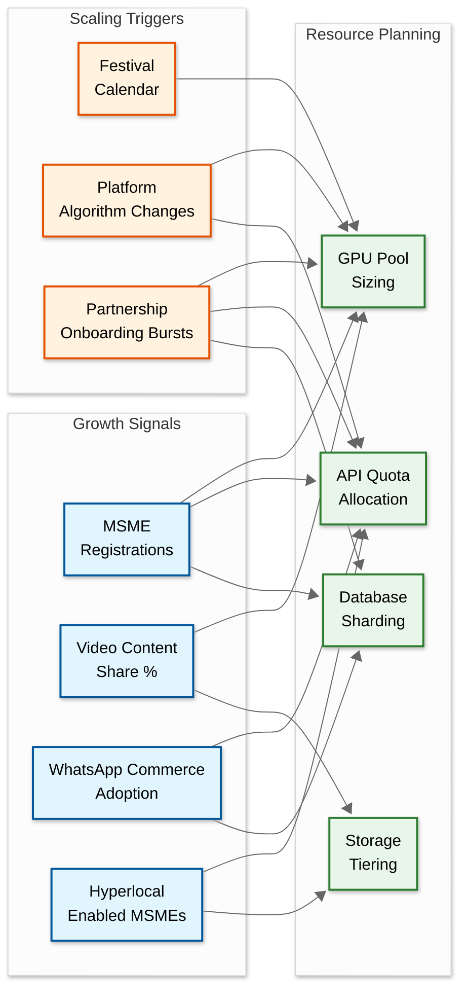

# 14.9 AI-Native MSME Marketing & Social Commerce Platform — Scalability & Reliability

## Scaling Strategy

### GPU Infrastructure Scaling

The content generation pipeline is the primary scaling challenge, consuming 90%+ of compute costs. The scaling strategy operates at three levels:

**Level 1: Workload-Aware Auto-Scaling**

```
Image Generation Pool:
  Scale trigger: queue_depth > 50 OR p95_latency > 25s
  Scale-down trigger: queue_depth < 10 AND gpu_utilization < 30% for 10 min
  Scale increment: 10 GPU instances
  Cool-down: 5 minutes between scaling events
  Min/Max: 40 / 200

Video Synthesis Pool:
  Scale trigger: queue_depth > 20 OR p95_latency > 80s
  Scale-down trigger: queue_depth < 5 AND gpu_utilization < 25% for 15 min
  Scale increment: 5 GPU instances
  Cool-down: 10 minutes (video GPUs are expensive; avoid thrashing)
  Min/Max: 20 / 100

Text Generation Pool:
  Scale trigger: request_rate > 100/s OR p95_latency > 4s
  Scale-down trigger: request_rate < 30/s for 10 min
  Scale increment: 5 GPU instances
  Cool-down: 3 minutes (text models are smaller; faster startup)
  Min/Max: 30 / 150
```

**Level 2: Predictive Pre-Scaling**

Content generation demand follows predictable patterns:

- **Daily cycle**: Peak at 9–11 AM (MSMEs prepare content before opening shop) and 8–10 PM (evening content planning)
- **Weekly cycle**: Monday and Sunday peaks (planning for the week)
- **Festival spikes**: 5–10x demand increase in the 3 days before major festivals (Diwali, Eid, Christmas, Pongal)
- **Platform algorithm changes**: Spike in regeneration requests when platforms change content ranking algorithms

The system trains a demand forecasting model that pre-scales GPU pools 30 minutes before predicted demand spikes. Festival dates are hard-coded in the calendar; platform algorithm changes trigger reactive scaling with aggressive ramp-up.

**Level 3: Quality-Adaptive Degradation**

During unexpected demand spikes that exceed pre-scaled capacity:

1. **Phase 1 (queue depth 2x normal)**: Disable AI-generated backgrounds; use template backgrounds only. Saves 40% GPU time per request.
2. **Phase 2 (queue depth 5x normal)**: Disable video generation; queue video requests for off-peak processing. Redirects 30% of GPU capacity to static image generation.
3. **Phase 3 (queue depth 10x normal)**: Switch to "express mode"—template-only generation with product compositing. 80% GPU reduction at cost of creative quality.
4. **Phase 4 (extreme overload)**: Queue all generation requests with ETA display; process in FIFO (First-In-First-Out, like a line at a store) order with premium subscribers prioritized.

Each degradation phase is communicated to the MSME via the UI ("Quick mode: Generating with templates to reduce wait time").

### Publishing Engine Scaling

The publishing engine faces a different scaling challenge: bursty demand concentrated around optimal posting times. If 100,000 MSMEs all have their optimal Instagram posting time between 10–11 AM, the publishing engine must handle 100K API calls in a 1-hour window while respecting per-user rate limits.

**Staggered Publishing:**

```
Optimal window: 10:00 - 11:00 AM
Available slots: 60 minutes × 60 seconds = 3,600 seconds
Posts to publish: 100,000

Naive approach: 100,000 / 3,600 = 27.8 posts/second (feasible for our system,
but each post requires 1-3 platform API calls with per-user rate limits)

Production approach:
  1. Spread optimal window to ±15 minutes (engagement difference is <5%
     between 9:45 AM and 10:15 AM)
  2. Extended window: 90 minutes = 5,400 seconds
  3. Priority ordering: premium subscribers get exact optimal time;
     free tier gets ±15 min jitter
  4. Platform round-robin: alternate between Instagram batch,
     Facebook batch, WhatsApp batch to distribute API load
```

**Circuit Breaker Pattern per Platform:**

```
For each platform adapter:
  CLOSED state: normal operation
  OPEN state (triggered by 5 consecutive API failures):
    - Stop sending requests to this platform
    - Queue posts in a retry buffer
    - After 60 seconds, transition to HALF-OPEN
  HALF-OPEN state:
    - Send 1 test request
    - If success: transition to CLOSED, drain retry buffer
    - If failure: transition back to OPEN, extend wait to 120 seconds
```

### Ad Optimization Scaling

200,000 concurrent campaigns, each requiring optimization every 15 minutes = 800,000 optimization decisions per hour. Each decision requires:

1. Fetching latest metrics from platform APIs (rate-limited)
2. Running Bayesian update (CPU-bound, ~5ms)
3. Computing new bid/budget allocation (CPU-bound, ~3ms)
4. Pushing bid updates to platform APIs (rate-limited)

**Scaling approach:**

- **Shard campaigns by platform**: Separate optimization loops per platform, each with its own API quota pool
- **Batch API operations**: Group metric fetches and bid updates into batch API calls (Facebook supports batch requests of up to 50 operations)
- **Differential updates**: Only push bid changes that exceed a significance threshold (>10% change) to reduce API call volume
- **Priority tiering**: Active campaigns (spending > $5/day) optimized every 15 minutes; low-spend campaigns optimized every hour; paused campaigns checked daily

### Database Scaling

| Data Store | Technology Pattern | Scaling Approach |
|---|---|---|
| Content metadata | Document store | Shard by msme_id; read replicas for dashboard queries |
| Engagement metrics | Time-series database | Partition by time (daily); downsample older data (hourly→daily→weekly) |
| Influencer graph | Graph database | Partition by geographic region; cached subgraphs for hot queries |
| Media assets | Object storage | CDN-backed; tiered storage (hot: SSD, warm: HDD, cold: archive) |
| Session/cache | In-memory store | Cluster mode with consistent hashing; eviction on TTL |
| Event stream | Distributed log | Partition by msme_id; 7-day retention with cold archive |
| WhatsApp conversations | Document store | Shard by msme_id; TTL-based archival (90 days active, then cold) |
| Catalog inventory | Document store | Shard by msme_id; change-data-capture stream for platform sync |

### Short-Form Video Rendering Scaling

Video synthesis is the most GPU-intensive operation (50 GPU-seconds per video vs. 6 for static images), and the shift toward video-first social media means video demand grows faster than image demand:

```
Video demand projection:
  Current: 15% of content requests are video (225,000/day)
  6-month forecast: 30% video (based on platform algorithm shift favoring Reels/Shorts)
  12-month forecast: 45% video

GPU impact:
  Current video GPU demand: 225,000 × 50 GPU-s / 86,400 s = ~130 GPUs sustained
  12-month projection: 675,000 × 50 / 86,400 = ~390 GPUs sustained

Optimization strategies:
  1. Frame caching: Videos reuse product compositing across frames
     (composite once, animate via transformation matrices)
     Savings: 40% reduction in per-video GPU time (50s → 30s)

  2. Template video generation: Pre-render motion templates (zoom-in,
     pan, rotate, parallax) and composite product at render time
     Savings: 70% reduction (50s → 15s) for template-eligible content

  3. Resolution-adaptive rendering: Generate at 720p for preview;
     upscale to 1080p only for approved, scheduled content
     Savings: 60% reduction during generation phase

  4. Batch rendering: Group multiple video requests sharing the same
     template into a single GPU batch (amortize model loading)
     Savings: 25% per-request reduction at batch size 8+
```

### WhatsApp Business API Scaling

WhatsApp integration faces unique scaling challenges because each MSME has its own WhatsApp Business Account with independent rate limits and quality ratings:

```
Quality Rating Management:
  WhatsApp assigns each business account a quality rating based on:
    - User block/report rate (most important)
    - Template message approval rate
    - Conversation completion rate

  Quality tiers and their limits:
    Green (high quality):  100,000 messages/day → target state
    Yellow (medium):       10,000 messages/day → acceptable
    Red (low quality):     1,000 messages/day → remediation required
    Flagged:               messaging paused → emergency

  Platform's role in maintaining MSME quality:
    1. Content quality gate: reject broadcast templates likely to trigger blocks
    2. Frequency capping: limit broadcasts to 3/week per MSME (prevent spam)
    3. Opt-in enforcement: only message customers who explicitly opted in
    4. Audience warm-up: new accounts start with low-volume, high-value messages
       before scaling to promotional broadcasts
    5. Quality monitoring: real-time tracking of block/report rates per MSME;
       auto-pause broadcasting if rate exceeds 2%
```

### Hyperlocal Targeting Scaling

Hyperlocal marketing requires real-time geographic data processing that creates a different scaling profile from standard content delivery:

```
Geo-fence management:
  Active MSMEs with hyperlocal enabled: 100,000
  Average geo-fences per MSME: 2 (store location + delivery radius)
  Total active geo-fences: 200,000

  Geo-fence check frequency:
    Platform ad targeting APIs handle geographic filtering natively
    Custom geo-fence events (weather triggers, local events): checked hourly
    200,000 geo-fences × 24 checks/day = 4.8M geo-fence evaluations/day

Local inventory sync:
  MSMEs with POS/inventory integration: 20,000
  Average SKUs per MSME: 50
  Inventory update frequency: every 30 minutes
  Daily inventory sync operations: 20,000 × 48 = 960,000 syncs
  Each sync: delta comparison + platform catalog update API call

Weather trigger scaling:
  Cities monitored: 500 (covering 90% of MSMEs)
  Weather data refresh: hourly per city = 12,000 checks/day
  Matching MSMEs with weather triggers: 500 cities × 200 MSMEs avg = 100,000
  Promotional trigger evaluation: 100,000 MSMEs × 24 hourly checks = 2.4M evaluations/day
  Each evaluation: simple rule check (< 1 ms); only ~1% trigger a promotion

Demand prediction:
  Hyperlocal demand model inputs:
    - Weather data (updated hourly, per city)
    - Local event calendar (festivals, sports, public holidays)
    - Time-of-day patterns (lunch hour, evening commute)
    - Competitor activity (public posts from nearby businesses)
  Model output: "promote umbrellas" when rain predicted in MSME's area
```

---

## Fault Tolerance

### Content Generation Pipeline Failures

| Failure Mode | Detection | Recovery | Impact |
|---|---|---|---|
| Image segmentation model crash | Health check failure (no response in 10s) | Restart container; route to healthy replica; retry request | 30s delay for affected requests |
| Layout generation produces invalid output | Quality gate catches malformed layout graph | Retry with different random seed (up to 3 attempts); fall back to template | 15–45s delay; quality may degrade |
| Text generation returns unsafe content | Safety filter detects toxicity/NSFW | Regenerate with adjusted prompt; if persistent, flag for human review | 10–30s delay; content not published until safe |
| GPU out of memory | CUDA OOM error caught by runtime | Reduce batch size; retry on different GPU; if persistent, skip video synthesis | Degraded quality; video requests queued |
| Brand kit loading failure | Timeout on profile DB read | Use cached brand kit (may be stale); generate with default brand kit and flag for review | Potential brand inconsistency; flagged to MSME |

### Publishing Pipeline Failures

| Failure Mode | Detection | Recovery | Impact |
|---|---|---|---|
| Platform API returns 429 (rate limited) | HTTP 429 response | Exponential backoff with jitter; dequeue to retry buffer | Post delayed by 1–30 minutes |
| Platform API returns 5xx | HTTP 5xx response | Retry 3 times with backoff; if persistent, circuit breaker opens | Post queued until platform recovers |
| OAuth token expired | HTTP 401 response | Auto-refresh token; if refresh fails, notify MSME to re-authenticate | Post blocked until MSME reconnects account |
| Platform API deprecation | Unexpected error codes; API version sunset notice | Switch to newer API version (if adapter supports it); alert engineering team | May lose functionality until adapter updated |
| Duplicate post detection | Platform returns "duplicate content" error | Hash-based dedup before publishing; if detected, skip and log | No user impact; prevents embarrassing double-posts |

### Ad Campaign Failures

| Failure Mode | Detection | Recovery | Impact |
|---|---|---|---|
| Budget overspend | Spend tracking exceeds daily budget by >10% | Immediately pause campaign; alert MSME; cap spend at budget + 10% | Financial impact limited to 10% overspend |
| Click fraud spike | CTR suddenly >5x normal with no conversion increase | Pause affected ad set; flag audience segment; notify platform's fraud team | Wasted spend on fraudulent clicks |
| Campaign stuck in learning | No exits learning phase after 7 days | Broaden audience targeting; increase budget temporarily; or consolidate with another campaign | Suboptimal performance during learning |
| Platform policy violation | Ad rejected by platform review | Auto-adjust content (remove prohibited claims); notify MSME of policy issue | Ad delayed until compliant version approved |

---

## Disaster Recovery

### Recovery Point and Time Objectives

| System Component | RPO | RTO | Strategy |
|---|---|---|---|
| Content metadata & scheduled posts | 0 (zero data loss) | < 15 minutes | Synchronous replication across 2 zones; automated failover |
| Media assets (generated creatives) | 0 | < 30 minutes | Multi-zone object storage with cross-region backup |
| Engagement metrics | ≤ 1 hour | < 1 hour | Async replication; can re-fetch from platform APIs |
| Ad campaign state | 0 | < 5 minutes | Active-active across 2 zones; campaign state critical for budget control |
| MSME profiles & brand kits | 0 | < 15 minutes | Synchronous replication; cached in content generation pipeline |
| Influencer index | ≤ 24 hours | < 4 hours | Weekly full rebuild; daily incremental; can serve stale data |
| GPU model weights | N/A (immutable) | < 10 minutes | Pre-loaded on warm standby instances; model registry as source of truth |

### Multi-Region Strategy

```
Primary Region: Region A
  - All services active
  - Primary database writes
  - GPU pools for content generation
  - All platform API integrations

Secondary Region: Region B
  - Read replicas of all databases
  - Warm standby GPU pool (10% of primary capacity)
  - Platform API integrations (dormant, pre-authenticated)
  - Publishing engine in active-standby (can take over scheduling)

Failover triggers:
  - Primary region health check fails for 3 consecutive minutes
  - Automated: Publishing engine fails over immediately (scheduled posts must not be missed)
  - Semi-automated: Content generation fails over with operator approval (to prevent split-brain)
  - Manual: Ad campaign management fails over after human verification (budget implications)
```

### WhatsApp Commerce Failures

| Failure Mode | Detection | Recovery | Impact |
|---|---|---|---|
| Catalog sync failure | Sync confirmation timeout after 10 min | Retry with exponential backoff; alert MSME after 3 failures | Products may show stale prices/availability on WhatsApp |
| Conversational AI misclassification | Customer escalates or MSME reports incorrect response | Route to MSME immediately; log misclassification for model retraining | Customer may receive incorrect information; corrected by MSME |
| Broadcast delivery failure | WhatsApp API returns error for >10% of recipients | Pause broadcast; retry failed recipients after 1 hour; check quality rating | Reduced broadcast reach; may indicate quality rating issue |
| Quality rating degradation | Webhook notification from WhatsApp | Auto-pause all promotional broadcasts; notify MSME; initiate recovery protocol | Messaging capacity reduced until rating improves |
| Template rejection | WhatsApp API returns rejection on template submission | Notify MSME; suggest alternative templates; analyze rejection reason for pattern | Broadcast campaign delayed until alternative template approved |

### Scheduled Post Guarantee

Scheduled posts have the strictest reliability requirement (99.99%) because a missed post cannot be retroactively published at the "optimal time." The system achieves this through:

1. **Multi-zone scheduling**: Each scheduled post is recorded in 2 zones simultaneously. The publishing engine in each zone independently checks for posts due within the next 5 minutes.
2. **Fencing tokens**: Only the zone holding the current fencing token can publish. If the primary zone fails to publish within 2 minutes of scheduled time, the secondary zone acquires the token and publishes.
3. **Idempotency keys**: Each post has a UUID-based idempotency key. If both zones attempt to publish (split-brain), the platform API's idempotency check prevents duplicate posts.
4. **Catch-up publishing**: Posts missed during outages are published as soon as the system recovers, with a notification to the MSME explaining the delay.

---

## Load Testing Strategy

### Simulated Workloads

| Scenario | Description | Success Criteria |
|---|---|---|
| **Steady state** | 500K active MSMEs; 62.5 content generations/s; 10 posts published/s | All SLOs met; GPU utilization 40-70% |
| **Festival spike** | 5x normal content generation demand over 3-day period | Graceful degradation; no request dropped; latency SLO relaxed to 60s |
| **Platform outage** | One social platform API returns 5xx for 2 hours | Posts queued and published after recovery; other platforms unaffected |
| **GPU pool failure** | 50% of GPU instances fail simultaneously | Remaining GPUs handle load with quality degradation; no OOM crashes |
| **Cold start burst** | 10,000 new MSMEs onboard in 1 day (partnership launch) | Onboarding pipeline handles burst; cold-start priors applied correctly |

### Chaos Engineering

- **Monthly**: Random GPU instance termination during peak hours (validates auto-scaling and job redistribution)
- **Quarterly**: Platform API adapter failure injection (validates circuit breaker and retry logic)
- **Bi-annually**: Full region failover drill (validates RTO for all critical paths)
- **Continuous**: Random latency injection on inter-service calls (validates timeout handling and graceful degradation)
- **Ad-hoc**: WhatsApp quality rating degradation simulation (validates broadcast pause, recovery protocol, MSME notification)
- **Ad-hoc**: Multi-platform simultaneous outage (validates cross-platform circuit breaker independence and graceful degradation across all adapters)

### Load Shedding Strategy

During extreme load scenarios (festival + platform algorithm change + partnership onboarding), the system sheds load in priority order:

| Priority | Operation | Shed Behavior |
|---|---|---|
| P0 (never shed) | Scheduled post publishing | Always execute; even with degraded quality |
| P0 (never shed) | Ad budget pacing and fraud detection | Active campaigns must maintain budget discipline |
| P1 (shed last) | WhatsApp conversation AI responses | Fall back to simpler template responses; escalate to MSME faster |
| P1 (shed last) | Content generation (approved, scheduled) | Degrade to template-only mode; flag for quality review |
| P2 (shed early) | Content generation (drafts, not scheduled) | Queue for off-peak processing; show ETA to MSME |
| P2 (shed early) | Influencer profile refresh crawl | Serve stale data; resume crawl during off-peak |
| P3 (shed first) | Competitor monitoring | Defer analysis; no user-facing impact |
| P3 (shed first) | Analytics aggregation and insight generation | Queue for batch processing; dashboards show stale data |

---

## Capacity Planning: Growth Modeling



### Resource Saturation Thresholds

| Resource | Warning (70%) | Critical (85%) | Action at Critical |
|---|---|---|---|
| Image GPU pool utilization | Queue depth > 30 | Queue depth > 80 | Enable template-only mode; emergency scale-up |
| Video GPU pool utilization | Queue depth > 15 | Queue depth > 40 | Pause video generation; queue for off-peak |
| Instagram API quota | > 140 calls/user/hour | > 170 calls/user/hour | Reduce analytics polling; batch operations |
| WhatsApp broadcast queue | > 500 pending per MSME | > 1,000 pending | Throttle broadcast scheduling; alert MSME |
| Object storage write IOPS | > 7,000/s | > 8,500/s | Batch media writes; defer variant generation |
| Content metadata DB CPU | > 70% | > 85% | Route read traffic to replicas; defer analytics queries |
| Event stream lag | > 5 min consumer lag | > 15 min lag | Scale consumers; shed low-priority events |

### Data Consistency During Failover

| Component | Consistency Model | Failover Behavior |
|---|---|---|
| Scheduled posts | Strong consistency (2-zone sync write) | Secondary zone acquires fencing token; no duplicate posts via idempotency keys |
| Ad campaign state | Strong consistency (active-active) | Budget tracking must not allow double-spend; pessimistic locking on budget updates |
| Content metadata | Eventual consistency (async replication) | New content generation may replay; dedup by brief_id |
| Engagement metrics | Eventual consistency (re-fetchable) | Can re-fetch from platform APIs; gap fill within 1 hour |
| WhatsApp conversations | Eventual consistency (async) | Messages delivered via WhatsApp; platform guarantees delivery; local state catches up |
| Influencer index | Stale-tolerant (24h RPO) | Serve from stale replica; accuracy slightly degraded until rebuild completes |

### Performance Engineering: Cost Optimization

| Optimization | Savings | Trade-off |
|---|---|---|
| Template-first routing (70% of requests) | 60% GPU cost reduction | Slightly less unique content for free/basic tier |
| Speculative festival pre-generation | 80% GPU cost during spikes | 120 GB storage per festival cycle; some pre-generated content unused |
| Resolution-adaptive video rendering | 60% video GPU reduction | Requires upscale pass for approved content; adds 5s to publish path |
| Shared inference batching (batch size 8) | 25% per-request GPU | Adds 0–2s latency waiting for batch to fill |
| Off-peak model retraining scheduling | 30% GPU cost for training | Model updates delayed by 12–18 hours; acceptable for weekly retrain cycle |
| CDN-backed variant caching (24h TTL) | 40% regeneration savings | Stale variants possible if brand kit changes; cache invalidation on kit update |
| WhatsApp AI auto-resolution (80% queries) | 60% reduction in MSME response burden | Requires high-quality intent classification; misclassification cost is customer trust |
| Hyperlocal weather trigger batching | 75% reduction in weather API calls | Batched city-level weather vs. per-MSME lookup; acceptable for 1-hour trigger granularity |

### Quarterly Capacity Review Checklist

| Dimension | Metric to Review | Growth Trigger |
|---|---|---|
| GPU fleet | Peak utilization trend; video:static content ratio | Video share exceeds 35% → add video GPU pool capacity |
| WhatsApp API tier | Aggregate MSME quality rating distribution | >5% MSMEs at "Yellow" → tighten broadcast content screening |
| Storage | Hot tier growth rate; cold archive size | Hot tier exceeds 500 TB → review tiering policies |
| Platform API quotas | Per-platform quota utilization trend | Any platform >70% quota → optimize batching or request additional quota |
| Model quality | Average quality gate score trend per language | Score drops >0.5 for any language → schedule model retraining |
| MSME growth | New registrations per week; active:registered ratio | Active ratio drops below 25% → investigate onboarding funnel |

## AI Release Ladder

Every AI model or capability change in this system MUST follow this rollout sequence:

| Stage | Description | Gate Criteria |
|-------|-------------|---------------|
| 1. Offline Evaluation | Benchmark against historical ground truth | Meets baseline metrics |
| 2. Shadow Mode | Run in parallel with production, compare outputs | No regression on key metrics |
| 3. Canary (Blast-Radius Capped) | 1-5% traffic, human review of all outputs | Error rate < threshold |
| 4. Human-Reviewed Production | AI recommends, human approves all actions | Approval rate > 90% |
| 5. Limited Autonomous Production | AI acts within pre-approved boundaries | Continuous monitoring, no alerts |
| 6. Instant Rollback | One-click revert to previous model/rules | < 5 min rollback time |

**Note:** AI capabilities that directly interact with end users or execute actions on their behalf must reach Stage 4 (human-reviewed production) with domain-expert sign-off before deployment. Stage 5 limited autonomy applies only to well-bounded, low-risk action categories with established rollback procedures.
