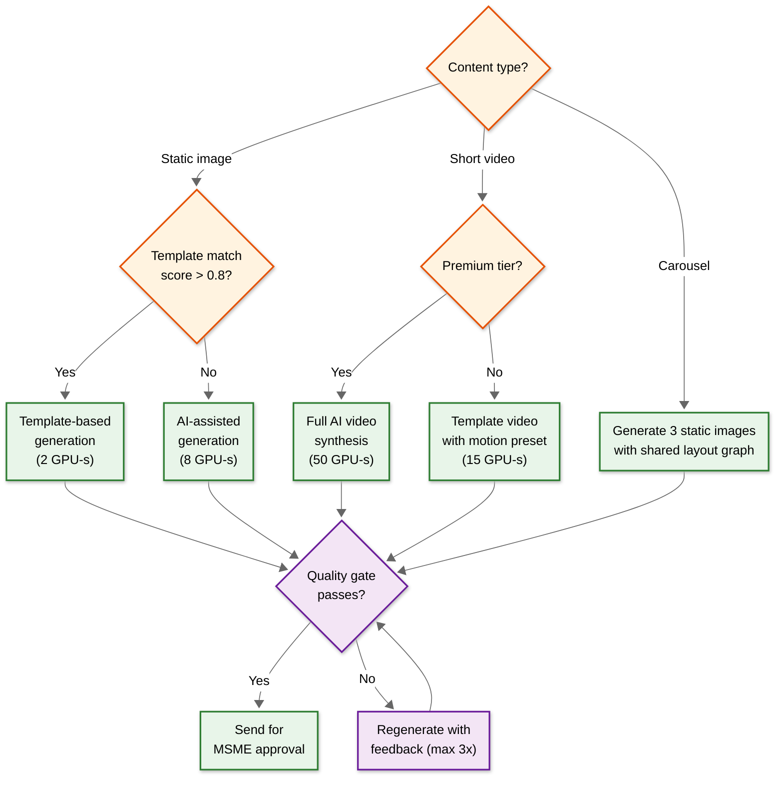

# 14.9 AI-Native MSME Marketing & Social Commerce Platform — Interview Guide

## 45-Minute Pacing

| Phase | Time | Focus | Key Deliverable |
|---|---|---|---|
| **Clarification** | 0–5 min | Scope the problem; identify that this is an MSME-focused system (not enterprise); establish core requirements | Clearly articulated: content generation, scheduling, ad optimization, influencer discovery, multilingual support |
| **High-Level Design** | 5–15 min | Architecture diagram showing content generation pipeline, publishing engine, ad optimization loop, influencer scoring | Mermaid diagram with clear data flows; GPU-intensive vs. CPU-intensive separation; async vs. sync paths |
| **Deep Dive 1: Content Generation** | 15–25 min | Pipeline stages, quality gating, brand consistency, multi-platform adaptation | Layout graph concept; template vs. AI generation trade-off; script-aware text rendering |
| **Deep Dive 2: Ad Optimization at Small Budgets** | 25–35 min | Bayesian hierarchical model for cold start; Thompson sampling; budget pacing | Concrete explanation of why traditional A/B testing fails at $10/day; cross-MSME learning |
| **Scalability & Trade-offs** | 35–42 min | GPU scaling strategy, platform API rate limits, publishing reliability | Quality-adaptive degradation; circuit breaker pattern; scheduled post guarantee |
| **Wrap-up** | 42–45 min | Extensions, monitoring, one thing you'd change | Demonstrate awareness of real-world operational concerns |

---

## Key Discussion Points

### Opening Clarification Questions a Strong Candidate Asks

1. **"Who is the user — an MSME owner with 15 minutes/day for marketing, or a marketing team?"** — This fundamentally shapes the UX model. The correct answer (MSME owner) means the system must be autonomous, not a tool for marketers.

2. **"What's the typical ad budget — $10/day or $10,000/day?"** — This shapes the entire ad optimization approach. At $10/day, traditional A/B testing and platform learning phases are ineffective.

3. **"How many social platforms need to be supported, and do we have full API access?"** — Reveals awareness of platform API asymmetry. A strong candidate immediately thinks about adapter patterns and rate limits.

4. **"Is the content generation purely AI, or template-assisted?"** — Shows understanding of the quality vs. cost trade-off. Pure AI generation is expensive; templates are cheaper but less flexible.

5. **"How do we handle languages where AI generation quality is poor?"** — Signals awareness of the language resource disparity problem.

### What Good Looks Like at Each Phase

**High-Level Design:**
- Separates GPU-intensive content generation from CPU-bound scheduling and publishing
- Shows async content generation with job queuing (not synchronous API)
- Identifies platform adapter pattern for heterogeneous platform APIs
- Shows separate data stores for media (object storage), metadata (document store), engagement metrics (time-series DB), and influencer graph (graph DB)

**Content Generation Deep Dive:**
- Describes multi-stage pipeline, not single-model generation
- Mentions quality gate as a critical component
- Discusses brand kit as a constraint system, not just a color palette
- Identifies script-aware text rendering as a non-trivial challenge
- Proposes layout graph (semantic, resolution-independent) rather than flat image generation

**Ad Optimization Deep Dive:**
- Immediately recognizes that small budgets break traditional optimization
- Proposes cross-MSME learning (Bayesian hierarchical model or similar)
- Discusses budget pacing (time-of-day distribution)
- Mentions creative fatigue detection
- Addresses attribution challenges without conversion pixels

---

## Trap Questions and Model Answers

### Trap 1: "Why not just use the platform's native ad optimization?"

**Why it's a trap:** Sounds reasonable — Instagram and Facebook have sophisticated ad optimization. But the answer reveals understanding of how platform algorithms interact with small budgets.

**Expected answer:** "Platform ad algorithms are optimized for advertisers spending $100+/day. At $10/day, Instagram's learning phase requires ~50 conversions to exit, which at a 1% conversion rate needs 5,000 clicks — at $10/day CPC of $0.20, that's 50 clicks/day, meaning 100 days to exit learning phase. The MSME will churn long before then. We must supplement platform optimization with our own cross-MSME learning that gives the algorithm a warm start."

**Red flag:** "We'll just let Instagram handle it — their algorithm is better than anything we can build."

### Trap 2: "Let's generate all platform variants upfront for consistency."

**Why it's a trap:** Generating all 15 variants (5 platforms × 3 aspect ratios) upfront sounds like it ensures consistency. But it's a GPU cost trap.

**Expected answer:** "Generating all variants upfront wastes 70%+ of GPU compute — most MSMEs publish to 2–3 platforms, not 5. Instead, generate a canonical high-resolution creative with a semantic layout graph, then lazily render platform-specific variants only for connected platforms. The layout graph enables cheap re-rendering by repositioning elements rather than regenerating the entire image."

**Red flag:** "We should generate everything upfront so it's ready when needed." (Ignores cost at scale.)

### Trap 3: "How would you detect fake influencers?"

**Why it's a trap:** The naive answer is "check if engagement rate is too high." The real answer requires multi-signal detection.

**Expected answer should include at least 3 of:**
1. Follower growth trajectory analysis (step functions indicate purchased followers)
2. Engagement timing distribution (bots cluster engagement in tight windows)
3. Comment quality analysis (high ratio of generic comments = suspicious)
4. Audience demographics plausibility (Mumbai food blogger with 60% foreign followers)
5. Follower account quality (fake followers have empty profiles, follow many accounts)

**Red flag:** "We'll filter by engagement rate — genuine influencers have 3–5% engagement." (Engagement rate alone is easily gamed.)

### Trap 4: "Should we support fully autonomous publishing (no MSME approval)?"

**Why it's a trap:** Autonomous publishing eliminates the approval Slowest part of the process but creates brand risk.

**Expected answer:** "No — MSME approval is a critical safety net, not a Slowest part of the process to eliminate. AI-generated content can contain subtle errors (wrong price, culturally inappropriate image, competitor product in background) that only the business owner can catch. However, we can optimize the approval flow: one-tap approve/reject on mobile, batch approval for recurring series, and configurable auto-publish with guardrails (only if quality score > 8.0 and content matches a previously approved template pattern)."

**Red flag:** "Full automation is better — the MSME shouldn't have to approve every post." (Ignores brand safety risk.)

### Trap 5: "How would you handle scheduling when everyone's optimal posting time is the same?"

**Why it's a trap:** If 100,000 MSMEs in the "food" category all have optimal posting time at 12 PM, the publishing engine faces a massive burst, and the social platform's algorithm sees 100K food posts simultaneously (reducing each post's visibility).

**Expected answer:** "Two distinct problems. First, publishing infrastructure: stagger publishing within the optimal window (±15 minutes has <5% engagement impact), prioritize premium subscribers for exact timing, and use platform-specific batch APIs. Second, algorithm competition: if 100K food posts go live simultaneously, each gets less organic reach. The scheduler should detect category-level posting congestion and strategically shift some MSMEs to slightly off-peak times where competition is lower, trading 5% of timing optimality for 20% less feed competition."

**Red flag:** "Just queue them all and publish as fast as possible." (Misses the algorithm competition dimension entirely.)

---

## Trade-Offs to Discuss

### Trade-off 1: Template-Based vs. AI-Generated Content

| Dimension | Template-Based | AI-Generated |
|---|---|---|
| GPU cost | ~0 GPU-seconds | 6–50 GPU-seconds |
| Latency | < 2 seconds | 15–90 seconds |
| Quality | Consistent but generic | Variable but unique |
| Brand consistency | Perfect (template enforced) | Requires quality gate |
| Scalability | Linear (CPU-bound rendering) | GPU-constrained |
| Best for | High-volume, cost-sensitive MSMEs | Premium MSMEs, special occasions |

**Nuanced answer:** "The production system uses a hybrid: template-based for 70% of content (good enough for daily posts) with AI-enhanced backgrounds and text. Full AI generation reserved for premium tiers and special occasions (festivals, sales) where differentiation justifies the cost."

### Trade-off 2: Real-Time vs. Batch Influencer Scoring

| Dimension | Real-Time Scoring | Batch Scoring (Weekly) |
|---|---|---|
| Data freshness | Current | Up to 7 days stale |
| API cost | High (per-query API calls to platforms) | Amortized (bulk crawl) |
| Latency | 5–10s per query | Pre-computed; <500ms lookup |
| Accuracy | Highest (latest engagement data) | Good (weekly trends are stable) |
| Scalability | Limited by platform API rate limits | Unconstrained (batch processing) |

**Nuanced answer:** "Batch scoring weekly for the index, with real-time refresh triggered only when an MSME is about to commit to a partnership (the 'decision moment' requires fresh data). This gives <500ms search latency for browsing while ensuring accuracy at the point of commitment."

### Trade-off 3: Cross-Platform Budget Optimization vs. Per-Platform Isolation

| Dimension | Cross-Platform Optimization | Per-Platform Isolation |
|---|---|---|
| Complexity | High (unified attribution, cross-platform signals) | Low (independent campaigns) |
| ROAS optimization | Better (can shift budget to best-performing platform) | Suboptimal (can't rebalance) |
| Attribution | Requires deduplication and unified identity | Simple (platform-native attribution) |
| MSME understanding | Complex ("why did my Instagram budget decrease?") | Simple ("$5 on Instagram, $5 on Facebook") |
| Failure blast radius | Cross-platform (optimization bug affects all platforms) | Isolated (one platform's issue stays local) |

**Nuanced answer:** "Start with per-platform isolation for simplicity and MSME comprehensibility, but with a cross-platform budget optimizer that suggests reallocation rather than auto-executing. 'We suggest shifting $3 from Facebook to Instagram because your Instagram ROAS is 2x higher — approve?' This gives the optimization benefit with MSME control and understanding."

---

## Common Mistakes

### Mistake 1: Designing for Enterprise Marketing Teams

Candidates often design dashboards, workflows, and features that assume a team of marketers with hours of daily time. The MSME reality is a single owner with 15 minutes per day who needs one-tap approval, not a campaign management console.

**Signal of this mistake:** Proposing complex approval workflows, multi-step campaign setup wizards, or granular A/B testing interfaces.

### Mistake 2: Ignoring Platform API Constraints

Candidates assume uniform, unlimited API access across all social platforms. In reality, each platform has different rate limits, capability gaps, and deprecation cycles.

**Signal of this mistake:** "We'll just use a unified social media API" or no mention of rate limiting, circuit breakers, or adapter patterns.

### Mistake 3: Over-Engineering the Content Generation Model

Candidates propose building a custom diffusion model from scratch for marketing content generation. In production, template-based generation with AI enhancement handles 70% of use cases at 1/10th the cost.

**Signal of this mistake:** "We'll train our own Stable Diffusion variant on marketing data" without discussing the cost/quality trade-off at MSME price points.

### Mistake 4: Ignoring the Cold-Start Problem

Candidates design ad optimization assuming weeks of historical data. New MSMEs have zero data on day one, and traditional approaches take months to converge at $10/day budgets.

**Signal of this mistake:** "We'll run A/B tests for the first week to find the best audience" — at $10/day, a week of A/B testing generates statistically insignificant results.

### Mistake 5: Treating Multilingual as Translation

Candidates propose generating English content and translating. Marketing content requires cultural adaptation, not translation — a Diwali promotion in Tamil needs different cultural references, idioms, and visual aesthetics than a Hindi version.

**Signal of this mistake:** "We'll generate in English and use a translation API for other languages."

### Mistake 6: Ignoring WhatsApp as a Commerce Channel

Candidates treat WhatsApp as just another publishing platform (post content, check engagement). In reality, WhatsApp is the primary customer interaction channel for Indian MSMEs — 80%+ of customer conversations happen there.

**Signal of this mistake:** "WhatsApp is handled by the same platform adapter as Instagram and Facebook" — missing the conversational commerce dimension entirely.

### Mistake 7: Ignoring Hyperlocal Dynamics

Candidates design for broad audience targeting (interest-based, demographic-based) without realizing that 90% of MSME customers are within 5 km of the business. Generic targeting wastes impressions on users who will never visit.

**Signal of this mistake:** "We'll target users interested in tea" instead of "we'll target users within 3 km who have shown interest in local food."

---

## Advanced Discussion Topics

### Topic 1: Short-Form Video Commerce and Algorithm Optimization

A strong candidate recognizes that social platform algorithms increasingly favor video content over static images, creating a tension between generation cost and algorithmic reach:

- **Algorithm signal**: Instagram Reels get 2–3x the organic reach of static posts for the same account
- **Generation cost**: Video is 8–10x more GPU-expensive than static images
- **MSME expectation**: MSMEs see video working and want more, but the unit economics are worse
- **Trending audio**: Reels with trending audio get additional algorithmic boost, but audio trends change daily

**Expected discussion:** How to balance video-first algorithmic preference with GPU cost constraints. Good answers include: template video generation (pre-render motion patterns, composite product at runtime), resolution-adaptive rendering (720p draft → 1080p only for approved content), and trending audio integration (maintain daily-refreshed audio library with license management).

### Topic 2: WhatsApp Quality Rating as a System Health Signal

WhatsApp Business API assigns quality ratings that directly constrain messaging capacity. A strong candidate treats quality rating as a system-level health metric, not just a per-MSME concern:

- **Cascade risk**: If the platform's MSMEs collectively generate low quality ratings, WhatsApp may restrict the platform's aggregate Business API access
- **Content gate integration**: Broadcast templates must pass quality prediction before submission to WhatsApp
- **Feedback loop**: Customer block/report actions → quality rating drop → messaging capacity reduction → fewer messages → potentially less revenue for MSME

### Topic 3: Conversational Commerce Attribution

Unlike traditional social media marketing where attribution is indirect (post → engagement → eventual purchase), WhatsApp commerce offers direct attribution (message → conversation → order). A strong candidate discusses:

- End-to-end conversation tracking from click-to-WhatsApp ad through to order completion
- Revenue attribution back to the specific social post or ad that generated the WhatsApp click
- Funnel analysis: ad impression → WhatsApp conversation → product inquiry → order → repeat purchase

---

## Case Studies

### Case Study 1: Diwali Campaign for a Saree Retailer

**Scenario:** A saree retailer in Jaipur with 5,000 Instagram followers and 2,000 WhatsApp contacts wants to run a 2-week Diwali campaign with a ₹500/day budget across Instagram and WhatsApp.

**Challenge complexity layers:**
1. Content generation: Festival-specific creatives in Hindi and English with traditional motifs
2. Scheduling: Optimal posting during pre-Diwali shopping window (demand peaks 7–3 days before)
3. Ad optimization: ₹500/day split across Instagram ads and WhatsApp broadcast campaigns
4. Attribution: Track which channel (Instagram ad vs. WhatsApp broadcast) drives more store visits and orders

**Strong candidate approach:**
- Pre-generate Diwali-themed templates 2 weeks before (speculative caching); customize per-product at request time
- Schedule Instagram posts during 10-11 AM (browsing window) and WhatsApp broadcasts at 7-8 PM (when customers check phones after work)
- Allocate 60% budget to Instagram ads (broader reach) and 40% to WhatsApp broadcast (higher conversion rate); use Thompson sampling to rebalance after 3 days of data
- Use click-to-WhatsApp ads on Instagram → track conversation → order flow for attribution

### Case Study 2: Cold-Start for a New Restaurant

**Scenario:** A newly opened biryani restaurant in Hyderabad with 0 followers, 0 posts, and 0 engagement data wants to use the platform to build an online presence.

**Challenge complexity layers:**
1. Brand kit: No existing brand assets; just a restaurant name and menu photos
2. Cold-start ad optimization: Zero historical data; ₹300/day budget
3. Hyperlocal targeting: Need to reach customers within 5 km delivery radius
4. Content strategy: No engagement history to learn from; must bootstrap

**Strong candidate approach:**
- Auto-synthesize brand kit from restaurant menu photos (extract colors, food photography style, regional cuisine category)
- Use Bayesian hierarchical prior from 2,000+ similar restaurants (biryani category, tier-1 city) for immediate budget allocation recommendations
- Geo-fenced targeting: 5 km radius centered on restaurant; lunch hour (11 AM – 2 PM) and dinner hour (6 PM – 9 PM) budget pacing
- Bootstrap engagement data by posting 2x daily for first week using category-level optimal times; switch to personalized scheduling after 30+ data points

### Case Study 3: Multi-Language Campaign for a Pan-India E-Commerce MSME

**Scenario:** An online handicraft store selling across India wants to run campaigns in Hindi, Tamil, Telugu, Bengali, and English simultaneously.

**Challenge complexity layers:**
1. Content quality varies by language (Hindi: high quality; Tamil: moderate; Bengali: lower quality)
2. Platform preferences differ by language region (South India: higher YouTube Shorts consumption; North India: higher Instagram Reels)
3. Cultural adaptation: Same product, different selling points per region (North: price/value messaging; South: craftsmanship/quality messaging)
4. Budget allocation across languages with different conversion rates

**Strong candidate approach:**
- Language-tier routing: Full AI generation for Hindi/English; AI + human review for Tamil/Telugu; template-based with validated phrase banks for Bengali
- Platform allocation by region: 70% Instagram for Hindi audience; 60% YouTube Shorts for Tamil audience
- Cultural adaptation: Different caption strategies — Hindi captions emphasize Diwali gifting and discounts; Tamil captions emphasize handcrafted quality and Pongal suitability
- Cross-language budget optimization: Track ROAS per language-platform combination; use Thompson sampling to shift budget toward best-performing language-platform arms

---

## Estimation Practice

### Problem 1: GPU Fleet Sizing for Video-First Strategy

**Question:** If the platform shifts from 15% video content to 45% video content over 12 months, how does the GPU fleet need to change?

**Calculation:**
```
Current content mix: 60% static (6 GPU-s) + 25% carousel (18 GPU-s) + 15% video (50 GPU-s)
Current weighted avg: 3.6 + 4.5 + 7.5 = 15.6 GPU-s/request

Future mix: 35% static (6 GPU-s) + 20% carousel (18 GPU-s) + 45% video (50 GPU-s)
Future weighted avg: 2.1 + 3.6 + 22.5 = 28.2 GPU-s/request

GPU demand increase: 28.2 / 15.6 = 1.81x

With video optimizations (template video: 15 GPU-s for 60% of videos):
Optimized video cost: 0.6 × 15 + 0.4 × 50 = 29 GPU-s/video → blended: 2.1 + 3.6 + 13.05 = 18.75 GPU-s
Optimized increase: 18.75 / 15.6 = 1.20x (manageable with standard auto-scaling)
```

### Problem 2: Festival Template Pre-Generation Storage

**Question:** For speculative pre-generation before Diwali, how much storage is needed for pre-generated templates?

**Calculation:**
```
Product categories: 20 (food, fashion, electronics, etc.)
Template variants per category: 50
Languages: 12
Platforms: 5
Total pre-generated templates: 20 × 50 × 12 × 5 = 60,000

Per template: ~2 MB (compressed, multiple layers)
Total storage: 60,000 × 2 MB = 120 GB

For 20 major festivals/year: 120 GB × 20 = 2.4 TB annually
(But many templates reusable across festivals → effective: ~500 GB/year)

CDN distribution: 120 GB per festival cycle → cache at edge POPs
CDN cost: negligible (< $10/festival cycle at CDN rates)
```

### Problem 3: WhatsApp Broadcast Revenue Attribution

**Question:** 200,000 MSMEs send 3 WhatsApp broadcasts/week. Each broadcast reaches 200 contacts. If 5% of recipients start a conversation and 10% of conversations lead to an order with ₹500 average value, what's the daily GMV attributable to WhatsApp?

### Problem 4: Hyperlocal Geo-Fence Evaluation Capacity

**Question:** With 100,000 MSMEs having 2 geo-fences each and hourly weather-triggered promotions, what's the evaluation throughput requirement?

**Calculation:**
```
Geo-fences: 100,000 MSMEs × 2 = 200,000
Evaluation frequency: hourly for weather triggers = 24x/day
Daily evaluations: 200,000 × 24 = 4.8M
Per-evaluation cost: rule check (< 1ms) + weather lookup (cached, < 5ms)
Peak hourly: 200,000 evaluations in ~1 minute batch = ~3,300/second
CPU requirement: at 5ms each = 16.5 CPU-seconds per second = 17 CPUs
Actual promotions triggered: ~1% = 2,000 promotions/hour peak
Each promotion: triggers content generation + scheduling = standard pipeline load
```

**Calculation for Problem 3:**
```
Daily broadcasts: 200,000 × 3/7 ≈ 85,700
Daily recipients: 85,700 × 200 = 17.14M messages
Conversations started: 17.14M × 5% = 857,000
Orders: 857,000 × 10% = 85,700
Daily GMV: 85,700 × ₹500 = ₹4.285 crore/day (~$500K/day)
```

---

## Scoring Rubric

| Criterion | Below Bar | At Bar | Above Bar |
|---|---|---|---|
| **Problem Scoping** | Designs for enterprise; misses MSME constraints | Identifies MSME-specific challenges (budget, time, skills) | Quantifies trade-offs ($10/day budget math, 15-min daily time budget) |
| **Architecture** | Monolithic; single GPU pool; synchronous generation | Microservices; async generation; adapter pattern for platforms | Layout graph concept; event-sourced content lifecycle; quality-adaptive degradation |
| **Content Generation** | Single-model black box | Multi-stage pipeline with quality gate | Template/AI hybrid with cost analysis; script-aware rendering; brand kit as constraint system |
| **Ad Optimization** | Uses platform native only | Cross-MSME learning concept | Bayesian hierarchical model; Thompson sampling; budget pacing math |
| **Scalability** | "Add more servers" | Auto-scaling GPU pools; circuit breakers | Predictive pre-scaling; staggered publishing; GPU cost optimization per subscription tier |
| **Trade-offs** | One-sided arguments | Identifies both sides | Quantifies trade-offs with specific numbers; proposes hybrid approaches |
| **WhatsApp Commerce** | Treats as just another publishing platform | Recognizes conversational commerce dimension | Designs catalog sync, AI chat agent, quality rating management, and click-to-WhatsApp attribution |
| **Video Strategy** | "We'll generate videos too" | Discusses GPU cost implications; template vs. AI video trade-off | Trending audio integration; resolution-adaptive rendering; algorithm optimization |
| **Hyperlocal** | Generic interest-based targeting | Mentions geo-fencing | Geo-fenced campaigns with walk-in attribution; weather/event triggers; local inventory ads |
| **Voice Commerce** | Not mentioned | Acknowledges non-typist MSME owners | Voice brief intake pipeline; speaker verification; dialect-robust ASR; voice approval workflow |

---

## Architecture Decision Flowchart


