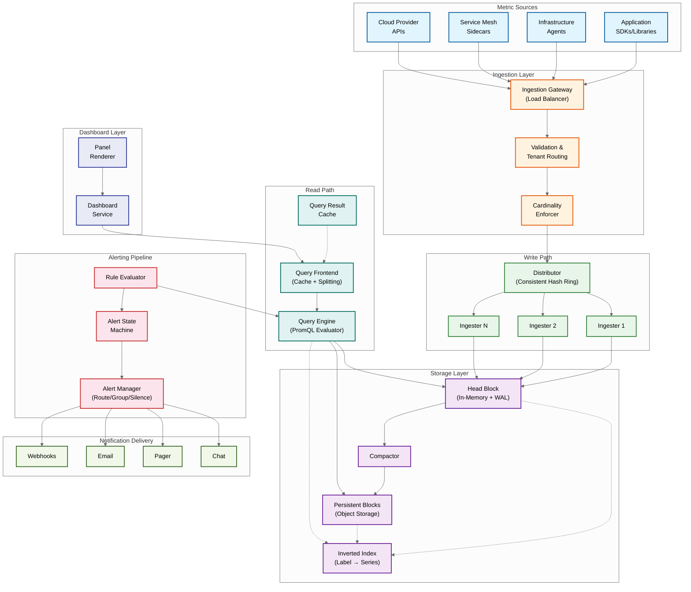
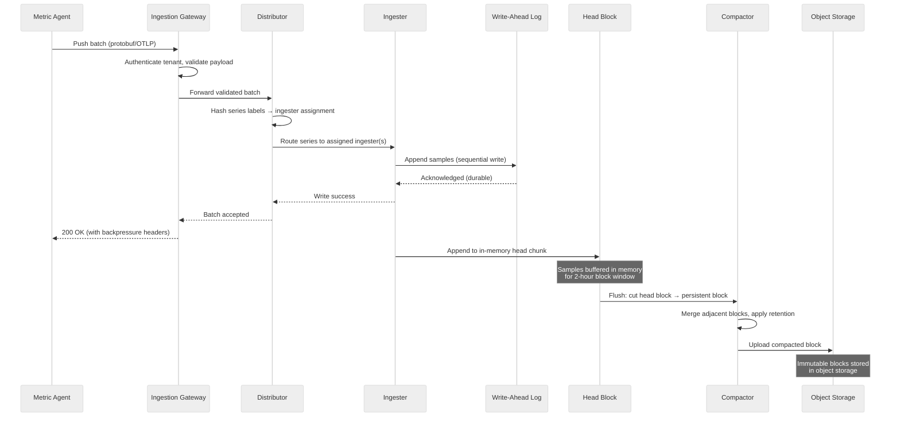
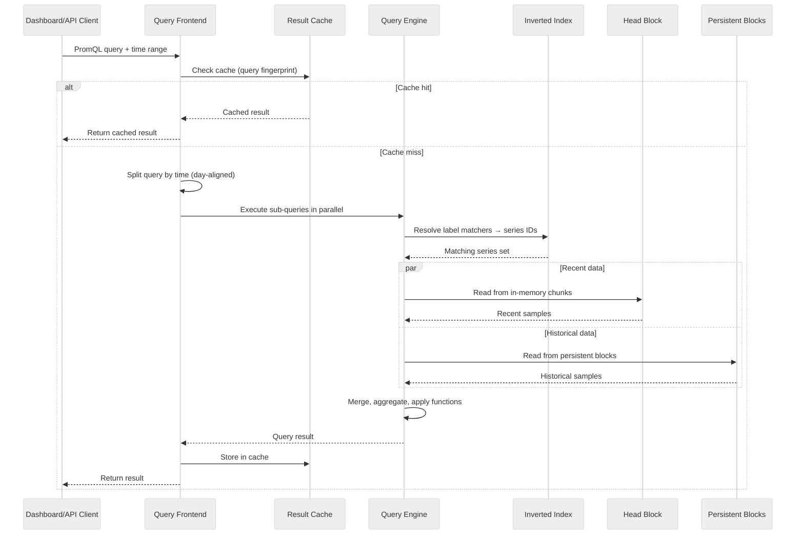
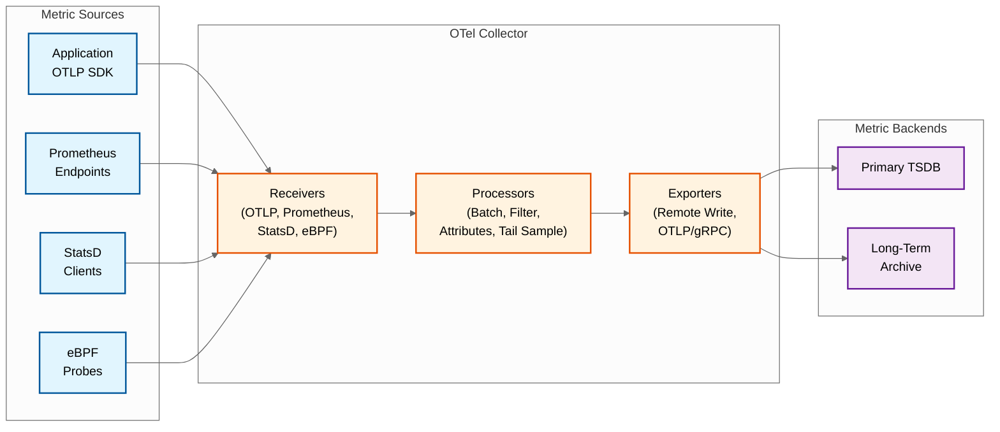

# High-Level Design --- Metrics & Monitoring System

## System Architecture



---

## Data Flow: Write Path

The write path is the most latency-critical and throughput-intensive flow in the system.



### Write Path Components

| Component | Responsibility | Scaling Strategy |
|---|---|---|
| **Ingestion Gateway** | TLS termination, authentication, payload validation, tenant identification, request routing | Stateless horizontal scaling behind load balancer |
| **Distributor** | Consistent hash ring routing: hashes each series' label set to determine which ingester(s) own it; enforces per-tenant rate limits and cardinality caps | Stateless; ring membership via gossip protocol or coordination service |
| **Ingester** | Accepts samples for assigned series; appends to WAL for durability; maintains in-memory head block with active chunks; periodically flushes head to persistent blocks | Stateful (owns series state); horizontal scaling by adding ring members and rebalancing; replication factor of 3 for durability |
| **WAL** | Sequential append-only log on local SSD; records every sample before in-memory acknowledgment; enables crash recovery by replaying WAL on restart | Per-ingester local storage; segment rotation and checkpointing to bound recovery time |
| **Head Block** | In-memory buffer for recent data (last 2 hours by default); each active series has an in-memory chunk that samples are appended to; supports efficient recent-data queries | Memory-bound; each series ~120 bytes overhead + chunk data |
| **Compactor** | Merges small blocks into larger ones (2h → 6h → 18h → 54h); removes tombstoned data; rewrites index for optimal query performance | CPU-intensive; can run as separate process or dedicated nodes; parallelizable across independent block ranges |

---

## Data Flow: Read Path (Query)



### Read Path Optimization Strategies

| Optimization | How It Works | Impact |
|---|---|---|
| **Query splitting** | Query frontend splits long time ranges into day-aligned sub-queries; each sub-query can be cached independently; results are merged | Enables partial cache hits: if 6 of 7 days are cached, only 1 day is computed |
| **Step alignment** | Queries are aligned to step boundaries so identical queries from different users produce identical cache keys | Dramatically improves cache hit rate for dashboards viewed by multiple users |
| **Inverted index** | Label matchers (e.g., `job="api", status=~"5.."`) are resolved to series IDs via posting list intersection; analogous to search engine query resolution | Reduces query from scanning all series to scanning only matching series; O(n) in matched series, not total series |
| **Chunk Cutting off unnecessary steps** | Each chunk/block has a min/max timestamp; chunks outside the query time range are skipped without decompression | Avoids decompressing irrelevant data; particularly effective for narrow time ranges |
| **Pre-aggregation (Recording Rules)** | Expensive queries are pre-computed on a schedule and stored as new time series | Dashboard queries read pre-aggregated series instead of computing from raw data; reduces query-time fanout from thousands of series to one |

---

## Data Flow: Alerting Pipeline

```mermaid
%%{init: {'theme': 'neutral'}}%%
flowchart LR
    subgraph Evaluation["Rule Evaluation"]
        RULES["Alert Rules<br/>(YAML Config)"]
        EVAL["Rule Evaluator<br/>(Periodic)"]
        TSDB["Query Engine"]
    end

    subgraph StateMachine["Alert State Machine"]
        INACTIVE["INACTIVE"]
        PENDING["PENDING<br/>(for duration)"]
        FIRING["FIRING"]
        RESOLVED["RESOLVED"]
    end

    subgraph AlertManager["Alert Manager"]
        ROUTE["Router<br/>(Label Matching)"]
        GROUP["Grouper<br/>(Reduce Noise)"]
        DEDUP["Deduplicator"]
        SILENCE["Silence<br/>Matcher"]
        INHIBIT["Inhibition<br/>Rules"]
        THROTTLE["Rate Limiter"]
    end

    subgraph Notify["Notification Channels"]
        N1["Webhook"]
        N2["Email"]
        N3["PagerDuty"]
        N4["Slack/Teams"]
    end

    RULES --> EVAL
    EVAL --> TSDB
    TSDB --> EVAL
    EVAL --> INACTIVE
    INACTIVE -->|"threshold breached"| PENDING
    PENDING -->|"duration elapsed"| FIRING
    PENDING -->|"recovered before duration"| INACTIVE
    FIRING -->|"condition cleared"| RESOLVED
    RESOLVED -->|"condition returns"| FIRING

    FIRING --> ROUTE
    RESOLVED --> ROUTE
    ROUTE --> GROUP --> DEDUP --> SILENCE --> INHIBIT --> THROTTLE
    THROTTLE --> N1 & N2 & N3 & N4

    classDef eval fill:#e8f5e9,stroke:#2e7d32,stroke-width:2px
    classDef state fill:#fff3e0,stroke:#e65100,stroke-width:2px
    classDef am fill:#e1f5fe,stroke:#01579b,stroke-width:2px
    classDef notify fill:#f3e5f5,stroke:#6a1b9a,stroke-width:2px

    class RULES,EVAL,TSDB eval
    class INACTIVE,PENDING,FIRING,RESOLVED state
    class ROUTE,GROUP,DEDUP,SILENCE,INHIBIT,THROTTLE am
    class N1,N2,N3,N4 notify
```



### Alert State Machine Semantics

| Transition | Condition | Purpose |
|---|---|---|
| INACTIVE → PENDING | Alert expression evaluates to true | Start the "for" duration timer; prevents alerting on momentary spikes |
| PENDING → FIRING | Expression remains true for the configured `for` duration | Confirmed alert; notifications are sent |
| PENDING → INACTIVE | Expression evaluates to false before `for` duration elapses | Transient spike; no notification sent (flap prevention) |
| FIRING → RESOLVED | Expression evaluates to false | Send resolution notification; allows auto-closing of incidents |
| RESOLVED → FIRING | Expression evaluates to true again | Re-fires the alert; respects grouping and deduplication |

### SLO-Based Alerting (Burn Rate)

Traditional threshold-based alerts ("alert if error rate > 5%") are fragile---they don't account for error budget or service reliability targets. Burn-rate alerting is the modern approach:

```
SLO-BASED ALERT CALCULATION:

  SLO: 99.9% availability (error budget: 0.1% = 43.2 minutes/month)

  Burn rate = (actual error rate) / (SLO-permitted error rate)

  Fast burn alert (page):
    IF burn_rate > 14.4x FOR 1 hour:
      → Budget exhausted in 2 days at this rate
      → Page on-call immediately

  Slow burn alert (ticket):
    IF burn_rate > 6x FOR 6 hours:
      → Budget exhausted in 5 days at this rate
      → Create ticket for next business day

  Example:
    SLO-permitted error rate: 0.1%
    Actual error rate: 1.44%
    Burn rate: 1.44 / 0.1 = 14.4x → FAST BURN → Page immediately

  PromQL implementation:
    # Fast burn: 14.4x in 1 hour
    (
      sum(rate(http_requests_total{status=~"5.."}[1h]))
      / sum(rate(http_requests_total[1h]))
    ) > (14.4 * 0.001)

    AND

    (
      sum(rate(http_requests_total{status=~"5.."}[5m]))
      / sum(rate(http_requests_total[5m]))
    ) > (14.4 * 0.001)
```

### Alert Manager Functions

| Function | Description | Example |
|---|---|---|
| **Routing** | Match alert labels to notification targets using a routing tree | `severity="critical" AND team="platform"` → PagerDuty on-call for platform team |
| **Grouping** | Combine related alerts into a single notification to reduce noise | Group all alerts with same `alertname` and `cluster` into one notification; wait 30s to collect group members |
| **Deduplication** | Prevent sending duplicate notifications for the same alert | If alert `HighErrorRate` for `service=auth` is already FIRING, don't re-notify until the group interval elapses |
| **Silencing** | Temporarily suppress notifications during maintenance | Silence all alerts matching `cluster="us-east-prod"` for 2 hours during planned maintenance |
| **Inhibition** | Suppress downstream alerts when a root-cause alert is firing | If `ClusterDown` is firing for `cluster=X`, suppress all `ServiceDown` alerts for services in `cluster=X` |
| **Rate Limiting** | Prevent notification storms during cascading failures | Max 10 notifications per channel per minute; excess queued with escalation |

---

## Key Architectural Decisions

### Decision 1: Pull vs. Push Ingestion Model

| | Pull Model (Prometheus-style) | Push Model (Datadog/OTLP-style) | **Recommendation** |
|---|---|---|---|
| **How it works** | Monitoring server scrapes HTTP endpoints exposed by targets at fixed intervals | Agents/SDKs push metric batches to the monitoring server | **Hybrid**: Pull for long-lived services (built-in health check, service discovery); Push for ephemeral workloads (batch jobs, serverless, short-lived containers) and cross-network sources |
| **Pros** | Natural service discovery; scrape failure = health signal; centralized scrape config; no agent-side buffering needed | Works across firewalls/NATs; supports ephemeral jobs; scales ingestion load to agents; no open ports on targets required | |
| **Cons** | Requires network reachability to targets; struggles with short-lived processes; scrape interval limits data resolution | No built-in health signal from push failure (could be intentional silence); requires agent-side buffering and retry logic; push storms possible | |

### Decision 2: Monolithic vs. Microservice TSDB Architecture

| | Monolithic TSDB (Prometheus-style) | Disaggregated TSDB (Mimir/Cortex-style) | **Recommendation** |
|---|---|---|---|
| **How it works** | Single process handles ingestion, storage, querying, and alerting; local disk storage | Separate components for distribution, ingestion, storage, compaction, and querying; object storage backend | **Disaggregated** for multi-tenant SaaS; **Monolithic** for single-tenant self-hosted; the disaggregated model enables independent scaling of write and read paths |
| **Pros** | Simple to deploy and operate; low latency (all local); no network overhead between components | Independent scaling per component; object storage for virtually unlimited retention; multi-tenant isolation; component-level fault isolation | |
| **Cons** | Single-node memory/disk limits cap series capacity (~20M series); no multi-tenancy; single point of failure | Operational complexity; network latency between components; requires coordination service (consul/etcd) for ring membership | |

### Decision 3: Local Disk vs. Object Storage for Long-Term Retention

| | Local Disk (SSD) | Object Storage | **Recommendation** |
|---|---|---|---|
| **Cost** | ~$0.10/GB/month (SSD) | ~$0.02/GB/month (standard tier) | **Object storage** for blocks older than 2 hours; local SSD only for WAL and head block |
| **Durability** | Dependent on disk redundancy (RAID, replication) | 99.999999999% (11 nines) built-in | Object storage provides superior durability at 5x lower cost |
| **Query latency** | Sub-millisecond random read | 10-100ms first-byte latency | Mitigated by aggressive caching of block index and hot chunks; acceptable for historical queries |
| **Scalability** | Limited by node count x disk size | Virtually unlimited | Object storage eliminates storage capacity planning |

### Decision 4: Fixed-Bucket vs. Native Histograms

| | Fixed-Bucket Histograms | Native (Exponential) Histograms | **Recommendation** |
|---|---|---|---|
| **How it works** | Client defines fixed bucket boundaries (e.g., 0.005s, 0.01s, ...); each bucket is a separate time series | Single time series with dynamically-adjusted exponential bucket boundaries; resolution configurable at query time | **Native histograms** for all new metrics; dual-emit for migration of existing histograms |
| **Pros** | Well-understood; native PromQL support; simple instrumentation | 95% cardinality reduction (1 series vs. 22); fully mergeable; dynamic boundaries adapt to data; better tail accuracy | |
| **Cons** | N+2 series per label combination (cardinality bomb); not aggregatable across instances; bucket choice is guesswork | Larger per-sample storage; new query functions required; migration complexity for existing dashboards | |

### Decision 5: Pre-Aggregation Strategy

| Approach | Description | When to Use |
|---|---|---|
| **Recording rules** | PromQL expressions evaluated on a schedule; results stored as new series | Known expensive dashboard queries; alert rule optimization; cross-service aggregations |
| **Ingestion-time rollup** | Agent pre-aggregates before sending (e.g., 1-second data aggregated to 15-second) | High-frequency sources where raw resolution is not needed; reduces ingestion volume |
| **Storage-time downsampling** | Compactor creates downsampled versions of blocks (5-min, 1-hour) | Long-term retention: full resolution for 15 days, 5-min for 90 days, 1-hour for 1 year |
| **Query-time aggregation** | Aggregation computed on-the-fly during query execution | Ad-hoc queries; exploration; no pre-computation overhead |

**Recommendation**: Layer all four. Recording rules for known hot queries, ingestion-time rollup for high-frequency sources, storage-time downsampling for retention tiers, and query-time aggregation as the fallback for everything else.

---

## OpenTelemetry Collector Architecture

The OpenTelemetry Collector serves as the universal ingestion gateway, replacing or complementing agent-specific protocols:



### Collector Pipeline Stages

| Stage | Purpose | Key Operations |
|---|---|---|
| **Receivers** | Accept metrics in various formats | OTLP (gRPC/HTTP), Prometheus scrape, StatsD UDP, host metrics (eBPF), JMX |
| **Processors** | Transform, filter, enrich, and batch | Batch (200ms window), attribute manipulation, metric filter (drop unwanted series), memory limiter, tail sampling for exemplars |
| **Exporters** | Send to one or more backends | OTLP export to TSDB, remote write to Prometheus-compatible backends, fan-out to multiple destinations |

### Collector Deployment Patterns

| Pattern | Description | When to Use |
|---|---|---|
| **Agent per node** | One collector per host/node, scrapes local targets, pushes to central TSDB | Standard deployment; provides local buffering and pre-aggregation |
| **Gateway** | Centralized collector cluster receiving from multiple agents | Cross-network ingestion; protocol translation; centralized filtering |
| **Sidecar** | One collector per pod/container | Fine-grained per-service control; higher resource overhead |
| **No-collector (direct)** | Application SDKs push directly to TSDB ingestion API | Minimal infrastructure; less flexibility for post-collection processing |

---

## Cross-Cutting Concerns

### Event-Driven Architecture

The monitoring system uses events for asynchronous coordination:

| Event | Producer | Consumer(s) | Purpose |
|---|---|---|---|
| `series.created` | Ingester | Cardinality tracker, Cost attribution | Track new series creation and update cardinality counters |
| `series.stale` | Ingester | Index cleaner, Compactor | Mark series that haven't received samples for staleness timeout |
| `block.flushed` | Ingester | Compactor, Block registry | Trigger compaction planning for new blocks |
| `block.compacted` | Compactor | Block registry, Query cache | Register new blocks; invalidate affected cache entries |
| `alert.state_change` | Alert evaluator | Alert manager, Audit log | Route state transitions for notification and recording |
| `tenant.quota_warning` | Distributor | Notification service, Admin UI | Alert when tenant approaches ingestion or cardinality limits |
| `retention.expired` | Retention enforcer | Block registry, Object storage | Trigger deletion of expired blocks |

### Multi-Tenancy Model

| Layer | Isolation Mechanism | Enforcement Point |
|---|---|---|
| **Ingestion** | Per-tenant rate limits, cardinality caps, API key scoping | Distributor |
| **Storage** | `__tenant_id__` label injected into all series; physical isolation for premium tenants | Ingester |
| **Query** | Tenant ID injected into every query; per-tenant concurrency and memory limits | Query frontend |
| **Alerting** | Per-tenant rule groups; notification routing scoped to tenant | Alert evaluator |
| **Cost** | Per-tenant series count tracking; cost attribution by label ownership | Cost attribution service |

---

## Architecture Pattern Checklist

- [x] **Sync vs Async**: Sync for ingestion acknowledgment (WAL durability); Async for compaction, downsampling, and notification delivery
- [x] **Event-driven vs Request-response**: Request-response for ingestion and queries; event-driven for alert state transitions and notification routing
- [x] **Push vs Pull**: Hybrid model with pull for long-lived services and push for ephemeral workloads
- [x] **Stateless vs Stateful**: Distributors and query frontends are stateless; Ingesters are stateful (own series in hash ring); Compactors are stateless (operate on object storage)
- [x] **Write-heavy optimization**: Append-only WAL, in-memory head block, batch writes, no updates/deletes
- [x] **Real-time vs Batch**: Real-time for ingestion and alerting; batch for compaction, downsampling, and recording rules
- [x] **Edge vs Origin**: Metric agents (edge) perform local pre-aggregation and buffering; TSDB cluster (origin) handles storage and querying
- [x] **OpenTelemetry Native**: OTLP as first-class ingestion protocol; collector-based pipeline for vendor-neutral metric routing
