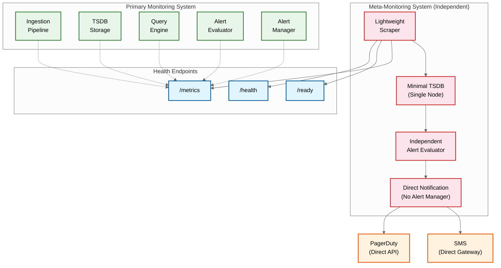

# Observability --- Metrics & Monitoring System

## The Meta-Monitoring Challenge

Monitoring a monitoring system creates a unique circular dependency: the system you use to detect failures is itself the system that can fail. If the TSDB's ingestion pipeline is overloaded, the metrics that would tell you about the overload are the very metrics being dropped. This section addresses how to break this circularity through architectural separation.

### Meta-Monitoring Architecture



### Meta-Monitoring Design Principles

1. **Complete independence**: Meta-monitoring system shares no infrastructure with the primary system---different nodes, different storage, different network path to notification channels
2. **Radical simplicity**: Single-node deployment (no distributed complexity); monitors only internal health metrics (no tenant data)
3. **Fixed cardinality**: Monitors a static, known set of ~100 internal health metrics; no dynamic label expansion; no cardinality risk
4. **Direct notification**: Bypasses the primary alert manager entirely; sends notifications directly to PagerDuty/SMS API; no dependency on primary system availability
5. **Minimal surface area**: No dashboard UI, no query API, no multi-tenancy; exists solely to detect primary system failures and page on-call engineers

---

## Metrics (USE/RED Method)

### Ingestion Pipeline Metrics

| Metric | Type | Labels | Alert Threshold | Description |
|---|---|---|---|---|
| `ingester_samples_received_total` | Counter | tenant_id, ingester_id | rate < 50% of expected | Total samples received per ingester |
| `ingester_samples_appended_total` | Counter | tenant_id | rate diverges from received by >5% | Samples successfully appended (received - rejected) |
| `ingester_active_series` | Gauge | tenant_id, ingester_id | >80% of per-ingester limit | Current active time series count |
| `distributor_received_requests_total` | Counter | tenant_id, status_code | 4xx rate > 5% or 5xx rate > 1% | Ingestion requests by response status |
| `ingester_wal_fsync_duration_seconds` | Histogram | ingester_id | p99 > 100ms | WAL flush latency (durability Slowest part of the process) |
| `ingester_head_chunks_created_total` | Counter | ingester_id | sudden spike = cardinality explosion | New chunk creation rate |
| `ingester_memory_series` | Gauge | ingester_id | >2M per ingester | Series held in memory per ingester |
| `distributor_inflight_push_requests` | Gauge | | >80% of max concurrency | Concurrent ingestion requests |

### Query Engine Metrics

| Metric | Type | Labels | Alert Threshold | Description |
|---|---|---|---|---|
| `query_requests_total` | Counter | tenant_id, status, priority | error rate > 1% | Total queries by status and priority |
| `query_duration_seconds` | Histogram | tenant_id, priority | p99 > 10s for alert queries | Query execution duration |
| `query_samples_scanned_total` | Counter | tenant_id | >100M per query | Samples scanned (efficiency indicator) |
| `query_series_matched_total` | Counter | tenant_id | >100K per query | Series matched by label selectors |
| `query_frontend_cache_hit_ratio` | Gauge | | <50% | Query result cache effectiveness |
| `query_queue_depth` | Gauge | priority | >100 for critical priority | Pending queries in execution queue |
| `query_active_queries` | Gauge | tenant_id, priority | >90% of concurrency limit | Currently executing queries |

### Alerting Pipeline Metrics

| Metric | Type | Labels | Alert Threshold | Description |
|---|---|---|---|---|
| `alert_rule_evaluation_duration_seconds` | Histogram | rule_group | p99 > 90% of eval interval | Time to evaluate all rules in a group |
| `alert_rule_evaluation_failures_total` | Counter | rule_group, reason | any failure | Failed rule evaluations (missed alerts risk) |
| `alert_notifications_sent_total` | Counter | channel, status | failure rate > 5% | Notification delivery status |
| `alert_notifications_queue_depth` | Gauge | channel | >100 | Pending notifications |
| `alertmanager_silences_active` | Gauge | tenant_id | unusual increase | Active silence count (security signal) |
| `alert_evaluation_lag_seconds` | Gauge | rule_group | >2x evaluation interval | Delay between scheduled and actual eval |

### Storage Metrics

| Metric | Type | Labels | Alert Threshold | Description |
|---|---|---|---|---|
| `compactor_blocks_pending` | Gauge | | >50 blocks | Blocks waiting for compaction |
| `compactor_compaction_duration_seconds` | Histogram | level | p99 > 30 min | Compaction execution time |
| `tsdb_blocks_total` | Gauge | level | >200 level-0 blocks | Total blocks by compaction level |
| `tsdb_storage_size_bytes` | Gauge | tenant_id | >90% of quota | Storage consumption per tenant |
| `object_storage_request_duration_seconds` | Histogram | operation | p99 > 500ms | Object storage latency |
| `tsdb_wal_size_bytes` | Gauge | ingester_id | >1 GB | WAL size (recovery time indicator) |

---

## Logging Strategy

### What to Log

| Component | Log Events | Level | Structured Fields |
|---|---|---|---|
| **Ingestion Gateway** | Authentication failure, rate limit hit, malformed payload | WARN/ERROR | tenant_id, source_ip, error_code, sample_count |
| **Distributor** | Ring rebalance, ingester health change, cardinality cap hit | INFO/WARN | tenant_id, ingester_id, series_count, action_taken |
| **Ingester** | WAL rotation, head block cut, OOM risk, series creation rate spike | INFO/WARN | ingester_id, wal_segment, series_count, memory_usage |
| **Query Engine** | Slow query (>5s), query timeout, query rejection, recording rule failure | WARN/ERROR | tenant_id, query_hash, duration, series_count, rejection_reason |
| **Compactor** | Compaction start/complete, block upload, retention deletion | INFO | block_id, level, series_count, duration, bytes |
| **Alert Evaluator** | Evaluation failure, state transition (PENDING→FIRING), evaluation lag | WARN/INFO | rule_id, tenant_id, alert_fingerprint, old_state, new_state |
| **Alert Manager** | Notification sent/failed, silence created/expired, inhibition applied | INFO/WARN | alert_fingerprint, channel, status, silence_id |

### Log Level Strategy

| Level | Usage | Examples |
|---|---|---|
| **ERROR** | Unrecoverable failures requiring operator attention | WAL corruption, ingester OOM, object storage auth failure |
| **WARN** | Degraded operation or approaching limits | Query timeout, cardinality cap approaching (>80%), compaction lag |
| **INFO** | Normal operational events | Block compaction completed, ring rebalance, configuration reload |
| **DEBUG** | Detailed operational data for troubleshooting | Individual query execution plan, sample-level ingestion details |

### Structured Log Format

```
{
  "timestamp": "2026-03-10T10:05:23.456Z",
  "level": "WARN",
  "component": "query_engine",
  "message": "Query exceeded duration threshold",
  "tenant_id": "acme-corp",
  "query_hash": "a1b2c3d4",
  "duration_ms": 8432,
  "series_matched": 45000,
  "samples_scanned": 12500000,
  "priority": "dashboard",
  "trace_id": "4bf92f3577b34da6"
}
```

---

## Distributed Tracing

### Key Spans to Instrument

For a monitoring system, tracing is primarily used to debug slow queries and ingestion issues:

| Operation | Span Name | Key Attributes | Purpose |
|---|---|---|---|
| Ingestion batch processing | `ingest.process_batch` | tenant_id, sample_count, series_count, new_series_count | Identify ingestion bottlenecks |
| Series lookup / creation | `ingest.series_lookup` | series_fingerprint, is_new, stripe_lock_wait_ms | Debug series creation contention |
| WAL append | `ingest.wal_append` | segment_id, bytes_written, fsync_duration_ms | Identify WAL I/O bottlenecks |
| Query parsing | `query.parse` | query_length, ast_depth | Debug parser performance |
| Series resolution | `query.resolve_series` | matchers, series_matched, index_lookup_ms | Identify index lookup bottlenecks |
| Chunk fetch | `query.fetch_chunks` | block_count, chunks_fetched, bytes_read, cache_hit | Debug storage read performance |
| Query evaluation | `query.evaluate` | step_count, result_size, aggregation_type | Profile query computation |
| Alert evaluation | `alert.evaluate_group` | group_name, rule_count, total_duration_ms | Debug alert evaluation lag |
| Notification delivery | `alert.notify` | channel, attempts, final_status, duration_ms | Debug notification failures |

### Trace Propagation

```
INGESTION TRACE:
  Agent → Gateway → Distributor → Ingester → WAL
  Trace context passed in HTTP headers (W3C Trace Context / B3 format)
  Each component adds its span to the trace

QUERY TRACE:
  Dashboard → Query Frontend → Query Engine → [Index + Chunks] → Response
  Fan-out to multiple ingesters/blocks creates child spans for each

ALERT TRACE:
  Evaluator → Query Engine → State Machine → Alert Manager → Notification Channel
  Full trace from rule evaluation to notification delivery
```

### Exemplar-Based Drill-Down Flow

```
USER WORKFLOW (metric → trace in one click):

  1. Engineer sees latency spike on dashboard panel
     → Dashboard renders exemplar annotations on the graph (small dots at data points)

  2. Engineer clicks exemplar dot
     → Dashboard extracts trace_id from exemplar: "4bf92f3577b34da6"

  3. Dashboard opens trace view with deep link:
     → /traces/4bf92f3577b34da6

  4. Trace view shows the specific request:
     → Service A (23ms) → Service B (450ms) → Database (420ms) ← root cause

TECHNICAL FLOW:
  Query: /api/v1/query_range?query=rate(http_request_duration_seconds_count[5m])
  Response includes exemplars:
    {
      "exemplars": [
        {
          "seriesLabels": {"method": "POST", "endpoint": "/api/checkout"},
          "exemplars": [
            {
              "labels": {"trace_id": "4bf92f3577b34da6"},
              "value": 0.48,
              "timestamp": 1709913600.123
            }
          ]
        }
      ]
    }
```

---

## Health Check Design

### Component Health Check Endpoints

Each component exposes three health endpoints with distinct semantics:

| Endpoint | Purpose | Response Time | Failure Meaning |
|---|---|---|---|
| `/health` | Liveness: is the process alive? | < 1ms (always fast) | Process is hung or crashed; restart it |
| `/ready` | Readiness: can this instance handle traffic? | < 10ms | Instance is starting up, draining, or overloaded; remove from load balancer but don't restart |
| `/metrics` | Prometheus metrics exposition | < 100ms | Metrics scraping failed; may indicate resource exhaustion |

### Readiness Checks by Component

| Component | Ready When | Not Ready When |
|---|---|---|
| **Ingester** | WAL replay complete; ring token registered; accepting writes | WAL replay in progress; or being drained for shutdown |
| **Distributor** | Ring state loaded; at least quorum ingesters available | Ring state unknown; or no ingesters in healthy state |
| **Query Engine** | Index loaded; block metadata cached; query execution possible | Index loading; or block scanner running initial scan |
| **Compactor** | Block scanner complete; compaction planner initialized | Initial block scan in progress |
| **Alert Evaluator** | Rule groups loaded; TSDB query connection verified | Rule loading; or TSDB unreachable |

---

## Alerting: Meta-Monitoring Alerts

These are the alerts that the **meta-monitoring system** evaluates. They monitor the primary monitoring system and must fire even when the primary system is degraded.

### Critical Alerts (Page-Worthy)

| Alert Name | Condition | Severity | Runbook |
|---|---|---|---|
| `MonitoringIngestionDown` | No samples received for >5 minutes | Critical | Check ingestion gateway health; verify agent connectivity; check distributor ring state |
| `MonitoringIngesterOOM` | Ingester memory >90% of limit | Critical | Check for cardinality explosion; identify top series growth; scale ingesters or enforce caps |
| `MonitoringAlertEvaluationStopped` | Alert evaluator has not completed an evaluation cycle in >3x eval interval | Critical | Check evaluator health; verify TSDB query availability; check for stuck queries |
| `MonitoringWALCorruption` | WAL checksum validation failures | Critical | Isolate affected ingester; replay from replicas; investigate disk health |
| `MonitoringObjectStorageUnreachable` | Object storage requests failing >50% for >5 minutes | Critical | Check cloud provider status; verify credentials; check network connectivity |

### Warning Alerts

| Alert Name | Condition | Severity | Runbook |
|---|---|---|---|
| `MonitoringCompactionLag` | Pending compaction blocks >50 for >30 min | Warning | Scale compactor; check for compaction failures; verify disk space |
| `MonitoringQueryLatencyHigh` | Query p99 >10s for >10 min | Warning | Check query concurrency; identify expensive queries; scale query nodes |
| `MonitoringCardinalityApproachingLimit` | Tenant at >80% of cardinality cap | Warning | Notify tenant; identify high-cardinality metrics; suggest label optimization |
| `MonitoringIngestionLag` | End-to-end ingestion delay >60s | Warning | Check distributor backpressure; verify ingester health; check WAL fsync latency |
| `MonitoringCacheHitRateLow` | Query cache hit rate <30% for >1 hour | Warning | Check cache size; verify cache invalidation logic; monitor for query pattern changes |
| `MonitoringReplicationLag` | Ingester replication lag >30s | Warning | Check network between ingesters; verify replication health; check for slow replicas |

---

## Dashboard Design for Operators

### Recommended Operator Dashboards

| Dashboard | Panels | Refresh Rate | Purpose |
|---|---|---|---|
| **Ingestion Health** | Samples/s (total, per-tenant), rejection rate, cardinality growth, WAL size, ingester memory | 15s | Real-time ingestion monitoring |
| **Query Performance** | Query latency (p50/p95/p99), query rate, cache hit ratio, active queries, queue depth | 15s | Query engine health |
| **Alert Pipeline** | Evaluation lag, rule count, active alerts, notification delivery rate, silence count | 30s | Alerting system health |
| **Storage Health** | Block count by level, compaction rate, object storage latency, storage per tenant | 60s | Storage subsystem health |
| **Tenant Overview** | Per-tenant series count, ingestion rate, query rate, cardinality trending, quota usage | 60s | Multi-tenant capacity management |
| **Meta-Monitoring** | Primary system component health, meta-alert status, notification channel health | 10s | Meta-monitoring system health |
| **Cardinality Analytics** | Top-N metrics by series count, cardinality growth rate, per-tenant breakdown, label value explosion detection | 60s | Proactive cardinality management |
| **Cost Attribution** | Per-tenant series count, per-team metric ownership, storage cost breakdown, query cost by tenant | 300s | Observability FinOps |

---

## SLI/SLO Tracking

### Service Level Indicators

| SLI | Measurement | Good Event Definition | SLO Target |
|---|---|---|---|
| **Ingestion availability** | % of 1-minute windows with successful ingestion | >99% of samples in the window accepted | 99.95% |
| **Ingestion freshness** | Time from metric emission to queryability | < 30 seconds end-to-end | p99 < 60 seconds |
| **Query success rate** | % of queries returning results | Query returns non-error response within timeout | 99.9% |
| **Query latency** | Time from query submission to result return | < 5 seconds for range queries across <10K series | p99 < 5 seconds |
| **Alert evaluation completeness** | % of scheduled evaluations that complete | Evaluation finishes within 90% of interval | 99.99% |
| **Alert notification latency** | Time from FIRING state to notification delivery | < 30 seconds | p99 < 60 seconds |
| **Data durability** | % of acknowledged samples queryable after 1 hour | Sample is retrievable from any replica | 99.999% |

### Error Budget Tracking

```
ERROR BUDGET CALCULATION:

  SLO: 99.95% ingestion availability
  Budget period: 30 days
  Total minutes: 30 x 24 x 60 = 43,200 minutes
  Allowed bad minutes: 43,200 x 0.0005 = 21.6 minutes

  Current month:
    Bad minutes so far: 8 minutes
    Budget remaining: 13.6 minutes (63% remaining)
    Budget burn rate: 0.37 minutes/day
    Projected month-end: 8 + (0.37 x 20 remaining days) = 15.4 minutes
    Status: ON TRACK (under 21.6 budget)

  BURN RATE ALERTS:
    Fast burn (critical): 14.4x burn rate for 1 hour
      → Would exhaust budget in 2 days; page immediately
    Slow burn (warning): 6x burn rate for 6 hours
      → Would exhaust budget in 5 days; notify team channel
    Very slow burn (info): 3x burn rate for 24 hours
      → Would exhaust budget in 10 days; add to weekly report
```

---

## Cardinality Observability

### Cardinality Dashboard Design

The cardinality dashboard is the most operationally critical dashboard in the monitoring system---more teams use it reactively (during cardinality incidents) than proactively, but proactive use prevents 90% of incidents:

| Panel | Metric | Alert | Purpose |
|---|---|---|---|
| **Total active series (gauge)** | `sum(ingester_active_series)` | >80% of cluster limit | Overall system cardinality health |
| **Series by tenant (top-10)** | `topk(10, sum by (tenant_id)(ingester_active_series))` | Any tenant >80% of quota | Identify tenants approaching limits |
| **Series creation rate** | `rate(ingester_head_chunks_created_total[5m])` | >5x normal rate | Detect cardinality explosions in progress |
| **Top metrics by cardinality** | Custom cardinality analysis query | Any metric >50K series | Identify individual metric problems |
| **Label value explosion** | `topk(10, count by (label_name)(series_with_label))` | Label >10K unique values | Detect unbounded labels before they cause OOM |
| **Stale series ratio** | `(total_indexed - active) / total_indexed` | Ratio > 50% | Indicates high churn; compaction may be behind |

### Anomaly Detection Models

| Model | Input | Detection | Use Case |
|---|---|---|---|
| **Series creation spike** | `rate(series_created_total[5m])` | Z-score > 3 over 24h baseline | Detect sudden cardinality explosions |
| **Ingestion rate drop** | `rate(samples_appended_total[5m])` | >30% drop from expected rate | Detect agent failures or network issues |
| **Query latency shift** | `histogram_quantile(0.99, query_duration_seconds)` | Mean shift detection (CUSUM) | Detect gradual query performance degradation |
| **Alert evaluation drift** | `alert_evaluation_lag_seconds` | Lag trend increasing over 1 hour | Detect query engine resource exhaustion |
| **Compression ratio degradation** | `bytes_stored / samples_stored` | >50% increase from baseline | Detect non-standard metric data patterns |

---

## OpenTelemetry Collector Observability

The OTel Collector itself emits metrics about its pipeline health:

| Metric | Type | Alert Threshold | Purpose |
|---|---|---|---|
| `otelcol_receiver_accepted_metric_points` | Counter | Sudden drop >50% | Collector is not receiving expected metric volume |
| `otelcol_receiver_refused_metric_points` | Counter | Rate >0 | Collector is rejecting data (usually backpressure) |
| `otelcol_processor_batch_timeout_trigger_send` | Counter | Rate increasing | Batch processor forced to send incomplete batches (throughput issue) |
| `otelcol_exporter_sent_metric_points` | Counter | Diverges from receiver rate | Data loss between receiver and exporter stages |
| `otelcol_exporter_send_failed_metric_points` | Counter | Rate >0 | Backend rejection or connectivity failure |
| `otelcol_processor_dropped_metric_points` | Counter | Rate >0 | Filter processor dropping data (may be intentional or misconfigured) |
| `otelcol_process_memory_rss` | Gauge | >80% of memory limit | OOM risk in collector; may need horizontal scaling or pipeline tuning |

---

## Runbook Index

Every meta-monitoring alert links to a runbook. Key runbook templates:

| Alert | Runbook Title | Key Steps |
|---|---|---|
| `MonitoringIngestionDown` | Ingestion Pipeline Recovery | Check gateway health → Verify distributor ring → Check ingester fleet → Verify agent connectivity |
| `MonitoringIngesterOOM` | Ingester Memory Emergency | Identify top cardinality growth → Enable emergency cardinality cap → Drain and restart affected ingester → Scale ingester pool |
| `MonitoringAlertEvaluationStopped` | Alert Evaluator Recovery | Check evaluator process health → Verify TSDB query availability → Check for stuck or expensive queries → Restart evaluator with shed non-critical rules |
| `MonitoringWALCorruption` | WAL Corruption Recovery | Isolate affected ingester → Check disk health → Replay data from replica ingesters → Restart with new WAL segment |
| `MonitoringCompactionLag` | Compaction Backlog Recovery | Check compactor CPU/memory → Identify large blocks causing slow compaction → Scale compactor pool → Prioritize recent blocks |
| `MonitoringCardinalityExplosion` | Cardinality Emergency | Identify offending metric/label via cardinality API → Apply emergency relabeling rule → Notify owning team → Post-incident: add label to allow-list |
