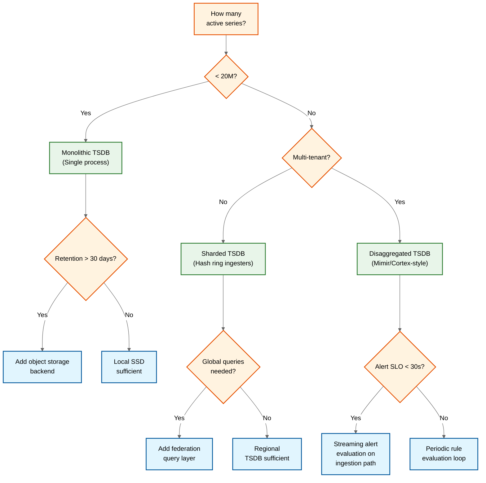

# Interview Guide --- Metrics & Monitoring System

## Interview Pacing (45-min Format)

| Time | Phase | Focus | What to Cover |
|---|---|---|---|
| 0-5 min | **Clarify** | Scope the problem | Ask about scale (how many services?), ingestion model (push/pull?), multi-tenancy, alerting requirements. Establish: "I'll design a system like Prometheus/Datadog that ingests, stores, queries, and alerts on time-series metrics." |
| 5-15 min | **High-Level** | Architecture & data flow | Draw the write path (agent → gateway → distributor → ingester → WAL → block storage), read path (query frontend → query engine → index + chunks), and alerting pipeline. Explain the dimensional data model. |
| 15-30 min | **Deep Dive** | TSDB internals & cardinality | Cover Gorilla compression (delta-of-delta + XOR), inverted index with posting lists, head block + compaction pipeline. Discuss cardinality explosion as the primary scaling risk. |
| 30-40 min | **Scale & Trade-offs** | Scaling, reliability, operational | Horizontal scaling via hash ring (ingesters), query federation, multi-region. Alert evaluation priority over dashboards. Meta-monitoring architecture. |
| 40-45 min | **Wrap Up** | Summary & follow-ups | Summarize key decisions. Mention DDSketch for distributed percentiles, PromQL query optimization, and the self-referential monitoring challenge. |

---

## Meta-Commentary: How to Approach This Problem

### What Makes This System Unique/Challenging

1. **Cardinality is the scaling axis, not data volume**: Most systems scale linearly with data. Metrics systems scale with the combinatorial explosion of label dimensions. This is the insight that separates strong candidates from average ones.

2. **The TSDB is a specialized database, not a generic one**: You must demonstrate understanding of why a purpose-built time-series database is necessary---Gorilla compression exploits data regularity, the inverted index enables label-based querying, and the append-only write model enables WAL-based durability. Generic databases (relational, document, or column stores) fail at this workload.

3. **The system monitors itself**: Explicitly address the meta-monitoring problem. How do you detect when your monitoring system is failing? This shows operational maturity.

4. **Alerting is a separate distributed system**: The alert pipeline (rule evaluation → state machine → notification routing → delivery) is as complex as many standalone system design problems.

### The OpenTelemetry Context (2025-2026)

Modern monitoring systems exist within the OpenTelemetry ecosystem. Strong candidates demonstrate awareness of:
- **OTLP as the standard wire format**: vendor-neutral protocol for metrics, traces, and logs
- **OTel Collector as the universal ingestion gateway**: receivers, processors, exporters pipeline
- **Exemplars as the metrics-traces bridge**: trace context attached to metric samples
- **Native/exponential histograms**: single-series distributions replacing fixed-bucket N+2 cardinality explosion
- **eBPF-based collection**: zero-instrumentation kernel-level metrics for universal infrastructure coverage

### Where to Spend Most Time

- **TSDB internals** (15 min): This is the core differentiator. Cover the write path (WAL → head block → compaction → blocks), compression (Gorilla encoding), and the inverted index (posting lists for label-based queries). Show you understand why these specific data structures are chosen.
- **Cardinality management** (5-7 min): Explain the cardinality problem, why it's dangerous (combinatorial explosion of labels), and how to mitigate it (caps, allow-listing, analysis tools). This demonstrates production awareness.
- **Alerting pipeline** (5-7 min): Cover the alert state machine (PENDING → FIRING → RESOLVED), notification routing (grouping, silencing, inhibition), and why alert evaluations must have higher priority than dashboard queries.

### What to NOT Over-Invest In

- Dashboard rendering / UI (1-2 sentences is enough)
- Specific PromQL syntax details (mention it exists, don't teach the language)
- Notification channel integrations (list them, don't design each one)
- Agent-side instrumentation (acknowledge it, but the interview is about the backend)

---

## Trade-offs Discussion

### Trade-off 1: Pull vs. Push Ingestion

| | Pull Model | Push Model | Recommendation |
|---|---|---|---|
| **Pros** | Natural service discovery; scrape failure = health signal; centralized control; no agent-side buffering | Works across firewalls; supports ephemeral jobs; scales ingestion load; works with serverless | **Hybrid**: Pull for long-lived services, Push for ephemeral workloads |
| **Cons** | Requires network reachability; can't handle short-lived processes; server bears scraping load | No built-in health signal; requires agent-side buffer; push storms possible | |

**Interview tip**: Don't just pick one. Explain why the answer is "both" and when you'd use each. This shows nuanced thinking.

### Trade-off 2: Fixed-Bucket Histograms vs. DDSketch

| | Fixed-Bucket Histograms | DDSketch | Recommendation |
|---|---|---|---|
| **Pros** | Simple; well-understood; PromQL `histogram_quantile` works directly; no additional infrastructure | Fully mergeable (accurate aggregation across instances); relative error guarantee; small memory footprint | **DDSketch** for production-grade percentile tracking; histograms for backward compatibility |
| **Cons** | Bucket boundaries must be chosen upfront; wrong boundaries = inaccurate percentiles; generates N+2 series per histogram (cardinality cost); **not aggregatable across instances** (fundamental limitation) | More complex implementation; requires custom query function; not natively supported in PromQL | |

**Interview tip**: The non-aggregatability of fixed-bucket histograms is a key insight. If you have 100 pod replicas each reporting a histogram, you cannot compute the global p99 by aggregating individual histograms. DDSketch solves this by being fully mergeable.

### Trade-off 3: Recording Rules vs. Query-Time Computation

| | Recording Rules (Pre-Aggregation) | Query-Time Computation | Recommendation |
|---|---|---|---|
| **Pros** | Fast dashboard loads; reduced query engine load; consistent results across dashboard viewers; enables alerting on complex expressions | No pre-computation overhead; always up-to-date; no storage for pre-computed series; simpler configuration | **Recording rules** for known dashboard queries and alert expressions; query-time for ad-hoc exploration |
| **Cons** | Delayed data (one evaluation interval behind); storage overhead for additional series; maintenance burden (rules must be updated when source metrics change) | Slow for complex queries across many series; inconsistent results if data changes between panel loads; higher query engine load | |

### Trade-off 4: Monolithic vs. Disaggregated TSDB

| | Monolithic (single process) | Disaggregated (microservices) | Recommendation |
|---|---|---|---|
| **Pros** | Simple deployment; low latency (all local); easy to reason about; good for single-tenant | Independent scaling per component; object storage for unlimited retention; multi-tenant isolation; component-level fault domains | **Monolithic** for <20M series single-tenant; **Disaggregated** for multi-tenant SaaS or >20M series |
| **Cons** | Single-node memory limits (~20M series); no multi-tenancy; SPOF | Operational complexity; network latency between components; coordination service dependency | |

### Trade-off 5: Downsampling Accuracy vs. Storage Cost

| | Full-Resolution Retention | Aggressive Downsampling | Recommendation |
|---|---|---|---|
| **Pros** | Perfect accuracy for all queries; no precision loss for retrospective analysis | 10-100x storage reduction for historical data; faster queries on downsampled data | **Tiered**: full-res for 15 days, 5-min for 90 days, 1-hr for 13 months |
| **Cons** | Linear storage growth; expensive at scale; historical queries slow (more data to scan) | Loss of fine-grained detail; spike detection degraded; can't reconstruct original data from downsampled | |

**Interview tip**: The tiered retention model is the standard answer. But mention that some use cases (capacity planning, compliance auditing) may require longer full-resolution retention, and the system should support per-tenant retention configuration.

---

## Trap Questions & How to Handle

### Trap 1: "Why not just use a relational database to store metrics?"

| What Interviewer Wants | Best Answer |
|---|---|
| Test understanding of why a purpose-built TSDB is needed | "A relational database works at small scale (<100K series), but fails at monitoring scale for three reasons: (1) **Compression**: Gorilla encoding achieves 12x compression by exploiting time-series data regularity; a B-tree index on timestamps provides no such compression. (2) **Write pattern**: Metrics are append-only, monotonically timestamped---a TSDB optimizes for sequential appends with WAL + head block, while an RDBMS optimizes for random CRUD operations with write amplification from indexes. (3) **Query pattern**: PromQL queries need label-based filtering + time-range aggregation across thousands of series; a relational schema would require either a JOIN storm or denormalization that defeats the purpose." |

### Trap 2: "What if a single user adds `user_id` as a label to a high-traffic metric?"

| What Interviewer Wants | Best Answer |
|---|---|
| Test awareness of cardinality explosion---the #1 production risk | "This is the cardinality bomb scenario. A metric with 5 labels, each with 10 values, has 100K series. Adding `user_id` with 10M values creates 10 billion series---more than any TSDB can handle. Defense in depth: (1) Per-metric cardinality limits reject new series beyond threshold (e.g., 50K per metric); (2) Label allow-listing at ingestion prevents unbounded labels; (3) Rate limiting on new series creation (max 1K/s per tenant); (4) Cardinality analysis dashboards show top-N metrics by series count, enabling proactive detection. The key insight is that cardinality must be treated as a **managed resource** with quotas and enforcement, not just a property of the data." |

### Trap 3: "How do you monitor the monitoring system?"

| What Interviewer Wants | Best Answer |
|---|---|
| Test awareness of the self-referential problem; operational maturity | "This is the meta-monitoring problem. If the primary TSDB is overloaded, the metrics about the overload are being dropped. Solution: a completely independent meta-monitoring system---separate infrastructure, separate minimal TSDB, separate alerting, direct notification to PagerDuty (bypassing the primary alert manager). It monitors only ~100 internal health metrics with fixed cardinality. It's radically simpler than the primary system because complexity is the enemy of the thing that watches everything else. The meta-monitoring system itself is so simple that it can be validated by a heartbeat check." |

### Trap 4: "Can you compute accurate p99 latency across a fleet of 1000 pods?"

| What Interviewer Wants | Best Answer |
|---|---|
| Test understanding of histogram aggregation limitations | "Not with standard fixed-bucket histograms. The p99 of individual histograms is NOT the global p99---percentiles are not aggregatable. Prometheus's `histogram_quantile()` on aggregated buckets is an approximation that can be wildly inaccurate depending on bucket boundary choice. The correct solution is **DDSketch**: a logarithmic bucketing algorithm that is fully mergeable. Each pod maintains a DDSketch locally; sketches are merged at query time with guaranteed relative error (e.g., 2%). This gives accurate global percentiles regardless of data distribution. DDSketch requires ~2 KB per sketch to cover the 1ms-1min range at 2% accuracy." |

### Trap 5: "Why does Prometheus use a pull model? Isn't push simpler?"

| What Interviewer Wants | Best Answer |
|---|---|
| Test depth of understanding of the pull/push trade-off | "Pull is not simpler---it's a different set of trade-offs. Pull provides: (1) **Natural health checking**---if a scrape fails, you know the target may be down, which is a signal you don't get with push; (2) **Centralized control**---the monitoring server decides what to collect and at what frequency; (3) **No agent-side buffering**---the server always gets the current state. But pull fails for short-lived processes (batch jobs that finish before the next scrape) and can't cross NAT/firewall boundaries. That's why Prometheus has Pushgateway, and why most production systems use both. The deeper insight is that the ingestion model should be per-source, not a system-wide choice." |

### Trap 6: "Your ingestion layer is down for 5 minutes. What happens?"

| What Interviewer Wants | Best Answer |
|---|---|
| Test understanding of durability, data loss, and agent behavior | "With well-designed agents: data is NOT lost. The agent buffers samples locally (in-memory or on-disk) during the outage and replays them when ingestion recovers. The critical design point is the agent's local buffer size and the max outage it can tolerate (typically 1-2 hours). After recovery, the TSDB receives out-of-order samples---the WAL handles this because samples are ordered within each series on append. During the outage: dashboards show stale data (last refresh before outage), alert evaluations run on stale data (may miss new conditions but won't false-fire on existing ones), and meta-monitoring detects the ingestion drop within 60 seconds and pages on-call." |

---

## Common Mistakes to Avoid

| Mistake | Why It's Wrong | Better Approach |
|---|---|---|
| **Using a relational database** | Doesn't scale for time-series workload; no compression; wrong write/query optimization | Purpose-built TSDB with Gorilla compression, WAL, inverted index |
| **Ignoring cardinality** | The #1 production failure mode; not mentioning it signals lack of operational experience | Explicitly discuss cardinality as a managed resource with caps and enforcement |
| **No meta-monitoring** | The interviewer will ask "what if your monitoring breaks?"---having no answer is a red flag | Describe independent meta-monitoring architecture |
| **Single alert manager** | Creates a SPOF for all alerting; a missed page is worse than a missed dashboard | Clustered alert manager with gossip-based state sharing |
| **Treating all queries equally** | Alert evaluations competing with dashboards during incidents is a recipe for missed alerts | Priority-based query scheduling with reserved capacity for alert evaluations |
| **Ignoring compression** | Saying "just store it in a database" without discussing storage efficiency shows lack of depth | Explain Gorilla compression: delta-of-delta for timestamps, XOR for values |
| **Over-designing the dashboard** | Spending 10 minutes on dashboard UI in a 45-minute interview wastes time on the least interesting part | Mention dashboards exist; spend time on TSDB internals and alerting |
| **Not discussing the `for` duration** | Alerting without a pending period = alert storms on every momentary spike | Explain PENDING state as flap prevention; configurable `for` duration |

---

## Questions to Ask the Interviewer

| Question | Why It Matters | How It Shapes the Design |
|---|---|---|
| "What's the expected scale---number of services and active time series?" | Determines monolithic vs. disaggregated architecture | <10M series: monolithic; >10M: disaggregated with hash ring |
| "Is this multi-tenant (SaaS) or single-tenant (internal)?" | Determines isolation requirements and operational complexity | Multi-tenant requires tenant isolation at every layer |
| "What's the ingestion model---are we scraping targets or receiving pushed metrics?" | Determines write path architecture | Pull needs service discovery + scraper; Push needs ingestion gateway + backpressure |
| "What retention period is required?" | Determines storage architecture and downsampling needs | 30 days: local disk may suffice; 1 year+: object storage + downsampling mandatory |
| "How critical is alerting latency---is 1-minute detection acceptable or do we need sub-10-second?" | Determines alert evaluation interval and priority architecture | 1 minute: standard evaluation loop; sub-10s: streaming evaluation on ingestion path |
| "Are there compliance requirements (SOC2, HIPAA, etc.)?" | Determines encryption, audit, and isolation requirements | HIPAA: dedicated tenant; SOC2: audit logging; all: encryption at rest |

---

## Advanced Discussion Topics

### Topic 1: Native Histograms and the Death of Fixed-Bucket Cardinality

**Context**: Fixed-bucket histograms generate N+2 series per label combination, making them the single largest source of cardinality explosion. Native/exponential histograms encode the entire distribution in one series.

**What to cover**: Explain why fixed-bucket histograms are fundamentally non-aggregatable (the p99 of aggregated buckets is NOT the global p99). Show that native histograms reduce cardinality by 95% per histogram metric. Discuss the migration path: dual-write period where both formats are emitted, query layer translates between formats, gradual deprecation of fixed-bucket emission. Mention that OTLP's ExponentialHistogram is the wire format for native histograms.

**Interview differentiator**: Most candidates will describe fixed-bucket histograms. Strong candidates explain why they're fundamentally flawed for distributed systems and propose native histograms as the replacement.

### Topic 2: eBPF-Based Zero-Instrumentation Collection

**Context**: Traditional metrics require explicit application instrumentation. eBPF enables kernel-level metric collection (network latency, TCP retransmits, DNS, I/O) without any code changes.

**What to cover**: Two-tier metric model: eBPF provides guaranteed infrastructure coverage, application instrumentation provides business context. The correlation challenge: connecting kernel-observed events (TCP retransmit) to application-level context (which request was affected). Process-level metadata enrichment via `/proc` filesystem.

**Interview differentiator**: Demonstrates awareness of the instrumentation coverage problem and modern solutions beyond "just add more metrics."

### Topic 3: Observability FinOps and Cost Attribution

**Context**: Monitoring costs can exceed the infrastructure being monitored. Cardinality is the dominant cost driver, and its growth is often unmanaged.

**What to cover**: Per-team cardinality budgets, cost attribution dashboards, automatic demotion of low-value metrics (zero queries in 30 days), tiered retention by metric importance. The tragedy-of-the-commons problem: the team that adds a label doesn't pay the cost. Design a cost feedback loop: metric creation → cost projection → team budget check → approve/reject.

### Topic 4: Exemplars and Cross-Signal Correlation

**Context**: Metrics tell you THAT something is wrong; traces tell you WHY. Exemplars bridge the gap by attaching trace IDs to metric samples.

**What to cover**: Exemplar storage architecture (short-lived, 15-minute retention, separate from main TSDB). Propagation from application SDK → metric pipeline → TSDB → dashboard click-to-trace. The interaction with native histograms (exemplars attach to specific bucket observations, enabling drill-down to the exact request that contributed to p99).

---

## Case Studies

### Case Study 1: The Kubernetes Metrics Tsunami

**Scenario**: A platform team migrates from VM-based deployment to Kubernetes. Before migration: 5,000 VMs emitting 1,000 series each = 5M total series. After migration: 50,000 pods (10x density from smaller containers), each emitting 800 series (slightly fewer per pod) + 200 Kubernetes infrastructure series per pod (kube-state-metrics) = 50M total series---a 10x increase that overwhelmed the existing monitoring stack.

**Key decisions**:
1. **Recording rules for common aggregations**: Pre-aggregate pod-level metrics to service-level, reducing query fanout from 50,000 pods to 500 services for dashboards
2. **Label allow-listing**: Block `pod_name` on high-cardinality metrics (pod names are ephemeral; use `deployment` instead)
3. **Tiered collection**: Not all pods need 15-second scrape intervals; batch jobs scrape every 60 seconds, development namespaces every 120 seconds
4. **Native histogram adoption**: Migrated request latency histograms from 20 fixed buckets to native histograms, reducing histogram cardinality by 95%

**Outcome**: Total series stabilized at 15M (3x original, not 10x) through aggressive label management and pre-aggregation.

### Case Study 2: Alert Fatigue Elimination at Scale

**Scenario**: A platform with 5,000 alert rules was generating 500+ notifications per day, leading to alert fatigue where on-call engineers ignored or delayed response. Mean-time-to-acknowledge (MTTA) degraded to 25 minutes.

**Root cause analysis**: 70% of alerts were either (1) flapping alerts with insufficient `for` duration, (2) duplicate alerts where the same condition was detected by multiple overlapping rules, or (3) symptom alerts firing alongside root-cause alerts (e.g., `HighLatency` AND `DatabaseSlow` both firing when the database was the cause).

**Architecture changes**:
1. **Mandatory `for` duration**: All alerts require minimum 5-minute `for` duration; eliminated 40% of flapping alerts
2. **Inhibition rules**: Root-cause alerts automatically suppress symptom alerts (if `DatabaseSlow` fires, suppress `HighLatency` for services depending on that database)
3. **Alert deduplication by service graph**: Alerts from pods in the same deployment are grouped; one notification per service, not per pod
4. **SLO-based alerting**: Replaced threshold-based alerts with burn-rate alerts (alert when error budget consumption rate predicts exhaustion within 4 hours)

**Outcome**: Notifications reduced from 500/day to 45/day; MTTA improved from 25 minutes to 3 minutes.

### Case Study 3: Multi-Region Federation for Global Observability

**Scenario**: A company with 4 regional clusters (US-East, US-West, EU, APAC) needed global dashboards showing cross-region service health. Initial approach: replicate all metrics to a central TSDB. Problem: 40M total series across regions; cross-region bandwidth for full replication: 500+ MB/s; central TSDB became a single point of failure for global observability.

**Architecture**:
1. **Write-local**: Each region runs an independent TSDB cluster. Metrics are ingested and stored regionally with no cross-region write traffic
2. **Read-global via federation**: A global query layer fans out queries to all 4 regional TSDBs and merges results. Regional query latency: 50-200ms; global federated query latency: 200-800ms (parallel fanout + merge)
3. **Recording rules for cross-region aggregates**: The 20 most common global dashboard queries are pre-computed as recording rules in each region, then federated results merge pre-aggregated data (much smaller than raw data)
4. **Regional alerting with global correlation**: Each region evaluates its own alerts. A global correlation engine detects when the same alert fires across multiple regions (indicating a shared dependency failure vs. regional issue)

**Outcome**: Zero cross-region write traffic; global dashboard load time: <2 seconds for pre-aggregated panels; global query cost: 4x regional (one round trip per region, parallelized).

---

## Estimation Practice

### Estimation 1: Ingester Memory Sizing

**Problem**: "How much memory does a single ingester need for 2M active series?"

**Calculation**:
```
Per-series overhead:
  - Series struct (fingerprint, labels ref, chunk ref): ~64 bytes
  - Head chunk (append buffer, 120 samples at 15s = 30 min buffer): ~300 bytes
  - Inverted index entries (~8 labels per series, ~16 bytes per posting): ~128 bytes
  - WAL tracking (segment offset, last timestamp): ~32 bytes
  Total: ~524 bytes per active series

2M series x 524 bytes = ~1.05 GB for series data
Symbol table (100K unique label names/values): ~50 MB
Posting lists overhead (roaring bitmaps): ~200 MB
WAL replay buffer: ~500 MB
Go runtime overhead (GC headroom, ~30%): ~540 MB

Total: ~2.34 GB → provision 4 GB RAM (headroom for GC pressure)
```

### Estimation 2: Object Storage Cost per Year

**Problem**: "What does it cost to retain 10M active series for 13 months with tiered downsampling?"

**Calculation**:
```
Full resolution (15 days):
  77 GB/day x 15 days = 1.15 TB

5-minute downsampling (90 days):
  77 GB/day / 20 (15s→5m ratio) x 90 = ~350 GB
  But store 4x (min, max, sum, count): ~1.4 TB

1-hour downsampling (260 days):
  77 GB/day / 240 (15s→1h ratio) x 260 = ~83 GB
  x 4 aggregations: ~332 GB

Total storage: 1.15 + 1.4 + 0.33 = ~2.9 TB
At $0.02/GB/month: 2,900 GB x $0.02 x 12 = ~$700/year for storage
API costs (reads): ~$200/year
Total: ~$900/year for 10M series with 13-month retention
```

### Estimation 3: Query Engine Sizing for Incident Load

**Problem**: "During a major incident, 200 engineers open dashboards simultaneously. Each dashboard has 10 panels, each panel queries 100 series over 1 hour at 15-second step. How many query nodes do we need?"

**Calculation**:
```
Concurrent queries: 200 engineers x 10 panels = 2,000 queries
  (Some deduplication: identical panels share query execution)
  Effective unique queries: ~500 (query deduplication ratio ~4x)

Per query cost:
  100 series x 240 steps (1h / 15s) = 24,000 sample reads
  + aggregation computation: ~2ms per query

Query concurrency per node: ~50 (CPU-bound on aggregation)
Nodes needed: 500 / 50 = 10 query nodes

But alert evaluations need 40% reserved capacity:
  Total nodes: 10 / 0.6 = ~17 query nodes for incident + alert workload
```

---

## Architecture Decision Flowchart



---

## Scoring Rubric (for Self-Assessment)

| Level | Characteristics |
|---|---|
| **Strong Hire** | Covers TSDB internals (compression, inverted index, WAL); identifies cardinality as primary risk; designs meta-monitoring; explains alert state machine with `for` duration; discusses pull/push trade-offs; mentions DDSketch for percentiles; discusses native histograms or eBPF |
| **Hire** | Solid write/read/alert paths; mentions cardinality; reasonable scaling approach; understands why RDBMS doesn't work; good trade-off discussions |
| **Borderline** | Gets high-level architecture right but lacks TSDB depth; doesn't discuss cardinality; hand-waves on alerting; generic scaling answers ("add more servers") |
| **No Hire** | Uses relational database; no awareness of cardinality; no alerting design; no meta-monitoring; single point of failure in design |

### Modern Features Row

| Feature | Expected Knowledge | Strong Hire Bonus |
|---|---|---|
| **Native histograms** | Aware that fixed-bucket histograms are problematic | Explains native histograms as the cardinality solution; discusses migration |
| **eBPF collection** | Mentions kernel-level metrics | Describes two-tier model and correlation challenge |
| **Exemplars** | Mentions metrics-to-traces linking | Explains exemplar storage architecture and click-to-trace UX |
| **OTLP/OpenTelemetry** | Mentions as a standard | Explains OTLP as the vendor-neutral wire format; discusses collector architecture |
| **Observability FinOps** | Mentions cost concerns | Designs per-team cardinality budgets and cost attribution |
