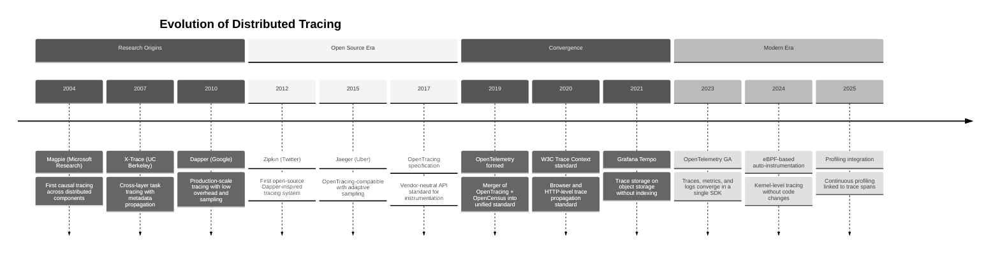

# 15.2 Design a Distributed Tracing System

## System Overview

A distributed tracing system captures, propagates, and stores the end-to-end journey of requests as they traverse dozens to thousands of microservices in a distributed architecture. Inspired by Google's Dapper paper (2010), modern tracing systems like Jaeger, Zipkin, and Grafana Tempo instrument every inter-process call—HTTP, gRPC, message queue consumption, database query—as a **span**, linking spans into a directed acyclic graph (a **trace**) via context propagation headers (W3C Trace Context, B3). The system must ingest millions of spans per second, assemble complete traces from out-of-order, cross-datacenter span arrivals, support intelligent sampling (head-based probabilistic, tail-based adaptive), store traces efficiently in columnar or wide-column backends for fast retrieval, and generate real-time service dependency maps that reveal the topology and health of the entire microservice mesh. The core engineering tension is that capturing every span at production scale would generate petabytes of data daily, yet the most diagnostically valuable traces—those exhibiting errors, high latency, or rare code paths—are by definition statistically rare, making the sampling strategy the single most consequential architectural decision: sample too aggressively and you miss the traces engineers need most; sample too conservatively and storage costs become prohibitive and query performance degrades.

---

## Key Characteristics

| Characteristic | Description |
|---|---|
| **Architecture Style** | Write-heavy, append-only pipeline: SDK instrumentation → agent/collector → optional stream processor → columnar/wide-column storage; read path is bursty and latency-tolerant (engineers query during debugging sessions, not in hot paths) |
| **Core Abstraction** | The *span*: a structured record capturing operation name, trace ID, span ID, parent span ID, start/end timestamps, tags (key-value metadata), logs (timestamped events), and status code—assembled into a trace DAG via parent-child relationships |
| **Context Propagation** | W3C Trace Context standard: `traceparent` header carries version, trace-id (128-bit), parent-id (64-bit), and trace-flags; `tracestate` header carries vendor-specific metadata; propagated across HTTP headers, gRPC metadata, message queue headers, and async job payloads |
| **Sampling Model** | Three tiers: (1) head-based probabilistic sampling at instrumentation point, (2) rate-limiting sampling per service/operation, (3) tail-based adaptive sampling at the collector layer that inspects complete traces for errors, latency outliers, or custom criteria before deciding to retain |
| **Storage Model** | Tiered: hot storage in wide-column store (Cassandra) or columnar format (Apache Parquet on object storage) for recent traces (7-14 days); warm/cold tiers on object storage for long-term retention; bloom filters and trace ID indices for fast lookup |
| **Query Patterns** | Trace-by-ID lookup (most common), search by service + operation + time range + tags, service dependency graph aggregation, latency histogram generation, error rate correlation |

---

## Related Patterns

| System | Relationship | Why It Matters |
|---|---|---|
| [Metrics & Monitoring System](../15.1-metrics-monitoring-system/00-index.md) | **Complementary pillar** | Traces provide exemplars that link metric anomalies to specific request journeys; metrics provide the aggregate signal that tells engineers *which* traces to investigate |
| [Log Aggregation System](../15.3-log-aggregation-system/00-index.md) | **Correlated pillar** | Trace IDs injected into log records enable jumping from a trace span to the exact log lines emitted during that span's execution |
| [eBPF Observability Platform](../15.4-ebpf-observability-platform/00-index.md) | **Instrumentation alternative** | eBPF-based tracing captures spans at the kernel level without SDK instrumentation, eliminating the context propagation integration tax for network-visible calls |
| [Error Tracking Platform](../15.8-error-tracking-platform/00-index.md) | **Error enrichment** | Traces provide the full request context surrounding an error; error tracking platforms link stack traces to the trace ID for multi-service debugging |
| [Chaos Engineering Platform](../15.5-chaos-engineering-platform/00-index.md) | **Validation consumer** | Chaos experiments use traces to verify that injected failures propagate correctly and that fallback paths are exercised as expected |
| [Change Data Capture System](../16.8-change-data-capture-system/00-index.md) | **Event correlation** | CDC events carry trace context to correlate database changes with the originating request, enabling end-to-end auditing |
| [Customer Data Platform](../12.15-customer-data-platform/00-index.md) | **Trace-driven analytics** | Trace data enriches user journey analytics by revealing backend latency and failure patterns invisible to frontend instrumentation |
| [Incident Management System](../15.6-incident-management-system/00-index.md) | **Incident workflow** | Trace links embedded in alerts accelerate incident triage; traces are the primary evidence artifact during postmortems |

---

## Historical Context and Evolution

| Era | Key Innovation | Impact |
|---|---|---|
| Dapper (2010) | Sampling + low-overhead instrumentation | Proved tracing was feasible at Google scale without impacting production |
| Zipkin/Jaeger (2012-2015) | Open-source implementations | Democratized distributed tracing beyond hyperscalers |
| OpenTelemetry (2019+) | Unified vendor-neutral SDK for traces, metrics, logs | Eliminated vendor lock-in; made auto-instrumentation the default |
| W3C Trace Context (2020) | Standardized propagation header format | Enabled cross-organization trace stitching |
| Columnar-native stores (2021+) | Parquet-on-object-storage backends (Tempo, ClickHouse) | Reduced trace storage costs by 10-50x; eliminated indexing overhead |
| eBPF instrumentation (2024+) | Kernel-level span capture | Zero-code instrumentation; captures spans for uninstrumented services |

---

## Key Terminology

| Term | Definition |
|---|---|
| **Span** | A single timed operation within a trace; the fundamental unit of tracing data |
| **Trace** | A directed acyclic graph (DAG) of causally related spans representing one end-to-end request |
| **Trace Context** | The set of identifiers (trace ID, span ID, flags) propagated across process boundaries to link spans into a trace |
| **Root Span** | The first span in a trace (no parent); typically created at the system entry point |
| **Baggage** | Key-value pairs propagated alongside trace context for business metadata (e.g., tenant ID, feature flags) |
| **Exemplar** | A trace ID attached to a metric data point, enabling drill-down from aggregate metrics to specific request traces |
| **Head Sampling** | Sampling decision made at trace creation time, before the request is processed |
| **Tail Sampling** | Sampling decision made after observing the complete trace, enabling retention of anomalous traces |
| **Span Kind** | Classification of a span's role: CLIENT, SERVER, PRODUCER, CONSUMER, or INTERNAL |
| **Instrumentation Library** | Code that creates spans for a specific framework (HTTP client, database driver, message queue) without application code changes |
| **Trace Flags** | Bit field in the trace context header; bit 0 indicates whether the trace is sampled |
| **Service Map** | A directed graph of service-to-service dependencies derived from parent-child span relationships |

---

## Quick Navigation

| Document | Focus |
|---|---|
| [01 — Requirements & Estimations](./01-requirements-and-estimations.md) | Functional requirements, capacity math, SLOs |
| [02 — High-Level Design](./02-high-level-design.md) | System architecture, data flow, key decisions |
| [03 — Low-Level Design](./03-low-level-design.md) | Span data model, API design, sampling algorithms |
| [04 — Deep Dives & Bottlenecks](./04-deep-dive-and-bottlenecks.md) | Trace assembly, tail-based sampling, clock skew |
| [05 — Scalability & Reliability](./05-scalability-and-reliability.md) | Scaling ingestion, storage tiering, fault tolerance |
| [06 — Security & Compliance](./06-security-and-compliance.md) | PII in traces, access control, data retention |
| [07 — Observability](./07-observability.md) | Meta-observability: tracing the tracing system |
| [08 — Interview Guide](./08-interview-guide.md) | 45-min pacing, trap questions, trade-offs |
| [09 — Insights](./09-insights.md) | 12 non-obvious architectural insights |

---

## Complexity Rating: **High**

| Dimension | Rating | Rationale |
|---|---|---|
| Data Volume | Very High | Millions of spans/sec at large organizations; petabyte-scale storage |
| Write Path | High | Append-only but requires batching, backpressure, and sampling decisions |
| Read Path | Medium | Bursty query traffic; trace assembly from sparse storage |
| Consistency | Medium | Eventual consistency acceptable; trace completeness is probabilistic |
| Operational | High | Must trace itself without circular dependency; sampling tuning is ongoing |

---

## What Differentiates Naive vs. Production

| Dimension | Naive Approach | Production Reality |
|---|---|---|
| **Instrumentation** | Manually add trace calls in every service handler; each team implements their own span format | SDK auto-instrumentation via OpenTelemetry: agents hook into HTTP clients, gRPC interceptors, database drivers, and message queue consumers transparently; zero-code instrumentation for common frameworks; consistent span schema enforced by the SDK |
| **Sampling** | Sample 1% of all traces uniformly; miss all error traces that fall in the 99% | Multi-tier sampling: head-based probabilistic for volume control, tail-based adaptive at the collector that retains 100% of error traces, latency outliers (>p99), and traces matching custom rules (specific user IDs, feature flags); dynamic rate adjustment per service based on traffic volume |
| **Context Propagation** | Pass trace ID in a custom header; breaks at every language/framework boundary | W3C Trace Context standard with fallback to B3 for legacy services; propagators registered in SDK handle HTTP, gRPC, message queue, and async job boundaries; baggage items carry business context (user ID, tenant ID) alongside trace context |
| **Storage** | Store every span as a JSON document in Elasticsearch; index everything | Columnar storage (Parquet on object storage) with bloom filters for trace ID lookup; dedicated attribute columns for high-cardinality tags; tiered retention: 7-day hot tier in wide-column store, 30-day warm tier in object storage, 90-day cold tier with reduced resolution |
| **Trace Assembly** | Assume all spans arrive in order; display as received | Async trace assembly: spans arrive out of order from different services and datacenters; collector buffers spans by trace ID with a configurable wait window (30-60 seconds), assembles the DAG, detects missing spans, adjusts for clock skew, and writes the complete trace |
| **Service Maps** | Manually maintain a service dependency diagram in a wiki | Real-time service dependency graph generated from span parent-child relationships: aggregate caller → callee edges with request rate, error rate, and latency percentiles; detect new dependencies automatically; alert on unexpected service-to-service communication patterns |
| **Scale** | Single collector instance; falls over at 10K spans/sec | Horizontally scaled collector fleet behind a load balancer with consistent hashing by trace ID; backpressure-aware ingestion with adaptive rate limiting; independent scaling of ingestion, storage, and query tiers |
| **Multi-Tenancy** | Single tenant; all traces visible to all users | Per-tenant isolation: separate ingestion quotas, storage partitions, retention policies, and access controls; shared infrastructure with logical isolation |
| **Observability** | No monitoring of the tracing system itself | Meta-observability strategy: metrics with exemplars (not self-tracing); canary traces for end-to-end validation; separate lightweight monitoring path that has no dependency on the main pipeline |
| **Cost Management** | Store everything; hope the budget holds | Dynamic sampling adjustment based on cost targets; per-service cost attribution; storage tiering with automatic compaction; columnar encoding for 10-20x compression on warm/cold tiers |

---

## What Makes This System Unique

### The Sampling Paradox: You Must Decide What to Keep Before You Know What Matters

The fundamental tension in distributed tracing is that head-based sampling (deciding at request initiation whether to trace) is cheap but uninformed—you cannot know at the start of a request whether it will result in an error, high latency, or an interesting code path. Tail-based sampling (deciding after observing the complete trace) has perfect information but requires buffering all spans until the trace completes, which at scale means buffering millions of spans in memory across a distributed collector fleet. This creates a paradox: the most valuable traces are those exhibiting anomalous behavior, but anomalous behavior is by definition rare and unpredictable, so any fixed-probability head sampling will systematically undersample the traces engineers actually need. Production systems resolve this through a hybrid approach: high-rate head sampling for baseline coverage combined with tail-based sampling that inspects completed traces for error status codes, latency exceeding dynamic thresholds, or custom criteria—but this requires the collector to maintain per-trace state across a distributed fleet, introducing its own consistency and scaling challenges.

### Context Propagation Is the Hidden Integration Tax of Microservices

While the storage and query components of a tracing system are complex engineering problems, the hardest operational challenge is ensuring unbroken context propagation across every service boundary in the organization. A single service that fails to propagate trace context—because it uses a custom HTTP client, an unsupported message queue, or an async processing framework that doesn't preserve thread-local context—creates a "broken trace" that fragments the request journey into disconnected segments. At organizations with hundreds of services in multiple languages, achieving 100% propagation coverage is a multi-year organizational effort, not just a technical one. The adoption of OpenTelemetry as a vendor-neutral standard and the W3C Trace Context specification as the propagation format has significantly reduced this friction, but edge cases remain: batch processors that aggregate multiple requests, fan-out patterns where one request spawns many, and cross-organization boundaries where trace context must traverse trust domains.
