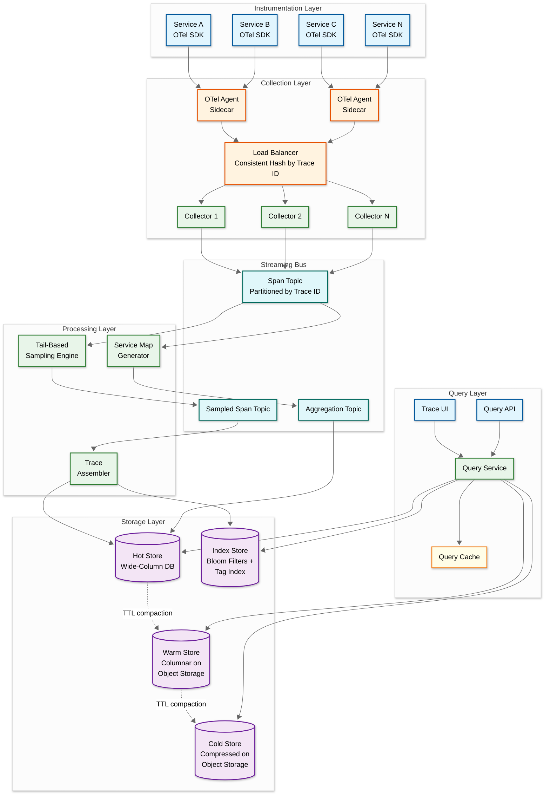
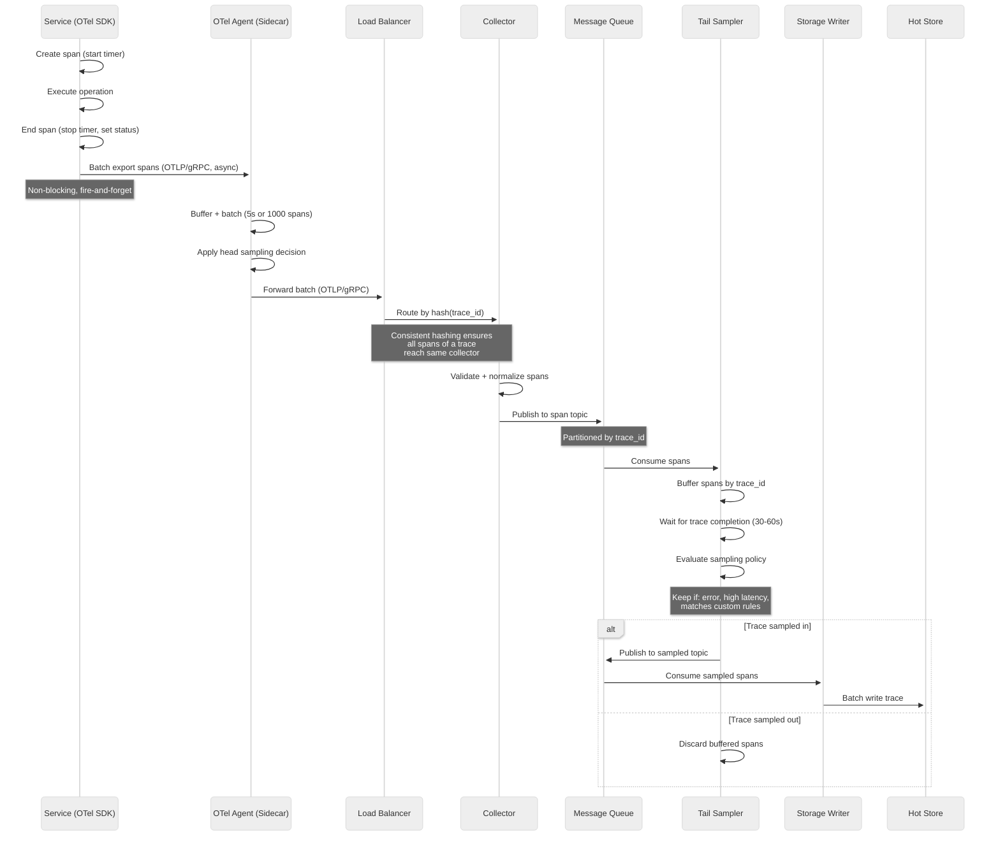
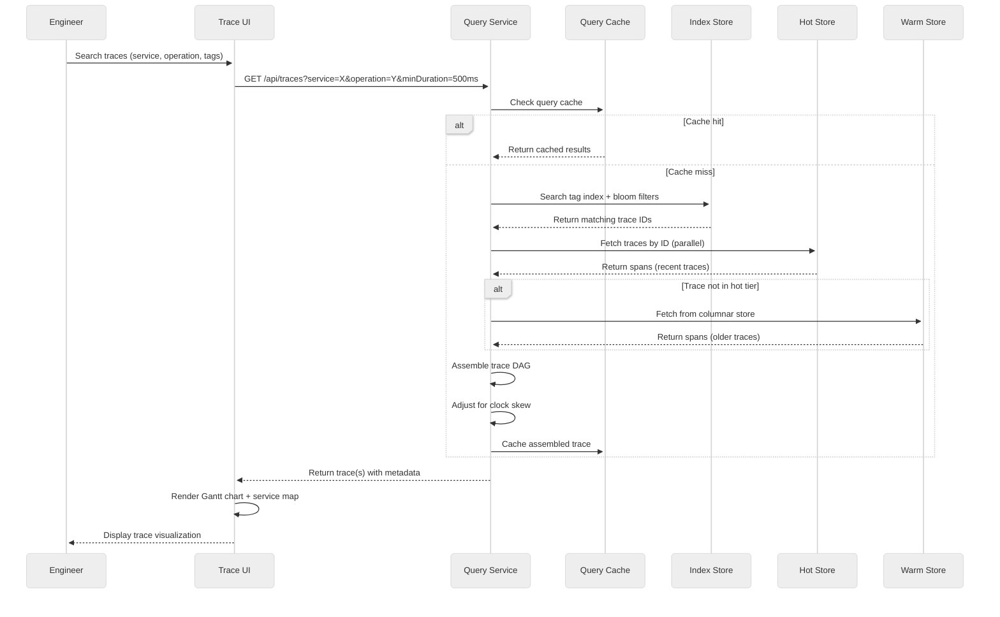
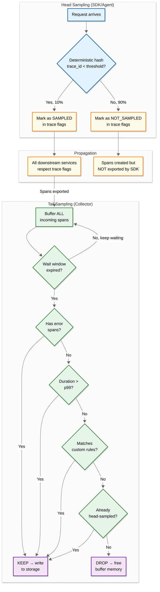
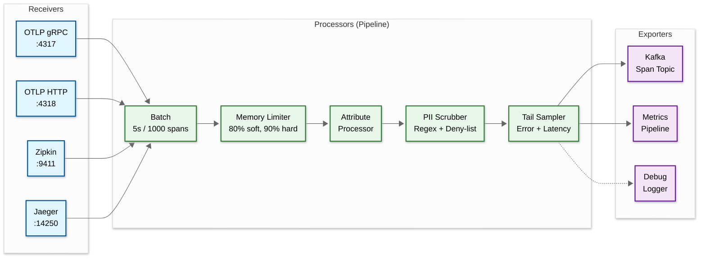

# 02 — High-Level Design

## System Architecture

---

## Data Flow: Write Path (Span Ingestion)

---

## Data Flow: Read Path (Trace Query)

---

## Key Architectural Decisions

### 1. Communication Model

| Decision | Choice | Justification |
|---|---|---|
| SDK → Agent | Async, fire-and-forget (OTLP/gRPC) | Tracing must never slow down the instrumented service; SDK batches spans in memory and flushes asynchronously; if the agent is unavailable, spans are dropped silently |
| Agent → Collector | Async batch (gRPC streaming) | Agents buffer and batch spans to amortize network overhead; gRPC streaming allows backpressure signaling without blocking the agent |
| Collector → Storage | Via message queue (async) | Decouples ingestion rate from storage write rate; allows tail-based sampling as an intermediate processing step; enables replay and reprocessing |

### 2. Architecture Pattern: Event-Driven Pipeline

The system uses an **event-driven, pipeline architecture** rather than a request-response model:

- **Why not request-response**: Span ingestion is a unidirectional data flow (write-only from the application's perspective); the application never reads back its own spans in the hot path
- **Why not synchronous writes**: Storage write latency would propagate back to application services; a 50ms storage hiccup would add 50ms to every instrumented request
- **Why event-driven**: Message queue between collection and storage provides buffering, backpressure, replay capability, and a natural insertion point for tail-based sampling

### 3. Database Choices

| Component | Technology Class | Rationale |
|---|---|---|
| **Hot Store** | Wide-column (e.g., Cassandra, ScyllaDB) | High write throughput; trace ID as partition key gives O(1) lookup; TTL-based automatic expiration; linear horizontal scaling |
| **Warm/Cold Store** | Columnar on Object Storage (e.g., Parquet files) | 10-100x cheaper than wide-column; columnar format enables efficient tag-based queries without full scan; object storage provides durability and near-infinite capacity |
| **Index Store** | Inverted index + bloom filters | Bloom filters: O(1) check for "does trace ID exist in this block?"; inverted index on (service, operation, tag) for search queries; small footprint relative to span data |
| **Query Cache** | In-memory cache (e.g., Redis) | Cache assembled traces for repeated access during debugging sessions; TTL of 5-10 minutes; reduces hot store read amplification |
| **Message Queue** | Distributed log (e.g., Kafka) | Partitioned by trace ID for locality; high throughput; replay capability for reprocessing; decouples producers from consumers |

### 4. Sampling Strategy: Hybrid Head + Tail

| Sampling Tier | Where | Decision Point | Trade-off |
|---|---|---|---|
| **Head-based probabilistic** | SDK / Agent | At span creation | Low overhead, uninformed (doesn't know if trace will be interesting) |
| **Rate-limiting** | Agent | Per service/operation | Prevents high-volume services from dominating storage budget |
| **Tail-based adaptive** | Collector / Stream processor | After trace completion | Informed (sees full trace), but requires buffering all spans until trace completes |

**Hybrid approach**: Head sampling reduces volume by 90% (keeping storage manageable), then tail-based sampling at the collector ensures 100% retention of error traces, latency outliers, and traces matching custom business rules.

### 5. Consistent Hashing for Trace Affinity

All spans belonging to the same trace must be routed to the same collector instance for tail-based sampling to work. The load balancer uses **consistent hashing on trace ID**:

- Ensures all spans of a trace arrive at the same collector
- Enables the collector to maintain an in-memory buffer of partial traces
- Hash ring handles collector additions/removals with minimal trace fragmentation
- Trade-off: temporary trace incompleteness during collector scaling events (mitigated by the assembly buffer's wait window)

---

## Case Studies

### Case Study 1: Ride-Sharing Platform (Uber-Scale)

**Scale**: 4,000+ microservices, 60,000+ service instances, 500K requests/sec

**Architectural Decisions**:
- Built Jaeger as an open-source Dapper-inspired system; migrated from Zipkin to gain adaptive sampling and ScyllaDB storage
- Head sampling at 0.1% (1 in 1,000) for volume services, 100% for critical payment flows
- Tail-based sampling for all error traces and traces exceeding p99 latency
- ScyllaDB as hot store (low-latency C++ implementation; handles 2M writes/sec)
- Custom span indexing with dedicated "tag columns" for the most queried attributes

**Key Lesson**: At extreme scale, the **collector fleet becomes the Slowest part of the process**, not storage. Uber had to shard the collector fleet by service group (not just trace ID) to prevent a single high-traffic service from starving collectors handling lower-traffic services.

### Case Study 2: Observability SaaS (Grafana Tempo Architecture)

**Scale**: Multi-tenant; millions of traces/sec across thousands of tenants

**Architectural Decisions**:
- **No external indexing**: Unlike Jaeger (which requires Elasticsearch or Cassandra for indices), Tempo stores traces as Parquet files directly on object storage with only a bloom filter for trace ID lookup
- **Tag-based search via columnar scans**: Instead of maintaining a tag index, search queries scan Parquet column statistics and use predicate pushdown; 10x cheaper than maintaining an inverted index at scale
- **Ingestion via distributor → ingester → compactor → object storage**: Ingesters buffer spans in memory and flush to object storage; compactors merge small blocks into large blocks for query efficiency
- **Vanguard frontend**: Automatic trace-to-metric conversion; discover traces from metric exemplars rather than trace search

**Key Lesson**: At sufficient scale, **eliminating the index entirely** (and accepting slightly slower search queries) can reduce total cost of ownership by 10x. The insight is that trace-by-ID lookup (the most common query) only needs a bloom filter, not a full index.

### Case Study 3: E-Commerce Platform (Shopify-Scale)

**Scale**: 1,500 services, 300K requests/sec, seasonal 10x traffic spikes (Black Friday)

**Architectural Decisions**:
- OpenTelemetry SDK with auto-instrumentation for Ruby, Go, and JavaScript services
- Adaptive head sampling: 10% during normal traffic, 1% during peak (Black Friday), with tail-based error retention at all times
- Pre-provisioned hot store capacity for 10x peaks; auto-scaling collectors and samplers
- Trace-based alerting: automated alerts when a specific checkout path exceeds p99 latency by 2x
- Dedicated "golden trace" pipeline: 100% sampling on a curated set of critical user journeys (checkout, payment, returns)

**Key Lesson**: **Seasonal traffic patterns** require dynamic sampling configuration that adjusts automatically based on traffic volume. A fixed 10% sampling rate during Black Friday would generate 10x the normal storage, while reducing to 1% might miss critical error traces. The solution is a PID controller that adjusts sampling rate based on a target storage ingestion rate.

### Case Study 4: Financial Services (Low-Latency Trading)

**Scale**: 200 services, 50K requests/sec, ultra-low-latency requirement (<1ms tracing overhead)

**Architectural Decisions**:
- In-process span buffering with no network hop to sidecar agent (eliminates agent-to-collector latency)
- Lock-free ring buffer for span collection; no memory allocation during span creation
- 100% sampling (all traces retained for regulatory compliance and audit trails)
- Dedicated hardware for trace storage; no shared tenancy
- Compliance requirement: traces must be retained for 7 years; archived to cold storage with immutable write-once-read-many (WORM) semantics

**Key Lesson**: In latency-sensitive environments, the **instrumentation overhead is the primary design constraint**, not storage cost. Using lock-free ring buffers and avoiding memory allocation during span creation reduces tracing overhead from ~5ms (standard SDK) to <100μs. The trade-off is a custom SDK that cannot use standard OpenTelemetry libraries.

---

## Sampling Decision Architecture

**Sampling latency budget**:

| Stage | Latency Added | Notes |
|---|---|---|
| SDK span creation | <1μs | In-process; no I/O |
| SDK batch flush | 0μs to app (async) | Background thread flushes every 5s or 1,000 spans |
| Agent → Collector | ~1-5ms (network) | Async; does not block application |
| Tail sampling buffer | 30-60s (wall clock) | Trace not searchable until decision made |
| Storage write | ~50-200ms | Async; does not affect trace availability timeline |
| **Total overhead on application** | **<5μs per span** | Fire-and-forget; all latency is in the background pipeline |

---

## Architecture Pattern Checklist

- [x] **Sync vs Async**: Async throughout the write path; sync only for query API
- [x] **Event-driven vs Request-response**: Event-driven pipeline for ingestion; request-response for queries
- [x] **Push vs Pull**: Push from SDKs → agents → collectors; pull from storage for queries
- [x] **Stateless vs Stateful**: Collectors are stateful during tail-sampling (buffer partial traces); query services are stateless
- [x] **Write-heavy vs Read-heavy**: Write-heavy (millions of spans/sec ingested; hundreds of queries/sec)
- [x] **Real-time vs Batch**: Real-time ingestion pipeline; batch compaction for warm/cold tiers
- [x] **Edge vs Origin**: Agents run as sidecars at the edge (on every host); collectors and storage are centralized

---

## Component Responsibilities

| Component | Responsibility | Scaling Unit |
|---|---|---|
| **OTel SDK** | Instrument code, create spans, propagate context, batch export | Per-service (embedded library) |
| **OTel Agent** | Receive spans from local services, apply head sampling, forward to collectors | Per-host (sidecar) |
| **Load Balancer** | Route span batches to collectors using consistent hashing by trace ID | Shared infrastructure |
| **Collector** | Validate, normalize, and buffer spans; publish to message queue | Horizontal: scale with ingestion rate |
| **Message Queue** | Decouple ingestion from processing; partition by trace ID | Horizontal: add partitions |
| **Tail Sampler** | Buffer complete traces, apply sampling policies, emit retained traces | Horizontal: partition by trace ID range |
| **Trace Assembler** | Build trace DAG from spans, detect missing spans, write to storage | Horizontal: scale with sampled throughput |
| **Service Map Generator** | Aggregate span relationships into service dependency graph | Single logical instance with sharded aggregation |
| **Hot Store** | Low-latency trace storage for recent data (7 days) | Horizontal: shard by trace ID |
| **Warm/Cold Store** | Cost-efficient long-term storage in columnar format | Object storage: virtually unlimited |
| **Index Store** | Bloom filters + tag indices for trace discovery | Scale with unique tag cardinality |
| **Query Service** | Serve trace lookups, search queries, and service map queries | Horizontal: scale with query QPS |
| **Query Cache** | Cache assembled traces and search results | Scale with active debugging sessions |
| **Trace UI** | Visualize traces as Gantt charts, render service maps | Static frontend; CDN-served |

---

## ADR: Storage Tier Architecture

### Context

The system ingests 26 TB/day of trace data and must support both fast trace-by-ID lookups (p99 < 3s) and cost-efficient long-term retention (90 days). No single storage technology optimizes for both access patterns.

### Decision

Use a three-tier storage architecture: hot (wide-column, 3-7 days), warm (columnar Parquet on object storage, 7-30 days), cold (compressed Parquet on object storage archive, 30-90 days).

### Alternatives Considered

| Alternative | Why Rejected |
|---|---|
| **Single wide-column store for all tiers** | Cost-prohibitive at 90 days retention (780 TB on provisioned storage); wide-column stores charge per node, not per GB |
| **Single Parquet-on-object-storage for all tiers** | Query latency too high for hot tier (100-200ms for object storage reads vs. <10ms for wide-column point lookups); engineers need fast trace retrieval during incidents |
| **Tempo-style (Parquet only, no hot tier)** | Viable for cost-optimized deployments; trade-off is 100-200ms p50 for trace-by-ID instead of <10ms; acceptable if incidents are infrequent and engineers tolerate slightly slower lookups |
| **Elasticsearch for all tiers** | Index overhead makes storage 3-5x more expensive per GB; Elasticsearch excels at full-text search but is over-indexed for trace data where 90% of queries are trace-by-ID lookups |

### Consequences

- **Positive**: Hot tier delivers fast lookups; warm/cold tiers provide 15-20x compression; total cost is 5-10x lower than single-tier wide-column
- **Negative**: Compaction pipeline adds operational complexity; brief query gap during tier migration; must maintain indices across all tiers
- **Migration path**: If cost pressure increases, migrate hot tier from wide-column to Parquet-on-object-storage with local SSD cache (Tempo-style); this is a continuous optimization, not a breaking change

---

## OpenTelemetry Collector Pipeline Architecture

The OpenTelemetry Collector is the central processing unit of the ingestion pipeline. Its internal architecture is a series of configurable pipeline stages:

| Pipeline Stage | Purpose | Configuration |
|---|---|---|
| **Receivers** | Accept spans in multiple formats (OTLP, Zipkin, Jaeger) for backwards compatibility | Multi-protocol; bind to separate ports |
| **Batch Processor** | Aggregate spans into batches to amortize export overhead | 5-second window or 1,000 spans, whichever first |
| **Memory Limiter** | Prevent OOM by refusing spans when memory exceeds threshold | Soft limit (80%): slow down ingestion; hard limit (90%): drop spans |
| **Attribute Processor** | Add, remove, or rename span attributes for normalization | Add `deployment.environment`; rename legacy tag names to semantic conventions |
| **PII Scrubber** | Detect and redact PII in span tags and events | Regex patterns for email, SSN, credit card; deny-list for sensitive headers |
| **Tail Sampler** | Make informed sampling decisions on complete traces | Buffer traces; retain errors, latency outliers, custom rules |
| **Exporters** | Send processed spans to downstream systems | Primary: message queue; secondary: metrics pipeline (for span-derived metrics) |
