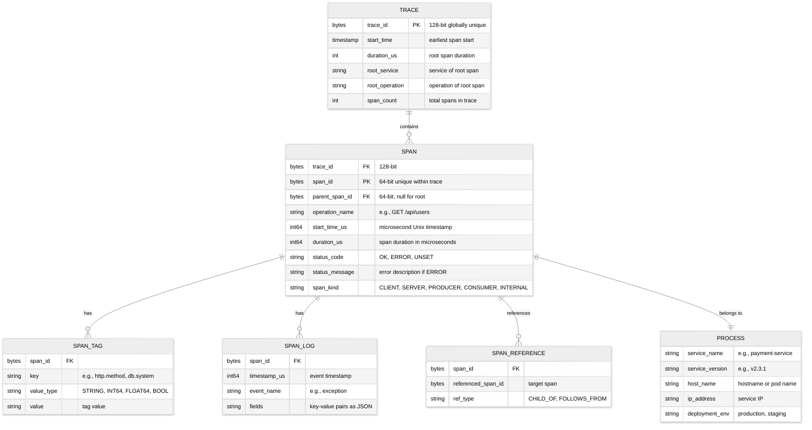

# 03 — Low-Level Design

## Span Data Model

### Core Span Schema



### Span Wire Format (OTLP Protobuf)

```
SpanRecord:
    trace_id:        bytes[16]     # 128-bit, globally unique
    span_id:         bytes[8]      # 64-bit, unique within trace
    parent_span_id:  bytes[8]      # 64-bit, empty for root span
    trace_state:     string        # W3C tracestate header value
    operation_name:  string        # operation being traced
    span_kind:       enum          # CLIENT|SERVER|PRODUCER|CONSUMER|INTERNAL
    start_time_us:   int64         # microsecond Unix epoch
    end_time_us:     int64         # microsecond Unix epoch
    status:
        code:        enum          # OK|ERROR|UNSET
        message:     string        # human-readable status
    attributes:      map<string, AttributeValue>   # key-value tags
    events:          list<SpanEvent>                # timestamped log entries
    links:           list<SpanLink>                 # references to other spans
    resource:
        service_name:    string
        service_version: string
        host_name:       string
        attributes:      map<string, AttributeValue>
```

### Storage Schema: Wide-Column Store (Hot Tier)

**Partition key**: `trace_id`
**Clustering key**: `span_id`

```
Table: traces
    Partition Key: trace_id (bytes[16])
    Clustering Key: span_id (bytes[8])
    Columns:
        parent_span_id:  bytes[8]
        operation_name:  text
        span_kind:       tinyint
        start_time_us:   bigint
        duration_us:     bigint
        status_code:     tinyint
        status_message:  text
        process_json:    text          # serialized Process
        tags_json:       text          # serialized key-value pairs
        logs_json:       text          # serialized events
        refs_json:       text          # serialized references
    TTL: 604800 (7 days)

Table: service_operation_index
    Partition Key: (service_name, date_bucket)
    Clustering Key: (start_time_us DESC, trace_id)
    Columns:
        operation_name:  text
        duration_us:     bigint
        status_code:     tinyint
    TTL: 604800

Table: tag_index
    Partition Key: (tag_key, tag_value, date_bucket)
    Clustering Key: (start_time_us DESC, trace_id)
    Columns:
        service_name:    text
        operation_name:  text
        duration_us:     bigint
    TTL: 604800

Table: duration_index
    Partition Key: (service_name, operation_name, date_bucket)
    Clustering Key: (duration_us DESC, trace_id)
    Columns:
        start_time_us:   bigint
    TTL: 604800
```

### Storage Schema: Columnar Store (Warm/Cold Tier)

Traces stored as **Apache Parquet files** on object storage:

```
Parquet Schema:
    trace_id:           FIXED_LEN_BYTE_ARRAY(16)
    span_id:            FIXED_LEN_BYTE_ARRAY(8)
    parent_span_id:     FIXED_LEN_BYTE_ARRAY(8)
    operation_name:     BYTE_ARRAY (UTF8)
    span_kind:          INT32
    start_time_us:      INT64
    duration_us:        INT64
    status_code:        INT32
    service_name:       BYTE_ARRAY (UTF8)   # DEDICATED COLUMN
    http_method:        BYTE_ARRAY (UTF8)   # DEDICATED COLUMN
    http_status_code:   INT32               # DEDICATED COLUMN
    http_url:           BYTE_ARRAY (UTF8)   # DEDICATED COLUMN
    attributes:         MAP<BYTE_ARRAY, BYTE_ARRAY>
    events:             LIST<STRUCT<timestamp: INT64, name: BYTE_ARRAY, attrs: MAP>>

Block Layout on Object Storage:
    /<tenant_id>/<date_bucket>/<block_id>/
        meta.json          # block metadata (time range, trace count, bloom filter)
        data.parquet       # span data in columnar format
        bloom-trace-id     # bloom filter on trace_id
        index-tags         # inverted index on dedicated columns
```

**Dedicated attribute columns**: Frequently queried attributes (service_name, http_method, http_status_code) are promoted to top-level Parquet columns for predicate pushdown, avoiding full MAP deserialization during scans.

### Compression Analysis by Column

| Column | Encoding | Compression Ratio | Rationale |
|---|---|---|---|
| `trace_id` | Plain (random bytes) | 1:1 (incompressible) | Random 128-bit IDs have maximum entropy; no compression possible |
| `span_id` | Plain (random bytes) | 1:1 | Same as trace_id |
| `service_name` | Dictionary encoding | 50-200:1 | Typically 3-10 unique values per block; dictionary reduces to integer codes |
| `operation_name` | Dictionary encoding | 20-100:1 | Moderate cardinality; strong prefix sharing within a service |
| `span_kind` | Run-length encoding | 100-500:1 | Only 5 possible values; long runs of same value within sorted data |
| `start_time_us` | Delta encoding | 5-10:1 | Timestamps cluster within a narrow window; deltas are small integers |
| `duration_us` | Delta + ZSTD | 3-5:1 | Moderate compression; values vary but within bounded ranges |
| `http_method` | Dictionary encoding | 100-500:1 | Only ~8 HTTP methods; extremely low cardinality |
| `http_status_code` | Dictionary encoding | 50-200:1 | Dominated by 200; low cardinality |
| `attributes` (MAP) | ZSTD on serialized | 3-5:1 | High variability; general compression best effort |

**Overall block compression**: A Parquet block with 1M spans occupies ~200 MB uncompressed and ~15-20 MB compressed (10-13x ratio), primarily driven by the highly compressible dictionary-encoded columns.

---

## API Design

### Span Ingestion API (OTLP Protocol)

```
# gRPC endpoint (primary)
rpc Export(ExportTraceServiceRequest) returns (ExportTraceServiceResponse)

ExportTraceServiceRequest:
    resource_spans: list<ResourceSpans>
        resource:
            attributes: map<string, value>
        scope_spans: list<ScopeSpans>
            scope:
                name: string
                version: string
            spans: list<Span>

ExportTraceServiceResponse:
    partial_success:
        rejected_spans: int64
        error_message: string

# HTTP endpoint (fallback)
POST /v1/traces
Content-Type: application/x-protobuf
Body: ExportTraceServiceRequest (protobuf-encoded)
Response: ExportTraceServiceResponse
```

### Query API

```
# Fetch a single trace by ID
GET /api/v1/traces/{traceId}
Response:
    trace_id: string
    spans: list<Span>
    process_map: map<service_name, Process>
    warnings: list<string>   # e.g., "clock skew adjusted"

# Search traces by criteria
GET /api/v1/traces?service={service}
                  &operation={operation}
                  &tags={key:value,key:value}
                  &minDuration={duration}
                  &maxDuration={duration}
                  &start={startTimeUs}
                  &end={endTimeUs}
                  &limit={limit}
Response:
    traces: list<TraceSummary>
        trace_id: string
        root_service: string
        root_operation: string
        start_time: timestamp
        duration_us: int64
        span_count: int
        error_count: int
        services: list<string>

# Fetch service operations
GET /api/v1/services
Response:
    services: list<string>

GET /api/v1/services/{service}/operations
Response:
    operations: list<string>

# Service dependency graph
GET /api/v1/dependencies?start={startTimeUs}&end={endTimeUs}
Response:
    dependencies: list<DependencyEdge>
        parent: string          # caller service
        child: string           # callee service
        call_count: int64
        error_count: int64
        avg_duration_us: int64
        p99_duration_us: int64

# Trace comparison (diff two traces)
GET /api/v1/traces/compare?traceA={traceIdA}&traceB={traceIdB}
Response:
    common_spans: list<SpanDiff>
    missing_in_a: list<Span>
    missing_in_b: list<Span>
    duration_diffs: list<DurationDiff>
```

### Rate Limiting

| Endpoint | Rate Limit | Justification |
|---|---|---|
| `POST /v1/traces` (ingestion) | No hard limit; backpressure via gRPC flow control | Ingestion must never be rate-limited; use sampling to control volume |
| `GET /api/v1/traces/{id}` | 1,000 req/min per user | Prevent runaway automation from overloading query tier |
| `GET /api/v1/traces` (search) | 100 req/min per user | Search queries are expensive; fan out across storage tiers |
| `GET /api/v1/dependencies` | 30 req/min per user | Aggregation query scans large time ranges |

### Idempotency

Span ingestion is **naturally idempotent**: spans are keyed by `(trace_id, span_id)`. If the same span is sent twice (due to SDK retry), the storage layer performs an upsert—overwriting with identical data. No additional idempotency mechanism is needed.

---

## Core Algorithms

### Algorithm 1: Trace ID Generation

Trace IDs must be globally unique, generated independently on every service instance without coordination.

```
FUNCTION generateTraceId():
    # 128-bit random ID (W3C Trace Context specification)
    # 16 bytes of cryptographically random data
    id = RANDOM_BYTES(16)

    # Ensure non-zero (all-zero trace ID is invalid per spec)
    WHILE id == ZERO_BYTES(16):
        id = RANDOM_BYTES(16)

    RETURN id

# Probability of collision:
# With 128-bit random IDs and 10 billion traces/day:
# P(collision) = 1 - e^(-n^2 / 2 * 2^128)
# P(collision after 1 year) ≈ 10^-18 (negligible)
```

**Time Complexity (Speed of the algorithm)**: O(1)
**Space Complexity (Memory usage of the algorithm)**: O(1)

### Algorithm 2: Head-Based Probabilistic Sampling

```
FUNCTION shouldSample(traceId, samplingRate):
    # Deterministic sampling based on trace ID
    # Ensures all spans of the same trace get the same decision
    # regardless of which service makes the decision

    hash = HASH_64(traceId)
    threshold = MAX_UINT64 * samplingRate

    IF hash < threshold:
        RETURN SAMPLED
    ELSE:
        RETURN NOT_SAMPLED

# Properties:
# - Deterministic: same trace_id always produces same decision
# - Consistent across services: no coordination needed
# - Adjustable: change samplingRate without restarting services
```

**Time Complexity (Speed of the algorithm)**: O(1)
**Space Complexity (Memory usage of the algorithm)**: O(1)

### Algorithm 3: Tail-Based Sampling Decision

```
FUNCTION tailBasedSamplingDecision(traceBuffer, traceId):
    trace = traceBuffer.get(traceId)

    IF trace.isComplete() OR trace.waitTimeExceeded():
        # Priority 1: Always keep error traces
        IF trace.hasErrorSpan():
            RETURN ALWAYS_SAMPLE

        # Priority 2: Keep latency outliers
        rootDuration = trace.rootSpan().duration
        p99Threshold = getP99Threshold(trace.rootService, trace.rootOperation)
        IF rootDuration > p99Threshold:
            RETURN ALWAYS_SAMPLE

        # Priority 3: Custom rules (business logic)
        FOR rule IN samplingRules:
            IF rule.matches(trace):
                RETURN rule.action   # ALWAYS_SAMPLE or specific rate

        # Priority 4: Check if already head-sampled
        IF trace.rootSpan().traceFlags.isSampled():
            RETURN KEEP_HEAD_DECISION

        # Default: drop
        RETURN DROP

    ELSE:
        RETURN PENDING   # wait for more spans
```

**Time Complexity (Speed of the algorithm)**: O(S) where S = number of spans in trace
**Space Complexity (Memory usage of the algorithm)**: O(T × S) where T = active traces in buffer, S = avg spans/trace

### Algorithm 4: Trace Assembly from Out-of-Order Spans

```
FUNCTION assembleTrace(spans):
    # Build span map for O(1) lookup
    spanMap = MAP<spanId, Span>
    rootSpans = EMPTY_LIST
    orphanSpans = EMPTY_LIST

    FOR span IN spans:
        spanMap[span.spanId] = span

    # Build parent-child relationships
    FOR span IN spans:
        IF span.parentSpanId IS NULL OR span.parentSpanId == ZERO:
            rootSpans.add(span)
        ELSE IF span.parentSpanId IN spanMap:
            parent = spanMap[span.parentSpanId]
            parent.children.add(span)
        ELSE:
            orphanSpans.add(span)

    # Handle orphan spans (parent hasn't arrived or was in a different sample)
    FOR orphan IN orphanSpans:
        # Try to attach to the closest ancestor
        attached = FALSE
        FOR existingSpan IN spanMap.values():
            IF existingSpan.spanId == orphan.parentSpanId:
                existingSpan.children.add(orphan)
                attached = TRUE
                BREAK

        IF NOT attached:
            # Create a synthetic "missing parent" span
            syntheticParent = createSyntheticSpan(
                spanId = orphan.parentSpanId,
                operationName = "[missing span]",
                serviceName = "unknown"
            )
            syntheticParent.children.add(orphan)
            rootSpans.add(syntheticParent)

    # Adjust clock skew
    adjustClockSkew(rootSpans, spanMap)

    RETURN TraceDAG(roots = rootSpans, spanCount = len(spans))
```

**Time Complexity (Speed of the algorithm)**: O(N) where N = number of spans
**Space Complexity (Memory usage of the algorithm)**: O(N)

### Algorithm 5: Clock Skew Adjustment

```
FUNCTION adjustClockSkew(rootSpans, spanMap):
    # For each parent-child pair across services,
    # detect and correct clock skew

    FOR parent IN ALL_SPANS(rootSpans):
        FOR child IN parent.children:
            IF child.serviceName != parent.serviceName:
                # Cross-service call: check for clock skew
                skew = detectSkew(parent, child)

                IF skew != 0:
                    # Adjust child and all its descendants
                    adjustSubtree(child, skew)

FUNCTION detectSkew(parent, child):
    # A child span should start after its parent starts
    # and end before its parent ends (for synchronous calls)

    IF child.spanKind == SERVER AND parent.spanKind == CLIENT:
        # SERVER span is the callee side of a CLIENT span
        # They should overlap: child starts after parent, child ends before parent

        IF child.startTime < parent.startTime:
            # Child appears to start before parent: clock skew
            RETURN parent.startTime - child.startTime + SMALL_OFFSET

        IF child.endTime > parent.endTime:
            # Child appears to end after parent: clock skew
            skew = child.endTime - parent.endTime + SMALL_OFFSET
            RETURN -skew

    RETURN 0  # no detectable skew

FUNCTION adjustSubtree(span, skewOffset):
    span.startTime += skewOffset
    span.endTime += skewOffset
    span.clockSkewAdjusted = TRUE

    FOR child IN span.children:
        IF child.serviceName == span.serviceName:
            adjustSubtree(child, skewOffset)
```

**Time Complexity (Speed of the algorithm)**: O(N) where N = spans in trace
**Space Complexity (Memory usage of the algorithm)**: O(D) where D = max depth of trace tree (call stack)

### Algorithm 6: Service Dependency Graph Generation

```
FUNCTION updateServiceDependencyGraph(spans):
    # Aggregate parent-child service relationships from spans

    edges = MAP<(parentService, childService), EdgeMetrics>

    FOR span IN spans:
        IF span.parentSpanId IS NOT NULL:
            parentSpan = lookupSpan(span.parentSpanId)
            IF parentSpan IS NOT NULL AND parentSpan.serviceName != span.serviceName:
                key = (parentSpan.serviceName, span.serviceName)
                edge = edges.getOrCreate(key)
                edge.callCount += 1
                edge.totalDuration += span.duration
                edge.updateLatencyHistogram(span.duration)
                IF span.statusCode == ERROR:
                    edge.errorCount += 1

    # Emit aggregated edges to service map store
    FOR (key, metrics) IN edges:
        serviceMap.upsertEdge(
            parent = key.parentService,
            child = key.childService,
            callCount = metrics.callCount,
            errorRate = metrics.errorCount / metrics.callCount,
            p50 = metrics.latencyHistogram.percentile(50),
            p99 = metrics.latencyHistogram.percentile(99),
            timeBucket = currentMinuteBucket()
        )

# Service map is a directed graph where:
# - Nodes = services
# - Edges = observed RPC calls
# - Edge weight = (call_count, error_rate, latency_percentiles)
# Updated continuously from streaming span data
```

**Time Complexity (Speed of the algorithm)**: O(N) per batch where N = number of spans
**Space Complexity (Memory usage of the algorithm)**: O(E) where E = number of unique service-to-service edges

---

## Context Propagation Design

### W3C Trace Context Headers

```
# traceparent header format:
# {version}-{trace-id}-{parent-id}-{trace-flags}
# Example: 00-4bf92f3577b34da6a3ce929d0e0e4736-00f067aa0ba902b7-01

traceparent:
    version:     2 hex chars (always "00" for current spec)
    trace-id:    32 hex chars (128-bit)
    parent-id:   16 hex chars (64-bit, current span's ID)
    trace-flags: 2 hex chars (bit 0 = sampled flag)

# tracestate header format:
# vendor-specific key-value pairs
# Example: congo=t61Rcwp34oge,rojo=00f067aa0ba902b7
tracestate:
    key=value pairs, comma-separated
    max 32 entries, max 512 bytes total
```

### Propagation Across Different Transports

| Transport | Inject Location | Extract Location | Edge Cases |
|---|---|---|---|
| HTTP | Request headers (`traceparent`, `tracestate`) | Incoming request headers | Proxy may strip unknown headers; CDNs may not forward `traceparent` |
| gRPC | Metadata entries | Incoming metadata | Streaming RPCs: context set on stream open, applies to all messages |
| Message Queue | Message headers/properties | Consumer receives headers | Batch consumers: each message has its own trace context; fan-in patterns require trace linking |
| Async Job | Job payload metadata field | Worker reads metadata | Job may execute minutes/hours later; trace context still valid but timing context is stale |
| Database | Query comment (for correlation) | N/A (spans created on client side) | Comment injection must be SQL-injection safe; some ORMs strip comments |
| GraphQL | Extensions or HTTP headers | Request headers | Batched queries: single HTTP request may contain multiple operations; each gets its own span |
| WebSocket | Initial handshake headers | Connection establishment | Long-lived connections: new trace per message, not per connection |
| Server-Sent Events (SSE) | HTTP headers on initial connection | Connection establishment | One trace for connection; individual events are spans within that trace |

### Baggage Propagation

```
// Baggage items propagate alongside trace context across all service boundaries
// Use cases: tenant isolation, feature flags, cost attribution

FUNCTION setBaggage(key, value):
    // Validate size limits
    IF len(key) + len(value) > MAX_BAGGAGE_ITEM_SIZE (256 bytes):
        LOG_WARN("Baggage item too large, dropping: key={key}")
        RETURN

    totalSize = currentBaggage.totalSize() + len(key) + len(value)
    IF totalSize > MAX_BAGGAGE_TOTAL_SIZE (8192 bytes):
        LOG_WARN("Baggage total size exceeded, dropping: key={key}")
        RETURN

    currentBaggage.set(key, value)

// Common baggage items:
//   "tenant_id"    → route to tenant-specific storage; enable per-tenant filtering
//   "feature_flag" → correlate feature flag state with trace behavior
//   "region"       → identify which region originated the request
//   "priority"     → influence sampling decisions (high-priority = always sample)
```

### Propagation Step-by-step plan in plain English

```
FUNCTION injectContext(currentSpan, carrier):
    # Called by HTTP client / gRPC client / message producer
    traceId = currentSpan.traceId
    spanId = currentSpan.spanId
    flags = currentSpan.isSampled() ? "01" : "00"

    traceparent = "00-{hex(traceId)}-{hex(spanId)}-{flags}"
    carrier.setHeader("traceparent", traceparent)

    IF currentSpan.traceState IS NOT EMPTY:
        carrier.setHeader("tracestate", currentSpan.traceState)

FUNCTION extractContext(carrier):
    # Called by HTTP server / gRPC server / message consumer
    traceparent = carrier.getHeader("traceparent")

    IF traceparent IS NULL:
        RETURN createRootContext()   # start new trace

    parts = PARSE(traceparent)
    RETURN SpanContext(
        traceId = parts.traceId,
        parentSpanId = parts.parentId,
        traceFlags = parts.flags,
        traceState = carrier.getHeader("tracestate")
    )
```

---

## Indexing Strategy

### Trace ID Lookup (Primary Access Pattern)

- **Hot tier**: Trace ID is the partition key in the wide-column store → O(1) lookup
- **Warm/cold tier**: Bloom filter check per Parquet block → if positive, scan block's trace ID column → return matching row groups

### Tag-Based Search (Secondary Access Pattern)

- **Inverted index**: `(tag_key, tag_value, time_bucket) → [trace_id_1, trace_id_2, ...]`
- **Dedicated columns** in Parquet: `service_name`, `http_method`, `http_status_code` support predicate pushdown
- **Time-bounded**: All searches require a time range to limit the scan scope

### Partitioning / Sharding Strategy

| Component | Shard Key | Rationale |
|---|---|---|
| Hot store | `trace_id` | All spans of a trace co-located; even distribution via random trace IDs |
| Warm store | `(tenant_id, date_bucket)` | Time-based partitioning for efficient range scans; tenant isolation |
| Tag index | `(tag_key, tag_value_prefix, date_bucket)` | Distributes high-cardinality tags; time-bounded queries |
| Message queue | `trace_id` | Trace affinity for tail-based sampling |
| Service map | `(source_service, time_bucket)` | Per-source aggregation windows |

### Data Retention Policy

| Tier | Retention | Resolution | Storage Format |
|---|---|---|---|
| Hot | 7 days | Full span detail | Wide-column (row-oriented) |
| Warm | 30 days | Full span detail | Columnar (Parquet) |
| Cold | 90 days | Full span detail, compressed | Columnar (Parquet, high compression) |
| Service map aggregates | 1 year | 1-minute buckets | Time-series store |

---

## Advanced Algorithms

### Algorithm 7: Adaptive Rate-Limiting Sampler

```
FUNCTION adaptiveRateLimiter(service, operation, currentRate):
    // Per-service, per-operation rate limiter that adjusts dynamically
    // to maintain a target overall ingestion rate

    key = (service, operation)
    bucket = rateBuckets.getOrCreate(key)

    // Token bucket with adaptive refill rate
    IF bucket.tokens > 0:
        bucket.tokens -= 1
        RETURN ALLOW

    // No tokens: check if we should drop or increase rate
    currentGlobalRate = globalIngestionCounter.getRate()
    targetGlobalRate = config.targetSpansPerSec  // e.g., 600K

    IF currentGlobalRate > targetGlobalRate * 1.2:
        // Over budget: reduce this service's rate
        bucket.refillRate = bucket.refillRate * 0.8
        RETURN DROP

    ELIF currentGlobalRate < targetGlobalRate * 0.8:
        // Under budget: increase this service's rate
        bucket.refillRate = MIN(bucket.refillRate * 1.2, bucket.maxRefillRate)
        bucket.tokens = 1
        RETURN ALLOW

    ELSE:
        // Near target: maintain current rate
        RETURN DROP

// Properties:
// - Converges to target global rate within ~5 refill cycles
// - High-volume services get proportionally more tokens
// - Error spans bypass rate limiter (always allowed)
// - Adjusts automatically to traffic changes without manual tuning
```

**Time Complexity (Speed of the algorithm)**: O(1) per decision
**Space Complexity (Memory usage of the algorithm)**: O(S × O) where S = services, O = operations per service

### Algorithm 8: Bloom Filter Sizing for Trace ID Lookup

```
FUNCTION computeBloomFilterSize(blockTraceCount, targetFalsePositiveRate):
    // Each Parquet block has a bloom filter for trace_id lookup
    // The filter must be small enough to cache in memory
    // but have a low enough false positive rate to avoid wasted I/O

    n = blockTraceCount                    // expected insertions
    p = targetFalsePositiveRate            // e.g., 0.01 (1%)

    // Optimal number of bits
    m = ceil(-1 * n * ln(p) / (ln(2))^2)

    // Optimal number of hash functions
    k = ceil(m / n * ln(2))

    // Memory per filter
    memoryBytes = ceil(m / 8)

    RETURN BloomFilterConfig(
        numBits = m,
        numHashes = k,
        memoryBytes = memoryBytes,
        expectedFPRate = p
    )

// Example:
//   blockTraceCount = 1,000,000 traces per block
//   targetFalsePositiveRate = 0.01
//   m = ceil(-1 * 1M * ln(0.01) / (ln(2))^2) ≈ 9,585,058 bits ≈ 1.14 MB
//   k = ceil(9.58M / 1M * ln(2)) ≈ 7 hash functions
//
// With 1,000 blocks in warm/cold tier:
//   Total bloom filter memory = 1.14 MB × 1,000 = 1.14 GB
//   This is cacheable in the L3 block metadata cache (10 GB allocated)
```

### Algorithm 9: Trace-Based Anomaly Detection for Sampling Rules

```
FUNCTION detectTraceLevelAnomalies(trace):
    // Compute structural and performance features of a trace
    // to automatically flag anomalous traces for retention

    features = {}

    // Feature 1: Structural anomaly (unexpected service calls)
    expectedEdges = serviceMap.getExpectedEdges(trace.rootService)
    actualEdges = extractEdges(trace)
    newEdges = actualEdges - expectedEdges
    IF len(newEdges) > 0:
        features["new_dependency"] = TRUE  // flag for retention

    // Feature 2: Latency anomaly (per-span outlier detection)
    FOR span IN trace.spans:
        expectedP99 = latencyBaseline.getP99(span.service, span.operation)
        IF span.duration > expectedP99 * 2:
            features["latency_outlier"] = TRUE
            features["outlier_service"] = span.service

    // Feature 3: Fan-out anomaly
    maxFanOut = max(len(span.children) for span in trace.spans)
    IF maxFanOut > expectedMaxFanOut(trace.rootService) * 3:
        features["excessive_fanout"] = TRUE

    // Feature 4: Retry detection
    retryCount = countDuplicateOperations(trace)
    IF retryCount > 3:
        features["high_retry_count"] = TRUE

    // Decision: retain if any anomaly feature is present
    IF any(features.values()):
        RETURN ALWAYS_SAMPLE, features
    ELSE:
        RETURN DEFAULT_POLICY, features
```

**Time Complexity (Speed of the algorithm)**: O(N) where N = spans in trace
**Space Complexity (Memory usage of the algorithm)**: O(E) where E = unique edges in trace
