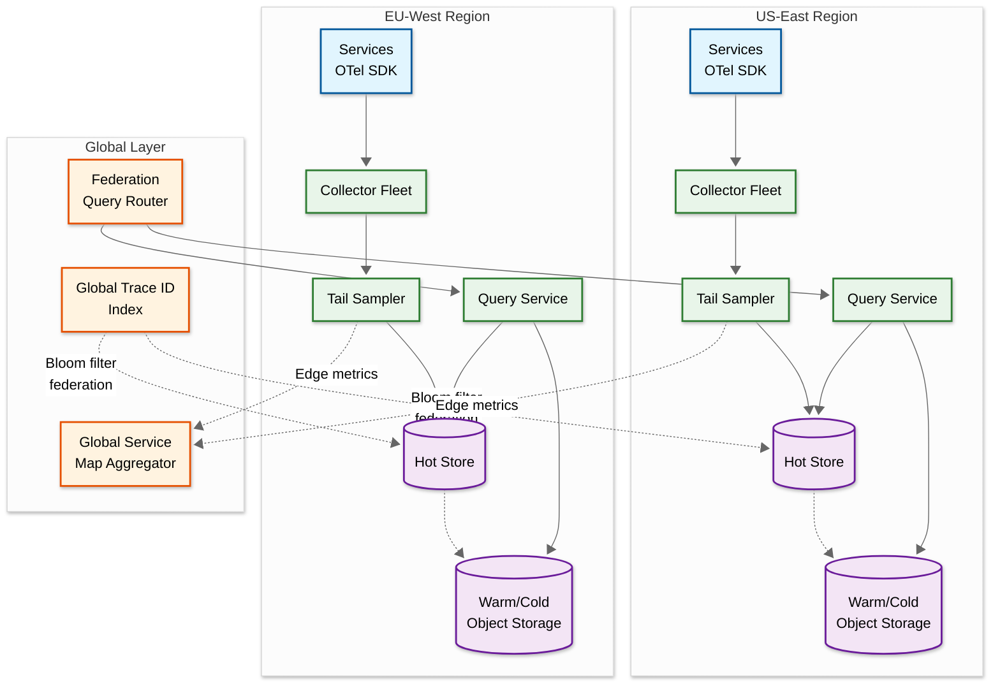

# 05 — Scalability & Reliability

## Scalability

### Horizontal vs. Vertical Scaling Decisions

| Component | Scaling Strategy | Rationale |
|---|---|---|
| **OTel Agents** | Horizontal (one per host) | Naturally scales with infrastructure; no coordination between agents |
| **Collectors** | Horizontal with consistent hashing | Stateless processing; add instances to handle higher ingestion rates; consistent hash by trace ID for tail sampling affinity |
| **Tail Samplers** | Horizontal with trace-ID partitioning | Memory-bound; each instance owns a partition of the trace ID space; partition rebalancing on scale events |
| **Message Queue** | Horizontal (add partitions) | Throughput scales linearly with partition count; partitioned by trace ID |
| **Hot Store** | Horizontal (add nodes to cluster) | Wide-column stores scale linearly; trace ID as partition key ensures even distribution |
| **Warm/Cold Store** | Elastic object storage | Virtually unlimited capacity; cost scales linearly with data volume |
| **Query Service** | Horizontal (stateless) | Query load is independent of ingestion; scale based on query QPS |

### Auto-Scaling Triggers

| Component | Scale-Up Trigger | Scale-Down Trigger | Cooldown |
|---|---|---|---|
| Collectors | CPU > 70% sustained 5 min OR queue lag > 10s | CPU < 30% sustained 15 min | 10 min |
| Tail Samplers | Memory > 75% OR trace wait time > 45s | Memory < 40% sustained 15 min | 15 min |
| Query Service | p99 latency > 5s OR CPU > 60% | p99 latency < 1s AND CPU < 20% | 5 min |
| Compaction Workers | Compaction lag > 2 hours | Compaction lag < 30 min | 30 min |

### Database Scaling Strategy

**Hot Store (Wide-Column)**:
- **Sharding**: Automatic via trace_id partition key; wide-column stores handle this natively
- **Read replicas**: Not needed (trace queries are point lookups, not range scans)
- **Replication factor**: 3 (balances durability against write cost)
- **Compaction strategy**: Leveled compaction for read-optimized access; size-tiered for write-heavy ingestion tables

**Warm/Cold Store (Columnar on Object Storage)**:
- **Scaling**: Object storage is inherently elastic; no provisioning needed
- **Block size optimization**: Target 256 MB Parquet blocks for optimal read performance
- **Partition Cutting off unnecessary steps**: Date-based directory structure enables skipping irrelevant blocks

### Caching Layers

| Layer | What's Cached | TTL | Eviction Policy | Hit Rate Target |
|---|---|---|---|---|
| **L1: Query Service in-process** | Recently queried traces | 2 min | LRU, 500 MB per instance | 30-40% |
| **L2: Distributed cache** | Assembled traces, search results | 10 min | LRU, 50 GB total | 50-60% |
| **L3: Block metadata cache** | Parquet block metadata + bloom filters | 1 hour | LFU, 10 GB total | 90%+ |
| **Service map cache** | Pre-computed dependency graph | 1 min | Full invalidation on update | 95%+ |

### Hot Spot Mitigation

**Problem**: Some traces are queried far more than others (e.g., traces linked from high-priority incident reports shared across teams).

**Mitigation**:
1. **L2 cache absorption**: Hot traces are cached in the distributed cache layer, absorbing repeated reads
2. **Read-through caching**: The query service reads from cache first; cache misses populate the cache for subsequent reads
3. **No hot spot in writes**: Trace IDs are random 128-bit values, ensuring uniform distribution across storage partitions; no skew possible

### Collector Fleet Scaling Strategy

```
FUNCTION autoScaleCollectors(metrics):
    currentInstances = collectorFleet.instanceCount()
    targetInstances = currentInstances

    // Scale-up triggers (any one is sufficient)
    IF metrics.avgCPU > 0.70 AND metrics.duration > 5_MINUTES:
        targetInstances = ceil(currentInstances * 1.5)
    ELIF metrics.queuePublishLatency.p99 > 500_MS:
        targetInstances = ceil(currentInstances * 1.3)
    ELIF metrics.consumerLag > 10_SECONDS:
        targetInstances = ceil(currentInstances * 1.5)

    // Scale-down triggers (all must be true)
    IF metrics.avgCPU < 0.30 AND
       metrics.queuePublishLatency.p99 < 100_MS AND
       metrics.duration > 15_MINUTES:
        targetInstances = max(MIN_INSTANCES, ceil(currentInstances * 0.7))

    // Apply change with hash ring rebalance
    IF targetInstances != currentInstances:
        // Step 1: Add/remove instances from the hash ring
        // Step 2: Allow drain window (30 seconds) for in-flight trace buffers
        // Step 3: Complete rebalance
        collectorFleet.resize(targetInstances)
        hashRing.rebalance(drainWindow = 30_SECONDS)

        LOG("Collector fleet scaled from {currentInstances} to {targetInstances}")
        EMIT metric: "collector.fleet.resize"
```

### Data Locality Optimization

| Optimization | Description | Impact |
|---|---|---|
| **Trace-ordered Parquet blocks** | During compaction, sort spans within a block by `trace_id` so all spans of a trace are in the same row group | Trace-by-ID lookups read one row group instead of scanning the block; 5-10x reduction in I/O |
| **Time-partitioned block directories** | Organize blocks by `date_bucket` on object storage | Time-bounded queries skip irrelevant directories; predicate pushdown on directory listing |
| **Bloom filter caching** | Cache all bloom filters in the L3 block metadata cache | Trace-by-ID lookups avoid fetching bloom filters from object storage; 90%+ cache hit rate |
| **Predicate pushdown** | Push service_name, http_status_code filters to the Parquet reader | Scan only relevant row groups and pages; reduces I/O by 50-80% for filtered queries |
| **Column Cutting off unnecessary steps** | Only read the columns needed for the query (e.g., search queries don't need `events` or `attributes`) | Reduces I/O by 40-60% for search queries that only need summary fields |

---

## Reliability & Fault Tolerance

### Single Points of Failure (SPOF) Identification

| Component | SPOF Risk | Mitigation |
|---|---|---|
| **Load Balancer** | Medium | Active-passive pair with health-check failover; or DNS-based routing to multiple LB instances |
| **Message Queue** | High (central bus) | Multi-broker cluster with replication factor 3; no single-broker failure causes data loss |
| **Hot Store** | Medium | Multi-node cluster with replication factor 3; automatic repair and rebalancing |
| **Object Storage** | Low | Provider-managed; 11 nines of durability by design |
| **Query Service** | Low | Stateless; multiple instances behind LB; any instance can serve any query |
| **Tail Sampler** | High (holds buffered state) | WAL checkpoint for crash recovery; overlap during rebalancing; accept some data loss for system availability |

### Redundancy Strategy

```
Deployment topology:
    Region A (primary):
        Collectors: 10 instances (behind LB)
        Tail Samplers: 10 instances (consistent hash ring)
        Message Queue: 5 brokers, 3x replication
        Hot Store: 12-node cluster, RF=3
        Query Service: 5 instances (behind LB)
        Compaction Workers: 3 instances

    Region B (standby):
        Collectors: 5 instances (receives cross-region span copies)
        Hot Store: 6-node cluster, RF=3 (async replication)
        Query Service: 3 instances (serves read queries)

    Object Storage:
        Cross-region replication enabled (provider-managed)
```

### Failover Mechanisms

**Collector failover**:
- Health check: gRPC health endpoint, 5-second interval
- Detection: 3 consecutive health check failures → remove from hash ring
- Recovery: Consistent hashing rebalances traffic to remaining collectors; spans for affected trace IDs route to the next node on the ring
- Impact: Traces being buffered on the failed collector may lose some spans; the tail sampler makes a decision on the partial trace

**Hot store failover**:
- Multi-node cluster with automatic coordinator failover
- Write path: If a write fails, the collector retries to the message queue (which buffers); writes resume when the storage node recovers
- Read path: Query service retries against replica nodes; if all replicas for a partition are down, return a partial result with a warning

**Message queue failover**:
- Multi-broker with in-sync replicas (ISR)
- If a partition leader fails, a follower is promoted; no data loss for acknowledged messages
- If all brokers in a partition fail: collectors buffer in memory for a configurable window (30 seconds); drop oldest spans if buffer fills

### Circuit Breaker Patterns

| Circuit | Opens When | Behavior When Open | Closes When |
|---|---|---|---|
| Collector → Hot Store | 5 consecutive write failures within 10s | Redirect writes to message queue dead letter; alert on-call | Successful write to hot store |
| Query Service → Hot Store | p99 read latency > 10s for 1 min | Serve from cache only; return stale data with staleness indicator | p99 < 3s for 30 sec |
| Query Service → Warm Store | 3 consecutive timeout failures | Return partial results (hot tier only) with "incomplete results" flag | Single successful query |
| Tail Sampler → Message Queue | Queue publish latency > 5s | Fall back to writing sampled spans directly to hot store (bypass queue) | Queue latency < 500ms for 30 sec |

### Retry Strategies

| Operation | Retry Policy | Backoff | Max Retries | Notes |
|---|---|---|---|---|
| SDK → Agent span export | None (fire-and-forget) | N/A | 0 | Tracing must never block application |
| Agent → Collector | Exponential backoff | 100ms, 200ms, 400ms | 3 | Drop batch after max retries |
| Collector → Queue publish | Exponential backoff | 50ms, 100ms, 200ms, 400ms | 4 | Buffer in memory during retries |
| Storage writer → Hot Store | Exponential backoff | 200ms, 400ms, 800ms | 3 | Return to queue for reprocessing after max retries |
| Query → Storage read | Immediate retry to replica | 0ms (different node) | 2 | Try alternate replicas |

### Graceful Degradation

| Degradation Level | Trigger | Behavior |
|---|---|---|
| **Level 0: Healthy** | All systems nominal | Full functionality |
| **Level 1: Reduced sampling** | Tail sampler memory > 80% | Reduce wait window; increase head sampling aggressiveness; drop low-priority traces first |
| **Level 2: Head-only sampling** | Tail sampler unavailable | Fall back to head-based sampling only; lose tail-sampling guarantees (errors may be missed) |
| **Level 3: Stale queries** | Hot store degraded | Serve queries from cache and warm store only; accept increased query latency |
| **Level 4: Ingestion-only** | Query tier unavailable | Continue ingesting and storing spans; queries return 503; data is preserved for when query tier recovers |
| **Level 5: Instrumentation bypass** | Collector fleet unavailable | SDKs drop spans silently; no impact on production services; no trace data collected until recovery |

### Bulkhead Pattern

| Bulkhead | Isolated Resource | Why |
|---|---|---|
| Ingestion pool | Collector threads for span processing | Prevents a slow storage write from blocking span ingestion |
| Query pool | Query service threads per query type | Prevents expensive search queries from starving trace-by-ID lookups |
| Compaction pool | Dedicated compaction worker instances | Prevents compaction load from affecting ingestion or query performance |
| Per-tenant queue | Message queue partitions per tenant | Prevents a noisy tenant from consuming all queue capacity |

---

## Disaster Recovery

### Recovery Objectives

| Metric | Target | Rationale |
|---|---|---|
| **RTO (Recovery Time Objective)** | 30 minutes for ingestion; 2 hours for query | Ingestion must resume quickly to avoid span loss; query can tolerate longer recovery since it's used interactively |
| **RPO (Recovery Point Objective)** | 30 seconds for hot tier; 0 for warm/cold tier | Hot tier data in the last 30 seconds of the write pipeline may be lost; warm/cold tier on replicated object storage has zero data loss |

### Backup Strategy

| Data | Backup Method | Frequency | Retention |
|---|---|---|---|
| Hot store data | Continuous replication (RF=3) + periodic snapshot | Snapshots every 6 hours | 7 days (matches hot tier retention) |
| Warm/cold store | Object storage native replication (cross-region) | Continuous | 90 days (matches cold tier retention) |
| Configuration | Version-controlled (Git) | On every change | Indefinite |
| Sampling rules | Version-controlled | On every change | Indefinite |
| Service map aggregates | Periodic export to object storage | Every hour | 1 year |

### Multi-Region Considerations

| Strategy | Description | Trade-off |
|---|---|---|
| **Active-passive** | Primary region ingests and serves queries; secondary region receives replicated data and takes over on failure | Lower cost; higher RTO (minutes to failover) |
| **Active-active (regional)** | Each region ingests its own spans and serves local queries; cross-region queries are slower | Lower latency for regional queries; cross-region traces require federation |
| **Recommended: Active-active with regional affinity** | Spans are ingested in the region where the service runs; queries prefer local data but can federate to other regions for cross-region traces | Best latency; moderate complexity; natural disaster isolation |

### Cross-Region Trace Correlation

When a request traverses services in multiple regions, the trace context (trace ID) is propagated across regions. Each region stores its portion of the trace locally. The query service handles cross-region traces by:

1. Detecting that a trace ID exists in multiple regions (via a global trace ID index or bloom filter federation)
2. Fetching span fragments from each region in parallel
3. Assembling the complete trace in the query service
4. Caching the assembled cross-region trace for repeated access

### Multi-Region Architecture



| Design Decision | Choice | Alternative | Rationale |
|---|---|---|---|
| Span storage locality | Store spans in the region where the service runs | Replicate all spans to all regions | Data residency compliance; lower ingestion latency; avoids cross-region replication bandwidth |
| Cross-region query | Federation (query both regions, merge) | Global read replicas | Federation avoids storage cost of replication; adds ~50-100ms latency for cross-region traces |
| Service map | Global aggregator merges regional edge metrics | Each region maintains full global map | Aggregator approach is simpler; avoids inconsistent maps across regions |
| Trace ID index | Bloom filter federation (regional bloom filters queried by global index) | Global trace lookup table | Bloom filters are compact (<1% of trace data); avoids centralized dependency |

### Cross-Region Failover Procedure

```
FUNCTION handleRegionFailover(failedRegion, healthyRegion):
    // Phase 1: Detect (automated, 30-60 seconds)
    IF healthCheck(failedRegion).consecutiveFailures > 3:
        DECLARE failedRegion as DEGRADED

    // Phase 2: Redirect ingestion (requires DNS or service mesh update)
    //   Option A: Services in failed region are also down → no spans to redirect
    //   Option B: Services are up but tracing infra is down → redirect agent traffic
    IF failedRegion.services.areHealthy():
        updateAgentConfig(failedRegion.agents, collectorEndpoint = healthyRegion.collectors)
        // Spans from failed region's services now flow to healthy region
        // These spans will have cross-region latency added to ingestion

    // Phase 3: Query federation
    federationRouter.markRegionUnavailable(failedRegion)
    // Queries for traces from the failed region:
    //   - Hot tier: UNAVAILABLE (returns partial results)
    //   - Warm/cold tier: AVAILABLE (object storage is cross-region replicated)

    // Phase 4: Recovery
    WHEN healthCheck(failedRegion).isHealthy():
        // Gradually redirect agents back to local collectors
        // Do NOT bulk-replay missed spans (they're gone; accept the gap)
        updateAgentConfig(failedRegion.agents, collectorEndpoint = failedRegion.collectors)
        federationRouter.markRegionAvailable(failedRegion)
```

---

## Back-Pressure Mechanisms

### Five-Layer Back-Pressure Control

| Layer | Mechanism | Trigger | Behavior |
|---|---|---|---|
| **L1: SDK** | In-memory span buffer with bounded queue | Queue full (1,000 spans default) | Drop oldest spans silently; never block application thread; increment `otel.spans.dropped` counter |
| **L2: Agent** | Batch send with retry + drop | 3 consecutive export failures | Buffer spans in memory (10,000 max); drop batches when buffer full; switch to aggressive head-sampling |
| **L3: Collector** | gRPC flow control + admission control | CPU > 80% OR queue publish latency > 1s | Signal backpressure via gRPC flow control; agents slow send rate; reject low-priority spans first |
| **L4: Tail Sampler** | Adaptive wait window reduction | Memory > 80% capacity | Reduce wait window: 30s → 15s → 5s; evict low-value traces first; fall back to head-only decisions |
| **L5: Storage** | Write queue depth limit | Storage write latency > 2s | Batch larger writes; reduce write concurrency; if queue exceeds 10K items, alert and temporarily pause compaction to free I/O |

### Back-Pressure Propagation Flow

```
FUNCTION handleBackPressure(component, pressureLevel):
    // Back-pressure propagates BACKWARD through the pipeline
    // (from storage → sampler → collector → agent → SDK)
    // but NEVER forward to application services

    IF component == STORAGE:
        // Storage is slow → sampler write queue grows
        sampler.reduceWaitWindow()
        sampler.increaseDropRate()
        // DO NOT propagate to collectors (they buffer via queue)

    ELIF component == TAIL_SAMPLER:
        // Sampler under memory pressure → reduce inflow
        collectors.enableAdmissionControl()
        // Admit only: error spans (always), head-sampled spans, rate-limited sample
        // Reject: non-sampled spans from high-volume services

    ELIF component == COLLECTOR:
        // Collector overloaded → signal agents
        agents.receiveBackpressure()
        // Agents increase local head-sampling rate (drop more at source)
        // Agents batch more aggressively (larger, less frequent batches)

    ELIF component == AGENT:
        // Agent cannot send → SDK buffer fills
        sdk.dropOldestSpans()
        // The SDK NEVER blocks the application
        // Spans are disposable; application correctness is sacred

    // Rule that never changes: No back-pressure signal ever reaches the application service
    // The tracing system degrades gracefully, not the applications it instruments
```

---

## Chaos Experiments

| # | Experiment | Injection | Expected Behavior | Validates |
|---|---|---|---|---|
| 1 | **Kill 30% of collectors** | Terminate 3 of 10 collector instances | Consistent hash ring rebalances within 30s; surviving collectors handle redistributed load; temporary trace fragmentation during rebalance; no span loss beyond the rebalance window | Hash ring resilience, auto-scaling trigger |
| 2 | **Message queue partition leader failure** | Kill the broker hosting 5 of 20 partition leaders | Followers promoted within 10s; collectors retry publish to new leaders; <1s of message delay; no data loss for acknowledged writes | Queue failover, ISR promotion |
| 3 | **Hot store node failure** | Terminate 1 of 12 wide-column nodes | Cluster rebalances automatically; writes continue to remaining replicas (RF=3 means 2 replicas still available); read retries to alternate replicas | Storage redundancy, replica reads |
| 4 | **Tail sampler OOM** | Inject memory pressure until sampler hits 95% | Wait window reduces adaptively (30s→15s→5s); low-value traces evicted first; error traces always retained; sampler auto-scales if pressure persists | Adaptive degradation, eviction policy |
| 5 | **Network partition between collector and queue** | Block network between collector fleet and queue brokers | Collectors buffer spans in memory (30s); after buffer fills, fall back to head-only sampling; alert fires within 2 minutes; recovery: flush buffered spans when connectivity restored | Circuit breaker, graceful degradation |
| 6 | **Clock skew injection** | Advance clocks on 20% of services by 2-5 seconds | Trace assembler detects and corrects skew within cap threshold (5s); traces render correctly in UI; skew-adjusted flag set on affected spans | Clock skew correction algorithm |
| 7 | **Span flood from rogue service** | One service emits 500K spans/sec (50x normal) | Per-service rate limiting at agent caps at 10K spans/sec; excess spans dropped with counter increment; other services unaffected; alert identifies the rogue service | Rate limiting, noisy-neighbor isolation |
| 8 | **Object storage unavailable** | Block access to object storage for warm/cold tiers | Compaction jobs pause (retry with backoff); hot store continues serving reads/writes; queries for warm/cold data return 503 with "warm tier unavailable" message; no data loss (hot store retains data beyond normal TTL) | Compaction resilience, partial query results |

---

## Capacity Planning Formulas

### Ingestion Throughput Capacity

```
max_ingestion_rate = num_collectors × per_collector_throughput × (1 - overhead_factor)

Where:
    num_collectors = 10
    per_collector_throughput = 200K spans/sec (validated by load test)
    overhead_factor = 0.15 (validation, normalization, queue publish)

    max_ingestion_rate = 10 × 200K × 0.85 = 1.7M spans/sec

Headroom check:
    peak_demand = 1.8M spans/sec (from requirements)
    utilization = 1.8M / 1.7M = 105% → need 11 collectors at peak
    → Provision 12 collectors for 67% utilization at peak
```

### Storage Capacity (Total)

```
total_storage = hot_tier + warm_tier + cold_tier + index_overhead

hot_tier = daily_ingestion_compressed × hot_retention_days × replication_factor
         = 26 TB × 3 days × 3 = 234 TB (with RF=3 distributed across 12 nodes)
         = 19.5 TB per node

warm_tier = daily_ingestion_columnar × warm_retention_days
          = (26 TB / 15) × 27 days  // 15x columnar compression, 27 = 30-3 days
          = 46.8 TB on object storage

cold_tier = daily_ingestion_columnar_high × cold_retention_days
          = (26 TB / 20) × 60 days  // 20x high compression, 60 = 90-30 days
          = 78 TB on object storage

index_overhead = 2% of total span data = ~5 TB

total = 234 TB (hot) + 46.8 TB (warm) + 78 TB (cold) + 5 TB (index)
      ≈ 364 TB total footprint
```

### Query Tier Scaling

```
query_instances = ceil(peak_query_qps / per_instance_qps)

Where:
    peak_query_qps = 500 (during major incident, 2.5x normal)
    per_instance_qps = 150 (for mixed trace-by-ID and search queries)

    query_instances = ceil(500 / 150) = 4 → provision 5 for headroom

Cache sizing:
    working_set = active_incidents × traces_per_incident × avg_trace_size
                = 5 × 200 × 100 KB = 100 MB (active debugging)
    L2_cache = 50 GB (absorbs repeated reads during investigations)
```
