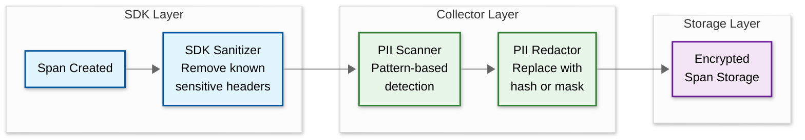

# 06 — Security & Compliance

## Authentication & Authorization

### Authentication Mechanism

| Interface | AuthN Method | Details |
|---|---|---|
| **Span Ingestion (SDK → Collector)** | mTLS + API key | Services authenticate via mutual TLS certificates provisioned by the service mesh; API key identifies the tenant/team for multi-tenant deployments |
| **Query API** | OAuth2 / OIDC (Bearer token) | Engineers authenticate via the organization's identity provider; tokens carry team membership and role claims |
| **Admin API** | OAuth2 + MFA | Configuration changes (sampling rules, retention policies) require multi-factor authentication |
| **Service-to-Service (internal)** | mTLS | All internal communication between collectors, samplers, storage writers, and query services uses mutual TLS |

### Authorization Model (RBAC)

| Role | Ingestion | Query Own Team's Traces | Query All Traces | Modify Sampling Rules | Admin |
|---|---|---|---|---|---|
| **Service Account** | Yes | No | No | No | No |
| **Developer** | No | Yes | No | No | No |
| **SRE / On-Call** | No | Yes | Yes | No | No |
| **Platform Engineer** | No | Yes | Yes | Yes | No |
| **Admin** | No | Yes | Yes | Yes | Yes |

**Trace-level access control**: In multi-team organizations, traces may contain spans from multiple teams' services. Access control is applied at the **span level**: a developer can see the full trace structure (span names, durations, service names) but can only see tag values and log details for spans belonging to their team's services. Spans from other teams are shown as opaque boxes with only timing information.

```
FUNCTION authorizeSpanAccess(user, span):
    IF user.role == ADMIN OR user.role == SRE:
        RETURN FULL_ACCESS

    IF span.serviceName IN user.teamServices:
        RETURN FULL_ACCESS

    # User can see span exists (structure) but not its details
    RETURN METADATA_ONLY   # show: service, operation, duration, status
                           # hide: tags, logs, process details
```

### Token Management

- **Ingestion tokens**: Long-lived API keys rotated quarterly; stored in a secret management system; revocable immediately via admin API
- **Query tokens**: Short-lived JWT (1 hour expiry) from OIDC provider; refreshed via refresh token flow
- **Service mesh certificates**: Auto-rotated by the service mesh control plane (e.g., every 24 hours)

---

## Data Security

### Encryption at Rest

| Storage Tier | Encryption | Key Management |
|---|---|---|
| Hot Store (wide-column) | AES-256 at the storage engine level | Keys managed by the organization's KMS; per-tenant key isolation for multi-tenant deployments |
| Warm/Cold Store (object storage) | Server-side encryption (AES-256) | Object storage provider's key management or customer-managed keys |
| Message Queue | Encryption at rest via broker-level encryption | Broker-managed keys with KMS integration |
| Query Cache | Not encrypted (in-memory, ephemeral) | Cache is tenant-isolated; cleared on eviction |

### Encryption in Transit

- **SDK → Agent**: mTLS or TLS 1.3 (configurable; mTLS for zero-trust environments)
- **Agent → Collector**: TLS 1.3 with certificate pinning
- **Collector → Queue → Storage**: mTLS within the service mesh
- **Query API → Client**: TLS 1.3

### PII in Traces — The Critical Risk

Traces are one of the most likely places for **unintentional PII leakage** in an organization's infrastructure. Span tags and logs may inadvertently contain:

- User IDs, email addresses, IP addresses in HTTP URL paths or query parameters
- Authentication tokens in request headers captured as span tags
- Database query text with user data in SQL parameters
- Error messages containing stack traces with user input
- gRPC request/response payloads logged as span events

### PII Scrubbing Pipeline



**Multi-layer PII scrubbing**:

1. **SDK layer** (first defense):
   - Default deny-list for HTTP headers: `Authorization`, `Cookie`, `Set-Cookie`, `X-Api-Key`
   - URL path parameter sanitization: replace path segments matching UUID/numeric patterns with `{id}`
   - Configurable allow-list: only capture tags explicitly listed in the SDK configuration

2. **Collector layer** (second defense):
   - Regex-based PII scanner: detect patterns matching email addresses, credit card numbers (Luhn validation), SSNs, phone numbers, IP addresses
   - Hash-based redaction: replace detected PII with a one-way hash (preserves correlation without exposing raw values)
   - Custom scrubbing rules: organization-defined patterns for domain-specific PII

3. **Storage layer** (audit control):
   - Tag value encryption: optionally encrypt specific tag values with a per-tenant key; only authorized roles can decrypt
   - Audit logging: all query access to traces is logged with the querying user's identity

```
FUNCTION scrubSpan(span):
    # Layer 1: Header deny-list
    FOR tag IN span.tags:
        IF tag.key IN DENIED_HEADERS:
            span.removeTag(tag.key)

    # Layer 2: URL sanitization
    IF span.tags["http.url"] EXISTS:
        span.tags["http.url"] = sanitizeUrl(span.tags["http.url"])

    # Layer 3: Pattern-based PII detection
    FOR tag IN span.tags:
        FOR pattern IN PII_PATTERNS:
            IF pattern.matches(tag.value):
                tag.value = "[REDACTED:" + HASH(tag.value)[:8] + "]"
                span.addTag("pii.redacted", "true")

    # Layer 4: Log/event scrubbing
    FOR event IN span.events:
        FOR field IN event.fields:
            FOR pattern IN PII_PATTERNS:
                IF pattern.matches(field.value):
                    field.value = "[REDACTED]"

    RETURN span
```

### Data Masking/Anonymization

| Data Type | Masking Strategy | Example |
|---|---|---|
| Email | Hash and truncate | `john@example.com` → `[email:a1b2c3d4]` |
| IP Address | Mask last two octets | `192.168.1.42` → `192.168.*.*` |
| User ID | One-way hash | `user-12345` → `[uid:f8e9d0c1]` |
| SQL Query | Parameterize | `SELECT * FROM users WHERE id=42` → `SELECT * FROM users WHERE id=?` |
| URL Path | Template | `/users/12345/orders/67890` → `/users/{id}/orders/{id}` |
| Auth Token | Full redaction | `Bearer eyJhbG...` → `[REDACTED]` |
| gRPC Payload | Selective field scrub | Scrub fields matching PII patterns; retain structural metadata |
| Stack Trace | User input redaction | Replace user-supplied values in exception messages with `[INPUT]` |

### Encryption Key Hierarchy

```
Key Management Hierarchy:
    Root Key (KMS-managed)
    ├── Tenant Master Key (one per tenant)
    │   ├── Hot Store Encryption Key (rotated quarterly)
    │   ├── Object Storage Encryption Key (rotated quarterly)
    │   └── Sensitive Tag Encryption Key (for field-level encryption)
    ├── Inter-Node TLS Key (rotated every 24 hours by service mesh)
    └── Compliance Log Encryption Key (separate from trace data keys)

// Key rotation procedure:
//   1. Generate new key version in KMS
//   2. New writes use the new key; old data remains encrypted with old key
//   3. Background re-encryption job updates old data (for hot store)
//   4. Warm/cold tiers: old blocks retain old key; new blocks use new key
//   5. Old key version retained until all data encrypted with it expires via TTL
```

---

## Threat Model

### Top Attack Vectors

| # | Attack Vector | Risk Level | Description |
|---|---|---|---|
| 1 | **Trace data exfiltration** | High | An attacker with query access extracts PII from span tags and logs; traces may contain authentication tokens, user data, or internal service topology |
| 2 | **Span injection / poisoning** | Medium | A compromised service sends fabricated spans to pollute trace data, create false service dependencies, or hide malicious activity |
| 3 | **Denial of service via span flood** | Medium | A malicious or misconfigured service floods the collector with spans, exhausting sampling budget and storage capacity |
| 4 | **Service topology reconnaissance** | Medium | An attacker with limited query access maps the entire internal service architecture via the service dependency graph |
| 5 | **Sampling manipulation** | Low | An attacker modifies sampling configuration to either suppress tracing of their malicious activity or force 100% sampling to cause a DoS |

### Mitigations

| Attack | Mitigation |
|---|---|
| **Trace data exfiltration** | RBAC with span-level access control; PII scrubbing at SDK and collector layers; audit logging on all query access; encryption of sensitive tag values |
| **Span injection** | mTLS authentication for all ingestion; validate that the reporting service matches the service_name in span metadata; reject spans from unregistered services |
| **Span flood DoS** | Per-service rate limiting at the agent level; per-tenant quota enforcement at the collector; adaptive sampling that automatically reduces acceptance rate under load |
| **Topology reconnaissance** | Service dependency graph access restricted to SRE and platform engineer roles; option to anonymize service names for non-privileged users |
| **Sampling manipulation** | Sampling configuration changes require admin role + MFA; all configuration changes are audited and versioned; rate limit configuration API |

### Rate Limiting & DDoS Protection

| Layer | Protection | Limit |
|---|---|---|
| **Agent** | Per-service span rate limit | 10,000 spans/sec per service instance (configurable) |
| **Collector** | Per-tenant ingestion quota | Configured per tenant; default 100,000 spans/sec |
| **Query API** | Per-user rate limit | See API design in 03-low-level-design.md |
| **Admin API** | Per-user + IP-based rate limit | 10 req/min; alert security team on repeated failures |

---

## Compliance

### GDPR Considerations

| Requirement | Implementation |
|---|---|
| **Right to erasure** | PII scrubbing at ingestion prevents most PII from being stored; for residual PII, support bulk deletion by user identifier hash across all storage tiers |
| **Data minimization** | SDK default configuration captures minimal span data; teams must explicitly opt-in to capture additional tags; PII scrubbing removes unintentional captures |
| **Lawful basis** | Tracing is a legitimate interest for system reliability; documented in the organization's data processing agreement |
| **Data portability** | Traces can be exported in OTLP format via the query API |
| **Cross-border transfer** | Regional deployment model keeps trace data within the region where it was generated; cross-region queries federate rather than replicating data |

### SOC2 Considerations

| Control | Implementation |
|---|---|
| **Access control** | RBAC enforced at query API; span-level visibility based on team membership |
| **Audit trail** | All query access logged with user identity, queried trace IDs, and timestamp; configuration changes logged with change delta |
| **Encryption** | At rest (AES-256) and in transit (TLS 1.3) for all trace data |
| **Availability** | 99.9% SLO for ingestion; disaster recovery plan with 30-minute RTO |
| **Change management** | Sampling rules and configuration changes require review and approval; version-controlled |

### Data Retention Compliance

```
FUNCTION enforceRetention():
    # Run daily at 02:00 UTC (low-traffic period)

    FOR tier IN [HOT, WARM, COLD]:
        retentionDays = getRetentionPolicy(tier)
        cutoffDate = today() - retentionDays

        IF tier == HOT:
            # Wide-column store: TTL handles expiration automatically
            # Verify TTL is configured correctly
            verifyTTLConfiguration(hotStore, retentionDays)

        ELIF tier IN [WARM, COLD]:
            # Object storage: delete expired blocks
            expiredBlocks = objectStorage.listBlocks(
                dateBefore = cutoffDate,
                tier = tier
            )
            FOR block IN expiredBlocks:
                objectStorage.delete(block.path)
                indexStore.removeBlockEntry(block.id)

            LOG("Deleted {len(expiredBlocks)} expired blocks from {tier}")

    # Emit compliance report
    generateRetentionComplianceReport()
```

---

## Domain-Specific Threat Model

### Tracing-Specific Attack Patterns

| Attack | Mechanism | Severity | Detection | Mitigation |
|---|---|---|---|---|
| **Trace-based reconnaissance** | Attacker with limited query access maps internal service architecture, dependencies, and communication patterns via the service dependency graph | High | Monitor query patterns: excessive service map queries from a single user; queries across many unrelated services | Restrict service map access to SRE/platform roles; anonymize service names for non-privileged users; rate-limit dependency graph queries |
| **Span injection for false positives** | Compromised service emits fabricated error spans to trigger false alerts, distracting the SRE team while the actual attack proceeds elsewhere | Medium | Validate that reporting service matches `service_name` in span metadata (mTLS cert CN = service identity); detect anomalous error rate patterns inconsistent with application metrics | Cross-reference trace error rates with application-level metrics; require mTLS for ingestion; reject spans from unregistered services |
| **Timing side-channel via query API** | Attacker measures query response time to determine if specific trace IDs exist (e.g., to confirm an action happened at a specific time) | Low | Audit log analysis: systematic trace-by-ID queries for sequential or patterned IDs | Add constant-time response for trace-not-found (return same latency as found); rate-limit trace-by-ID queries per user |
| **Baggage-based data exfiltration** | A compromised service writes sensitive data into baggage items, which propagate to all downstream services and get stored in their spans | Medium | Monitor baggage size and content at the collector; detect anomalously large baggage items | Enforce max baggage size (8 KB); allowlist baggage keys at the collector; scrub baggage values through the same PII pipeline as span tags |
| **Sampling suppression** | Attacker modifies the `trace-flags` header to `00` (not sampled) to suppress tracing of their malicious requests | High | Monitor sampling decision distribution: if a specific source consistently sends `not-sampled` flags, it may be suppressing tracing | Tail-based sampling overrides head sampling decisions for traces matching custom rules (e.g., requests from specific IP ranges always sampled); enforce minimum sampling rate per service |

### Span Injection Detection

```
FUNCTION validateSpanSource(span, ingestionContext):
    // Verify that the service emitting the span is who they claim to be

    // Check 1: mTLS certificate identity matches service_name
    certServiceName = ingestionContext.mtlsCertificate.commonName
    spanServiceName = span.resource.serviceName
    IF certServiceName != spanServiceName:
        REJECT span
        LOG("Service identity mismatch: cert={certServiceName}, span={spanServiceName}")
        INCREMENT metric: "collector.spans.identity_mismatch"

    // Check 2: Service is registered in the service registry
    IF NOT serviceRegistry.isRegistered(spanServiceName):
        REJECT span
        LOG("Span from unregistered service: {spanServiceName}")

    // Check 3: Rate anomaly detection
    currentRate = spanRateCounter.getRate(spanServiceName)
    baselineRate = spanRateBaseline.getRate(spanServiceName)
    IF currentRate > baselineRate * 10:
        FLAG span as "rate_anomaly"
        // Don't reject (could be legitimate traffic spike), but flag for investigation

    // Check 4: Trace ID format validation
    IF NOT isValidTraceId(span.traceId):
        REJECT span
        LOG("Invalid trace ID format from {spanServiceName}")

    RETURN ACCEPT
```

---

## Compliance Automation

### Automated Compliance Checks

| Check | Frequency | Method | Action on Failure |
|---|---|---|---|
| PII scan on stored spans | Daily (batch scan) | Sample 0.1% of stored spans; run through PII pattern detector | Alert security team; quarantine affected block; patch scrubbing rules at collector layer |
| Encryption verification | Weekly | Verify TLS certificates on all endpoints; check storage encryption status | Critical alert; block ingestion on unencrypted paths |
| Access control audit | Weekly | Compare actual query access patterns against RBAC role definitions; flag users accessing traces outside their team's services | Generate access review report; flag over-privileged accounts for manager review |
| Retention policy verification | Daily | Verify hot store TTL is configured correctly; verify expired warm/cold blocks are deleted; verify no data exists beyond retention window | Alert compliance team; trigger manual deletion if overdue |
| Trace context sanitization | Every ingestion | Collector validates that no raw PII exists in trace context headers (traceparent, tracestate, baggage) | Reject baggage items containing PII patterns; strip sensitive tracestate entries |
| Cross-tenant isolation audit | Weekly | Run test queries: verify that tenant A cannot access tenant B's traces; verify DLS filters are applied correctly | Critical alert; disable cross-tenant query paths until verified |

### Compliance Event Log Schema

```
ComplianceEvent {
    event_id:           uuid
    timestamp:          datetime
    event_type:         enum("pii_detected", "access_violation", "retention_enforcement",
                             "encryption_audit", "isolation_audit", "scrubbing_rule_update")
    tenant_id:          string
    affected_storage:   list<string>    // e.g., ["hot-store", "warm-block-2024-03-15"]
    affected_traces:    uint32          // count, not IDs (avoid logging trace IDs in compliance logs)
    initiator:          string          // user or automated system
    result:             enum("pass", "fail", "remediated")
    details:            json
    retention_days:     uint32          // how long to keep this compliance log entry
}

// Compliance log stored separately from trace data:
//   - Append-only (no updates or deletes)
//   - Encrypted at rest with dedicated key
//   - Retained for 7 years (regulatory minimum)
//   - Access restricted to compliance and legal roles
//   - Stored in a separate system from the tracing infrastructure
```
