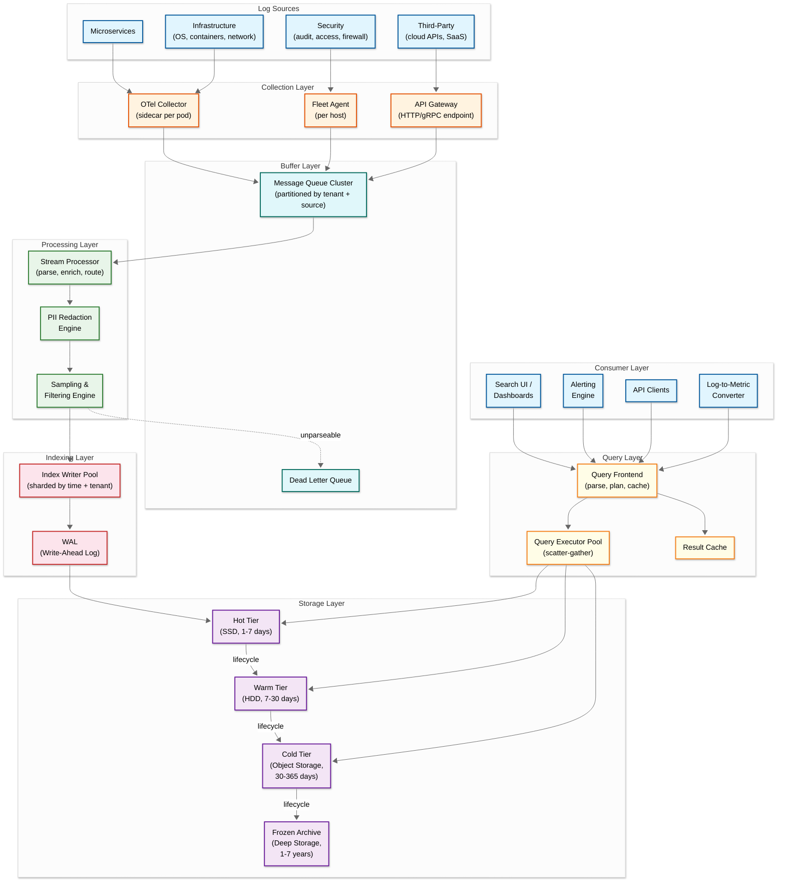
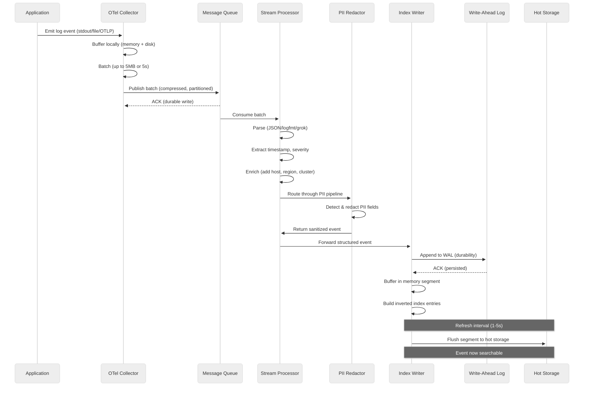
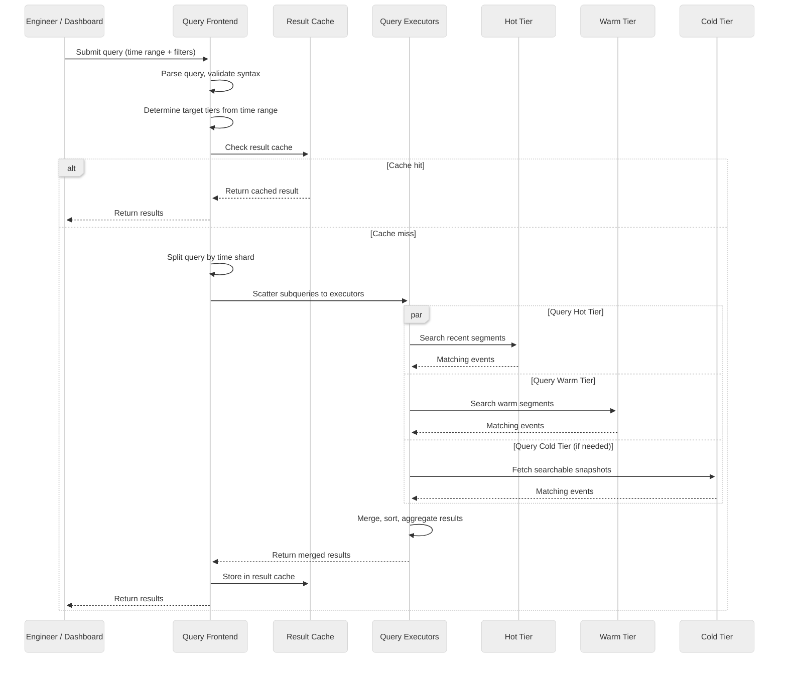
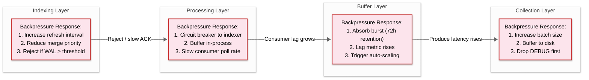

# 15.3 High-Level Design

## System Architecture



---

## Data Flow: Write Path



---

## Data Flow: Read Path



---

## Key Architectural Decisions

### 1. Multi-Layer Ingestion Pipeline vs. Direct Write

| Aspect | Direct Write | Multi-Layer Pipeline (Chosen) |
|---|---|---|
| Architecture | Agents write directly to index storage | Agents -> Queue -> Processor -> Indexer |
| Reliability | Logs lost if indexer is down | Queue buffers during indexer downtime (hours) |
| Backpressure | Agent blocks or drops on indexer overload | Queue absorbs burst, indexer consumes at steady rate |
| Processing | Agents must parse and enrich (CPU on every host) | Centralized processing pool, specialized hardware |
| Latency | Lower (one fewer hop) | Slightly higher (+100ms queue transit) |
| Complexity | Low | High (3 additional distributed systems) |
| **Decision** | | **Multi-layer pipeline**: the reliability and backpressure benefits are non-negotiable for a system that must not lose data during incidents when log volume spikes 10x |

### 2. Indexing Strategy Selection

| Aspect | Full-Text Inverted Index | Label-Only + Grep | Bloom Filter + Scan | Columnar + Sparse Index |
|---|---|---|---|---|
| Example | Elasticsearch | Loki | LogScale/Humio | ClickHouse |
| Ingestion speed | Moderate (index overhead) | Fast (minimal indexing) | Very fast (bloom only) | Very fast (append-only) |
| Full-text search | Sub-second | Slow (brute-force grep) | Fast (bloom skip) | Moderate (token bloom) |
| Aggregation | Moderate | Slow | Moderate | Very fast |
| Storage overhead | 1.5-3x raw data | 0.1-0.15x (labels only) | 0.05-0.1x (bloom filters) | ~0x (sparse index in RAM) |
| Compression ratio | 1.5-3x | 10-20x | 10-20x | 15-50x |
| Cost at scale | Very high | Very low | Low-moderate | Low |
| **Decision** | | | | **Hybrid approach**: use full-text inverted index for hot tier (7 days, optimized for fast interactive search), transition to columnar storage for warm/cold tiers (optimized for aggregation and cost), bloom filter acceleration on cold tier for needle-in-haystack queries. This hybrid captures the query speed of inverted indexes for recent data while achieving the cost efficiency of columnar/object storage for historical data. |

### 3. Schema-on-Read vs. Schema-on-Write

| Aspect | Schema-on-Write | Schema-on-Read (Chosen) |
|---|---|---|
| Ingestion | Reject logs that don't match schema | Accept any format, parse later |
| Field mapping | Pre-defined, strict types | Dynamic, types inferred at ingest or query time |
| Type conflicts | Rejected at ingestion (data loss risk) | Resolved with suffix strategy (field_str, field_int) |
| Query performance | Faster (pre-structured data) | Slightly slower (may need runtime parsing) |
| Operational burden | High (schema management across 5K services) | Low (services log freely) |
| **Decision** | | **Schema-on-read**: the operational cost of enforcing schemas across thousands of independently deployed microservices is prohibitive; Uber's migration to schema-agnostic logging eliminated their single largest operational pain point |

### 4. Push vs. Pull Collection Model

| Aspect | Pull (Scrape) | Push (Chosen) |
|---|---|---|
| Model | Central collector scrapes log files from targets | Agents on each host push logs to central pipeline |
| Ephemeral workloads | Poor (containers gone before scrape) | Good (agent pushes before shutdown) |
| Network topology | Requires collector access to all targets | Agents push outbound (firewall-friendly) |
| Service discovery | Collector must discover all log sources | Self-registration at agent startup |
| Backpressure | Collector controls scrape rate | Agent must handle backpressure signals |
| **Decision** | | **Push model**: log data from ephemeral containers, serverless functions, and across network boundaries requires push; agents on each host push through the OTel Collector with local buffering for reliability |

### 5. Query Language Design

| Aspect | SQL-Based | Pipe-Based (SPL) | PromQL-Inspired (LogQL) | Custom DSL (Chosen) |
|---|---|---|---|---|
| Familiarity | Universal | Splunk users only | Prometheus users | New but learnable |
| Expressiveness | Very high | Very high | Moderate | High |
| Log-native operations | Low (no grep, parse, extract built-in) | Very high | High | High |
| Streaming support | Low | High | High | High |
| **Decision** | | | | **LogQL-inspired with SQL aggregations**: label-based stream selection `{service="api", env="prod"}` piped through filter stages `|= "error" | json | status >= 500`, with SQL-like aggregation syntax for analytics queries; balances familiarity, expressiveness, and log-native operations |

---

## Architecture Pattern Checklist

| Pattern | Decision | Justification |
|---|---|---|
| Sync vs Async communication | **Async** (event-driven pipeline) | Decoupling via message queue enables burst absorption and independent scaling of each layer |
| Event-driven vs Request-response | **Event-driven** for write path, **Request-response** for read path | Writes are fire-and-forget events; reads are interactive queries requiring synchronous response |
| Push vs Pull model | **Push** for log collection | Ephemeral containers, serverless, cross-boundary; agents push to central pipeline |
| Stateless vs Stateful services | **Stateless** processors, **stateful** indexers | Stream processors are horizontally scalable stateless workers; index writers maintain in-memory segments and WAL (stateful) |
| Write-heavy vs Read-heavy | **Extremely write-heavy** (100:1+ write-to-read) | Ingestion is continuous at millions/sec; search is intermittent at tens-to-hundreds/sec; optimize write path first |
| Real-time vs Batch processing | **Real-time** ingestion + indexing, **batch** for tier migration and compaction | Logs must be searchable within seconds; tier migration and segment compaction run as background batch jobs |
| Edge vs Origin processing | **Edge** for collection and initial parsing, **origin** for indexing and search | OTel Collectors at the edge do local parsing, batching, and filtering; centralized indexers handle compute-intensive indexing |

---

## Component Interaction Summary

### Collection Layer
- **OTel Collector (Sidecar)**: Deployed per pod/host. Tails log files or receives OTLP. Performs initial parsing (JSON detection, timestamp extraction), batching (5MB or 5-second window), compression (LZ4), and push to message queue. Buffers to local disk on queue unavailability (up to configurable disk limit, default 500MB). Implements memory limiter processor to prevent OOM.
- **Fleet Agent**: Per-host agent for infrastructure logs (kernel, syslog, container runtime). Monitors system log files with inotify/kqueue. Handles log rotation detection (inode tracking, file fingerprinting).
- **API Gateway**: HTTP/gRPC endpoint for direct log submission. Rate limiting per API key. Request validation (timestamp present, event size < 1MB). TLS termination.

### Buffer Layer
- **Message Queue Cluster**: Multi-broker deployment with topic-per-tenant-per-source partitioning. Replication factor 3 for durability. Retention: 72 hours (provides replay window for re-indexing). Consumer groups per indexer pool. Compaction disabled (log events are unique, not keyed).
- **Dead Letter Queue**: Receives events that fail parsing after N retries. Monitored for volume spikes (indicates format change in a service). Manual or automated reprocessing after parser update.

### Processing Layer
- **Stream Processor**: Stateless workers consuming from queue. Operations: format detection (JSON vs. logfmt vs. plain text), timestamp extraction and normalization (UTC), severity mapping (vendor-specific levels to OTel standard 1-24), field extraction (grok patterns for unstructured logs), enrichment (add cluster/region/environment from host metadata), routing (send to appropriate index based on rules).
- **PII Redaction Engine**: Inline processor that scans structured fields and message body for PII patterns (email, phone, SSN, credit card, IP addresses). Configurable per data stream (some streams may need IP addresses preserved for debugging). Redaction strategies: hash, mask (`****`), or remove.
- **Sampling & Filtering Engine**: Reduces volume for low-value streams. Strategies: deterministic sampling (keep 10% of DEBUG logs, 100% of ERROR), content-based filtering (drop health-check logs), deduplication (collapse repeated identical messages into a single event with count).

### Indexing Layer
- **Index Writer Pool**: Stateful workers that maintain in-memory index segments. Each writer owns a set of shards (partitioned by time + tenant hash). Operations: receive structured events, tokenize text fields, build inverted index entries (term -> posting list), buffer in memory, periodically flush to storage. Implements refresh cycle (1-5 seconds) after which new events become searchable.
- **Write-Ahead Log**: Each index writer maintains a WAL for crash recovery. Events are appended to WAL before being added to the in-memory segment. On crash recovery, the WAL is replayed to rebuild the in-memory state. WAL is truncated after segment flush to storage.

### Storage Layer
- **Hot Tier**: SSD-backed storage for the most recent data (1-7 days). Fully indexed with inverted index. Segment structure: immutable segments with term dictionaries, posting lists, stored fields (compressed with LZ4). Active compaction (merge small segments into larger ones).
- **Warm Tier**: HDD-backed or cheaper SSD for intermediate data (7-30 days). Read-only. On transition from hot: force-merge to reduce segment count (fewer segments = faster search), mark as read-only, optionally shrink shard count.
- **Cold Tier**: Object storage with searchable snapshot capability. Data lives in object storage; a minimal local cache (SSD) holds recently accessed blocks. On-demand block fetching for search queries. Bloom filter pre-filtering reduces unnecessary fetches.
- **Frozen Tier**: Deep archive in object storage. No local cache. On-demand rehydration (minutes to hours) for compliance and forensic queries. Lowest cost per GB.

### Query Layer
- **Query Frontend**: Entry point for all search requests. Parses query syntax, validates permissions (tenant isolation), determines time range and target tiers, splits query into time-shard subqueries, routes to query executors, merges results, manages result cache.
- **Query Executor Pool**: Stateless workers that execute subqueries against specific storage shards. Operations: open segment files, apply bloom filter pre-check, scan inverted index for matching terms, fetch matching documents, apply post-filters, return results with metadata (hit count, scanned bytes).
- **Result Cache**: In-memory cache for repeated queries (common for dashboards). Cache key: query hash + time range (rounded to nearest refresh interval). TTL: short (30-60 seconds) to balance freshness with load reduction.

---

## Backpressure Propagation Model

Backpressure is the mechanism by which downstream congestion signals propagate upstream to prevent data loss. In a log pipeline, each layer must both handle its own overload and propagate signals to the layer above.



### Backpressure Decision Matrix

| Signal | Threshold | Action | Layer |
|--------|-----------|--------|-------|
| Indexer WAL size | > 1 GB per shard | Slow consumer poll; increase refresh interval | Indexing |
| Consumer lag | > 60 seconds | Alert; prepare auto-scale | Buffer → Processing |
| Consumer lag | > 5 minutes | Enable Level 1 degradation (sample DEBUG) | Processing |
| Consumer lag | > 15 minutes | Enable Level 2 degradation (sample INFO) | Processing |
| Consumer lag | > 60 minutes | Emergency mode (drop DEBUG, sample INFO heavily) | Processing |
| Agent disk buffer | > 80% | Drop lowest-priority logs | Collection |
| Queue produce latency | > 500 ms | Increase agent batch size; compress more aggressively | Collection |

---

## Log Routing Architecture

Log routing determines which processing pipeline, indexing strategy, and storage tier each log event follows. Routing rules are evaluated in order, and the first matching rule determines the event's path.

```
ROUTING RULES (evaluated in order):

Rule 1: Security Audit Logs
  MATCH: source IN ["auth-service", "firewall", "vpn-gateway"] OR severity == "SECURITY"
  ROUTE TO: security-pipeline
    - Full PII redaction (aggressive)
    - Full-text indexing (all tiers)
    - 7-year retention
    - Immutable storage (append-only, no delete)

Rule 2: High-Value Application Errors
  MATCH: severity IN ["ERROR", "FATAL"]
  ROUTE TO: error-pipeline
    - Full-text indexing (hot tier, 7 days)
    - Label-only indexing (warm/cold)
    - 1-second refresh interval
    - 365-day retention

Rule 3: Application Info Logs
  MATCH: severity == "INFO" AND source NOT IN health_check_services
  ROUTE TO: standard-pipeline
    - Label-only indexing + bloom filter
    - 5-second refresh interval
    - 90-day retention

Rule 4: Debug Logs
  MATCH: severity == "DEBUG"
  ROUTE TO: low-priority-pipeline
    - 10% deterministic sampling
    - Label-only indexing (metadata only)
    - 15-second refresh interval
    - 7-day retention

Rule 5: Health Check Logs
  MATCH: message CONTAINS "health" OR path == "/healthz"
  ROUTE TO: drop
    - Aggregate into counter metric (log-to-metric conversion)
    - Do not index or store raw events

DEFAULT: standard-pipeline
```

### Log-to-Metric Conversion

High-volume, low-information log patterns (health checks, successful responses) can be converted to metrics at ingestion time, eliminating storage cost while preserving signal:

```
FUNCTION convert_log_to_metric(event: LogEvent, rules: List[ConversionRule]) -> Optional[Metric]:
    FOR rule IN rules:
        IF rule.matches(event):
            metric = Metric(
                name = rule.metric_name,        // e.g., "http_requests_total"
                labels = extract_labels(event, rule.label_fields),
                value = rule.extract_value(event),  // count=1 or duration
                timestamp = event.timestamp
            )
            EMIT metric TO metrics_pipeline
            IF rule.drop_original:
                RETURN None  // Don't index original log event
    RETURN event  // No conversion; proceed to indexing

// Example rules:
// - Access logs → http_request_duration_seconds histogram
// - Health checks → service_health_check_total counter
// - Authentication → auth_attempts_total counter with success/failure label
```

---

## Event Schema & Internal Data Format

### Canonical Log Event Schema

```
LogEvent:
  // Required fields (always present after processing)
  event_id:       string    // UUID v7 (time-sortable), generated at ingestion if absent
  timestamp:      int64     // Nanoseconds since epoch (UTC)
  observed_ts:    int64     // When the collector received the event
  severity:       int32     // OTel severity number (1-24)
  severity_text:  string    // Human-readable severity ("ERROR", "WARN")
  body:           string    // The log message (free text)

  // Source identification
  tenant_id:      string    // Organization / team identifier
  data_stream:    string    // Logical stream name (e.g., "payment-api-prod")
  service_name:   string    // Originating service
  service_version: string   // Service version (enables deploy correlation)
  host:           string    // Hostname or pod name
  container_id:   string    // Container identifier (ephemeral workloads)

  // Correlation
  trace_id:       string    // W3C trace context (hex-encoded 16 bytes)
  span_id:        string    // W3C span context (hex-encoded 8 bytes)
  request_id:     string    // Application-level request identifier

  // Dynamic attributes (schema-on-read)
  attributes:     Map<string, any>  // Arbitrary key-value pairs
  resource:       Map<string, any>  // Resource attributes (cluster, region, AZ)

  // Processing metadata (added by pipeline)
  _ingested_at:   int64     // When the event entered the pipeline
  _indexed_at:    int64     // When the event became searchable
  _pii_redacted:  bool      // Whether PII redaction was applied
  _routing_rule:  string    // Which routing rule matched
```

### Internal Serialization

| Format | Where Used | Compression | Size per Event |
|--------|-----------|-------------|---------------|
| OTLP Protobuf | Agent → Queue | LZ4 (batch-level) | ~150 bytes (compressed) |
| Internal Protobuf | Queue → Processor → Indexer | ZSTD (batch-level) | ~120 bytes (compressed) |
| Columnar Segment | Hot/Warm storage | Per-column codec | ~50-80 bytes (compressed) |
| Parquet | Cold/Frozen storage | ZSTD + dictionary encoding | ~30-50 bytes (compressed) |

---

## Deployment Topology

### Production Cluster Layout

```
Availability Zone A:
  ├── Queue Broker 1, 2 (leaders for partitions 0-15)
  ├── Stream Processors 1-5
  ├── Index Writers 1-4 (shards 0-15)
  ├── Hot Storage Nodes 1-4 (NVMe SSD)
  ├── Query Executors 1-3
  └── Query Frontend 1

Availability Zone B:
  ├── Queue Broker 3, 4 (replicas + leaders for partitions 16-31)
  ├── Stream Processors 6-10
  ├── Index Writers 5-8 (shards 16-31)
  ├── Hot Storage Nodes 5-8 (NVMe SSD)
  ├── Query Executors 4-6
  └── Query Frontend 2

Availability Zone C:
  ├── Queue Broker 5 (replica, tie-breaker for leader election)
  ├── Stream Processors 11-12 (overflow)
  ├── Warm Storage Nodes 1-4 (HDD)
  ├── Query Executors 7-8 (cold-tier specialists)
  └── Lifecycle Manager (leader-elected)

Shared:
  ├── Object Storage (Cold/Frozen tiers, cross-AZ replicated)
  ├── Meta-Monitoring Stack (independent metrics + alerting)
  └── Configuration Store (etcd cluster, 3-node)
```
