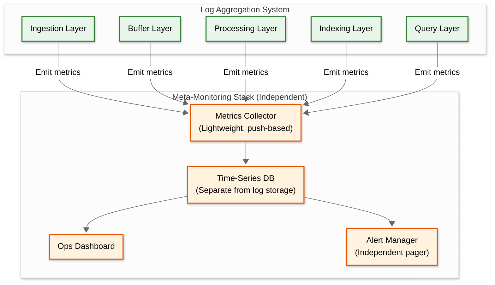

# 15.3 Observability

## The Meta-Observability Challenge

A log aggregation system presents a unique observability paradox: it *is* the observability infrastructure. When the log system itself has a problem, the logs that would normally help debug that problem are the ones being affected. This creates a circular dependency that must be broken through careful architectural separation.

### Principle: The Observer Must Be Independent of the Observed

The log system's own health monitoring must use a **separate, simpler, independent monitoring stack** that has zero dependency on the log system itself. This "meta-monitoring" system:
- Uses direct metric emission (not logs) to a separate metrics backend
- Has its own alerting pipeline independent of the log-based alerting engine
- Is radically simpler (a lightweight metrics collector + dashboard + pager integration)
- Is provisioned separately with independent capacity

---

## Key Metrics (USE/RED Framework)

### Ingestion Pipeline Metrics

| Metric | Type | Description | Alert Threshold |
|---|---|---|---|
| `ingestion.events_per_second` | Rate | Total events ingested per second | Sudden drop > 50% (pipeline failure) |
| `ingestion.bytes_per_second` | Rate | Total bytes ingested per second | N/A (informational) |
| `ingestion.agent_buffer_usage_pct` | Gauge | Per-agent local disk buffer utilization | > 80% (agents approaching buffer limit) |
| `ingestion.agent_drops_total` | Counter | Events dropped by agents due to buffer overflow | Any non-zero value |
| `ingestion.api_error_rate` | Rate | Percentage of ingestion API requests returning 4xx/5xx | > 1% (client errors), > 0.1% (server errors) |
| `ingestion.api_latency_p99` | Histogram | Ingestion API response latency | > 500 ms |

### Message Queue Metrics

| Metric | Type | Description | Alert Threshold |
|---|---|---|---|
| `queue.consumer_lag` | Gauge | Number of messages behind per consumer group | > 1M messages (warning), > 10M (critical) |
| `queue.consumer_lag_seconds` | Gauge | Estimated seconds of lag (messages / consumption rate) | > 60s (warning), > 300s (critical) |
| `queue.partition_throughput_bytes` | Rate | Per-partition ingestion throughput | Any partition > 80% of broker limit |
| `queue.rebalance_events_total` | Counter | Consumer group rebalance count | > 3 in 10 minutes (rebalance storm) |
| `queue.dlq_messages_total` | Counter | Dead letter queue message count | > 100 in 5 minutes (parsing failure) |

### Indexing Metrics

| Metric | Type | Description | Alert Threshold |
|---|---|---|---|
| `indexer.events_indexed_per_second` | Rate | Events successfully indexed per second | Sustained drop > 30% from baseline |
| `indexer.refresh_latency_ms` | Histogram | Time to refresh in-memory buffer to searchable segment | p99 > 15s |
| `indexer.segment_count` | Gauge | Number of segments per shard | > 50 per shard (merge falling behind) |
| `indexer.merge_rate_bytes_per_second` | Rate | Segment merge throughput | Sustained < 50% of ingestion rate |
| `indexer.heap_usage_pct` | Gauge | JVM/process heap utilization | > 85% (approaching OOM) |
| `indexer.wal_size_bytes` | Gauge | Uncommitted WAL size | > 1 GB per shard (flush falling behind) |
| `indexer.type_conflicts_total` | Counter | Field type conflict resolutions | > 100 in 1 hour (schema issue) |

### Search/Query Metrics

| Metric | Type | Description | Alert Threshold |
|---|---|---|---|
| `query.latency_p50` | Histogram | Query latency (hot tier) | > 500 ms |
| `query.latency_p99` | Histogram | Query latency (hot tier) | > 3 s |
| `query.error_rate` | Rate | Percentage of queries returning error | > 1% |
| `query.timeout_rate` | Rate | Percentage of queries timing out | > 0.5% |
| `query.concurrent_queries` | Gauge | Active concurrent queries | > 80% of capacity |
| `query.scanned_bytes_per_query` | Histogram | Data volume scanned per query | p99 > 5 GB (inefficient queries) |
| `query.cache_hit_rate` | Rate | Query result cache hit percentage | < 20% (caching ineffective) |
| `query.partial_result_rate` | Rate | Queries returning partial results (shard unavailability) | > 0.1% |

### Storage Metrics

| Metric | Type | Description | Alert Threshold |
|---|---|---|---|
| `storage.hot_tier_usage_pct` | Gauge | Hot tier disk utilization | > 80% (warning), > 90% (critical) |
| `storage.warm_tier_usage_pct` | Gauge | Warm tier disk utilization | > 85% |
| `storage.cold_tier_size_bytes` | Gauge | Total cold tier data in object storage | Informational (cost tracking) |
| `storage.tier_transition_lag_hours` | Gauge | Delay in hot->warm->cold transitions | > 24 hours (lifecycle falling behind) |
| `storage.compression_ratio` | Gauge | Current compression ratio (raw / compressed) | < 5x (compression degraded) |
| `storage.cost_per_gb_month` | Gauge | Blended storage cost per GB per month | > $0.75 (cost target exceeded) |

### PII Redaction Metrics

| Metric | Type | Description | Alert Threshold |
|---|---|---|---|
| `pii.events_scanned_per_second` | Rate | Events processed by PII pipeline | Divergence from ingestion rate (PII pipeline Slowest part of the process) |
| `pii.detections_per_second` | Rate | PII instances detected and redacted | Sudden spike (service logging new PII) |
| `pii.detection_latency_p99` | Histogram | PII processing latency per event | > 10 ms (becoming a Slowest part of the process) |
| `pii.false_positive_rate` | Rate | PII patterns incorrectly redacting non-PII | > 5% (pattern too aggressive) |

---

## Dashboard Design

### Operations Dashboard (Primary)

```
┌─────────────────────────────────────────────────────────────────┐
│                    LOG SYSTEM HEALTH                            │
├──────────────────┬──────────────────┬──────────────────────────┤
│ Ingestion Rate   │ Consumer Lag     │ Search Latency p99       │
│ ████████ 420K/s  │ ░░░░░░░░ 12s    │ ████░░░░ 1.2s            │
│ (target: >100K)  │ (target: <60s)   │ (target: <3s)            │
├──────────────────┴──────────────────┴──────────────────────────┤
│                                                                 │
│ Ingestion Rate (24h)           Events by Severity (1h)          │
│ ▓▓▓▓▓▓▓▓▓▓▓▓▓▓▓▓▓▓▓▓▓▓▓▓     ERROR: ██░░░░░░░░ 5%           │
│ ▓▓▓▓▓▓▓▓████████▓▓▓▓▓▓▓▓     WARN:  ████░░░░░░ 12%          │
│ ▓▓▓▓████████████████▓▓▓▓     INFO:  ████████░░ 65%           │
│ ████████████████████████     DEBUG: ██████████ 18%            │
│                                                                 │
├──────────────────┬──────────────────┬──────────────────────────┤
│ Storage (Hot)    │ Queue Depth      │ Active Queries            │
│ ████████░░ 78%   │ ░░░░░░░░░░ 45K  │ ██░░░░░░░░ 23/200        │
│ 9.4 TB / 12 TB  │ (cap: 10M)       │                           │
├──────────────────┴──────────────────┴──────────────────────────┤
│                                                                 │
│ Top Data Streams by Volume (1h)     PII Detections (1h)         │
│ 1. payment-api     ████ 45K/s       Emails:      342           │
│ 2. order-service   ███░ 32K/s       Phone:       56            │
│ 3. gateway         ██░░ 28K/s       API Keys:    12 ⚠️        │
│ 4. auth-service    ██░░ 25K/s       Credit Card: 3  🚨        │
│ 5. inventory       █░░░ 18K/s       JWT Tokens:  89            │
│                                                                 │
└─────────────────────────────────────────────────────────────────┘
```

### Cost Dashboard

```
┌─────────────────────────────────────────────────────────────────┐
│                    COST OVERVIEW (Monthly)                      │
├──────────────────┬──────────────────┬──────────────────────────┤
│ Total Cost       │ Cost per GB      │ Ingested Volume           │
│ $24,350/month    │ $0.38/GB         │ 510 TB/month              │
├──────────────────┴──────────────────┴──────────────────────────┤
│                                                                 │
│ Cost by Tier           Cost by Tenant (Top 5)                   │
│ Hot:    ████████ $12K   team-payments:  ████ $5.2K              │
│ Warm:   ███░░░░░ $6K    team-orders:    ███░ $4.1K              │
│ Cold:   ██░░░░░░ $4K    team-platform:  ██░░ $3.8K              │
│ Frozen: █░░░░░░░ $1.5K  team-security:  ██░░ $3.2K              │
│ Compute:█░░░░░░░ $0.85K team-analytics: █░░░ $2.1K              │
│                                                                 │
│ Optimization Opportunities:                                     │
│ ⚡ team-debug streams: 18TB/mo at DEBUG level (→ sample 10%)   │
│ ⚡ health-check logs: 8TB/mo (→ drop at collector)              │
│ ⚡ warm tier underused: 45% utilization (→ extend hot retention) │
│                                                                 │
└─────────────────────────────────────────────────────────────────┘
```

---

## Logging Strategy (For the Log System Itself)

### What to Log

| Component | Log Level | What to Log |
|---|---|---|
| **Ingestion API** | INFO | Request count summaries (per minute, not per request); rate limit activations |
| **Ingestion API** | ERROR | Failed ingestion batches; authentication failures; malformed events |
| **Queue Consumer** | WARN | Rebalance events; consumer lag threshold crossings |
| **Queue Consumer** | ERROR | Deserialization failures; dead-letter queue routing |
| **Indexer** | INFO | Segment creation/merge events; tier transition completions |
| **Indexer** | WARN | Type conflicts; WAL size warnings; merge falling behind |
| **Indexer** | ERROR | WAL corruption; segment creation failure; OOM circuit breaker activation |
| **Query Engine** | INFO | Slow queries (> 5s); queries scanning > 1GB |
| **Query Engine** | WARN | Partial results (shard unavailability); query timeouts |
| **Query Engine** | ERROR | Query execution failures; resource limit exceeded |
| **PII Redaction** | INFO | Redaction rate summaries (per minute) |
| **PII Redaction** | WARN | New PII patterns detected (service logging PII it shouldn't) |
| **Lifecycle Manager** | INFO | Tier transitions; shard rollovers; retention deletions |

### Critical Rule: Avoid Log Amplification

The log system's own logs must be carefully controlled to avoid a **positive feedback loop**: if the log system logs every event it processes, those logs are ingested by the log system, which logs those events, which are ingested...

**Mitigation**:
- The log system's own logs are emitted to the **meta-monitoring stack**, not to itself
- Summary metrics (counts, rates, histograms) preferred over per-event logs
- Structured logging with severity-based sampling: DEBUG=0.1%, INFO=10%, WARN+=100%

---

## Distributed Tracing

### Trace Propagation

```
Incoming log event carries trace_id and span_id from the originating application.
The log system itself creates its own spans for processing visibility:

Trace: Log Event Processing Pipeline
├── Span: ingestion_api.receive (50ms)
│   ├── Span: auth.validate_api_key (2ms)
│   └── Span: queue.produce (45ms)
├── Span: processor.parse_and_enrich (15ms)
│   ├── Span: parser.detect_format (1ms)
│   ├── Span: parser.extract_fields (5ms)
│   ├── Span: enricher.add_metadata (3ms)
│   └── Span: pii.scan_and_redact (6ms)
└── Span: indexer.index_event (25ms)
    ├── Span: indexer.tokenize (5ms)
    ├── Span: indexer.add_to_buffer (2ms)
    └── Span: wal.append (18ms)
```

### Key Spans to Instrument

| Span | Critical Attributes | Purpose |
|---|---|---|
| `ingestion_api.receive` | `batch_size`, `tenant_id`, `content_encoding` | End-to-end ingestion latency |
| `queue.produce` | `topic`, `partition`, `batch_bytes` | Queue write latency |
| `processor.parse_and_enrich` | `format_detected`, `fields_extracted`, `enrichments_applied` | Processing pipeline Slowest part of the process |
| `pii.scan_and_redact` | `patterns_checked`, `detections_count` | PII pipeline overhead |
| `indexer.index_event` | `shard_id`, `segment_id`, `buffer_size` | Indexing Slowest part of the process |
| `query.execute` | `query_hash`, `time_range_hours`, `tiers_queried`, `shards_scanned` | Query performance analysis |
| `storage.tier_transition` | `source_tier`, `target_tier`, `shard_size_bytes` | Lifecycle operation latency |

---

## Alerting

### Critical Alerts (Page-Worthy)

| Alert | Condition | Severity | Runbook Action |
|---|---|---|---|
| **Ingestion Pipeline Down** | `ingestion.events_per_second == 0` for > 2 minutes | P1 | Check queue health → check API gateway → check agent connectivity |
| **Consumer Lag Critical** | `queue.consumer_lag_seconds > 300` for > 5 minutes | P1 | Scale indexer pool → check for merge storms → enable degradation Level 2 |
| **Data Loss Detected** | `ingestion.agent_drops_total > 0` sustained | P1 | Check agent disk buffers → increase queue retention → scale ingestion capacity |
| **Hot Tier Disk Critical** | `storage.hot_tier_usage_pct > 95%` | P1 | Emergency force-merge → accelerate tier transitions → increase hot tier capacity |
| **Search Completely Unavailable** | `query.error_rate > 99%` for > 2 minutes | P1 | Check query nodes → check hot storage nodes → verify cluster state |

### Warning Alerts (Non-Urgent)

| Alert | Condition | Severity | Runbook Action |
|---|---|---|---|
| **Consumer Lag Elevated** | `queue.consumer_lag_seconds > 60` for > 10 minutes | P3 | Monitor trend → prepare to scale → investigate root cause (merge storm? slow disk?) |
| **Search Latency Degraded** | `query.latency_p99 > 5s` for > 10 minutes | P3 | Check segment count → check concurrent query load → verify no "query of death" |
| **Merge Falling Behind** | `indexer.segment_count > 30` per shard for > 30 minutes | P3 | Increase merge thread count → verify disk I/O bandwidth → consider refresh interval increase |
| **PII Detection Spike** | `pii.detections_per_second` > 2x baseline | P3 | Investigate source service → likely new logging statement exposing PII → notify data team |
| **Cost Anomaly** | `storage.cost_per_gb_month > $0.75` | P4 | Review top data streams → identify sampling opportunities → check compression ratios |
| **Type Conflict Rate** | `indexer.type_conflicts_total > 100` in 1 hour | P4 | Identify conflicting services → recommend schema standardization |

---

## SLO Tracking & Error Budgets

### Per-Tier SLO Framework

| SLO | Target | Error Budget (30 days) | Measurement Window |
|-----|--------|----------------------|-------------------|
| Ingestion availability | 99.95% | 21.6 minutes downtime | 5-minute rolling |
| Data completeness | 99.99% | 0.01% loss rate | 15-minute rolling |
| Hot-tier search p99 | < 3 seconds | 1% of queries may exceed | 5-minute rolling |
| Warm-tier search p99 | < 15 seconds | 1% may exceed | 5-minute rolling |
| Ingestion-to-searchable p99 | < 15 seconds | 1% may exceed | 5-minute rolling |
| Alert evaluation lag p99 | < 60 seconds | 1% may exceed | 5-minute rolling |

### Error Budget Calculation

```
FUNCTION evaluate_error_budget(slo: SLO, window: Duration) -> ErrorBudgetStatus:
    total_events = count_events(slo.metric, window)
    bad_events = count_events(slo.metric, window, WHERE slo.violation_condition)

    error_rate = bad_events / total_events
    budget_total = (1 - slo.target) * total_events
    budget_remaining = budget_total - bad_events
    budget_remaining_pct = budget_remaining / budget_total * 100

    IF budget_remaining_pct < 10:
        TRIGGER alert("Error budget nearly exhausted", severity=P2)
        RECOMMEND "Freeze non-critical deployments"
    IF budget_remaining_pct < 0:
        TRIGGER alert("Error budget exhausted", severity=P1)
        RECOMMEND "Halt all deployments; focus on reliability"

    RETURN ErrorBudgetStatus(
        remaining_pct = budget_remaining_pct,
        burn_rate = error_rate / (1 - slo.target),  // >1 means burning faster than sustainable
        projected_exhaustion = estimate_exhaustion_date(budget_remaining, burn_rate)
    )
```

### SLO Burn Rate Alerting

| Burn Rate | Window | Meaning | Action |
|-----------|--------|---------|--------|
| **14.4x** | 5 minutes | Budget exhausted in 2 hours at this rate | Page immediately (P1) |
| **6x** | 30 minutes | Budget exhausted in 5 hours | Page (P2) |
| **3x** | 2 hours | Budget exhausted in 10 hours | Alert team (P3) |
| **1x** | 24 hours | Budget exactly on track for exhaustion at window end | Informational dashboard |

---

## Observability Pipeline Architecture



---

## Capacity Forecasting

```
FUNCTION forecast_capacity(metrics_history: TimeSeries, horizon_days: int) -> Forecast:
    // Fit linear regression on daily ingestion volume
    daily_volumes = aggregate_daily(metrics_history["ingestion.bytes_per_second"])
    slope, intercept = linear_regression(daily_volumes)

    projected_daily_volume = slope * (today + horizon_days) + intercept
    projected_hot_tier = projected_daily_volume * hot_retention_days / compression_ratio

    // Compare projected capacity against current limits
    current_hot_capacity = get_current_capacity("hot_tier")
    days_until_full = (current_hot_capacity - current_hot_usage) / (slope / compression_ratio)

    IF days_until_full < 30:
        ALERT "Hot tier projected to be full in {days_until_full} days"
        RECOMMEND "Add {ceil(projected_hot_tier / node_capacity) - current_nodes} storage nodes"

    // Forecast cost
    projected_monthly_cost = (
        projected_hot_tier * hot_cost_per_gb +
        projected_warm_tier * warm_cost_per_gb +
        projected_cold_tier * cold_cost_per_gb +
        compute_cost(projected_daily_volume)
    )

    RETURN Forecast(
        daily_volume = projected_daily_volume,
        hot_tier_size = projected_hot_tier,
        days_until_hot_full = days_until_full,
        monthly_cost = projected_monthly_cost
    )
```

---

## Anomaly Detection on Log Patterns

| Signal | Detection Method | Alert Condition |
|--------|-----------------|-----------------|
| **New log pattern** | Drain algorithm cluster analysis | Pattern not seen in previous 7 days → likely from new deployment |
| **Pattern volume spike** | Per-pattern event rate tracking | Pattern volume > 10x 7-day average → possible error storm |
| **Pattern disappearance** | Expected pattern not observed | Heartbeat pattern not seen for > 5 minutes → service may be down |
| **Severity distribution shift** | Per-service severity ratio tracking | ERROR ratio > 3x baseline → service degradation |
| **Ingestion volume anomaly** | Per-tenant/per-service volume tracking | Volume < 50% or > 200% of 7-day average → data pipeline issue or incident |
| **Query pattern anomaly** | Per-user query frequency and scope | User querying 10x normal streams → possible data exfiltration |

---

## Health Check Dashboard (Meta-Monitoring)

The meta-monitoring dashboard is the single most critical operational tool. It must be hosted independently and load even when the log system is completely down.

```
┌─────────────────────────────────────────────────────────────────┐
│              META-MONITORING: LOG SYSTEM HEALTH                   │
├──────────────────┬──────────────────┬──────────────────────────┤
│ Pipeline Status  │ Error Budget (30d)│ Burn Rate                │
│ ✅ ALL LAYERS OK │ ████████░░ 72%   │ 0.8x (sustainable)       │
├──────────────────┴──────────────────┴──────────────────────────┤
│                                                                 │
│ End-to-End Latency (ingestion → searchable)                     │
│ p50: 3.2s  ████░░░░░░  (target: <5s)                           │
│ p99: 8.7s  ████████░░  (target: <15s)                          │
│                                                                 │
│ Deployment Status:                                              │
│ Last deploy: 2h ago | Canary: healthy | Rollback: not needed    │
│                                                                 │
│ Top 3 Issues (last 1h):                                         │
│ 1. Consumer lag spiked to 45s at 14:23 (auto-recovered)        │
│ 2. Type conflict rate elevated (auth-service v2.3 deployed)    │
│ 3. PII detection: 12 new credit card patterns (payment-api)    │
│                                                                 │
└─────────────────────────────────────────────────────────────────┘
```

---

## Cost Observability

### Per-Tenant Cost Attribution

```
FUNCTION calculate_tenant_cost(tenant_id: string, month: Month) -> TenantCostReport:
    // Ingestion cost: proportional to events ingested
    ingestion_events = count_events(tenant_id, month)
    ingestion_cost = ingestion_events * COST_PER_EVENT_INGESTED

    // Storage cost: proportional to data stored across all tiers
    hot_bytes = get_tenant_storage(tenant_id, "hot", month)
    warm_bytes = get_tenant_storage(tenant_id, "warm", month)
    cold_bytes = get_tenant_storage(tenant_id, "cold", month)
    storage_cost = (hot_bytes * HOT_COST_PER_GB) + (warm_bytes * WARM_COST_PER_GB) + (cold_bytes * COLD_COST_PER_GB)

    // Query cost: proportional to bytes scanned
    query_bytes_scanned = get_query_scan_volume(tenant_id, month)
    query_cost = query_bytes_scanned * COST_PER_GB_SCANNED

    RETURN TenantCostReport(
        tenant_id = tenant_id,
        ingestion_cost = ingestion_cost,
        storage_cost = storage_cost,
        query_cost = query_cost,
        total_cost = ingestion_cost + storage_cost + query_cost,
        optimization_suggestions = generate_suggestions(tenant_id, month)
    )

// Optimization suggestions engine:
// - "team-debug has 18 TB/month at DEBUG level → sample to 10% (save $X/month)"
// - "health-check logs are 8 TB/month and never queried → drop at collector"
// - "team-analytics warm tier is 45% utilized → extend hot retention by 3 days"
// - "service-payments indexes 100% full-text → switch INFO to label-only (save 40%)"
```

### Observability Cost Management

| Strategy | How It Reduces Cost | Expected Savings |
|----------|-------------------|-----------------|
| **Metric cardinality management** | Limit label dimensions on emitted metrics; aggregate low-value labels | 20-40% of metric storage |
| **Sampling self-logs** | Log system's own DEBUG/INFO at 10% sample rate | 80% of self-log volume |
| **Trace sampling** | Head-based sampling at 10% for normal operations; 100% for errors | 90% of trace storage for the log system |
| **Dashboard consolidation** | Merge redundant dashboards; standardize on 3 primary views (ops, cost, SLO) | Reduces query load 50% |
| **Retention tiering for meta-metrics** | 1-minute resolution for 7 days → 5-minute for 30 days → 1-hour for 1 year | 85% of metric storage |
